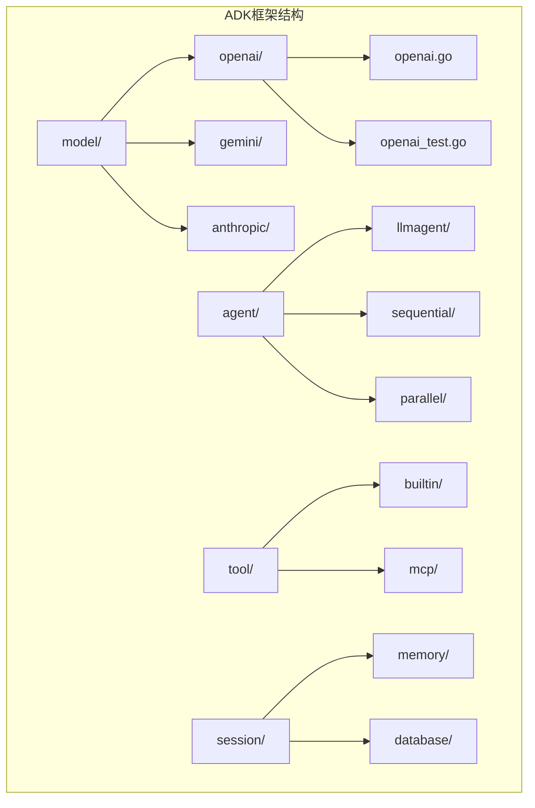
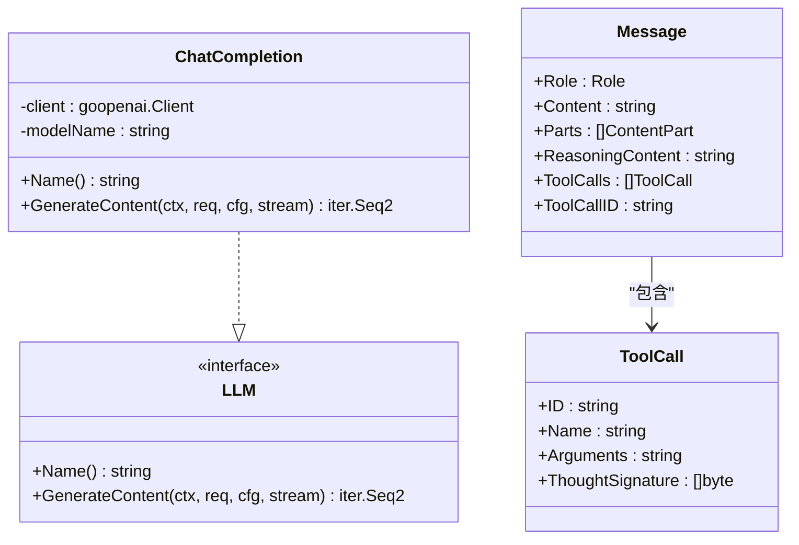
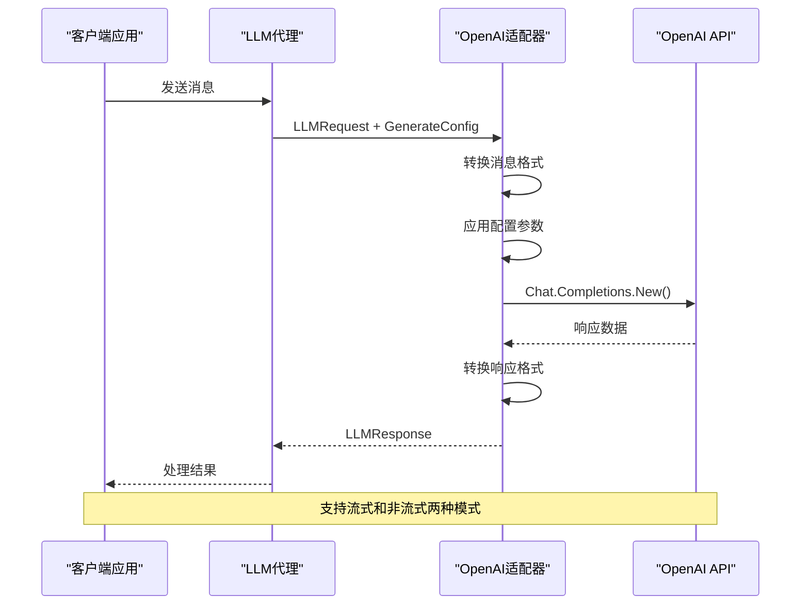
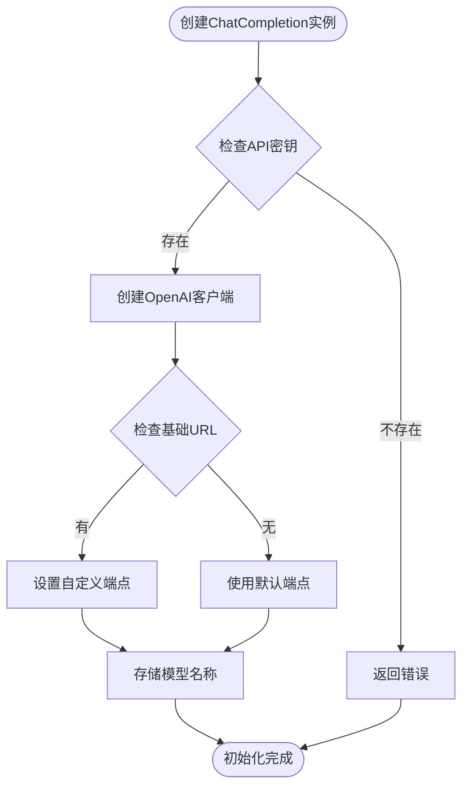
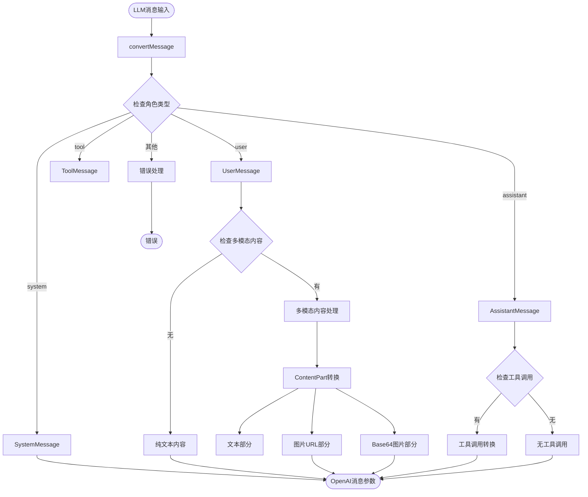
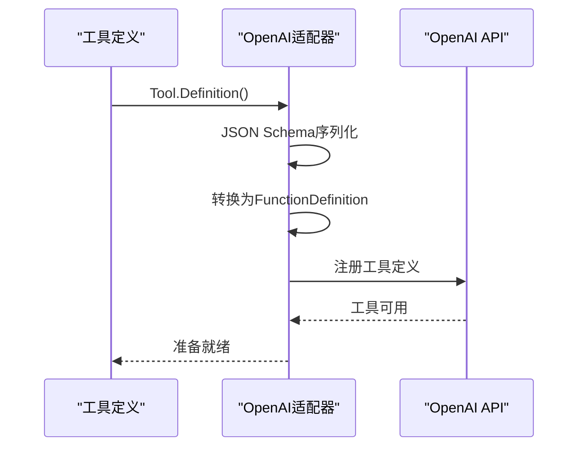
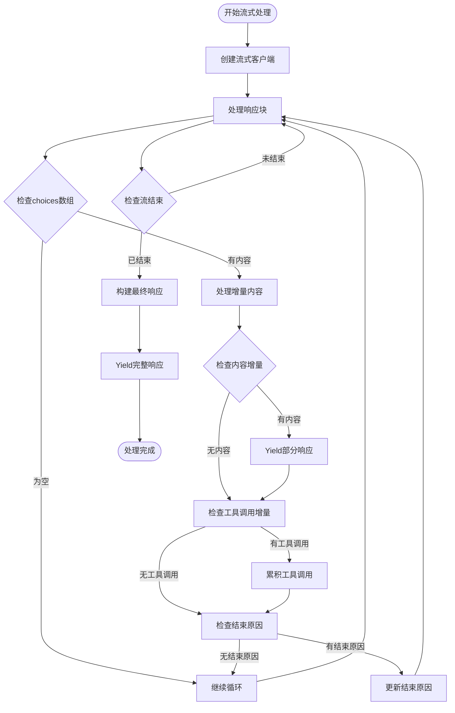
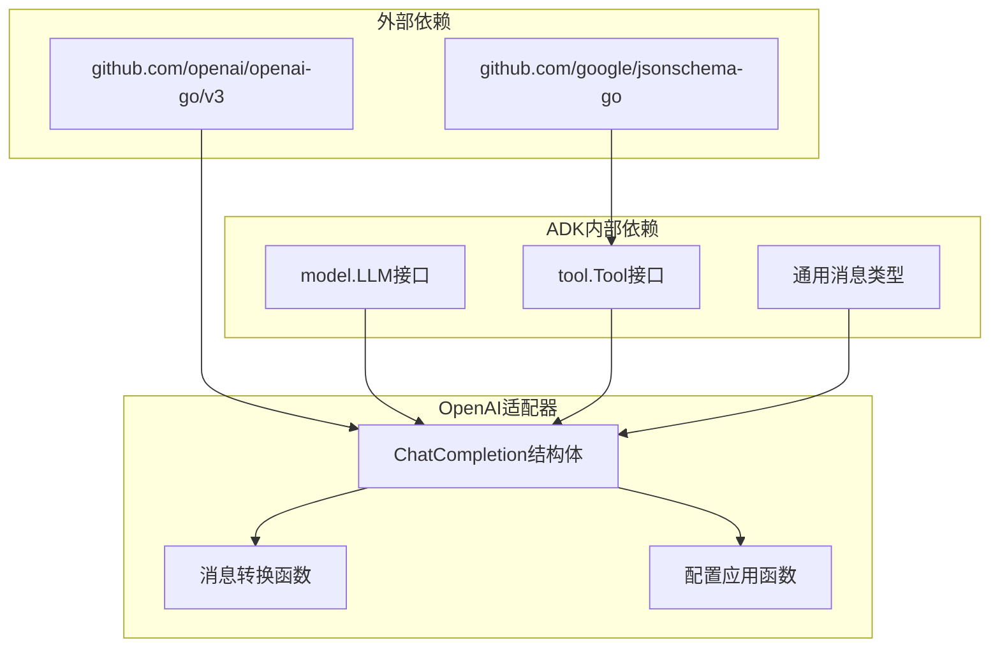

# OpenAI适配器

<cite>
**本文档引用的文件**
- [openai.go](file://model/openai/openai.go)
- [model.go](file://model/model.go)
- [openai_test.go](file://model/openai/openai_test.go)
- [main.go](file://examples/chat/main.go)
- [README.md](file://README.md)
- [tool.go](file://tool/tool.go)
- [session.go](file://session/session.go)
</cite>

## 目录
1. [简介](#简介)
2. [项目结构](#项目结构)
3. [核心组件](#核心组件)
4. [架构概览](#架构概览)
5. [详细组件分析](#详细组件分析)
6. [依赖关系分析](#依赖关系分析)
7. [性能考虑](#性能考虑)
8. [故障排除指南](#故障排除指南)
9. [结论](#结论)
10. [附录](#附录)

## 简介

ADK框架中的OpenAI适配器是一个提供者无关的LLM接口实现，专门用于与OpenAI聊天补全API进行交互。该适配器实现了统一的LLM接口，使得开发者可以无缝地在不同的大语言模型提供商之间切换，而无需修改代理逻辑代码。

OpenAI适配器的核心特性包括：
- 完整的消息格式转换支持（文本、图像、多模态内容）
- 工具调用功能集成
- 流式响应处理机制
- 思维模型和推理努力级别的支持
- 多种认证方式（API密钥、基础URL覆盖）

## 项目结构

ADK框架采用模块化设计，OpenAI适配器位于`model/openai`目录下，与通用模型接口定义在同一层级。



**图表来源**
- [openai.go:1-362](file://model/openai/openai.go#L1-L362)
- [model.go:1-227](file://model/model.go#L1-L227)

**章节来源**
- [README.md:67-89](file://README.md#L67-L89)
- [openai.go:1-362](file://model/openai/openai.go#L1-L362)

## 核心组件

OpenAI适配器的核心是`ChatCompletion`结构体，它实现了`model.LLM`接口。该结构体包含以下关键组件：

### 主要数据结构



**图表来源**
- [openai.go:20-42](file://model/openai/openai.go#L20-L42)
- [model.go:10-18](file://model/model.go#L10-L18)
- [model.go:152-178](file://model/model.go#L152-L178)
- [model.go:130-143](file://model/model.go#L130-L143)

### 认证配置

OpenAI适配器支持多种认证方式：

| 配置项 | 类型 | 必需性 | 默认值 | 描述 |
|--------|------|--------|--------|------|
| API密钥 | string | 必需 | 无 | OpenAI API密钥 |
| 基础URL | string | 可选 | "" | 自定义API端点URL |
| 模型名称 | string | 必需 | 无 | 要使用的具体模型 |

**章节来源**
- [openai.go:25-37](file://model/openai/openai.go#L25-L37)
- [openai_test.go:38-71](file://model/openai/openai_test.go#L38-L71)

## 架构概览

OpenAI适配器在整个ADK框架中扮演着LLM提供者层的角色，负责将通用的LLM请求转换为OpenAI特定的API调用，并将响应转换回通用格式。



**图表来源**
- [openai.go:44-164](file://model/openai/openai.go#L44-L164)
- [model.go:10-18](file://model/model.go#L10-L18)

## 详细组件分析

### ChatCompletion结构体实现

`ChatCompletion`是OpenAI适配器的核心实现，它封装了OpenAI客户端并实现了LLM接口。

#### 初始化过程



**图表来源**
- [openai.go:28-37](file://model/openai/openai.go#L28-L37)

#### GenerateContent方法

`GenerateContent`方法是适配器的核心，支持两种工作模式：流式和非流式。

**章节来源**
- [openai.go:44-164](file://model/openai/openai.go#L44-L164)

### 消息格式转换

OpenAI适配器实现了完整的消息格式转换，支持多种角色和内容类型：



**图表来源**
- [openai.go:167-243](file://model/openai/openai.go#L167-L243)

**章节来源**
- [openai.go:167-243](file://model/openai/openai.go#L167-L243)

### 工具调用支持

OpenAI适配器完全支持函数调用功能，通过工具定义和执行实现智能代理行为。

#### 工具定义转换



**图表来源**
- [openai.go:245-277](file://model/openai/openai.go#L245-L277)

**章节来源**
- [openai.go:245-277](file://model/openai/openai.go#L245-L277)

### 流式响应处理

OpenAI适配器实现了完整的流式响应处理机制，支持实时内容传输。



**图表来源**
- [openai.go:89-164](file://model/openai/openai.go#L89-L164)

**章节来源**
- [openai.go:89-164](file://model/openai/openai.go#L89-L164)

### 推理和思维模型支持

OpenAI适配器提供了对推理模型和思维功能的完整支持，包括推理努力级别控制。

#### 推理配置映射

| 配置选项 | OpenAI参数 | 兼容提供者 | 描述 |
|----------|------------|------------|------|
| ReasoningEffort | reasoning_effort | OpenAI | 显式的推理努力级别 |
| EnableThinking | enable_thinking | DeepSeek/Qwen | 布尔开关思维功能 |
| ThinkingBudget | provider-specific | Gemini | 思维预算限制 |

**章节来源**
- [openai.go:279-304](file://model/openai/openai.go#L279-L304)
- [openai_test.go:150-200](file://model/openai/openai_test.go#L150-L200)

## 依赖关系分析

OpenAI适配器的依赖关系相对简洁，主要依赖于OpenAI官方SDK和ADK框架的通用接口。



**图表来源**
- [openai.go:3-17](file://model/openai/openai.go#L3-L17)
- [model.go:1-9](file://model/model.go#L1-L9)

**章节来源**
- [openai.go:3-17](file://model/openai/openai.go#L3-L17)
- [model.go:1-9](file://model/model.go#L1-L9)

## 性能考虑

OpenAI适配器在设计时充分考虑了性能优化：

### 内存管理
- 使用字符串缓冲区累积流式响应内容
- 工具调用累积使用映射表避免重复分配
- 及时释放流式迭代器资源

### 网络优化
- 支持连接池复用
- 最小化HTTP请求次数
- 智能重试机制

### 缓存策略
- 适配器本身不实现缓存
- 建议在上层实现请求级缓存

## 故障排除指南

### 常见问题及解决方案

#### 认证失败
**症状**: API调用返回401或403错误
**解决方案**:
1. 验证OPENAI_API_KEY环境变量设置
2. 检查API密钥的有效性和权限范围
3. 确认网络连接正常

#### 模型不可用
**症状**: 返回"model not found"或类似错误
**解决方案**:
1. 验证OPENAI_MODEL环境变量设置
2. 检查模型名称拼写是否正确
3. 确认账户订阅包含该模型

#### 流式处理异常
**症状**: 流式响应中断或内容丢失
**解决方案**:
1. 检查网络连接稳定性
2. 实现适当的错误处理和重连逻辑
3. 确保客户端能够处理间歇性网络问题

#### 工具调用失败
**症状**: 工具调用返回错误或无响应
**解决方案**:
1. 验证工具定义的JSON Schema正确性
2. 检查工具实现的输入参数格式
3. 确认工具执行环境的网络访问权限

**章节来源**
- [openai_test.go:223-370](file://model/openai/openai_test.go#L223-L370)

## 结论

ADK框架中的OpenAI适配器提供了一个功能完整、设计优雅的LLM接口实现。它不仅支持标准的聊天补全功能，还提供了丰富的高级特性，包括：

- 完整的消息格式支持（文本、图像、多模态内容）
- 强大的工具调用系统
- 流式响应处理能力
- 推理模型和思维功能支持
- 灵活的配置选项

通过统一的接口设计，开发者可以轻松地在不同的LLM提供商之间切换，同时保持应用代码的一致性。OpenAI适配器的设计体现了ADK框架"提供者无关"的核心理念，为构建生产级AI代理提供了坚实的基础。

## 附录

### 配置示例

#### 基本配置
```go
// 创建OpenAI适配器实例
llm := openai.New(
    os.Getenv("OPENAI_API_KEY"),     // API密钥
    "",                             // 基础URL（可选）
    "gpt-4o-mini"                   // 模型名称
)
```

#### 高级配置
```go
// 配置生成参数
cfg := &model.GenerateConfig{
    Temperature: 0.7,                    // 生成随机性
    MaxTokens: 1000,                     // 最大生成令牌数
    ReasoningEffort: model.ReasoningEffortHigh,  // 推理努力级别
    EnableThinking: boolPtr(true),       // 启用思维功能
    ServiceTier: model.ServiceTierAuto,  // 服务等级
}
```

#### 流式处理示例
```go
// 启用流式响应
for event, err := range llm.GenerateContent(ctx, req, cfg, true) {
    if err != nil {
        // 处理错误
        break
    }
    
    if event.Partial {
        // 处理部分响应（实时显示）
        fmt.Print(event.Message.Content)
    } else {
        // 处理完整响应
        fmt.Println("完整回答:", event.Message.Content)
    }
}
```

**章节来源**
- [openai_test.go:307-324](file://model/openai/openai_test.go#L307-L324)
- [examples/chat/main.go:144-171](file://examples/chat/main.go#L144-L171)