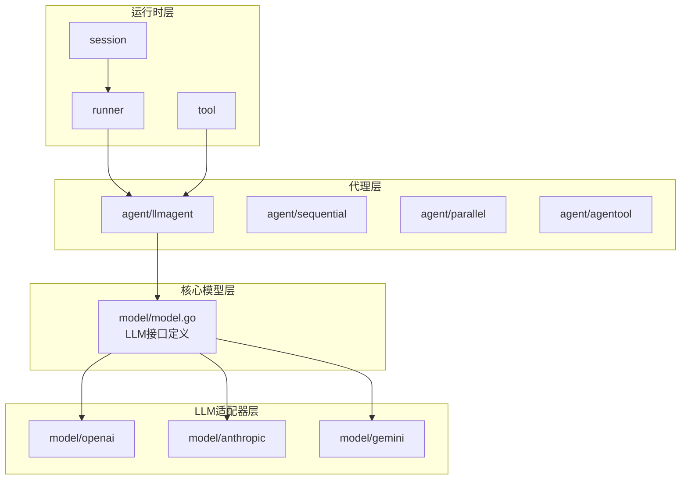
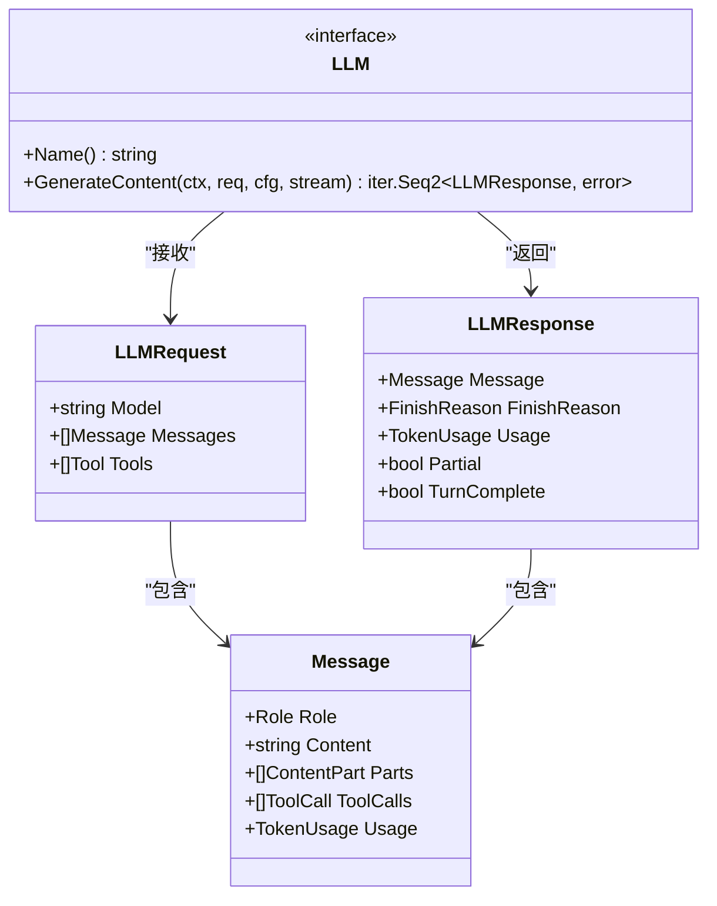
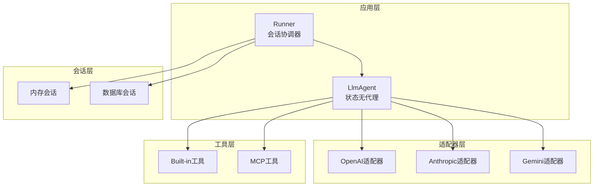
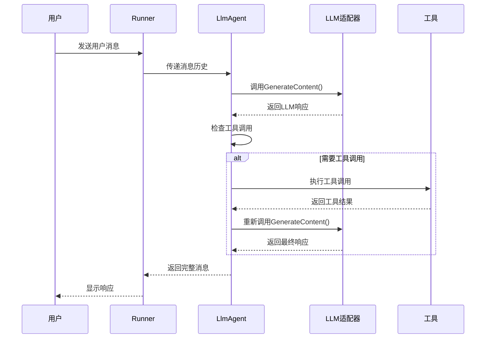
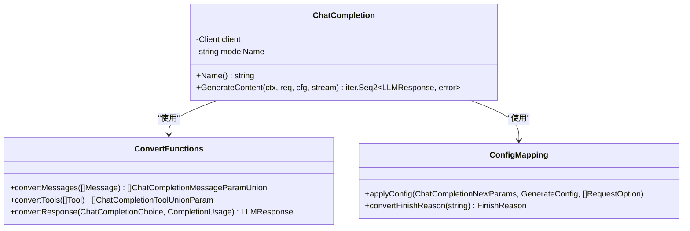
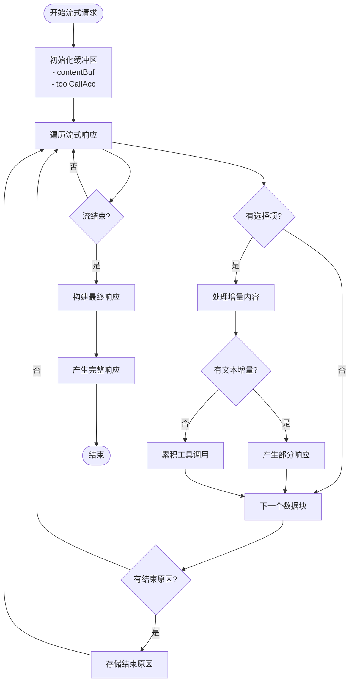
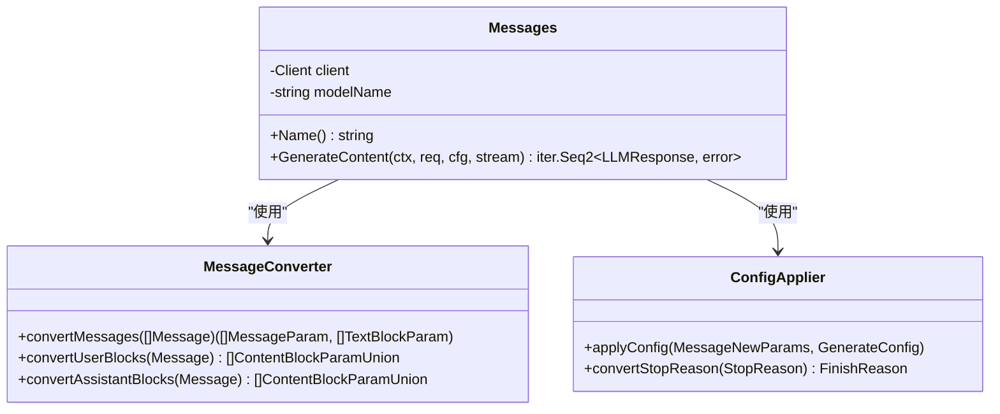
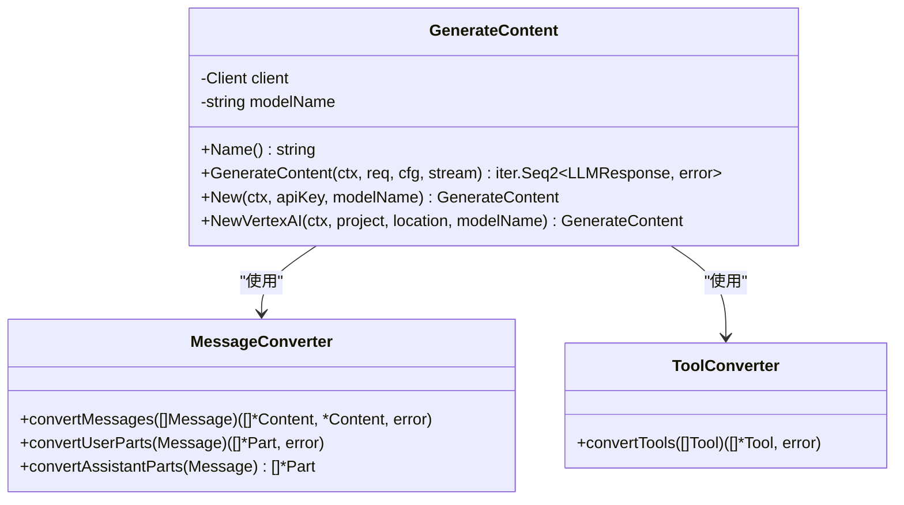
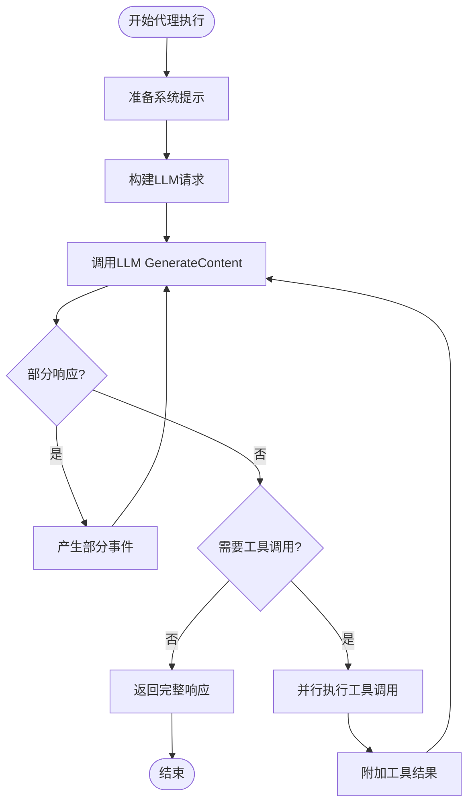
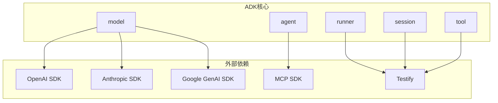

# 自定义LLM适配器开发

<cite>
**本文档引用的文件**
- [README.md](file://README.md)
- [model/model.go](file://model/model.go)
- [model/openai/openai.go](file://model/openai/openai.go)
- [model/anthropic/anthropic.go](file://model/anthropic/anthropic.go)
- [model/gemini/gemini.go](file://model/gemini/gemini.go)
- [agent/llmagent/llmagent.go](file://agent/llmagent/llmagent.go)
- [runner/runner.go](file://runner/runner.go)
- [examples/chat/main.go](file://examples/chat/main.go)
- [go.mod](file://go.mod)
- [model/openai/openai_test.go](file://model/openai/openai_test.go)
- [model/anthropic/anthropic_test.go](file://model/anthropic/anthropic_test.go)
- [model/gemini/gemini_test.go](file://model/gemini/gemini_test.go)
</cite>

## 目录
1. [简介](#简介)
2. [项目结构](#项目结构)
3. [核心组件](#核心组件)
4. [架构概览](#架构概览)
5. [详细组件分析](#详细组件分析)
6. [依赖关系分析](#依赖关系分析)
7. [性能考虑](#性能考虑)
8. [故障排除指南](#故障排除指南)
9. [结论](#结论)
10. [附录](#附录)

## 简介

ADK（Agent Development Kit）是一个轻量级的Go语言库，专为构建生产就绪的AI代理而设计。该框架的核心优势在于其提供了一个与供应商无关的LLM接口，允许开发者在不修改代理代码的情况下轻松切换不同的大语言模型提供商。

本指南将深入讲解如何为新的大语言模型提供商创建适配器，包括LLM接口的实现要求、认证机制处理、API参数映射、响应格式转换等关键环节。我们将基于现有的OpenAI、Anthropic和Gemini适配器实现，提供完整的开发模板和最佳实践。

## 项目结构

ADK采用模块化的设计，主要包含以下核心包：



**图表来源**
- [model/model.go:10-18](file://model/model.go#L10-L18)
- [model/openai/openai.go:19-42](file://model/openai/openai.go#L19-L42)
- [model/anthropic/anthropic.go:25-45](file://model/anthropic/anthropic.go#L25-L45)
- [model/gemini/gemini.go:17-64](file://model/gemini/gemini.go#L17-L64)

**章节来源**
- [README.md:67-89](file://README.md#L67-L89)
- [go.mod:1-47](file://go.mod#L1-L47)

## 核心组件

### LLM接口定义

ADK的核心是`model.LLM`接口，它定义了所有LLM适配器必须实现的标准方法：



**图表来源**
- [model/model.go:10-18](file://model/model.go#L10-L18)
- [model/model.go:188-212](file://model/model.go#L188-L212)
- [model/model.go:152-178](file://model/model.go#L152-L178)

### 消息和工具系统

ADK提供了强大的消息和工具系统，支持多模态输入和函数调用：

| 组件 | 描述 | 关键特性 |
|------|------|----------|
| **Message** | 单个对话消息 | 支持文本和图像多模态内容 |
| **ContentPart** | 内容部件 | 文本、图片URL、Base64图片 |
| **ToolCall** | 工具调用 | JSON参数编码、思考签名 |
| **TokenUsage** | 令牌使用统计 | 提示、完成、总令牌计数 |
| **FinishReason** | 停止原因 | stop、tool_calls、length、content_filter |

**章节来源**
- [model/model.go:20-28](file://model/model.go#L20-L28)
- [model/model.go:109-128](file://model/model.go#L109-L128)
- [model/model.go:130-143](file://model/model.go#L130-L143)
- [model/model.go:145-150](file://model/model.go#L145-L150)

## 架构概览

ADK采用分层架构设计，实现了清晰的关注点分离：



**图表来源**
- [runner/runner.go:17-24](file://runner/runner.go#L17-L24)
- [agent/llmagent/llmagent.go:30-34](file://agent/llmagent/llmagent.go#L30-L34)
- [README.md:39-59](file://README.md#L39-L59)

### 代理执行流程



**图表来源**
- [runner/runner.go:39-95](file://runner/runner.go#L39-L95)
- [agent/llmagent/llmagent.go:56-135](file://agent/llmagent/llmagent.go#L56-L135)

## 详细组件分析

### OpenAI适配器实现

OpenAI适配器展示了最完整的实现模式，包括流式响应处理：



**图表来源**
- [model/openai/openai.go:19-42](file://model/openai/openai.go#L19-L42)
- [model/openai/openai.go:166-243](file://model/openai/openai.go#L166-L243)
- [model/openai/openai.go:279-304](file://model/openai/openai.go#L279-L304)

#### 认证机制处理

OpenAI适配器支持多种认证方式：

1. **API密钥认证**：通过`option.WithAPIKey()`设置
2. **自定义端点**：通过`option.WithBaseURL()`支持兼容API
3. **环境变量配置**：支持`OPENAI_API_KEY`和`OPENAI_BASE_URL`

#### 流式响应处理

OpenAI适配器实现了完整的流式响应处理逻辑：



**图表来源**
- [model/openai/openai.go:89-163](file://model/openai/openai.go#L89-L163)

**章节来源**
- [model/openai/openai.go:25-37](file://model/openai/openai.go#L25-L37)
- [model/openai/openai.go:44-164](file://model/openai/openai.go#L44-L164)

### Anthropic适配器实现

Anthropic适配器展示了不同的实现风格，更注重配置映射：



**图表来源**
- [model/anthropic/anthropic.go:25-45](file://model/anthropic/anthropic.go#L25-L45)
- [model/anthropic/anthropic.go:95-147](file://model/anthropic/anthropic.go#L95-L147)
- [model/anthropic/anthropic.go:242-260](file://model/anthropic/anthropic.go#L242-L260)

#### 特殊处理逻辑

Anthropic适配器具有独特的处理逻辑：

1. **系统提示处理**：将系统消息提取到顶层`system`参数
2. **工具调用映射**：支持`thinking`模式下的工具调用
3. **思考配置**：通过`ThinkingConfig`控制推理过程

**章节来源**
- [model/anthropic/anthropic.go:95-147](file://model/anthropic/anthropic.go#L95-L147)
- [model/anthropic/anthropic.go:242-260](file://model/anthropic/anthropic.go#L242-L260)

### Gemini适配器实现

Gemini适配器提供了最复杂的实现，支持多种后端：



**图表来源**
- [model/gemini/gemini.go:17-64](file://model/gemini/gemini.go#L17-L64)
- [model/gemini/gemini.go:203-268](file://model/gemini/gemini.go#L203-L268)
- [model/gemini/gemini.go:326-351](file://model/gemini/gemini.go#L326-L351)

#### 多后端支持

Gemini适配器支持两种后端：

1. **Gemini API**：直接使用Google Gemini API
2. **Vertex AI**：通过Google Cloud Vertex AI后端

**章节来源**
- [model/gemini/gemini.go:23-59](file://model/gemini/gemini.go#L23-L59)
- [model/gemini/gemini.go:203-268](file://model/gemini/gemini.go#L203-L268)

### 代理执行引擎

LlmAgent实现了完整的工具调用循环：



**图表来源**
- [agent/llmagent/llmagent.go:56-135](file://agent/llmagent/llmagent.go#L56-L135)

**章节来源**
- [agent/llmagent/llmagent.go:56-135](file://agent/llmagent/llmagent.go#L56-L135)

## 依赖关系分析

ADK的依赖关系相对简洁，主要依赖于各供应商的官方SDK：



**图表来源**
- [go.mod:5-15](file://go.mod#L5-L15)

### 适配器间对比

| 特性 | OpenAI | Anthropic | Gemini |
|------|--------|-----------|--------|
| **流式支持** | ✅ 完整实现 | ❌ 未实现 | ✅ 完整实现 |
| **思考模式** | ✅ 支持 | ✅ 支持 | ✅ 支持 |
| **多模态** | ✅ 支持 | ✅ 支持 | ✅ 支持 |
| **工具调用** | ✅ 支持 | ✅ 支持 | ✅ 支持 |
| **认证方式** | API Key | API Key | API Key/ADC |
| **复杂度** | 中等 | 低 | 高 |

**章节来源**
- [go.mod:5-15](file://go.mod#L5-L15)

## 性能考虑

### 流式响应优化

所有适配器都实现了流式响应处理，这有助于提升用户体验：

1. **实时显示**：部分响应可以立即显示给用户
2. **内存效率**：避免等待完整响应后再处理
3. **网络优化**：减少等待时间，提高吞吐量

### 并行工具执行

LlmAgent使用WaitGroup实现工具调用的并行执行：

```go
// 并行执行工具调用
var wg sync.WaitGroup
for i, tc := range completeResp.Message.ToolCalls {
    wg.Add(1)
    go func(i int, tc ToolCall) {
        defer wg.Done()
        toolMsgs[i] = a.runToolCall(ctx, tc)
    }(i, tc)
}
wg.Wait()
```

### 缓存和重试策略

虽然当前实现没有内置缓存机制，但可以通过以下方式优化：

1. **请求去重**：对相同输入的消息进行缓存
2. **指数退避**：对API限流进行重试
3. **连接池**：复用HTTP连接

## 故障排除指南

### 常见问题诊断

#### 认证失败

```go
// 检查API密钥是否正确设置
apiKey := os.Getenv("OPENAI_API_KEY")
if apiKey == "" {
    return nil, fmt.Errorf("OPENAI_API_KEY is required")
}
```

#### 请求超时

```go
// 设置合理的超时时间
ctx, cancel := context.WithTimeout(context.Background(), 30*time.Second)
defer cancel()

// 在适配器中使用上下文
resp, err := client.Chat.Completions.New(ctx, params)
```

#### 流式响应问题

```go
// 检查流式响应是否正确处理
for s.Next() {
    chunk := s.Current()
    if len(chunk.Choices) == 0 {
        continue
    }
    // 处理增量内容...
}
```

### 错误处理最佳实践

1. **包装错误信息**：为每个适配器添加明确的错误前缀
2. **区分网络错误和业务错误**：网络错误应该可重试，业务错误应该直接返回
3. **资源清理**：确保在错误情况下正确清理资源

**章节来源**
- [model/openai/openai.go:48-87](file://model/openai/openai.go#L48-L87)
- [model/anthropic/anthropic.go:50-92](file://model/anthropic/anthropic.go#L50-L92)
- [model/gemini/gemini.go:70-106](file://model/gemini/gemini.go#L70-L106)

## 结论

ADK提供了一个强大而灵活的框架，用于构建AI代理应用。通过标准化的LLM接口和完善的适配器实现，开发者可以轻松地为新的大语言模型提供商创建适配器。

关键成功因素包括：
1. **严格遵循LLM接口规范**
2. **正确的认证机制处理**
3. **完善的错误处理和超时控制**
4. **支持流式响应和工具调用**
5. **充分的测试覆盖**

## 附录

### 开发模板

以下是创建新LLM适配器的模板：

```go
// 新适配器结构
type YourLLM struct {
    client    YourSDKClient
    modelName string
}

// 实现Name方法
func (y *YourLLM) Name() string {
    return y.modelName
}

// 实现GenerateContent方法
func (y *YourLLM) GenerateContent(ctx context.Context, req *model.LLMRequest, cfg *model.GenerateConfig, stream bool) iter.Seq2[*model.LLMResponse, error] {
    return func(yield func(*model.LLMResponse, error) bool) {
        // 1. 转换消息格式
        // 2. 转换工具定义
        // 3. 应用配置参数
        // 4. 发送请求
        // 5. 处理响应
        
        if stream {
            // 处理流式响应
        } else {
            // 处理非流式响应
        }
    }
}

// 辅助函数
func convertMessages(msgs []model.Message) ([]YourMessageParam, error) {
    // 实现消息格式转换
}

func convertTools(tools []tool.Tool) ([]YourToolParam, error) {
    // 实现工具格式转换
}

func applyConfig(params *YourParams, cfg *model.GenerateConfig) {
    // 实现配置参数映射
}
```

### 测试策略

1. **单元测试**：测试消息转换和配置映射
2. **集成测试**：测试实际API调用
3. **流式测试**：验证流式响应处理
4. **错误测试**：模拟各种错误场景

### 部署建议

1. **环境变量管理**：使用环境变量管理API密钥
2. **日志记录**：实现详细的请求和响应日志
3. **监控指标**：收集延迟、错误率等指标
4. **安全考虑**：保护API密钥，限制访问权限