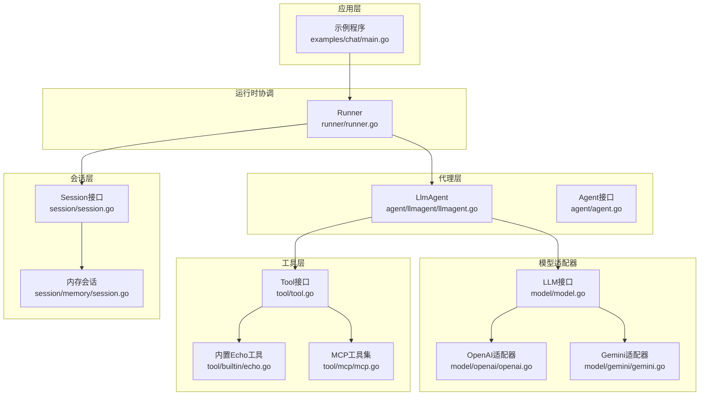
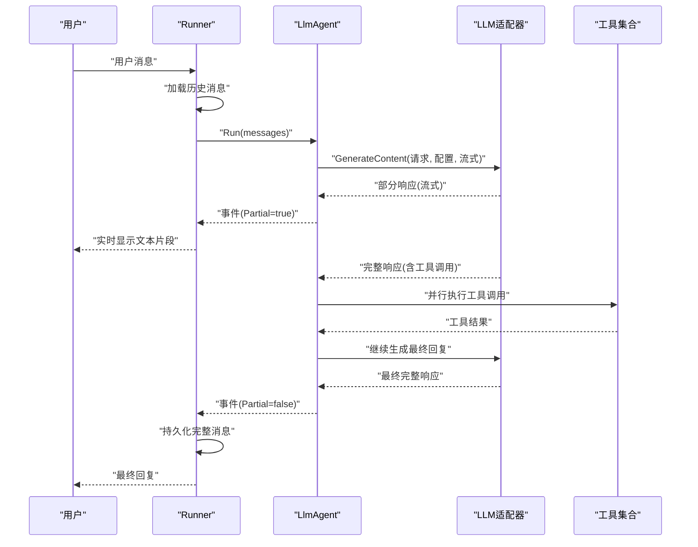
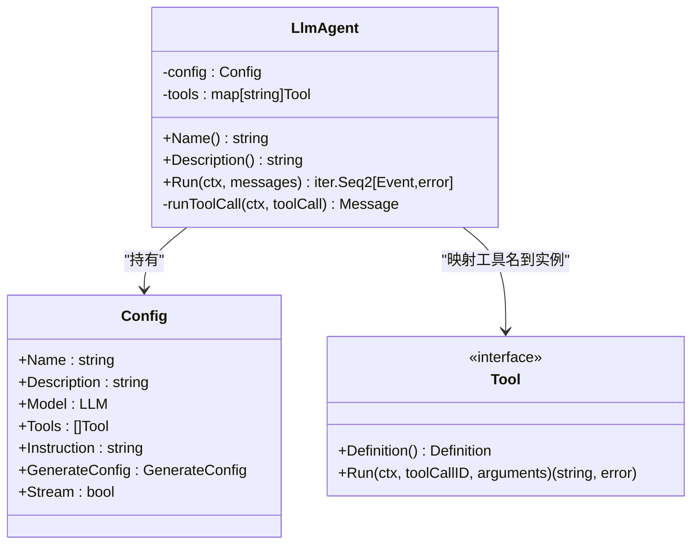
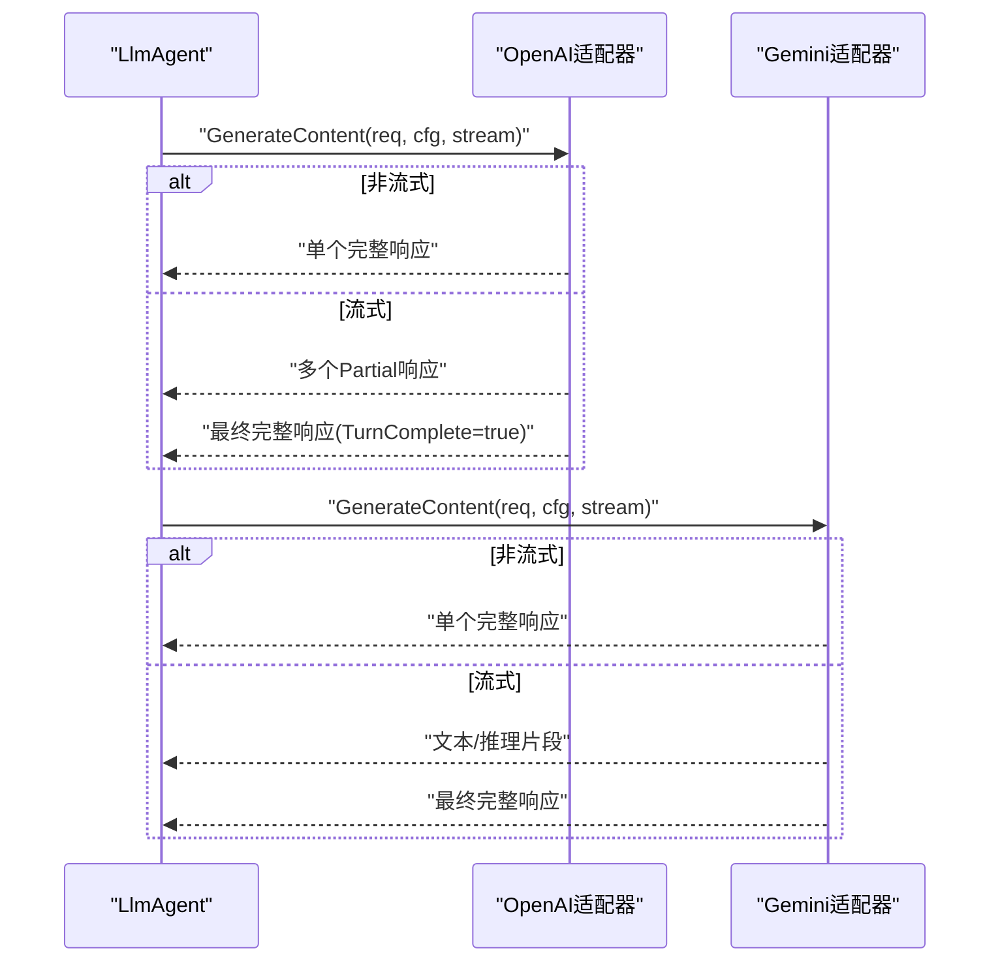
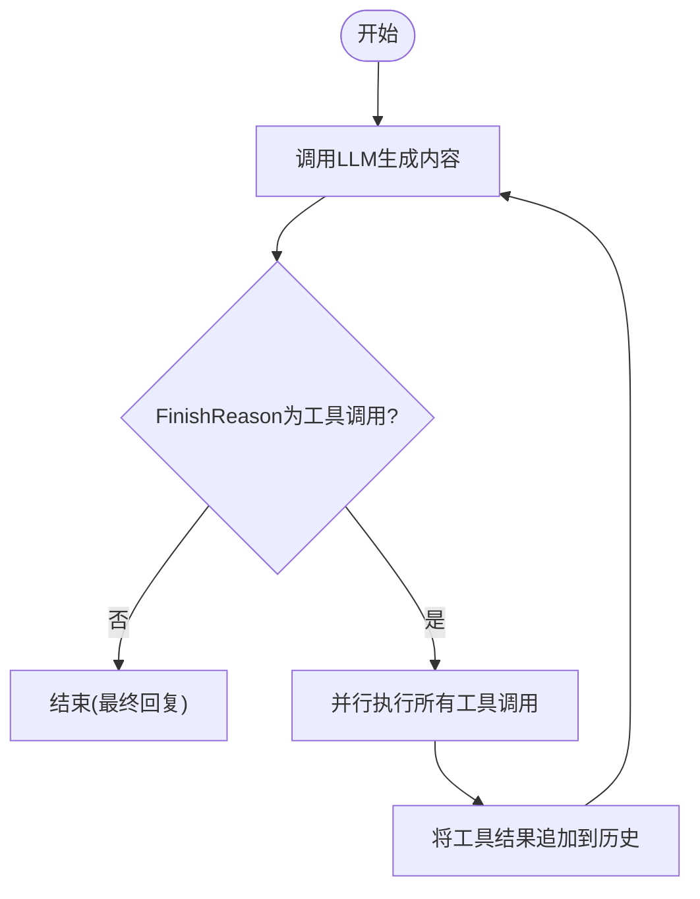
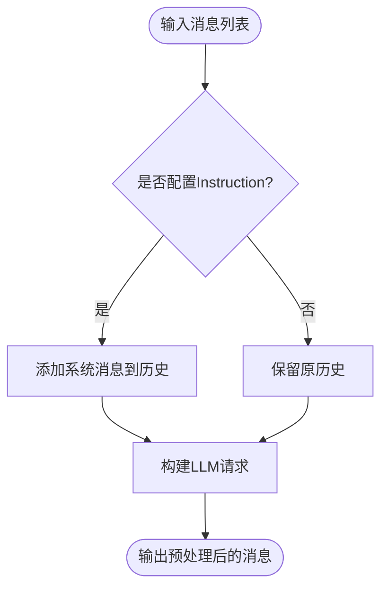
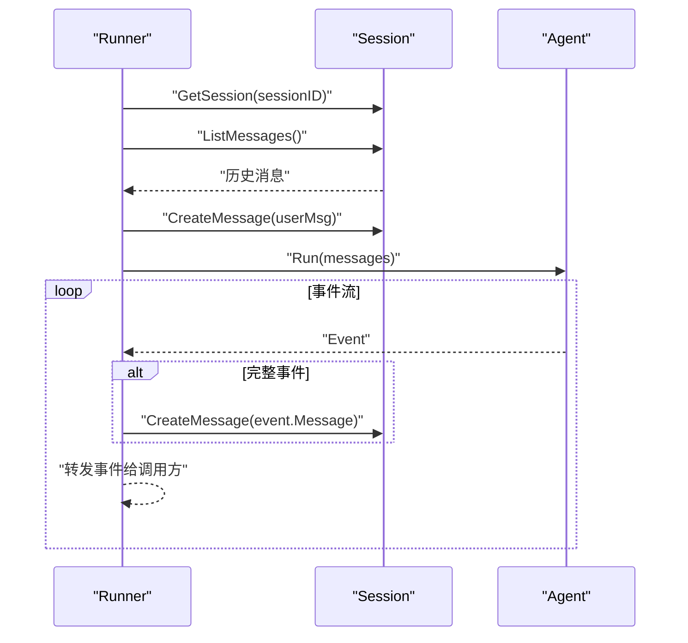
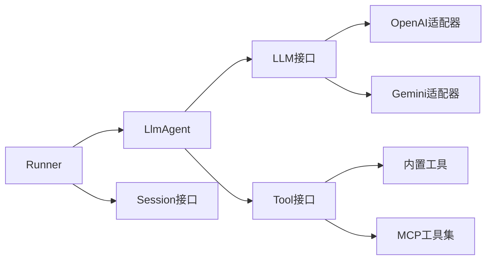

# LLM代理实现

<cite>
**本文档引用的文件**
- [agent.go](file://agent/agent.go)
- [llmagent.go](file://agent/llmagent/llmagent.go)
- [model.go](file://model/model.go)
- [tool.go](file://tool/tool.go)
- [main.go](file://examples/chat/main.go)
- [runner.go](file://runner/runner.go)
- [echo.go](file://tool/builtin/echo.go)
- [openai.go](file://model/openai/openai.go)
- [mcp.go](file://tool/mcp/mcp.go)
- [session.go](file://session/session.go)
- [README.md](file://README.md)
- [gemini.go](file://model/gemini/gemini.go)
- [llmagent_test.go](file://agent/llmagent/llmagent_test.go)
- [memory.go](file://session/memory/session.go)
</cite>

## 目录
1. [简介](#简介)
2. [项目结构](#项目结构)
3. [核心组件](#核心组件)
4. [架构总览](#架构总览)
5. [详细组件分析](#详细组件分析)
6. [依赖关系分析](#依赖关系分析)
7. [性能考虑](#性能考虑)
8. [故障排除指南](#故障排除指南)
9. [结论](#结论)
10. [附录](#附录)

## 简介
本项目是一个轻量级、面向生产的AI代理开发工具包（ADK），专注于提供可插拔的LLM代理实现。本文档深入解析LLM代理的完整实现机制，包括：
- 工具调用循环：从LLM请求到工具执行再到最终回复的完整流程
- 消息预处理：系统提示词注入、工具描述格式化和上下文管理
- 响应生成过程：支持流式输出和非流式输出
- 代理与LLM适配器的交互方式：通过统一的LLM接口解耦不同供应商
- 配置选项：温度、最大令牌数、推理努力度等
- 使用示例与性能优化技巧

## 项目结构
该项目采用分层设计，清晰分离了代理逻辑、会话管理、工具集成和LLM适配器：
- agent：代理接口与具体实现（如LlmAgent）
- model：LLM抽象接口及消息类型定义
- tool：工具接口与内置工具、MCP桥接
- session：会话接口与内存/数据库后端
- runner：协调代理与会话服务，负责消息持久化
- examples：示例程序展示如何组合各组件

**图表来源**
- [main.go:1-181](file://examples/chat/main.go#L1-L181)
- [runner.go:1-108](file://runner/runner.go#L1-L108)
- [llmagent.go:1-159](file://agent/llmagent/llmagent.go#L1-L159)
- [model.go:1-227](file://model/model.go#L1-L227)
- [openai.go:1-362](file://model/openai/openai.go#L1-L362)
- [gemini.go:1-200](file://model/gemini/gemini.go#L1-L200)
- [tool.go:1-24](file://tool/tool.go#L1-L24)
- [echo.go:1-47](file://tool/builtin/echo.go#L1-L47)
- [mcp.go:1-121](file://tool/mcp/mcp.go#L1-L121)
- [session.go:1-24](file://session/session.go#L1-L24)
- [memory.go:1-86](file://session/memory/session.go#L1-L86)

**章节来源**
- [README.md:37-90](file://README.md#L37-L90)
- [main.go:1-181](file://examples/chat/main.go#L1-L181)
- [runner.go:1-108](file://runner/runner.go#L1-L108)
- [llmagent.go:1-159](file://agent/llmagent/llmagent.go#L1-L159)
- [model.go:1-227](file://model/model.go#L1-L227)

## 核心组件
本节概述关键组件及其职责：
- Agent接口：定义代理的名称、描述和Run方法，返回事件迭代器
- LlmAgent：基于LLM的无状态代理，实现工具调用循环
- LLM接口：统一LLM适配器接口，屏蔽不同供应商差异
- Tool接口：工具定义与执行接口，支持JSON Schema输入模式
- Runner：协调代理与会话服务，负责消息加载、持久化和事件转发
- Session接口：会话抽象，支持内存与数据库后端

**章节来源**
- [agent.go:10-20](file://agent/agent.go#L10-L20)
- [llmagent.go:14-46](file://agent/llmagent/llmagent.go#L14-L46)
- [model.go:10-18](file://model/model.go#L10-L18)
- [tool.go:9-24](file://tool/tool.go#L9-L24)
- [runner.go:17-37](file://runner/runner.go#L17-L37)
- [session.go:9-24](file://session/session.go#L9-L24)

## 架构总览
下图展示了从用户输入到最终响应的完整数据流，以及各组件间的交互关系。

**图表来源**
- [runner.go:39-95](file://runner/runner.go#L39-L95)
- [llmagent.go:56-136](file://agent/llmagent/llmagent.go#L56-L136)
- [openai.go:44-164](file://model/openai/openai.go#L44-L164)
- [gemini.go:66-200](file://model/gemini/gemini.go#L66-L200)

## 详细组件分析

### LlmAgent组件分析
LlmAgent是本项目的核心，实现了完整的工具调用循环。其关键特性包括：
- 消息预处理：在每次Run调用时自动注入系统提示词，并保留原始消息历史
- 工具调用循环：当LLM请求工具调用时，代理并行执行所有工具，然后继续生成最终回复
- 流式输出：支持Partial事件用于实时显示文本片段
- 上下文管理：将工具结果追加到消息历史中，供后续生成使用

**图表来源**
- [llmagent.go:14-46](file://agent/llmagent/llmagent.go#L14-L46)
- [llmagent.go:30-46](file://agent/llmagent/llmagent.go#L30-L46)
- [tool.go:17-24](file://tool/tool.go#L17-L24)

**章节来源**
- [llmagent.go:14-159](file://agent/llmagent/llmagent.go#L14-L159)

### LLM适配器交互机制
LLM适配器通过统一的LLM接口与代理交互，当前提供了OpenAI和Gemini两个适配器：
- OpenAI适配器：支持非流式和流式两种模式，正确处理工具调用累积和完成响应
- Gemini适配器：同样支持流式和非流式，额外处理推理内容（ReasoningContent）

**图表来源**
- [openai.go:44-164](file://model/openai/openai.go#L44-L164)
- [gemini.go:66-200](file://model/gemini/gemini.go#L66-L200)

**章节来源**
- [openai.go:19-362](file://model/openai/openai.go#L19-L362)
- [gemini.go:17-200](file://model/gemini/gemini.go#L17-L200)

### 工具调用循环工作原理
工具调用循环是LlmAgent的核心逻辑，包含以下步骤：
1. 生成LLM响应（可能包含工具调用）
2. 如果FinishReason为工具调用，则并行执行所有工具
3. 将工具结果作为工具消息追加到历史
4. 继续生成最终回复
5. 循环直到没有工具调用

**图表来源**
- [llmagent.go:78-136](file://agent/llmagent/llmagent.go#L78-L136)

**章节来源**
- [llmagent.go:78-136](file://agent/llmagent/llmagent.go#L78-L136)

### 消息预处理逻辑
消息预处理确保每次对话都有正确的上下文：
- 系统提示词注入：当配置了Instruction时，在历史消息前插入系统消息
- 历史消息保留：保持用户之前的完整对话历史
- 工具描述格式化：将工具定义转换为LLM可用的函数调用描述

**图表来源**
- [llmagent.go:62-76](file://agent/llmagent/llmagent.go#L62-L76)
- [openai.go:245-277](file://model/openai/openai.go#L245-L277)

**章节来源**
- [llmagent.go:62-76](file://agent/llmagent/llmagent.go#L62-L76)
- [openai.go:245-277](file://model/openai/openai.go#L245-L277)

### Runner与会话管理
Runner负责将代理与会话服务连接起来：
- 加载会话历史并构建消息数组
- 追加用户输入并持久化
- 转发事件给调用方，仅持久化完整事件
- 使用Snowflake ID为消息分配唯一标识

**图表来源**
- [runner.go:39-95](file://runner/runner.go#L39-L95)
- [memory.go:30-62](file://session/memory/session.go#L30-L62)

**章节来源**
- [runner.go:17-108](file://runner/runner.go#L17-L108)
- [session.go:9-24](file://session/session.go#L9-L24)
- [memory.go:12-86](file://session/memory/session.go#L12-L86)

## 依赖关系分析
组件间的依赖关系如下：
- LlmAgent依赖LLM接口和Tool接口，实现无状态代理
- Runner依赖Agent接口和Session接口，协调消息持久化
- LLM适配器实现LLM接口，向代理提供统一的生成能力
- 工具通过Tool接口暴露，支持内置工具和MCP工具集

**图表来源**
- [llmagent.go:9-12](file://agent/llmagent/llmagent.go#L9-L12)
- [runner.go:10-15](file://runner/runner.go#L10-L15)
- [model.go:10-18](file://model/model.go#L10-L18)
- [tool.go:17-24](file://tool/tool.go#L17-L24)

**章节来源**
- [llmagent.go:9-12](file://agent/llmagent/llmagent.go#L9-L12)
- [runner.go:10-15](file://runner/runner.go#L10-L15)
- [model.go:10-18](file://model/model.go#L10-L18)
- [tool.go:17-24](file://tool/tool.go#L17-L24)

## 性能考虑
- 并行工具执行：LlmAgent使用WaitGroup并行执行多个工具调用，显著减少总等待时间
- 流式输出：通过Partial事件实现实时显示，提升用户体验
- 内存会话：内存后端适合测试和单进程场景，避免磁盘I/O开销
- 推理内容传递：ReasoningContent在代理层透传，便于调试和审计
- 最大令牌数限制：通过GenerateConfig控制生成长度，防止过度消耗

**章节来源**
- [llmagent.go:116-127](file://agent/llmagent/llmagent.go#L116-L127)
- [model.go:67-84](file://model/model.go#L67-L84)
- [memory.go:12-86](file://session/memory/session.go#L12-L86)

## 故障排除指南
常见问题与解决方案：
- OPENAI_API_KEY缺失：示例程序要求设置环境变量，否则直接退出
- MCP连接失败：检查网络连通性和API密钥配置
- 工具未找到：确认工具名称与定义一致，且已正确注册到代理
- 流式输出异常：检查适配器的流式实现是否正确处理Partial事件
- 会话持久化错误：确认会话服务初始化成功，消息ID生成正常

**章节来源**
- [main.go:55-60](file://examples/chat/main.go#L55-L60)
- [mcp.go:36-43](file://tool/mcp/mcp.go#L36-L43)
- [llmagent.go:139-158](file://agent/llmagent/llmagent.go#L139-L158)
- [openai.go:89-142](file://model/openai/openai.go#L89-L142)
- [runner.go:98-107](file://runner/runner.go#L98-L107)

## 结论
本项目通过清晰的分层设计和统一的接口抽象，成功实现了可插拔的LLM代理系统。LlmAgent的工具调用循环、消息预处理和流式输出机制，配合灵活的会话管理和多供应商适配器支持，为构建生产级AI代理提供了坚实基础。建议在实际部署中结合业务需求调整生成配置、优化工具执行策略，并根据负载情况选择合适的会话后端。

## 附录

### LLM代理配置选项
- 温度（Temperature）：控制随机性，默认值为0（由适配器决定）
- 最大令牌数（MaxTokens）：限制生成长度，0表示使用适配器默认值
- 推理努力度（ReasoningEffort）：控制模型推理深度
- 服务等级（ServiceTier）：指定处理优先级
- 启用推理（EnableThinking）：布尔开关，某些适配器需要此参数

**章节来源**
- [model.go:67-84](file://model/model.go#L67-L84)
- [openai.go:279-304](file://model/openai/openai.go#L279-L304)

### 使用示例
完整的聊天示例展示了如何：
- 创建OpenAI LLM实例
- 连接MCP工具集并加载工具
- 初始化LlmAgent并创建Runner
- 实现用户输入循环与事件处理

**章节来源**
- [main.go:52-177](file://examples/chat/main.go#L52-L177)

### 测试与验证
单元测试覆盖了：
- 简单文本对话与指令注入
- 工具调用循环的正确性
- 流式输出的顺序与完整性
- 并行工具执行的性能优势
- 推理内容的透传行为

**章节来源**
- [llmagent_test.go:156-320](file://agent/llmagent/llmagent_test.go#L156-L320)
- [llmagent_test.go:449-580](file://agent/llmagent/llmagent_test.go#L449-L580)
- [llmagent_test.go:582-672](file://agent/llmagent/llmagent_test.go#L582-L672)