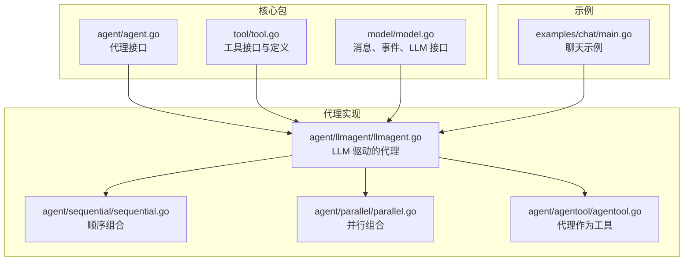
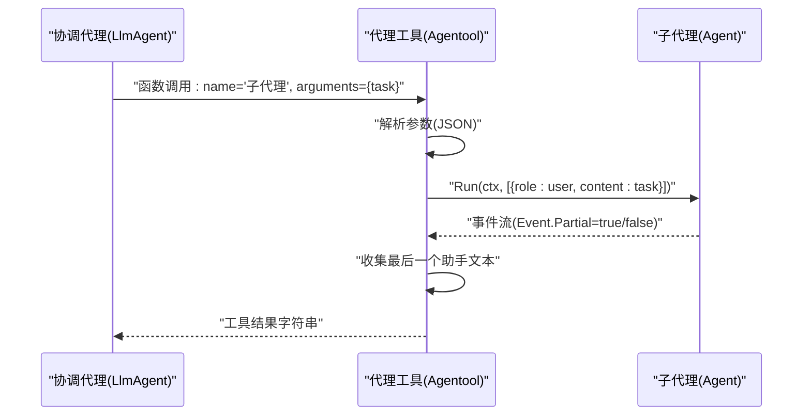
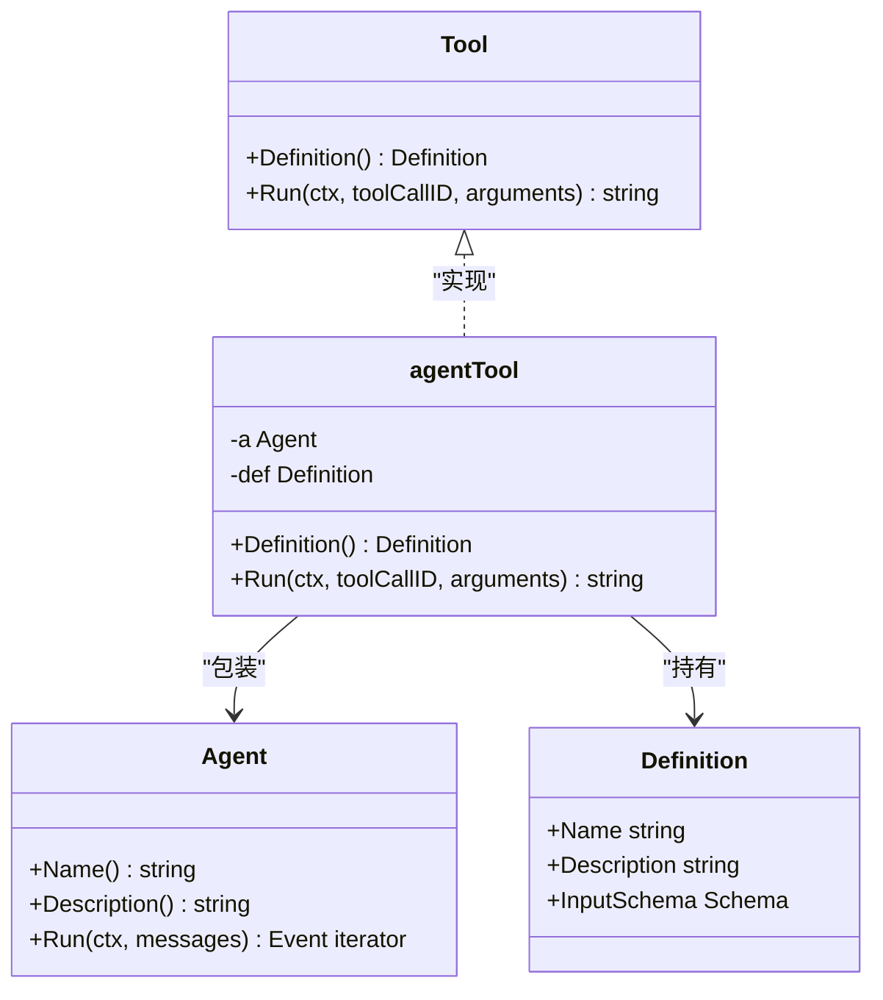
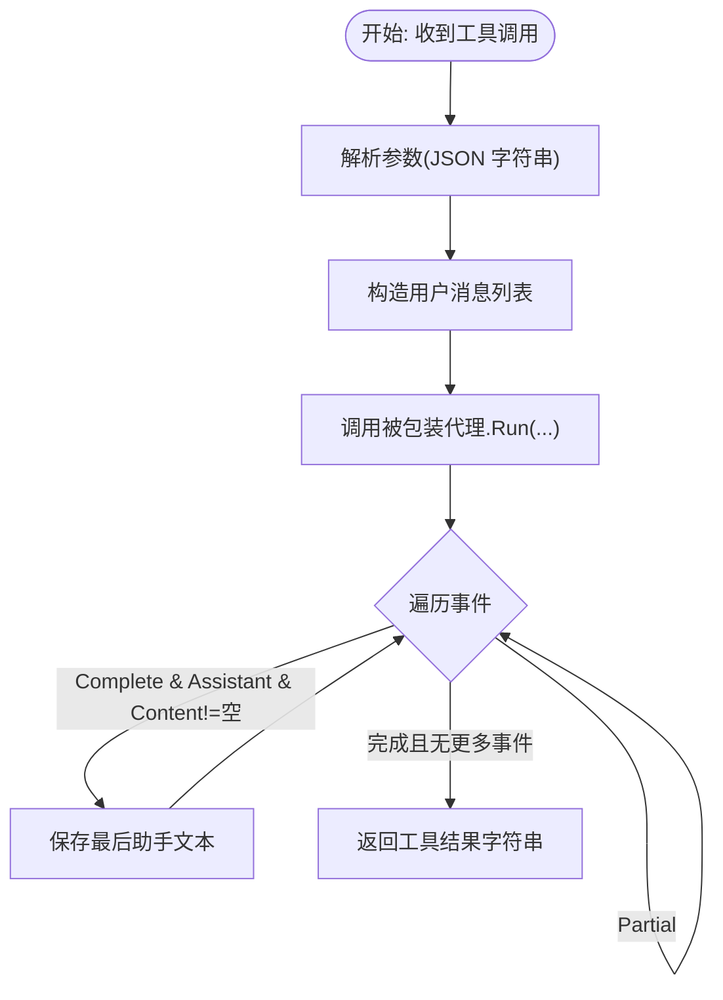
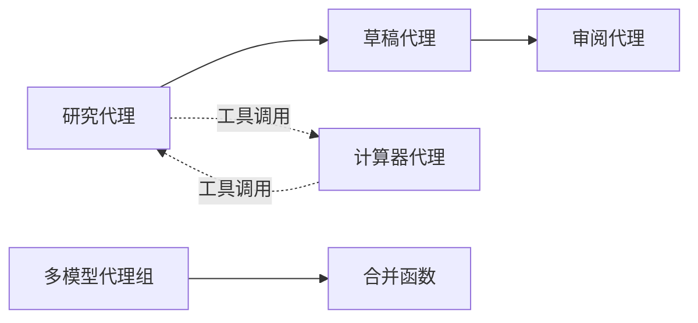
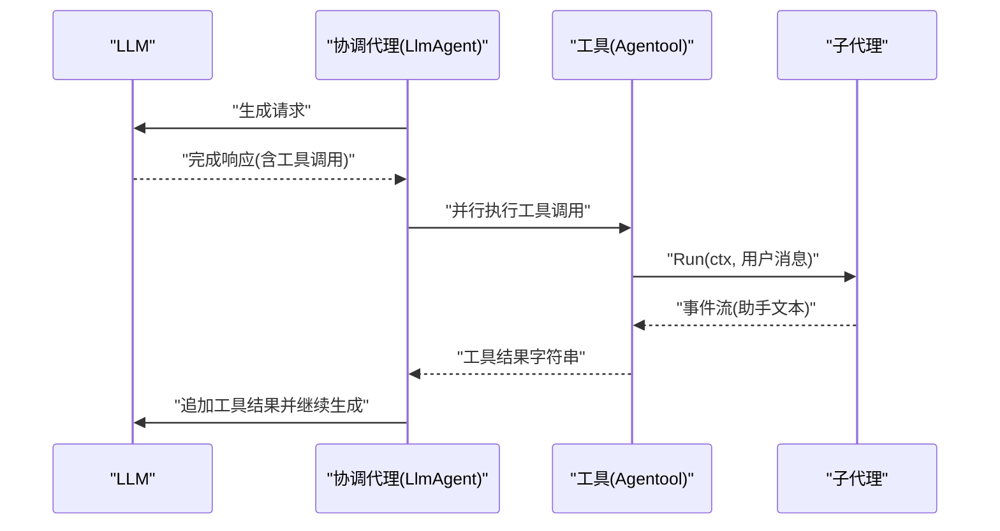
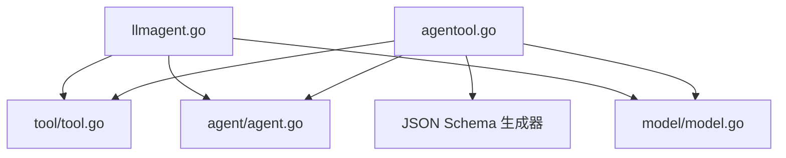

# 代理工具包装

<cite>
**本文档引用的文件**
- [agentool.go](file://agent/agentool/agentool.go)
- [agentool_test.go](file://agent/agentool/agentool_test.go)
- [agent.go](file://agent/agent.go)
- [tool.go](file://tool/tool.go)
- [llmagent.go](file://agent/llmagent/llmagent.go)
- [model.go](file://model/model.go)
- [sequential.go](file://agent/sequential/sequential.go)
- [parallel.go](file://agent/parallel/parallel.go)
- [README.md](file://README.md)
- [main.go](file://examples/chat/main.go)
</cite>

## 目录
1. [简介](#简介)
2. [项目结构](#项目结构)
3. [核心组件](#核心组件)
4. [架构总览](#架构总览)
5. [详细组件分析](#详细组件分析)
6. [依赖关系分析](#依赖关系分析)
7. [性能考量](#性能考量)
8. [故障排查指南](#故障排查指南)
9. [结论](#结论)
10. [附录：使用示例与最佳实践](#附录使用示例与最佳实践)

## 简介
本文件深入解析代理工具包装器（Agentool）的设计与实现，说明如何将任意代理（Agent）作为工具（Tool）使用，并通过函数调用机制委托任务给子代理。重点涵盖：
- Agentool 的实现原理：工具描述生成、参数序列化与结果反序列化
- 代理工具包装在代理组合中的作用：如何实现代理间的嵌套调用与任务委托
- 配置选项：超时、重试、错误传播策略
- 实际应用场景：复杂任务分解、代理协作、动态工作流编排
- 完整使用示例与最佳实践

## 项目结构
ADK 是一个轻量级、惯用的 Go 库，用于构建生产级 AI 代理。其核心模块围绕“解耦”理念设计：代理逻辑与 LLM 提供商、会话存储、工具集成相互独立，便于按需组合。

图表来源
- [agent.go:10-19](file://agent/agent.go#L10-L19)
- [tool.go:9-23](file://tool/tool.go#L9-L23)
- [model.go:10-227](file://model/model.go#L10-L227)
- [llmagent.go:30-159](file://agent/llmagent/llmagent.go#L30-L159)
- [sequential.go:18-93](file://agent/sequential/sequential.go#L18-L93)
- [parallel.go:70-175](file://agent/parallel/parallel.go#L70-L175)
- [agentool.go:16-79](file://agent/agentool/agentool.go#L16-L79)
- [main.go:101-111](file://examples/chat/main.go#L101-L111)

章节来源
- [README.md:67-89](file://README.md#L67-L89)
- [README.md:338-357](file://README.md#L338-L357)

## 核心组件
- 代理接口（Agent）：定义名称、描述与运行方法，返回事件迭代器，支持流式输出与完整消息。
- 工具接口（Tool）：定义工具元数据（Definition）与执行方法（Run），用于 LLM 的函数调用。
- LLM 抽象（model.LLM）：统一不同提供商的调用方式，支持流式响应与令牌用量统计。
- 代理工具包装（Agentool）：将任意 Agent 包装为 Tool，暴露给其他代理进行函数调用式委托。
- 组合代理（Sequential/Parallel）：在更高层实现代理协作与并行处理。

章节来源
- [agent.go:10-19](file://agent/agent.go#L10-L19)
- [tool.go:9-23](file://tool/tool.go#L9-L23)
- [model.go:10-227](file://model/model.go#L10-L227)
- [agentool.go:16-79](file://agent/agentool/agentool.go#L16-L79)

## 架构总览
Agentool 将“代理”抽象为“工具”，使代理可以被另一个代理以函数调用的方式直接调用。其核心流程如下：
- 通过 JSON Schema 生成工具输入模式（仅包含单个任务字符串）
- 当被调用时，Agentool 将传入的任务封装为用户消息，交由被包装的代理执行
- 仅提取最终的助手文本作为工具返回值，忽略中间流式片段与工具结果消息

图表来源
- [agentool.go:54-78](file://agent/agentool/agentool.go#L54-L78)
- [llmagent.go:138-159](file://agent/llmagent/llmagent.go#L138-L159)
- [model.go:214-227](file://model/model.go#L214-L227)

## 详细组件分析

### 代理工具包装器（Agentool）设计与实现
- 设计目标
  - 将任意实现了 Agent 接口的代理无缝暴露为 Tool，参与 LLM 的函数调用循环
  - 保持“只取最终助手文本”的约定，避免将中间消息污染上游代理的上下文
- 关键点
  - 输入模式：使用 JSON Schema 描述工具输入为单字段对象（任务字符串）
  - 参数序列化：工具调用参数为 JSON 字符串，Agentool 解析为内部请求结构
  - 结果反序列化：仅返回最后一个助手文本内容，作为工具结果字符串
  - 错误传播：任何阶段的错误均向上抛出，由上层代理或运行器处理

图表来源
- [agent.go:10-19](file://agent/agent.go#L10-L19)
- [tool.go:9-23](file://tool/tool.go#L9-L23)
- [agentool.go:16-79](file://agent/agentool/agentool.go#L16-L79)

章节来源
- [agentool.go:16-79](file://agent/agentool/agentool.go#L16-L79)
- [tool.go:9-23](file://tool/tool.go#L9-L23)

### 工具描述生成与参数序列化
- 工具描述生成
  - 使用类型反射与 JSON Schema 生成器，基于内部请求结构自动生成输入模式
  - 元数据来源于被包装代理的 Name 与 Description
- 参数序列化
  - LLM 函数调用传递的参数为 JSON 字符串
  - Agentool 在 Run 中解析该字符串为内部请求结构，构造用户消息列表
- 结果反序列化
  - 仅保留最后一次完整助手消息的文本内容作为工具返回值

图表来源
- [agentool.go:54-78](file://agent/agentool/agentool.go#L54-L78)

章节来源
- [agentool.go:23-27](file://agent/agentool/agentool.go#L23-L27)
- [agentool.go:35-47](file://agent/agentool/agentool.go#L35-L47)
- [agentool.go:54-78](file://agent/agentool/agentool.go#L54-L78)

### 代理工具包装在代理组合中的作用
- 顺序组合（Sequential）
  - 子代理可作为工具被前序代理调用，形成“思考—行动—汇报”的闭环
  - 每个代理接收原始输入与之前所有完整消息，具备全局上下文
- 并行组合（Parallel）
  - 多个子代理并发执行，各自产出完整消息后由合并函数整合
  - 可将某些子代理作为工具暴露给其他代理，实现跨代理的协作

图表来源
- [sequential.go:18-93](file://agent/sequential/sequential.go#L18-L93)
- [parallel.go:70-175](file://agent/parallel/parallel.go#L70-L175)
- [agentool.go:16-79](file://agent/agentool/agentool.go#L16-L79)

章节来源
- [sequential.go:18-93](file://agent/sequential/sequential.go#L18-L93)
- [parallel.go:70-175](file://agent/parallel/parallel.go#L70-L175)

### LLM 代理的工具调用循环与 Agentool 的交互
- LlmAgent 在每次生成后检查完成响应是否包含工具调用
- 若存在工具调用，则并行执行所有工具，生成工具结果消息并追加到历史
- Agentool 的 Run 被调用时，返回字符串形式的工具结果，供 LlmAgent 继续对话

图表来源
- [llmagent.go:78-136](file://agent/llmagent/llmagent.go#L78-L136)
- [llmagent.go:138-159](file://agent/llmagent/llmagent.go#L138-L159)
- [agentool.go:54-78](file://agent/agentool/agentool.go#L54-L78)

章节来源
- [llmagent.go:78-136](file://agent/llmagent/llmagent.go#L78-L136)
- [llmagent.go:138-159](file://agent/llmagent/llmagent.go#L138-L159)

## 依赖关系分析
- Agentool 依赖
  - Agent 接口：用于执行被包装的代理
  - Tool 接口与 Definition：用于暴露工具元数据
  - JSON Schema 生成器：用于生成工具输入模式
  - model.Message：用于构造用户消息与事件处理
- 运行时依赖
  - LlmAgent：负责函数调用循环与工具执行
  - 上游代理：通过工具调用将任务委托给子代理

图表来源
- [agentool.go:3-14](file://agent/agentool/agentool.go#L3-L14)
- [llmagent.go:3-12](file://agent/llmagent/llmagent.go#L3-L12)
- [agent.go:3-8](file://agent/agent.go#L3-L8)
- [tool.go:3-7](file://tool/tool.go#L3-L7)
- [model.go:3-8](file://model/model.go#L3-L8)

章节来源
- [agentool.go:3-14](file://agent/agentool/agentool.go#L3-L14)
- [llmagent.go:3-12](file://agent/llmagent/llmagent.go#L3-L12)

## 性能考量
- 流式输出与完整消息分离
  - Agentool 仅保留最终助手文本，避免中间片段占用下游上下文
- 并行工具执行
  - LlmAgent 对工具调用采用并行执行，提升吞吐
- 事件迭代器
  - 使用 Go 的迭代器模式，减少内存分配与拷贝
- 建议
  - 对于长文本任务，建议在子代理内部做分段处理，避免一次性生成过长内容
  - 合理设置生成配置（温度、最大令牌数等），平衡质量与速度

[本节为通用指导，不直接分析具体文件]

## 故障排查指南
- 工具未找到
  - 现象：工具调用返回“工具未找到”
  - 原因：工具名称与注册映射不一致
  - 处理：确认工具 Definition.Name 与调用名一致
- 参数解析失败
  - 现象：工具调用报错“参数解析失败”
  - 原因：arguments 非有效 JSON 或字段不匹配
  - 处理：检查 LLM 生成的参数 JSON 是否符合工具输入模式
- 子代理未产生最终助手文本
  - 现象：工具返回空字符串
  - 原因：子代理可能中断或未生成最终回复
  - 处理：在子代理中确保最终生成完整助手文本；必要时增加指令约束
- 错误传播
  - 现象：上层代理收到错误
  - 处理：根据错误类型决定重试或降级策略

章节来源
- [llmagent.go:138-159](file://agent/llmagent/llmagent.go#L138-L159)
- [agentool.go:54-78](file://agent/agentool/agentool.go#L54-L78)

## 结论
Agentool 将“代理即工具”的思想落地，通过函数调用机制实现代理间的自然嵌套与任务委托。它与 LlmAgent 的工具调用循环、以及顺序/并行组合代理共同构成了强大的代理协作体系。借助 JSON Schema 自动生成工具描述、严格的参数与结果处理流程，Agentool 在保证易用性的同时，也提供了清晰的边界与可扩展性。

[本节为总结，不直接分析具体文件]

## 附录：使用示例与最佳实践

### 使用示例
- 将子代理包装为工具并交给协调代理
  - 参考路径：[agentool_test.go:75-107](file://agent/agentool/agentool_test.go#L75-L107)
  - 示例流程：创建子代理 → 创建协调代理并注入 Agentool → 触发工具调用 → 收集最终答案
- 集成真实 LLM 的端到端委托
  - 参考路径：[agentool_test.go:174-188](file://agent/agentool/agentool_test.go#L174-L188)
  - 示例流程：翻译子代理 → 协调代理注册工具 → 用户发起翻译请求 → 代理自动调用工具 → 返回翻译结果
- 示例程序中的工具使用
  - 参考路径：[main.go:101-111](file://examples/chat/main.go#L101-L111)
  - 示例流程：加载 MCP 工具 → 注入 LlmAgent → 交互式聊天与工具调用

章节来源
- [agentool_test.go:75-107](file://agent/agentool/agentool_test.go#L75-L107)
- [agentool_test.go:174-188](file://agent/agentool/agentool_test.go#L174-L188)
- [main.go:101-111](file://examples/chat/main.go#L101-L111)

### 最佳实践
- 明确职责边界
  - 子代理应专注于单一领域，输出清晰、稳定的最终助手文本
- 工具命名规范
  - 使用语义明确的工具名称与描述，便于 LLM 正确选择
- 参数约束
  - 通过 JSON Schema 限制输入范围，减少歧义
- 错误处理
  - 在子代理中捕获并格式化错误，确保工具返回可读的结果字符串
- 超时与重试
  - 在上层代理或运行器层面设置合理的超时与重试策略，避免长时间阻塞
- 上下文管理
  - 顺序组合中注意注入手牌消息，保持对话期望的“以用户结尾”结构
  - 并行组合中避免共享状态，使用合并函数统一输出

[本节为通用指导，不直接分析具体文件]