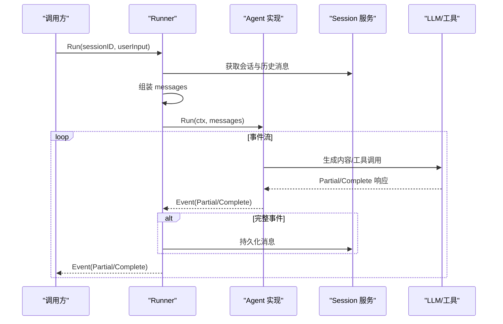
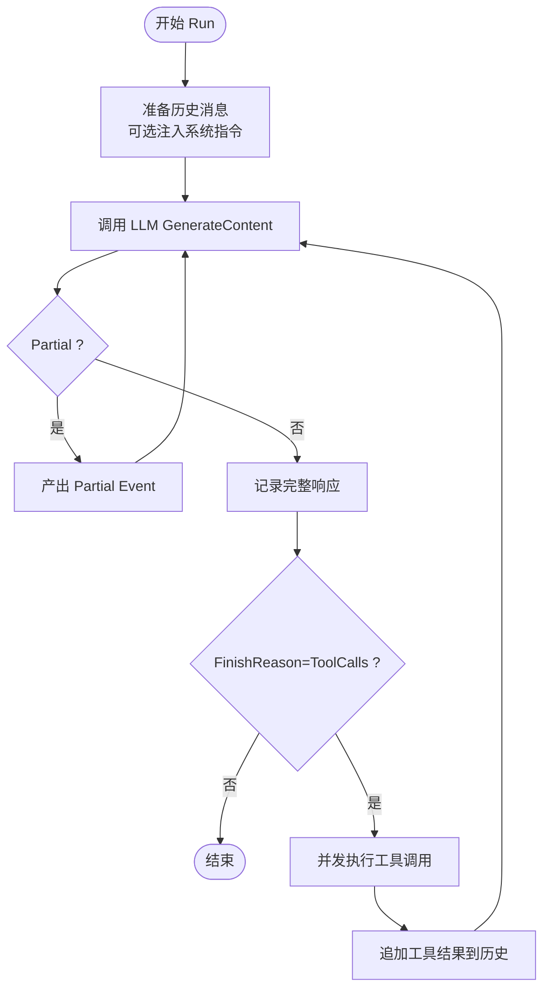
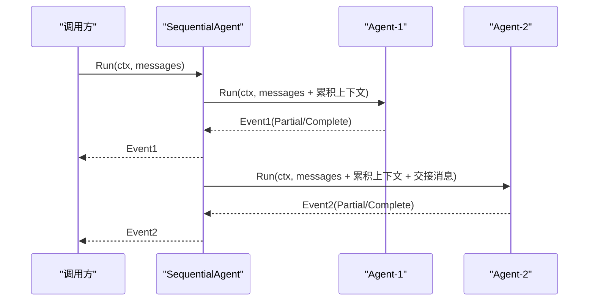
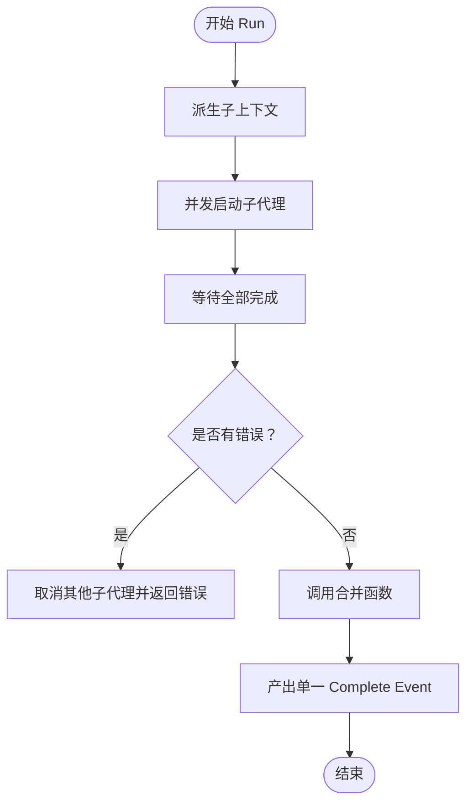
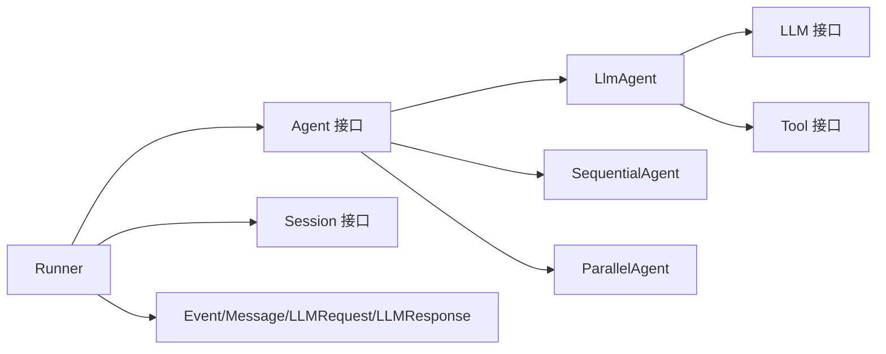

# 代理接口设计

<cite>
**本文档引用的文件**
- [agent.go](file://agent/agent.go)
- [llmagent.go](file://agent/llmagent/llmagent.go)
- [sequential.go](file://agent/sequential/sequential.go)
- [parallel.go](file://agent/parallel/parallel.go)
- [model.go](file://model/model.go)
- [tool.go](file://tool/tool.go)
- [runner.go](file://runner/runner.go)
- [main.go](file://examples/chat/main.go)
- [llmagent_test.go](file://agent/llmagent/llmagent_test.go)
- [sequential_test.go](file://agent/sequential/sequential_test.go)
- [parallel_test.go](file://agent/parallel/parallel_test.go)
</cite>

## 更新摘要
**变更内容**
- 补充了完整的Agent接口API参考文档
- 详细说明了Name()、Description()、Run()三个核心方法的完整规范
- 增加了Event结构体的详细字段说明和流式输出机制
- 完善了接口实现的最佳实践和错误处理指南
- 添加了具体的实现示例和常见使用场景

## 目录
1. [简介](#简介)
2. [Agent接口API参考](#agent接口api参考)
3. [核心组件](#核心组件)
4. [架构总览](#架构总览)
5. [详细组件分析](#详细组件分析)
6. [依赖分析](#依赖分析)
7. [性能考虑](#性能考虑)
8. [故障排除指南](#故障排除指南)
9. [结论](#结论)
10. [附录](#附录)

## 简介
本文件系统性阐述 ADK 框架中 Agent 接口的设计理念与实现规范，重点解析以下内容：
- Agent 接口三要素：Name()、Description()、Run() 的职责与实现要求
- 无状态代理的设计原则与上下文管理
- 基于 Go 1.23 迭代器模式的流式事件处理（Event 结构体与 Partial 标志）
- 流式输出的实现机制与最佳实践
- 典型实现示例与常见使用场景

## Agent接口API参考

### 接口定义
Agent 接口是 ADK 框架的核心抽象，定义了智能体的标准行为规范。

```go
type Agent interface {
    Name() string
    Description() string
    Run(ctx context.Context, messages []model.Message) iter.Seq2[*model.Event, error]
}
```

### 方法详细说明

#### Name() 方法
- **功能**：返回代理的唯一标识名称
- **返回值**：string 类型的代理名称
- **实现要求**：
  - 必须返回稳定的字符串标识
  - 不应包含特殊字符或空白字符
  - 用于日志记录、监控和用户界面显示
- **使用场景**：代理注册、错误报告、性能统计

#### Description() 方法
- **功能**：返回代理的功能描述信息
- **返回值**：string 类型的描述文本
- **实现要求**：
  - 应简洁明了地描述代理的主要功能
  - 适用于用户界面展示和帮助信息
  - 不应包含技术实现细节
- **使用场景**：代理列表展示、文档生成、调试信息

#### Run() 方法
- **功能**：执行代理逻辑并产生事件序列
- **参数**：
  - `ctx context.Context`：执行上下文，支持取消和超时控制
  - `messages []model.Message`：对话历史消息数组
- **返回值**：`iter.Seq2[*model.Event, error]` 迭代器序列
- **实现要求**：
  - 必须正确处理流式事件和完整事件
  - 支持上下文取消和错误传播
  - 保持无状态设计原则
- **事件类型**：
  - Partial 事件：流式片段，用于实时显示
  - Complete 事件：完整消息，用于持久化和业务处理

**章节来源**
- [agent.go:10-19](file://agent/agent.go#L10-L19)

## 核心组件
本节聚焦 Agent 接口及其关键数据结构，阐明设计理念与约束。

### Agent 接口
- **Name()**：返回代理名称，用于标识与展示
- **Description()**：返回代理描述，便于用户理解用途
- **Run(ctx, messages)**：返回一个迭代器，逐个产出 Event；支持流式 Partial 事件与完整事件

### Event 结构体
- **Message**：承载一次对话消息（可为 assistant、user、tool 等角色）
- **Partial**：标识是否为流式片段（true 表示增量文本，false 表示完整消息）

### Message 结构体
- **Role、Content、Parts、ToolCalls、ToolCallID、Usage** 等字段构成完整消息语义

### LLM 与工具
- **LLM 接口** GenerateContent 支持流式响应（Partial=true）与最终完整响应（Partial=false）
- **Tool 接口** Definition 与 Run 提供工具元信息与执行能力

**章节来源**
- [agent.go:10-19](file://agent/agent.go#L10-L19)
- [model.go:214-226](file://model/model.go#L214-L226)
- [model.go:152-178](file://model/model.go#L152-L178)
- [model.go:188-212](file://model/model.go#L188-L212)
- [tool.go:17-23](file://tool/tool.go#L17-L23)

## 架构总览
Agent 接口作为统一抽象，屏蔽不同实现细节，Runner 负责与会话服务交互，将历史消息加载到代理输入，并在代理产生事件时进行持久化与转发。



**图表来源**
- [runner.go:39-95](file://runner/runner.go#L39-L95)
- [llmagent.go:56-136](file://agent/llmagent/llmagent.go#L56-L136)
- [model.go:188-212](file://model/model.go#L188-L212)

## 详细组件分析

### Agent 接口与实现规范
- **设计原则**
  - **无状态**：Agent 不保存内部状态，所有上下文由调用方传入（messages），确保可组合、可复用
  - **流式事件**：通过迭代器返回 Event，支持 Partial 片段与 Complete 完整消息
  - **上下文传播**：Run 使用 context 控制生命周期与取消
- **方法职责**
  - **Name()/Description()**：仅返回静态元信息，不参与状态或副作用
  - **Run(ctx, messages)**：主执行逻辑，按序产出事件；遇到错误立即停止并返回错误
- **实现要求**
  - 必须正确处理 Partial/Complete 的区分与传递
  - 对工具调用结果应以完整消息形式产出
  - 需要并发安全：如并行执行工具或子代理时，需使用 goroutine 与同步原语

**章节来源**
- [agent.go:10-19](file://agent/agent.go#L10-L19)

### LlmAgent：基于 LLM 的无状态代理
- **无状态设计**
  - 仅持有配置与工具映射，不保存会话状态
  - 每次 Run 从 messages 构建历史，必要时注入系统指令
- **工具调用循环**
  - 生成 assistant 消息（可能含 ToolCalls）
  - 并发执行 ToolCalls，保持原始顺序
  - 将工具结果以完整消息追加到历史，继续下一轮生成
- **流式输出**
  - 当 Stream=true 时，LLM 的 Partial 响应被直接转发为 Partial Event
  - 最终 Complete 响应携带 Usage 与完整内容
- **错误处理**
  - 任何阶段出错均向上抛出，调用方可中断或重试
- **性能优化**
  - 工具调用并发执行，减少总耗时
  - 仅对 Complete 事件写入 Usage 统计



**图表来源**
- [llmagent.go:56-136](file://agent/llmagent/llmagent.go#L56-L136)
- [model.go:188-212](file://model/model.go#L188-L212)

**章节来源**
- [llmagent.go:30-159](file://agent/llmagent/llmagent.go#L30-L159)
- [llmagent_test.go:449-579](file://agent/llmagent/llmagent_test.go#L449-L579)

### SequentialAgent：顺序编排代理
- **设计目标**
  - 按顺序串联多个子代理，前一代理的完整消息作为后一代理的上下文
  - 在相邻代理间注入"交接"用户消息，使后续代理接收"以用户结尾"的对话
- **流式与上下文**
  - 逐个代理运行，实时转发其事件（包括 Partial）
  - 仅将 Complete 消息加入累积上下文，保证后续代理看到完整历史
- **错误传播**
  - 任一代理返回错误即终止并向上抛出
- **并发控制**
  - 串行执行，避免并发开销与竞态



**图表来源**
- [sequential.go:46-92](file://agent/sequential/sequential.go#L46-L92)

**章节来源**
- [sequential.go:18-93](file://agent/sequential/sequential.go#L18-L93)
- [sequential_test.go:133-182](file://agent/sequential/sequential_test.go#L133-L182)

### ParallelAgent：并行编排代理
- **设计目标**
  - 同时启动多个子代理，共享同一输入消息，彼此独立且无状态
  - 所有子代理完成后，通过合并函数将结果整合为单一完整消息
- **并发与取消**
  - 子代理共享派生自父上下文的子上下文；任一子代理出错即取消其他子代理
- **合并策略**
  - 默认合并函数按定义顺序提取各代理最后一条非空 assistant 文本，添加归属标题
  - 支持自定义合并函数，完全控制输出格式
- **流式处理**
  - 子代理的 Partial 事件被静默消费，仅收集 Complete 消息参与合并



**图表来源**
- [parallel.go:112-174](file://agent/parallel/parallel.go#L112-L174)

**章节来源**
- [parallel.go:70-175](file://agent/parallel/parallel.go#L70-L175)
- [parallel_test.go:200-268](file://agent/parallel/parallel_test.go#L200-L268)

### Event 结构体与流式输出机制
- **Event 字段**
  - **Message**：完整的消息对象
  - **Partial**：true 表示增量片段（仅 Content/ReasoningContent 可靠），false 表示完整消息
- **流式输出流程**
  - LLM 层在 Partial=true 时产出增量文本片段
  - Runner 将 Partial 事件直接转发给调用方，用于实时显示
  - Runner 仅在 Partial=false 时将消息持久化到会话
- **使用建议**
  - 调用方应区分 Partial/Complete：Partial 用于 UI 实时渲染，Complete 用于业务处理与持久化

**章节来源**
- [model.go:214-226](file://model/model.go#L214-L226)
- [runner.go:41-95](file://runner/runner.go#L41-L95)

### Runner：与会话服务的集成
- **职责**
  - 加载会话历史，组装 messages
  - 调用 Agent.Run，实时转发事件
  - 对 Complete 事件进行持久化（分配雪花 ID、时间戳等）
- **上下文管理**
  - 使用 context 控制超时与取消，确保长时间运行的代理可被及时终止
- **与示例结合**
  - 示例展示了如何在命令行中逐段打印 Partial 内容，并在收到 Complete 时输出最终答案

**章节来源**
- [runner.go:17-108](file://runner/runner.go#L17-L108)
- [main.go:126-171](file://examples/chat/main.go#L126-L171)

## 依赖分析
- **接口与实现解耦**
  - Agent 接口仅依赖 model.Message 与 context，不依赖具体实现细节
  - LlmAgent 依赖 LLM 与 Tool 接口，但通过接口抽象隔离具体提供商
- **Runner 依赖**
  - Runner 依赖 Agent 接口与 Session 服务接口，实现与具体存储解耦
- **数据结构依赖**
  - Event/Message/LLMRequest/LLMResponse 形成清晰的数据流，贯穿整个链路



**图表来源**
- [agent.go:10-19](file://agent/agent.go#L10-L19)
- [llmagent.go:30-46](file://agent/llmagent/llmagent.go#L30-L46)
- [sequential.go:30-41](file://agent/sequential/sequential.go#L30-L41)
- [parallel.go:86-101](file://agent/parallel/parallel.go#L86-L101)
- [runner.go:17-37](file://runner/runner.go#L17-L37)
- [model.go:214-226](file://model/model.go#L214-L226)

**章节来源**
- [agent.go:10-19](file://agent/agent.go#L10-L19)
- [runner.go:17-37](file://runner/runner.go#L17-L37)

## 性能考虑
- **并发执行**
  - LlmAgent 并发执行工具调用，缩短总延迟
  - ParallelAgent 并发执行多个子代理，适合对比或并行任务
- **流式传输**
  - Partial 事件允许 UI 实时渲染，提升感知性能
- **上下文与内存**
  - 无状态设计避免长期持有历史，降低内存占用
  - Runner 仅持久化 Complete 事件，减少存储压力
- **超时与取消**
  - 使用 context.WithTimeout 控制长请求，防止资源泄漏

**章节来源**
- [llmagent.go:116-134](file://agent/llmagent/llmagent.go#L116-L134)
- [parallel.go:115-125](file://agent/parallel/parallel.go#L115-L125)
- [runner.go:381-383](file://runner/runner.go#L381-L383)

## 故障排除指南
- **常见问题**
  - 代理未产生完整消息：检查 FinishReason 是否为 ToolCalls，确认工具调用循环是否正确执行
  - 流式片段丢失：确认调用方是否正确处理 Partial 事件
  - 并发工具执行异常：检查工具定义与参数，确保工具名称匹配
  - 会话持久化失败：确认 Session 服务可用与权限配置
- **调试建议**
  - 使用测试用例中的 mock LLM 与工具，验证事件序列与顺序
  - 在 Runner 中增加日志，区分 Partial 与 Complete 的处理路径

**章节来源**
- [llmagent_test.go:278-320](file://agent/llmagent/llmagent_test.go#L278-L320)
- [sequential_test.go:296-328](file://agent/sequential/sequential_test.go#L296-L328)
- [parallel_test.go:315-349](file://agent/parallel/parallel_test.go#L315-L349)

## 结论
ADK 的 Agent 接口通过"无状态 + 流式事件 + 上下文显式传递"的设计，实现了高度可组合、可扩展的智能体体系。借助迭代器模式，上层调用方可以以一致的方式处理流式与非流式场景；通过 Runner 与 Session 的集成，实现了端到端的对话生命周期管理。推荐在实际项目中遵循本文档的实现规范与最佳实践，确保稳定性与性能。

## 附录

### 接口实现最佳实践
- **错误处理**
  - 在 Run 中捕获并返回错误，避免吞掉异常
  - 对外部依赖（LLM/工具/会话）的错误进行分类与包装
- **上下文管理**
  - 使用 context.WithTimeout 或 WithCancel 控制生命周期
  - 在并发场景中，确保子协程能及时响应取消信号
- **性能优化**
  - 工具调用尽量并发，但注意限流与资源配额
  - 流式输出优先处理 Partial，避免阻塞主循环
- **可观测性**
  - 记录关键事件（开始/结束、Partial/Complete 数量、耗时）
  - 对错误进行结构化日志，便于定位问题

### 常见使用场景
- **单代理对话**：使用 LlmAgent，开启流式输出，实现实时回复
- **多步管线**：使用 SequentialAgent，将研究、草稿、审阅等步骤串联
- **并行比较**：使用 ParallelAgent，同时运行多个模型或工具，汇总结果
- **与会话集成**：通过 Runner 自动加载历史、持久化消息，维护对话连续性

### API实现示例

#### 基础代理实现模板
```go
type MyAgent struct {
    name        string
    description string
    config      *Config
}

func (a *MyAgent) Name() string {
    return a.name
}

func (a *MyAgent) Description() string {
    return a.description
}

func (a *MyAgent) Run(ctx context.Context, messages []model.Message) iter.Seq2[*model.Event, error] {
    return func(yield func(*model.Event, error) bool) {
        // 实现代理逻辑
        // 产出事件：yield(&model.Event{Message: msg, Partial: false}, nil)
    }
}
```

#### 流式事件处理示例
```go
// 处理流式事件
for event, err := range agent.Run(ctx, messages) {
    if err != nil {
        return err
    }
    
    if event.Partial {
        // 实时显示流式内容
        fmt.Print(event.Message.Content)
    } else {
        // 处理完整消息
        processCompleteMessage(event.Message)
    }
}
```

**章节来源**
- [main.go:101-171](file://examples/chat/main.go#L101-L171)
- [sequential.go:26-30](file://agent/sequential/sequential.go#L26-L30)
- [parallel.go:82-85](file://agent/parallel/parallel.go#L82-L85)