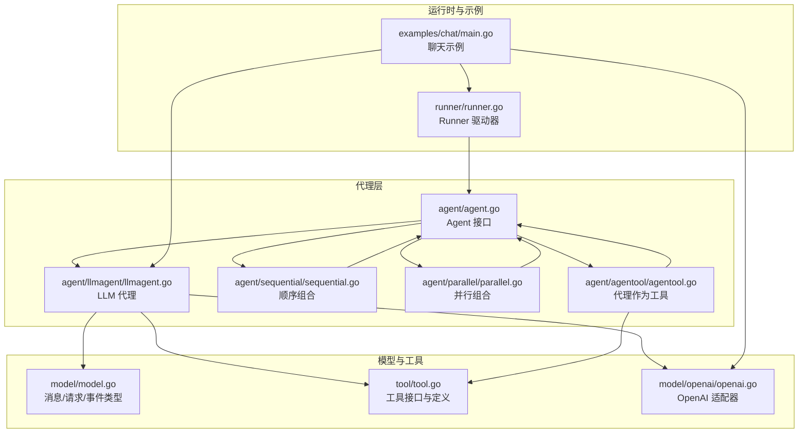
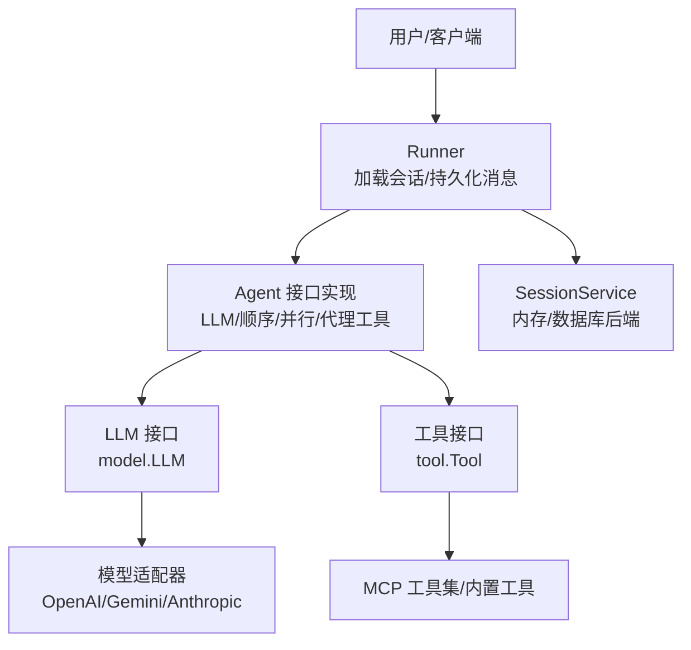
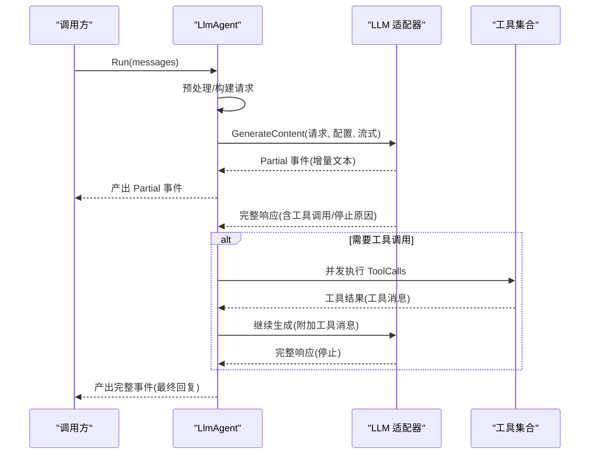
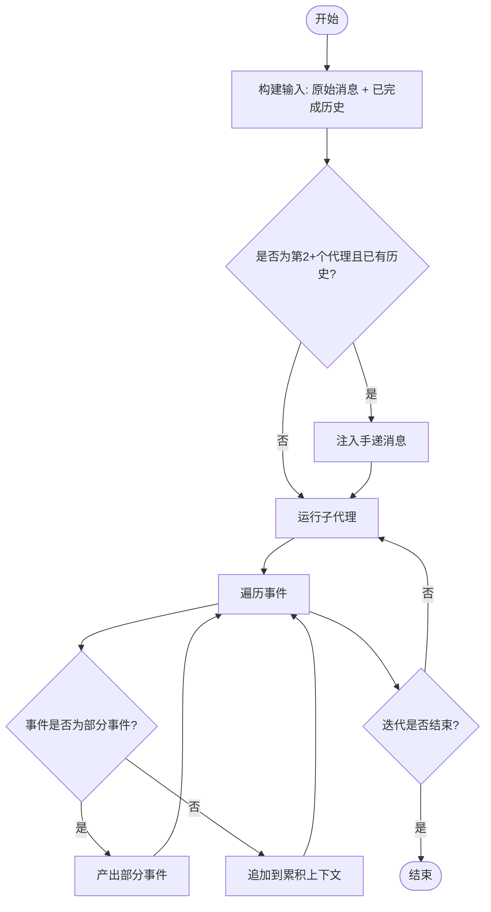
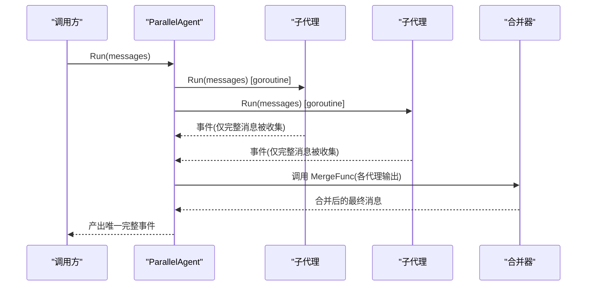
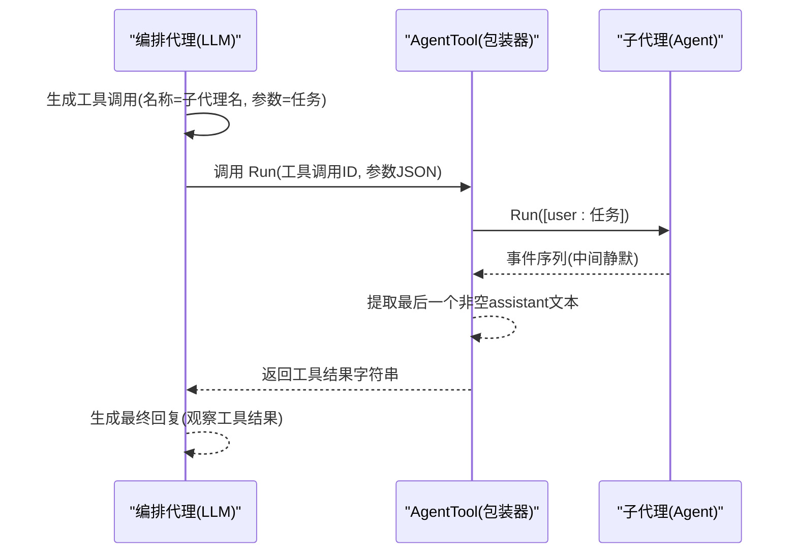
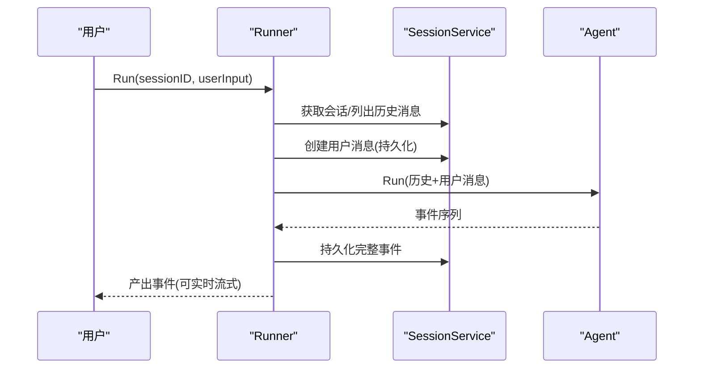
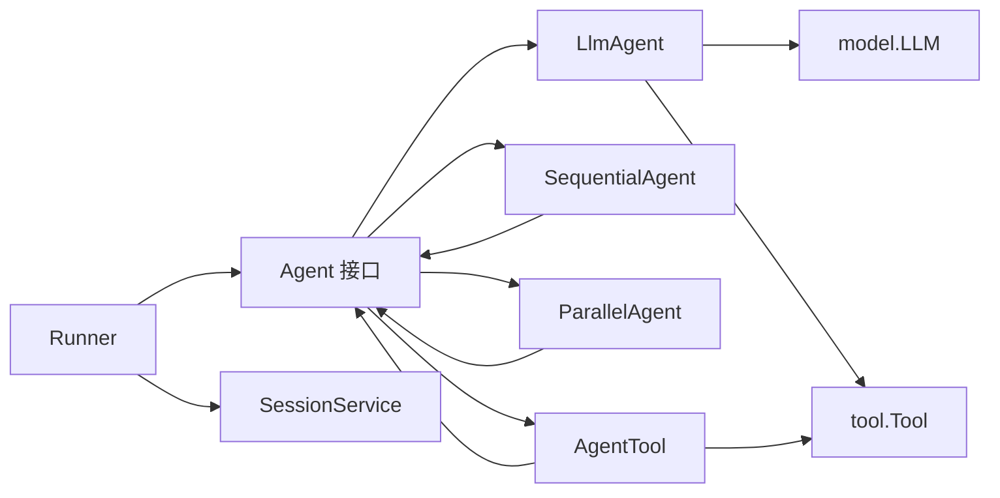

# 代理系统

<cite>
**本文引用的文件**
- [agent.go](file://agent/agent.go)
- [llmagent.go](file://agent/llmagent/llmagent.go)
- [sequential.go](file://agent/sequential/sequential.go)
- [parallel.go](file://agent/parallel/parallel.go)
- [agentool.go](file://agent/agentool/agentool.go)
- [model.go](file://model/model.go)
- [tool.go](file://tool/tool.go)
- [openai.go](file://model/openai/openai.go)
- [runner.go](file://runner/runner.go)
- [main.go](file://examples/chat/main.go)
- [README.md](file://README.md)
</cite>

## 目录
1. [简介](#简介)
2. [项目结构](#项目结构)
3. [核心组件](#核心组件)
4. [架构总览](#架构总览)
5. [详细组件分析](#详细组件分析)
6. [依赖分析](#依赖分析)
7. [性能考量](#性能考量)
8. [故障排查指南](#故障排查指南)
9. [结论](#结论)
10. [附录](#附录)

## 简介
本文件深入解析 ADK（Agent Development Kit）框架的代理系统架构，围绕以下目标展开：
- 解释 Agent 接口的设计理念与职责边界：Name()、Description()、Run() 的作用与实现要求。
- 深入讲解 LLM 代理的实现机制：工具调用循环、消息预处理、响应生成与流式输出。
- 介绍代理组合器的设计模式：顺序代理与并行代理的实现原理、使用场景与行为差异。
- 解释“代理作为工具”的能力：如何通过函数调用机制将代理委托给子代理，形成多层编排。
- 提供完整的代理开发指南：自定义代理实现、性能优化与调试技巧。
- 结合示例应用，展示真实场景下的集成与使用。

## 项目结构
ADK 将代理系统按功能模块化组织，核心目录与职责如下：
- agent：代理接口与具体实现（LLM 代理、顺序组合、并行组合、代理作为工具）
- model：跨提供商的统一消息与请求类型，以及 OpenAI/Gemini/Anthropic 等适配器
- tool：工具接口与定义，支持内置工具与 MCP 工具集
- runner：会话驱动器，协调状态机与消息持久化
- session：会话与消息存储抽象及内存/数据库实现
- examples：示例程序，演示聊天代理与 MCP 工具集成

图表来源
- [agent.go:10-19](file://agent/agent.go#L10-L19)
- [llmagent.go:30-46](file://agent/llmagent/llmagent.go#L30-L46)
- [sequential.go:18-41](file://agent/sequential/sequential.go#L18-L41)
- [parallel.go:70-101](file://agent/parallel/parallel.go#L70-L101)
- [agentool.go:16-48](file://agent/agentool/agentool.go#L16-L48)
- [model.go:10-212](file://model/model.go#L10-L212)
- [tool.go:9-24](file://tool/tool.go#L9-L24)
- [openai.go:19-164](file://model/openai/openai.go#L19-L164)
- [runner.go:17-96](file://runner/runner.go#L17-L96)
- [main.go:52-177](file://examples/chat/main.go#L52-L177)

章节来源
- [README.md:67-89](file://README.md#L67-L89)

## 核心组件
本节聚焦于代理系统的关键构件及其职责。

- Agent 接口
  - 职责：定义代理的最小协议，暴露名称、描述与执行入口。
  - 方法语义：
    - Name()：返回代理标识符，用于工具注册、日志与溯源。
    - Description()：返回人类可读的代理用途说明。
    - Run(ctx, messages)：以迭代序列的形式产出事件（Event），支持部分事件（Partial=true）用于实时流式显示；完整事件（Partial=false）为可持久化的消息。
  - 实现要求：
    - Run 必须返回 Go 迭代器，允许调用方在消费过程中提前退出。
    - 对外仅暴露事件，内部可自由管理上下文与状态（ADK 建议代理为无状态，Runner 负责会话持久化）。

- LLM 代理（LlmAgent）
  - 角色：基于 Provider-agnostic LLM 接口，自动驱动工具调用循环。
  - 关键配置：Name、Description、Model（LLM）、Tools、Instruction、GenerateConfig、Stream。
  - 行为要点：
    - 预处理：若配置了 Instruction，则在每次 Run 时注入系统消息。
    - 请求构建：组装历史消息与当前请求，传入 Model.GenerateContent。
    - 流式处理：当 Stream=true 时，逐段产出 Partial 事件；最终产出完整事件。
    - 工具调用：当 FinishReason=tool_calls 时，解析 ToolCalls 并并发执行，将结果作为 tool 消息追加到历史中，继续下一轮生成，直至停止原因非 tool_calls。
    - 计费统计：将 Usage 附着到对应 assistant 消息上。

- 顺序组合（SequentialAgent）
  - 角色：将多个代理串联为流水线，前序代理的输出作为后续代理的上下文。
  - 行为要点：
    - 输入构建：原始 messages + 已完成的历史消息；从第二个代理开始注入“请继续”手递消息，确保对话以用户回合结尾。
    - 上下文累积：仅将完整（非 Partial）消息加入累积上下文。
    - 错误传播：任一代理返回错误即终止并向上抛出。
    - 提前退出：调用方中断迭代不会触发后续代理。

- 并行组合（ParallelAgent）
  - 角色：将多个代理同时运行，收集结果并通过合并函数生成单一最终消息。
  - 行为要点：
    - 共享输入：所有子代理接收相同的初始 messages。
    - 合并策略：默认按定义顺序提取每个代理最后一个非空 assistant 文本，拼接为最终 assistant 内容；可通过自定义 MergeFunc 定制。
    - 并发执行：每个子代理独立 goroutine 执行；任一错误发生时通过 context 取消其余代理。
    - 输出形态：始终产出一个完整（非 Partial）的 assistant 消息，保证下游会话历史规整。

- 代理作为工具（AgentTool）
  - 角色：将任意 Agent 包装为 Tool，使其可被其他代理通过函数调用机制调用。
  - 行为要点：
    - 输入模式：JSON Schema 描述单个任务字符串；调用时由 LLM 传递给被包装代理。
    - 执行策略：以单条 user 消息运行被包装代理，仅取其最后一个非空 assistant 文本作为工具返回值；中间事件与工具调用静默消费。
    - 注册元数据：工具名与描述直接来自被包装代理的 Name() 与 Description()。

章节来源
- [agent.go:10-19](file://agent/agent.go#L10-L19)
- [llmagent.go:14-46](file://agent/llmagent/llmagent.go#L14-L46)
- [llmagent.go:56-136](file://agent/llmagent/llmagent.go#L56-L136)
- [sequential.go:18-92](file://agent/sequential/sequential.go#L18-L92)
- [parallel.go:70-174](file://agent/parallel/parallel.go#L70-L174)
- [agentool.go:16-79](file://agent/agentool/agentool.go#L16-L79)

## 架构总览
ADK 的整体架构强调“无状态代理 + 有状态运行器”的分离，使代理逻辑与会话持久化解耦，便于组合与复用。

图表来源
- [runner.go:17-96](file://runner/runner.go#L17-L96)
- [agent.go:10-19](file://agent/agent.go#L10-L19)
- [model.go:10-18](file://model/model.go#L10-L18)
- [openai.go:19-48](file://model/openai/openai.go#L19-L48)
- [tool.go:17-24](file://tool/tool.go#L17-L24)

## 详细组件分析

### LLM 代理：工具调用循环与消息处理
- 预处理与请求构建
  - 若配置了 Instruction，则在 Run 开始时注入一条 system 消息，确保每次调用都带有统一的系统提示。
  - 将历史 messages 与当前 messages 组合成 LLMRequest，连同 Tools 列表一并提交。
- 流式生成与事件产出
  - 当 Stream=true 时，LLM 适配器会逐段返回 Partial=true 的响应；LlmAgent 在收到每一段增量文本后立即产出 Partial 事件，实现实时显示。
  - 收到最终完整响应后，附带 Usage 并产出 Partial=false 的完整事件。
- 工具调用循环
  - 若 FinishReason=tool_calls，解析 ToolCalls 并并发执行（保持原始顺序），将每个工具调用的结果作为 tool 消息追加到历史中，再发起下一轮生成，直到不再需要工具调用。
- 错误处理
  - 任何阶段出现错误均向上抛出，调用方可据此决定重试或中断。

图表来源
- [llmagent.go:60-136](file://agent/llmagent/llmagent.go#L60-L136)
- [openai.go:48-164](file://model/openai/openai.go#L48-L164)
- [model.go:188-226](file://model/model.go#L188-L226)

章节来源
- [llmagent.go:56-136](file://agent/llmagent/llmagent.go#L56-L136)
- [openai.go:48-164](file://model/openai/openai.go#L48-L164)
- [model.go:188-226](file://model/model.go#L188-L226)

### 顺序组合：流水线编排
- 输入与上下文传播
  - 每个子代理的输入为：原始 messages + 已完成的历史消息；从第二个代理开始注入“请继续”手递消息，确保对话以用户回合结束。
  - 仅在收到完整事件（非 Partial）时才将其加入累积上下文，供后续代理使用。
- 错误与提前退出
  - 任一代理返回错误即终止；调用方中断迭代不会触发后续代理。

图表来源
- [sequential.go:56-92](file://agent/sequential/sequential.go#L56-L92)

章节来源
- [sequential.go:18-92](file://agent/sequential/sequential.go#L18-L92)

### 并行组合：扇出与合并
- 并发执行
  - 为每个子代理派生独立 goroutine，共享同一输入 messages；任一子代理报错时通过 context 取消其余代理。
- 结果合并
  - 默认合并策略：按定义顺序提取每个代理最后一个非空 assistant 文本，加上标注头，拼接为单一 assistant 消息。
  - 自定义合并：通过 MergeFunc 完全控制输出格式与内容。

图表来源
- [parallel.go:125-174](file://agent/parallel/parallel.go#L125-L174)

章节来源
- [parallel.go:29-174](file://agent/parallel/parallel.go#L29-L174)

### 代理作为工具：函数调用委托
- 包装机制
  - 将任意 Agent 包装为 Tool，其 Definition 来自代理的 Name()/Description()；输入参数为单个 JSON 字段的任务字符串。
- 执行流程
  - 以单条 user 消息运行被包装代理，仅取最后一个非空 assistant 文本作为工具返回值；中间事件与工具调用静默消费。
- 应用场景
  - 将复杂任务委派给专门的子代理，实现多层编排与专业化分工。

图表来源
- [agentool.go:54-79](file://agent/agentool/agentool.go#L54-L79)

章节来源
- [agentool.go:16-79](file://agent/agentool/agentool.go#L16-L79)

### Runner：会话驱动与消息持久化
- 职责
  - 加载会话历史，追加用户输入并持久化；调用代理并转发事件；仅持久化完整事件（非 Partial）。
- 交互
  - Run 接收 sessionID 与用户输入，内部将用户消息写入会话，随后调用代理的 Run，边产生边持久化。

图表来源
- [runner.go:45-96](file://runner/runner.go#L45-L96)

章节来源
- [runner.go:17-108](file://runner/runner.go#L17-L108)

## 依赖分析
- 组件内聚与耦合
  - Agent 接口与具体实现之间为高内聚低耦合：LLM/顺序/并行/代理工具均实现同一接口，彼此独立。
  - LlmAgent 依赖 model.LLM 与 tool.Tool，但不关心具体提供商与工具实现细节。
  - Runner 仅依赖 Agent 接口与 SessionService，与具体代理实现解耦。
- 外部依赖
  - LLM 适配器依赖第三方 SDK（如 OpenAI 官方 SDK），Runner 依赖雪花 ID 生成库。
- 循环依赖
  - 未发现直接或间接循环依赖；模块间方向清晰。

图表来源
- [agent.go:10-19](file://agent/agent.go#L10-L19)
- [llmagent.go:30-46](file://agent/llmagent/llmagent.go#L30-L46)
- [sequential.go:30-41](file://agent/sequential/sequential.go#L30-L41)
- [parallel.go:86-101](file://agent/parallel/parallel.go#L86-L101)
- [agentool.go:16-48](file://agent/agentool/agentool.go#L16-L48)
- [runner.go:20-37](file://runner/runner.go#L20-L37)

章节来源
- [model.go:10-212](file://model/model.go#L10-L212)
- [tool.go:9-24](file://tool/tool.go#L9-L24)
- [openai.go:19-164](file://model/openai/openai.go#L19-L164)
- [runner.go:17-37](file://runner/runner.go#L17-L37)

## 性能考量
- 流式输出
  - 使用 Partial 事件进行增量传输，降低首屏延迟，提升用户体验；仅在完整事件时持久化，避免重复写入。
- 工具调用并发
  - LlmAgent 对工具调用采用并发执行，缩短总等待时间；注意工具实现的幂等性与资源竞争。
- 并行组合
  - ParallelAgent 通过 goroutine 并发执行子代理，适合独立任务或多模型对比；合并阶段应尽量轻量，避免成为瓶颈。
- 生成参数
  - 通过 GenerateConfig 控制温度、推理努力、服务等级等，平衡质量与速度；合理设置最大生成长度与思考预算。
- 会话压缩
  - 使用软归档策略减少历史消息体量，保留关键摘要，降低请求体积与往返时间。

## 故障排查指南
- 代理未产出完整消息
  - 检查 Run 是否正确处理 Partial 事件；仅在 Partial=false 时持久化。
- 工具调用失败
  - 确认工具 Definition 名称与 LLM 的函数调用一致；检查工具参数 JSON 是否合法；查看工具返回的错误信息。
- 并发执行异常
  - 检查子代理是否正确处理 context 取消；确认 MergeFunc 不会阻塞。
- 流式输出卡顿
  - 确认 LLM 适配器支持流式；检查网络与第三方 API 限流。
- 会话持久化失败
  - 检查 SessionService 实现与数据库连接；确认消息 ID 生成与时间戳写入正常。

章节来源
- [runner.go:76-96](file://runner/runner.go#L76-L96)
- [llmagent.go:116-134](file://agent/llmagent/llmagent.go#L116-L134)
- [parallel.go:112-174](file://agent/parallel/parallel.go#L112-L174)

## 结论
ADK 的代理系统通过简洁的 Agent 接口与强大的组合能力，实现了从简单对话到复杂编排的灵活扩展。借助 Provider-agnostic 的 LLM 接口与工具体系，开发者可以快速构建生产级智能代理，并在不同场景下选择顺序、并行或代理委托等组合策略，获得最佳的性能与可维护性。

## 附录

### 代理开发指南
- 设计原则
  - 代理应保持无状态，将上下文与历史交由 Runner 或组合器管理。
  - Run 方法应尽早支持 Partial 事件，以便前端实时渲染。
- 自定义代理实现步骤
  - 实现 Agent 接口：Name()/Description()/Run()。
  - 在 Run 中：
    - 解析输入 messages，必要时注入系统提示或上下文。
    - 调用 LLM 或工具，产出事件序列。
    - 对于工具调用，遵循并发执行与顺序回放规则。
  - 错误处理：捕获并返回错误，允许上层组合器或 Runner 恢复。
- 性能优化建议
  - 合理使用流式输出与 Partial 事件，减少等待时间。
  - 工具调用并发化，避免串行阻塞。
  - 生成参数调优，结合业务需求平衡质量与成本。
- 调试技巧
  - 使用最小化输入复现问题；逐步启用工具与组合器定位根因。
  - 在 Runner 层面记录事件序列与持久化点，便于回溯。

### 实际应用场景
- 聊天助手：结合 MCP 工具集（如搜索引擎）实现检索增强与实时信息查询。
- 多步任务编排：顺序代理将研究、撰写、审阅等步骤串联，形成工作流。
- 多模型对比：并行代理在同一输入上比较不同模型的输出，辅助决策。
- 专家系统：代理作为工具，将复杂任务委派给专门的子代理，实现专业化分工。

章节来源
- [README.md:37-399](file://README.md#L37-L399)
- [main.go:52-177](file://examples/chat/main.go#L52-L177)