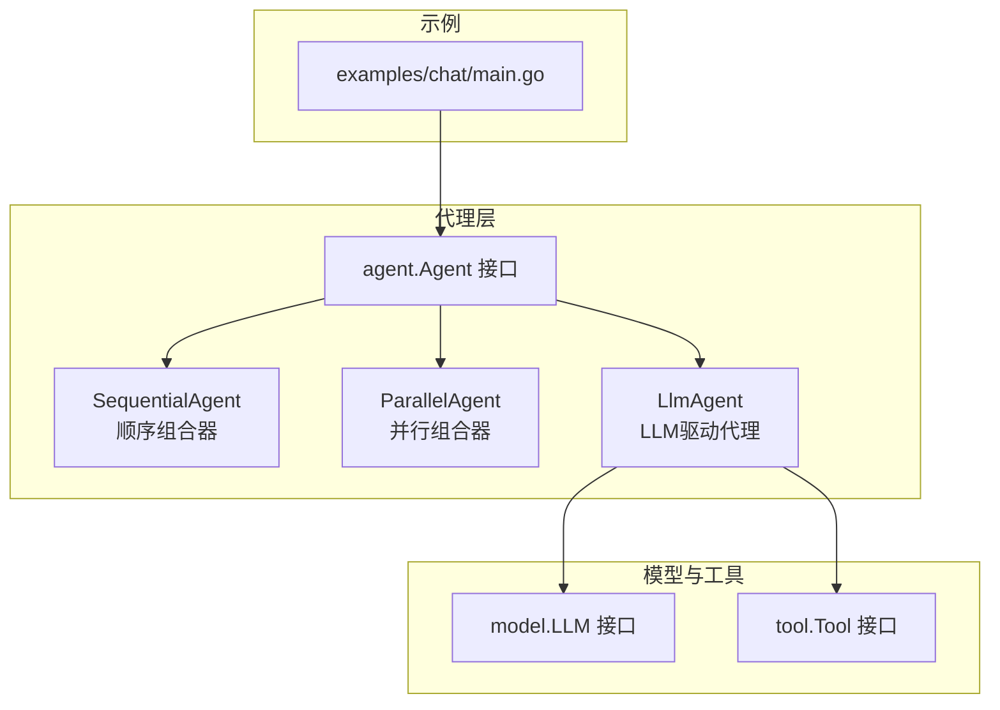
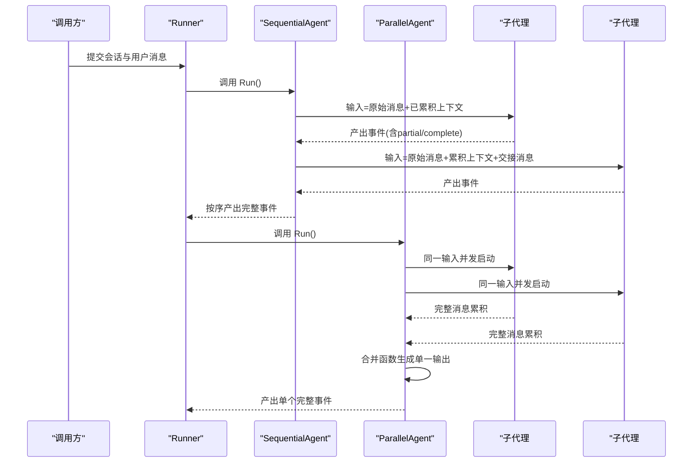
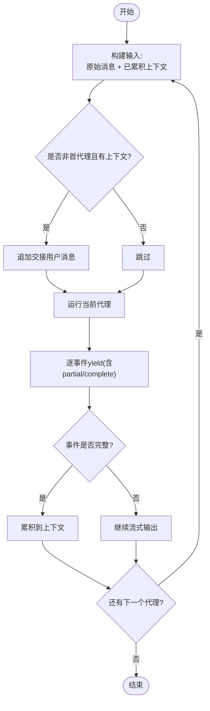
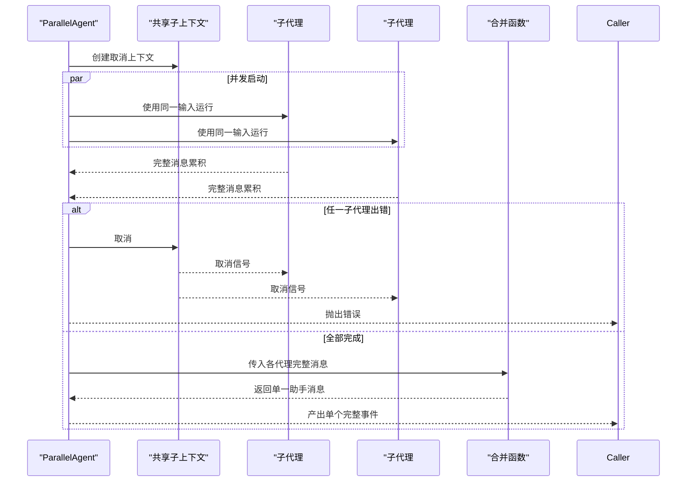
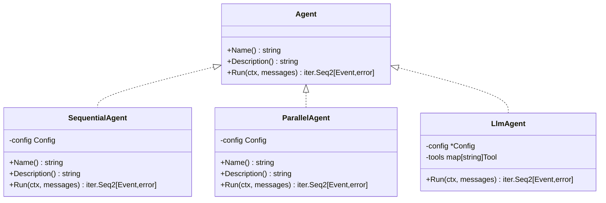

# 代理组合器

<cite>
**本文档引用的文件**
- [agent.go](file://agent/agent.go)
- [sequential.go](file://agent/sequential/sequential.go)
- [sequential_test.go](file://agent/sequential/sequential_test.go)
- [parallel.go](file://agent/parallel/parallel.go)
- [parallel_test.go](file://agent/parallel/parallel_test.go)
- [llmagent.go](file://agent/llmagent/llmagent.go)
- [README.md](file://README.md)
- [main.go](file://examples/chat/main.go)
</cite>

## 目录
1. [简介](#简介)
2. [项目结构](#项目结构)
3. [核心组件](#核心组件)
4. [架构总览](#架构总览)
5. [详细组件分析](#详细组件分析)
6. [依赖关系分析](#依赖关系分析)
7. [性能考量](#性能考量)
8. [故障排查指南](#故障排查指南)
9. [结论](#结论)
10. [附录](#附录)

## 简介
本文件系统性阐述代理组合器的设计与实现，覆盖顺序代理与并行代理两种组合方式。顺序代理通过流水线串联多个代理，使每个代理都能看到前序所有完整消息；并行代理则在同一输入上并发运行多个代理，并通过可插拔的合并函数将结果整合为单一输出。文档同时解析消息在代理间的传递与转换、并发执行策略、结果合并算法与错误传播机制，并给出配置要点、典型应用场景与性能对比分析。

## 项目结构
ADK（Agent Development Kit）采用分层包结构：顶层定义通用接口，子包实现具体代理类型与组合器，模型与工具适配不同供应商与协议。与代理组合器直接相关的模块如下：
- agent 接口与基础事件模型
- agent/sequential 顺序组合器
- agent/parallel 并行组合器
- agent/llmagent 基于 LLM 的状态机代理
- examples/chat 示例应用

图表来源
- [agent.go:10-19](file://agent/agent.go#L10-L19)
- [sequential.go:30-32](file://agent/sequential/sequential.go#L30-L32)
- [parallel.go:86-88](file://agent/parallel/parallel.go#L86-L88)
- [llmagent.go:31-34](file://agent/llmagent/llmagent.go#L31-L34)
- [main.go:102-111](file://examples/chat/main.go#L102-L111)

章节来源
- [README.md:67-89](file://README.md#L67-L89)

## 核心组件
- 代理接口：统一的 Run 方法返回迭代器，支持流式 partial 事件与完整事件，便于实时展示与持久化。
- 顺序组合器：按配置顺序依次运行子代理，将前序完整消息累积为上下文，必要时注入“交接”用户消息以满足 LLM 对话期望。
- 并行组合器：在同一输入上并发启动所有子代理，等待全部完成，按定义顺序收集完整消息并通过合并函数生成单一输出；任一子代理出错即取消其余代理并向上抛错。

章节来源
- [agent.go:10-19](file://agent/agent.go#L10-L19)
- [sequential.go:11-41](file://agent/sequential/sequential.go#L11-L41)
- [parallel.go:29-101](file://agent/parallel/parallel.go#L29-L101)

## 架构总览
下图展示了顺序与并行组合器在整体架构中的位置与交互关系。

图表来源
- [sequential.go:56-92](file://agent/sequential/sequential.go#L56-L92)
- [parallel.go:125-174](file://agent/parallel/parallel.go#L125-L174)
- [llmagent.go:60-136](file://agent/llmagent/llmagent.go#L60-L136)

## 详细组件分析

### 顺序代理（SequentialAgent）
顺序组合器将多个代理串接为固定流水线，上游代理的完整消息（非 partial）会被累积并作为下游代理的上下文输入。为保证对话格式一致性，当存在前置上下文时会在输入末尾注入一条“交接”用户消息。

- 关键行为
  - 输入构建：原始消息 + 已累积完整消息；若非首代理且已有上下文，则追加交接消息。
  - 流式处理：逐个事件 yield，caller 可随时中断；任一子代理报错即终止。
  - 上下文累积：仅完整消息进入累积，partial 不参与后续输入。
  - 名称与描述透传：Name()/Description() 直接来自配置。

图表来源
- [sequential.go:56-92](file://agent/sequential/sequential.go#L56-L92)

章节来源
- [sequential.go:18-92](file://agent/sequential/sequential.go#L18-L92)
- [sequential_test.go:133-182](file://agent/sequential/sequential_test.go#L133-L182)

### 并行代理（ParallelAgent）
并行组合器在同一输入上并发启动所有子代理，等待全部完成后再进行合并。合并函数默认将各代理最后一条非空助手文本按定义顺序格式化输出，也可自定义合并逻辑。

- 关键行为
  - 并发执行：派生共享子上下文，每个子代理独立 goroutine 运行。
  - 结果收集：仅收集完整消息（忽略 partial），按定义顺序组织。
  - 错误传播：任一子代理出错立即取消共享上下文，其他代理收到取消信号后尽快退出，随后向上抛错。
  - 合并策略：默认合并函数仅保留非空助手文本并添加归属标题；支持自定义合并函数。

图表来源
- [parallel.go:125-174](file://agent/parallel/parallel.go#L125-L174)

章节来源
- [parallel.go:70-174](file://agent/parallel/parallel.go#L70-L174)
- [parallel_test.go:200-268](file://agent/parallel/parallel_test.go#L200-L268)

### 组合器配置与扩展点
- 顺序组合器配置
  - Name/Description：组合器名称与描述
  - Agents：子代理列表（至少一个）

- 并行组合器配置
  - Name/Description：组合器名称与描述
  - Agents：子代理列表（至少一个）
  - MergeFunc：合并函数，默认使用内置合并策略

- 合并函数签名
  - 输入：按定义顺序排列的每个子代理的完整消息集合
  - 输出：单条助手消息，作为最终事件内容

章节来源
- [sequential.go:11-16](file://agent/sequential/sequential.go#L11-L16)
- [parallel.go:29-41](file://agent/parallel/parallel.go#L29-L41)
- [parallel.go:14-19](file://agent/parallel/parallel.go#L14-L19)

### 实际应用场景
- 多步骤任务分解
  - 典型场景：研究 → 草稿 → 审阅
  - 优势：每步都基于前序完整输出，上下文连续，适合需要逐步增强的复杂工作流

- 并行信息检索
  - 典型场景：同一输入同时交给多个翻译器或检索器
  - 优势：缩短响应时间，合并多源信息，便于对比与择优

- 决策流程优化
  - 典型场景：多模型并行评估，再由组合器汇总形成最终决策
  - 优势：提升吞吐与鲁棒性，减少单点瓶颈

章节来源
- [README.md:295-336](file://README.md#L295-L336)

## 依赖关系分析
顺序与并行组合器均依赖通用代理接口，不直接耦合具体模型或工具实现，从而保持对 LLM 与工具栈的解耦。

图表来源
- [agent.go:10-19](file://agent/agent.go#L10-L19)
- [sequential.go:30-44](file://agent/sequential/sequential.go#L30-L44)
- [parallel.go:86-104](file://agent/parallel/parallel.go#L86-L104)
- [llmagent.go:31-54](file://agent/llmagent/llmagent.go#L31-L54)

## 性能考量
- 顺序代理
  - 时间复杂度：O(Σ T_i)，T_i 为第 i 个子代理的耗时
  - 优点：实现简单、上下文连续、易于调试
  - 缺点：总耗时受最长子代理限制，无法并行加速

- 并行代理
  - 时间复杂度：O(max T_i)，在理想情况下显著优于顺序组合
  - 优点：吞吐高、响应快、可利用多模型或多工具能力
  - 风险：资源占用更高、合并策略需谨慎设计、错误快速传播可能影响整体可用性

- 实证依据
  - 单元测试验证了并行执行的正确性与早停行为
  - 集成测试展示了真实 LLM 场景下的多语言并行输出

章节来源
- [sequential_test.go:253-294](file://agent/sequential/sequential_test.go#L253-L294)
- [parallel_test.go:200-268](file://agent/parallel/parallel_test.go#L200-L268)
- [parallel_test.go:467-530](file://agent/parallel/parallel_test.go#L467-L530)

## 故障排查指南
- 顺序代理
  - 早停：若调用方在首个完整事件后 break，后续代理不会被触发
  - 错误传播：任一代理报错即终止流水线，检查对应代理日志与输入上下文

- 并行代理
  - 早停：迭代器首个完整事件后 break，不会阻塞已启动的其他代理
  - 错误传播：任一代理报错会触发共享上下文取消，其他代理应尽快退出
  - 合并为空：默认合并函数会跳过无助手文本的代理；若期望出现空内容，请自定义合并函数

章节来源
- [sequential_test.go:253-294](file://agent/sequential/sequential_test.go#L253-L294)
- [parallel_test.go:315-349](file://agent/parallel/parallel_test.go#L315-L349)
- [parallel_test.go:418-465](file://agent/parallel/parallel_test.go#L418-L465)

## 结论
代理组合器通过顺序与并行两种模式，为复杂 AI 工作流提供了灵活而强大的编排能力。顺序组合器强调上下文连续与可控性，适用于需要逐步增强的多阶段任务；并行组合器强调吞吐与多样性，适用于多源信息融合与多模型对比。通过清晰的接口抽象与可插拔的合并策略，组合器既保持了与底层模型与工具的解耦，又为实际业务场景提供了高效稳定的执行框架。

## 附录

### 组合器使用示例路径
- 顺序组合器示例
  - [README.md:302-314](file://README.md#L302-L314)
  - [sequential_test.go:334-400](file://agent/sequential/sequential_test.go#L334-L400)

- 并行组合器示例
  - [README.md:318-336](file://README.md#L318-L336)
  - [parallel_test.go:467-530](file://agent/parallel/parallel_test.go#L467-L530)

- 示例应用集成
  - [main.go:102-111](file://examples/chat/main.go#L102-L111)

### 配置选项与最佳实践
- 顺序组合器
  - 至少包含一个子代理
  - 注意交接消息注入，确保下游代理接收以用户消息结尾的对话
  - 适用于需要严格顺序与上下文累积的任务

- 并行组合器
  - 至少包含一个子代理
  - 默认合并函数仅保留非空助手文本并添加归属标题
  - 自定义合并函数可实现更复杂的聚合策略（如加权、投票、拼接等）
  - 错误传播机制建议配合外部重试与降级策略使用

章节来源
- [sequential.go:34-41](file://agent/sequential/sequential.go#L34-L41)
- [parallel.go:90-101](file://agent/parallel/parallel.go#L90-L101)
- [parallel.go:43-68](file://agent/parallel/parallel.go#L43-L68)