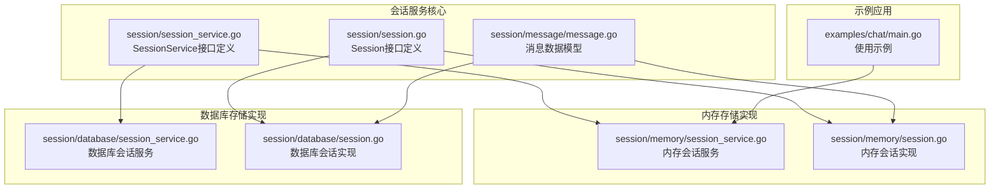
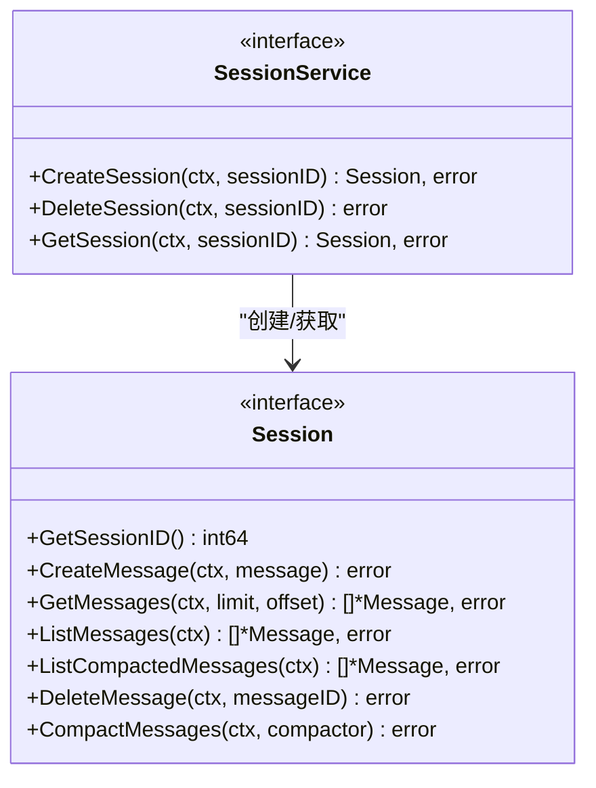
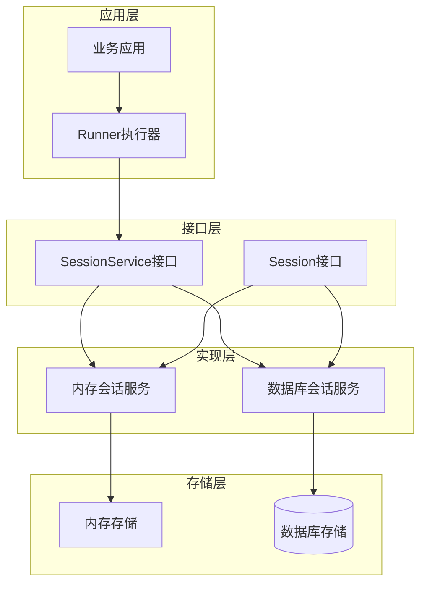
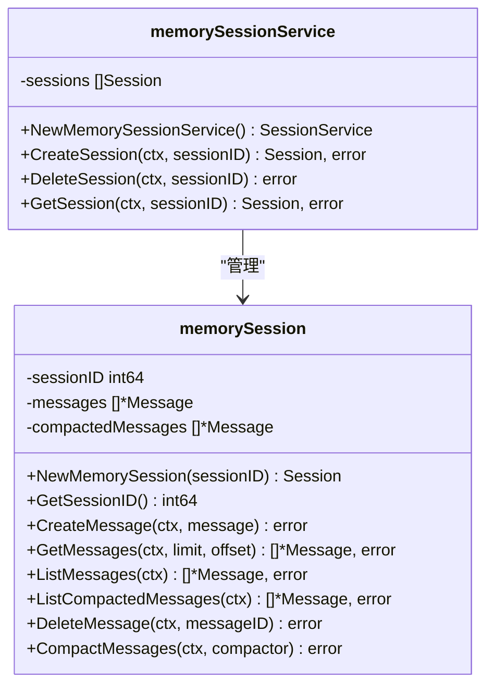
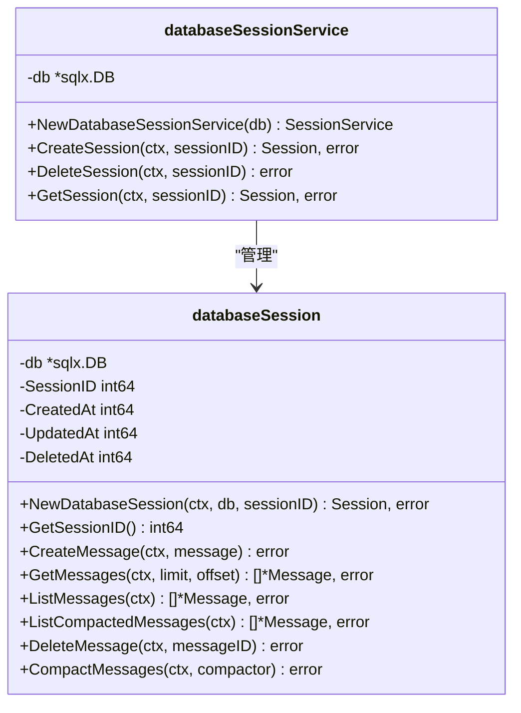
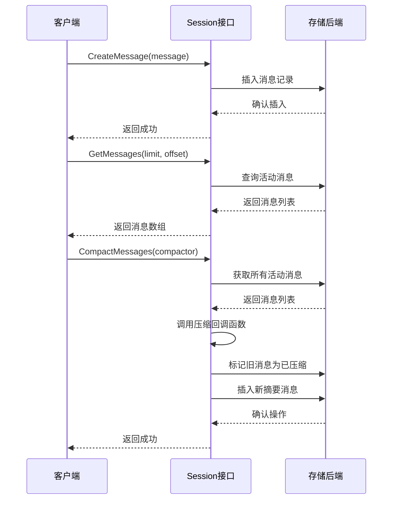
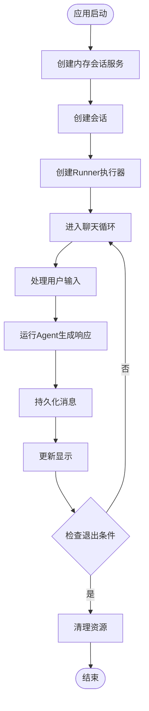
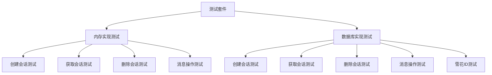
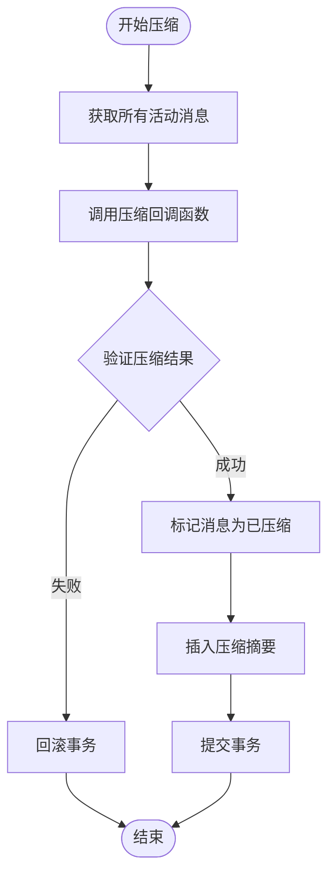

# 会话服务接口

<cite>
**本文档引用的文件**
- [session/session_service.go](file://session/session_service.go)
- [session/session.go](file://session/session.go)
- [session/memory/session_service.go](file://session/memory/session_service.go)
- [session/database/session_service.go](file://session/database/session_service.go)
- [session/memory/session.go](file://session/memory/session.go)
- [session/database/session.go](file://session/database/session.go)
- [session/message/message.go](file://session/message/message.go)
- [examples/chat/main.go](file://examples/chat/main.go)
- [session/memory/session_service_test.go](file://session/memory/session_service_test.go)
- [session/database/session_service_test.go](file://session/database/session_service_test.go)
- [session/memory/session_test.go](file://session/memory/session_test.go)
- [session/database/session_test.go](file://session/database/session_test.go)
</cite>

## 更新摘要
**变更内容**
- 补充完整的API参考文档，包括CreateSession、DeleteSession、GetSession方法的详细说明
- 增加Session接口的完整方法定义和参数说明
- 添加详细的错误处理策略和最佳实践建议
- 补充消息压缩机制的实现细节
- 增加性能优化和并发安全考虑

## 目录
1. [简介](#简介)
2. [项目结构](#项目结构)
3. [核心组件](#核心组件)
4. [架构概览](#架构概览)
5. [详细组件分析](#详细组件分析)
6. [API参考文档](#api参考文档)
7. [依赖关系分析](#依赖关系分析)
8. [性能考量](#性能考量)
9. [故障排除指南](#故障排除指南)
10. [结论](#结论)
11. [附录](#附录)

## 简介

ADK框架中的SessionService接口是会话管理系统的核心抽象层，它为AI代理开发提供了可插拔的会话存储解决方案。该接口设计遵循了Go语言的接口优先原则，通过清晰的抽象定义实现了内存和数据库两种不同的存储后端，同时保持了统一的API接口。

SessionService接口的设计理念体现了以下核心原则：
- **接口抽象**：通过SessionService接口抽象出会话管理的所有核心操作
- **存储无关性**：支持多种存储后端（内存、数据库），便于在不同场景下选择合适的实现
- **一致性保证**：无论使用哪种存储后端，都提供相同的API行为和语义
- **扩展性**：易于添加新的存储后端实现

## 项目结构

ADK框架采用模块化设计，会话服务相关的核心文件组织如下：



**图表来源**
- [session/session_service.go:1-10](file://session/session_service.go#L1-L10)
- [session/session.go:1-24](file://session/session.go#L1-L24)
- [session/memory/session_service.go:1-41](file://session/memory/session_service.go#L1-L41)
- [session/database/session_service.go:1-49](file://session/database/session_service.go#L1-L49)

**章节来源**
- [session/session_service.go:1-10](file://session/session_service.go#L1-L10)
- [session/session.go:1-24](file://session/session.go#L1-L24)

## 核心组件

### SessionService接口

SessionService接口是整个会话管理系统的核心抽象，定义了三个关键方法：



**图表来源**
- [session/session_service.go:5-9](file://session/session_service.go#L5-L9)
- [session/session.go:9-23](file://session/session.go#L9-L23)

### Session接口

Session接口定义了会话的状态管理和消息操作能力：

| 方法名 | 参数 | 返回值 | 功能描述 |
|--------|------|--------|----------|
| GetSessionID | 无 | int64 | 获取会话标识符 |
| CreateMessage | ctx, message* | error | 创建新消息 |
| GetMessages | ctx, limit, offset | []*Message, error | 分页获取活动消息 |
| ListMessages | ctx | []*Message, error | 获取所有活动消息 |
| ListCompactedMessages | ctx | []*Message, error | 获取已压缩的历史消息 |
| DeleteMessage | ctx, messageID | error | 删除指定消息 |
| CompactMessages | ctx, compactor | error | 压缩历史消息 |

**章节来源**
- [session/session.go:9-23](file://session/session.go#L9-L23)

## 架构概览

ADK框架的会话服务采用分层架构设计，实现了存储后端的完全解耦：



**图表来源**
- [session/session_service.go:5-9](file://session/session_service.go#L5-L9)
- [session/memory/session_service.go:14-16](file://session/memory/session_service.go#L14-L16)
- [session/database/session_service.go:23-25](file://session/database/session_service.go#L23-L25)

## 详细组件分析

### SessionService接口实现

#### 内存存储实现

内存会话服务提供了最简单的存储实现，适用于测试环境和单进程应用：



**图表来源**
- [session/memory/session_service.go:10-16](file://session/memory/session_service.go#L10-L16)
- [session/memory/session.go:12-24](file://session/memory/session.go#L12-L24)

#### 数据库存储实现

数据库会话服务提供了持久化的存储方案，支持跨进程和重启后的数据恢复：



**图表来源**
- [session/database/session_service.go:19-25](file://session/database/session_service.go#L19-L25)
- [session/database/session.go:26-32](file://session/database/session.go#L26-L32)

### 核心方法深度解析

#### CreateSession方法

CreateSession方法负责创建新的会话实例，其设计体现了以下特点：

**功能定义**：
- 接受上下文和会话ID作为参数
- 返回Session接口实例和错误信息
- 在内存实现中直接创建内存会话对象
- 在数据库实现中调用数据库会话构造函数

**参数要求**：
- ctx：用于超时控制和取消操作
- sessionID：唯一标识符，必须在系统内唯一

**返回值处理**：
- 成功时返回Session实例和nil错误
- 失败时返回nil和具体错误类型

**章节来源**
- [session/session_service.go:6](file://session/session_service.go#L6)
- [session/memory/session_service.go:18-22](file://session/memory/session_service.go#L18-L22)
- [session/database/session_service.go:27-29](file://session/database/session_service.go#L27-L29)

#### DeleteSession方法

DeleteSession方法实现了会话的删除逻辑：

**功能定义**：
- 接受上下文和会话ID
- 在内存实现中从切片中移除对应会话
- 在数据库实现中更新删除时间戳（软删除）

**参数要求**：
- ctx：上下文参数
- sessionID：要删除的会话标识符

**返回值处理**：
- 成功时返回nil错误
- 即使会话不存在也返回nil（幂等性）

**章节来源**
- [session/session_service.go:7](file://session/session_service.go#L7)
- [session/memory/session_service.go:24-32](file://session/memory/session_service.go#L24-L32)
- [session/database/session_service.go:31-35](file://session/database/session_service.go#L31-L35)

#### GetSession方法

GetSession方法提供了会话的检索功能：

**功能定义**：
- 根据会话ID查找对应的会话实例
- 支持未找到时返回nil而不是错误

**参数要求**：
- ctx：上下文参数
- sessionID：要查找的会话标识符

**返回值处理**：
- 找到会话：返回Session实例和nil错误
- 未找到会话：返回nil和nil错误
- 数据库错误：返回nil和具体错误

**章节来源**
- [session/session_service.go:8](file://session/session_service.go#L8)
- [session/memory/session_service.go:34-40](file://session/memory/session_service.go#L34-L40)
- [session/database/session_service.go:37-48](file://session/database/session_service.go#L37-L48)

### Session接口实现细节

#### 消息管理功能

Session接口的消息管理功能提供了完整的消息生命周期管理：



**图表来源**
- [session/session.go:11-22](file://session/session.go#L11-L22)
- [session/memory/session.go:30-85](file://session/memory/session.go#L30-L85)
- [session/database/session.go:46-145](file://session/database/session.go#L46-L145)

**章节来源**
- [session/session.go:11-22](file://session/session.go#L11-L22)
- [session/memory/session.go:30-85](file://session/memory/session.go#L30-L85)
- [session/database/session.go:46-145](file://session/database/session.go#L46-L145)

### 使用示例分析

#### 示例应用中的会话服务使用

在示例应用中，开发者展示了如何正确使用会话服务：



**图表来源**
- [examples/chat/main.go:114-124](file://examples/chat/main.go#L114-L124)
- [examples/chat/main.go:144-171](file://examples/chat/main.go#L144-L171)

**章节来源**
- [examples/chat/main.go:114-124](file://examples/chat/main.go#L114-L124)
- [examples/chat/main.go:144-171](file://examples/chat/main.go#L144-L171)

## API参考文档

### SessionService接口API参考

#### CreateSession(ctx, sessionID) Session, error

**功能**：创建一个新的会话实例

**参数**：
- `ctx context.Context`：上下文对象，用于超时控制和取消操作
- `sessionID int64`：会话唯一标识符

**返回值**：
- `Session`：会话实例对象
- `error`：错误信息，创建失败时返回具体错误类型

**使用示例**：
```go
service := memory.NewMemorySessionService()
session, err := service.CreateSession(ctx, 1001)
if err != nil {
    log.Fatal(err)
}
```

**章节来源**
- [session/session_service.go:6](file://session/session_service.go#L6)
- [session/memory/session_service.go:18-22](file://session/memory/session_service.go#L18-L22)
- [session/database/session_service.go:27-29](file://session/database/session_service.go#L27-L29)

#### DeleteSession(ctx, sessionID) error

**功能**：删除指定的会话实例

**参数**：
- `ctx context.Context`：上下文对象
- `sessionID int64`：要删除的会话标识符

**返回值**：
- `error`：错误信息，删除成功返回nil

**使用示例**：
```go
err := service.DeleteSession(ctx, 1001)
if err != nil {
    log.Fatal(err)
}
```

**章节来源**
- [session/session_service.go:7](file://session/session_service.go#L7)
- [session/memory/session_service.go:24-32](file://session/memory/session_service.go#L24-L32)
- [session/database/session_service.go:31-35](file://session/database/session_service.go#L31-L35)

#### GetSession(ctx, sessionID) Session, error

**功能**：获取指定的会话实例

**参数**：
- `ctx context.Context`：上下文对象
- `sessionID int64`：要获取的会话标识符

**返回值**：
- `Session`：会话实例对象，如果未找到返回nil
- `error`：错误信息

**使用示例**：
```go
session, err := service.GetSession(ctx, 1001)
if err != nil {
    log.Fatal(err)
}
if session == nil {
    // 会话不存在
    return
}
```

**章节来源**
- [session/session_service.go:8](file://session/session_service.go#L8)
- [session/memory/session_service.go:34-40](file://session/memory/session_service.go#L34-L40)
- [session/database/session_service.go:37-48](file://session/database/session_service.go#L37-L48)

### Session接口API参考

#### GetSessionID() int64

**功能**：获取会话的唯一标识符

**参数**：无

**返回值**：
- `int64`：会话标识符

**章节来源**
- [session/session.go:10](file://session/session.go#L10)
- [session/memory/session.go:26-28](file://session/memory/session.go#L26-L28)
- [session/database/session.go:43-45](file://session/database/session.go#L43-L45)

#### CreateMessage(ctx, message) error

**功能**：向会话中添加一条新消息

**参数**：
- `ctx context.Context`：上下文对象
- `message *message.Message`：消息对象

**返回值**：
- `error`：错误信息

**章节来源**
- [session/session.go:11](file://session/session.go#L11)
- [session/memory/session.go:30-33](file://session/memory/session.go#L30-L33)
- [session/database/session.go:46-63](file://session/database/session.go#L46-L63)

#### GetMessages(ctx, limit, offset) []*message.Message, error

**功能**：分页获取活动消息

**参数**：
- `ctx context.Context`：上下文对象
- `limit int64`：获取的消息数量限制
- `offset int64`：偏移量

**返回值**：
- `[]*message.Message`：消息数组
- `error`：错误信息

**章节来源**
- [session/session.go:14](file://session/session.go#L14)
- [session/memory/session.go:45-56](file://session/memory/session.go#L45-L56)
- [session/database/session.go:70-77](file://session/database/session.go#L70-L77)

#### ListMessages(ctx) []*message.Message, error

**功能**：获取所有活动消息

**参数**：
- `ctx context.Context`：上下文对象

**返回值**：
- `[]*message.Message`：消息数组
- `error`：错误信息

**章节来源**
- [session/session.go:17](file://session/session.go#L17)
- [session/memory/session.go:58-62](file://session/memory/session.go#L58-L62)
- [session/database/session.go:79-86](file://session/database/session.go#L79-L86)

#### ListCompactedMessages(ctx) []*message.Message, error

**功能**：获取所有已压缩的历史消息

**参数**：
- `ctx context.Context`：上下文对象

**返回值**：
- `[]*message.Message`：消息数组
- `error`：错误信息

**章节来源**
- [session/session.go:20](file://session/session.go#L20)
- [session/memory/session.go:64-68](file://session/memory/session.go#L64-L68)
- [session/database/session.go:88-95](file://session/database/session.go#L88-L95)

#### DeleteMessage(ctx, messageID) error

**功能**：删除指定消息

**参数**：
- `ctx context.Context`：上下文对象
- `messageID int64`：要删除的消息标识符

**返回值**：
- `error`：错误信息

**章节来源**
- [session/session.go:21](file://session/session.go#L21)
- [session/memory/session.go:35-43](file://session/memory/session.go#L35-L43)
- [session/database/session.go:65-68](file://session/database/session.go#L65-L68)

#### CompactMessages(ctx, compactor) error

**功能**：压缩历史消息为摘要

**参数**：
- `ctx context.Context`：上下文对象
- `compactor func(context.Context, []*message.Message) (*message.Message, error)`：压缩回调函数

**返回值**：
- `error`：错误信息

**章节来源**
- [session/session.go:22](file://session/session.go#L22)
- [session/memory/session.go:70-85](file://session/memory/session.go#L70-L85)
- [session/database/session.go:97-145](file://session/database/session.go#L97-L145)

## 依赖关系分析

### 组件耦合度分析

```mermaid
graph TB
subgraph "低耦合设计"
SS[SessionService接口]
S[Session接口]
MSG[Message数据模型]
end
subgraph "实现层"
MSS[内存实现]
DSS[数据库实现]
end
subgraph "外部依赖"
CTX[context包]
SQLX[sqlx库]
TEST[testify库]
```

**图表来源**
- [session/session_service.go:3](file://session/session_service.go#L3)
- [session/database/session_service.go:3-11](file://session/database/session_service.go#L3-L11)
- [session/memory/session_service.go:3-8](file://session/memory/session_service.go#L3-L8)

### 错误处理策略

会话服务实现了统一的错误处理模式：

| 方法 | 错误类型 | 处理策略 |
|------|----------|----------|
| CreateSession | 数据库连接错误 | 返回具体错误 |
| DeleteSession | 会话不存在 | 幂等性处理，返回nil |
| GetSession | 未找到会话 | 返回nil, nil |
| GetSession | 数据库查询错误 | 返回具体错误 |

**章节来源**
- [session/database/session_service.go:40-44](file://session/database/session_service.go#L40-L44)
- [session/memory/session_service.go:34-38](file://session/memory/session_service.go#L34-L38)

## 性能考量

### 内存存储性能特征

内存会话服务具有以下性能特点：
- **高读写速度**：基于内存操作，延迟极低
- **无序列化开销**：避免JSON或SQL序列化成本
- **内存占用**：随会话数量线性增长
- **适用场景**：测试环境、单进程应用、临时会话

### 数据库存储性能特征

数据库会话服务的性能考虑：
- **持久化保证**：数据不会因进程重启而丢失
- **并发控制**：通过事务确保数据一致性
- **索引优化**：需要合理设计数据库索引
- **适用场景**：生产环境、多进程部署、长期会话

### 最佳实践建议

1. **选择合适的存储后端**：
   - 开发测试阶段使用内存存储
   - 生产环境使用数据库存储

2. **错误处理策略**：
   - 对于幂等操作（删除）返回nil而非错误
   - 对于关键操作（创建）返回具体错误信息

3. **并发安全考虑**：
   - 内存实现使用切片操作，注意线程安全
   - 数据库实现通过事务保证原子性

4. **性能优化建议**：
   - 合理设置消息分页大小
   - 使用压缩功能减少存储空间
   - 定期清理过期会话

## 故障排除指南

### 常见问题诊断

#### 会话创建失败

**可能原因**：
- 数据库连接异常
- 会话ID冲突
- 权限不足

**解决方法**：
- 检查数据库连接配置
- 验证会话ID唯一性
- 确认数据库权限

#### 会话查询结果为空

**可能原因**：
- 会话已被删除
- 会话ID错误
- 数据库连接问题

**解决方法**：
- 验证会话ID是否正确
- 检查会话是否存在
- 确认数据库连接正常

#### 消息压缩失败

**可能原因**：
- 压缩回调函数返回错误
- 数据库事务失败
- 并发访问冲突

**解决方法**：
- 检查压缩逻辑实现
- 确认数据库事务完整性
- 实现适当的重试机制

**章节来源**
- [session/memory/session_service_test.go:48-55](file://session/memory/session_service_test.go#L48-L55)
- [session/database/session_service_test.go:60-70](file://session/database/session_service_test.go#L60-L70)

### 测试验证

框架提供了完整的测试套件来验证接口实现：



**图表来源**
- [session/memory/session_service_test.go:10-109](file://session/memory/session_service_test.go#L10-L109)
- [session/database/session_service_test.go:13-162](file://session/database/session_service_test.go#L13-L162)

**章节来源**
- [session/memory/session_service_test.go:10-109](file://session/memory/session_service_test.go#L10-L109)
- [session/database/session_service_test.go:13-162](file://session/database/session_service_test.go#L13-L162)

## 结论

ADK框架的SessionService接口设计体现了现代Go语言接口设计的最佳实践。通过清晰的抽象定义和灵活的实现策略，该接口成功地实现了会话管理系统的解耦和可扩展性。

### 设计优势

1. **接口抽象**：通过SessionService接口实现了存储后端的完全解耦
2. **一致性保证**：内存和数据库实现提供相同的API行为
3. **扩展性**：易于添加新的存储后端实现
4. **测试友好**：提供了完整的单元测试覆盖

### 应用建议

1. **开发阶段**：使用内存实现进行快速原型开发
2. **生产部署**：使用数据库实现确保数据持久化
3. **性能优化**：根据应用场景选择合适的存储后端
4. **错误处理**：遵循框架提供的错误处理模式

该接口设计为AI代理开发提供了坚实的基础，使得开发者可以专注于业务逻辑的实现，而不必担心底层存储的具体实现细节。

## 附录

### 接口实现规范

#### 必须满足的要求

1. **幂等性**：DeleteSession和GetSession方法必须支持幂等操作
2. **一致性**：CreateSession、DeleteSession、GetSession方法必须保持一致的行为
3. **错误处理**：必须正确处理各种错误场景
4. **上下文支持**：所有方法必须接受context参数

#### 推荐的实现模式

1. **内存实现**：适合测试和单进程应用
2. **数据库实现**：适合生产环境和多进程部署
3. **缓存层**：可以在实现中添加适当的缓存机制
4. **监控指标**：建议添加性能监控和日志记录

### 最佳实践清单

- 使用雪花ID作为会话标识符
- 实现适当的错误重试机制
- 添加必要的日志记录
- 考虑并发访问的安全性
- 定期清理过期的会话数据
- 监控存储空间使用情况

### 消息压缩机制详解

消息压缩是会话管理的重要特性，它通过将历史消息压缩为摘要来减少存储空间和提高查询性能：



**图表来源**
- [session/memory/session.go:70-85](file://session/memory/session.go#L70-L85)
- [session/database/session.go:97-145](file://session/database/session.go#L97-L145)

**章节来源**
- [session/memory/session.go:70-85](file://session/memory/session.go#L70-L85)
- [session/database/session.go:97-145](file://session/database/session.go#L97-L145)