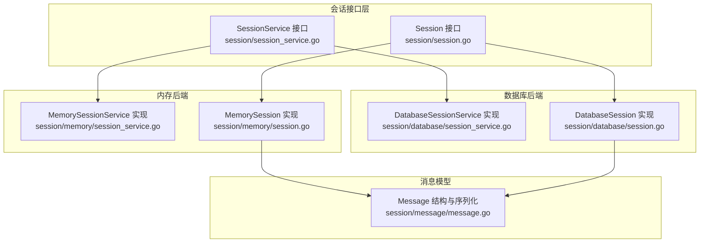
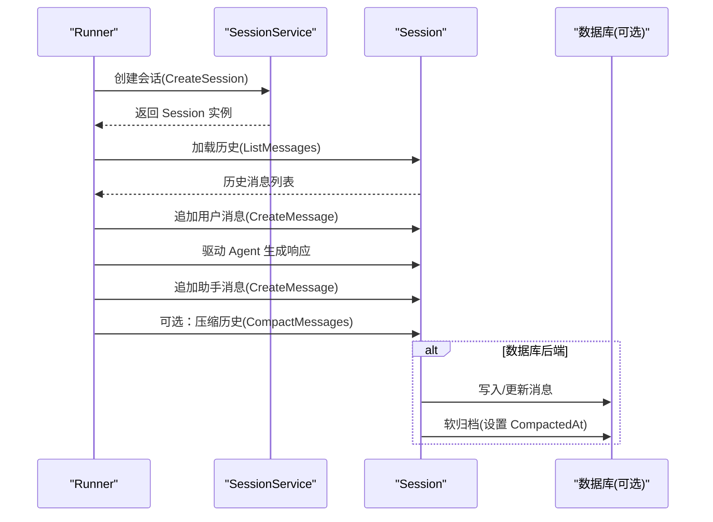
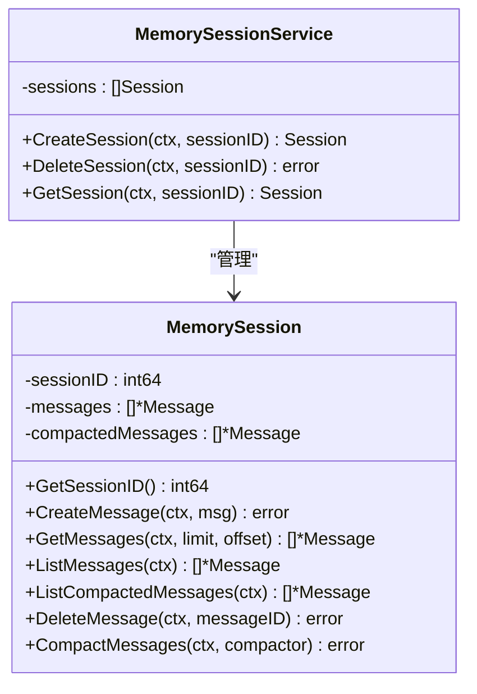
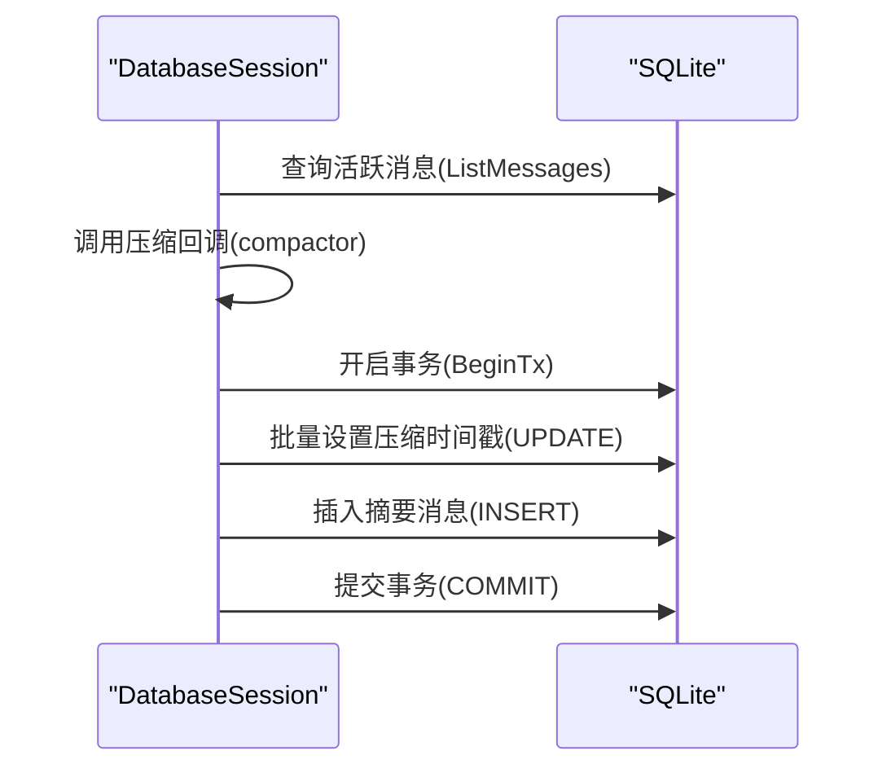
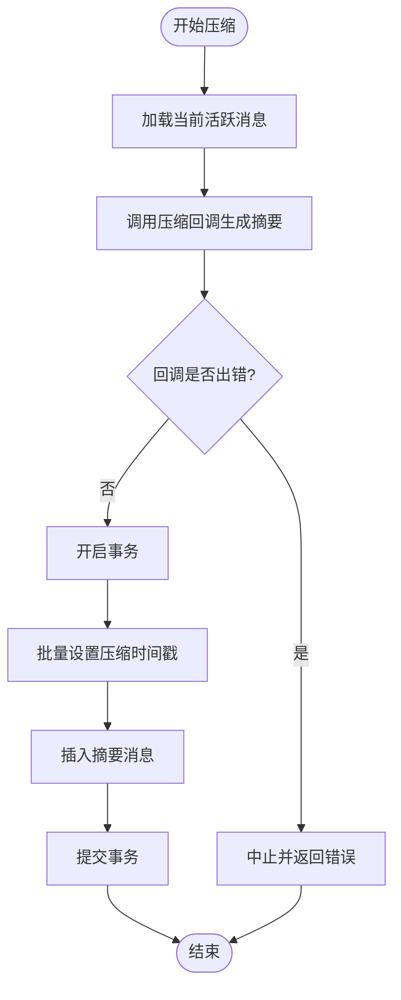
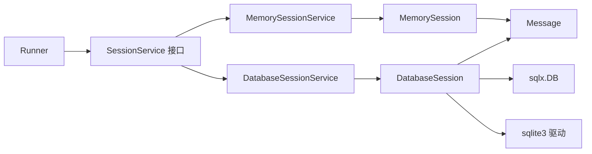

# 会话管理

<cite>
**本文引用的文件**
- [session/session.go](file://session/session.go)
- [session/session_service.go](file://session/session_service.go)
- [session/message/message.go](file://session/message/message.go)
- [session/memory/session_service.go](file://session/memory/session_service.go)
- [session/database/session_service.go](file://session/database/session_service.go)
- [session/memory/session.go](file://session/memory/session.go)
- [session/database/session.go](file://session/database/session.go)
- [session/memory/session_test.go](file://session/memory/session_test.go)
- [session/database/session_test.go](file://session/database/session_test.go)
- [session/memory/session_service_test.go](file://session/memory/session_service_test.go)
- [session/database/session_service_test.go](file://session/database/session_service_test.go)
- [README.md](file://README.md)
</cite>

## 目录
1. [简介](#简介)
2. [项目结构](#项目结构)
3. [核心组件](#核心组件)
4. [架构总览](#架构总览)
5. [详细组件分析](#详细组件分析)
6. [依赖分析](#依赖分析)
7. [性能考量](#性能考量)
8. [故障排查指南](#故障排查指南)
9. [结论](#结论)
10. [附录](#附录)

## 简介
本章节系统性介绍 ADK 框架的会话管理系统，重点覆盖以下方面：
- 会话与消息的历史存储、检索与管理
- SessionService 接口的设计理念与职责边界
- 内存后端与数据库后端的实现差异、适用场景与性能特征
- 消息历史压缩（软归档）机制与最佳实践
- 自定义会话后端的开发指南（接口与数据模型）
- 消息类型定义、多模态内容支持与工具调用消息处理
- 性能优化与数据迁移策略

## 项目结构
会话管理相关代码位于 session 包及其子包中，采用“接口 + 多后端实现”的分层设计：
- session 接口层：定义 Session 与 SessionService 的抽象契约
- session/message：定义可持久化的消息模型及序列化逻辑
- session/memory：基于内存的会话后端实现
- session/database：基于 SQLite 的会话后端实现

图表来源
- [session/session.go:9-23](file://session/session.go#L9-L23)
- [session/session_service.go:5-9](file://session/session_service.go#L5-L9)
- [session/message/message.go:49-128](file://session/message/message.go#L49-L128)
- [session/memory/session_service.go:10-40](file://session/memory/session_service.go#L10-L40)
- [session/database/session_service.go:19-48](file://session/database/session_service.go#L19-L48)
- [session/memory/session.go:12-85](file://session/memory/session.go#L12-L85)
- [session/database/session.go:26-145](file://session/database/session.go#L26-L145)

章节来源
- [session/session.go:9-23](file://session/session.go#L9-L23)
- [session/session_service.go:5-9](file://session/session_service.go#L5-L9)
- [session/message/message.go:49-128](file://session/message/message.go#L49-L128)
- [session/memory/session_service.go:10-40](file://session/memory/session_service.go#L10-L40)
- [session/database/session_service.go:19-48](file://session/database/session_service.go#L19-L48)
- [session/memory/session.go:12-85](file://session/memory/session.go#L12-L85)
- [session/database/session.go:26-145](file://session/database/session.go#L26-L145)

## 核心组件
- Session 接口：定义会话生命周期与消息管理能力，包括创建消息、分页获取消息、全量列出消息、列出已压缩消息、删除消息以及压缩历史等。
- SessionService 接口：定义会话服务的创建、删除与获取能力，用于解耦上层 Runner 与具体后端实现。
- Message 模型：定义持久化消息结构，包含角色、名称、内容、推理内容、工具调用、Token 统计、时间戳、压缩与删除标记等字段；并提供与模型层消息的双向转换。

章节来源
- [session/session.go:9-23](file://session/session.go#L9-L23)
- [session/session_service.go:5-9](file://session/session_service.go#L5-L9)
- [session/message/message.go:49-128](file://session/message/message.go#L49-L128)

## 架构总览
下图展示了 Runner 如何通过 SessionService 获取 Session，并在每轮对话中加载历史、追加并持久化消息，同时驱动 Agent 生成响应。

图表来源
- [session/session_service.go:5-9](file://session/session_service.go#L5-L9)
- [session/session.go:9-23](file://session/session.go#L9-L23)
- [session/database/session.go:46-145](file://session/database/session.go#L46-L145)
- [session/memory/session.go:30-85](file://session/memory/session.go#L30-L85)

## 详细组件分析

### SessionService 接口与设计理念
- 职责分离：SessionService 负责会话实例的创建、删除与获取，不直接关心消息存储细节，便于替换不同后端。
- 解耦 Runner：Runner 仅依赖 SessionService 与 Session 接口，无需感知内存或数据库实现差异。
- 可扩展性：新增后端（如 Redis、PostgreSQL）只需实现 Session 与 SessionService 即可无缝接入。

章节来源
- [session/session_service.go:5-9](file://session/session_service.go#L5-L9)
- [README.md:141-157](file://README.md#L141-L157)

### Session 接口与消息管理
- 消息创建：CreateMessage 将新消息写入当前活跃历史。
- 分页与全量：GetMessages 支持 limit/offset 分页；ListMessages 返回全部活跃消息。
- 已压缩消息：ListCompactedMessages 返回被压缩归档的消息集合。
- 删除消息：DeleteMessage 标记删除（软删除），不影响已压缩历史。
- 压缩历史：CompactMessages 接受压缩回调函数，将当前活跃消息汇总为摘要消息，并将原消息标记为已压缩。

章节来源
- [session/session.go:9-23](file://session/session.go#L9-L23)

### 内存后端实现
- 内存会话：使用切片维护活跃消息与已压缩消息，支持分页、全量列举与压缩。
- 会话服务：维护内存中的会话列表，提供创建、删除、查找。
- 压缩流程：直接在内存中执行压缩回调，更新消息的压缩时间戳并移动到压缩桶，最终只保留摘要消息。

图表来源
- [session/memory/session_service.go:10-40](file://session/memory/session_service.go#L10-L40)
- [session/memory/session.go:12-85](file://session/memory/session.go#L12-L85)

章节来源
- [session/memory/session_service.go:10-40](file://session/memory/session_service.go#L10-L40)
- [session/memory/session.go:12-85](file://session/memory/session.go#L12-L85)
- [session/memory/session_test.go:23-292](file://session/memory/session_test.go#L23-L292)

### 数据库后端实现
- 数据库会话：基于 SQLite，使用事务保证压缩过程的一致性；活跃消息与已压缩消息通过标志位区分。
- 会话服务：提供创建、删除（软删除）、获取（未删除且未归档）。
- 压缩流程：先查询当前活跃消息，调用压缩回调生成摘要，再开启事务批量设置压缩时间戳并插入摘要消息，最后提交事务。

图表来源
- [session/database/session.go:97-145](file://session/database/session.go#L97-L145)

章节来源
- [session/database/session_service.go:19-48](file://session/database/session_service.go#L19-L48)
- [session/database/session.go:26-145](file://session/database/session.go#L26-L145)
- [session/database/session_test.go:162-349](file://session/database/session_test.go#L162-L349)

### 消息模型与多模态支持
- 消息字段：角色、名称、内容、推理内容、工具调用、工具调用 ID、Token 统计、时间戳、压缩与删除标记。
- 工具调用序列化：ToolCalls 实现数据库值与扫描，支持 JSON 存储。
- 模型转换：Message 与模型层消息互转，保留 Token 使用信息与工具调用元数据。
- 多模态内容：模型层支持文本与图像等多模态部件，消息持久化时以字符串形式存储（如 JSON），便于跨后端兼容。

章节来源
- [session/message/message.go:11-128](file://session/message/message.go#L11-L128)
- [README.md:206-219](file://README.md#L206-L219)
- [README.md:360-376](file://README.md#L360-L376)

### 压缩与软归档机制
- 软归档：通过设置压缩时间戳而非物理删除，保留完整历史以便审计与回溯。
- 压缩流程：先获取活跃消息，调用外部压缩回调生成摘要，随后原子性地将原消息标记为已压缩并插入摘要消息。
- 历史查询：活跃消息与已压缩消息分别查询，避免混淆。

图表来源
- [session/memory/session.go:70-85](file://session/memory/session.go#L70-L85)
- [session/database/session.go:97-145](file://session/database/session.go#L97-L145)

章节来源
- [session/memory/session.go:70-85](file://session/memory/session.go#L70-L85)
- [session/database/session.go:97-145](file://session/database/session.go#L97-L145)
- [README.md:248-266](file://README.md#L248-L266)

### 自定义会话后端开发指南
- 必须实现
  - Session 接口：提供会话 ID、消息创建、分页获取、全量列举、已压缩列举、删除、压缩等方法。
  - SessionService 接口：提供会话创建、删除、获取。
- 数据模型建议
  - 会话表：会话 ID、创建时间、更新时间、删除时间（软删除）。
  - 消息表：消息 ID、角色、名称、内容、推理内容、工具调用（JSON）、工具调用 ID、Token 统计、创建时间、更新时间、压缩时间、删除时间（软删除）。
- 压缩实现要点
  - 原子性：压缩应使用事务，确保一致性。
  - 软归档：通过压缩时间戳区分活跃与已归档消息。
  - 回调容错：压缩回调失败时必须回滚，避免半更新状态。
- 多模态与工具调用
  - 工具调用使用 JSON 字段存储，需实现数据库值与扫描。
  - 多模态内容建议序列化为字符串，便于跨后端一致存储。

章节来源
- [session/session.go:9-23](file://session/session.go#L9-L23)
- [session/session_service.go:5-9](file://session/session_service.go#L5-L9)
- [session/message/message.go:11-47](file://session/message/message.go#L11-L47)
- [session/database/session.go:14-24](file://session/database/session.go#L14-L24)

## 依赖分析
- Session 与 SessionService 为接口层，解耦上层 Runner 与后端实现。
- 内存后端直接操作内存切片，无外部依赖。
- 数据库后端依赖 sqlx 与 sqlite3 驱动，使用事务保证压缩一致性。
- Message 模型依赖数据库驱动接口进行 JSON 序列化与反序列化。

图表来源
- [session/session_service.go:5-9](file://session/session_service.go#L5-L9)
- [session/memory/session_service.go:10-40](file://session/memory/session_service.go#L10-L40)
- [session/database/session_service.go:19-25](file://session/database/session_service.go#L19-L25)
- [session/memory/session.go:12-85](file://session/memory/session.go#L12-L85)
- [session/database/session.go:26-145](file://session/database/session.go#L26-L145)
- [session/message/message.go:22-47](file://session/message/message.go#L22-L47)

章节来源
- [session/session_service.go:5-9](file://session/session_service.go#L5-L9)
- [session/memory/session_service.go:10-40](file://session/memory/session_service.go#L10-L40)
- [session/database/session_service.go:19-25](file://session/database/session_service.go#L19-L25)
- [session/memory/session.go:12-85](file://session/memory/session.go#L12-L85)
- [session/database/session.go:26-145](file://session/database/session.go#L26-L145)
- [session/message/message.go:22-47](file://session/message/message.go#L22-L47)

## 性能考量
- 内存后端
  - 优点：零配置、低延迟、高吞吐；适合单进程测试或短生命周期会话。
  - 缺点：进程重启即丢失；不适合大规模并发或多实例部署。
- 数据库后端
  - 优点：持久化、可扩展、事务一致性；适合生产环境与多实例部署。
  - 缺点：引入磁盘 IO 与锁竞争；需要合理索引与连接池配置。
- 压缩策略
  - 定期压缩可显著降低活跃消息数量，减少查询与传输开销。
  - 建议按消息条数阈值或时间窗口触发压缩。
- 索引建议
  - 消息表：按 created_at 排序查询常用；按 deleted_at 与 compacted_at 过滤活跃/已压缩。
  - 会话表：按 session_id 与 deleted_at 过滤。
- 连接与事务
  - 压缩操作使用事务，避免部分更新；批量更新压缩时间戳与插入摘要消息应尽量合并为一次事务提交。

[本节为通用性能建议，不直接分析特定文件，故无章节来源]

## 故障排查指南
- 压缩回调错误
  - 现象：压缩失败，返回错误；活跃消息未被移动至压缩桶。
  - 排查：检查回调逻辑与输入消息集合；确认事务回滚路径正确。
- 会话获取为空
  - 现象：GetSession 返回空；可能因会话不存在或已被软删除。
  - 排查：确认会话 ID 正确；检查 deleted_at 条件过滤。
- 分页结果异常
  - 现象：分页偏移越界或结果为空。
  - 排查：确认 limit/offset 参数；检查活跃消息数量与排序。
- 工具调用 JSON 解析失败
  - 现象：从数据库读取工具调用时报类型不匹配。
  - 排查：确认 JSON 字段格式；检查 Scan 实现对多种源类型的处理。

章节来源
- [session/memory/session_test.go:196-220](file://session/memory/session_test.go#L196-L220)
- [session/database/session_test.go:238-266](file://session/database/session_test.go#L238-L266)
- [session/database/session_service.go:37-47](file://session/database/session_service.go#L37-L47)
- [session/message/message.go:31-47](file://session/message/message.go#L31-L47)

## 结论
ADK 的会话管理通过清晰的接口分层与双后端实现，提供了灵活、可扩展且具备软归档能力的历史管理方案。内存后端适合快速迭代与测试，数据库后端适合生产与持久化需求。通过压缩机制与软归档，系统在保留完整历史的同时有效控制存储与查询成本。开发者可据此快速实现自定义后端，满足更广泛的业务场景。

[本节为总结性内容，不直接分析特定文件，故无章节来源]

## 附录

### 最佳实践清单
- 选择后端：开发/测试用内存后端；生产用数据库后端。
- 压缩策略：设定阈值或周期性触发压缩；确保回调健壮性。
- 多模态与工具调用：统一序列化格式，保持跨后端一致性。
- 错误处理：压缩失败必须回滚；删除采用软删除。
- 性能优化：为高频查询建立合适索引；控制活跃消息规模。

### 数据迁移策略
- 从内存迁移到数据库：导出会话历史为标准消息格式，按批次写入数据库；完成后切换服务端点。
- 跨数据库迁移：遵循相同消息模型与压缩规则，使用事务批量迁移；迁移期间保持只读验证。
- 历史保留：迁移前评估压缩策略，避免冗余数据迁移。

[本节为通用指导，不直接分析特定文件，故无章节来源]