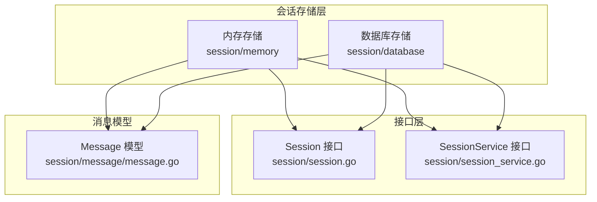
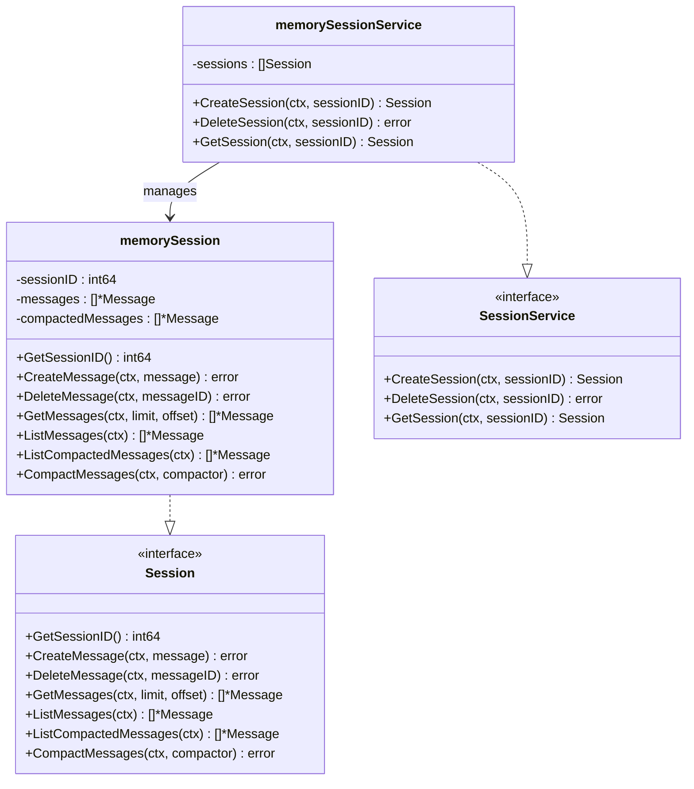
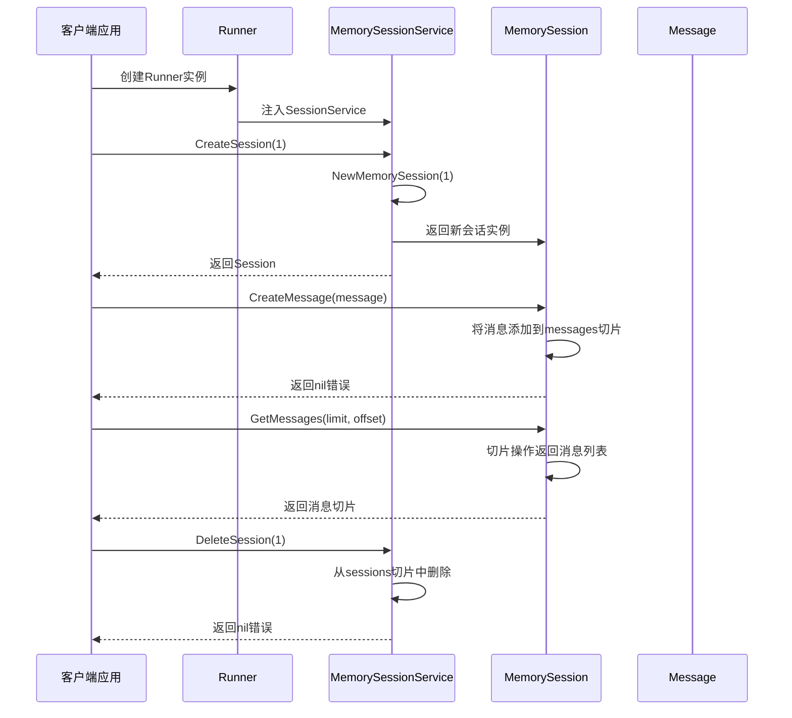
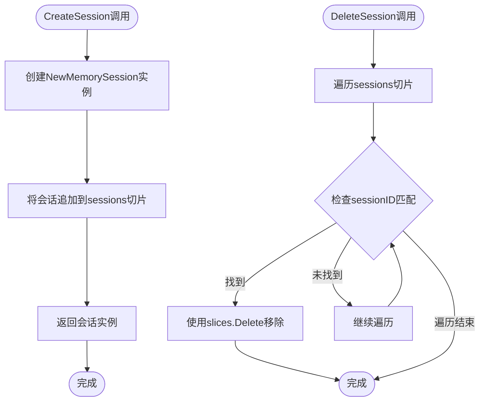
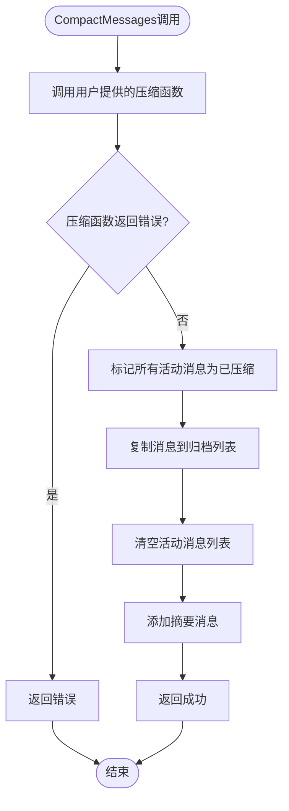
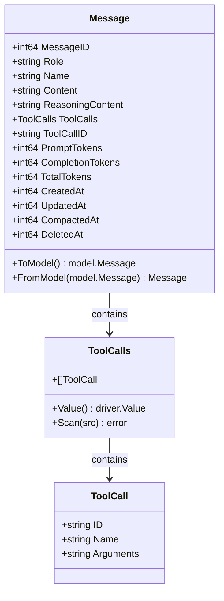
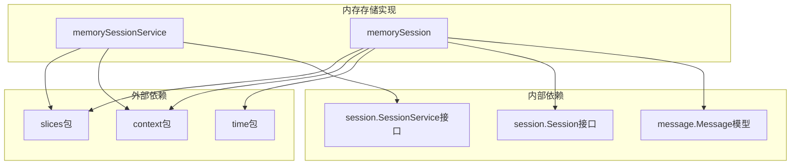

# 内存存储后端

<cite>
**本文档引用的文件**
- [session/memory/session_service.go](file://session/memory/session_service.go)
- [session/memory/session.go](file://session/memory/session.go)
- [session/session_service.go](file://session/session_service.go)
- [session/session.go](file://session/session.go)
- [session/memory/session_service_test.go](file://session/memory/session_service_test.go)
- [session/memory/session_test.go](file://session/memory/session_test.go)
- [session/message/message.go](file://session/message/message.go)
- [session/database/session_service.go](file://session/database/session_service.go)
- [session/database/session.go](file://session/database/session.go)
- [README.md](file://README.md)
</cite>

## 目录
1. [简介](#简介)
2. [项目结构](#项目结构)
3. [核心组件](#核心组件)
4. [架构概览](#架构概览)
5. [详细组件分析](#详细组件分析)
6. [依赖关系分析](#依赖关系分析)
7. [性能考虑](#性能考虑)
8. [故障排除指南](#故障排除指南)
9. [使用场景与最佳实践](#使用场景与最佳实践)
10. [结论](#结论)

## 简介

ADK（Agent Development Kit）框架提供了灵活的会话存储解决方案，其中内存存储后端是零配置的临时存储方案。本文档深入分析MemorySessionService的实现机制，包括内存数据结构设计、并发安全机制和性能特点，并详细展示内存后端在会话创建、消息存储、查询和删除操作中的具体实现。

内存存储后端特别适用于开发测试环境、临时会话和高性能需求场景，为开发者提供了一个简单而高效的会话管理解决方案。

## 项目结构

ADK框架采用模块化设计，内存存储后端位于`session/memory`包中，与数据库存储后端形成对比：



**图表来源**
- [session/memory/session_service.go:1-41](file://session/memory/session_service.go#L1-L41)
- [session/memory/session.go:1-86](file://session/memory/session.go#L1-L86)
- [session/session_service.go:1-10](file://session/session_service.go#L1-L10)
- [session/session.go:1-24](file://session/session.go#L1-L24)

**章节来源**
- [session/memory/session_service.go:1-41](file://session/memory/session_service.go#L1-L41)
- [session/memory/session.go:1-86](file://session/memory/session.go#L1-L86)
- [session/session_service.go:1-10](file://session/session_service.go#L1-L10)
- [session/session.go:1-24](file://session/session.go#L1-L24)

## 核心组件

内存存储后端由两个核心组件构成：`memorySessionService`和`memorySession`，它们实现了统一的Session和SessionService接口。

### 数据结构设计

内存存储后端采用简洁高效的数据结构：



**图表来源**
- [session/memory/session_service.go:10-16](file://session/memory/session_service.go#L10-L16)
- [session/memory/session.go:12-24](file://session/memory/session.go#L12-L24)
- [session/session.go:9-23](file://session/session.go#L9-L23)
- [session/session_service.go:5-9](file://session/session_service.go#L5-L9)

### 并发安全机制

内存存储后端的并发安全特性需要特别关注：

1. **线程安全性**：当前实现未提供内置的并发控制机制
2. **数据竞争风险**：多个goroutine同时访问同一会话可能导致数据竞争
3. **建议的防护措施**：
   - 使用互斥锁保护共享状态
   - 实现读写分离的并发控制
   - 考虑使用channel进行异步操作

**章节来源**
- [session/memory/session_service.go:10-16](file://session/memory/session_service.go#L10-L16)
- [session/memory/session.go:12-24](file://session/memory/session.go#L12-L24)

## 架构概览

内存存储后端遵循ADK框架的插件式架构设计：



**图表来源**
- [session/memory/session_service.go:18-40](file://session/memory/session_service.go#L18-L40)
- [session/memory/session.go:30-62](file://session/memory/session.go#L30-L62)

## 详细组件分析

### MemorySessionService 实现

MemorySessionService是内存存储的核心服务，负责会话的生命周期管理：

#### 会话管理操作

| 操作类型 | 方法签名 | 时间复杂度 | 描述 |
|---------|----------|------------|------|
| 创建会话 | `CreateSession(ctx, sessionID)` | O(1) | 创建新的内存会话并添加到管理列表 |
| 删除会话 | `DeleteSession(ctx, sessionID)` | O(n) | 在会话列表中查找并删除指定会话 |
| 获取会话 | `GetSession(ctx, sessionID)` | O(n) | 查找并返回指定ID的会话 |

#### 实现细节



**图表来源**
- [session/memory/session_service.go:18-32](file://session/memory/session_service.go#L18-L32)

**章节来源**
- [session/memory/session_service.go:14-40](file://session/memory/session_service.go#L14-L40)

### MemorySession 实现

MemorySession处理具体的会话操作，包括消息的增删查改：

#### 消息管理操作

| 操作类型 | 方法签名 | 时间复杂度 | 描述 |
|---------|----------|------------|------|
| 创建消息 | `CreateMessage(ctx, message)` | O(1) | 将消息添加到活动消息列表末尾 |
| 删除消息 | `DeleteMessage(ctx, messageID)` | O(n) | 遍历查找并删除指定ID的消息 |
| 获取消息 | `GetMessages(ctx, limit, offset)` | O(k) | 基于偏移量和限制返回消息切片 |
| 列出所有消息 | `ListMessages(ctx)` | O(n) | 返回活动消息的完整副本 |
| 压缩消息 | `CompactMessages(ctx, compactor)` | O(n+m) | 归档旧消息并生成摘要 |

#### 消息压缩机制

内存存储支持软归档机制，通过`CompactMessages`方法实现：



**图表来源**
- [session/memory/session.go:70-85](file://session/memory/session.go#L70-L85)

**章节来源**
- [session/memory/session.go:18-86](file://session/memory/session.go#L18-L86)

### Message 数据模型

Message结构体定义了消息的完整数据模型：



**图表来源**
- [session/message/message.go:49-73](file://session/message/message.go#L49-L73)
- [session/message/message.go:11-17](file://session/message/message.go#L11-L17)

**章节来源**
- [session/message/message.go:1-129](file://session/message/message.go#L1-L129)

## 依赖关系分析

内存存储后端的依赖关系相对简单，主要依赖于标准库和会话接口：



**图表来源**
- [session/memory/session_service.go:3-8](file://session/memory/session_service.go#L3-L8)
- [session/memory/session.go:3-10](file://session/memory/session.go#L3-L10)

### 与数据库存储的对比

| 特性 | 内存存储 | 数据库存储 |
|------|----------|------------|
| **持久性** | 无（进程内存） | 有（磁盘存储） |
| **容量限制** | 受系统内存限制 | 受磁盘空间限制 |
| **性能** | 极高（O(1)操作） | 中等（I/O开销） |
| **并发安全** | 需要额外保护 | 事务隔离 |
| **配置复杂度** | 零配置 | 需要数据库连接 |
| **重启恢复** | 不支持 | 支持 |

**章节来源**
- [session/database/session_service.go:1-49](file://session/database/session_service.go#L1-L49)
- [session/database/session.go:1-146](file://session/database/session.go#L1-L146)

## 性能考虑

### 时间复杂度分析

内存存储后端的操作具有以下时间复杂度特征：

- **会话管理**：O(1) 创建，O(n) 删除和查找
- **消息管理**：O(1) 添加，O(n) 删除和查找
- **消息查询**：O(k) 返回，其中k为返回的消息数量
- **消息压缩**：O(n+m)，n为活动消息数，m为压缩输出

### 空间复杂度分析

- **内存占用**：每个消息约占用100-200字节（取决于内容长度）
- **切片增长**：Go切片按需扩容，通常按2倍增长
- **归档机制**：压缩后的消息保留在归档列表中

### 性能优化建议

1. **批量操作**：合并多个消息操作以减少切片重分配
2. **预分配容量**：根据预期消息数量预分配切片容量
3. **定期清理**：实现自动清理机制避免无限增长
4. **内存池**：考虑使用对象池减少GC压力

## 故障排除指南

### 常见问题及解决方案

#### 1. 内存泄漏问题

**症状**：应用程序内存持续增长
**原因**：会话未正确删除导致消息累积
**解决方案**：
- 确保在不再需要时调用`DeleteSession`
- 实现超时清理机制
- 监控会话数量和消息数量

#### 2. 并发访问冲突

**症状**：数据竞争错误或不一致的状态
**原因**：多goroutine同时访问同一会话
**解决方案**：
- 为每个会话实现互斥锁
- 使用channel进行异步操作
- 考虑实现读写分离

#### 3. 大消息处理问题

**症状**：内存不足或性能下降
**原因**：单个消息过大或消息数量过多
**解决方案**：
- 实施消息大小限制
- 使用压缩算法
- 定期执行消息压缩

**章节来源**
- [session/memory/session_service_test.go:1-110](file://session/memory/session_service_test.go#L1-L110)
- [session/memory/session_test.go:1-293](file://session/memory/session_test.go#L1-L293)

## 使用场景与最佳实践

### 适用场景

#### 开发测试环境
内存存储后端最适合开发和测试场景，因为它：
- 无需额外配置
- 启动速度快
- 自动清理，不会留下持久数据
- 便于单元测试和集成测试

#### 临时会话
适用于需要临时存储的场景：
- 一次性对话会话
- 临时数据缓存
- 短暂的实验性功能

#### 高性能需求场景
当对延迟要求极高时：
- 实时聊天应用
- 高频查询场景
- 低延迟响应要求

### 最佳实践

#### 内存使用优化

1. **合理设置会话生命周期**
```go
// 设置会话超时时间
func cleanupExpiredSessions() {
    now := time.Now().UnixMilli()
    for _, session := range sessions {
        if now - session.CreatedAt > MAX_SESSION_AGE {
            DeleteSession(session.GetSessionID())
        }
    }
}
```

2. **实施消息数量限制**
```go
func enforceMessageLimit(session *memorySession, maxMessages int) {
    if len(session.messages) > maxMessages {
        // 删除最旧的消息
        session.messages = session.messages[len(session.messages)-maxMessages:]
    }
}
```

#### 垃圾回收策略

1. **定期清理机制**
```go
// 实现定时清理任务
ticker := time.NewTicker(CLEANUP_INTERVAL)
go func() {
    for range ticker.C {
        cleanupInactiveSessions()
        cleanupLargeSessions()
    }
}()
```

2. **内存压力监控**
```go
func monitorMemoryUsage() {
    var m runtime.MemStats
    runtime.ReadMemStats(&m)
    if m.Alloc > MEMORY_THRESHOLD {
        triggerCleanup()
    }
}
```

#### 资源清理机制

1. **优雅关闭**
```go
func shutdownGracefully() {
    // 清理所有会话
    for _, session := range sessions {
        session.cleanup()
    }
    // 触发GC
    runtime.GC()
}
```

2. **错误处理**
```go
func safeOperation(operation func() error) error {
    defer func() {
        if r := recover(); r != nil {
            log.Printf("Recovered from panic: %v", r)
        }
    }()
    return operation()
}
```

### 代码示例路径

#### 基本使用示例
- [内存会话服务创建:10-18](file://session/memory/session_service_test.go#L10-L18)
- [多会话管理:20-33](file://session/memory/session_service_test.go#L20-L33)
- [会话生命周期管理:80-109](file://session/memory/session_service_test.go#L80-L109)

#### 消息操作示例
- [消息创建和查询:23-39](file://session/memory/session_test.go#L23-L39)
- [消息删除操作:41-67](file://session/memory/session_test.go#L41-L67)
- [分页查询:88-126](file://session/memory/session_test.go#L88-L126)

#### 消息压缩示例
- [基本压缩功能:128-167](file://session/memory/session_test.go#L128-L167)
- [空消息压缩:169-194](file://session/memory/session_test.go#L169-L194)
- [多次压缩轮次:255-292](file://session/memory/session_test.go#L255-L292)

**章节来源**
- [README.md:143-157](file://README.md#L143-L157)
- [session/memory/session_service_test.go:1-110](file://session/memory/session_service_test.go#L1-L110)
- [session/memory/session_test.go:1-293](file://session/memory/session_test.go#L1-L293)

## 结论

ADK框架的内存存储后端提供了一个简洁、高效且易于使用的会话管理解决方案。其设计特点包括：

### 主要优势
- **简单易用**：零配置，快速部署
- **高性能**：基于内存操作，O(1)时间复杂度
- **轻量级**：最小的依赖和资源消耗
- **适合测试**：自动清理，无持久化影响

### 适用性评估
内存存储后端最适合以下场景：
- 开发和测试环境
- 临时会话和一次性对话
- 对延迟敏感的实时应用
- 小规模、短期的数据存储需求

### 限制与注意事项
- **无持久性**：进程重启后数据丢失
- **内存限制**：受系统内存容量限制
- **并发安全**：需要额外的并发控制机制
- **扩展性**：不适合大规模生产环境

对于生产环境，建议使用数据库存储后端，它提供了更好的持久性、并发安全性和可扩展性。内存存储后端作为开发工具和临时解决方案，为开发者提供了快速原型开发和测试验证的便利。

**更新** 本次更新补充了消息压缩机制的详细实现说明，包括压缩过程中的时间戳记录和归档机制，以及消息持久化相关字段的说明。这些改进使得内存存储后端能够更好地支持消息的历史管理和压缩存储需求。