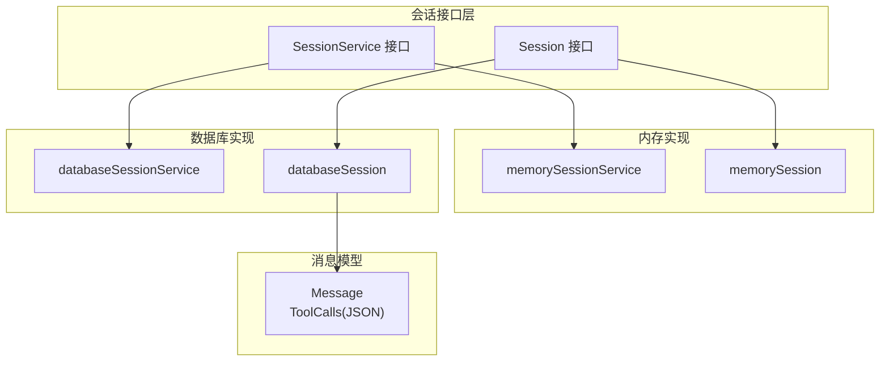
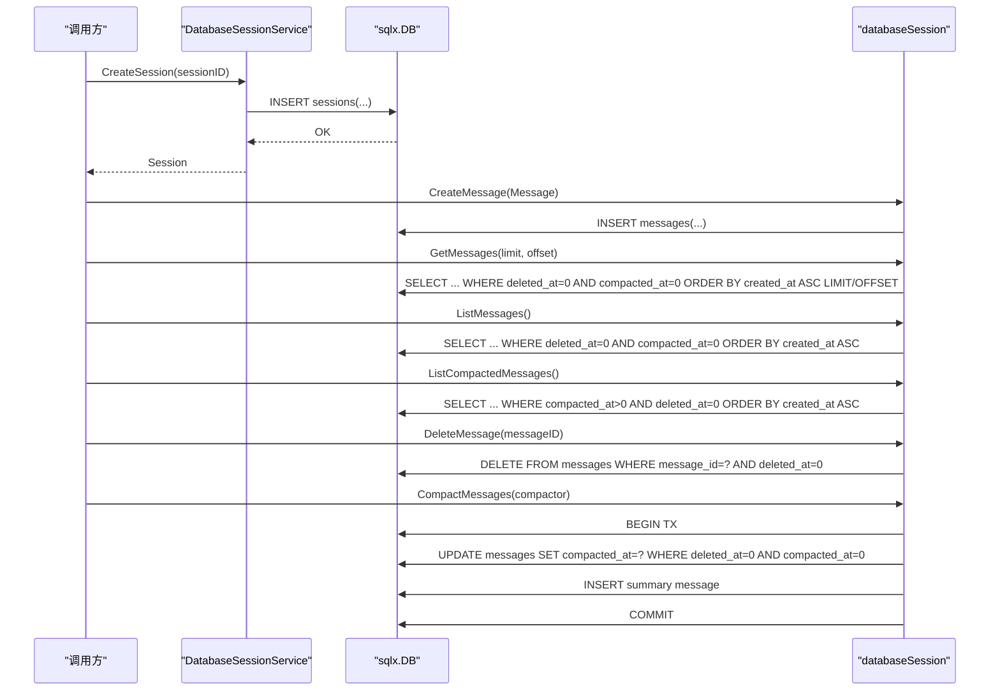
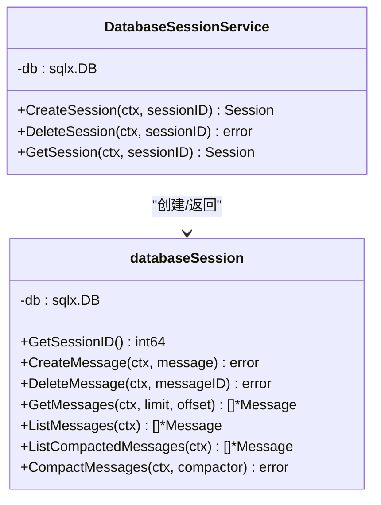
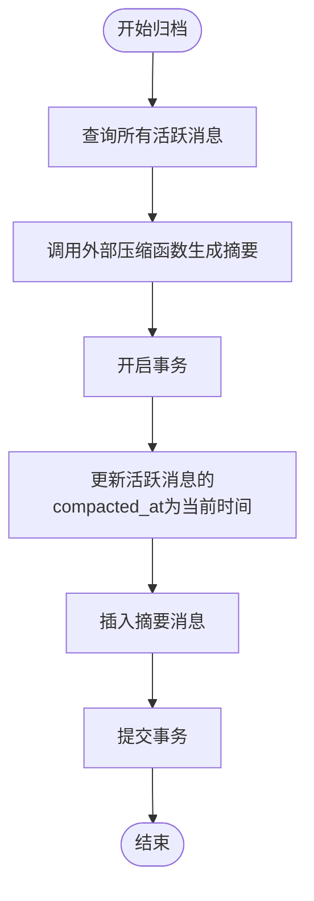
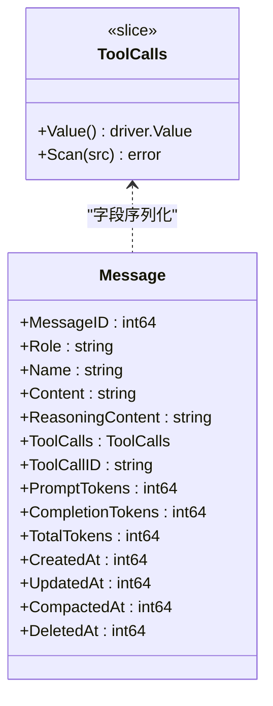
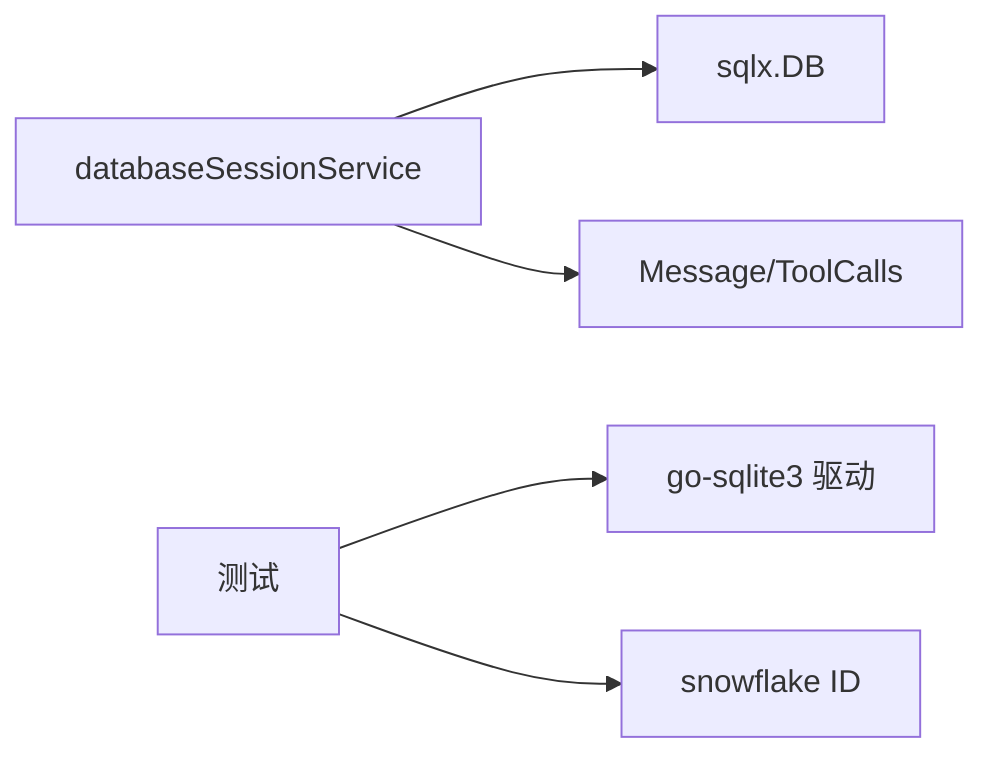

# 数据库存储后端

<cite>
**本文引用的文件列表**
- [session/database/session_service.go](file://session/database/session_service.go)
- [session/database/session.go](file://session/database/session.go)
- [session/session_service.go](file://session/session_service.go)
- [session/session.go](file://session/session.go)
- [session/message/message.go](file://session/message/message.go)
- [session/memory/session_service.go](file://session/memory/session_service.go)
- [session/memory/session.go](file://session/memory/session.go)
- [session/database/session_test.go](file://session/database/session_test.go)
- [session/database/session_service_test.go](file://session/database/session_service_test.go)
- [internal/snowflake/snowflake.go](file://internal/snowflake/snowflake.go)
- [README.md](file://README.md)
</cite>

## 目录
1. [简介](#简介)
2. [项目结构](#项目结构)
3. [核心组件](#核心组件)
4. [架构总览](#架构总览)
5. [详细组件分析](#详细组件分析)
6. [依赖关系分析](#依赖关系分析)
7. [性能考量](#性能考量)
8. [故障排查指南](#故障排查指南)
9. [结论](#结论)
10. [附录](#附录)

## 简介
本文件系统性阐述ADK框架中数据库存储后端的实现架构与数据持久化机制，重点围绕DatabaseSessionService的设计思路、SQLite数据库选择、表结构与索引策略、连接管理与事务控制、并发控制、会话数据的序列化存储与查询优化、批量操作、迁移与版本兼容、备份恢复策略，以及与内存后端的性能对比与配置优化建议。文档同时给出数据库Schema定义、初始化脚本与使用示例路径，帮助读者快速理解并正确使用该后端。

## 项目结构
数据库存储后端位于session/database目录，采用接口隔离与分层设计：
- 接口层：session包定义Session与SessionService接口，统一抽象不同后端行为。
- 数据库实现层：database包提供基于SQLite的实现，使用sqlx进行SQL操作。
- 内存实现层：memory包提供纯内存实现，便于测试与单进程场景。
- 消息模型：message包定义消息结构及JSON序列化/反序列化逻辑。
- 测试与工具：包含单元测试、Schema初始化脚本与Snowflake ID生成器。

图表来源
- [session/session_service.go:5-9](file://session/session_service.go#L5-L9)
- [session/session.go:9-23](file://session/session.go#L9-L23)
- [session/memory/session_service.go:10-16](file://session/memory/session_service.go#L10-L16)
- [session/memory/session.go:12-24](file://session/memory/session.go#L12-L24)
- [session/database/session_service.go:19-25](file://session/database/session_service.go#L19-L25)
- [session/database/session.go:26-32](file://session/database/session.go#L26-L32)
- [session/message/message.go:49-73](file://session/message/message.go#L49-L73)

章节来源
- [README.md:67-89](file://README.md#L67-L89)
- [session/session_service.go:5-9](file://session/session_service.go#L5-L9)
- [session/session.go:9-23](file://session/session.go#L9-L23)

## 核心组件
- SessionService接口：定义创建、删除、获取会话的能力，是上层Runner与Agent的会话入口。
- Session接口：定义消息的创建、删除、分页/全量读取、归档（压缩）等能力。
- databaseSessionService：基于SQLite的会话服务实现，内部持有sqlx.DB。
- databaseSession：基于SQLite的会话实现，负责消息的增删查与归档。
- Message与ToolCalls：消息持久化模型，ToolCalls通过JSON序列化存储在TEXT字段中。

章节来源
- [session/session_service.go:5-9](file://session/session_service.go#L5-L9)
- [session/session.go:9-23](file://session/session.go#L9-L23)
- [session/database/session_service.go:19-25](file://session/database/session_service.go#L19-L25)
- [session/database/session.go:26-32](file://session/database/session.go#L26-L32)
- [session/message/message.go:49-73](file://session/message/message.go#L49-L73)

## 架构总览
数据库后端采用“服务+会话”两级结构：
- 服务层：DatabaseSessionService负责会话生命周期管理（创建/删除/获取），内部通过sqlx.DB执行SQL。
- 会话层：databaseSession封装具体会话的数据访问，提供消息的插入、删除、分页查询、全量查询、归档查询与归档事务。

图表来源
- [session/database/session_service.go:27-48](file://session/database/session_service.go#L27-L48)
- [session/database/session.go:46-145](file://session/database/session.go#L46-L145)

## 详细组件分析

### DatabaseSessionService 设计与实现
- 职责：会话服务工厂与生命周期管理，返回databaseSession实例；支持按ID删除与查询会话。
- 关键点：
  - 使用sqlx.DB执行SQL，支持上下文超时与取消。
  - 删除会话采用软删除策略（更新deleted_at为当前时间戳）。
  - 获取会话时若未找到返回空而非错误，便于上层判断。

图表来源
- [session/database/session_service.go:19-25](file://session/database/session_service.go#L19-L25)
- [session/database/session.go:26-32](file://session/database/session.go#L26-L32)

章节来源
- [session/database/session_service.go:27-48](file://session/database/session_service.go#L27-L48)

### databaseSession 数据访问与事务
- 表与列：
  - sessions：主键session_id，记录创建/更新/删除时间戳。
  - messages：主键message_id，包含角色、名称、内容、推理内容、工具调用JSON、工具调用ID、Token用量、创建/更新/归档/删除时间戳。
- 查询与操作：
  - 创建消息：INSERT，所有活跃消息（未归档且未删除）的compacted_at=0。
  - 删除消息：DELETE，软删除（deleted_at=0时才允许删除）。
  - 分页查询：按created_at升序，限制条数与偏移。
  - 全量查询：同上但无LIMIT/OFFSET。
  - 归档查询：仅返回compacted_at>0且未删除的消息。
  - 归档事务：BEGIN TX -> 更新所有活跃消息的compacted_at -> 插入摘要消息 -> COMMIT。
- 并发控制：通过数据库事务保证归档过程原子性；未见显式锁或行级锁，依赖数据库事务隔离级别。

图表来源
- [session/database/session.go:97-145](file://session/database/session.go#L97-L145)

章节来源
- [session/database/session.go:14-24](file://session/database/session.go#L14-L24)
- [session/database/session.go:46-145](file://session/database/session.go#L46-L145)

### 消息序列化与存储
- ToolCalls采用JSON序列化存储于TEXT字段，实现自定义driver.Valuer与sql.Scanner以透明地读写。
- Message结构包含Token用量、推理内容、工具调用等，便于后续统计与分析。

图表来源
- [session/message/message.go:11-47](file://session/message/message.go#L11-L47)
- [session/message/message.go:49-73](file://session/message/message.go#L49-L73)

章节来源
- [session/message/message.go:11-47](file://session/message/message.go#L11-L47)
- [session/message/message.go:49-73](file://session/message/message.go#L49-L73)

### 与内存后端的对比
- 内存后端：纯内存数组存储，适合测试与单进程场景；不支持跨进程持久化。
- 数据库后端：基于SQLite，支持跨进程/重启持久化；具备事务与软删除能力；适合生产环境。

章节来源
- [session/memory/session_service.go:10-16](file://session/memory/session_service.go#L10-L16)
- [session/memory/session.go:12-24](file://session/memory/session.go#L12-L24)
- [README.md:21](file://README.md#L21)

## 依赖关系分析
- 外部依赖：
  - github.com/jmoiron/sqlx：SQL查询辅助与上下文支持。
  - github.com/mattn/go-sqlite3：SQLite驱动。
  - github.com/bwmarrin/snowflake：分布式ID生成。
- 内部依赖：
  - session/database依赖session接口与message模型。
  - 测试依赖snowflake生成稳定ID。

图表来源
- [session/database/session_service.go:3-12](file://session/database/session_service.go#L3-L12)
- [session/database/session.go:3-12](file://session/database/session.go#L3-L12)
- [session/database/session_test.go:8-9](file://session/database/session_test.go#L8-L9)
- [internal/snowflake/snowflake.go:17-15](file://internal/snowflake/snowflake.go#L17-L15)

章节来源
- [README.md:380-393](file://README.md#L380-L393)
- [session/database/session_service.go:3-12](file://session/database/session_service.go#L3-L12)
- [session/database/session.go:3-12](file://session/database/session.go#L3-L12)

## 性能考量
- 读写速度：
  - 内存后端：O(1)到O(n)的数组操作，适合小规模历史；分页查询为切片截取。
  - 数据库后端：基于SQLite的磁盘IO，分页查询通过LIMIT/OFFSET实现；活跃消息查询按created_at排序。
- 存储容量：
  - 内存后端受进程内存限制；数据库后端可扩展至磁盘空间。
- 可靠性：
  - 数据库后端支持事务与软删除，归档过程原子性保障较好。
- 并发控制：
  - 未见显式锁；归档通过事务保证一致性；建议在应用层避免并发修改同一会话的历史。
- 查询优化建议（通用实践，非现有实现）：
  - 为sessions(session_id)与messages(message_id)建立索引。
  - 为messages(deleted_at, compacted_at, created_at)复合索引以优化活跃消息查询。
  - 对频繁过滤条件建立索引，如deleted_at、compacted_at组合索引。
  - 合理设置SQLite WAL模式与同步策略以提升并发与可靠性。
- 批量操作：
  - 归档使用单事务批量更新与插入，减少多次往返开销。
- 连接池与监控：
  - 建议使用sqlx.DB连接池参数（最大打开连接、最大空闲连接、连接生命周期）。
  - 结合应用监控埋点统计慢查询与事务耗时。

[本节为通用性能建议，不直接分析具体文件，故不附加章节来源]

## 故障排查指南
- 会话不存在：
  - GetSession返回nil表示未找到，属于正常流程，上层应据此创建新会话。
- 删除失败：
  - DeleteMessage要求deleted_at=0，若消息已被软删除则无法再次删除。
- 归档异常：
  - CompactMessages在事务中执行，任一步骤失败会回滚；检查compactor输出是否合法。
- 测试验证：
  - 单测覆盖了创建、删除、分页查询、归档等关键路径，可作为回归参考。

章节来源
- [session/database/session_service.go:37-48](file://session/database/session_service.go#L37-L48)
- [session/database/session.go:65-68](file://session/database/session.go#L65-L68)
- [session/database/session.go:97-145](file://session/database/session.go#L97-L145)
- [session/database/session_test.go:63-160](file://session/database/session_test.go#L63-L160)
- [session/database/session_service_test.go:13-162](file://session/database/session_service_test.go#L13-L162)

## 结论
ADK的数据库存储后端以清晰的接口分层与简洁的SQLite实现，提供了可靠的会话持久化能力。其软删除与归档机制兼顾了历史保留与性能优化，配合事务确保关键路径的一致性。对于生产部署，建议结合连接池、索引与监控策略进一步优化性能与稳定性，并在需要跨进程/跨节点场景下优先选择数据库后端。

[本节为总结性内容，不直接分析具体文件，故不附加章节来源]

## 附录

### 数据库Schema定义与初始化脚本
- sessions表
  - 字段：session_id（主键）、created_at、updated_at、deleted_at
- messages表
  - 字段：message_id（主键）、role、name、content、reasoning_content、tool_calls（TEXT，JSON）、tool_call_id、prompt_tokens、completion_tokens、total_tokens、created_at、updated_at、compacted_at、deleted_at
- 初始化脚本示例路径：
  - [session/database/session_test.go:17-52](file://session/database/session_test.go#L17-L52)

章节来源
- [session/database/session_test.go:17-52](file://session/database/session_test.go#L17-L52)

### 使用示例（路径）
- 在内存后端中使用会话服务：
  - [examples/chat/main.go:114-124](file://examples/chat/main.go#L114-L124)
- 在数据库后端中使用会话服务（README示例）：
  - [README.md:151-157](file://README.md#L151-L157)

章节来源
- [examples/chat/main.go:114-124](file://examples/chat/main.go#L114-L124)
- [README.md:151-157](file://README.md#L151-L157)

### 数据库迁移与版本兼容
- 当前实现未包含自动迁移逻辑；建议在应用启动时执行Schema初始化脚本，或引入轻量迁移工具（如基于版本号的迁移脚本）。
- 版本兼容性：新增字段建议提供默认值；变更字段需考虑向后兼容与数据转换。

[本节为通用建议，不直接分析具体文件，故不附加章节来源]

### 备份与恢复
- SQLite文件即数据库；可通过复制数据库文件进行备份。
- 恢复时注意停止写入，确保文件完整性；必要时启用WAL模式以降低锁竞争。

[本节为通用建议，不直接分析具体文件，故不附加章节来源]