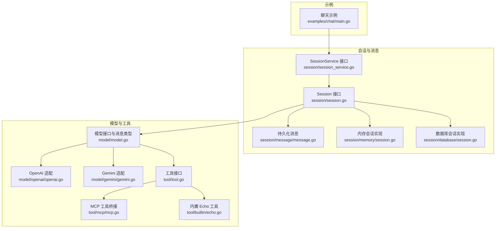
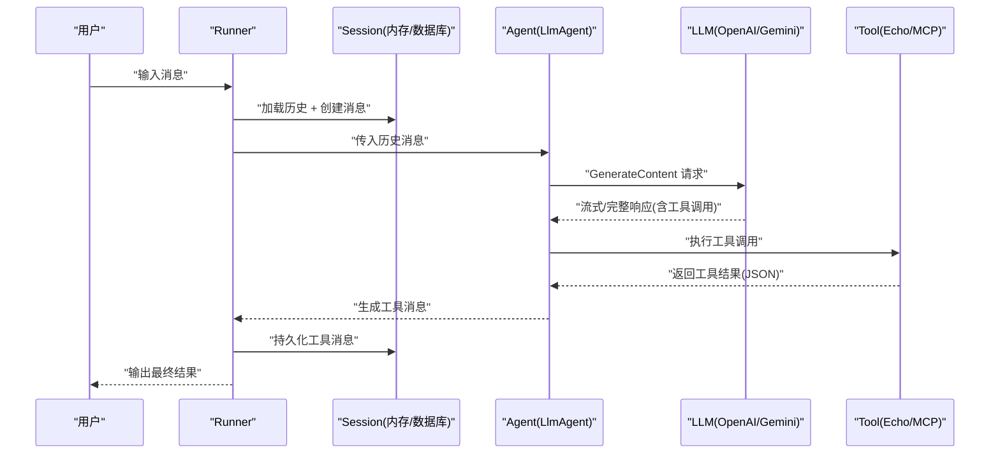
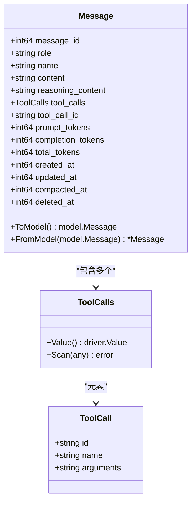
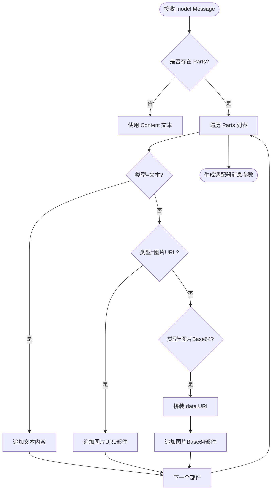
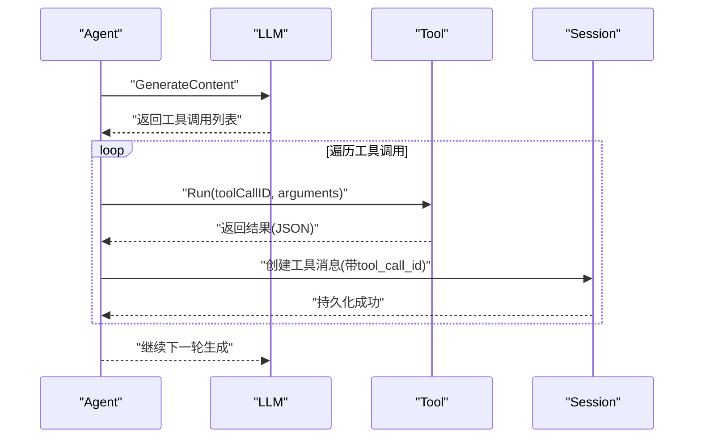
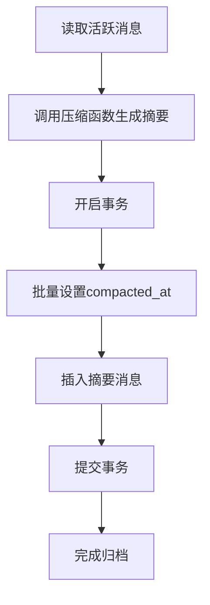
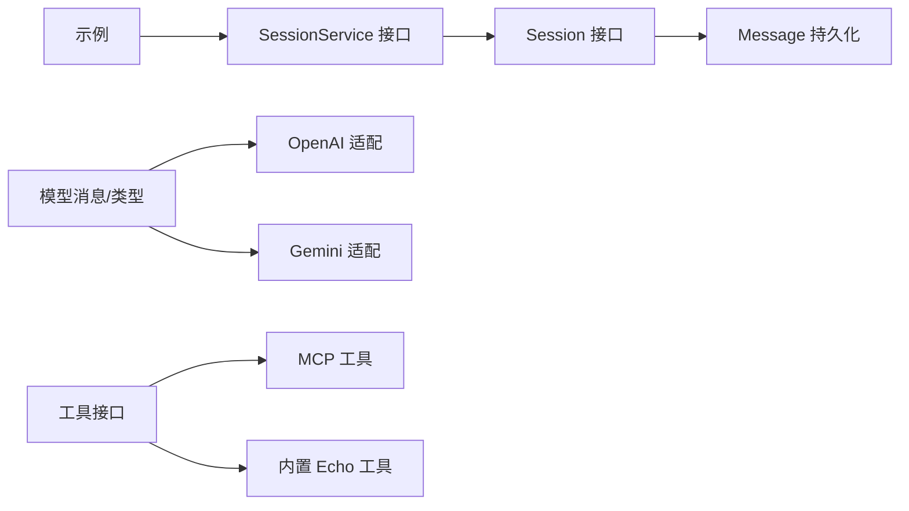

# 消息处理机制

<cite>
**本文引用的文件**
- [session/message/message.go](file://session/message/message.go)
- [model/model.go](file://model/model.go)
- [session/session.go](file://session/session.go)
- [session/session_service.go](file://session/session_service.go)
- [session/memory/session.go](file://session/memory/session.go)
- [session/database/session.go](file://session/database/session.go)
- [tool/tool.go](file://tool/tool.go)
- [tool/mcp/mcp.go](file://tool/mcp/mcp.go)
- [tool/builtin/echo.go](file://tool/builtin/echo.go)
- [examples/chat/main.go](file://examples/chat/main.go)
- [model/openai/openai.go](file://model/openai/openai.go)
- [model/gemini/gemini.go](file://model/gemini/gemini.go)
- [README.md](file://README.md)
</cite>

## 目录
1. [引言](#引言)
2. [项目结构](#项目结构)
3. [核心组件](#核心组件)
4. [架构总览](#架构总览)
5. [详细组件分析](#详细组件分析)
6. [依赖分析](#依赖分析)
7. [性能考量](#性能考量)
8. [故障排查指南](#故障排查指南)
9. [结论](#结论)
10. [附录](#附录)

## 引言
本文件深入解析 ADK 框架中的消息处理机制与数据模型设计，重点覆盖以下方面：
- Message 结构体字段定义：角色、内容、工具调用、多模态内容、用量统计与软归档标记
- 消息类型枚举与使用场景：系统消息、用户消息、助手消息、工具消息
- 工具调用消息处理流程：请求解析、执行与结果封装、错误处理
- 多模态内容支持：文本、图片（URL 与 Base64）等
- 历史消息压缩与软归档：如何在控制存储空间的同时保留重要历史
- 最佳实践：数据校验、格式转换、性能优化

## 项目结构
ADK 将“会话”“消息”“模型适配器”“工具”等模块清晰分层，消息处理贯穿 Runner、Agent、Session、LLM Adapter 与 Tool 的全链路。

图表来源
- [session/session.go:9-23](file://session/session.go#L9-L23)
- [session/session_service.go:5-9](file://session/session_service.go#L5-L9)
- [session/message/message.go:49-128](file://session/message/message.go#L49-L128)
- [session/memory/session.go:12-85](file://session/memory/session.go#L12-L85)
- [session/database/session.go:26-145](file://session/database/session.go#L26-L145)
- [model/model.go:152-227](file://model/model.go#L152-L227)
- [model/openai/openai.go:44-164](file://model/openai/openai.go#L44-L164)
- [model/gemini/gemini.go:66-200](file://model/gemini/gemini.go#L66-L200)
- [tool/tool.go:17-23](file://tool/tool.go#L17-L23)
- [tool/mcp/mcp.go:15-121](file://tool/mcp/mcp.go#L15-L121)
- [tool/builtin/echo.go:14-47](file://tool/builtin/echo.go#L14-L47)
- [examples/chat/main.go:101-125](file://examples/chat/main.go#L101-L125)

章节来源
- [README.md:67-89](file://README.md#L67-L89)

## 核心组件
- 模型消息与角色枚举：定义了通用的消息结构、角色（系统/用户/助手/工具）、完成原因、多模态部件类型、工具调用、Token 使用量等
- 持久化消息：在数据库/内存后端中保存消息，并支持软归档（设置 compacted_at）
- 会话接口：提供创建、读取、删除、分页列出、软归档等能力
- 工具接口与 MCP 桥接：抽象工具定义与运行，支持从 MCP 服务器动态发现工具

章节来源
- [model/model.go:20-28](file://model/model.go#L20-L28)
- [model/model.go:86-128](file://model/model.go#L86-L128)
- [model/model.go:152-178](file://model/model.go#L152-L178)
- [session/message/message.go:49-128](file://session/message/message.go#L49-L128)
- [session/session.go:9-23](file://session/session.go#L9-L23)
- [tool/tool.go:17-23](file://tool/tool.go#L17-L23)
- [tool/mcp/mcp.go:15-121](file://tool/mcp/mcp.go#L15-L121)

## 架构总览
消息处理在 Runner 驱动下，按回合生成与消费：
- Runner 加载会话历史，追加用户输入并持久化
- Agent 基于历史与指令生成响应，可能包含工具调用
- LLM 适配器负责将消息转换为具体提供商的请求格式，并处理流式输出
- 工具执行完成后，以工具消息回写到会话，再由 Agent 决定是否继续

图表来源
- [examples/chat/main.go:120-171](file://examples/chat/main.go#L120-L171)
- [model/openai/openai.go:44-164](file://model/openai/openai.go#L44-L164)
- [model/gemini/gemini.go:66-200](file://model/gemini/gemini.go#L66-L200)
- [tool/mcp/mcp.go:92-109](file://tool/mcp/mcp.go#L92-L109)
- [tool/builtin/echo.go:40-46](file://tool/builtin/echo.go#L40-L46)

## 详细组件分析

### 数据模型与消息结构体
- 角色枚举：系统、用户、助手、工具
- Message 字段：
  - 基础字段：message_id、role、name、content、reasoning_content、tool_calls、tool_call_id、prompt_tokens、completion_tokens、total_tokens、created_at、updated_at、compacted_at、deleted_at
  - 转换方法：ToModel 与 FromModel，用于在持久化消息与模型消息之间互转
- ToolCall 与 ToolCalls：
  - ToolCall 表示一次工具调用请求
  - ToolCalls 实现数据库的 JSON 序列化/反序列化（Value/Scan）

图表来源
- [session/message/message.go:49-128](file://session/message/message.go#L49-L128)
- [session/message/message.go:11-17](file://session/message/message.go#L11-L17)
- [session/message/message.go:19-47](file://session/message/message.go#L19-L47)

章节来源
- [session/message/message.go:49-128](file://session/message/message.go#L49-L128)
- [model/model.go:152-178](file://model/model.go#L152-L178)

### 消息类型与使用场景
- 系统消息：用于设定行为准则或上下文
- 用户消息：可携带多模态部件（文本、图片 URL、Base64），当前仅用户消息支持 Parts
- 助手消息：可包含工具调用请求；若模型返回工具调用，FinishReason 为 tool_calls
- 工具消息：承载工具执行结果，需通过 tool_call_id 回链至对应的工具调用

章节来源
- [model/model.go:20-28](file://model/model.go#L20-L28)
- [model/model.go:152-178](file://model/model.go#L152-L178)
- [model/model.go:30-42](file://model/model.go#L30-L42)

### 多模态内容支持
- ContentPart 类型：文本、图片 URL、Base64 图片
- 图片细节控制：高/低/自动
- OpenAI 与 Gemini 适配均实现了将模型消息转换为各自 API 的消息参数，包括多模态部件映射

图表来源
- [model/openai/openai.go:179-200](file://model/openai/openai.go#L179-L200)
- [model/gemini/gemini.go:128-153](file://model/gemini/gemini.go#L128-L153)
- [model/model.go:86-128](file://model/model.go#L86-L128)

章节来源
- [model/model.go:86-128](file://model/model.go#L86-L128)
- [model/openai/openai.go:179-200](file://model/openai/openai.go#L179-L200)
- [model/gemini/gemini.go:128-153](file://model/gemini/gemini.go#L128-L153)

### 工具调用处理流程
- LLM 返回工具调用：FinishReason 为 tool_calls，消息包含 ToolCalls
- Agent 解析 ToolCalls 并逐个执行工具
- 工具执行：
  - 内置工具：直接解析参数并返回结果
  - MCP 工具：通过会话连接 MCP 服务器，调用工具并提取文本内容
- 结果封装：将工具结果封装为工具消息（Role=tool，ToolCallID 对应调用 ID），回写到会话

图表来源
- [model/openai/openai.go:118-132](file://model/openai/openai.go#L118-L132)
- [model/gemini/gemini.go:137-148](file://model/gemini/gemini.go#L137-L148)
- [tool/tool.go:17-23](file://tool/tool.go#L17-L23)
- [tool/mcp/mcp.go:92-109](file://tool/mcp/mcp.go#L92-L109)
- [tool/builtin/echo.go:40-46](file://tool/builtin/echo.go#L40-L46)

章节来源
- [model/openai/openai.go:118-132](file://model/openai/openai.go#L118-L132)
- [model/gemini/gemini.go:137-148](file://model/gemini/gemini.go#L137-L148)
- [tool/tool.go:17-23](file://tool/tool.go#L17-L23)
- [tool/mcp/mcp.go:92-109](file://tool/mcp/mcp.go#L92-L109)
- [tool/builtin/echo.go:40-46](file://tool/builtin/echo.go#L40-L46)

### 历史消息压缩与软归档
- 软归档：旧消息不删除，而是设置 compacted_at 时间戳，同时将它们移动到“已归档”集合
- 归档过程：
  - 读取所有活跃消息
  - 调用外部压缩函数生成摘要消息
  - 批量更新活跃消息的 compacted_at
  - 插入新的摘要消息作为新的活跃消息
- 支持两种后端：内存与数据库

图表来源
- [session/memory/session.go:70-85](file://session/memory/session.go#L70-L85)
- [session/database/session.go:97-145](file://session/database/session.go#L97-L145)
- [README.md:248-266](file://README.md#L248-L266)

章节来源
- [session/memory/session.go:70-85](file://session/memory/session.go#L70-L85)
- [session/database/session.go:97-145](file://session/database/session.go#L97-L145)
- [README.md:248-266](file://README.md#L248-L266)

### 会话接口与实现
- Session 接口：提供创建消息、分页读取、全量读取、读取归档消息、删除消息、软归档等能力
- SessionService 接口：负责创建/获取/删除会话实例
- 内存实现：基于切片，适合测试与单进程场景
- 数据库实现：基于 SQLite，支持软归档与事务一致性

章节来源
- [session/session.go:9-23](file://session/session.go#L9-L23)
- [session/session_service.go:5-9](file://session/session_service.go#L5-L9)
- [session/memory/session.go:12-85](file://session/memory/session.go#L12-L85)
- [session/database/session.go:26-145](file://session/database/session.go#L26-L145)

### 示例：聊天 Agent 的消息流转
- 创建 LLM（OpenAI）、MCP 工具集、Agent、Runner 与内存会话
- 主循环中，Runner 迭代事件，区分流式片段与完整消息，遇到工具调用时打印提示

章节来源
- [examples/chat/main.go:52-177](file://examples/chat/main.go#L52-L177)

## 依赖分析
- Session 依赖 Message 持久化结构
- LLM 适配器依赖模型消息类型与工具列表
- 工具接口被 MCP 与内置工具实现
- Runner 依赖 SessionService 与 Agent

图表来源
- [session/session.go:9-23](file://session/session.go#L9-L23)
- [session/session_service.go:5-9](file://session/session_service.go#L5-L9)
- [session/message/message.go:49-128](file://session/message/message.go#L49-L128)
- [model/model.go:152-178](file://model/model.go#L152-L178)
- [model/openai/openai.go:44-164](file://model/openai/openai.go#L44-L164)
- [model/gemini/gemini.go:66-200](file://model/gemini/gemini.go#L66-L200)
- [tool/tool.go:17-23](file://tool/tool.go#L17-L23)
- [tool/mcp/mcp.go:15-121](file://tool/mcp/mcp.go#L15-L121)
- [tool/builtin/echo.go:14-47](file://tool/builtin/echo.go#L14-L47)
- [examples/chat/main.go:101-125](file://examples/chat/main.go#L101-L125)

## 性能考量
- 流式输出：LLM 适配器通过迭代器返回增量内容，Runner 只在完整事件时持久化
- 多模态传输：图片建议优先使用 URL，避免 Base64 编码带来的体积膨胀
- 压缩归档：定期进行软归档，减少活跃消息数量，降低查询与序列化成本
- 工具调用批处理：在 Agent 层合并连续工具调用，减少往返次数

## 故障排查指南
- 工具参数解析失败：检查工具定义的 JSON Schema 与实际参数是否匹配
- MCP 工具调用错误：确认 MCP 服务连通性与权限头注入，查看错误信息中的工具名称与返回文本
- 数据库事务异常：归档过程中如遇错误，数据库实现会回滚事务，确保一致性
- 消息未持久化：确认 Runner 在收到完整事件后再调用 Session 创建消息

章节来源
- [tool/mcp/mcp.go:92-109](file://tool/mcp/mcp.go#L92-L109)
- [session/database/session.go:112-145](file://session/database/session.go#L112-L145)
- [examples/chat/main.go:144-169](file://examples/chat/main.go#L144-L169)

## 结论
ADK 的消息处理机制以“模型无关的消息类型 + 会话后端 + LLM 适配器 + 工具体系”为核心，既保证了跨提供商的一致性，又提供了多模态输入、工具调用闭环与软归档等高级能力。通过合理的压缩策略与流式处理，可在保持交互体验的同时控制存储与计算开销。

## 附录
- 多模态示例：用户消息可包含文本与图片 URL/Base64 组合
- 角色选择：系统消息用于设定规则，用户消息用于输入，助手消息用于输出与工具调用，工具消息用于回写结果
- 最佳实践：严格校验工具参数 JSON Schema，优先使用 URL 图片，及时归档历史，仅在完整事件时持久化

章节来源
- [README.md:360-377](file://README.md#L360-L377)
- [model/model.go:20-28](file://model/model.go#L20-L28)
- [model/model.go:152-178](file://model/model.go#L152-L178)