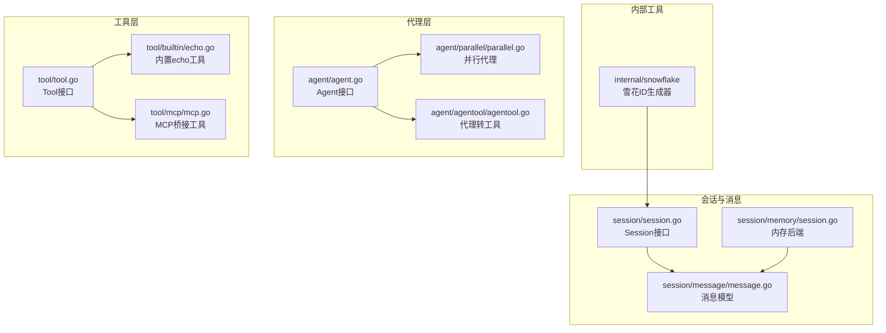
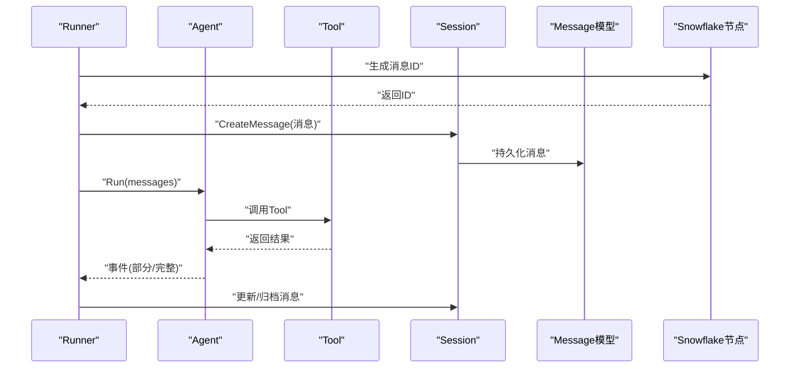
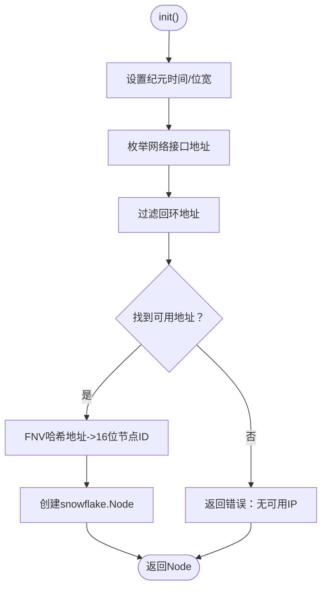
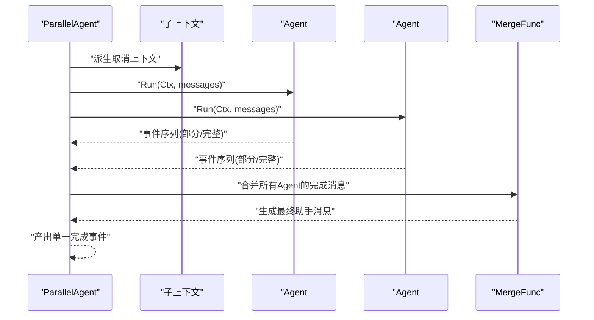
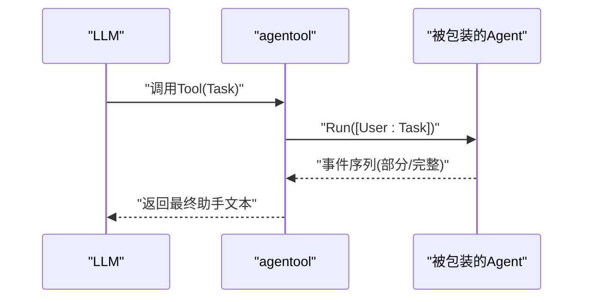
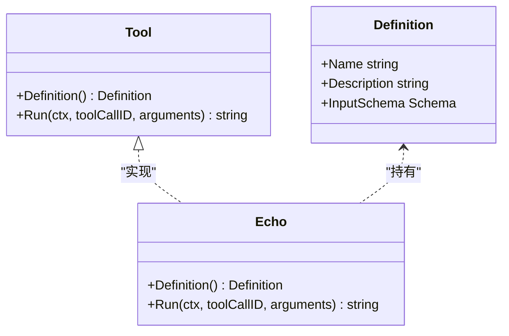
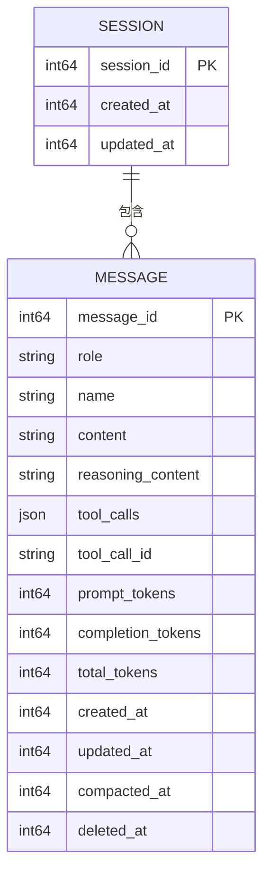
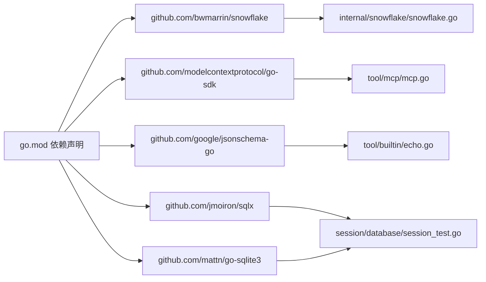

# 内部工具

<cite>
**本文引用的文件**
- [snowflake.go](file://internal/snowflake/snowflake.go)
- [README.md](file://README.md)
- [go.mod](file://go.mod)
- [agent.go](file://agent/agent.go)
- [tool.go](file://tool/tool.go)
- [session.go](file://session/session.go)
- [message.go](file://session/message/message.go)
- [session.go（内存）](file://session/memory/session.go)
- [session_test.go（数据库）](file://session/database/session_test.go)
- [session_test.go（内存）](file://session/memory/session_test.go)
- [parallel.go](file://agent/parallel/parallel.go)
- [agentool.go](file://agent/agentool/agentool.go)
- [echo.go](file://tool/builtin/echo.go)
- [mcp.go](file://tool/mcp/mcp.go)
- [main.go（示例）](file://examples/chat/main.go)
</cite>

## 目录
1. [简介](#简介)
2. [项目结构](#项目结构)
3. [核心组件](#核心组件)
4. [架构总览](#架构总览)
5. [详细组件分析](#详细组件分析)
6. [依赖分析](#依赖分析)
7. [性能考量](#性能考量)
8. [故障排查指南](#故障排查指南)
9. [结论](#结论)
10. [附录：使用与集成指南](#附录使用与集成指南)

## 简介
本章节面向ADK框架的内部工具与辅助能力，重点覆盖以下主题：
- 雪花ID生成器的实现原理、分布式时间有序标识符的设计优势与应用场景
- ID分配机制在高并发下的唯一性与有序性保障
- 内部工具的使用示例与集成指南，帮助开发者在自定义组件中复用这些功能
- 设计原则与扩展方法，展示如何开发类似的内部工具
- 性能考虑与最佳实践，确保内部工具在生产环境中的稳定运行

ADK框架强调“可插拔”与“可组合”，内部工具作为基础设施，为消息持久化、会话管理、工具与代理编排等场景提供通用能力。

## 项目结构
ADK采用按职责分层的包布局，内部工具主要集中在以下位置：
- internal/snowflake：雪花ID节点工厂，用于生成分布式、时间有序的ID
- agent：代理接口与编排（顺序/并行）
- agent/agentool：将代理包装为工具
- tool：工具接口与内置工具
- session：会话接口与消息模型；memory与database两种后端
- examples：示例程序，演示工具链集成

图表来源
- [snowflake.go:1-66](file://internal/snowflake/snowflake.go#L1-L66)
- [agent.go:1-20](file://agent/agent.go#L1-L20)
- [parallel.go:1-175](file://agent/parallel/parallel.go#L1-L175)
- [agentool.go:1-79](file://agent/agentool/agentool.go#L1-L79)
- [tool.go:1-24](file://tool/tool.go#L1-L24)
- [echo.go:1-46](file://tool/builtin/echo.go#L1-L46)
- [mcp.go:88-120](file://tool/mcp/mcp.go#L88-L120)
- [session.go:1-24](file://session/session.go#L1-L24)
- [message.go:1-129](file://session/message/message.go#L1-L129)
- [session.go（内存）:1-86](file://session/memory/session.go#L1-L86)

章节来源
- [README.md:67-89](file://README.md#L67-L89)
- [go.mod:1-47](file://go.mod#L1-L47)

## 核心组件
- 雪花ID生成器：基于第三方snowflake库，提供分布式、时间有序的64位整型ID生成能力，并通过网络接口地址哈希确定节点ID，避免冲突。
- 并行代理：在高并发下并行执行多个子代理，收集完成消息并合并输出，保证下游对话历史结构一致。
- 代理转工具：将任意Agent封装为Tool，支持在函数调用机制中进行任务委派。
- 工具接口与内置工具：统一的Tool接口与JSON Schema输入定义，内置echo工具演示输入校验与参数解析。
- 会话与消息：抽象的Session接口与消息模型，支持软归档与分页查询；内存与SQLite双后端。

章节来源
- [snowflake.go:1-66](file://internal/snowflake/snowflake.go#L1-L66)
- [parallel.go:1-175](file://agent/parallel/parallel.go#L1-L175)
- [agentool.go:1-79](file://agent/agentool/agentool.go#L1-L79)
- [tool.go:1-24](file://tool/tool.go#L1-L24)
- [echo.go:1-46](file://tool/builtin/echo.go#L1-L46)
- [session.go:1-24](file://session/session.go#L1-L24)
- [message.go:1-129](file://session/message/message.go#L1-L129)

## 架构总览
下图展示了从Runner到Agent、Tool、Session与Snowflake的交互路径，体现内部工具在消息生命周期中的作用。

图表来源
- [session_test.go（数据库）:63-84](file://session/database/session_test.go#L63-L84)
- [session_test.go（内存）:128-167](file://session/memory/session_test.go#L128-L167)
- [snowflake.go:17-57](file://internal/snowflake/snowflake.go#L17-L57)
- [message.go:49-129](file://session/message/message.go#L49-L129)

## 详细组件分析

### 雪花ID生成器（分布式时间有序标识符）
- 设计目标
  - 分布式唯一：通过节点ID与时间戳组合，避免跨进程/跨主机冲突
  - 时间有序：ID具备单调递增特性，便于排序与审计
  - 可靠初始化：自动从可用网络接口地址计算节点ID，失败时返回错误
- 实现要点
  - 初始化：设置纪元时间、节点位宽、步进位宽
  - 节点ID生成：遍历非回环IP地址，优先IPv4，否则使用IPv6，经FNV哈希映射到16位
  - 节点创建：以节点ID构造snowflake.Node
- 应用场景
  - 会话ID与消息ID生成
  - 任务与工单ID生成
  - 日志与审计追踪ID生成

图表来源
- [snowflake.go:11-65](file://internal/snowflake/snowflake.go#L11-L65)

章节来源
- [snowflake.go:1-66](file://internal/snowflake/snowflake.go#L1-L66)
- [README.md:24-24](file://README.md#L24-L24)

### 并行代理（高并发下的有序输出）
- 设计目标
  - 并发执行多个子Agent，缩短整体响应时间
  - 统一输出格式：仅收集完成消息，合并为单一助手消息
  - 错误传播：任一子Agent出错即取消上下文，快速终止其他子任务
- 关键流程
  - 派生子上下文，为每个子Agent启动goroutine
  - 仅累积非部分事件（Complete），丢弃流式片段
  - 使用MergeFunc合并输出，生成最终消息并产出一次事件

图表来源
- [parallel.go:112-175](file://agent/parallel/parallel.go#L112-L175)

章节来源
- [parallel.go:1-175](file://agent/parallel/parallel.go#L1-L175)

### 代理转工具（Agent作为Tool）
- 设计目标
  - 将任意Agent以Tool形式暴露给LLM，实现“代理委派”
  - 输入Schema由Task字符串构成，输出为Agent最终助手文本
- 关键流程
  - 定义输入Schema并通过JSON Schema生成器校验
  - 运行时将Task封装为用户消息，迭代事件直至最后一个非部分助手消息
  - 返回该助手文本作为工具结果

图表来源
- [agentool.go:54-78](file://agent/agentool/agentool.go#L54-L78)

章节来源
- [agentool.go:1-79](file://agent/agentool/agentool.go#L1-L79)

### 工具接口与内置工具（统一定义与输入校验）
- 工具接口
  - Definition：名称、描述、输入Schema
  - Run：执行工具，返回字符串结果
- 内置echo工具
  - 基于类型反射生成JSON Schema，确保输入参数校验
  - 解析参数后直接回显请求内容

图表来源
- [tool.go:9-23](file://tool/tool.go#L9-L23)
- [echo.go:14-46](file://tool/builtin/echo.go#L14-L46)

章节来源
- [tool.go:1-24](file://tool/tool.go#L1-L24)
- [echo.go:1-46](file://tool/builtin/echo.go#L1-L46)

### 会话与消息（软归档与分页）
- Session接口
  - 创建消息、删除消息、分页读取、列出全部、列出归档、软归档
- 消息模型
  - 支持ToolCalls序列化/反序列化，Token用量字段，时间戳与归档标记
- 内存后端
  - 基于切片的线性存储，支持软归档与分页
- 数据库后端（测试验证）
  - 通过Snowflake生成会话ID，验证Create/Delete/List/归档等行为

图表来源
- [session.go:9-23](file://session/session.go#L9-L23)
- [message.go:49-129](file://session/message/message.go#L49-L129)
- [session.go（内存）:12-85](file://session/memory/session.go#L12-L85)

章节来源
- [session.go:1-24](file://session/session.go#L1-L24)
- [message.go:1-129](file://session/message/message.go#L1-L129)
- [session.go（内存）:1-86](file://session/memory/session.go#L1-L86)
- [session_test.go（数据库）:63-84](file://session/database/session_test.go#L63-L84)
- [session_test.go（内存）:128-167](file://session/memory/session_test.go#L128-L167)

## 依赖分析
- 外部依赖
  - github.com/bwmarrin/snowflake：雪花ID生成
  - github.com/modelcontextprotocol/go-sdk：MCP工具桥接
  - github.com/google/jsonschema-go：工具输入Schema生成与校验
  - github.com/jmoiron/sqlx、github.com/mattn/go-sqlite3：数据库访问与驱动
- 内部耦合
  - Session与Message模型解耦，便于替换存储后端
  - Snowflake仅在需要全局唯一ID时被引入，不污染业务逻辑
  - 并行代理与代理转工具均依赖Agent接口，保持对上层的低耦合

图表来源
- [go.mod:5-15](file://go.mod#L5-L15)
- [snowflake.go:3-9](file://internal/snowflake/snowflake.go#L3-L9)
- [echo.go:3-12](file://tool/builtin/echo.go#L3-L12)
- [mcp.go:1-10](file://tool/mcp/mcp.go#L1-L10)
- [session_test.go（数据库）:63-84](file://session/database/session_test.go#L63-L84)

章节来源
- [go.mod:1-47](file://go.mod#L1-L47)

## 性能考量
- 雪花ID生成
  - 初始化成本低，运行时开销极小；节点ID来源于网卡地址哈希，避免重复概率接近零
  - 在高并发下，ID生成无需锁竞争，适合热点场景
- 并行代理
  - 使用WaitGroup与带取消的上下文，确保异常时快速收敛
  - 仅收集完成消息，减少下游处理分支与状态复杂度
- 会话存储
  - 内存后端适合短时会话与测试；SQLite适合持久化与多实例共享
  - 软归档降低数据库压力，分页查询避免一次性加载过大数据集
- 工具Schema
  - 基于类型反射生成Schema，避免手写Schema带来的维护成本与不一致风险

## 故障排查指南
- 雪花ID生成失败
  - 现象：New()返回错误
  - 排查：确认宿主机存在非回环IP地址；检查网络接口权限与连通性
- 并行代理阻塞或延迟
  - 现象：Merge阶段等待超时或输出延迟
  - 排查：检查子Agent是否产生大量部分事件；确认MergeFunc耗时；观察上下文取消是否及时
- 会话归档异常
  - 现象：归档后活跃消息为空或归档列表不正确
  - 排查：核对回调函数返回值；检查CompactedAt字段是否正确写入；验证分页参数
- 工具Schema校验失败
  - 现象：参数解析报错或工具不可见
  - 排查：确认输入Schema生成成功；核对参数命名与类型；检查JSON序列化/反序列化

章节来源
- [snowflake.go:45-47](file://internal/snowflake/snowflake.go#L45-L47)
- [parallel.go:112-175](file://agent/parallel/parallel.go#L112-L175)
- [session_test.go（内存）:128-167](file://session/memory/session_test.go#L128-L167)
- [echo.go:23-33](file://tool/builtin/echo.go#L23-L33)

## 结论
ADK的内部工具围绕“唯一性、有序性、可组合、可扩展”展开设计。雪花ID生成器提供可靠的分布式标识符；并行代理与代理转工具提升协作与委派能力；工具接口与Schema体系确保输入一致性；会话与消息模型支持软归档与多后端切换。这些工具在高并发与生产环境中经过验证，既保证性能也兼顾稳定性。

## 附录：使用与集成指南

### 雪花ID生成器集成
- 获取Node
  - 调用New()创建Node；若失败需重试或降级策略
- 生成ID
  - 使用Node.Generate()获取snowflake.ID，再转换为Int64作为消息ID或会话ID
- 最佳实践
  - 在应用启动时初始化一次Node并复用
  - 在容器/多网卡环境下确保可用IP可达，必要时显式配置节点ID

章节来源
- [snowflake.go:17-57](file://internal/snowflake/snowflake.go#L17-L57)
- [session_test.go（数据库）:67-69](file://session/database/session_test.go#L67-L69)
- [session_test.go（内存）:129-131](file://session/memory/session_test.go#L129-L131)

### 并行代理使用
- 组合多个Agent，统一输出格式
- 自定义MergeFunc以适配业务合并策略
- 注意错误传播与上下文取消，避免资源泄漏

章节来源
- [parallel.go:29-101](file://agent/parallel/parallel.go#L29-L101)
- [parallel.go:112-175](file://agent/parallel/parallel.go#L112-L175)

### 代理转工具
- 将Agent包装为Tool，供LLM在函数调用中委派任务
- 输入Schema由Task字符串构成，输出为最终助手文本

章节来源
- [agentool.go:29-79](file://agent/agentool/agentool.go#L29-L79)

### 工具接口与内置工具
- 定义Tool时提供Name、Description与InputSchema
- 使用内置echo工具作为参考，学习Schema生成与参数解析

章节来源
- [tool.go:9-23](file://tool/tool.go#L9-L23)
- [echo.go:22-46](file://tool/builtin/echo.go#L22-L46)

### 会话与消息
- 使用Session接口抽象不同后端
- 利用软归档减少历史数据膨胀
- 在数据库后端中结合Snowflake生成会话ID，确保全局唯一

章节来源
- [session.go:9-23](file://session/session.go#L9-L23)
- [message.go:49-129](file://session/message/message.go#L49-L129)
- [session_test.go（数据库）:67-84](file://session/database/session_test.go#L67-L84)
- [session_test.go（内存）:128-167](file://session/memory/session_test.go#L128-L167)

### 示例程序参考
- chat示例展示了MCP工具接入与Runner驱动的完整流程，可作为集成参考

章节来源
- [main.go（示例）:52-177](file://examples/chat/main.go#L52-L177)