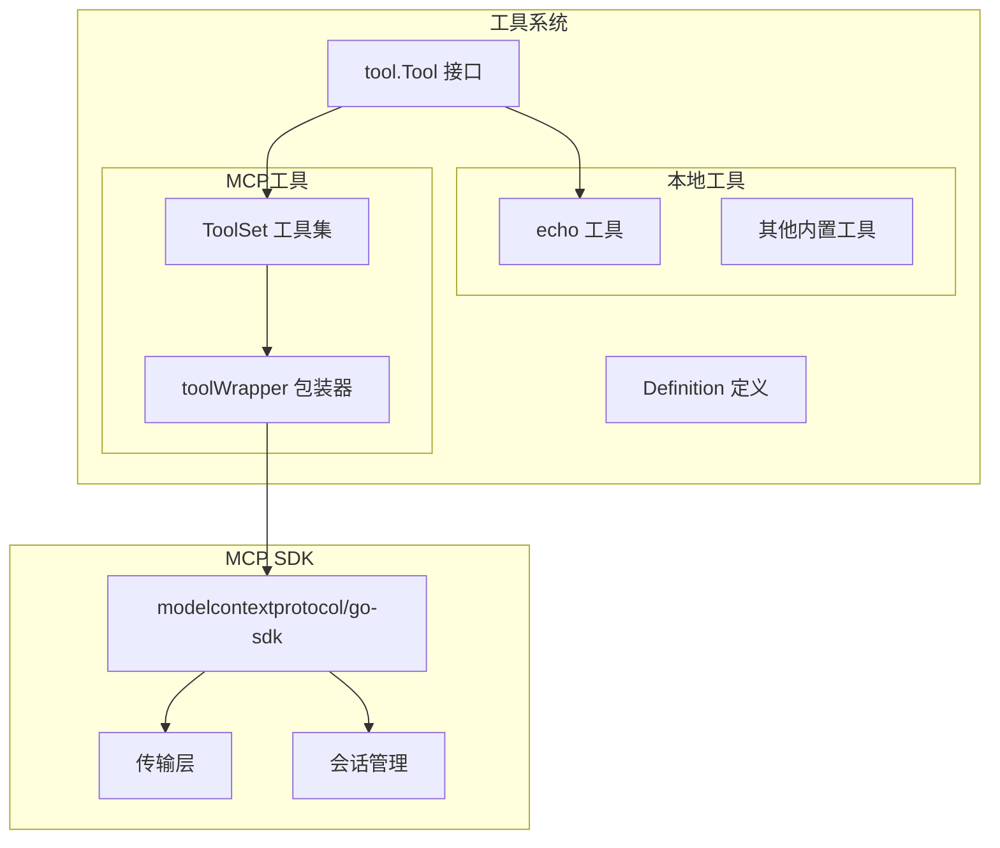
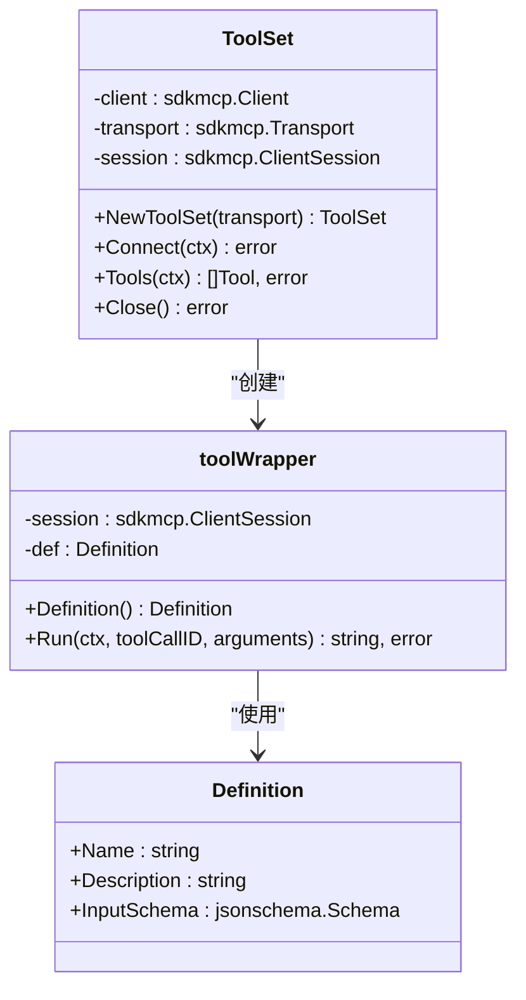
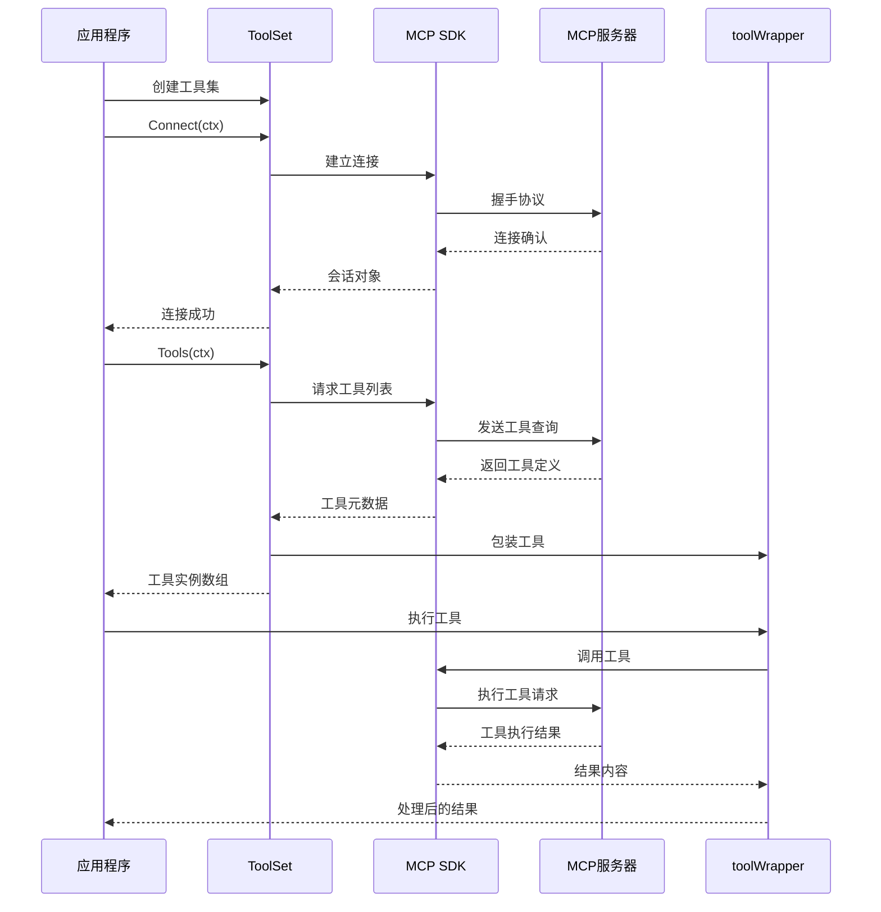
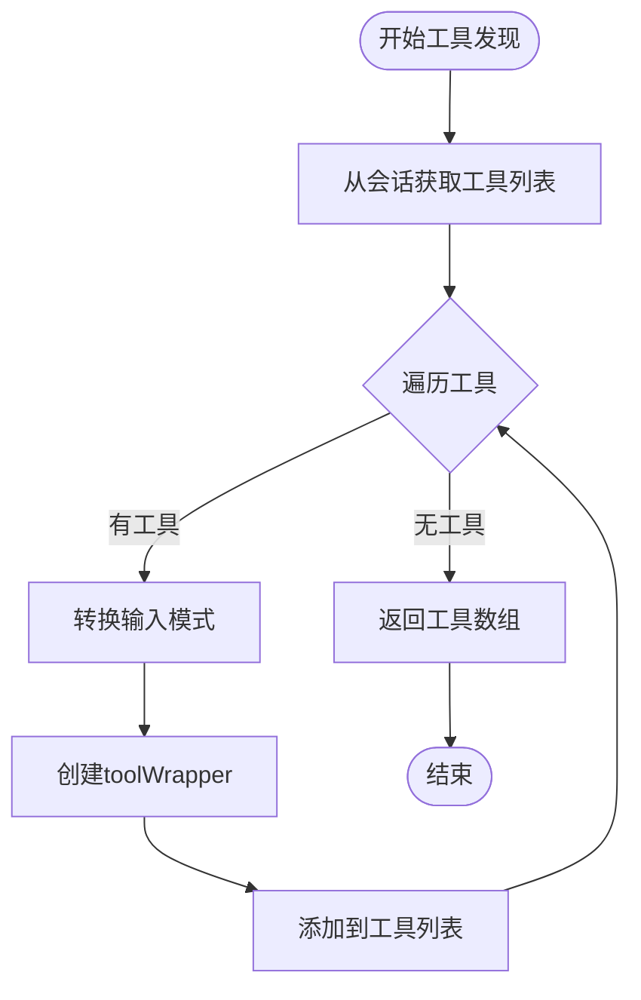
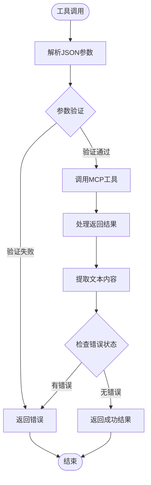
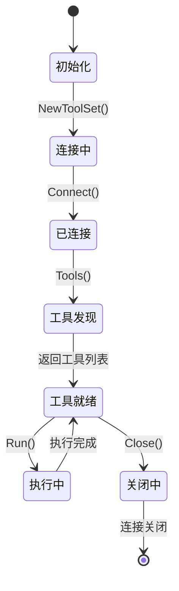
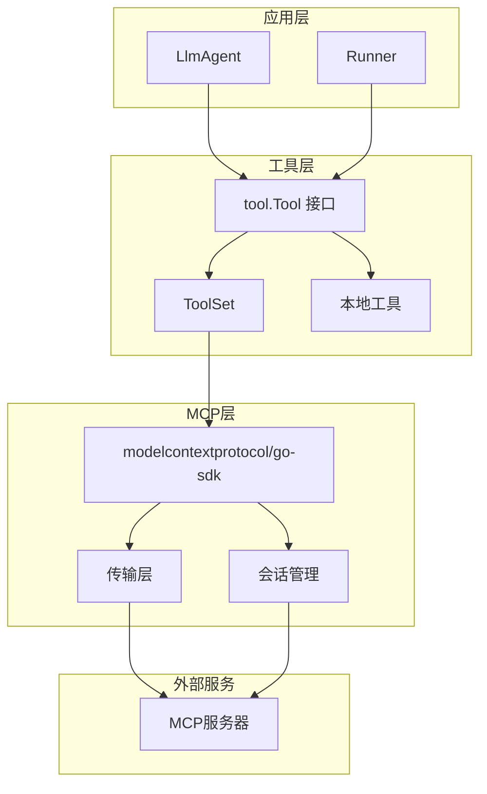

# MCP工具集成

<cite>
**本文档引用的文件**
- [mcp.go](file://tool/mcp/mcp.go)
- [mcp_test.go](file://tool/mcp/mcp_test.go)
- [tool.go](file://tool/tool.go)
- [echo.go](file://tool/builtin/echo.go)
- [main.go](file://examples/chat/main.go)
- [README.md](file://README.md)
</cite>

## 目录
1. [简介](#简介)
2. [项目结构](#项目结构)
3. [核心组件](#核心组件)
4. [架构概览](#架构概览)
5. [详细组件分析](#详细组件分析)
6. [依赖关系分析](#依赖关系分析)
7. [性能考虑](#性能考虑)
8. [故障排除指南](#故障排除指南)
9. [结论](#结论)

## 简介

ADK框架中的MCP（Model Context Protocol）工具集成机制为AI代理提供了强大的工具扩展能力。该机制允许开发者连接任意MCP服务器，动态发现和使用服务器提供的工具集，实现与本地工具的统一处理方式。

MCP协议是一个开放标准，旨在标准化模型与工具之间的交互。通过ADK的MCP集成，开发者可以轻松地将外部工具服务无缝集成到AI代理中，实现功能强大的智能助手应用。

## 项目结构

ADK框架采用模块化设计，MCP工具集成位于专门的`tool/mcp`包中，与本地工具和其他组件保持清晰的分离：

**图表来源**
- [mcp.go:15-80](file://tool/mcp/mcp.go#L15-L80)
- [tool.go:17-23](file://tool/tool.go#L17-L23)

**章节来源**
- [mcp.go:1-121](file://tool/mcp/mcp.go#L1-L121)
- [tool.go:1-24](file://tool/tool.go#L1-L24)

## 核心组件

### ToolSet 工具集

ToolSet是MCP工具集成的核心组件，负责管理与MCP服务器的连接和工具发现过程：

**图表来源**
- [mcp.go:15-86](file://tool/mcp/mcp.go#L15-L86)
- [tool.go:9-15](file://tool/tool.go#L9-L15)

### 工具接口抽象

ADK通过统一的`tool.Tool`接口抽象，实现了本地工具与MCP工具的无缝集成：

| 组件 | 职责 | 实现方式 |
|------|------|----------|
| ToolSet | 连接MCP服务器 | 使用MCP SDK客户端建立连接 |
| toolWrapper | 包装MCP工具 | 将MCP工具转换为统一接口 |
| Definition | 工具元数据 | 名称、描述、输入模式 |
| JSON Schema | 参数验证 | 类型安全的参数处理 |

**章节来源**
- [mcp.go:22-80](file://tool/mcp/mcp.go#L22-L80)
- [tool.go:9-23](file://tool/tool.go#L9-L23)

## 架构概览

MCP工具集成遵循分层架构设计，确保了良好的可扩展性和维护性：

**图表来源**
- [mcp.go:35-109](file://tool/mcp/mcp.go#L35-L109)

## 详细组件分析

### MCP工具发现机制

MCP工具发现过程通过迭代MCP服务器提供的工具列表实现，每个工具都会被转换为统一的`tool.Tool`接口实例：

**图表来源**
- [mcp.go:45-72](file://tool/mcp/mcp.go#L45-L72)

### 工具参数映射

MCP工具的参数映射过程确保了类型安全和错误处理：

**图表来源**
- [mcp.go:92-109](file://tool/mcp/mcp.go#L92-L109)

### 传输层配置

ADK支持多种MCP传输方式，包括HTTP流式传输和STDIO传输：

| 传输方式 | 配置选项 | 使用场景 |
|----------|----------|----------|
| StreamableClientTransport | Endpoint, HTTPClient | HTTP端点连接 |
| STDIO传输 | 可执行文件路径, 参数 | 本地进程通信 |
| 自定义传输 | RoundTrip函数 | 特殊认证需求 |

**章节来源**
- [mcp.go:35-43](file://tool/mcp/mcp.go#L35-L43)
- [mcp_test.go:21-42](file://tool/mcp/mcp_test.go#L21-L42)

### 动态加载和卸载

MCP工具的生命周期管理提供了完整的动态加载和卸载能力：

**图表来源**
- [mcp.go:35-80](file://tool/mcp/mcp.go#L35-L80)

**章节来源**
- [mcp.go:74-80](file://tool/mcp/mcp.go#L74-L80)

## 依赖关系分析

MCP工具集成的依赖关系体现了清晰的分层架构：

**图表来源**
- [mcp.go:10-12](file://tool/mcp/mcp.go#L10-L12)
- [tool.go:6](file://tool/tool.go#L6)

### 外部依赖

MCP工具集成主要依赖以下外部库：

| 依赖库 | 版本 | 用途 |
|--------|------|------|
| modelcontextprotocol/go-sdk | 最新版本 | MCP协议实现 |
| google/jsonschema-go | 最新版本 | JSON Schema处理 |
| testify | 测试断言库 | 单元测试 |

**章节来源**
- [mcp.go:3-12](file://tool/mcp/mcp.go#L3-L12)

## 性能考虑

### 连接池管理

MCP工具集采用单连接管理模式，适用于大多数使用场景。对于高并发需求，建议：

- 实现连接复用机制
- 添加连接池大小限制
- 实现自动重连策略

### 内存优化

工具定义转换过程涉及JSON序列化和反序列化操作，需要注意：

- 输入模式转换的缓存策略
- 工具实例的生命周期管理
- 大量工具时的内存占用控制

### 错误处理优化

MCP工具调用的错误处理需要考虑：

- 网络超时的合理设置
- 重试机制的指数退避策略
- 错误信息的用户友好化

## 故障排除指南

### 常见连接问题

| 问题症状 | 可能原因 | 解决方案 |
|----------|----------|----------|
| 连接超时 | 网络延迟或服务器负载 | 检查网络连接，增加超时时间 |
| 认证失败 | API密钥无效或过期 | 验证环境变量设置 |
| 工具发现失败 | 服务器不支持工具接口 | 检查MCP服务器版本兼容性 |
| 参数验证错误 | JSON格式不正确 | 使用工具定义的JSON Schema验证 |

### 调试技巧

1. **启用详细日志**：在开发环境中启用MCP SDK的日志输出
2. **工具列表验证**：使用`Tools()`方法验证工具发现是否正常
3. **参数调试**：打印工具调用的参数和返回值
4. **连接状态监控**：定期检查连接状态和会话有效性

**章节来源**
- [mcp.go:92-109](file://tool/mcp/mcp.go#L92-L109)
- [mcp_test.go:44-100](file://tool/mcp/mcp_test.go#L44-L100)

## 结论

ADK框架的MCP工具集成机制为AI代理开发提供了强大而灵活的工具扩展能力。通过统一的接口抽象和清晰的架构设计，开发者可以轻松地集成各种外部工具服务，实现功能丰富的智能助手应用。

该实现的主要优势包括：

- **统一接口**：本地工具与MCP工具的无缝集成
- **动态发现**：运行时自动发现和加载工具
- **类型安全**：基于JSON Schema的参数验证
- **可扩展性**：支持多种传输方式和自定义配置
- **错误处理**：完善的错误处理和恢复机制

未来的发展方向可能包括：

- 更高级的连接管理和重连机制
- 工具缓存和预加载优化
- 更丰富的传输方式支持
- 增强的监控和诊断功能

通过持续的优化和改进，ADK的MCP工具集成机制将继续为AI代理开发提供强有力的支持。