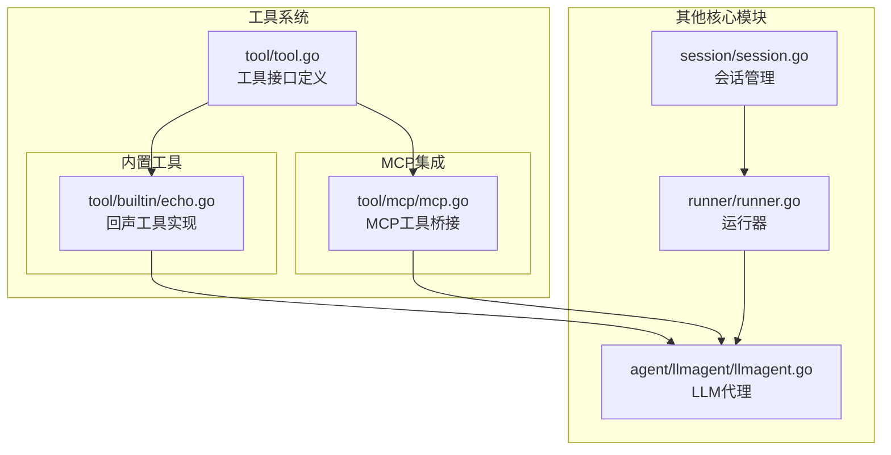
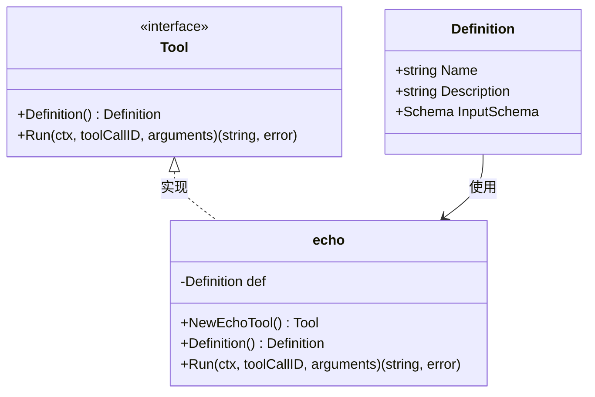
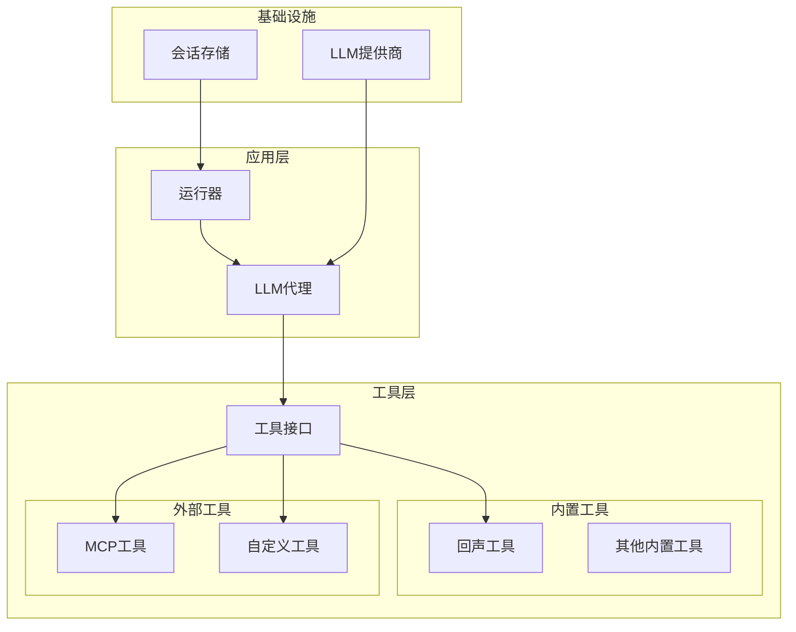
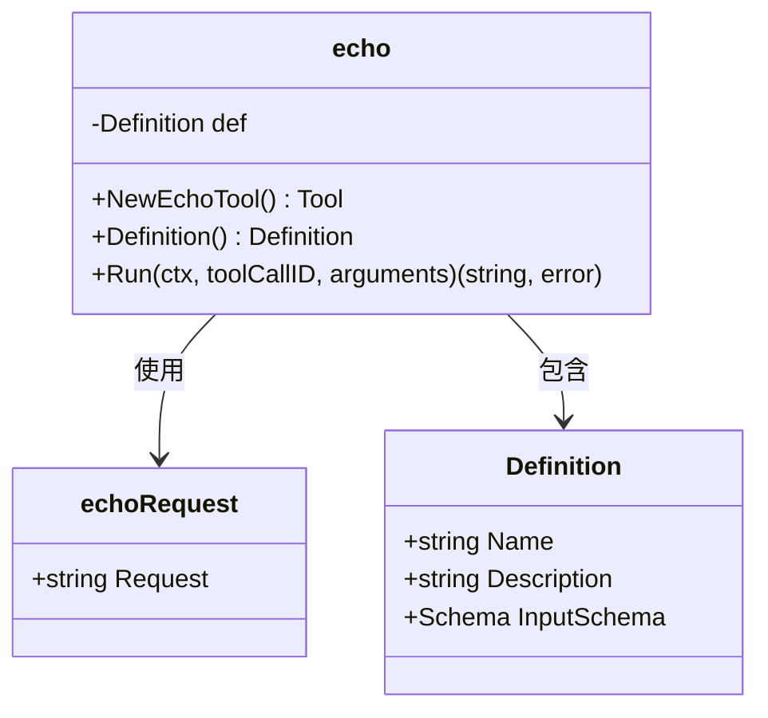
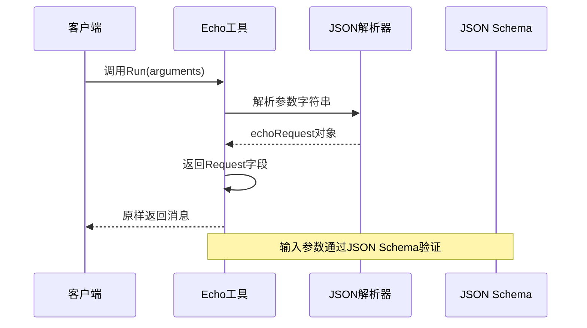
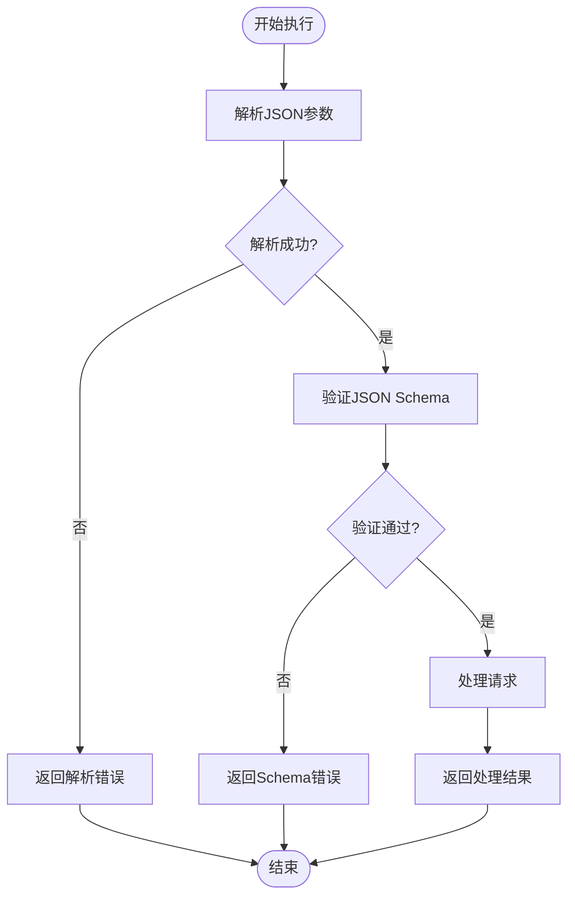
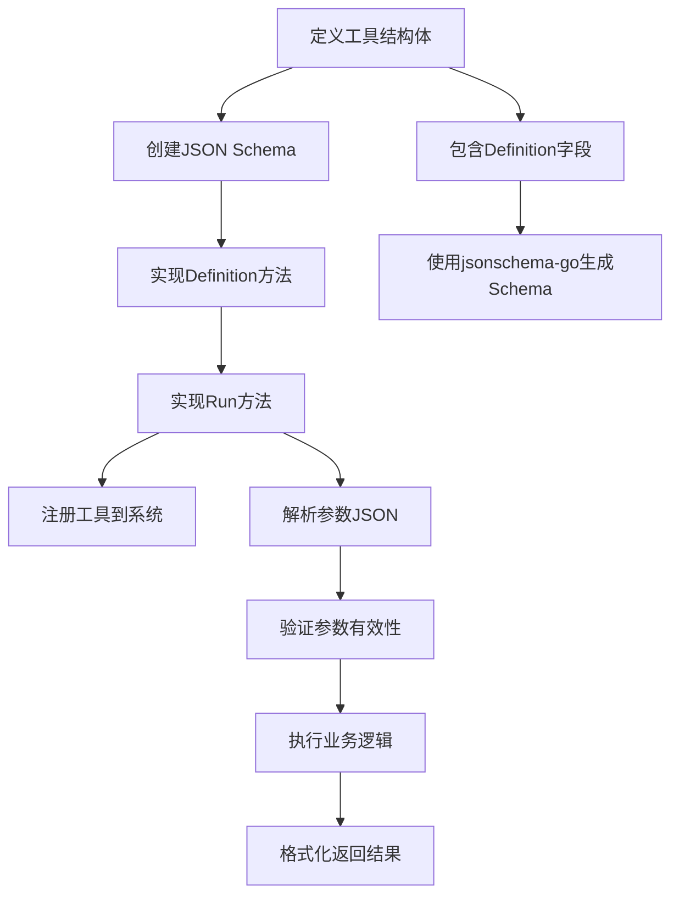
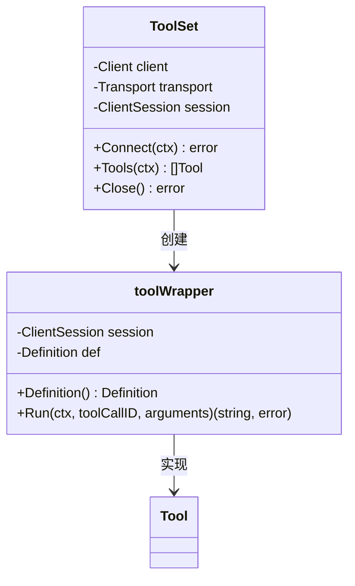
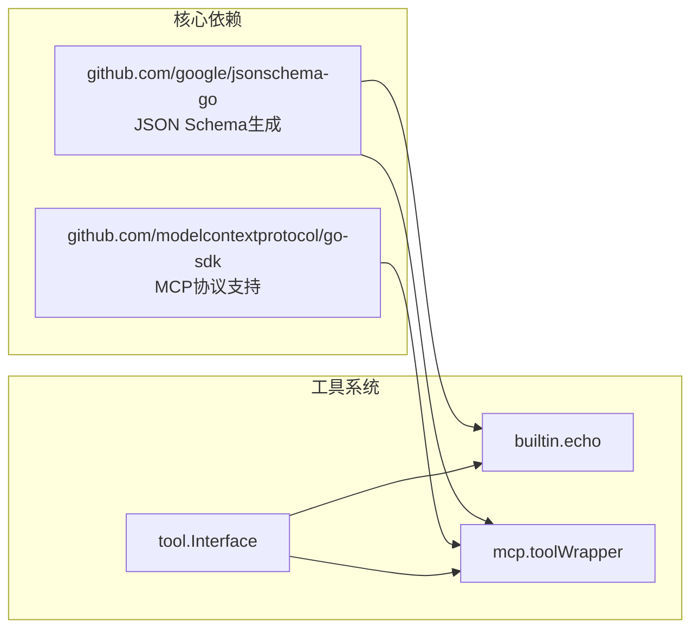

# 内置工具实现

<cite>
**本文档引用的文件**
- [echo.go](file://tool/builtin/echo.go)
- [tool.go](file://tool/tool.go)
- [mcp.go](file://tool/mcp/mcp.go)
- [main.go](file://examples/chat/main.go)
- [README.md](file://README.md)
- [go.mod](file://go.mod)
</cite>

## 目录
1. [简介](#简介)
2. [项目结构](#项目结构)
3. [核心组件](#核心组件)
4. [架构概览](#架构概览)
5. [详细组件分析](#详细组件分析)
6. [依赖关系分析](#依赖关系分析)
7. [性能考虑](#性能考虑)
8. [故障排除指南](#故障排除指南)
9. [结论](#结论)

## 简介

ADK（Agent Development Kit）框架提供了一个轻量级、惯用的Go语言库，用于构建生产就绪的AI代理。该框架的核心特性之一是其内置工具系统，它为开发者提供了标准化的工具接口和实现模式。内置工具作为框架的重要组成部分，不仅展示了如何正确实现工具接口，还为开发者创建自定义工具提供了清晰的参考模板。

本文档将深入分析ADK框架中的内置工具实现，特别关注echo工具的设计和功能。我们将详细解析echo工具的实现细节，包括工具定义、参数处理和响应生成过程，并展示如何使用内置工具作为开发自定义工具的参考模板。

## 项目结构

ADK框架采用模块化设计，工具系统位于独立的包中，便于维护和扩展。项目结构清晰地分离了不同功能模块：

**图表来源**
- [tool.go:1-24](file://tool/tool.go#L1-L24)
- [echo.go:1-47](file://tool/builtin/echo.go#L1-L47)
- [mcp.go:1-121](file://tool/mcp/mcp.go#L1-L121)

**章节来源**
- [README.md:67-89](file://README.md#L67-L89)
- [go.mod:1-47](file://go.mod#L1-L47)

## 核心组件

### 工具接口定义

工具系统的核心是一个简洁而强大的接口定义，它为所有工具提供统一的抽象层：

**图表来源**
- [tool.go:9-23](file://tool/tool.go#L9-L23)
- [echo.go:14-46](file://tool/builtin/echo.go#L14-L46)

工具接口包含两个关键方法：
- `Definition()`：返回工具的元数据，包括名称、描述和输入参数的JSON Schema
- `Run()`：执行工具逻辑，接收上下文、工具调用ID和参数字符串，返回结果字符串和错误

**章节来源**
- [tool.go:9-23](file://tool/tool.go#L9-L23)

### echo工具实现

echo工具是最简单的内置工具，但其设计体现了工具系统的核心原则。它展示了如何正确实现工具接口，包括参数验证、错误处理和响应格式化。

**章节来源**
- [echo.go:1-47](file://tool/builtin/echo.go#L1-L47)

## 架构概览

ADK框架的工具系统遵循分层架构设计，确保了良好的可扩展性和可维护性：

**图表来源**
- [README.md:37-64](file://README.md#L37-L64)
- [tool.go:17-23](file://tool/tool.go#L17-L23)

这种架构设计的优势在于：
- **解耦性**：工具实现与具体LLM提供商无关
- **可扩展性**：支持内置工具、MCP工具和自定义工具
- **一致性**：所有工具都遵循相同的接口规范
- **可测试性**：工具可以独立测试和验证

## 详细组件分析

### echo工具深度解析

#### 数据结构设计

echo工具采用了最小化的数据结构设计，体现了"简单即美"的设计哲学：

**图表来源**
- [echo.go:14-34](file://tool/builtin/echo.go#L14-L34)

#### 参数处理流程

echo工具的参数处理流程简洁而高效：

**图表来源**
- [echo.go:40-46](file://tool/builtin/echo.go#L40-L46)

#### 错误处理机制

echo工具实现了完善的错误处理机制，确保系统的稳定性和可靠性：

**图表来源**
- [echo.go:22-34](file://tool/builtin/echo.go#L22-L34)
- [echo.go:40-46](file://tool/builtin/echo.go#L40-L46)

**章节来源**
- [echo.go:14-46](file://tool/builtin/echo.go#L14-L46)

### 工具接口实现模式

#### 标准化实现模板

基于echo工具的实现，我们可以总结出一个标准的工具实现模板：

#### 最佳实践指南

基于echo工具的实现，以下是开发自定义工具的最佳实践：

1. **明确的职责分离**：每个工具应该专注于单一功能
2. **严格的参数验证**：使用JSON Schema确保参数完整性
3. **一致的错误处理**：提供清晰的错误信息和上下文
4. **优雅的资源管理**：正确处理连接和生命周期
5. **充分的测试覆盖**：包括正常路径和异常情况

**章节来源**
- [echo.go:22-34](file://tool/builtin/echo.go#L22-L34)

### MCP工具集成分析

虽然echo工具是内置实现，但MCP工具展示了如何扩展工具系统以支持外部服务：

**图表来源**
- [mcp.go:15-86](file://tool/mcp/mcp.go#L15-L86)

**章节来源**
- [mcp.go:15-121](file://tool/mcp/mcp.go#L15-L121)

## 依赖关系分析

### 外部依赖管理

ADK框架的工具系统依赖于几个关键的第三方库：

**图表来源**
- [go.mod:5-15](file://go.mod#L5-L15)
- [echo.go:3-12](file://tool/builtin/echo.go#L3-L12)
- [mcp.go:3-13](file://tool/mcp/mcp.go#L3-L13)

### 模块间耦合度分析

工具系统的模块间耦合度保持在合理水平：

- **低耦合**：工具接口与具体实现分离
- **单向依赖**：具体工具实现依赖接口，反之不成立
- **可替换性**：任何工具实现都可以被其他实现替换

**章节来源**
- [go.mod:5-15](file://go.mod#L5-L15)

## 性能考虑

### 内存使用优化

echo工具展示了内存使用的最佳实践：
- **零拷贝策略**：直接返回输入参数，避免不必要的数据复制
- **延迟初始化**：JSON Schema在工具创建时生成，避免重复计算
- **最小化分配**：只在必要时创建新的数据结构

### 并发安全性

工具接口设计考虑了并发安全性：
- **无状态设计**：工具实例不保存可变状态
- **上下文传递**：通过context参数传递取消信号和超时
- **线程安全**：工具实现不需要额外的同步机制

## 故障排除指南

### 常见问题诊断

基于echo工具的实现，以下是常见的工具开发问题及其解决方案：

#### 参数解析错误
- **症状**：工具调用返回解析错误
- **原因**：传入的参数不是有效的JSON格式
- **解决方案**：检查客户端发送的参数格式，确保符合JSON标准

#### Schema验证失败
- **症状**：工具调用返回Schema验证错误
- **原因**：参数缺少必需字段或类型不匹配
- **解决方案**：根据工具的JSON Schema调整参数结构

#### 内存泄漏
- **症状**：长时间运行后内存使用持续增长
- **原因**：工具实现持有不必要的引用
- **解决方案**：检查工具实现，确保及时释放资源

**章节来源**
- [echo.go:40-46](file://tool/builtin/echo.go#L40-L46)

## 结论

ADK框架的内置工具系统展现了现代软件架构的最佳实践。echo工具作为最简单的实现示例，却包含了复杂系统所需的所有关键要素：清晰的接口设计、严格的参数验证、完善的错误处理和优雅的资源管理。

通过对echo工具的深入分析，我们可以得出以下结论：

1. **简洁性原则**：工具实现应该尽可能简单，专注于核心功能
2. **标准化接口**：统一的接口设计确保了系统的可扩展性和可维护性
3. **严格的数据验证**：通过JSON Schema确保数据的完整性和正确性
4. **健壮的错误处理**：提供清晰的错误信息有助于问题诊断和解决

对于开发者而言，echo工具不仅是一个功能简单的示例，更是创建复杂工具的参考模板。它展示了如何正确处理参数、如何进行错误处理，以及如何与框架的其他组件集成。

随着AI代理技术的发展，工具系统将继续演进，但其核心设计原则——简洁、标准化、可扩展——将保持不变。开发者可以基于这些原则，创建出更加复杂和功能丰富的工具，推动AI代理能力的不断提升。