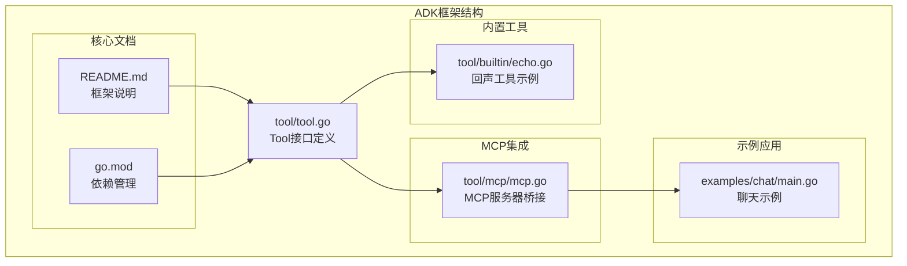
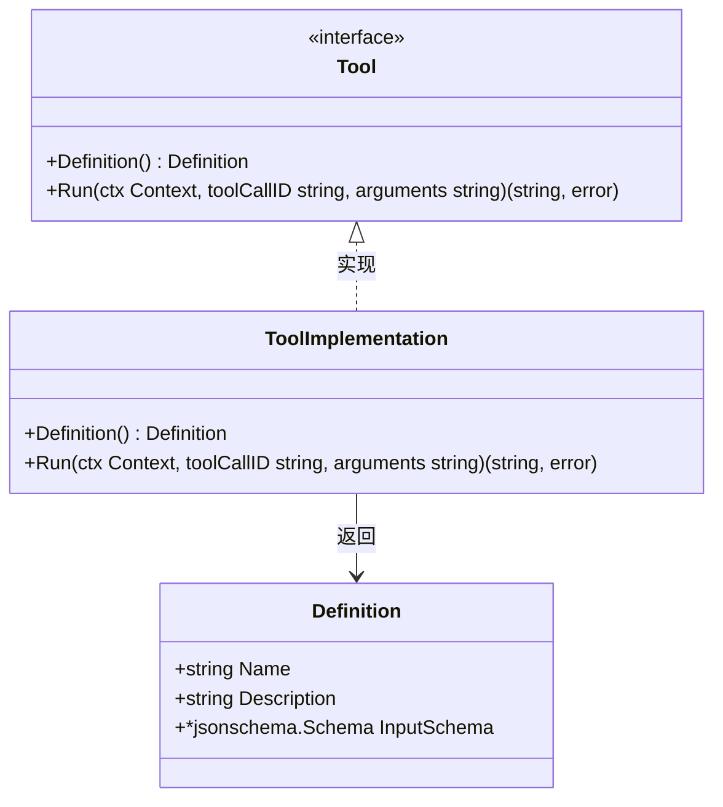
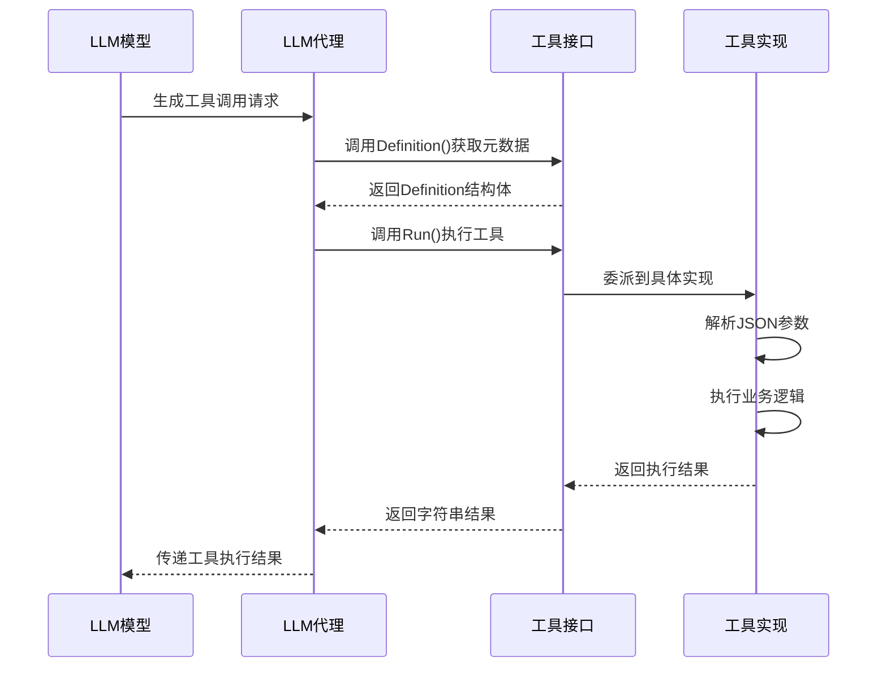
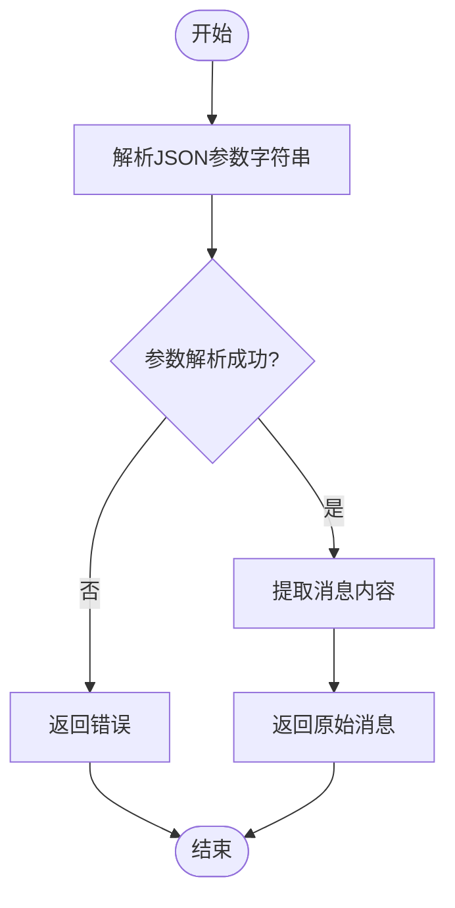
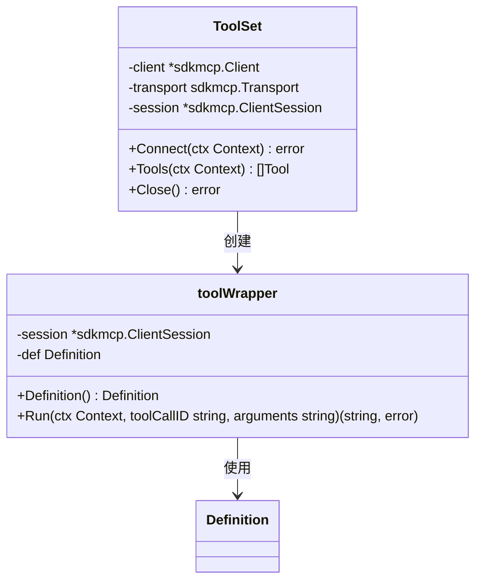
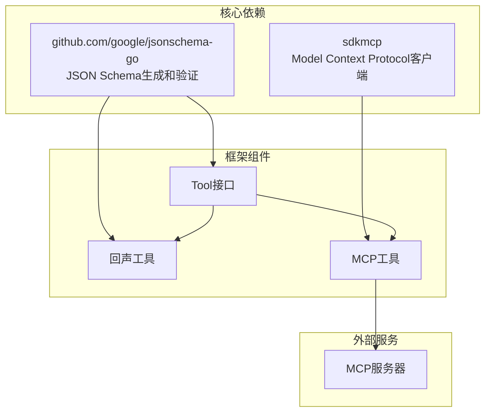

# 工具接口规范

<cite>
**本文档引用的文件**
- [tool.go](file://tool/tool.go)
- [echo.go](file://tool/builtin/echo.go)
- [mcp.go](file://tool/mcp/mcp.go)
- [mcp_test.go](file://tool/mcp/mcp_test.go)
- [main.go](file://examples/chat/main.go)
- [README.md](file://README.md)
- [go.mod](file://go.mod)
</cite>

## 目录
1. [简介](#简介)
2. [项目结构](#项目结构)
3. [核心组件](#核心组件)
4. [架构概览](#架构概览)
5. [详细组件分析](#详细组件分析)
6. [依赖关系分析](#依赖关系分析)
7. [性能考虑](#性能考虑)
8. [故障排除指南](#故障排除指南)
9. [结论](#结论)

## 简介

ADK（Agent Development Kit）框架中的Tool接口是构建智能代理系统的关键组件，它为LLM（大语言模型）提供了标准化的工具调用机制。该接口设计遵循了provider-agnostic原则，允许开发者创建可移植的工具实现，这些工具可以在不同的LLM提供商之间无缝切换。

Tool接口的核心目标是为LLM提供精确的工具元数据描述，包括工具名称、功能描述以及输入参数的JSON Schema定义，从而确保LLM能够准确理解工具的能力边界和调用方式。

## 项目结构

ADK框架采用模块化设计，Tool接口位于独立的tool包中，便于在不同组件间共享和复用。项目的主要结构如下：



**图表来源**
- [tool.go:1-24](file://tool/tool.go#L1-L24)
- [echo.go:1-47](file://tool/builtin/echo.go#L1-L47)
- [mcp.go:1-121](file://tool/mcp/mcp.go#L1-L121)

**章节来源**
- [tool.go:1-24](file://tool/tool.go#L1-L24)
- [README.md:67-89](file://README.md#L67-L89)

## 核心组件

### Tool接口设计

Tool接口是ADK框架中最核心的抽象层，它定义了所有工具必须实现的标准方法：



**图表来源**
- [tool.go:17-23](file://tool/tool.go#L17-L23)
- [tool.go:9-15](file://tool/tool.go#L9-L15)

Tool接口包含两个关键方法：

1. **Definition() Method**: 返回工具的元数据信息，用于LLM理解工具的能力
2. **Run() Method**: 执行实际的工具逻辑，处理传入的参数并返回结果

**章节来源**
- [tool.go:17-23](file://tool/tool.go#L17-L23)

### Definition结构体详解

Definition结构体是Tool接口的核心元数据载体，它包含了LLM识别和调用工具所需的所有信息：

| 字段名 | 类型 | 必需性 | 描述 | 配置方法 |
|--------|------|--------|------|----------|
| Name | string | 必需 | 工具的唯一标识符和显示名称 | 在工具构造函数中设置 |
| Description | string | 必需 | 工具功能的详细描述，帮助LLM理解用途 | 在工具构造函数中设置 |
| InputSchema | *jsonschema.Schema | 可选 | 定义工具输入参数的JSON Schema | 使用jsonschema-go库生成 |

**章节来源**
- [tool.go:9-15](file://tool/tool.go#L9-L15)

## 架构概览

ADK框架中的Tool接口在整个系统架构中扮演着桥梁角色，连接LLM和具体的工具实现：



**图表来源**
- [tool.go:17-23](file://tool/tool.go#L17-L23)
- [echo.go:36-46](file://tool/builtin/echo.go#L36-L46)

## 详细组件分析

### Definition结构体字段详解

#### Name字段
Name字段是工具的唯一标识符，必须在整个应用范围内保持唯一性。它直接影响LLM如何引用和调用工具。

**配置最佳实践**：
- 使用清晰、描述性的名称
- 避免使用特殊字符和空格
- 采用驼峰命名法或下划线分隔
- 确保名称与工具的实际功能相符

#### Description字段
Description字段为LLM提供了工具功能的详细说明，帮助LLM决定何时以及如何调用该工具。

**编写指南**：
- 简洁明了地描述工具的核心功能
- 包含工具的使用场景和限制条件
- 提供具体的使用示例
- 避免技术术语，确保LLM能够理解

#### InputSchema字段
InputSchema是JSON Schema的指针，定义了工具期望接收的参数格式和约束条件。

**实现要点**：
- 使用jsonschema-go库进行类型推导
- 确保Schema的完整性和准确性
- 包含必需参数和可选参数的明确标识
- 提供适当的默认值和验证规则

**章节来源**
- [tool.go:9-15](file://tool/tool.go#L9-L15)

### Definition()方法实现规范

Definition()方法应该返回一个完整的Definition结构体，包含以下要素：

1. **元数据完整性**：确保Name和Description字段都有合理的值
2. **Schema有效性**：InputSchema必须是有效的JSON Schema对象
3. **一致性保证**：Schema定义与实际的参数解析逻辑保持一致

**实现模板**：
```go
func (t *MyTool) Definition() Definition {
    return Definition{
        Name:        "工具名称",
        Description: "工具功能描述",
        InputSchema: schema, // 通过jsonschema-go生成
    }
}
```

**章节来源**
- [echo.go:22-34](file://tool/builtin/echo.go#L22-L34)

### Run()方法参数和返回值分析

Run()方法是工具执行的核心入口，其签名包含三个关键参数：

#### 参数详解

1. **ctx Context**：上下文参数，用于控制超时、取消操作和传递请求级信息
2. **toolCallID string**：工具调用标识符，用于关联调用请求和响应
3. **arguments string**：JSON格式的参数字符串，需要被解析为具体的参数结构

#### 返回值规范

Run()方法应该返回两个值：
1. **string**：工具执行结果的字符串表示
2. **error**：执行过程中遇到的任何错误

**章节来源**
- [tool.go:21-22](file://tool/tool.go#L21-L22)

### 回声工具实现示例

回声工具是一个简单的内置示例，展示了Tool接口的最佳实践：



**图表来源**
- [echo.go:40-46](file://tool/builtin/echo.go#L40-L46)

**实现特点**：
- 使用反射和jsonschema-go自动生成Schema
- 严格的参数验证和错误处理
- 简洁的业务逻辑实现

**章节来源**
- [echo.go:14-46](file://tool/builtin/echo.go#L14-L46)

### MCP工具集成实现

MCP（Model Context Protocol）工具集展示了如何将外部服务转换为ADK兼容的工具：



**图表来源**
- [mcp.go:15-86](file://tool/mcp/mcp.go#L15-L86)

**实现要点**：
- 动态连接MCP服务器并发现可用工具
- 将外部工具的Schema转换为内部Definition格式
- 提供透明的工具调用转发机制

**章节来源**
- [mcp.go:15-121](file://tool/mcp/mcp.go#L15-L121)

## 依赖关系分析

ADK框架对第三方库的依赖主要集中在JSON Schema处理和MCP协议支持上：



**图表来源**
- [go.mod:5-15](file://go.mod#L5-L15)
- [tool.go:3-7](file://tool/tool.go#L3-L7)

**章节来源**
- [go.mod:5-15](file://go.mod#L5-L15)

## 性能考虑

### JSON Schema生成优化

在工具实现中，JSON Schema的生成是一个相对昂贵的操作。建议：

1. **缓存Schema实例**：避免重复生成相同的Schema
2. **延迟初始化**：只在首次使用时生成Schema
3. **类型安全**：使用类型推导减少手动Schema编写错误

### 参数解析效率

参数解析是Run()方法中的热点路径，应考虑：

1. **单次解析**：避免重复解析相同的参数字符串
2. **错误快速返回**：及时检测和报告参数错误
3. **内存管理**：合理管理中间对象的生命周期

## 故障排除指南

### 常见问题及解决方案

#### Schema生成失败
**症状**：工具创建时panic或返回nil
**原因**：反射类型推导失败或Schema生成错误
**解决**：检查结构体标签和导入的jsonschema-go版本

#### 参数解析错误
**症状**：Run()方法返回解析错误
**原因**：arguments字符串格式不正确或Schema不匹配
**解决**：验证输入格式，确保与Definition中定义的Schema一致

#### MCP连接问题
**症状**：无法连接到MCP服务器或工具列表为空
**原因**：网络问题、认证失败或服务器不支持
**解决**：检查网络连接、API密钥和服务器状态

**章节来源**
- [echo.go:23-26](file://tool/builtin/echo.go#L23-L26)
- [mcp.go:36-43](file://tool/mcp/mcp.go#L36-L43)

## 结论

ADK框架的Tool接口设计体现了现代AI代理系统的最佳实践，通过标准化的接口定义和灵活的实现机制，为开发者提供了强大的工具扩展能力。

### 设计优势

1. **抽象层次清晰**：Tool接口专注于工具的核心功能，不依赖特定的LLM提供商
2. **Schema驱动**：通过JSON Schema确保工具调用的类型安全和参数验证
3. **可扩展性强**：支持内置工具、MCP集成和自定义实现
4. **错误处理完善**：提供清晰的错误传播机制

### 最佳实践总结

1. **Schema设计**：使用jsonschema-go自动生成Schema，确保类型安全
2. **错误处理**：在参数解析和业务逻辑执行中提供详细的错误信息
3. **性能优化**：缓存Schema实例，避免重复计算
4. **测试覆盖**：为每个工具实现单元测试和集成测试

通过遵循这些规范和最佳实践，开发者可以创建可靠、可维护且高性能的工具实现，为AI代理系统提供强大的功能扩展能力。