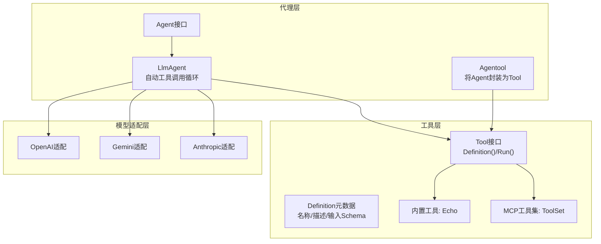
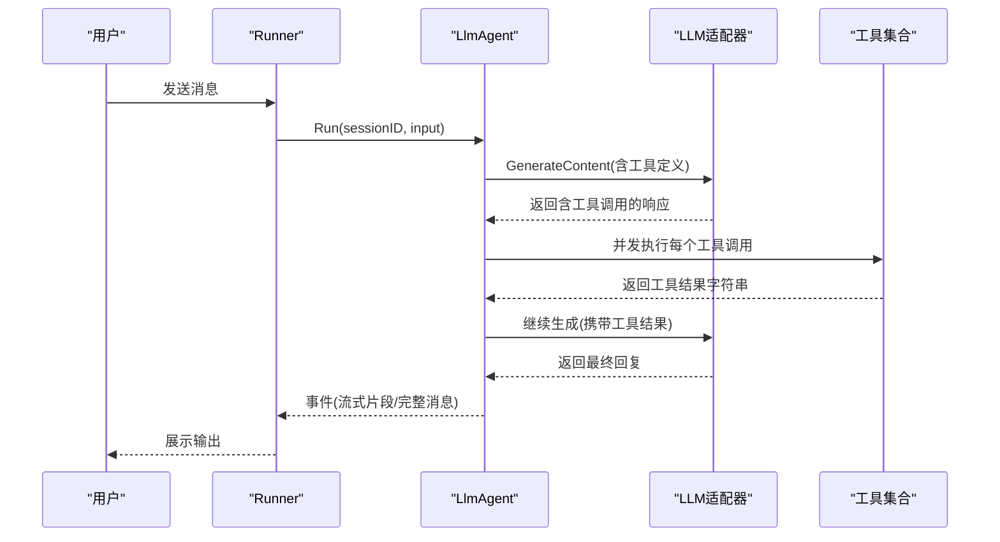
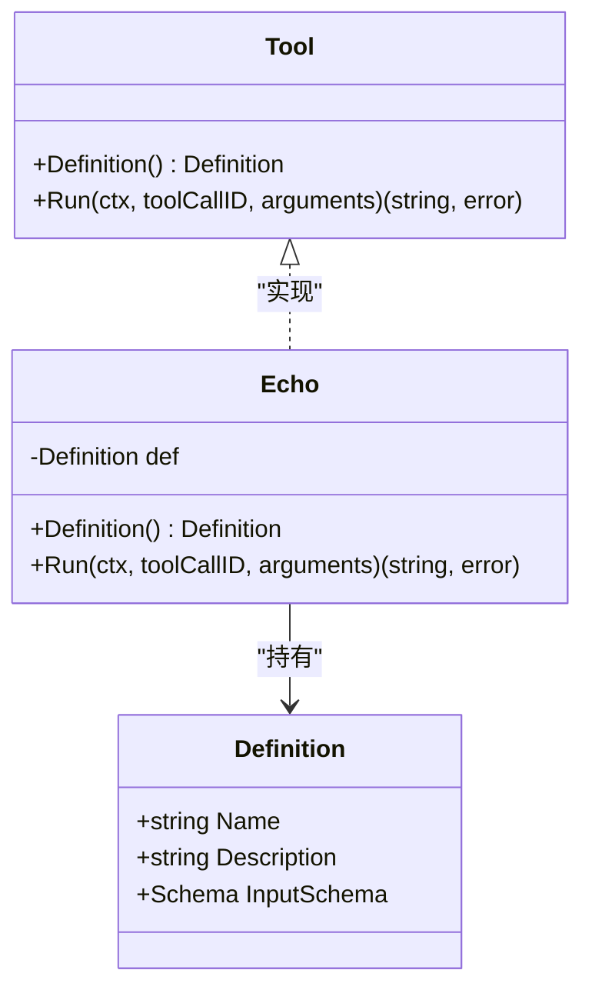
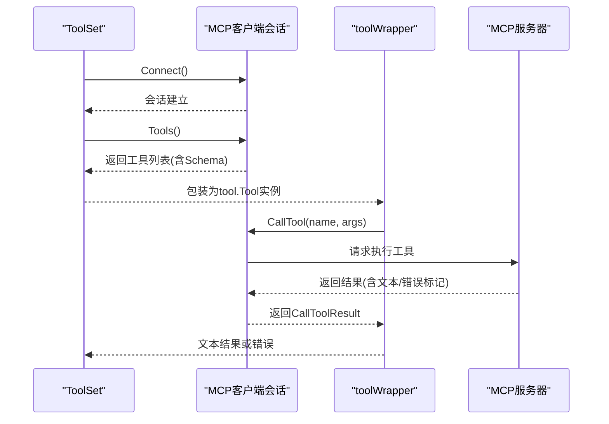
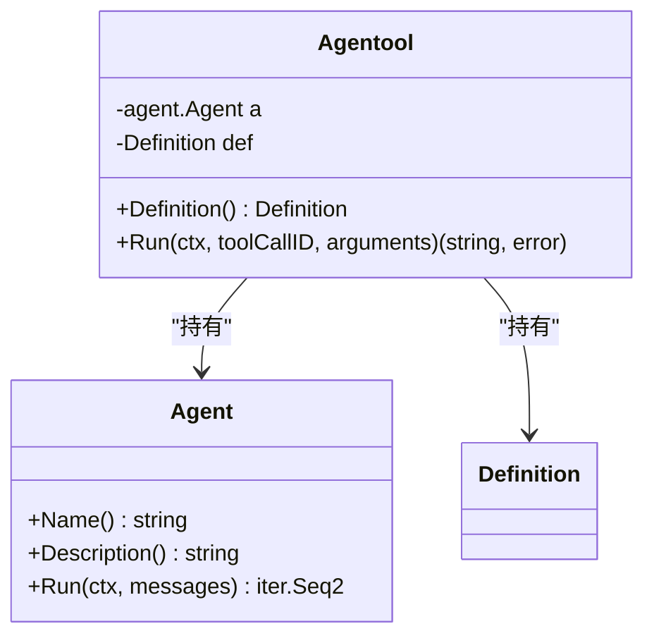
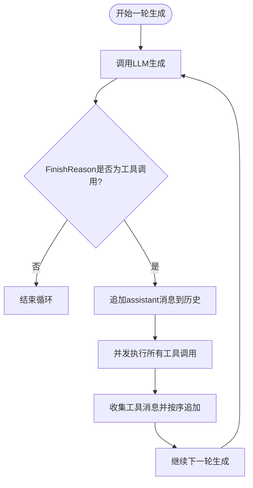
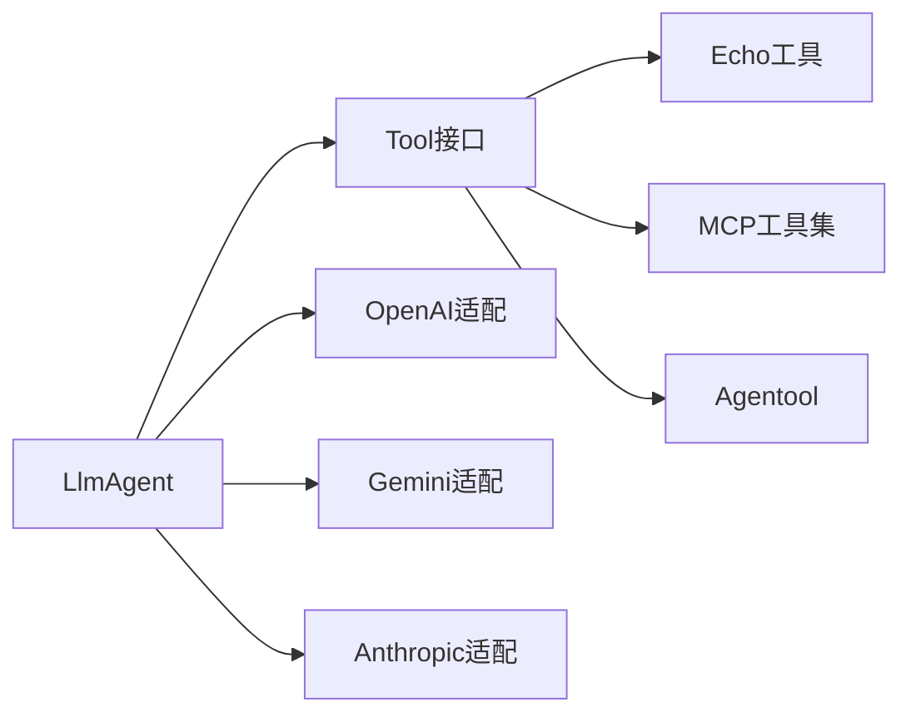

# 工具系统

<cite>
**本文引用的文件**
- [tool/tool.go](file://tool/tool.go)
- [tool/builtin/echo.go](file://tool/builtin/echo.go)
- [tool/mcp/mcp.go](file://tool/mcp/mcp.go)
- [agent/agent.go](file://agent/agent.go)
- [agent/llmagent/llmagent.go](file://agent/llmagent/llmagent.go)
- [agent/agentool/agentool.go](file://agent/agentool/agentool.go)
- [examples/chat/main.go](file://examples/chat/main.go)
- [model/openai/openai.go](file://model/openai/openai.go)
- [model/gemini/gemini.go](file://model/gemini/gemini.go)
- [model/anthropic/anthropic.go](file://model/anthropic/anthropic.go)
- [README.md](file://README.md)
</cite>

## 目录
1. [简介](#简介)
2. [项目结构](#项目结构)
3. [核心组件](#核心组件)
4. [架构总览](#架构总览)
5. [详细组件分析](#详细组件分析)
6. [依赖分析](#依赖分析)
7. [性能考量](#性能考量)
8. [故障排查指南](#故障排查指南)
9. [结论](#结论)
10. [附录](#附录)

## 简介
本节概述ADK框架的工具系统目标与范围：提供统一的工具抽象，支持内置工具、MCP工具集成以及将子代理作为工具委托，实现LLM自动触发工具调用循环，从而构建可扩展、可组合的智能体能力体系。

- 统一工具接口：通过Provider-agnostic的Tool接口，屏蔽不同工具来源（内置、MCP、自定义）差异。
- 自动工具调用循环：在LLM生成过程中，当模型请求工具调用时，自动执行工具并回传结果，直至模型停止。
- 多LLM适配：OpenAI、Gemini、Anthropic均以一致的方式注册工具定义与处理工具调用。
- MCP集成：动态连接任意Model Context Protocol服务器，自动暴露其工具集为ADK工具。

章节来源
- [README.md: 14-26:14-26](file://README.md#L14-L26)
- [README.md: 270-292:270-292](file://README.md#L270-L292)

## 项目结构
工具系统位于独立的tool包中，包含：
- 接口与定义：定义工具元数据与调用协议
- 内置工具：示例echo工具
- MCP桥接：连接任意MCP服务器并暴露其工具
- 代理工具：将子代理包装为工具，实现任务委托

图表来源
- [tool/tool.go: 9-23:9-23](file://tool/tool.go#L9-L23)
- [tool/builtin/echo.go: 14-46:14-46](file://tool/builtin/echo.go#L14-L46)
- [tool/mcp/mcp.go: 15-80:15-80](file://tool/mcp/mcp.go#L15-L80)
- [agent/agent.go: 10-19:10-19](file://agent/agent.go#L10-L19)
- [agent/llmagent/llmagent.go: 30-46:30-46](file://agent/llmagent/llmagent.go#L30-L46)
- [agent/agentool/agentool.go: 16-48:16-48](file://agent/agentool/agentool.go#L16-L48)
- [model/openai/openai.go: 250-277:250-277](file://model/openai/openai.go#L250-L277)
- [model/gemini/gemini.go: 326-351:326-351](file://model/gemini/gemini.go#L326-L351)
- [model/anthropic/anthropic.go: 213-240:213-240](file://model/anthropic/anthropic.go#L213-L240)

章节来源
- [README.md: 67-89:67-89](file://README.md#L67-L89)

## 核心组件
- Tool接口与Definition
  - Definition包含工具名称、描述与输入JSON Schema，用于LLM理解工具签名。
  - Tool接口定义两个方法：Definition()返回元数据；Run(ctx, toolCallID, arguments)执行工具并返回字符串结果。
- LlmAgent的工具调用循环
  - 在每次LLM响应后，若FinishReason为工具调用，则并发执行所有工具调用，收集结果消息并继续下一轮生成，直到模型停止。
- 模型适配中的工具注册
  - 各LLM适配器将工具的Definition.InputSchema转换为各自SDK所需的函数声明或工具定义格式。

章节来源
- [tool/tool.go: 9-23:9-23](file://tool/tool.go#L9-L23)
- [agent/llmagent/llmagent.go: 56-136:56-136](file://agent/llmagent/llmagent.go#L56-L136)
- [model/openai/openai.go: 250-277:250-277](file://model/openai/openai.go#L250-L277)
- [model/gemini/gemini.go: 326-351:326-351](file://model/gemini/gemini.go#L326-L351)
- [model/anthropic/anthropic.go: 213-240:213-240](file://model/anthropic/anthropic.go#L213-L240)

## 架构总览
工具系统围绕“统一接口 + 自动循环 + 多适配”的设计展开。Agent在生成循环中根据LLM的工具调用指令自动执行工具，工具结果以消息形式回流到对话历史，驱动下一轮生成。

图表来源
- [agent/llmagent/llmagent.go: 78-136:78-136](file://agent/llmagent/llmagent.go#L78-L136)
- [model/openai/openai.go: 250-277:250-277](file://model/openai/openai.go#L250-L277)
- [model/gemini/gemini.go: 326-351:326-351](file://model/gemini/gemini.go#L326-L351)
- [model/anthropic/anthropic.go: 213-240:213-240](file://model/anthropic/anthropic.go#L213-L240)

## 详细组件分析

### Tool接口与Definition设计规范
- Definition字段
  - Name：工具唯一标识，用于LLM选择与调用。
  - Description：工具用途说明，帮助LLM正确选择工具。
  - InputSchema：工具输入参数的JSON Schema，用于参数校验与自动补全。
- Tool接口方法
  - Definition()：返回Definition，供LLM注册工具定义。
  - Run(ctx, toolCallID, arguments)：执行工具逻辑，arguments为JSON字符串，返回字符串结果或错误。
- 设计要点
  - 输入参数必须是JSON字符串，便于跨适配器传递。
  - 错误应明确返回，以便Agent将其转为工具消息内容。
  - InputSchema应覆盖必填字段与类型约束，提升LLM调用准确性。

章节来源
- [tool/tool.go: 9-23:9-23](file://tool/tool.go#L9-L23)

### 内置工具：Echo
- 结构与职责
  - 定义输入结构体与对应JSON Schema，确保参数校验。
  - Run方法解析arguments并直接返回请求内容，演示最小化工具实现。
- 开发要点
  - 使用反射生成Schema，保证Schema与代码结构一致。
  - 参数解析失败时返回错误，由Agent捕获并转为工具消息。
  - 名称与描述需简洁明确，便于LLM理解。

图表来源
- [tool/tool.go: 9-23:9-23](file://tool/tool.go#L9-L23)
- [tool/builtin/echo.go: 14-46:14-46](file://tool/builtin/echo.go#L14-L46)

章节来源
- [tool/builtin/echo.go: 14-46:14-46](file://tool/builtin/echo.go#L14-L46)

### MCP工具集成机制
- 连接与发现
  - ToolSet通过Transport建立与MCP服务器的会话，调用Tools()枚举服务器提供的工具。
  - 将MCP工具的InputSchema从任意类型Round-trip为*jsonschema.Schema，确保与Tool接口兼容。
- 调用流程
  - toolWrapper在Run中反序列化arguments为map[string]any，调用session.CallTool执行工具。
  - 提取CallToolResult中的文本内容作为工具结果；若标记为错误则返回错误。
- 关闭连接
  - Close()关闭会话，释放资源。

图表来源
- [tool/mcp/mcp.go: 35-121:35-121](file://tool/mcp/mcp.go#L35-L121)

章节来源
- [tool/mcp/mcp.go: 15-121:15-121](file://tool/mcp/mcp.go#L15-L121)

### 代理作为工具：Agentool
- 设计思路
  - 将Agent封装为Tool，输入为单一task字符串，输出为该Agent最终的assistant文本回复。
  - 通过Definition复用Agent的Name与Description，保持一致性。
- 执行流程
  - Run中解析arguments为taskRequest，以单条user消息启动被封装Agent的Run迭代。
  - 仅保留最后一个非空assistant完整消息作为工具结果返回。

图表来源
- [agent/agentool/agentool.go: 16-78:16-78](file://agent/agentool/agentool.go#L16-L78)

章节来源
- [agent/agentool/agentool.go: 16-78:16-78](file://agent/agentool/agentool.go#L16-L78)

### 工具调用循环工作原理
- 控制流
  - LlmAgent在每次GenerateContent后检查FinishReason：
    - 若为工具调用：并发执行所有ToolCall，按原始顺序收集工具消息并追加到历史，继续下一轮生成；
    - 若为停止：结束循环。
- 并发策略
  - 使用WaitGroup并发执行多个工具调用，缩短整体等待时间。
- 结果处理
  - 工具消息包含ToolCallID，便于LLM后续引用；错误会被捕获并转为工具消息内容。

图表来源
- [agent/llmagent/llmagent.go: 78-136:78-136](file://agent/llmagent/llmagent.go#L78-L136)

章节来源
- [agent/llmagent/llmagent.go: 56-136:56-136](file://agent/llmagent/llmagent.go#L56-L136)

### 自定义工具开发指南
- JSON Schema定义
  - 使用反射生成Schema，确保与输入结构体字段一一对应。
  - 为每个字段添加描述与示例，提升LLM调用准确性。
- 参数验证与错误处理
  - Run中先解析arguments为结构体，解析失败立即返回错误。
  - 对外部依赖（如网络、数据库）进行超时控制与错误包装。
- 集成与注册
  - 实现Tool接口，将工具加入LlmAgent配置的Tools切片。
  - 确保Definition.Name唯一且描述清晰。

章节来源
- [tool/tool.go: 9-23:9-23](file://tool/tool.go#L9-L23)
- [tool/builtin/echo.go: 22-46:22-46](file://tool/builtin/echo.go#L22-L46)

### 示例：MCP工具接入与聊天应用
- 示例程序展示了如何：
  - 创建OpenAI LLM；
  - 通过MCP Transport连接Exa MCP服务器；
  - 获取工具列表并注入到LlmAgent；
  - 使用Runner驱动交互式聊天循环。
- 关键点
  - Transport支持HTTP客户端与认证头注入；
  - 工具列表打印与工具名称展示；
  - 流式输出与工具调用提示。

章节来源
- [examples/chat/main.go: 52-177:52-177](file://examples/chat/main.go#L52-L177)
- [README.md: 270-292:270-292](file://README.md#L270-L292)

## 依赖分析
- 工具接口与实现
  - Tool接口与Definition是核心契约，所有工具实现均遵循此约定。
  - 内置工具与MCP工具均实现Tool接口，Agentool将Agent封装为Tool。
- LLM适配器
  - OpenAI：将Definition.InputSchema转换为FunctionDefinition参数。
  - Gemini：将Schema映射为FunctionDeclarations并通过ParametersJsonSchema传递。
  - Anthropic：将Schema转换为Tool的InputSchema参数。
- Agent与Runner
  - LlmAgent负责工具调用循环；Runner负责会话管理与事件流输出。

图表来源
- [tool/tool.go: 9-23:9-23](file://tool/tool.go#L9-L23)
- [tool/builtin/echo.go: 14-46:14-46](file://tool/builtin/echo.go#L14-L46)
- [tool/mcp/mcp.go: 15-121:15-121](file://tool/mcp/mcp.go#L15-L121)
- [agent/agentool/agentool.go: 16-78:16-78](file://agent/agentool/agentool.go#L16-L78)
- [agent/llmagent/llmagent.go: 30-46:30-46](file://agent/llmagent/llmagent.go#L30-L46)
- [model/openai/openai.go: 250-277:250-277](file://model/openai/openai.go#L250-L277)
- [model/gemini/gemini.go: 326-351:326-351](file://model/gemini/gemini.go#L326-L351)
- [model/anthropic/anthropic.go: 213-240:213-240](file://model/anthropic/anthropic.go#L213-L240)

章节来源
- [agent/agent.go: 10-19:10-19](file://agent/agent.go#L10-L19)
- [agent/llmagent/llmagent.go: 30-46:30-46](file://agent/llmagent/llmagent.go#L30-L46)

## 性能考量
- 并发执行工具调用
  - LlmAgent对同一轮内所有ToolCall采用goroutine并发执行，显著降低总延迟。
- 流式输出
  - 支持Partial事件，实现实时流式展示，改善用户体验。
- Schema预编译
  - 建议在工具初始化阶段完成Schema生成，避免运行时重复计算。
- 超时与重试
  - 对外部MCP或第三方工具调用设置合理超时与重试策略，防止阻塞主循环。

章节来源
- [agent/llmagent/llmagent.go: 116-126:116-126](file://agent/llmagent/llmagent.go#L116-L126)
- [README.md: 25-25:25-25](file://README.md#L25-L25)

## 故障排查指南
- 工具未找到
  - 现象：工具消息内容提示“tool not found”。
  - 排查：确认LlmAgent配置的Tools中包含该工具名称；检查Definition.Name是否匹配。
- 参数解析失败
  - 现象：工具返回“error: ...”。
  - 排查：检查arguments是否为合法JSON；核对InputSchema与实际参数结构。
- MCP连接问题
  - 现象：Connect/Tools报错。
  - 排查：确认Transport配置、网络连通性与认证头；查看MCP服务器状态。
- 输出为空或不完整
  - 现象：工具结果为空或截断。
  - 排查：检查extractText逻辑与MCP返回内容类型；确认工具实现返回非空字符串。

章节来源
- [agent/llmagent/llmagent.go: 139-158:139-158](file://agent/llmagent/llmagent.go#L139-L158)
- [tool/mcp/mcp.go: 92-121:92-121](file://tool/mcp/mcp.go#L92-L121)

## 结论
ADK工具系统通过统一接口、自动调用循环与多LLM适配，提供了灵活而强大的工具扩展能力。内置Echo与MCP集成展示了从简单到复杂工具的实现路径；Agentool进一步将智能体能力以工具形式复用。遵循本文的设计规范与最佳实践，可在保证安全性与性能的前提下快速扩展工具生态。

## 附录
- 快速上手
  - 参考示例程序，连接MCP服务器并注入工具到LlmAgent，体验自动工具调用循环。
- 参考实现
  - Echo工具：最小化实现范式。
  - MCP工具集：动态发现与调用。
  - Agentool：任务委托模式。

章节来源
- [examples/chat/main.go: 52-177:52-177](file://examples/chat/main.go#L52-L177)
- [tool/builtin/echo.go: 22-46:22-46](file://tool/builtin/echo.go#L22-L46)
- [tool/mcp/mcp.go: 46-72:46-72](file://tool/mcp/mcp.go#L46-L72)
- [agent/agentool/agentool.go: 35-78:35-78](file://agent/agentool/agentool.go#L35-L78)