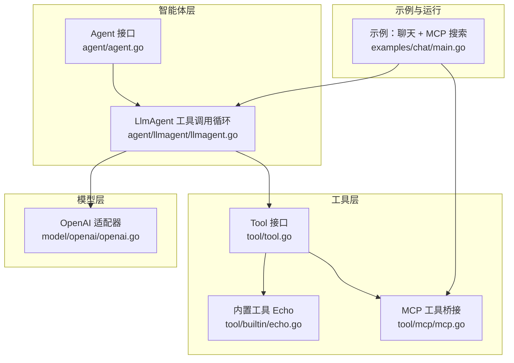
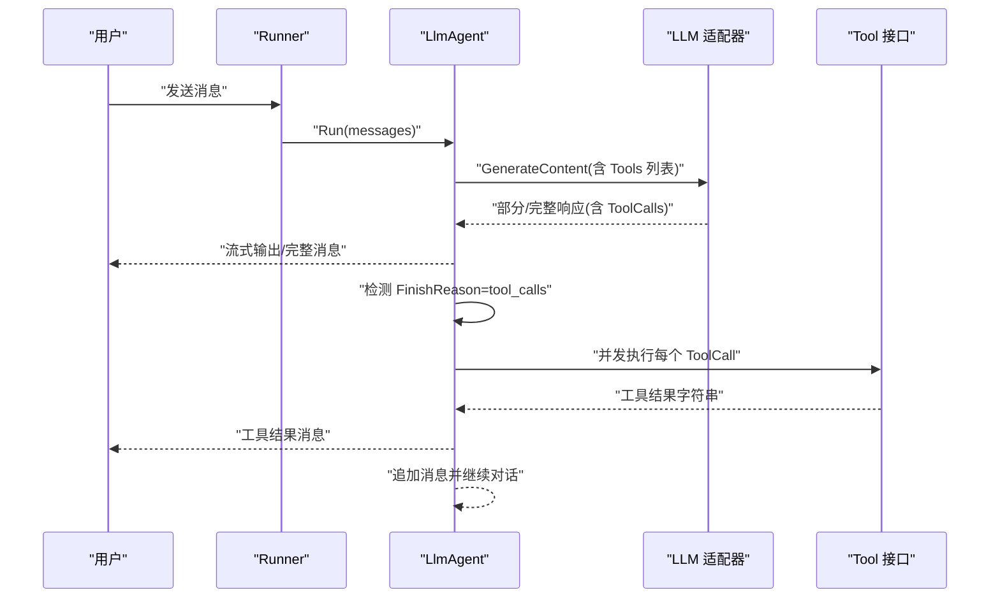
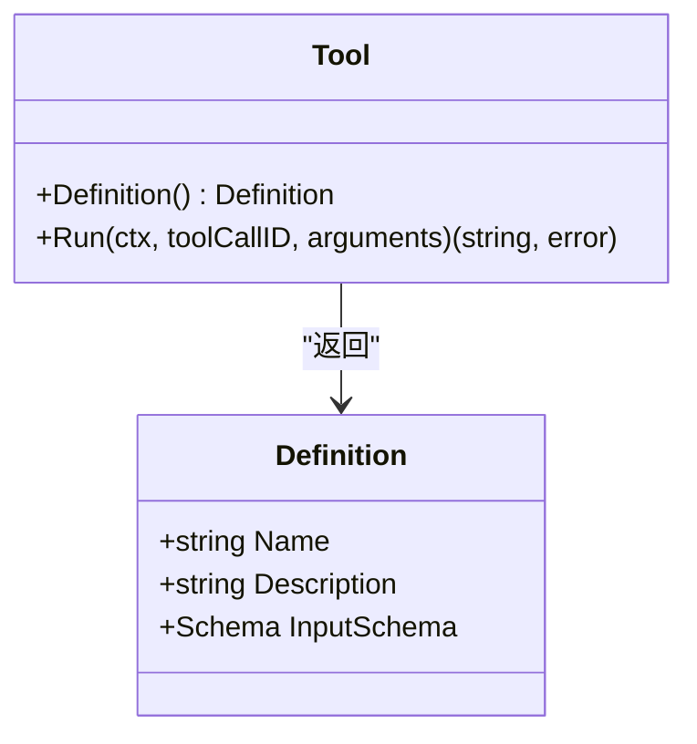
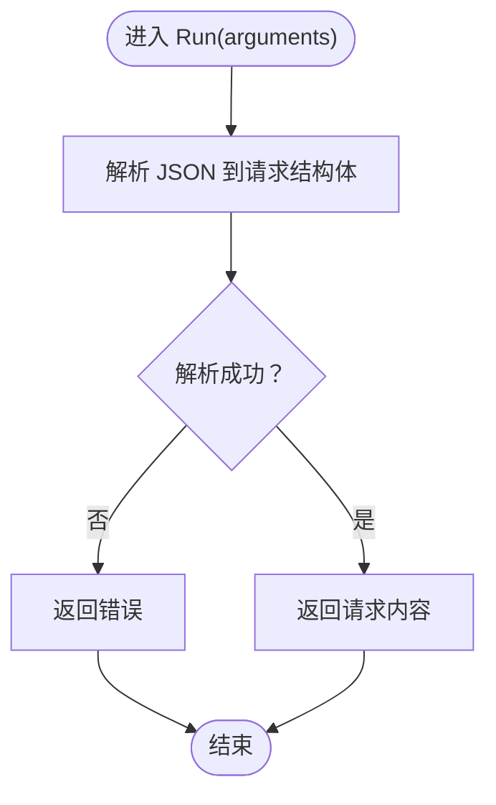
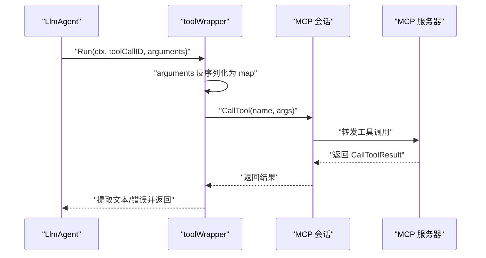
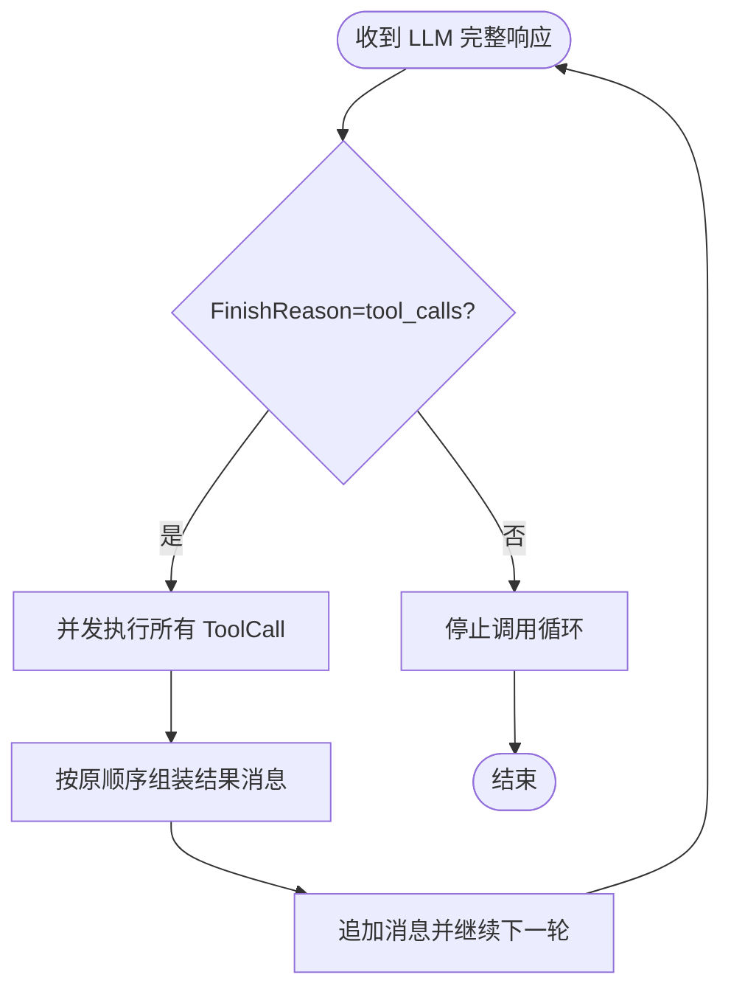
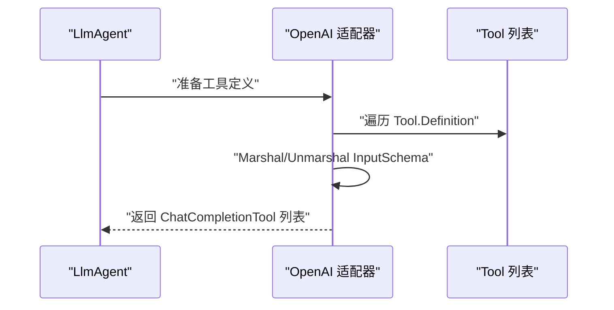
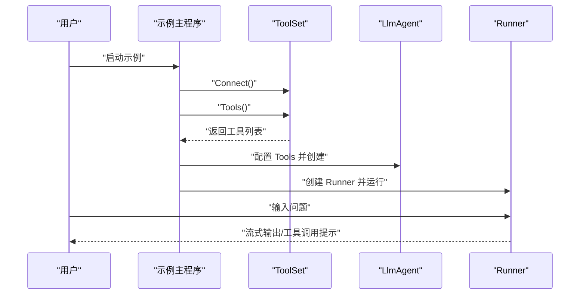
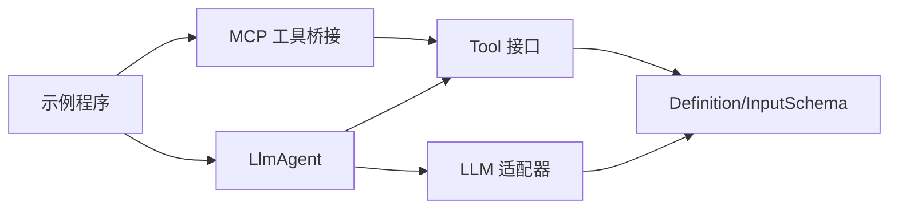

# 自定义工具开发

<cite>
**本文引用的文件**
- [tool.go](file://tool/tool.go)
- [echo.go](file://tool/builtin/echo.go)
- [mcp.go](file://tool/mcp/mcp.go)
- [llmagent.go](file://agent/llmagent/llmagent.go)
- [agent.go](file://agent/agent.go)
- [openai.go](file://model/openai/openai.go)
- [main.go](file://examples/chat/main.go)
- [llmagent_test.go](file://agent/llmagent/llmagent_test.go)
- [mcp_test.go](file://tool/mcp/mcp_test.go)
- [go.mod](file://go.mod)
- [README.md](file://README.md)
</cite>

## 目录
1. [简介](#简介)
2. [项目结构](#项目结构)
3. [核心组件](#核心组件)
4. [架构总览](#架构总览)
5. [详细组件分析](#详细组件分析)
6. [依赖分析](#依赖分析)
7. [性能考虑](#性能考虑)
8. [故障排查指南](#故障排查指南)
9. [结论](#结论)
10. [附录](#附录)

## 简介
本指南面向希望基于 ADK（Agent Development Kit）开发“自定义工具”的工程师与架构师。你将从零开始理解 Tool 接口的设计理念，掌握 Definition() 的元数据设计与 JSON Schema 的编写技巧，并通过内置 Echo 工具与 MCP 工具桥接两个真实实现，学习如何在 Run() 中高效执行业务逻辑。文档还覆盖并发安全、错误处理、性能优化、测试策略与调试方法，以及工具发布与版本管理的最佳实践。

## 项目结构
ADK 将“工具”抽象为 Provider-agnostic 的 Tool 接口，配合 LlmAgent 的自动工具调用循环，形成“模型 → 工具 → 结果”的闭环。核心目录与职责概览如下：
- tool：工具接口与内置工具、MCP 工具桥接
- agent：Agent 抽象与 LlmAgent 实现
- model：多厂商 LLM 适配器（OpenAI/Gemini/Anthropic）
- examples：示例程序（含 MCP 搜索工具接入）
- agent/llmagent：工具调用循环与并发执行
- agent/agentool：将子 Agent 包装为工具
- session：会话存储（内存/SQLite）
- runner：Runner 负责会话加载与驱动 Agent

图表来源
- [tool.go:1-24](file://tool/tool.go#L1-L24)
- [echo.go:1-47](file://tool/builtin/echo.go#L1-L47)
- [mcp.go:1-121](file://tool/mcp/mcp.go#L1-L121)
- [agent.go:1-20](file://agent/agent.go#L1-L20)
- [llmagent.go:1-159](file://agent/llmagent/llmagent.go#L1-L159)
- [openai.go:250-277](file://model/openai/openai.go#L250-L277)
- [main.go:1-181](file://examples/chat/main.go#L1-L181)

章节来源
- [README.md:67-89](file://README.md#L67-L89)
- [go.mod:1-47](file://go.mod#L1-L47)

## 核心组件
- Tool 接口与 Definition 元数据
  - Definition 包含名称、描述与 InputSchema（JSON Schema），用于向 LLM 描述工具用途与参数。
  - Tool 接口包含 Definition() 与 Run()，前者负责暴露元数据，后者负责执行具体逻辑。
- 内置 Echo 工具
  - 使用 JSON Schema 为输入参数生成强类型校验；Run() 解析参数并回显请求内容。
- MCP 工具桥接
  - 连接任意 MCP 服务器，动态发现工具并将 MCP 输入 Schema 转换为 JSON Schema，再包装为 Tool。
- LlmAgent 工具调用循环
  - 在每次 LLM 响应后，若 FinishReason 为工具调用，则并发执行所有 ToolCall，顺序保持不变，结果以完整消息形式返回。
- OpenAI 适配器
  - 将 Tool 的 Definition.InputSchema 序列化为函数参数格式，注入到 OpenAI 的工具定义中。

章节来源
- [tool.go:9-23](file://tool/tool.go#L9-L23)
- [echo.go:14-46](file://tool/builtin/echo.go#L14-L46)
- [mcp.go:15-121](file://tool/mcp/mcp.go#L15-L121)
- [llmagent.go:30-159](file://agent/llmagent/llmagent.go#L30-L159)
- [openai.go:250-277](file://model/openai/openai.go#L250-L277)

## 架构总览
下图展示了从用户输入到工具执行再到结果返回的端到端流程，强调 Tool 的 Provider-agnostic 设计与 LLM 的函数式调用集成。

图表来源
- [llmagent.go:56-136](file://agent/llmagent/llmagent.go#L56-L136)
- [openai.go:250-277](file://model/openai/openai.go#L250-L277)
- [tool.go:17-23](file://tool/tool.go#L17-L23)

## 详细组件分析

### Tool 接口与 Definition 元数据设计
- 设计要点
  - Definition.Name 与 Description 必须清晰表达工具职责，便于 LLM 正确选择与调用。
  - InputSchema 使用 JSON Schema 对参数进行强类型约束与校验，避免 Run() 处理无效输入。
  - Run() 返回字符串结果，便于统一封装为 model.Message 的 Content 字段。
- 最佳实践
  - 为每个字段提供明确的描述与示例，提升 LLM 的参数生成质量。
  - 对可选参数使用 “optional” 或 “default”，对必填参数使用 “required”。
  - 避免过于复杂的嵌套结构，必要时拆分为多个工具或参数对象。

图表来源
- [tool.go:9-23](file://tool/tool.go#L9-L23)

章节来源
- [tool.go:9-23](file://tool/tool.go#L9-L23)

### 内置 Echo 工具：从 JSON Schema 到 Run() 执行
- JSON Schema 生成
  - 通过反射与 JSON Schema 库为请求结构体生成 Schema，确保参数与注解一致。
- 参数解析与执行
  - Run() 接收 JSON 字符串，反序列化为结构体后读取字段，返回原始请求内容。
- 并发与错误处理
  - 解析失败直接返回错误；Echo 本身无外部依赖，线程安全。

图表来源
- [echo.go:40-46](file://tool/builtin/echo.go#L40-L46)

章节来源
- [echo.go:14-46](file://tool/builtin/echo.go#L14-L46)

### MCP 工具桥接：动态 Schema 与远程调用
- 动态发现与 Schema 转换
  - 从 MCP 服务获取工具列表，将输入 Schema 从 map[string]any 转换为 JSON Schema。
- 远程调用与错误映射
  - 将 LLM 传入的参数 JSON 反序列化为 map[string]any 后调用 MCP 工具；若返回 IsError，则转换为 Go 错误。
- 文本提取
  - 从 CallToolResult 的多片段内容中提取文本并拼接。

图表来源
- [mcp.go:92-120](file://tool/mcp/mcp.go#L92-L120)

章节来源
- [mcp.go:15-121](file://tool/mcp/mcp.go#L15-L121)

### LlmAgent 工具调用循环：并发与顺序保证
- 循环机制
  - 每次 LLM 生成后，若 FinishReason 为工具调用，则收集 ToolCalls 并并发执行。
- 并发与顺序
  - 使用 WaitGroup 并发执行，按原顺序写入消息数组，保证最终消息顺序与 LLM 决策一致。
- 错误处理
  - 工具执行出错时，将错误信息作为字符串返回，避免中断对话流程。

图表来源
- [llmagent.go:78-136](file://agent/llmagent/llmagent.go#L78-L136)

章节来源
- [llmagent.go:30-159](file://agent/llmagent/llmagent.go#L30-L159)

### OpenAI 适配器：将 Tool Definition 注入函数调用
- Schema 注入
  - 将 Tool.Definition.InputSchema 序列化为函数参数格式，注入到 OpenAI 的工具定义中。
- 参数映射
  - 将 ToolCalls 的 arguments 字符串映射为 OpenAI 的函数调用参数。

图表来源
- [openai.go:250-277](file://model/openai/openai.go#L250-L277)

章节来源
- [openai.go:250-277](file://model/openai/openai.go#L250-L277)

### 示例：聊天 + MCP 搜索
- 示例目标
  - 展示如何连接 MCP 服务器、加载工具、注入 Agent 并进行交互。
- 关键步骤
  - 创建 MCP Transport（可带认证头）。
  - 新建 ToolSet 并 Connect，随后 Tools() 获取工具列表。
  - 将工具注入 LlmAgent 的 Config.Tools，创建 Runner 并进入聊天循环。

图表来源
- [main.go:52-177](file://examples/chat/main.go#L52-L177)

章节来源
- [main.go:1-181](file://examples/chat/main.go#L1-L181)

## 依赖分析
- 组件耦合
  - Tool 与 LLM 适配器之间通过 Definition.InputSchema 解耦；Tool 仅暴露元数据与执行接口。
  - LlmAgent 依赖 Tool 列表与模型 GenerateContent，不关心具体工具实现。
- 外部依赖
  - JSON Schema 生成与校验：github.com/google/jsonschema-go
  - MCP 客户端：github.com/modelcontextprotocol/go-sdk
  - OpenAI 客户端：github.com/openai/openai-go/v3

图表来源
- [tool.go:9-23](file://tool/tool.go#L9-L23)
- [llmagent.go:30-46](file://agent/llmagent/llmagent.go#L30-L46)
- [mcp.go:15-33](file://tool/mcp/mcp.go#L15-L33)
- [openai.go:250-277](file://model/openai/openai.go#L250-L277)
- [main.go:52-111](file://examples/chat/main.go#L52-L111)

章节来源
- [go.mod:5-15](file://go.mod#L5-L15)

## 性能考虑
- 并发执行工具
  - LlmAgent 对同一轮的多个 ToolCall 使用 goroutine 并发执行，显著降低总延迟；测试用例验证了并发执行优于顺序执行。
- 流式输出
  - 当启用 Stream 时，LLM 的部分响应与工具结果均以完整消息返回，工具结果始终完整，避免中间状态碎片化。
- JSON Schema 生成
  - 在工具初始化阶段一次性生成 Schema，避免在 Run() 中重复计算。
- 错误短路
  - 工具执行失败时快速返回错误字符串，减少无效重试。

章节来源
- [llmagent_test.go:608-672](file://agent/llmagent/llmagent_test.go#L608-L672)
- [llmagent.go:116-134](file://agent/llmagent/llmagent.go#L116-L134)

## 故障排查指南
- JSON Schema 生成失败
  - 现象：初始化工具时 panic 或返回空 Schema。
  - 排查：检查结构体字段标签是否正确，确保字段具备可导出性与可序列化类型。
- 参数解析错误
  - 现象：Run() 返回解析错误。
  - 排查：确认 arguments 是否为合法 JSON；必要时在工具内部增加日志记录。
- MCP 工具调用失败
  - 现象：返回 IsError 或连接异常。
  - 排查：检查 Transport 认证头设置、网络连通性与工具名一致性；查看返回文本内容定位问题。
- 并发竞态
  - 现象：工具内部共享状态导致数据不一致。
  - 排查：将共享状态移至外部或使用互斥锁保护；尽量设计无状态工具。
- 单元测试与集成测试
  - 使用 mock LLM 与 streamingMockLLM 验证流式与工具调用顺序；对慢速工具进行并发执行验证。

章节来源
- [echo.go:22-34](file://tool/builtin/echo.go#L22-L34)
- [mcp.go:92-120](file://tool/mcp/mcp.go#L92-L120)
- [llmagent_test.go:585-672](file://agent/llmagent/llmagent_test.go#L585-L672)

## 结论
通过 Provider-agnostic 的 Tool 接口与 JSON Schema 元数据，ADK 将工具开发标准化、可测试化与可复用化。结合 LlmAgent 的自动工具调用循环与并发执行能力，开发者可以快速构建稳定可靠的工具生态。建议在实际项目中遵循“强 Schema、弱耦合、高并发、易测试”的原则，持续完善工具的健壮性与性能表现。

## 附录

### JSON Schema 编写技巧清单
- 字段命名
  - 使用清晰语义的字段名，避免缩写；为复杂字段提供子对象。
- 类型与约束
  - 明确基本类型（string/number/object/array）、必填字段与可选字段。
  - 使用枚举限制取值范围；使用正则表达式约束格式。
- 描述与示例
  - 为每个字段添加简明描述与典型示例，提升 LLM 的参数生成质量。
- 嵌套与分层
  - 避免过深嵌套；必要时拆分为多个工具或参数对象，降低复杂度。

### 常见工具开发场景
- API 调用工具
  - 使用 JSON Schema 定义查询参数；在 Run() 中发起 HTTP 请求并返回结构化结果。
- 数据处理工具
  - 解析输入 JSON，执行清洗、聚合或转换逻辑，输出字符串或结构化文本。
- 业务逻辑工具
  - 将领域规则封装为工具，通过 Schema 明确输入输出契约，便于 LLM 正确调用。

### 工具测试策略与调试方法
- 单元测试
  - 使用 mock LLM 与 streamingMockLLM 验证流式输出与工具调用顺序。
  - 对慢速工具进行并发执行测试，验证 WaitGroup 与顺序一致性。
- 集成测试
  - 使用真实 LLM（如 OpenAI）与示例程序验证端到端流程。
  - 对 MCP 工具进行连接与调用测试，确保 Schema 与参数映射正确。

章节来源
- [llmagent_test.go:156-237](file://agent/llmagent/llmagent_test.go#L156-L237)
- [mcp_test.go:44-100](file://tool/mcp/mcp_test.go#L44-L100)

### 工具发布与版本管理最佳实践
- 版本号与变更日志
  - 采用语义化版本（SemVer），在变更日志中记录 Breaking Changes 与修复项。
- Schema 兼容性
  - 新增可选字段时保持向后兼容；删除字段需引入新版本工具。
- 发布渠道
  - 将工具打包为模块或独立仓库，提供最小可运行示例与测试用例。
- 文档与示例
  - 提供 Definition 描述、Schema 示例与调用示例，降低使用者上手成本。