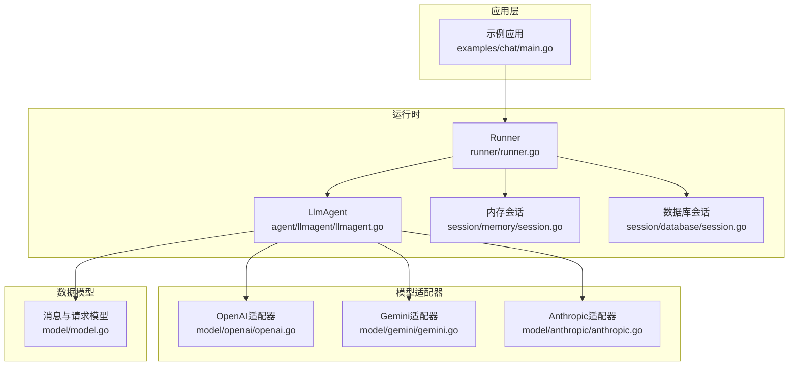
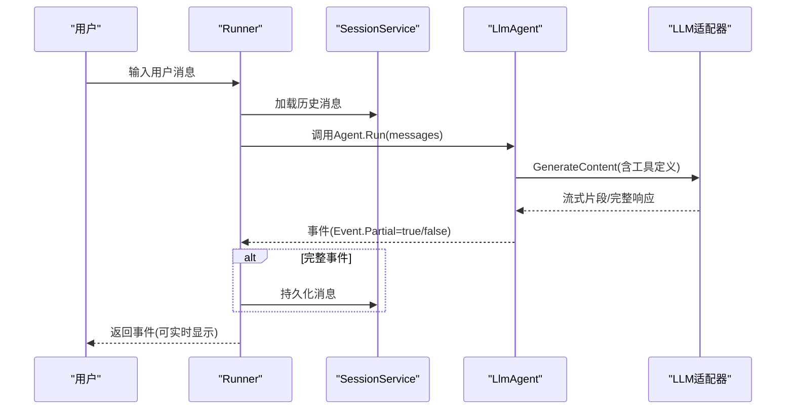
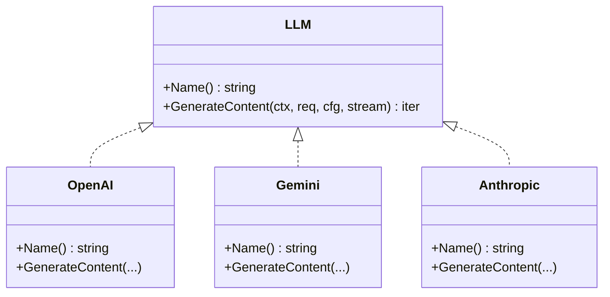
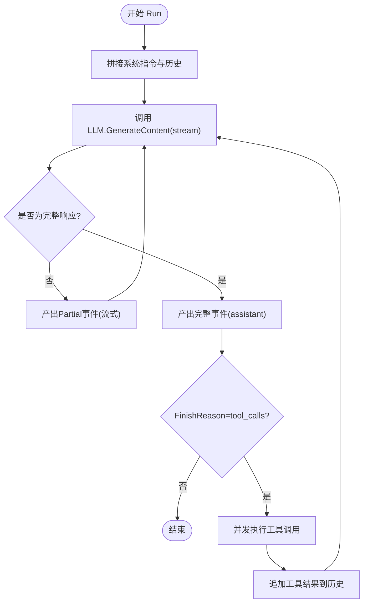
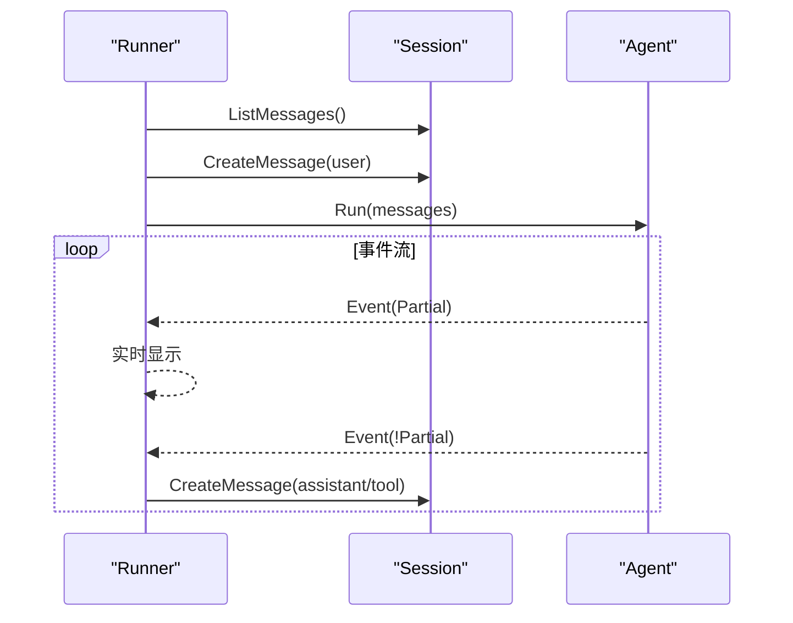
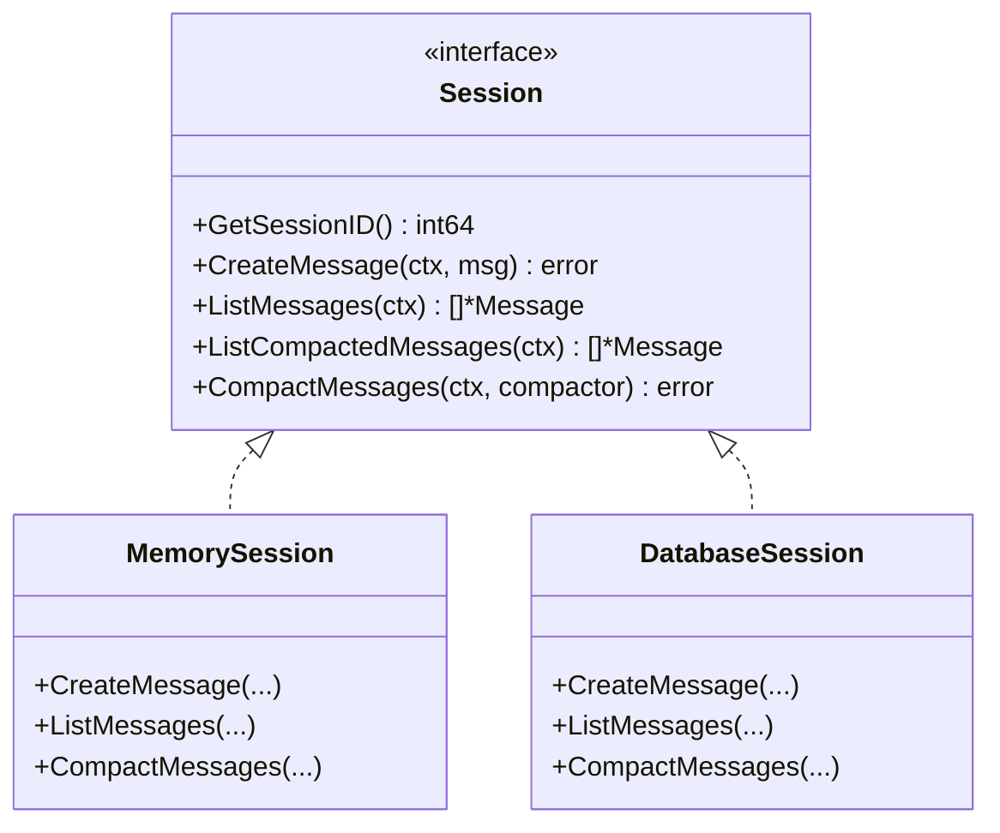
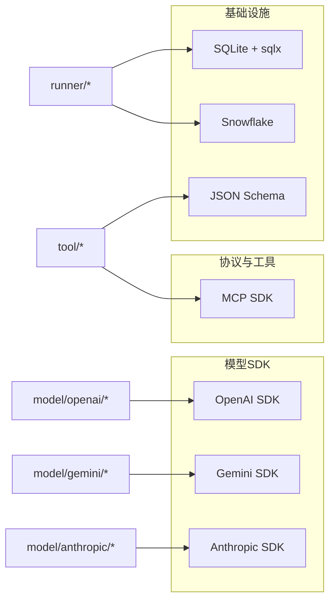

# 快速开始

<cite>
**本文引用的文件**
- [README.md](file://README.md)
- [examples/chat/main.go](file://examples/chat/main.go)
- [agent/agent.go](file://agent/agent.go)
- [agent/llmagent/llmagent.go](file://agent/llmagent/llmagent.go)
- [model/model.go](file://model/model.go)
- [model/openai/openai.go](file://model/openai/openai.go)
- [model/gemini/gemini.go](file://model/gemini/gemini.go)
- [model/anthropic/anthropic.go](file://model/anthropic/anthropic.go)
- [runner/runner.go](file://runner/runner.go)
- [session/session.go](file://session/session.go)
- [session/memory/session.go](file://session/memory/session.go)
- [session/database/session.go](file://session/database/session.go)
- [go.mod](file://go.mod)
</cite>

## 目录
1. [简介](#简介)
2. [项目结构](#项目结构)
3. [核心组件](#核心组件)
4. [架构总览](#架构总览)
5. [详细组件解析](#详细组件解析)
6. [依赖关系分析](#依赖关系分析)
7. [性能与最佳实践](#性能与最佳实践)
8. [故障排查指南](#故障排查指南)
9. [结论](#结论)
10. [附录：30分钟上手清单](#附录30分钟上手清单)

## 简介
本指南带你从零开始，用ADK框架在30分钟内运行你的第一个AI代理。你将完成以下步骤：
- 准备环境与依赖
- 配置并使用OpenAI、Gemini、Anthropic三种主流LLM
- 创建LLM适配器、构建代理、选择会话后端
- 运行第一个聊天应用，体验流式输出、消息历史管理与错误处理

ADK的核心理念是"解耦"：代理逻辑、LLM提供商、会话存储与工具集成均可独立替换，让你在不修改代理代码的前提下切换不同模型提供商。

**更新** 模块路径已从 `soasurs.dev/soasurs/adk` 迁移到 `github.com/soasurs/adk`

## 项目结构
ADK采用按职责分层的包布局，便于组合与扩展：
- agent：定义Agent接口及具体实现（如llmagent）
- model：统一LLM接口与消息类型，提供OpenAI/Gemini/Anthropic适配器
- runner：连接Agent与SessionService，驱动对话轮次
- session：会话接口与内存/数据库两种后端
- tool：工具接口与内置工具、MCP桥接
- examples：示例程序（如chat）

**图表来源**
- [examples/chat/main.go:52-177](file://examples/chat/main.go#L52-L177)
- [runner/runner.go:39-96](file://runner/runner.go#L39-L96)
- [agent/llmagent/llmagent.go:60-136](file://agent/llmagent/llmagent.go#L60-L136)
- [session/memory/session.go:18-85](file://session/memory/session.go#L18-L85)
- [session/database/session.go:34-145](file://session/database/session.go#L34-L145)
- [model/openai/openai.go:25-37](file://model/openai/openai.go#L25-L37)
- [model/gemini/gemini.go:26-59](file://model/gemini/gemini.go#L26-L59)
- [model/anthropic/anthropic.go:34-40](file://model/anthropic/anthropic.go#L34-L40)
- [model/model.go:10-227](file://model/model.go#L10-L227)

**章节来源**
- [README.md:67-89](file://README.md#L67-L89)

## 核心组件
- Agent接口：定义Run方法，返回事件迭代器，支持流式增量输出
- LlmAgent：基于LLM的无状态代理，自动执行工具调用循环
- model.LLM：统一LLM接口，屏蔽不同提供商差异
- Runner：加载历史、驱动Agent、持久化消息
- Session接口：抽象会话存储，支持内存与SQLite后端
- 工具系统：内置工具与MCP桥接，支持函数式工具调用

**章节来源**
- [agent/agent.go:10-19](file://agent/agent.go#L10-L19)
- [agent/llmagent/llmagent.go:30-46](file://agent/llmagent/llmagent.go#L30-L46)
- [model/model.go:10-227](file://model/model.go#L10-L227)
- [runner/runner.go:17-37](file://runner/runner.go#L17-L37)
- [session/session.go:9-23](file://session/session.go#L9-L23)

## 架构总览
ADK将"状态"与"无状态逻辑"分离：Runner持有会话并负责消息持久化；Agent只关注当前轮次的消息与工具调用，不保存历史。

**图表来源**
- [runner/runner.go:39-96](file://runner/runner.go#L39-L96)
- [agent/llmagent/llmagent.go:60-136](file://agent/llmagent/llmagent.go#L60-L136)
- [model/model.go:10-227](file://model/model.go#L10-L227)

## 详细组件解析

### 组件A：LLM适配器（OpenAI/Gemini/Anthropic）
- 统一接口：实现model.LLM.GenerateContent，支持非流式与流式两种模式
- OpenAI：支持多模态输入、工具函数、推理能力映射
- Gemini：支持思考内容（reasoning）与工具调用，支持Vertex AI
- Anthropic：支持工具调用与思考预算配置

**图表来源**
- [model/model.go:10-18](file://model/model.go#L10-L18)
- [model/openai/openai.go:19-42](file://model/openai/openai.go#L19-L42)
- [model/gemini/gemini.go:17-64](file://model/gemini/gemini.go#L17-L64)
- [model/anthropic/anthropic.go:25-45](file://model/anthropic/anthropic.go#L25-L45)

**章节来源**
- [model/openai/openai.go:44-164](file://model/openai/openai.go#L44-L164)
- [model/gemini/gemini.go:66-201](file://model/gemini/gemini.go#L66-L201)
- [model/anthropic/anthropic.go:47-93](file://model/anthropic/anthropic.go#L47-L93)

### 组件B：LlmAgent（无状态代理）
- 自动工具调用循环：当LLM返回工具调用时，Agent并发执行并注入结果
- 流式输出：逐段产出Partial事件，支持实时显示
- 系统指令：每次Run前自动插入系统提示

**图表来源**
- [agent/llmagent/llmagent.go:60-136](file://agent/llmagent/llmagent.go#L60-L136)

**章节来源**
- [agent/llmagent/llmagent.go:56-136](file://agent/llmagent/llmagent.go#L56-L136)

### 组件C：Runner（状态驱动）
- 加载会话历史，追加用户输入，调用Agent
- 只在完整事件时持久化消息，流式片段仅用于实时显示
- 使用Snowflake生成分布式时间有序ID

**图表来源**
- [runner/runner.go:39-96](file://runner/runner.go#L39-L96)

**章节来源**
- [runner/runner.go:17-108](file://runner/runner.go#L17-L108)

### 组件D：会话后端（内存/数据库）
- 内存后端：适合测试或单进程场景，零配置
- 数据库后端：SQLite，支持消息软归档（非删除），保留历史摘要

**图表来源**
- [session/session.go:9-23](file://session/session.go#L9-L23)
- [session/memory/session.go:18-85](file://session/memory/session.go#L18-L85)
- [session/database/session.go:26-145](file://session/database/session.go#L26-L145)

**章节来源**
- [session/memory/session.go:18-85](file://session/memory/session.go#L18-L85)
- [session/database/session.go:34-145](file://session/database/session.go#L34-L145)

## 依赖关系分析
ADK通过统一接口解耦各模块，外部依赖集中在三个层面：
- LLM SDK：OpenAI、Gemini、Anthropic
- 工具与协议：MCP客户端
- 基础设施：SQLite、Snowflake、JSON Schema

**图表来源**
- [go.mod:5-15](file://go.mod#L5-L15)
- [model/openai/openai.go:3-17](file://model/openai/openai.go#L3-L17)
- [model/gemini/gemini.go:3-15](file://model/gemini/gemini.go#L3-L15)
- [model/anthropic/anthropic.go:3-16](file://model/anthropic/anthropic.go#L3-L16)
- [runner/runner.go:8-15](file://runner/runner.go#L8-L15)

**章节来源**
- [go.mod:1-47](file://go.mod#L1-L47)

## 性能与最佳实践
- 流式输出
  - 在Agent配置中启用流式，以Event.Partial=true实时显示增量文本
  - 仅在Event.Partial=false时持久化完整消息，避免重复写入
- 消息历史管理
  - 使用Session.CompactMessages进行软归档，保留摘要而非删除旧消息
  - 对长对话定期压缩，降低查询与传输成本
- 错误处理
  - 对LLM调用、工具执行、会话持久化分别捕获错误并返回
  - 在Runner中区分Partial与Complete事件，保证一致性
- 并发与稳定性
  - 工具调用并发执行，但保持原始顺序，避免竞态
  - 使用Snowflake生成全局唯一且有序的消息ID，便于追踪

**章节来源**
- [agent/llmagent/llmagent.go:24-27](file://agent/llmagent/llmagent.go#L24-L27)
- [runner/runner.go:78-94](file://runner/runner.go#L78-L94)
- [session/session.go:22](file://session/session.go#L22)

## 故障排查指南
- 环境变量未设置
  - OpenAI：检查OPENAI_API_KEY；可选OPENAI_BASE_URL、OPENAI_MODEL
  - Gemini：需GEMINI_API_KEY；或使用Vertex AI（需ADC）
  - Anthropic：检查ANTHROPIC_API_KEY
- 会话创建失败
  - 确认数据库后端已初始化，或改用内存后端验证流程
- 工具调用异常
  - 检查工具定义的JSON Schema与参数是否匹配
  - 查看工具返回的错误信息，必要时在Agent中记录日志
- 流式输出中断
  - 确保Agent配置了正确的流式开关，并在Runner中正确处理Partial事件

**章节来源**
- [examples/chat/main.go:55-66](file://examples/chat/main.go#L55-L66)
- [session/database/session.go:34-41](file://session/database/session.go#L34-L41)
- [agent/llmagent/llmagent.go:138-158](file://agent/llmagent/llmagent.go#L138-L158)

## 结论
通过ADK，你可以用最少的改动在不同LLM之间切换，同时获得一致的流式输出、工具调用与消息历史管理体验。建议先用内存后端快速验证，再迁移到SQLite后端以获得持久化能力。

## 附录：30分钟上手清单
- 步骤1：安装与依赖
  - 安装Go 1.26+，拉取模块依赖
  - 参考：[README.md:29-33](file://README.md#L29-L33)，[go.mod:1-47](file://go.mod#L1-L47)
- 步骤2：选择LLM适配器
  - OpenAI：参考[examples/chat/main.go:55-66](file://examples/chat/main.go#L55-L66)
  - Gemini：参考[model/gemini/gemini.go:26-59](file://model/gemini/gemini.go#L26-L59)
  - Anthropic：参考[model/anthropic/anthropic.go:34-40](file://model/anthropic/anthropic.go#L34-L40)
- 步骤3：构建代理
  - 参考[agent/llmagent/llmagent.go:36-46](file://agent/llmagent/llmagent.go#L36-L46)
- 步骤4：选择会话后端
  - 内存：参考[session/memory/session.go:18-24](file://session/memory/session.go#L18-L24)
  - SQLite：参考[session/database/session.go:34-41](file://session/database/session.go#L34-L41)
- 步骤5：运行第一个聊天应用
  - 参考[examples/chat/main.go:102-125](file://examples/chat/main.go#L102-L125)
  - 运行主循环与流式输出：参考[examples/chat/main.go:144-171](file://examples/chat/main.go#L144-L171)
- 步骤6：切换模型提供商
  - 仅需替换LLM适配器构造与配置，无需修改代理代码
  - 参考：OpenAI[examples/chat/main.go:66](file://examples/chat/main.go#L66)、Gemini[examples/chat/main.go:102-111](file://examples/chat/main.go#L102-L111)、Anthropic[examples/chat/main.go:102-111](file://examples/chat/main.go#L102-L111)

**更新** 所有导入路径已更新为新的模块路径 `github.com/soasurs/adk`