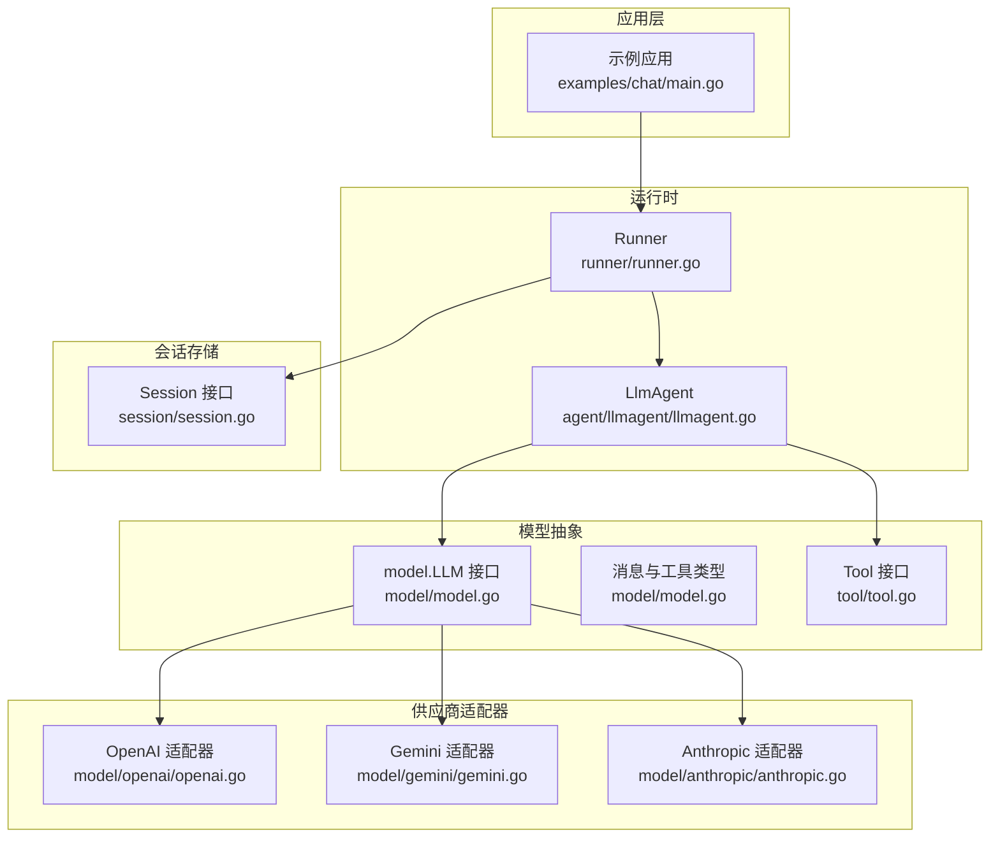
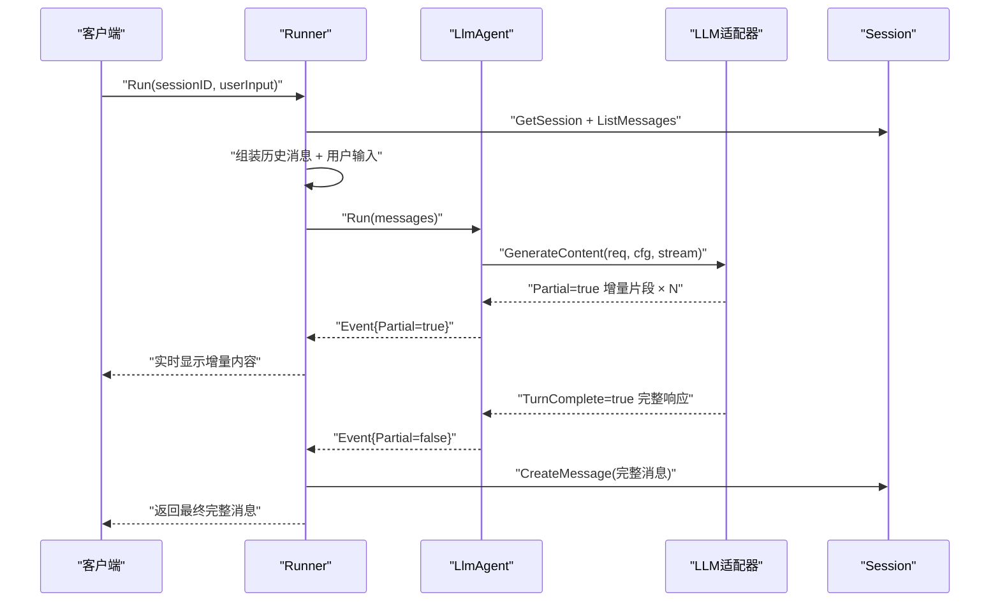
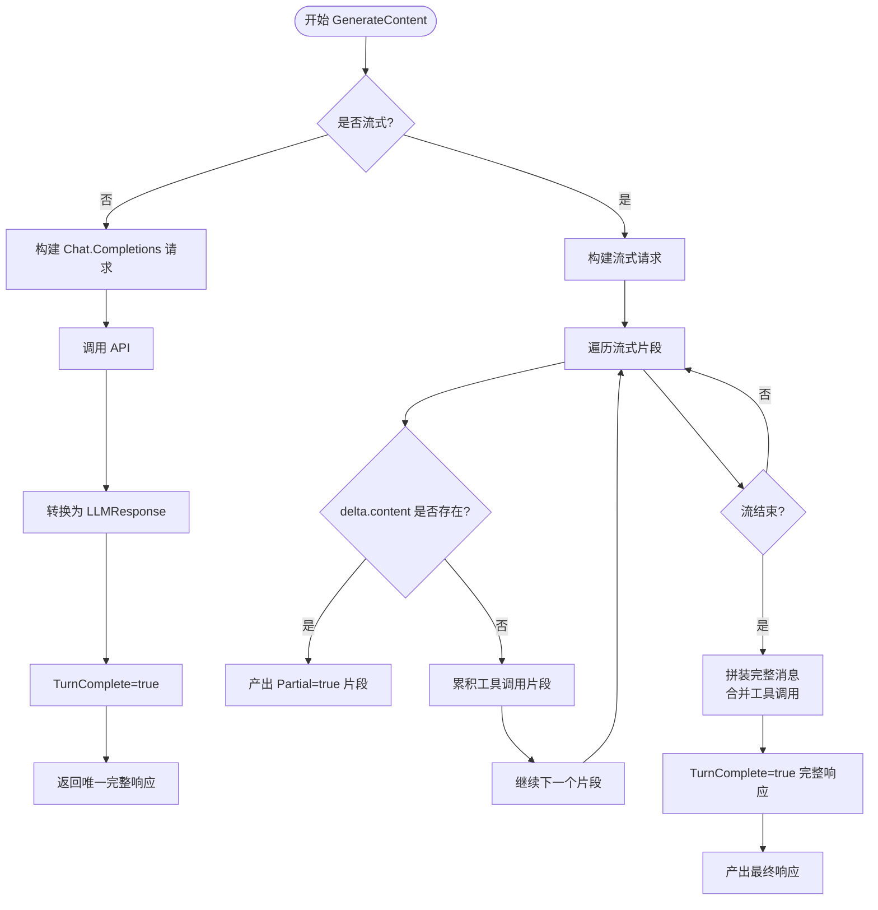
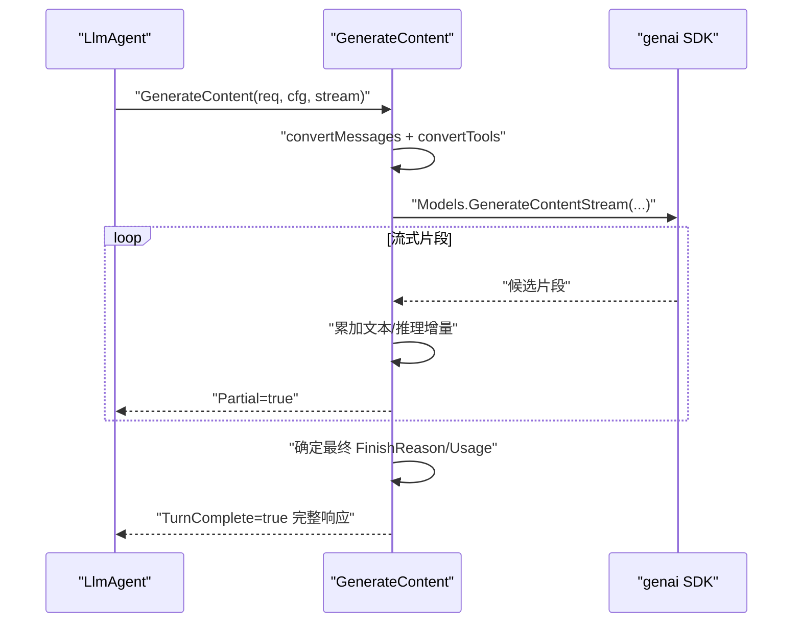
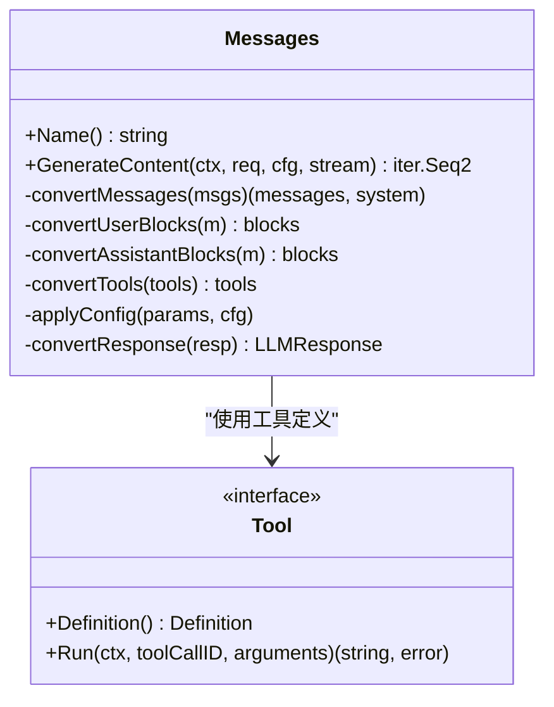
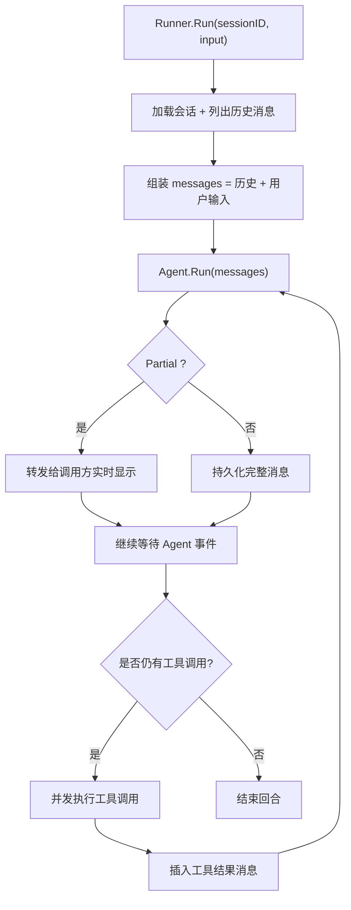
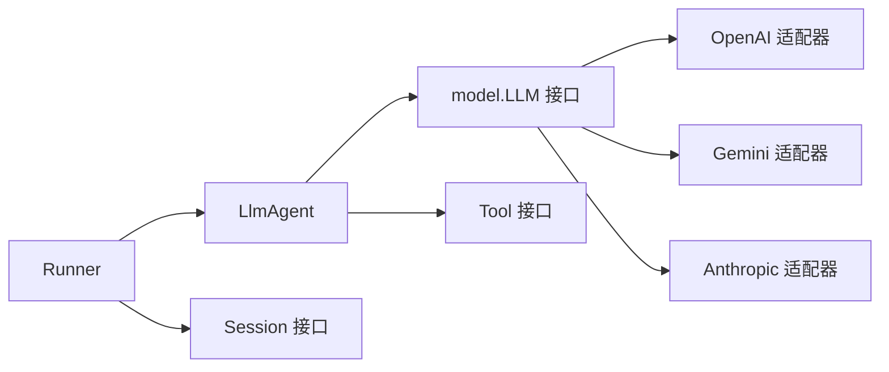

# LLM适配器开发

<cite>
**本文档引用的文件**
- [README.md](file://README.md)
- [model.go](file://model/model.go)
- [openai.go](file://model/openai/openai.go)
- [gemini.go](file://model/gemini/gemini.go)
- [anthropic.go](file://model/anthropic/anthropic.go)
- [llmagent.go](file://agent/llmagent/llmagent.go)
- [runner.go](file://runner/runner.go)
- [session.go](file://session/session.go)
- [tool.go](file://tool/tool.go)
- [openai_test.go](file://model/openai/openai_test.go)
- [gemini_test.go](file://model/gemini/gemini_test.go)
- [anthropic_test.go](file://model/anthropic/anthropic_test.go)
- [llmagent_test.go](file://agent/llmagent/llmagent_test.go)
- [runner_test.go](file://runner/runner_test.go)
- [main.go](file://examples/chat/main.go)
</cite>

## 目录
1. [简介](#简介)
2. [项目结构](#项目结构)
3. [核心组件](#核心组件)
4. [架构总览](#架构总览)
5. [详细组件分析](#详细组件分析)
6. [依赖关系分析](#依赖关系分析)
7. [性能考虑](#性能考虑)
8. [故障排除指南](#故障排除指南)
9. [结论](#结论)
10. [附录](#附录)

## 简介
本指南面向希望为ADK（Agent Development Kit）开发LLM适配器的工程师，系统阐述LLM接口设计原理、实现要求与最佳实践。重点覆盖以下主题：
- LLM接口规范：Name()与GenerateContent()方法的职责与约束
- 流式响应处理：Partial与TurnComplete标志的正确使用
- 消息格式转换：多模态内容（文本、图片）与工具调用的映射
- 适配器实现步骤：从接口实现到认证配置、错误处理与性能优化
- 不同供应商API差异与适配策略：OpenAI、Gemini、Anthropic的实现要点
- 测试策略与调试技巧：单元测试、集成测试与端到端验证

## 项目结构
ADK采用分层清晰的模块化组织方式，核心围绕“模型无关接口 + 供应商适配器 + 代理与运行时”展开：
- model：定义LLM接口、消息类型、工具接口与通用数据结构
- model/openai、model/gemini、model/anthropic：各供应商适配器实现
- agent/llmagent：基于LLM的智能体，负责工具调用循环与流式事件转发
- runner：连接会话服务与代理，驱动一次用户回合的完整流程
- session：会话与消息持久化抽象
- tool：工具接口与定义
- examples：示例应用展示如何组合适配器与工具

图表来源
- [runner.go:17-95](file://runner/runner.go#L17-L95)
- [llmagent.go:56-135](file://agent/llmagent/llmagent.go#L56-L135)
- [model.go:10-18](file://model/model.go#L10-L18)
- [openai.go:19-42](file://model/openai/openai.go#L19-L42)
- [gemini.go:17-64](file://model/gemini/gemini.go#L17-L64)
- [anthropic.go:25-45](file://model/anthropic/anthropic.go#L25-L45)
- [session.go:9-23](file://session/session.go#L9-L23)

章节来源
- [README.md:67-89](file://README.md#L67-L89)
- [model.go:10-227](file://model/model.go#L10-L227)
- [openai.go:19-362](file://model/openai/openai.go#L19-L362)
- [gemini.go:17-478](file://model/gemini/gemini.go#L17-L478)
- [anthropic.go:25-326](file://model/anthropic/anthropic.go#L25-L326)
- [llmagent.go:30-159](file://agent/llmagent/llmagent.go#L30-L159)
- [runner.go:17-108](file://runner/runner.go#L17-L108)
- [session.go:9-23](file://session/session.go#L9-L23)
- [tool.go:9-24](file://tool/tool.go#L9-L24)

## 核心组件
本节聚焦LLM接口与关键数据结构，明确实现规范与行为约束。

- LLM接口
  - Name()：返回模型标识符，用于请求路由与日志追踪
  - GenerateContent()：发送请求并返回迭代序列；当stream=false时仅返回一个完整响应；当stream=true时先返回若干Partial=true的增量片段，最后返回TurnComplete=true的完整响应
- 消息与工具
  - Message：包含角色、内容、多模态部件、推理内容、工具调用、用量统计等字段
  - ToolCall：工具调用的唯一标识、名称与参数（JSON字符串）
  - TokenUsage：提示词、补全、总计消耗
- 事件与完成条件
  - Event：封装消息与Partial标志；Partial=true表示流式片段，Partial=false表示完整消息
  - TurnComplete：在流式模式下，最终完整响应需设置为true

章节来源
- [model.go:10-227](file://model/model.go#L10-L227)

## 架构总览
ADK的运行时由Runner驱动，按回合执行：加载会话历史、追加用户输入、调用代理、转发事件、持久化完整消息。代理内部通过LLM接口与供应商适配器交互，自动处理工具调用循环与流式输出。

图表来源
- [runner.go:39-95](file://runner/runner.go#L39-L95)
- [llmagent.go:56-135](file://agent/llmagent/llmagent.go#L56-L135)
- [model.go:214-227](file://model/model.go#L214-L227)

章节来源
- [runner.go:39-95](file://runner/runner.go#L39-L95)
- [llmagent.go:56-135](file://agent/llmagent/llmagent.go#L56-L135)
- [README.md:190-236](file://README.md#L190-L236)

## 详细组件分析

### OpenAI 适配器
OpenAI适配器实现了Chat Completions API，支持文本与多模态输入（文本+图片URL或Base64），以及函数调用工具。

- 关键实现点
  - Name()返回模型名
  - GenerateContent()：非流式直接返回单个完整响应；流式模式下逐段产出增量文本，累积工具调用片段，最终拼装完整响应并设置TurnComplete=true
  - 消息转换：系统、用户（含多模态）、助手（文本+工具调用）、工具结果映射到SDK参数
  - 工具转换：将工具定义的JSON Schema转为函数定义
  - 配置映射：温度、最大生成长度、推理努力级别、服务等级等
  - 推理内容：从原始响应中提取reasoning_content字段（适用于支持的推理模型）

图表来源
- [openai.go:44-164](file://model/openai/openai.go#L44-L164)
- [openai.go:166-243](file://model/openai/openai.go#L166-L243)
- [openai.go:245-277](file://model/openai/openai.go#L245-L277)
- [openai.go:279-304](file://model/openai/openai.go#L279-L304)
- [openai.go:306-362](file://model/openai/openai.go#L306-L362)

章节来源
- [openai.go:19-362](file://model/openai/openai.go#L19-L362)
- [openai_test.go:20-370](file://model/openai/openai_test.go#L20-L370)

### Gemini 适配器
Gemini适配器支持开发者API与Vertex AI后端，具备更强的推理能力与多模态支持（URL与Base64图像）。

- 关键实现点
  - Name()返回模型名
  - GenerateContent()：流式模式下可同时产出文本与推理内容增量；工具调用以FunctionCall形式出现，适配器将其转换为ToolCall
  - 消息转换：系统指令抽取为独立字段；用户消息支持文本与图像（URL/Base64）；助手消息支持文本与FunctionCall；工具结果批量合并为FunctionResponse
  - 配置映射：温度、最大输出长度、推理努力级别映射为ThinkingConfig
  - FinishReason：根据候选结束原因映射，工具调用优先于停止原因

图表来源
- [gemini.go:66-201](file://model/gemini/gemini.go#L66-L201)
- [gemini.go:203-268](file://model/gemini/gemini.go#L203-L268)
- [gemini.go:270-324](file://model/gemini/gemini.go#L270-L324)
- [gemini.go:326-351](file://model/gemini/gemini.go#L326-L351)
- [gemini.go:353-400](file://model/gemini/gemini.go#L353-L400)
- [gemini.go:402-478](file://model/gemini/gemini.go#L402-L478)

章节来源
- [gemini.go:17-478](file://model/gemini/gemini.go#L17-L478)
- [gemini_test.go:18-522](file://model/gemini/gemini_test.go#L18-L522)

### Anthropic 适配器
Anthropic适配器基于Messages API，支持思考模式（ThinkingConfig）与多模态输入（URL/Base64图像）。

- 关键实现点
  - Name()返回模型名
  - GenerateContent()：当前未实现流式，直接返回完整响应
  - 消息转换：系统指令提升为顶层System字段；用户/助手消息支持文本与图像块；工具调用映射为ToolUse块
  - 配置映射：温度、思考预算（ThinkingConfig）
  - FinishReason：根据StopReason映射，工具调用优先

图表来源
- [anthropic.go:25-93](file://model/anthropic/anthropic.go#L25-L93)
- [anthropic.go:95-147](file://model/anthropic/anthropic.go#L95-L147)
- [anthropic.go:149-211](file://model/anthropic/anthropic.go#L149-L211)
- [anthropic.go:213-240](file://model/anthropic/anthropic.go#L213-L240)
- [anthropic.go:242-260](file://model/anthropic/anthropic.go#L242-L260)
- [anthropic.go:262-326](file://model/anthropic/anthropic.go#L262-L326)

章节来源
- [anthropic.go:25-326](file://model/anthropic/anthropic.go#L25-L326)
- [anthropic_test.go:17-391](file://model/anthropic/anthropic_test.go#L17-L391)

### 代理与运行时
- LlmAgent：在每次Run中预置系统指令，构造LLMRequest，循环调用GenerateContent，处理Partial事件实时转发，工具调用并发执行并顺序回插消息
- Runner：加载会话历史，追加用户输入，调用代理，仅对完整事件进行持久化，实时转发Partial事件

图表来源
- [runner.go:39-95](file://runner/runner.go#L39-L95)
- [llmagent.go:56-135](file://agent/llmagent/llmagent.go#L56-L135)

章节来源
- [llmagent.go:30-159](file://agent/llmagent/llmagent.go#L30-L159)
- [runner.go:17-108](file://runner/runner.go#L17-L108)

## 依赖关系分析
- 组件耦合
  - 适配器实现严格依赖model.LLM接口，解耦代理与具体供应商
  - 代理依赖LLM接口与工具接口，不关心会话存储细节
  - 运行时依赖代理与会话接口，负责消息持久化与回合编排
- 外部依赖
  - OpenAI：openai-go SDK
  - Gemini：genai SDK
  - Anthropic：anthropic-sdk-go SDK
  - MCP：go-sdk用于桥接外部工具服务器

图表来源
- [model.go:10-18](file://model/model.go#L10-L18)
- [openai.go:19-42](file://model/openai/openai.go#L19-L42)
- [gemini.go:17-64](file://model/gemini/gemini.go#L17-L64)
- [anthropic.go:25-45](file://model/anthropic/anthropic.go#L25-L45)
- [llmagent.go:30-46](file://agent/llmagent/llmagent.go#L30-L46)
- [runner.go:20-37](file://runner/runner.go#L20-L37)
- [session.go:9-23](file://session/session.go#L9-L23)
- [tool.go:17-24](file://tool/tool.go#L17-L24)

章节来源
- [README.md:380-393](file://README.md#L380-L393)

## 性能考虑
- 流式传输
  - 使用Partial事件实现实时显示，降低感知延迟；仅在TurnComplete时进行完整消息持久化
- 并发工具执行
  - 对同一轮次内多个工具调用采用并发执行，缩短总等待时间
- 配置优化
  - 合理设置温度、最大生成长度与推理预算，避免不必要的Token消耗
- 多模态输入
  - 图像建议优先使用Base64以提高兼容性；控制图像分辨率（ImageDetail）以平衡质量与成本

## 故障排除指南
- 常见问题与定位
  - 无工具调用：检查工具定义的JSON Schema是否有效，确认convertTools映射成功
  - 流式中断：检查适配器是否正确设置TurnComplete=true与Partial标志
  - 推理内容缺失：确认供应商支持推理模式且已启用相应配置
  - 多模态失败：验证图像URL可达性或Base64编码正确性
- 单元测试与集成测试
  - 适配器单元测试覆盖消息转换、工具转换、配置映射与FinishReason映射
  - 代理与运行时测试覆盖流式事件转发、工具并发执行、历史消息传递与持久化
  - 示例应用展示端到端集成与MCP工具接入

章节来源
- [openai_test.go:77-370](file://model/openai/openai_test.go#L77-L370)
- [gemini_test.go:98-522](file://model/gemini/gemini_test.go#L98-L522)
- [anthropic_test.go:70-391](file://model/anthropic/anthropic_test.go#L70-L391)
- [llmagent_test.go:56-673](file://agent/llmagent/llmagent_test.go#L56-L673)
- [runner_test.go:106-395](file://runner/runner_test.go#L106-L395)
- [main.go:52-177](file://examples/chat/main.go#L52-L177)

## 结论
通过统一的LLM接口与完善的适配器实现，ADK实现了跨供应商的无缝切换与一致的流式体验。遵循本文档的实现规范与最佳实践，可快速、稳定地扩展新的LLM供应商，同时保证工具调用、多模态输入与推理能力的兼容性。

## 附录

### 实现步骤清单
- 实现LLM接口
  - 完成Name()与GenerateContent()方法
  - 明确流式协议：Partial与TurnComplete的设置时机
- 消息与工具转换
  - 实现消息到SDK参数的双向映射
  - 实现工具定义到SDK工具声明的映射
- 配置映射
  - 将GenerateConfig中的温度、最大Token、推理努力、服务等级等映射到供应商参数
- 错误处理与重试
  - 区分网络错误与业务错误，合理包装错误信息
  - 在适配器层面实现幂等与重试策略（如适用）
- 认证配置
  - 支持API Key、自定义BaseURL、代理等认证方式
- 性能优化
  - 合理缓存、并发控制与资源复用
- 测试与调试
  - 编写单元测试覆盖转换逻辑与配置映射
  - 编写集成测试验证端到端流程
  - 使用示例应用进行端到端验证

### 供应商差异与适配策略
- OpenAI
  - 支持reasoning_effort与enable_thinking两种推理控制；适配器需处理两者优先级
  - 流式输出以delta.content为主，工具调用以function call形式出现
- Gemini
  - 支持ThinkingConfig与多模态（URL/Base64）；流式可同时产出文本与推理内容
  - 工具调用以FunctionCall形式，需批量合并工具结果
- Anthropic
  - 支持ThinkingConfig与多模态；当前GenerateContent未实现流式
  - 工具调用以ToolUse块形式，需注意参数JSON为空时的默认处理

章节来源
- [openai.go:279-304](file://model/openai/openai.go#L279-L304)
- [gemini.go:353-400](file://model/gemini/gemini.go#L353-L400)
- [anthropic.go:242-260](file://model/anthropic/anthropic.go#L242-L260)