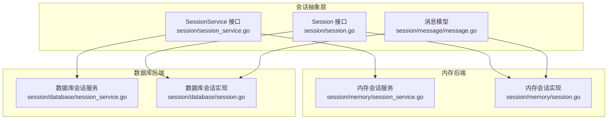
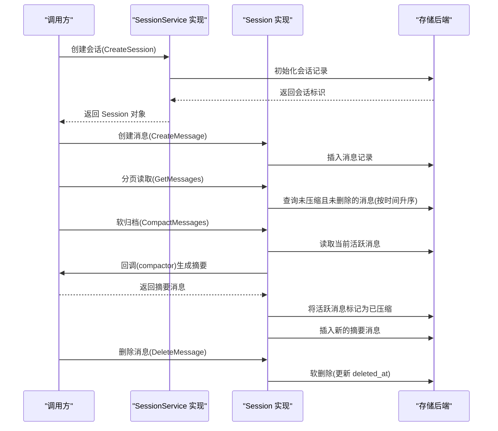
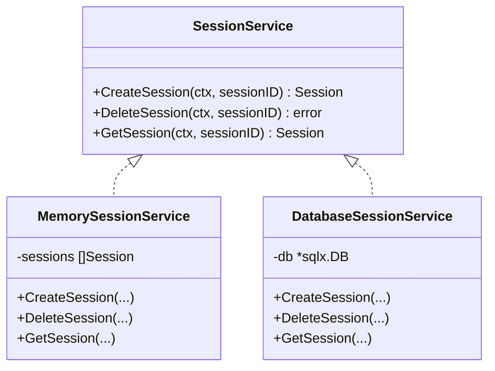
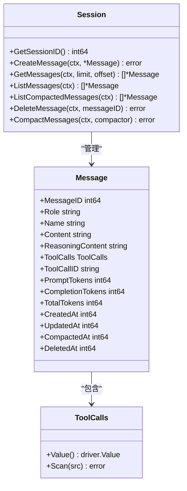
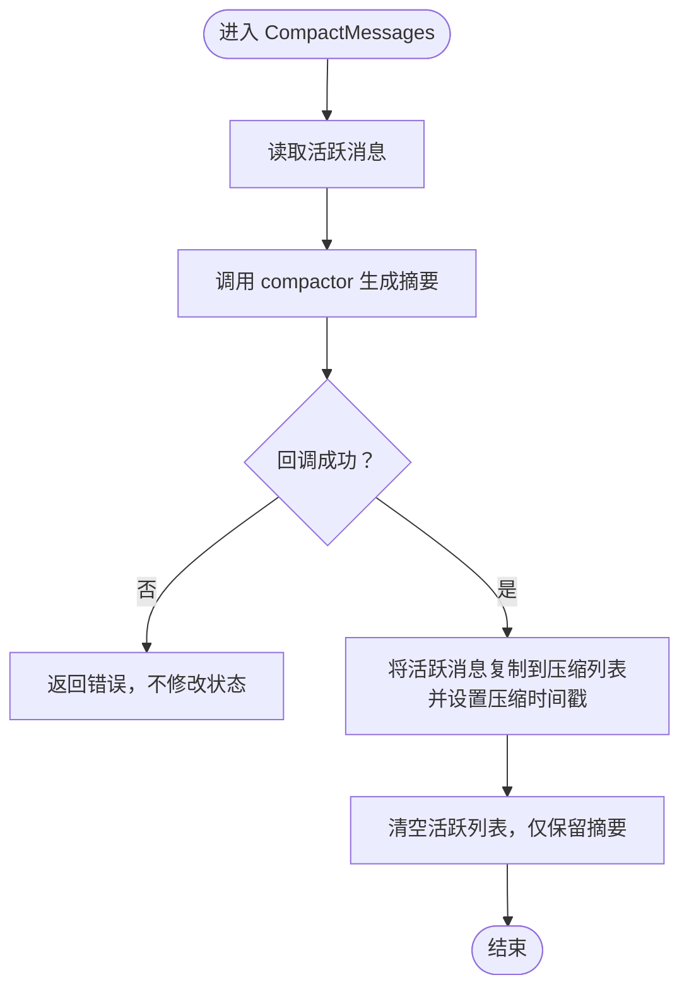
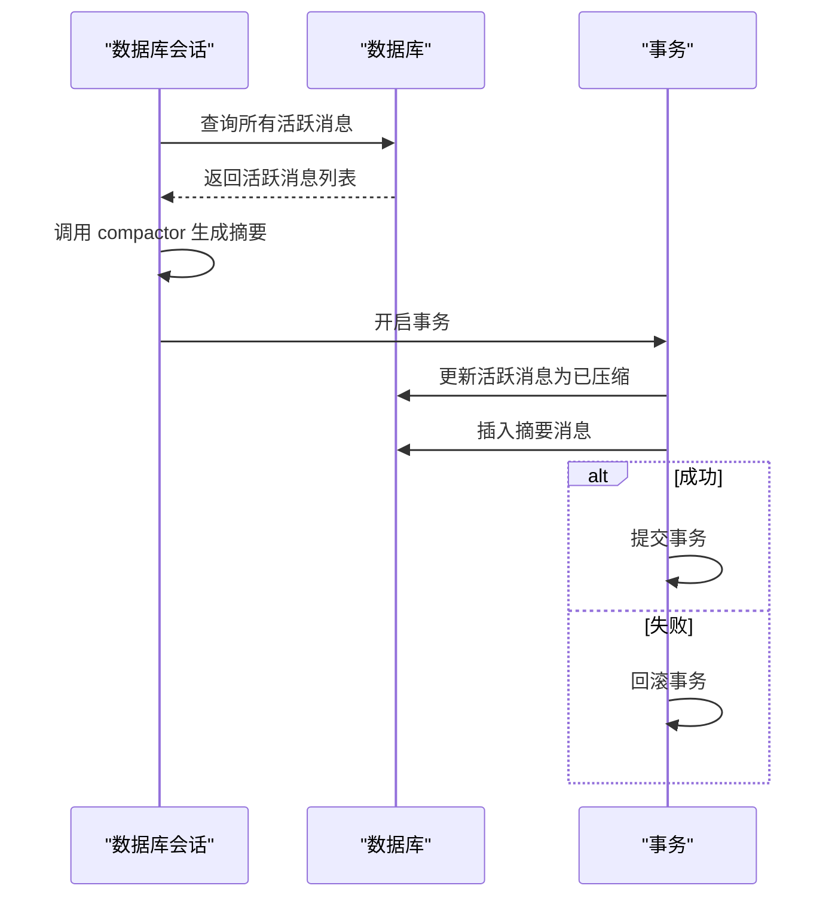
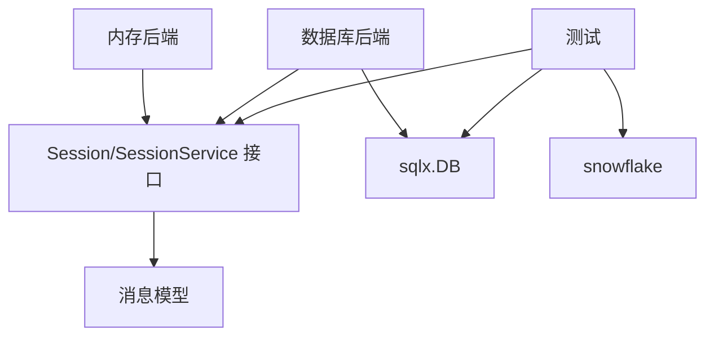

# 会话后端扩展

<cite>
**本文引用的文件**
- [session/session_service.go](file://session/session_service.go)
- [session/session.go](file://session/session.go)
- [session/message/message.go](file://session/message/message.go)
- [session/memory/session_service.go](file://session/memory/session_service.go)
- [session/memory/session.go](file://session/memory/session.go)
- [session/database/session_service.go](file://session/database/session_service.go)
- [session/database/session.go](file://session/database/session.go)
- [session/database/session_test.go](file://session/database/session_test.go)
- [session/memory/session_test.go](file://session/memory/session_test.go)
- [session/database/session_service_test.go](file://session/database/session_service_test.go)
- [internal/snowflake/snowflake.go](file://internal/snowflake/snowflake.go)
- [go.mod](file://go.mod)
</cite>

## 目录
1. [简介](#简介)
2. [项目结构](#项目结构)
3. [核心组件](#核心组件)
4. [架构总览](#架构总览)
5. [详细组件分析](#详细组件分析)
6. [依赖分析](#依赖分析)
7. [性能考量](#性能考量)
8. [故障排查指南](#故障排查指南)
9. [结论](#结论)
10. [附录：新存储后端开发流程与最佳实践](#附录新存储后端开发流程与最佳实践)

## 简介
本指南面向需要为会话系统开发“新存储后端”的工程师，系统讲解 SessionService 接口的设计原理与实现要求，对比内存后端与数据库后端在会话创建、消息存储/检索/删除、软归档（压缩/汇总）等机制上的差异，并给出新后端的开发流程、数据模型设计、索引优化建议、迁移与版本管理策略、测试方法与运维注意事项。文档同时提供可直接映射到仓库源码的架构图与流程图，帮助快速落地。

## 项目结构
会话子系统采用“接口抽象 + 多后端实现”的分层设计：
- 抽象层：定义 Session 与 SessionService 接口，统一会话生命周期与消息操作契约
- 内存后端：基于内存切片，适合测试与低延迟场景
- 数据库后端：基于 SQL 存储，支持软删除、软归档与事务一致性
- 消息模型：定义消息字段与 JSON 序列化/反序列化规则
- 测试：覆盖消息 CRUD、分页、软归档、多轮归档、服务层工作流等

图表来源
- [session/session_service.go:1-10](file://session/session_service.go#L1-L10)
- [session/session.go:1-24](file://session/session.go#L1-L24)
- [session/message/message.go:1-129](file://session/message/message.go#L1-L129)
- [session/memory/session_service.go:1-41](file://session/memory/session_service.go#L1-L41)
- [session/memory/session.go:1-86](file://session/memory/session.go#L1-L86)
- [session/database/session_service.go:1-49](file://session/database/session_service.go#L1-L49)
- [session/database/session.go:1-146](file://session/database/session.go#L1-L146)

章节来源
- [session/session_service.go:1-10](file://session/session_service.go#L1-L10)
- [session/session.go:1-24](file://session/session.go#L1-L24)
- [session/message/message.go:1-129](file://session/message/message.go#L1-L129)
- [session/memory/session_service.go:1-41](file://session/memory/session_service.go#L1-L41)
- [session/memory/session.go:1-86](file://session/memory/session.go#L1-L86)
- [session/database/session_service.go:1-49](file://session/database/session_service.go#L1-L49)
- [session/database/session.go:1-146](file://session/database/session.go#L1-L146)

## 核心组件
- SessionService 接口：定义会话的创建、删除、查询能力，作为上层业务与具体后端的唯一入口
- Session 接口：定义消息的创建、分页读取、全量读取、软归档、删除等能力；消息按“未压缩/已压缩”两类组织
- Message 模型：定义消息字段及 JSON 序列化/反序列化逻辑，支持工具调用列表等复杂字段

章节来源
- [session/session_service.go:5-9](file://session/session_service.go#L5-L9)
- [session/session.go:9-23](file://session/session.go#L9-L23)
- [session/message/message.go:49-129](file://session/message/message.go#L49-L129)

## 架构总览
下图展示了“服务层 → 会话层 → 数据层”的调用链路，以及内存与数据库两种实现的差异点。

图表来源
- [session/session_service.go:5-9](file://session/session_service.go#L5-L9)
- [session/session.go:9-23](file://session/session.go#L9-L23)
- [session/database/session.go:14-24](file://session/database/session.go#L14-L24)
- [session/database/session.go:97-145](file://session/database/session.go#L97-L145)

## 详细组件分析

### SessionService 接口与实现
- 设计原则
  - 统一抽象：通过接口屏蔽不同后端的差异
  - 明确职责：仅负责“会话级”对象的创建/删除/查询，不直接暴露消息细节
- 实现要点
  - 内存实现：维护会话切片，线性查找/删除
  - 数据库实现：使用 SQL 表达式进行查询/更新；删除采用软删除（设置 deleted_at）

图表来源
- [session/session_service.go:5-9](file://session/session_service.go#L5-L9)
- [session/memory/session_service.go:10-16](file://session/memory/session_service.go#L10-L16)
- [session/database/session_service.go:19-25](file://session/database/session_service.go#L19-L25)

章节来源
- [session/session_service.go:5-9](file://session/session_service.go#L5-L9)
- [session/memory/session_service.go:10-40](file://session/memory/session_service.go#L10-L40)
- [session/database/session_service.go:19-48](file://session/database/session_service.go#L19-L48)

### Session 接口与消息模型
- Session 接口能力
  - 消息创建/删除：支持软删除（deleted_at）
  - 消息读取：分页读取（GetMessages）、全量读取（ListMessages）
  - 软归档：将活跃消息标记为已压缩（compacted_at），插入摘要消息
  - 压缩历史读取：列出已压缩的历史消息
- 消息模型
  - 包含角色、名称、内容、推理内容、工具调用列表、Token 使用统计等
  - 工具调用列表以 JSON 字符串形式持久化，实现 driver.Valuer/Scanner

图表来源
- [session/session.go:9-23](file://session/session.go#L9-L23)
- [session/message/message.go:49-129](file://session/message/message.go#L49-L129)

章节来源
- [session/session.go:9-23](file://session/session.go#L9-L23)
- [session/message/message.go:11-129](file://session/message/message.go#L11-L129)

### 内存后端实现
- 会话存储：切片数组，按 sessionID 查找
- 消息存储：两个切片分别保存“活跃消息”和“已压缩消息”
- 软归档：回调生成摘要，将活跃消息复制到压缩切片并清空，保留摘要
- 并发：未做并发保护，适合单线程或外部同步控制

图表来源
- [session/memory/session.go:70-85](file://session/memory/session.go#L70-L85)

章节来源
- [session/memory/session_service.go:10-40](file://session/memory/session_service.go#L10-L40)
- [session/memory/session.go:12-85](file://session/memory/session.go#L12-L85)

### 数据库后端实现
- 会话表：记录 session_id、创建/更新/删除时间
- 消息表：记录消息字段与软删除/软归档标志位
- 查询策略
  - GetMessages/ListMessages：过滤 deleted_at=0 且 compacted_at=0，按 created_at 升序
  - ListCompactedMessages：过滤 compacted_at>0 且 deleted_at=0
- 软归档
  - 事务内执行：先将活跃消息标记为已压缩，再插入新的摘要消息
  - 回调失败时回滚，保证一致性

图表来源
- [session/database/session.go:97-145](file://session/database/session.go#L97-L145)

章节来源
- [session/database/session_service.go:14-48](file://session/database/session_service.go#L14-L48)
- [session/database/session.go:14-24](file://session/database/session.go#L14-L24)
- [session/database/session.go:97-145](file://session/database/session.go#L97-L145)

### 消息持久化策略与数据模型
- 字段设计
  - 角色/名称/内容/推理内容：文本字段
  - 工具调用：JSON 文本存储，实现 driver.Valuer/Scanner
  - Token 统计：Prompt/Completion/Total
  - 时间戳：Created/Updated/Compacted/Deleted
- 软删除/软归档
  - deleted_at=0 表示未删除；非零表示已删除
  - compacted_at=0 表示未压缩；非零表示压缩时间戳
- 索引建议
  - 消息表：按 (deleted_at, compacted_at, created_at) 组合索引，支持高效分页与归档扫描
  - 会话表：按 session_id 主键索引

章节来源
- [session/message/message.go:11-129](file://session/message/message.go#L11-L129)
- [session/database/session.go:14-24](file://session/database/session.go#L14-L24)

### 并发与一致性
- 内存后端：无内置并发安全；建议在上层加锁或单线程调度
- 数据库后端：通过事务保证软归档原子性；软删除避免数据丢失

章节来源
- [session/database/session.go:112-145](file://session/database/session.go#L112-L145)

### 性能与容量
- 内存后端：O(n) 查找/删除，适合小规模、低延迟场景
- 数据库后端：分页查询与事务写入，适合大规模与高可用场景

章节来源
- [session/memory/session_service.go:24-32](file://session/memory/session_service.go#L24-L32)
- [session/database/session.go:70-95](file://session/database/session.go#L70-L95)

## 依赖分析
- 外部依赖
  - sqlx：数据库访问与事务管理
  - sqlite3：测试数据库驱动
  - testify：断言与测试框架
  - snowflake：分布式 ID 生成器（测试中用于构造 sessionID）
- 模块耦合
  - 后端实现仅依赖抽象接口与消息模型，耦合度低，便于替换

图表来源
- [go.mod:5-15](file://go.mod#L5-L15)
- [session/database/session_service.go:3-12](file://session/database/session_service.go#L3-L12)
- [session/memory/session_service.go:3-8](file://session/memory/session_service.go#L3-L8)
- [internal/snowflake/snowflake.go:17-57](file://internal/snowflake/snowflake.go#L17-L57)

章节来源
- [go.mod:5-15](file://go.mod#L5-L15)
- [session/database/session_service.go:3-12](file://session/database/session_service.go#L3-L12)
- [session/memory/session_service.go:3-8](file://session/memory/session_service.go#L3-L8)
- [internal/snowflake/snowflake.go:17-57](file://internal/snowflake/snowflake.go#L17-L57)

## 性能考量
- 内存后端
  - 优点：极低延迟，适合短对话与测试
  - 缺点：无法跨进程/实例共享，容量受限
- 数据库后端
  - 优点：持久化、可扩展、事务一致
  - 优化：合理索引、批量写入、分页参数调优、连接池配置
- 归档策略
  - 定期触发 Soft Compact，降低活跃消息数量，提升查询性能

[本节为通用指导，无需引用具体文件]

## 故障排查指南
- 服务层问题
  - 会话不存在：GetSession 返回空；检查 sessionID 是否正确
  - 删除无效：确认 deleted_at 条件是否匹配
- 会话层问题
  - 归档失败：检查回调是否返回错误；数据库后端应自动回滚
  - 分页异常：核对 limit/offset 与 created_at 排序
- 测试参考
  - 数据库后端：覆盖创建/删除/分页/归档/多轮归档/回调错误等场景
  - 内存后端：同上，但不涉及持久化

章节来源
- [session/database/session_service_test.go:13-162](file://session/database/session_service_test.go#L13-L162)
- [session/database/session_test.go:63-364](file://session/database/session_test.go#L63-L364)
- [session/memory/session_test.go:23-293](file://session/memory/session_test.go#L23-L293)

## 结论
通过抽象接口与多后端实现，会话系统实现了“行为一致、存储可插拔”。内存后端适合测试与低延迟场景，数据库后端适合生产环境的持久化与一致性需求。遵循本文的开发流程、数据模型与测试方法，可快速扩展新的存储后端并保障质量与性能。

[本节为总结，无需引用具体文件]

## 附录：新存储后端开发流程与最佳实践

### 1. 接口实现步骤
- 实现 SessionService
  - CreateSession：返回后端特定的 Session 实例
  - GetSession：根据 sessionID 查询并返回 Session
  - DeleteSession：软删除或物理删除（建议软删除）
- 实现 Session
  - CreateMessage/DeleteMessage：实现消息的持久化与软删除
  - GetMessages/ListMessages：实现分页与全量读取
  - ListCompactedMessages：实现压缩历史读取
  - CompactMessages：实现软归档（事务内完成标记与插入摘要）

章节来源
- [session/session_service.go:5-9](file://session/session_service.go#L5-L9)
- [session/session.go:9-23](file://session/session.go#L9-L23)

### 2. 数据模型设计与索引优化
- 必备字段
  - 会话：session_id、created_at、updated_at、deleted_at
  - 消息：message_id、role、name、content、reasoning_content、tool_calls、tool_call_id、prompt_tokens、completion_tokens、total_tokens、created_at、updated_at、compacted_at、deleted_at
- 索引建议
  - 消息表：(deleted_at, compacted_at, created_at) 组合索引
  - 会话表：主键索引（session_id）

章节来源
- [session/database/session.go:14-24](file://session/database/session.go#L14-L24)
- [session/message/message.go:49-129](file://session/message/message.go#L49-L129)

### 3. 消息持久化策略
- JSON 序列化：工具调用列表使用 JSON 文本存储，实现 driver.Valuer/Scanner
- 软删除/软归档：通过 deleted_at/compacted_at 字段实现，避免物理删除带来的不可逆风险

章节来源
- [session/message/message.go:19-47](file://session/message/message.go#L19-L47)

### 4. 迁移与版本管理
- 版本化迁移
  - 为新增字段或索引准备迁移脚本，确保向后兼容
  - 在应用启动时执行迁移检查与升级
- 数据一致性
  - 归档与删除操作必须在事务内完成，失败即回滚
- 兼容性测试
  - 新旧版本共存期间，确保读取路径兼容旧格式字段

[本节为通用指导，无需引用具体文件]

### 5. 扩展开发的测试方法
- 单元测试
  - 服务层：Create/Get/Delete 工作流、ID 冲突、软删除
  - 会话层：消息 CRUD、分页、软归档、多轮归档、回调错误
- 集成测试
  - 使用内存数据库（如 SQLite）模拟真实 SQL 行为
  - 覆盖事务、并发、边界条件
- 性能基准测试
  - 生成大量消息，测量分页、归档、删除的吞吐与延迟
  - 对比内存与数据库后端在不同数据规模下的表现

章节来源
- [session/database/session_service_test.go:13-162](file://session/database/session_service_test.go#L13-L162)
- [session/database/session_test.go:63-364](file://session/database/session_test.go#L63-L364)
- [session/memory/session_test.go:23-293](file://session/memory/session_test.go#L23-L293)
- [internal/snowflake/snowflake.go:17-57](file://internal/snowflake/snowflake.go#L17-L57)

### 6. 部署与运维考虑
- 连接池与超时
  - 设置合理的最大连接数、空闲连接数与查询超时
- 监控与告警
  - 监控数据库慢查询、事务冲突、归档耗时
- 备份与恢复
  - 定期备份数据库，验证归档数据可恢复性
- 滚动升级
  - 逐步切换后端，观察指标与日志，确保平滑过渡

[本节为通用指导，无需引用具体文件]