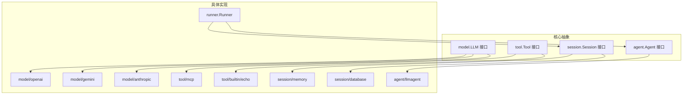
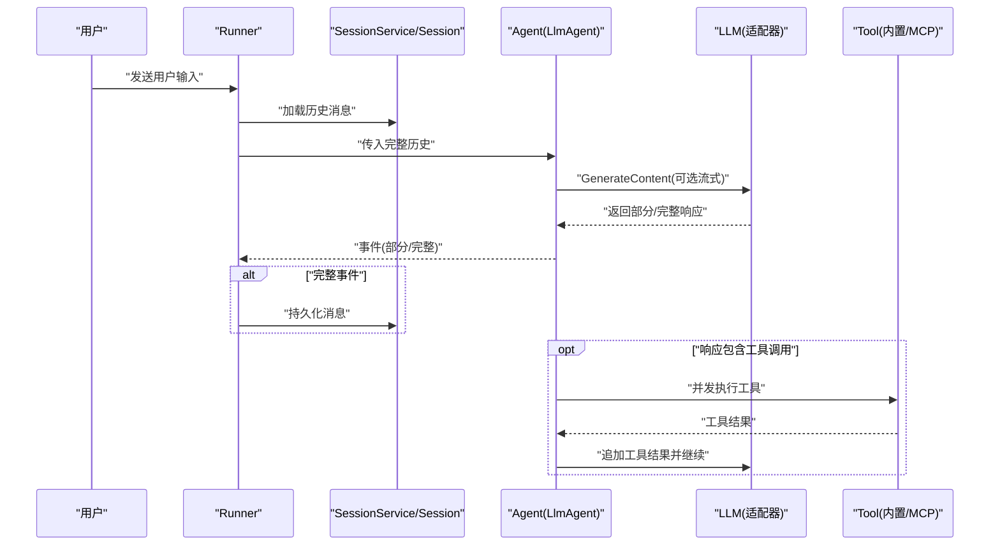
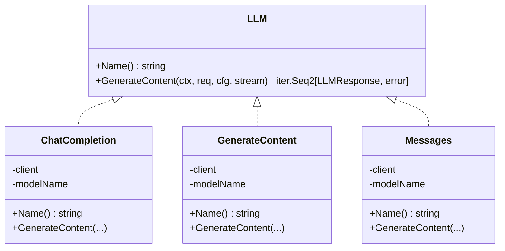
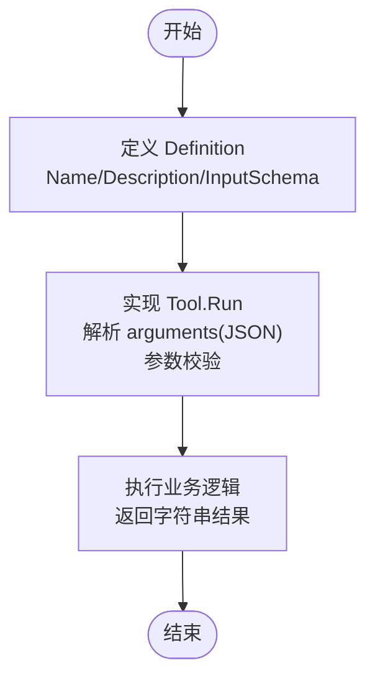
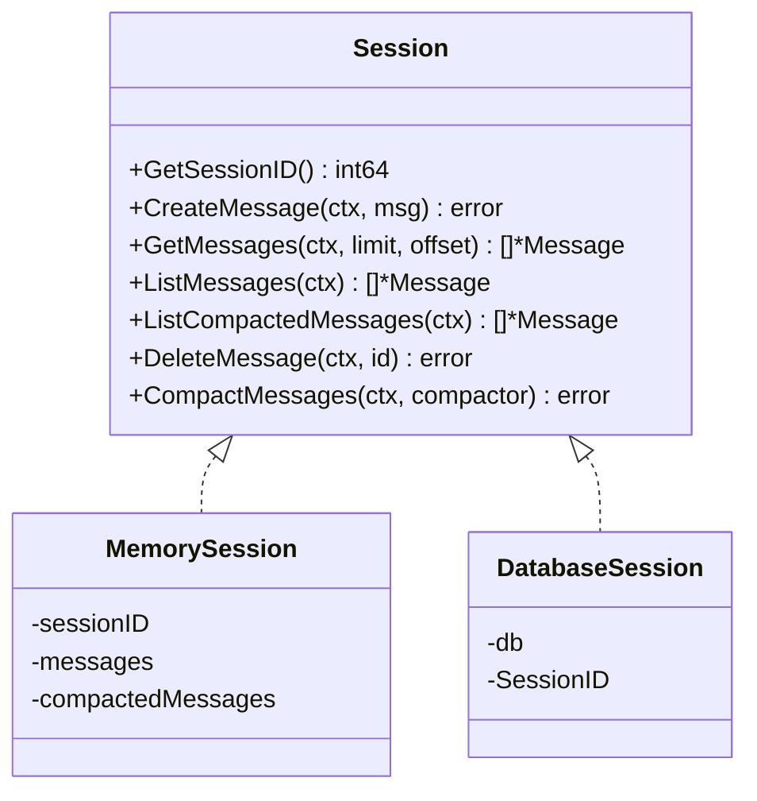
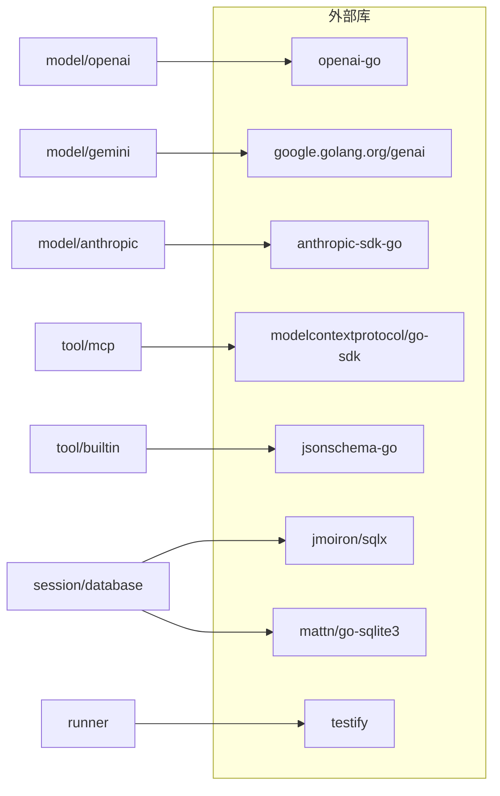

# 扩展开发

<cite>
**本文引用的文件**
- [README.md](file://README.md)
- [model/model.go](file://model/model.go)
- [tool/tool.go](file://tool/tool.go)
- [session/session.go](file://session/session.go)
- [agent/agent.go](file://agent/agent.go)
- [model/openai/openai.go](file://model/openai/openai.go)
- [model/gemini/gemini.go](file://model/gemini/gemini.go)
- [model/anthropic/anthropic.go](file://model/anthropic/anthropic.go)
- [session/memory/session.go](file://session/memory/session.go)
- [session/database/session.go](file://session/database/session.go)
- [tool/builtin/echo.go](file://tool/builtin/echo.go)
- [tool/mcp/mcp.go](file://tool/mcp/mcp.go)
- [agent/llmagent/llmagent.go](file://agent/llmagent/llmagent.go)
- [runner/runner.go](file://runner/runner.go)
- [examples/chat/main.go](file://examples/chat/main.go)
</cite>

## 目录
1. [简介](#简介)
2. [项目结构](#项目结构)
3. [核心组件](#核心组件)
4. [架构总览](#架构总览)
5. [详细组件分析](#详细组件分析)
6. [依赖分析](#依赖分析)
7. [性能考虑](#性能考虑)
8. [故障排查指南](#故障排查指南)
9. [结论](#结论)
10. [附录](#附录)

## 简介
本指南面向希望基于 ADK 框架进行扩展开发的工程师，系统讲解如何利用框架的插件化设计，完成以下目标：
- 基于统一的 LLM 接口实现新的大模型适配器（含认证与性能配置）
- 实现自定义工具（含输入参数校验与 JSON Schema 定义）
- 扩展会话后端（新增存储后端与数据模型）
- 理解插件系统设计原则、向后兼容与版本管理策略
- 制定最佳实践（代码组织、测试策略、文档编写）
- 提供可直接参考的扩展示例与社区贡献建议

## 项目结构
ADK 采用“按职责分包”的清晰布局：抽象接口位于顶层模块，具体适配器与扩展在子包中实现。核心目录与职责概览如下：
- agent：抽象 Agent 接口及组合式编排（顺序/并行/代理作为工具）
- model：LLM 抽象接口与消息类型；各厂商适配器（OpenAI、Gemini、Anthropic）
- tool：工具抽象与内置工具、MCP 工具桥接
- session：会话抽象与内存/数据库两种后端
- runner：连接 Agent 与 SessionService 的运行器
- examples：示例程序，演示集成与 MCP 工具接入
- internal：内部工具（如雪花 ID）

图表来源
- [agent/agent.go:10-19](file://agent/agent.go#L10-L19)
- [model/model.go:11-18](file://model/model.go#L11-L18)
- [tool/tool.go:17-23](file://tool/tool.go#L17-L23)
- [session/session.go:9-23](file://session/session.go#L9-L23)
- [model/openai/openai.go:19-42](file://model/openai/openai.go#L19-L42)
- [model/gemini/gemini.go:17-64](file://model/gemini/gemini.go#L17-L64)
- [model/anthropic/anthropic.go:25-45](file://model/anthropic/anthropic.go#L25-L45)
- [tool/mcp/mcp.go:15-80](file://tool/mcp/mcp.go#L15-L80)
- [tool/builtin/echo.go:14-47](file://tool/builtin/echo.go#L14-L47)
- [session/memory/session.go:12-24](file://session/memory/session.go#L12-L24)
- [session/database/session.go:26-41](file://session/database/session.go#L26-L41)
- [runner/runner.go:17-37](file://runner/runner.go#L17-L37)
- [agent/llmagent/llmagent.go:30-46](file://agent/llmagent/llmagent.go#L30-L46)

章节来源
- [README.md:67-89](file://README.md#L67-L89)

## 核心组件
- LLM 抽象接口：统一不同厂商的调用方式，屏蔽差异，支持流式与非流式响应、工具调用、思考能力与服务等级等配置。
- Agent 抽象接口：以事件序列的方式驱动对话，支持流式增量输出与工具调用循环。
- 工具接口：通过 Definition 暴露名称、描述与 JSON Schema 输入参数，Run 方法执行工具逻辑。
- 会话接口：抽象消息持久化、分页读取、软归档（压缩）与删除。
- Runner：负责加载历史、追加用户输入、转发事件、区分部分/完整事件并仅持久化完整消息。

章节来源
- [model/model.go:11-227](file://model/model.go#L11-L227)
- [agent/agent.go:10-19](file://agent/agent.go#L10-L19)
- [tool/tool.go:9-23](file://tool/tool.go#L9-L23)
- [session/session.go:9-23](file://session/session.go#L9-L23)
- [runner/runner.go:17-108](file://runner/runner.go#L17-L108)

## 架构总览
ADK 将“状态”与“无状态智能体”分离：Runner 负责状态（会话），Agent 仅处理当前轮次的消息与事件流。Agent 通过 LLM 接口与工具集合协作，自动进行工具调用循环，并通过 Runner 将完整消息写回会话。

图表来源
- [runner/runner.go:39-95](file://runner/runner.go#L39-L95)
- [agent/llmagent/llmagent.go:56-136](file://agent/llmagent/llmagent.go#L56-L136)
- [model/model.go:11-227](file://model/model.go#L11-L227)
- [tool/tool.go:17-23](file://tool/tool.go#L17-L23)

## 详细组件分析

### 新 LLM 适配器开发指南
目标：实现一个新的 model.LLM 适配器，覆盖接口契约、认证配置与性能优化。

- 接口实现要点
  - 必须实现 Name() 返回模型标识；GenerateContent(ctx, req, cfg, stream) 返回 Go 迭代器。
  - 支持 Partial/TurnComplete 标记，以便 Runner 区分流式片段与完整消息。
  - 正确映射 FinishReason、TokenUsage、多模态内容（文本/图片）与工具调用。
  - 参考现有适配器的消息转换与工具声明映射方式。

- 认证与配置
  - OpenAI：支持 API Key 与可选 BaseURL（兼容其他 OpenAI 兼容服务）。
  - Gemini：支持开发者 API 与 Vertex AI（应用默认凭据或服务账号）。
  - Anthropic：使用 SDK 默认凭据注入。
  - 性能配置：温度、最大生成长度、推理努力级别、服务等级、思考预算与开关等，需映射到对应 SDK 参数。

- 流式与非流式
  - 非流式：一次返回完整响应；设置 TurnComplete=true。
  - 流式：先多次返回 Partial=true 的增量片段，最后返回 TurnComplete=true 的完整响应。

- 多模态与工具
  - 用户消息支持文本与图片（URL/Base64），助手消息支持工具调用与思考签名。
  - 工具输入参数通过 JSON Schema 描述，SDK 侧进行参数校验与调用。

- 示例参考
  - OpenAI 适配器：消息转换、工具声明、配置映射、流式拼接与最终组装。
  - Gemini 适配器：系统指令提取、连续工具结果批处理、思考内容与函数调用合并。
  - Anthropic 适配器：系统提示与工具声明映射、思考配置与默认预算。

图表来源
- [model/model.go:11-18](file://model/model.go#L11-L18)
- [model/openai/openai.go:19-42](file://model/openai/openai.go#L19-L42)
- [model/gemini/gemini.go:17-64](file://model/gemini/gemini.go#L17-L64)
- [model/anthropic/anthropic.go:25-45](file://model/anthropic/anthropic.go#L25-L45)

章节来源
- [model/openai/openai.go:44-164](file://model/openai/openai.go#L44-L164)
- [model/gemini/gemini.go:66-201](file://model/gemini/gemini.go#L66-L201)
- [model/anthropic/anthropic.go:47-93](file://model/anthropic/anthropic.go#L47-L93)
- [model/model.go:67-227](file://model/model.go#L67-L227)

### 自定义工具实现指南
目标：从接口定义到参数校验，完整实现一个可被 LLM 调用的工具。

- 接口与元数据
  - Definition 包含 Name、Description、InputSchema（JSON Schema）。
  - Run(ctx, toolCallID, arguments) 返回字符串结果；arguments 为 JSON 字符串，需反序列化为结构体后校验。

- 输入参数校验
  - 使用 JSON Schema 自动生成结构体校验；确保必填字段、类型与约束满足。
  - 对异常输入返回错误信息，便于上层 Agent 汇总并反馈给 LLM。

- 并发与稳定性
  - LlmAgent 在工具调用阶段并发执行，注意工具内部的幂等性与资源竞争。
  - 对外部依赖（网络/数据库）增加超时与重试策略。

- 内置工具与 MCP 工具
  - 内置工具：以 echo 为例，展示 Schema 生成、参数解析与执行。
  - MCP 工具：动态发现远端工具，封装为 tool.Tool，调用时转发至 MCP 会话。

图表来源
- [tool/tool.go:9-23](file://tool/tool.go#L9-L23)
- [tool/builtin/echo.go:18-46](file://tool/builtin/echo.go#L18-L46)
- [tool/mcp/mcp.go:46-110](file://tool/mcp/mcp.go#L46-L110)

章节来源
- [tool/tool.go:9-23](file://tool/tool.go#L9-L23)
- [tool/builtin/echo.go:18-46](file://tool/builtin/echo.go#L18-L46)
- [tool/mcp/mcp.go:46-110](file://tool/mcp/mcp.go#L46-L110)

### 会话后端扩展指南
目标：实现新的存储后端与数据模型，保持与现有 Session 接口一致。

- 接口契约
  - GetSessionID、CreateMessage、DeleteMessage、GetMessages（分页）、ListMessages、ListCompactedMessages、CompactMessages。
  - CompactMessages 支持“软归档”：将旧消息标记为已归档而非物理删除。

- 数据模型
  - 内存后端：基于切片的线程安全（示例未加锁，适合单线程/单进程场景）。
  - 数据库后端：使用 sqlx 访问 SQLite，维护 sessions/messages 表，支持归档与查询。

- 扩展步骤
  - 实现 session.Session 接口；在 SessionService 层创建会话实例。
  - 确保消息 ID、时间戳、TokenUsage 等字段正确映射。
  - 编写迁移脚本与索引，保证查询效率与一致性。

图表来源
- [session/session.go:9-23](file://session/session.go#L9-L23)
- [session/memory/session.go:12-86](file://session/memory/session.go#L12-L86)
- [session/database/session.go:26-146](file://session/database/session.go#L26-L146)

章节来源
- [session/memory/session.go:12-86](file://session/memory/session.go#L12-L86)
- [session/database/session.go:26-146](file://session/database/session.go#L26-L146)
- [session/session.go:9-23](file://session/session.go#L9-L23)

### 插件系统设计原理与兼容性
- 设计原则
  - 接口优先：所有扩展均围绕抽象接口实现，避免耦合具体实现。
  - 组合优于继承：Agent 通过组合多个适配器与工具工作；Runner 仅依赖抽象。
  - 向后兼容：新增适配器/工具不破坏既有接口；配置项尽量可选且有合理默认值。
  - 版本管理：通过模块路径与 Go 版本要求约束依赖；对外暴露的接口保持稳定。

- 兼容性策略
  - LLM 接口的 GenerateContent 与 Event/LLMResponse 结构保持稳定，便于新增适配器。
  - 工具接口的 Definition 与 Run 不变，新增工具无需修改 Agent/Runner。
  - 会话接口的 CompactMessages 语义明确，新增后端只需遵循“软归档”约定。

章节来源
- [README.md:37-66](file://README.md#L37-L66)
- [model/model.go:11-227](file://model/model.go#L11-L227)
- [tool/tool.go:9-23](file://tool/tool.go#L9-L23)
- [session/session.go:9-23](file://session/session.go#L9-L23)

### 最佳实践
- 代码组织
  - 按包划分：适配器放于 model 下，工具放于 tool 下，后端放于 session 下。
  - 单一职责：每个适配器/工具只做一件事，复杂逻辑拆分为辅助函数。
- 测试策略
  - 单元测试：针对消息转换、工具参数解析、配置映射等关键路径。
  - 集成测试：结合 Runner 与 SessionService，验证完整对话链路。
  - 压测：评估流式输出、工具并发与数据库写入的性能瓶颈。
- 文档编写
  - README 中补充适配器/工具的安装与使用说明。
  - 为 Definition 的 InputSchema 提供示例输入与预期输出。
  - 记录认证方式、环境变量与配置项的含义与默认值。

## 依赖分析
- 外部依赖
  - OpenAI/Gemini/Anthropic SDK 用于具体厂商 API 调用。
  - MCP SDK 用于连接任意 MCP 服务器并动态暴露其工具。
  - jsonschema-go 用于工具输入参数的 JSON Schema 生成与校验。
  - sqlx 与 sqlite3 用于数据库后端。
  - testify 用于断言与测试。
- 内部依赖
  - runner 依赖 agent 与 session；agent 依赖 model 与 tool；model 与 tool 为纯接口，彼此独立。

图表来源
- [README.md:380-393](file://README.md#L380-L393)
- [model/openai/openai.go:3-17](file://model/openai/openai.go#L3-L17)
- [model/gemini/gemini.go:3-15](file://model/gemini/gemini.go#L3-L15)
- [model/anthropic/anthropic.go:3-16](file://model/anthropic/anthropic.go#L3-L16)
- [tool/mcp/mcp.go:3-13](file://tool/mcp/mcp.go#L3-L13)
- [session/database/session.go:3-12](file://session/database/session.go#L3-L12)

章节来源
- [README.md:380-393](file://README.md#L380-L393)

## 性能考虑
- 流式输出
  - 适配器应尽可能早地产出 Partial 响应，降低端到端延迟。
  - Runner 仅在完整事件时持久化，避免频繁写入。
- 工具并发
  - LlmAgent 并发执行工具调用，注意工具内部的限流与超时。
- 存储优化
  - 数据库后端使用分页查询与软归档，减少单次查询量。
  - 合理索引（created_at、compacted_at、deleted_at）提升查询性能。
- 配置调优
  - 温度、最大令牌数、推理努力级别与服务等级直接影响吞吐与成本。
  - 思考预算与开关需与模型能力匹配，避免无效开销。

## 故障排查指南
- 适配器常见问题
  - 消息角色/内容映射错误：检查 convertMessages/convertUserParts/convertAssistantParts。
  - 工具声明缺失：确认 convertTools 是否正确序列化 InputSchema。
  - 流式拼接异常：关注 delta 累积与最终组装逻辑。
- 工具常见问题
  - 参数解析失败：核对 JSON Schema 与 arguments 结构是否一致。
  - 并发冲突：检查工具内部状态共享与资源竞争。
- 会话常见问题
  - 归档后历史丢失：确认软归档逻辑与查询条件。
  - 数据库事务失败：检查事务提交与回滚路径。

章节来源
- [model/openai/openai.go:166-277](file://model/openai/openai.go#L166-L277)
- [model/gemini/gemini.go:203-351](file://model/gemini/gemini.go#L203-L351)
- [model/anthropic/anthropic.go:95-240](file://model/anthropic/anthropic.go#L95-L240)
- [tool/builtin/echo.go:40-46](file://tool/builtin/echo.go#L40-L46)
- [session/database/session.go:97-145](file://session/database/session.go#L97-L145)

## 结论
ADK 通过清晰的抽象与插件化设计，为扩展开发提供了高内聚、低耦合的扩展点。遵循本文指南，您可以：
- 快速实现新的 LLM 适配器，覆盖认证与性能配置；
- 规范化构建自定义工具，确保参数校验与并发安全；
- 扩展会话后端，兼顾性能与可维护性；
- 保持向后兼容与版本演进，降低升级成本；
- 以测试与文档保障质量，推动社区贡献与生态繁荣。

## 附录
- 快速开始示例
  - Chat 示例展示了如何集成 OpenAI、MCP 工具与内存会话，适合快速上手与调试。
- 社区贡献
  - 提交新适配器/工具/后端前，请完善单元测试、集成测试与文档说明。
  - 遵循包命名与接口契约，避免破坏既有行为。

章节来源
- [examples/chat/main.go:52-177](file://examples/chat/main.go#L52-L177)
- [README.md:29-399](file://README.md#L29-L399)