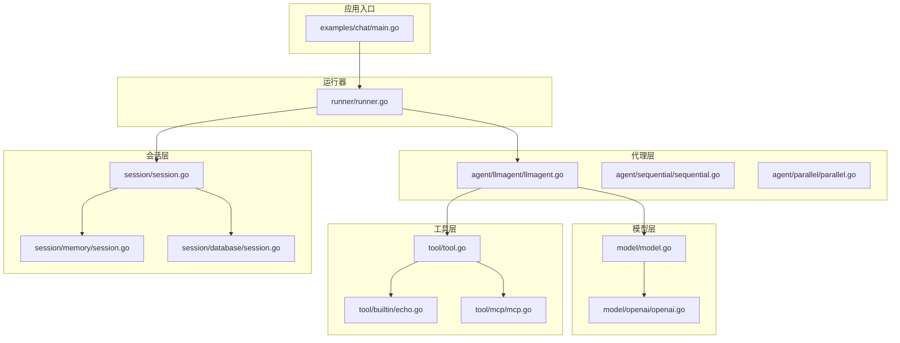
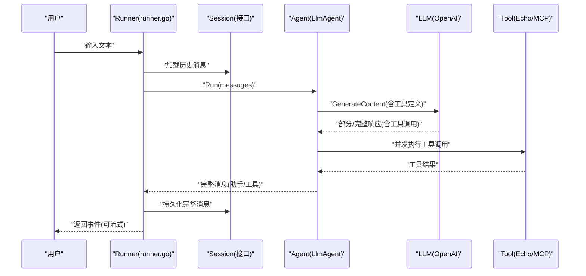
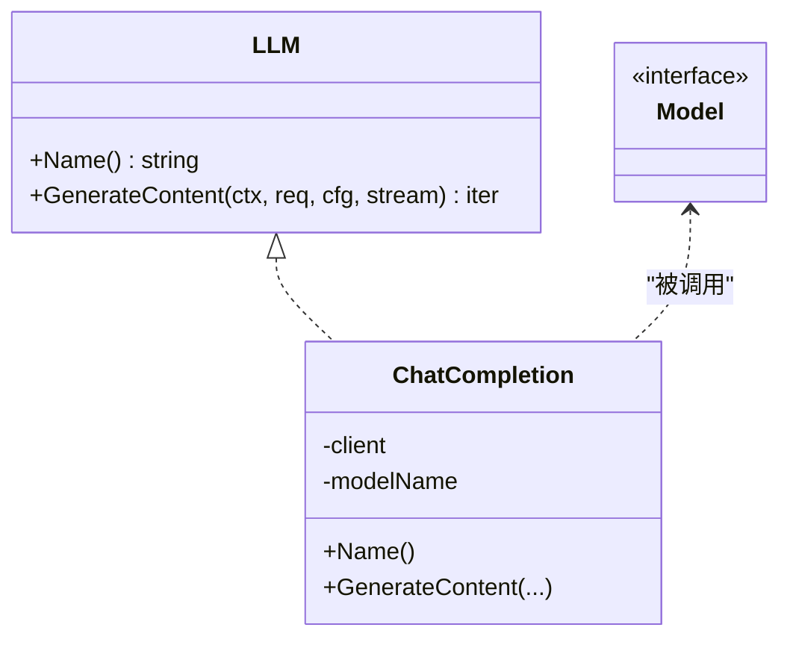
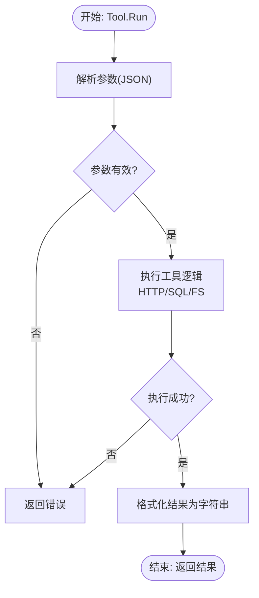
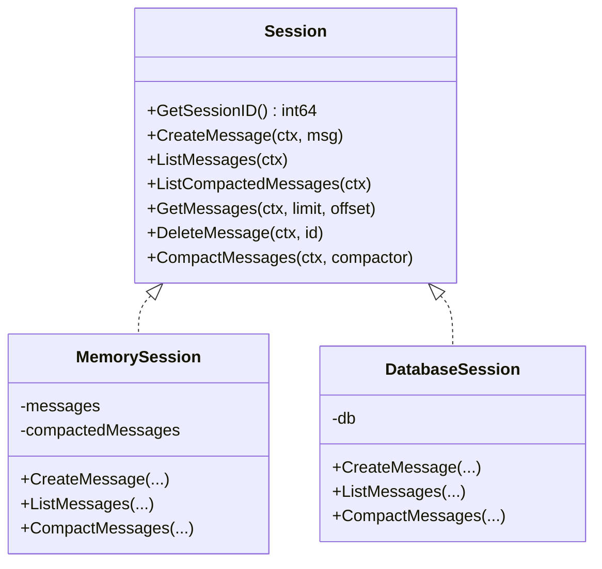
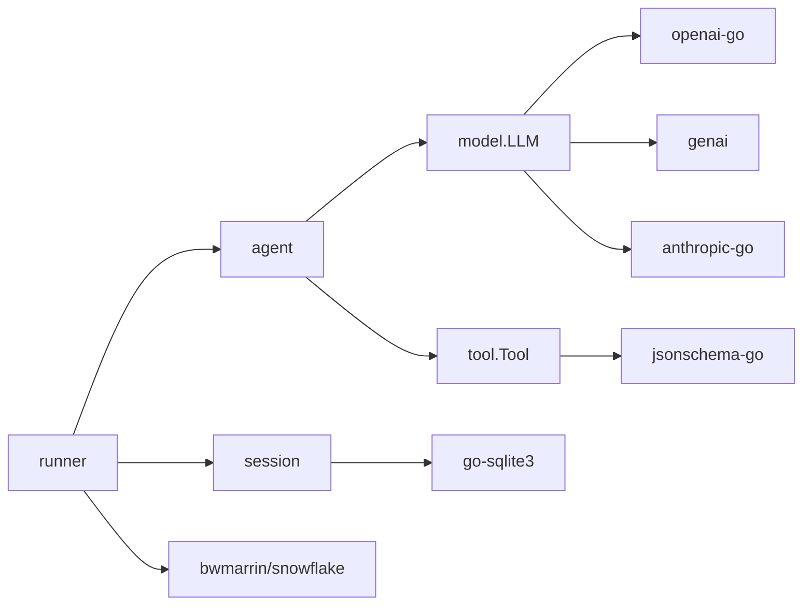

# 扩展示例与实践

<cite>
**本文引用的文件**
- [README.md](file://README.md)
- [examples/chat/main.go](file://examples/chat/main.go)
- [agent/agent.go](file://agent/agent.go)
- [agent/llmagent/llmagent.go](file://agent/llmagent/llmagent.go)
- [agent/sequential/sequential.go](file://agent/sequential/sequential.go)
- [agent/parallel/parallel.go](file://agent/parallel/parallel.go)
- [model/model.go](file://model/model.go)
- [model/openai/openai.go](file://model/openai/openai.go)
- [session/session.go](file://session/session.go)
- [session/memory/session.go](file://session/memory/session.go)
- [session/database/session.go](file://session/database/session.go)
- [tool/tool.go](file://tool/tool.go)
- [tool/builtin/echo.go](file://tool/builtin/echo.go)
- [tool/mcp/mcp.go](file://tool/mcp/mcp.go)
- [runner/runner.go](file://runner/runner.go)
</cite>

## 目录
1. [简介](#简介)
2. [项目结构](#项目结构)
3. [核心组件](#核心组件)
4. [架构总览](#架构总览)
5. [详细组件分析](#详细组件分析)
6. [依赖分析](#依赖分析)
7. [性能考虑](#性能考虑)
8. [故障排查指南](#故障排查指南)
9. [结论](#结论)
10. [附录](#附录)

## 简介
本文件面向希望在 ADK（Agent Development Kit）之上进行“扩展开源”的工程师与架构师，系统性地给出以下实践指南与示例路径：
- 完整的 LLM 适配器实现案例：从最简单的 Echo 工具到真实第三方 API（如 OpenAI、Gemini、Anthropic）的集成。
- 自定义工具开发：REST API 工具、数据库查询工具、文件处理工具的实现思路与最佳实践。
- 会话后端扩展：基于内存、SQLite 的现有实现，以及 Redis 缓存后端、云存储后端、混合存储方案的设计建议。
- 代理扩展：如何创建领域特定的代理类型，如顺序流水线、并行多模型对比、代理作为工具等。
- 项目结构与代码组织：模块化、接口解耦、可插拔设计的最佳实践。
- 性能优化：缓存策略、连接池管理、异步与并发处理的实际案例。
- 调试与故障排除：日志记录、监控指标、错误传播与恢复。

## 项目结构
ADK 采用“接口解耦 + 可插拔适配”的分层设计：
- 模型层（model）：抽象 LLM 接口与消息类型，屏蔽不同供应商差异。
- 代理层（agent）：定义 Agent 接口及多种组合代理（顺序、并行、代理作为工具）。
- 工具层（tool）：统一工具接口与定义，内置 Echo 工具，支持 MCP 工具集桥接。
- 会话层（session）：抽象会话接口，提供内存与 SQLite 后端；可扩展 Redis/云存储。
- 运行器（runner）：协调 Agent 与 SessionService，负责消息持久化与 Snowflake ID 分配。
- 示例（examples）：演示如何将 LLM 与 MCP 工具结合构建聊天代理。



图表来源
- [examples/chat/main.go:1-181](file://examples/chat/main.go#L1-L181)
- [runner/runner.go:1-108](file://runner/runner.go#L1-L108)
- [agent/llmagent/llmagent.go:1-159](file://agent/llmagent/llmagent.go#L1-L159)
- [agent/sequential/sequential.go:1-93](file://agent/sequential/sequential.go#L1-L93)
- [agent/parallel/parallel.go:1-175](file://agent/parallel/parallel.go#L1-L175)
- [model/model.go:1-227](file://model/model.go#L1-L227)
- [model/openai/openai.go:1-362](file://model/openai/openai.go#L1-L362)
- [tool/tool.go:1-24](file://tool/tool.go#L1-L24)
- [tool/builtin/echo.go:1-47](file://tool/builtin/echo.go#L1-L47)
- [tool/mcp/mcp.go:1-121](file://tool/mcp/mcp.go#L1-L121)
- [session/session.go:1-24](file://session/session.go#L1-L24)
- [session/memory/session.go:1-86](file://session/memory/session.go#L1-L86)
- [session/database/session.go:1-146](file://session/database/session.go#L1-L146)

章节来源
- [README.md:67-90](file://README.md#L67-L90)
- [README.md:37-64](file://README.md#L37-L64)

## 核心组件
- Agent 接口：定义名称、描述与 Run 方法（返回增量事件迭代器），支持流式输出与完整消息。
- LLM 接口：统一 GenerateContent（支持非流式与流式）、GenerateConfig 配置项（温度、推理强度、服务等级、最大令牌、思考预算、是否启用思考）。
- Message/Event：消息角色、内容、多模态部件、工具调用、使用量统计、部分/完整事件标记。
- Tool 接口：Definition（名称、描述、输入 JSON Schema）与 Run（执行工具并返回字符串结果）。
- Session 接口：会话生命周期管理（创建、读取、删除、归档压缩、分页列表）。
- Runner：加载历史、追加用户输入、驱动 Agent、按事件类型持久化、分配 Snowflake ID。

章节来源
- [agent/agent.go:10-19](file://agent/agent.go#L10-L19)
- [model/model.go:10-227](file://model/model.go#L10-L227)
- [tool/tool.go:9-24](file://tool/tool.go#L9-L24)
- [session/session.go:9-23](file://session/session.go#L9-L23)
- [runner/runner.go:17-108](file://runner/runner.go#L17-L108)

## 架构总览
ADK 的核心控制流是 Runner 驱动 Agent，Agent 再调用 LLM，LLM 返回消息或工具调用请求，Agent 并发执行工具调用，将工具结果回写为消息，再由 Runner 持久化。



图表来源
- [runner/runner.go:39-96](file://runner/runner.go#L39-L96)
- [agent/llmagent/llmagent.go:56-136](file://agent/llmagent/llmagent.go#L56-L136)
- [model/openai/openai.go:44-164](file://model/openai/openai.go#L44-L164)
- [tool/builtin/echo.go:36-46](file://tool/builtin/echo.go#L36-L46)
- [tool/mcp/mcp.go:92-109](file://tool/mcp/mcp.go#L92-L109)

## 详细组件分析

### LLM 适配器实现案例
- OpenAI 适配器：实现 model.LLM 接口，负责消息与工具参数转换、配置映射（温度、推理强度、服务等级、enable_thinking）、流式与非流式响应组装、FinishReason 映射、TokenUsage 提取。
- 其他供应商（Gemini/Anthropic）：参考 OpenAI 适配器的模式，完成消息/工具转换、配置映射与响应封装。
- 最简单适配器：可直接返回固定响应或 Echo 行为，用于验证 Agent/Runner/Session 集成链路。



图表来源
- [model/model.go:10-18](file://model/model.go#L10-L18)
- [model/openai/openai.go:19-42](file://model/openai/openai.go#L19-L42)

章节来源
- [model/openai/openai.go:44-164](file://model/openai/openai.go#L44-L164)
- [model/openai/openai.go:245-277](file://model/openai/openai.go#L245-L277)
- [model/openai/openai.go:279-304](file://model/openai/openai.go#L279-L304)
- [model/openai/openai.go:306-345](file://model/openai/openai.go#L306-L345)
- [model/openai/openai.go:347-361](file://model/openai/openai.go#L347-L361)

### 自定义工具开发
- 内置 Echo 工具：通过 JSON Schema 定义输入参数，Run 直接回显请求内容，适合验证工具注册与调用链路。
- MCP 工具：连接任意 MCP 服务器，动态发现工具并封装为 tool.Tool，支持错误提取与参数反序列化。
- REST API 工具：建议以 tool.Tool 形式实现，定义输入 Schema，Run 中发起 HTTP 请求，解析响应并返回字符串。
- 数据库查询工具：定义查询语句与参数 Schema，Run 中使用连接池执行 SQL，返回格式化的查询结果。
- 文件处理工具：定义文件路径/内容/编码等参数 Schema，Run 中执行读取/写入/编码转换等操作并返回摘要或结果文本。



图表来源
- [tool/tool.go:17-23](file://tool/tool.go#L17-L23)
- [tool/builtin/echo.go:36-46](file://tool/builtin/echo.go#L36-L46)
- [tool/mcp/mcp.go:92-109](file://tool/mcp/mcp.go#L92-L109)

章节来源
- [tool/builtin/echo.go:14-46](file://tool/builtin/echo.go#L14-L46)
- [tool/mcp/mcp.go:45-72](file://tool/mcp/mcp.go#L45-L72)

### 会话后端扩展
- 内存后端：适合测试与单进程场景，提供活跃消息与归档消息列表、分页读取、归档压缩。
- SQLite 后端：持久化消息与会话，支持事务式归档压缩，保证一致性。
- Redis/云存储/混合方案：建议将热数据放 Redis（TTL、限流、原子操作），冷数据落盘或对象存储；通过 SessionService 抽象实现统一接口，按会话 ID 命中缓存或持久层。



图表来源
- [session/session.go:9-23](file://session/session.go#L9-L23)
- [session/memory/session.go:12-85](file://session/memory/session.go#L12-L85)
- [session/database/session.go:26-145](file://session/database/session.go#L26-L145)

章节来源
- [session/memory/session.go:18-85](file://session/memory/session.go#L18-L85)
- [session/database/session.go:34-145](file://session/database/session.go#L34-L145)

### 代理扩展
- LlmAgent：状态机式工具调用循环，支持流式输出、并发工具执行、工具未找到与错误处理。
- 顺序代理（SequentialAgent）：将多个代理串联，前序代理输出作为后续输入，注入手过户消息，适合研究-撰写-审阅等流水线。
- 并行代理（ParallelAgent）：并发运行多个代理，收集完整消息后合并为单一输出，适合多模型对比或独立任务并行。
- 代理作为工具（Agentool）：将子代理包装为工具，实现任务委派与多级编排。

```mermaid
sequenceDiagram
participant C as "调用方"
participant P as "ParallelAgent"
participant A1 as "Agent#1"
participant A2 as "Agent#2"
C->>P : "Run(messages)"
par P->>A1 : "Run(messages)"
par P->>A2 : "Run(messages)"
A1-->>P : "完整消息序列"
A2-->>P : "完整消息序列"
P->>P : "合并为单一消息"
P-->>C : "完整事件"
```

图表来源
- [agent/parallel/parallel.go:112-174](file://agent/parallel/parallel.go#L112-L174)
- [agent/sequential/sequential.go:46-92](file://agent/sequential/sequential.go#L46-L92)
- [agent/llmagent/llmagent.go:56-136](file://agent/llmagent/llmagent.go#L56-L136)

章节来源
- [agent/llmagent/llmagent.go:30-46](file://agent/llmagent/llmagent.go#L30-L46)
- [agent/llmagent/llmagent.go:78-136](file://agent/llmagent/llmagent.go#L78-L136)
- [agent/sequential/sequential.go:18-41](file://agent/sequential/sequential.go#L18-L41)
- [agent/parallel/parallel.go:70-101](file://agent/parallel/parallel.go#L70-L101)

### 项目结构与代码组织最佳实践
- 分层清晰：model/agent/tool/session/runner 各司其职，接口抽象优先。
- 可插拔：通过接口与工厂函数（如 New）实现适配器与工具的替换。
- 测试友好：每个适配器/工具/后端均提供最小可运行示例（见 examples/chat/main.go）。
- 文档与示例：README 提供快速上手与架构说明，examples 展示真实集成流程。

章节来源
- [README.md:67-90](file://README.md#L67-L90)
- [examples/chat/main.go:52-177](file://examples/chat/main.go#L52-L177)

## 依赖分析
- 外部依赖：OpenAI/Gemini/Anthropic SDK、MCP SDK、JSON Schema、SQLite 驱动、Snowflake ID。
- 内部耦合：Runner 依赖 Agent 与 SessionService；Agent 依赖 LLM 与 Tool；Tool 依赖 JSON Schema；Session 接口被内存/数据库实现。
- 循环依赖：未见循环导入；各包职责单一，耦合度低。



图表来源
- [runner/runner.go:10-15](file://runner/runner.go#L10-L15)
- [model/openai/openai.go:10-16](file://model/openai/openai.go#L10-L16)
- [tool/tool.go:6](file://tool/tool.go#L6)
- [session/database/session.go:5-11](file://session/database/session.go#L5-L11)

章节来源
- [README.md:380-393](file://README.md#L380-L393)

## 性能考虑
- 流式输出：LLM 与 Agent 支持流式片段（Partial=true），Runner 仅持久化完整消息，降低写放大。
- 并发工具执行：LlmAgent 对工具调用使用 WaitGroup 并发执行，提升吞吐。
- 归档压缩：Session 支持软归档（保留摘要），减少历史消息扫描与传输成本。
- 连接池与超时：在自定义 LLM/Tool/Session 实现中，合理设置连接池大小、超时与重试策略。
- 异步处理：Runner 与 Agent 使用迭代器与 goroutine，避免阻塞主流程；并行代理在合并阶段串行化输出，保持下游一致性。

章节来源
- [agent/llmagent/llmagent.go:116-126](file://agent/llmagent/llmagent.go#L116-L126)
- [runner/runner.go:76-94](file://runner/runner.go#L76-L94)
- [session/session.go:20-22](file://session/session.go#L20-L22)

## 故障排查指南
- 日志与错误传播：Runner 在每一步失败时向上抛出错误；Agent 在工具未找到或执行错误时返回错误信息；LLM 适配器对 SDK 错误进行包装。
- 监控指标：建议在 LLM/Tool/Session 实现中埋点（耗时、QPS、错误率、Token 使用量），并通过外部监控系统采集。
- 常见问题定位：
  - 工具未生效：检查 Tool.Definition 名称与 LLM 请求中的工具列表是否一致。
  - 流式中断：确认 LLM 适配器的流式协议与 SDK 版本兼容。
  - 会话不持久：检查 SessionService 的实现与数据库权限、事务提交。
  - 并发异常：确保工具执行幂等，避免竞态条件。

章节来源
- [agent/llmagent/llmagent.go:138-158](file://agent/llmagent/llmagent.go#L138-L158)
- [model/openai/openai.go:90-142](file://model/openai/openai.go#L90-L142)
- [runner/runner.go:47-58](file://runner/runner.go#L47-L58)

## 结论
ADK 通过清晰的接口抽象与可插拔设计，为 LLM 应用提供了高扩展性的基础框架。开发者可以基于本文的扩展示例与最佳实践，快速实现新的 LLM 适配器、工具与会话后端，并在生产环境中获得良好的性能与可观测性。

## 附录
- 快速开始与示例路径：参见 README 的“Quick Start”与 examples/chat/main.go。
- 关键接口与类型定义：参见 model/agent/tool/session/runner 的接口与实现文件。

章节来源
- [README.md:92-186](file://README.md#L92-L186)
- [examples/chat/main.go:52-177](file://examples/chat/main.go#L52-L177)