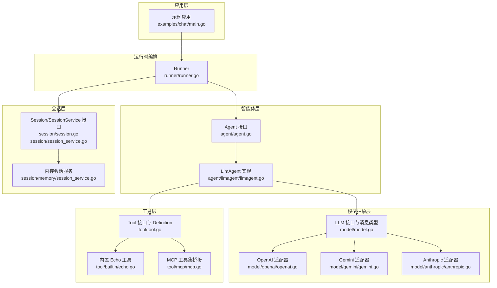
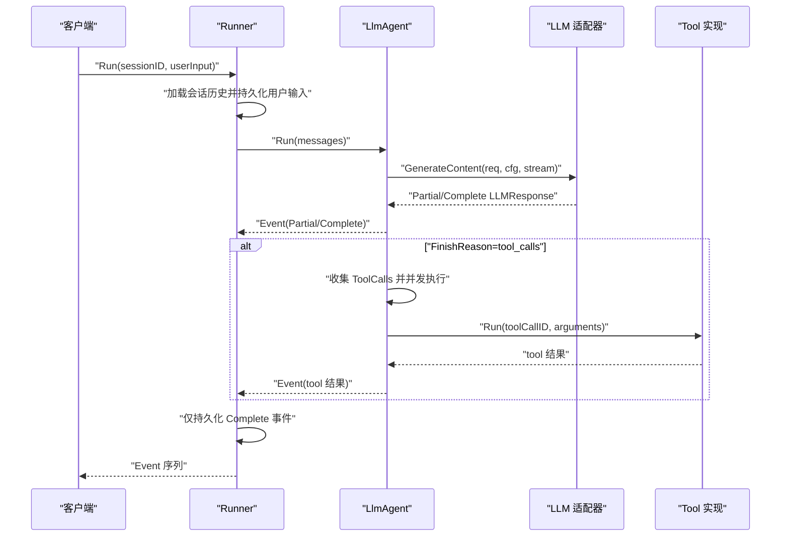
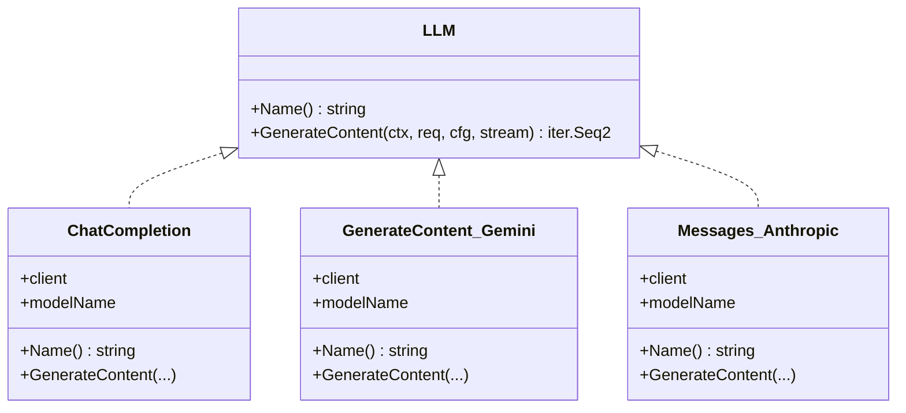
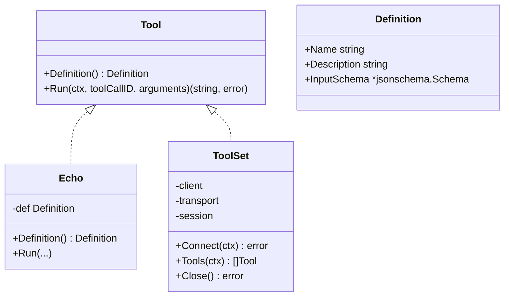
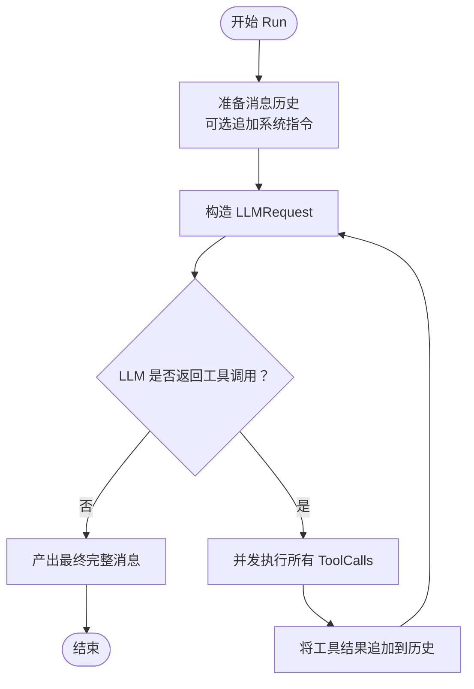
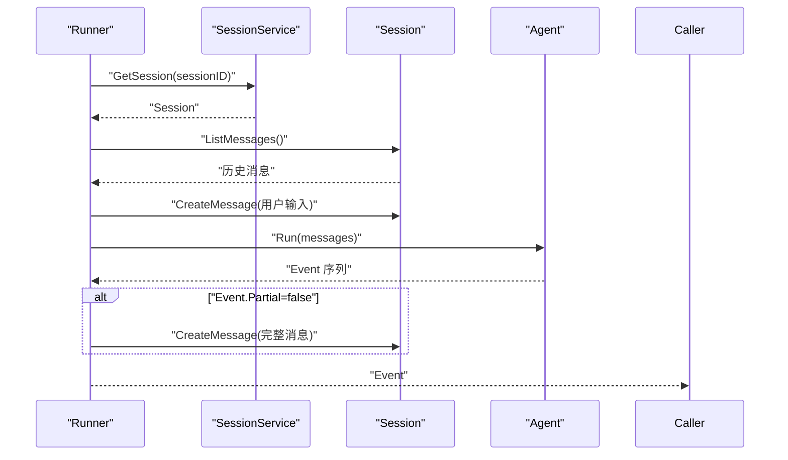
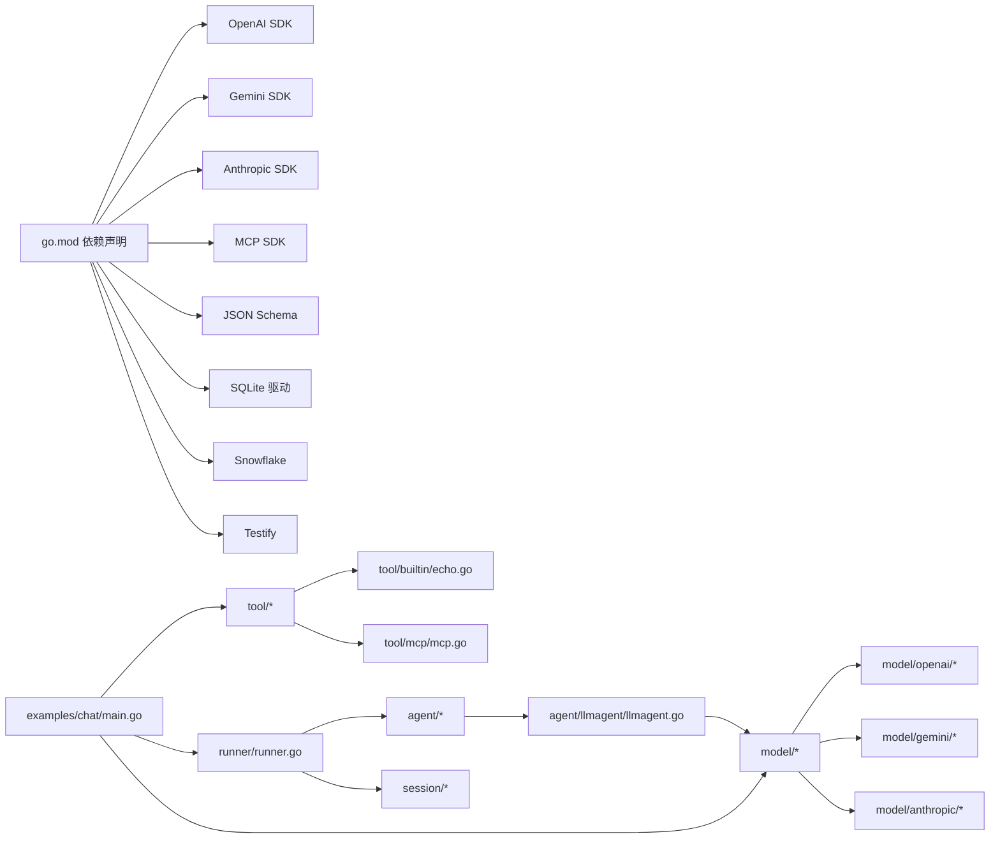

# 插件系统设计

<cite>
**本文引用的文件**
- [README.md](file://README.md)
- [go.mod](file://go.mod)
- [tool/tool.go](file://tool/tool.go)
- [model/model.go](file://model/model.go)
- [agent/agent.go](file://agent/agent.go)
- [agent/llmagent/llmagent.go](file://agent/llmagent/llmagent.go)
- [session/session.go](file://session/session.go)
- [session/session_service.go](file://session/session_service.go)
- [session/memory/session_service.go](file://session/memory/session_service.go)
- [tool/builtin/echo.go](file://tool/builtin/echo.go)
- [tool/mcp/mcp.go](file://tool/mcp/mcp.go)
- [model/openai/openai.go](file://model/openai/openai.go)
- [model/gemini/gemini.go](file://model/gemini/gemini.go)
- [model/anthropic/anthropic.go](file://model/anthropic/anthropic.go)
- [runner/runner.go](file://runner/runner.go)
- [examples/chat/main.go](file://examples/chat/main.go)
- [agent/llmagent/llmagent_test.go](file://agent/llmagent/llmagent_test.go)
</cite>

## 目录
1. [简介](#简介)
2. [项目结构](#项目结构)
3. [核心组件](#核心组件)
4. [架构总览](#架构总览)
5. [详细组件分析](#详细组件分析)
6. [依赖关系分析](#依赖关系分析)
7. [性能考量](#性能考量)
8. [故障排查指南](#故障排查指南)
9. [结论](#结论)
10. [附录](#附录)

## 简介
本文件系统化解析 ADK 框架的插件系统设计，重点阐述接口驱动的插件架构（LLM、Tool、SessionService 等），并覆盖以下主题：
- 扩展点识别与插件注册机制
- 依赖注入、配置管理与生命周期管理
- 向后兼容性保障（接口版本控制与废弃策略）
- 插件间交互模式与通信协议
- 测试框架与自动化测试策略
- 发布、版本管理与社区贡献指南
- 可复用插件模板与脚手架工具建议

ADK 的插件系统以“接口优先”的理念实现解耦：LLM 提供者、工具与会话存储均可替换；通过统一的 provider-agnostic 接口与消息类型，实现跨供应商的无缝切换。

章节来源
- [README.md: 14-399:14-399](file://README.md#L14-L399)

## 项目结构
ADK 采用按职责分层的包布局，核心模块如下：
- agent：Agent 接口与具体实现（如 LlmAgent、顺序/并行组合）
- model：LLM 抽象、消息类型、生成配置与事件定义
- tool：Tool 接口、Definition 与内置工具（echo）及 MCP 工具桥接
- session：Session 与 SessionService 接口，以及内存/数据库实现
- runner：协调 Agent 与 SessionService 的运行器
- examples：示例应用（聊天机器人，集成 MCP 工具）
- internal：内部工具（雪花 ID 节点工厂）

图表来源
- [runner/runner.go: 17-37:17-37](file://runner/runner.go#L17-L37)
- [agent/agent.go: 10-19:10-19](file://agent/agent.go#L10-L19)
- [agent/llmagent/llmagent.go: 30-46:30-46](file://agent/llmagent/llmagent.go#L30-L46)
- [model/model.go: 10-227:10-227](file://model/model.go#L10-L227)
- [tool/tool.go: 17-24:17-24](file://tool/tool.go#L17-L24)
- [session/session.go: 9-24:9-24](file://session/session.go#L9-L24)
- [session/session_service.go: 5-9:5-9](file://session/session_service.go#L5-L9)
- [session/memory/session_service.go: 14-41:14-41](file://session/memory/session_service.go#L14-L41)

章节来源
- [README.md: 67-89:67-89](file://README.md#L67-L89)

## 核心组件
本节聚焦插件系统的关键接口与数据模型，阐明其设计哲学与扩展点。

- LLM 接口（provider-agnostic）
  - 设计目标：屏蔽不同大模型供应商的差异，统一生成请求/响应与流式输出。
  - 关键能力：名称标识、生成内容（支持流式）、完成标记、令牌用量。
  - 配置抽象：温度、推理努力级别、服务层级、最大令牌数、推理预算、是否启用思考。
  - 数据模型：消息角色、FinishReason、ContentPart（文本/图片）、ToolCall、TokenUsage、LLMRequest/LLMResponse、Event。

- Tool 接口与 Definition
  - 设计目标：为 LLM 提供函数式工具调用能力，统一输入参数校验（JSON Schema）与执行结果。
  - 关键能力：Definition 返回工具元数据（名称、描述、输入 Schema），Run 执行工具并返回字符串结果。
  - 内置工具：echo 工具演示了基于反射生成 JSON Schema 的方式。
  - MCP 工具：动态连接 MCP 服务器，将远端工具暴露为本地 tool.Tool 实例。

- Agent 接口与 LlmAgent 实现
  - 设计目标：状态无关的智能体，仅处理传入消息并产出事件序列；会话持久化由 Runner/SessionService 负责。
  - 关键能力：Run 返回 Go 迭代器，支持 Partial/Complete 事件；自动工具调用循环；并发执行多个 ToolCall。
  - 生命周期：初始化时将工具 Definition 名称映射到工具实例；每次 Run 前追加系统指令（若配置）。

- Session 与 SessionService 接口
  - 设计目标：抽象会话生命周期与消息持久化，支持软归档（非删除）。
  - 关键能力：创建/获取/删除会话；列出活动消息与已归档消息；压缩历史消息。
  - 实现：内存实现用于测试或单进程场景；数据库实现用于持久化。

章节来源
- [model/model.go: 10-227:10-227](file://model/model.go#L10-L227)
- [tool/tool.go: 9-24:9-24](file://tool/tool.go#L9-L24)
- [tool/builtin/echo.go: 14-47:14-47](file://tool/builtin/echo.go#L14-L47)
- [tool/mcp/mcp.go: 15-121:15-121](file://tool/mcp/mcp.go#L15-L121)
- [agent/agent.go: 10-19:10-19](file://agent/agent.go#L10-L19)
- [agent/llmagent/llmagent.go: 30-159:30-159](file://agent/llmagent/llmagent.go#L30-L159)
- [session/session.go: 9-24:9-24](file://session/session.go#L9-L24)
- [session/session_service.go: 5-9:5-9](file://session/session_service.go#L5-L9)
- [session/memory/session_service.go: 10-41:10-41](file://session/memory/session_service.go#L10-L41)

## 架构总览
ADK 的插件系统遵循“接口驱动 + 适配器模式”：
- LLM 适配器（OpenAI/Gemini/Anthropic）实现 model.LLM 接口，负责将 provider-specific 请求转换为统一的 model.LLMRequest，并将响应转换为 model.LLMResponse。
- Tool 适配器（内置 echo、MCP）实现 tool.Tool 接口，提供 Definition 与 Run。
- Agent（LlmAgent）通过 model.LLM.GenerateContent 驱动对话，自动处理工具调用循环；Runner 负责加载/保存会话，协调事件流。
- SessionService 提供会话存取与消息持久化，支持软归档与分页查询。

图表来源
- [runner/runner.go: 39-95:39-95](file://runner/runner.go#L39-L95)
- [agent/llmagent/llmagent.go: 56-136:56-136](file://agent/llmagent/llmagent.go#L56-L136)
- [model/model.go: 178-227:178-227](file://model/model.go#L178-L227)

章节来源
- [README.md: 37-65:37-65](file://README.md#L37-L65)

## 详细组件分析

### LLM 适配器（OpenAI/Gemini/Anthropic）
- 统一抽象：model.LLM.GenerateContent 支持流式与非流式两种模式；Partial/Complete 标记确保 Runner 正确区分实时片段与完整消息。
- 参数映射：GenerateConfig 中的温度、推理努力级别、服务层级、最大令牌数、推理预算、是否启用思考，均被适配器映射到对应供应商的参数或请求选项。
- 多模态支持：ContentPart 支持文本与图片（URL/base64），适配器负责将统一的消息结构转换为各供应商期望的格式。
- 工具函数声明：convertTools 将 tool.Tool 的 Definition.InputSchema 转换为供应商的函数声明参数。
- FinishReason 映射：将供应商特定的停止原因映射为统一的 model.FinishReason。

图表来源
- [model/model.go: 10-18:10-18](file://model/model.go#L10-L18)
- [model/openai/openai.go: 19-42:19-42](file://model/openai/openai.go#L19-L42)
- [model/gemini/gemini.go: 17-64:17-64](file://model/gemini/gemini.go#L17-L64)
- [model/anthropic/anthropic.go: 25-45:25-45](file://model/anthropic/anthropic.go#L25-L45)

章节来源
- [model/openai/openai.go: 44-164:44-164](file://model/openai/openai.go#L44-L164)
- [model/gemini/gemini.go: 66-201:66-201](file://model/gemini/gemini.go#L66-L201)
- [model/anthropic/anthropic.go: 47-93:47-93](file://model/anthropic/anthropic.go#L47-L93)

### Tool 适配器（内置 echo 与 MCP）
- 内置工具：echo 工具通过反射生成 JSON Schema，作为 Definition.InputSchema，确保 LLM 能正确校验参数。
- MCP 工具：ToolSet 连接 MCP 服务器，枚举远端工具并封装为 tool.Tool；调用时通过 session.CallTool 转发至远端工具，再将文本内容拼接回字符串结果。

图表来源
- [tool/tool.go: 9-24:9-24](file://tool/tool.go#L9-L24)
- [tool/builtin/echo.go: 14-47:14-47](file://tool/builtin/echo.go#L14-L47)
- [tool/mcp/mcp.go: 15-121:15-121](file://tool/mcp/mcp.go#L15-L121)

章节来源
- [tool/builtin/echo.go: 22-47:22-47](file://tool/builtin/echo.go#L22-L47)
- [tool/mcp/mcp.go: 45-121:45-121](file://tool/mcp/mcp.go#L45-L121)

### Agent 与工具调用循环（LlmAgent）
- 初始化：将工具列表构造成名称到工具实例的映射，便于快速查找。
- 运行流程：构造 LLMRequest（含模型名、消息历史、工具声明），循环调用 LLM.GenerateContent；对 Partial 事件进行实时转发，对 Complete 事件附加 Usage 并持久化。
- 工具调用：当 FinishReason 为工具调用时，提取 ToolCalls 并并发执行；按原始顺序收集结果消息，追加到历史中继续下一轮生成，直至无工具调用为止。

图表来源
- [agent/llmagent/llmagent.go: 56-136:56-136](file://agent/llmagent/llmagent.go#L56-L136)

章节来源
- [agent/llmagent/llmagent.go: 30-159:30-159](file://agent/llmagent/llmagent.go#L30-L159)

### 会话与消息持久化（Runner 协调）
- Runner 在每次用户回合中加载会话历史，追加用户输入并持久化；随后将 Agent 产生的事件序列逐个转发给调用方。
- 完整事件（Partial=false）才会被持久化；流式片段（Partial=true）仅用于实时显示，不写入会话。
- 使用雪花 ID 为每条消息分配唯一标识，并记录创建/更新时间戳。

图表来源
- [runner/runner.go: 39-95:39-95](file://runner/runner.go#L39-L95)
- [session/session_service.go: 5-9:5-9](file://session/session_service.go#L5-L9)
- [session/session.go: 9-24:9-24](file://session/session.go#L9-L24)

章节来源
- [runner/runner.go: 17-108:17-108](file://runner/runner.go#L17-L108)
- [session/memory/session_service.go: 18-41:18-41](file://session/memory/session_service.go#L18-L41)

### 示例应用（聊天 + MCP 工具）
- 示例程序展示了如何：
  - 创建 OpenAI LLM；
  - 连接 Exa MCP 服务器并加载工具；
  - 构建 LlmAgent 并使用 Runner 驱动聊天循环；
  - 实时打印流式片段与最终完整消息。
- 该示例体现了插件系统的“即插即用”特性：只需替换 LLM 或添加/替换工具即可改变行为。

章节来源
- [examples/chat/main.go: 52-177:52-177](file://examples/chat/main.go#L52-L177)

## 依赖关系分析
- 模块依赖：go.mod 列出了外部库，包括 OpenAI、Gemini、Anthropic SDK、MCP SDK、JSON Schema、SQLite、Snowflake、Testify 等。
- 内部依赖：各适配器依赖 model 包提供的统一接口与数据结构；Agent 依赖 model 与 tool；Runner 依赖 agent、session 与 model；示例依赖 runner、model、tool、session。

图表来源
- [go.mod: 5-15:5-15](file://go.mod#L5-L15)
- [model/openai/openai.go: 10-17:10-17](file://model/openai/openai.go#L10-L17)
- [model/gemini/gemini.go: 11-15:11-15](file://model/gemini/gemini.go#L11-L15)
- [model/anthropic/anthropic.go: 10-16:10-16](file://model/anthropic/anthropic.go#L10-L16)
- [tool/mcp/mcp.go: 10-13:10-13](file://tool/mcp/mcp.go#L10-L13)
- [runner/runner.go: 10-15:10-15](file://runner/runner.go#L10-L15)
- [examples/chat/main.go: 24-31:24-31](file://examples/chat/main.go#L24-L31)

章节来源
- [go.mod: 1-47:1-47](file://go.mod#L1-L47)

## 性能考量
- 流式输出：LLM 适配器在流式模式下逐段产出 Partial 事件，降低首屏延迟，提升用户体验。
- 并发工具执行：LlmAgent 对同一轮中的多个 ToolCalls 使用 WaitGroup 并发执行，缩短总耗时。
- 令牌统计：适配器在 Complete 响应中填充 TokenUsage，便于成本与性能监控。
- 会话归档：软归档策略避免删除历史消息，同时减少后续查询负载。

章节来源
- [agent/llmagent/llmagent.go: 116-134:116-134](file://agent/llmagent/llmagent.go#L116-L134)
- [model/openai/openai.go: 88-164:88-164](file://model/openai/openai.go#L88-L164)
- [model/gemini/gemini.go: 108-201:108-201](file://model/gemini/gemini.go#L108-L201)
- [model/anthropic/anthropic.go: 47-93:47-93](file://model/anthropic/anthropic.go#L47-L93)

## 故障排查指南
- 流式测试：通过单元测试验证 Partial/Complete 事件顺序与内容一致性，确保适配器与 Agent 的协作正确。
- 工具并发：使用带延迟的慢工具模拟并发执行，验证 WaitGroup 并发路径与结果顺序。
- Reasoning 内容：通过 mock LLM 传递 ReasoningContent，验证 Agent 是否正确透传并在最终消息中保留。
- 集成测试：示例程序要求设置环境变量（如 OPENAI_API_KEY），未设置时测试跳过，避免无效调用。

章节来源
- [agent/llmagent/llmagent_test.go: 278-320:278-320](file://agent/llmagent/llmagent_test.go#L278-L320)
- [agent/llmagent/llmagent_test.go: 449-500:449-500](file://agent/llmagent/llmagent_test.go#L449-L500)
- [agent/llmagent/llmagent_test.go: 502-580:502-580](file://agent/llmagent/llmagent_test.go#L502-L580)
- [agent/llmagent/llmagent_test.go: 604-672:604-672](file://agent/llmagent/llmagent_test.go#L604-L672)
- [agent/llmagent/llmagent_test.go: 326-443:326-443](file://agent/llmagent/llmagent_test.go#L326-L443)

## 结论
ADK 的插件系统以清晰的接口抽象与适配器模式实现了高度可插拔的架构：
- LLM、Tool、SessionService 的接口设计确保了跨供应商与跨实现的互换性；
- Agent 的状态无关设计与 Runner 的会话编排分离了业务逻辑与持久化；
- 流式输出、并发工具执行与软归档等机制兼顾了性能与可维护性；
- 丰富的测试策略与示例应用为插件开发提供了可靠支撑。

## 附录

### 插件开发通用模式与最佳实践
- 依赖注入
  - LLM 适配器通过构造函数接收客户端与模型名，Runner 注入 Agent 与 SessionService。
  - 工具通过 ToolSet 动态注入，或直接以内置工具形式注入。
- 配置管理
  - 使用 GenerateConfig 统一温度、推理努力、服务层级、最大令牌数、推理预算与思考开关。
  - ContentPart 支持多模态输入，注意图片 URL 与 base64 的兼容性差异。
- 生命周期管理
  - Runner 负责消息持久化与事件转发；Agent 仅负责对话与工具调用；SessionService 负责会话存取与归档。
- 向后兼容性
  - 通过统一的 FinishReason 与 Event.Partial 字段，适配器无需关心上层如何消费流式片段。
  - Definition.InputSchema 保持稳定，新增字段建议向后兼容（例如默认值或可选字段）。
- 插件间交互
  - Agent 通过 LLM.GenerateContent 与 Tool.Run 进行交互；ToolSet 通过 MCP 会话桥接远端工具。
- 测试框架与自动化
  - 使用 testify 断言与自定义 mock（mockLLM/streamingMockLLM）验证流式与工具调用循环。
  - 集成测试通过环境变量驱动真实 LLM，验证端到端行为。
- 发布与版本管理
  - 使用语义化版本控制；对外公开接口（LLM、Tool、Agent、SessionService）变更需谨慎评估破坏性影响。
  - 通过 go.mod 管理依赖版本，确保第三方 SDK 的兼容性。
- 社区贡献指南
  - 新增 LLM 适配器时，遵循现有适配器的转换函数与错误处理模式。
  - 新增 Tool 时，提供 Definition 与 JSON Schema，并编写单元测试。
  - 示例应用可作为新插件的“脚手架”，展示最小可用集成方式。

章节来源
- [runner/runner.go: 26-37:26-37](file://runner/runner.go#L26-L37)
- [model/openai/openai.go: 279-304:279-304](file://model/openai/openai.go#L279-L304)
- [model/gemini/gemini.go: 353-384:353-384](file://model/gemini/gemini.go#L353-L384)
- [model/anthropic/anthropic.go: 242-260:242-260](file://model/anthropic/anthropic.go#L242-L260)
- [tool/tool.go: 9-24:9-24](file://tool/tool.go#L9-L24)
- [examples/chat/main.go: 52-177:52-177](file://examples/chat/main.go#L52-L177)
- [go.mod: 1-47:1-47](file://go.mod#L1-L47)