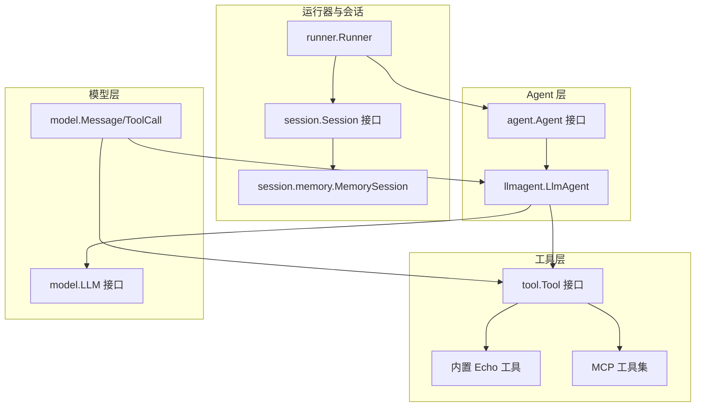
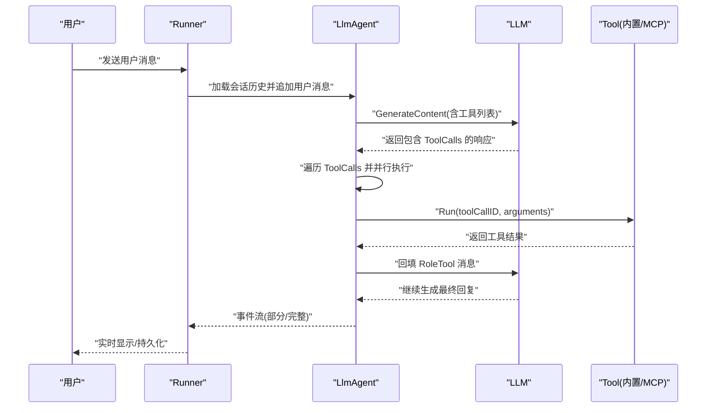
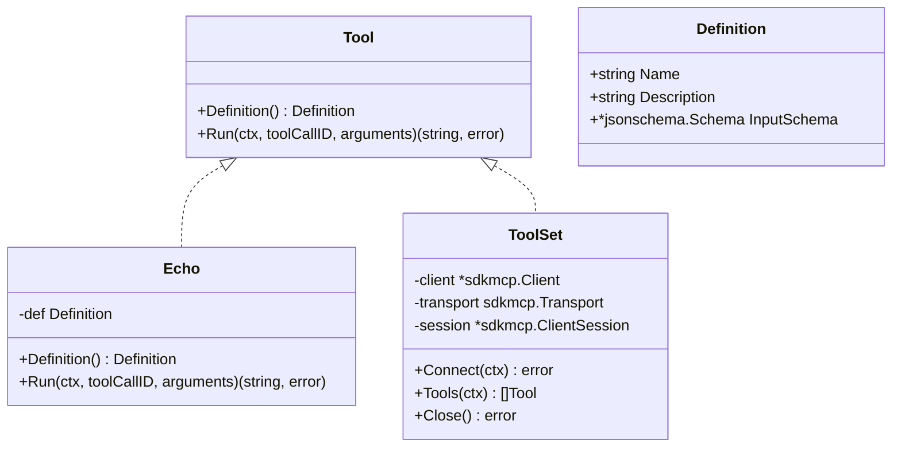
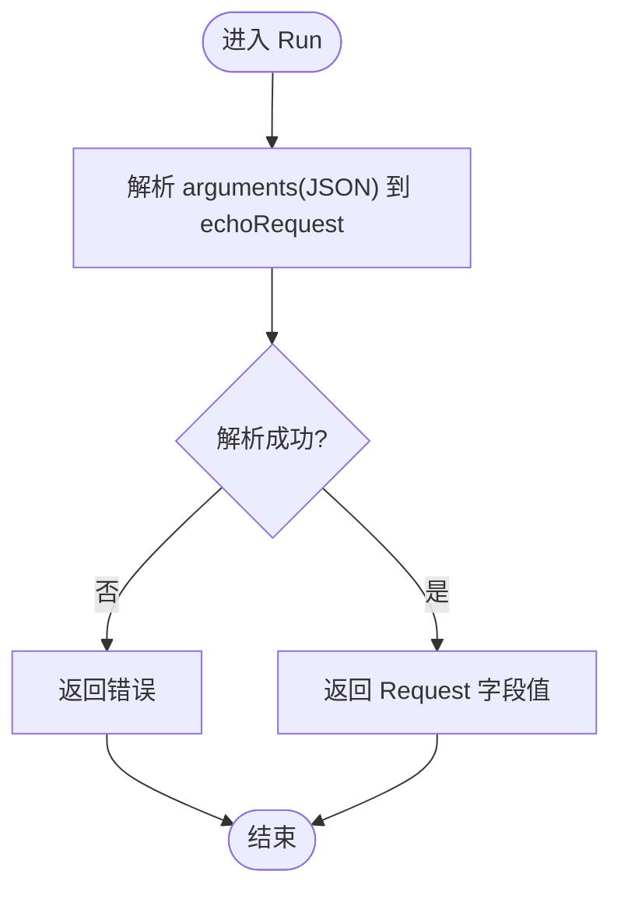
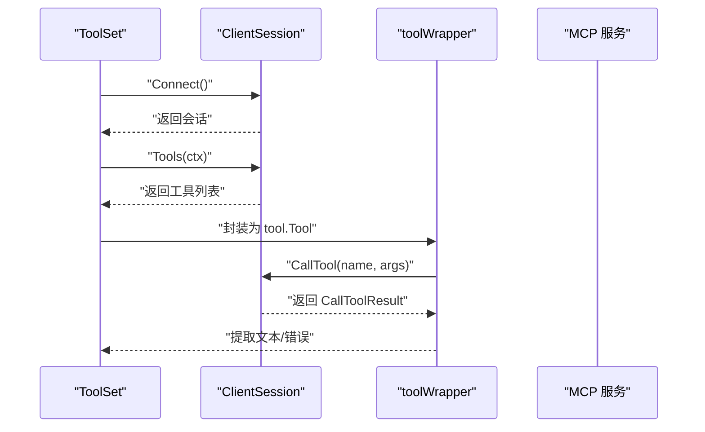
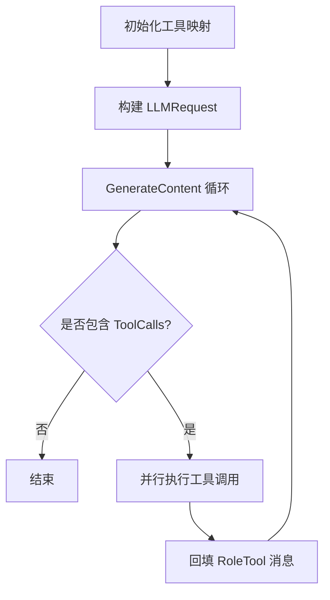
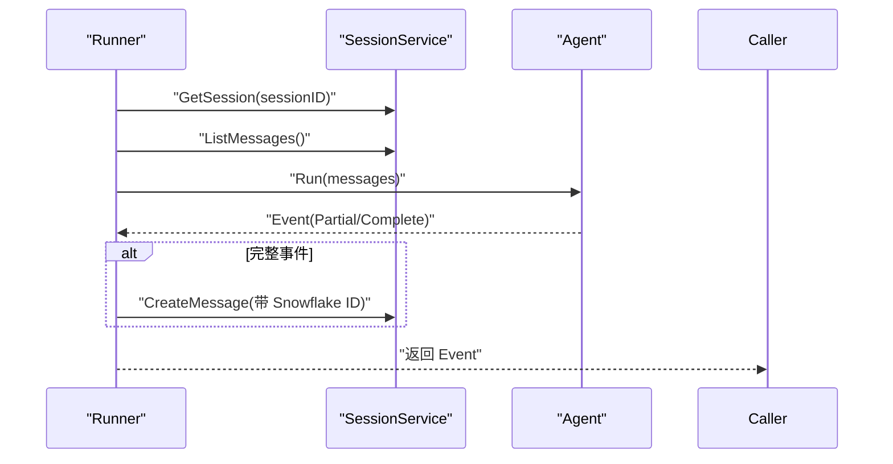
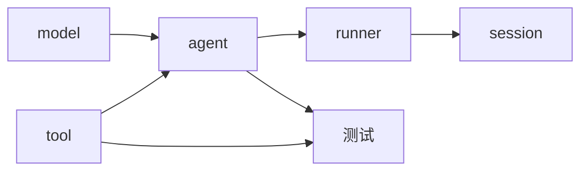

# 自定义工具开发

<cite>
**本文档引用的文件**
- [tool/tool.go](file://tool/tool.go)
- [tool/builtin/echo.go](file://tool/builtin/echo.go)
- [tool/mcp/mcp.go](file://tool/mcp/mcp.go)
- [tool/mcp/mcp_test.go](file://tool/mcp/mcp_test.go)
- [agent/agent.go](file://agent/agent.go)
- [agent/llmagent/llmagent.go](file://agent/llmagent/llmagent.go)
- [runner/runner.go](file://runner/runner.go)
- [session/session.go](file://session/session.go)
- [session/memory/session.go](file://session/memory/session.go)
- [model/model.go](file://model/model.go)
- [examples/chat/main.go](file://examples/chat/main.go)
- [internal/snowflake/snowflake.go](file://internal/snowflake/snowflake.go)
- [README.md](file://README.md)
</cite>

## 目录
1. [简介](#简介)
2. [项目结构](#项目结构)
3. [核心组件](#核心组件)
4. [架构总览](#架构总览)
5. [详细组件分析](#详细组件分析)
6. [依赖分析](#依赖分析)
7. [性能考虑](#性能考虑)
8. [故障排查指南](#故障排查指南)
9. [结论](#结论)
10. [附录](#附录)

## 简介
本指南面向希望在 ADK（Agent Development Kit）中开发自定义工具的工程师，系统讲解 Tool 接口的设计原理与实现方法，涵盖：
- Tool 接口的职责边界：元数据定义与执行逻辑分离
- 工具参数验证机制：基于 JSON Schema 的强类型校验
- 开发最佳实践：错误处理、超时控制、资源管理
- 实现模式：从简单 Echo 工具到复杂 MCP 工具集成
- 注册与发现机制：工具如何被 Agent 发现与调用
- 生命周期管理：从连接建立到工具调用再到结果回传
- 测试策略：单元测试、集成测试与模拟环境搭建
- 性能优化与监控指标收集建议

## 项目结构
ADK 将 Agent、LLM、Session、Tool 等模块解耦，形成清晰的分层架构。工具模块位于 tool 包，内置 echo 工具与 MCP 工具桥接；Agent 层负责驱动模型与工具调用循环；Runner 负责会话状态管理与消息持久化。

图表来源
- [tool/tool.go:17-23](file://tool/tool.go#L17-L23)
- [tool/builtin/echo.go:14-34](file://tool/builtin/echo.go#L14-L34)
- [tool/mcp/mcp.go:15-80](file://tool/mcp/mcp.go#L15-L80)
- [agent/agent.go:10-19](file://agent/agent.go#L10-L19)
- [agent/llmagent/llmagent.go:30-46](file://agent/llmagent/llmagent.go#L30-L46)
- [runner/runner.go:17-37](file://runner/runner.go#L17-L37)
- [session/session.go:9-23](file://session/session.go#L9-L23)
- [session/memory/session.go:12-24](file://session/memory/session.go#L12-L24)
- [model/model.go:10-196](file://model/model.go#L10-L196)

章节来源
- [README.md:37-90](file://README.md#L37-L90)
- [tool/tool.go:9-23](file://tool/tool.go#L9-L23)
- [agent/llmagent/llmagent.go:30-46](file://agent/llmagent/llmagent.go#L30-L46)
- [runner/runner.go:17-37](file://runner/runner.go#L17-L37)
- [session/session.go:9-23](file://session/session.go#L9-L23)

## 核心组件
- Tool 接口与 Definition：定义工具的元信息（名称、描述、输入 JSON Schema）与执行逻辑（Run）
- 内置 Echo 工具：演示如何使用反射生成 JSON Schema 并进行参数解析
- MCP 工具集：动态连接 MCP 服务器，发现工具并封装为 tool.Tool
- LlmAgent：自动驱动模型进行工具调用循环，按顺序执行工具并将结果回填给模型
- Runner：协调 Agent 与 SessionService，加载/保存消息历史，支持流式输出
- Session：抽象会话存储，内存后端用于测试与单机场景

章节来源
- [tool/tool.go:9-23](file://tool/tool.go#L9-L23)
- [tool/builtin/echo.go:14-46](file://tool/builtin/echo.go#L14-L46)
- [tool/mcp/mcp.go:15-121](file://tool/mcp/mcp.go#L15-L121)
- [agent/llmagent/llmagent.go:30-159](file://agent/llmagent/llmagent.go#L30-L159)
- [runner/runner.go:17-108](file://runner/runner.go#L17-L108)
- [session/session.go:9-23](file://session/session.go#L9-L23)

## 架构总览
下图展示了工具在 ADK 中的调用链路：Agent 通过 LLM 生成包含 ToolCalls 的消息，随后由 Agent 驱动工具执行，将工具返回的结果作为 RoleTool 消息回填至对话历史，再由 LLM 继续生成最终回复。

图表来源
- [agent/llmagent/llmagent.go:78-135](file://agent/llmagent/llmagent.go#L78-L135)
- [model/model.go:130-178](file://model/model.go#L130-L178)
- [tool/tool.go:17-23](file://tool/tool.go#L17-L23)

## 详细组件分析

### Tool 接口设计与参数验证
- 设计原则
  - Definition 返回工具元信息，供 LLM 识别与调用
  - Run 执行工具逻辑，接收 JSON 字符串参数，返回字符串结果
  - 输入参数通过 JSON Schema 强约束，确保类型安全与参数完整性
- 参数验证机制
  - 内置 Echo 使用反射生成 JSON Schema，并在构造阶段完成校验
  - MCP 工具将服务端返回的任意 JSON Schema 通过序列化/反序列化转换为本地 Schema 对象
  - 调用前由上层 Agent/Runner 将 ToolCall.Arguments 传递给工具，工具内部进行 JSON 解析与业务处理

图表来源
- [tool/tool.go:9-23](file://tool/tool.go#L9-L23)
- [tool/builtin/echo.go:14-46](file://tool/builtin/echo.go#L14-L46)
- [tool/mcp/mcp.go:15-86](file://tool/mcp/mcp.go#L15-L86)

章节来源
- [tool/tool.go:9-23](file://tool/tool.go#L9-L23)
- [tool/builtin/echo.go:18-34](file://tool/builtin/echo.go#L18-L34)
- [tool/mcp/mcp.go:46-72](file://tool/mcp/mcp.go#L46-L72)

### 内置 Echo 工具实现模式
- 元数据定义：名称、描述、输入 Schema
- 参数结构：echoRequest 结构体映射到 JSON 字段
- Schema 生成：使用反射生成 JSON Schema，失败直接 panic，确保早期暴露问题
- 执行逻辑：解析 JSON 参数，返回请求内容

图表来源
- [tool/builtin/echo.go:40-46](file://tool/builtin/echo.go#L40-L46)

章节来源
- [tool/builtin/echo.go:14-46](file://tool/builtin/echo.go#L14-L46)

### MCP 工具集成模式
- 连接与会话：创建 MCP 客户端，建立 Transport 连接
- 工具发现：遍历服务端暴露的工具，将其输入 Schema 转换为本地 Schema
- 工具封装：将每个 MCP 工具包装为 tool.Tool，统一调用入口
- 执行流程：解析参数为 map[string]any，调用服务端工具，提取文本内容或错误

图表来源
- [tool/mcp/mcp.go:35-109](file://tool/mcp/mcp.go#L35-L109)

章节来源
- [tool/mcp/mcp.go:15-121](file://tool/mcp/mcp.go#L15-L121)

### Agent 工具调用生命周期
- Agent 初始化：将工具集合映射为名称到工具的字典
- 请求构建：将系统指令与历史消息组合为 LLMRequest
- 生成循环：持续 GenerateContent，遇到工具调用则执行
- 工具执行：并行执行所有 ToolCalls，按原始顺序组装工具消息
- 结果回填：将工具结果作为 RoleTool 消息加入历史，继续生成

图表来源
- [agent/llmagent/llmagent.go:60-135](file://agent/llmagent/llmagent.go#L60-L135)

章节来源
- [agent/llmagent/llmagent.go:30-159](file://agent/llmagent/llmagent.go#L30-L159)

### Runner 与会话管理
- Runner 职责：加载会话历史、追加用户消息、驱动 Agent、持久化完整消息
- 消息持久化：分配 Snowflake ID，设置时间戳，写入 SessionService
- 流式输出：仅完整事件（Partial=false）写入会话，流式片段实时转发

图表来源
- [runner/runner.go:45-96](file://runner/runner.go#L45-L96)
- [internal/snowflake/snowflake.go:17-57](file://internal/snowflake/snowflake.go#L17-L57)

章节来源
- [runner/runner.go:17-108](file://runner/runner.go#L17-L108)
- [session/session.go:9-23](file://session/session.go#L9-L23)
- [session/memory/session.go:30-62](file://session/memory/session.go#L30-L62)

## 依赖分析
- 外部依赖
  - github.com/google/jsonschema-go：用于生成与解析 JSON Schema
  - github.com/modelcontextprotocol/go-sdk：MCP 客户端 SDK
  - github.com/bwmarrin/snowflake：分布式 ID 生成
- 内部依赖
  - tool 包被 agent、model、runner 等多层使用
  - agent 依赖 model 与 tool
  - runner 依赖 agent 与 session

图表来源
- [tool/tool.go:17-23](file://tool/tool.go#L17-L23)
- [agent/llmagent/llmagent.go:30-46](file://agent/llmagent/llmagent.go#L30-L46)
- [runner/runner.go:17-37](file://runner/runner.go#L17-L37)
- [session/session.go:9-23](file://session/session.go#L9-L23)

章节来源
- [README.md:380-393](file://README.md#L380-L393)
- [tool/tool.go:17-23](file://tool/tool.go#L17-L23)
- [agent/llmagent/llmagent.go:30-46](file://agent/llmagent/llmagent.go#L30-L46)
- [runner/runner.go:17-37](file://runner/runner.go#L17-L37)

## 性能考虑
- 并行工具执行：LlmAgent 在同一轮次内并行执行所有 ToolCalls，减少等待时间
- 流式输出：Runner 仅持久化完整消息，流式片段实时转发，降低延迟
- 消息压缩：Session 支持软归档旧消息，减少历史载荷
- ID 分布式：Snowflake ID 保证全局唯一且有序，便于日志与追踪
- 建议
  - 控制并发度：根据工具负载与外部服务限流策略调整并行数量
  - 缓存热点工具：对频繁调用的工具结果进行缓存
  - 监控与告警：采集工具执行耗时、错误率、超时比例等指标

[本节为通用性能建议，无需特定文件引用]

## 故障排查指南
- 工具未找到
  - 现象：工具调用返回“工具未找到”
  - 排查：确认工具名称与 Definition.Name 一致，Agent 初始化时已注册
- 参数解析失败
  - 现象：工具 Run 返回解析错误
  - 排查：检查 ToolCall.Arguments 是否符合 Definition.InputSchema；内置工具使用反射生成 Schema，需确保字段标签正确
- MCP 连接/调用异常
  - 现象：Connect/Tools/CallTool 报错
  - 排查：检查 Transport 配置、网络连通性、认证头；参考示例中的 API Key 注入方式
- 会话持久化失败
  - 现象：Runner 持久化消息报错
  - 排查：确认 SessionService 实现可用，内存后端适用于测试场景

章节来源
- [agent/llmagent/llmagent.go:139-158](file://agent/llmagent/llmagent.go#L139-L158)
- [tool/mcp/mcp.go:35-109](file://tool/mcp/mcp.go#L35-L109)
- [runner/runner.go:98-107](file://runner/runner.go#L98-L107)

## 结论
通过 Tool 接口与 JSON Schema 的强类型约束，ADK 提供了可插拔、可扩展的工具体系。结合 LlmAgent 的自动工具调用循环与 Runner 的会话管理，开发者可以快速构建从简单 Echo 工具到复杂 MCP 工具集成的各类应用。遵循本文档的开发与测试实践，可在保证类型安全与可维护性的前提下，获得良好的性能与可观测性。

[本节为总结性内容，无需特定文件引用]

## 附录

### 工具开发最佳实践
- 类型安全
  - 使用 JSON Schema 明确输入参数结构，避免运行期类型错误
  - 内置工具建议通过反射生成 Schema，确保一致性
- 错误处理
  - 工具内部捕获并返回可读错误信息，便于上层 Agent 诊断
  - 对外部依赖（如 MCP）进行超时与重试策略
- 资源管理
  - MCP 工具集在使用后及时 Close，释放会话资源
  - Runner 持久化消息时使用 Snowflake ID 与时间戳
- 超时控制
  - 为工具执行设置合理的 context 超时，避免阻塞 Agent 循环
- 可观测性
  - 记录工具调用次数、耗时、错误率、超时数等指标
  - 为工具调用附加 trace ID，便于跨服务追踪

[本节为通用实践建议，无需特定文件引用]

### 工具注册与发现机制
- 注册：Agent 初始化时将工具集合映射为名称到工具的字典
- 发现：MCP 工具集通过会话列举工具，动态封装为 tool.Tool
- 使用：Agent 根据 ToolCall.Name 查找工具并执行

章节来源
- [agent/llmagent/llmagent.go:36-46](file://agent/llmagent/llmagent.go#L36-L46)
- [tool/mcp/mcp.go:46-72](file://tool/mcp/mcp.go#L46-L72)

### 工具调用生命周期管理
- Agent 侧：构建请求、生成响应、检测 ToolCalls、并行执行工具、回填结果
- Runner 侧：加载历史、追加用户消息、持久化完整消息、实时转发流式片段
- Session 侧：内存后端用于测试，支持软归档与分页查询

章节来源
- [agent/llmagent/llmagent.go:60-135](file://agent/llmagent/llmagent.go#L60-L135)
- [runner/runner.go:45-96](file://runner/runner.go#L45-L96)
- [session/memory/session.go:30-85](file://session/memory/session.go#L30-L85)

### 测试策略
- 单元测试
  - Echo 工具：验证参数解析与返回值
  - MCP 工具集：验证连接、工具发现与调用流程
- 集成测试
  - 示例程序：演示如何连接 MCP 服务、加载工具、运行 Agent、处理事件流
- 模拟环境
  - 使用内存 SessionService 进行端到端测试
  - 通过自定义 Transport 或 Mock 服务模拟 MCP 行为

章节来源
- [tool/mcp/mcp_test.go:44-100](file://tool/mcp/mcp_test.go#L44-L100)
- [examples/chat/main.go:52-177](file://examples/chat/main.go#L52-L177)
- [session/memory/session.go:18-24](file://session/memory/session.go#L18-L24)