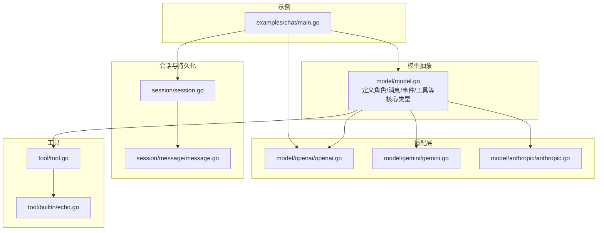
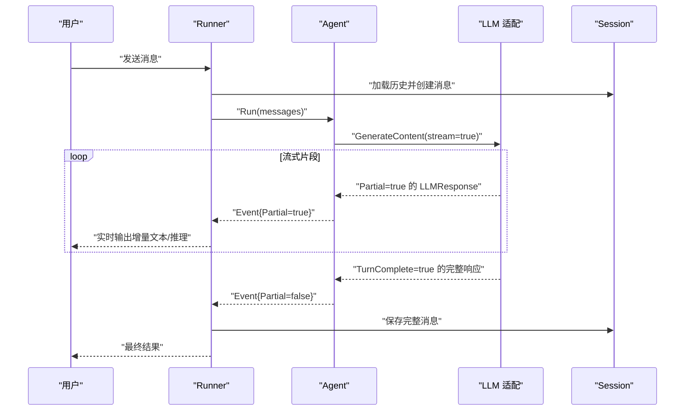
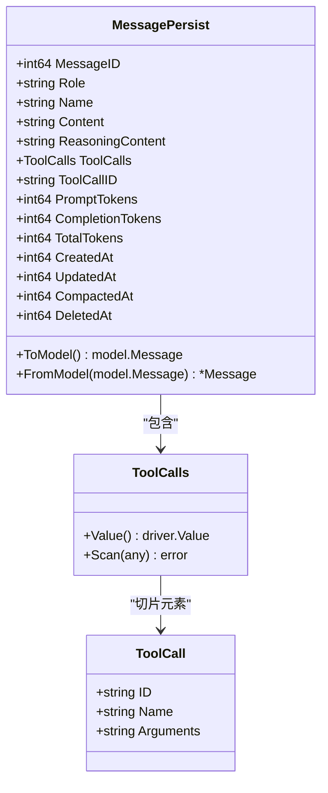
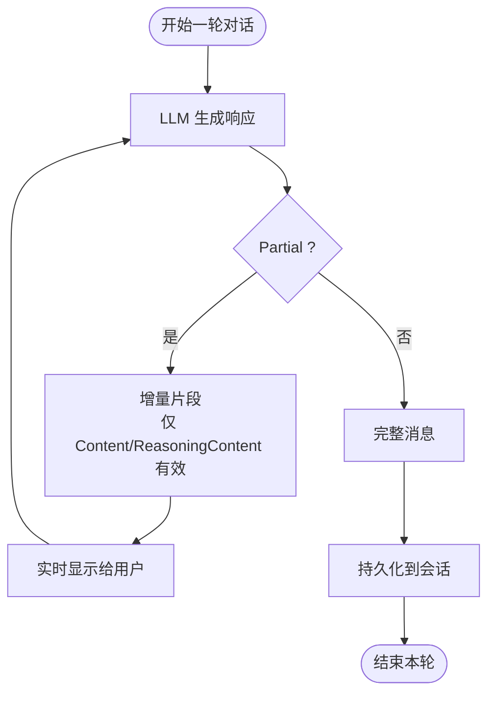
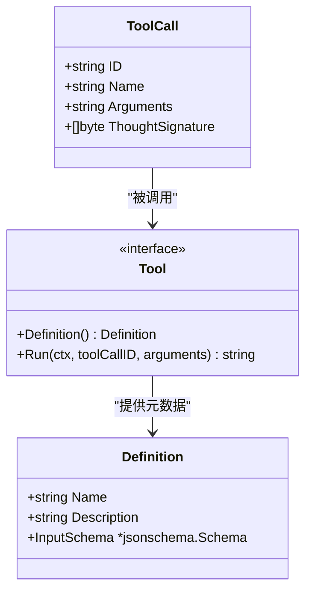
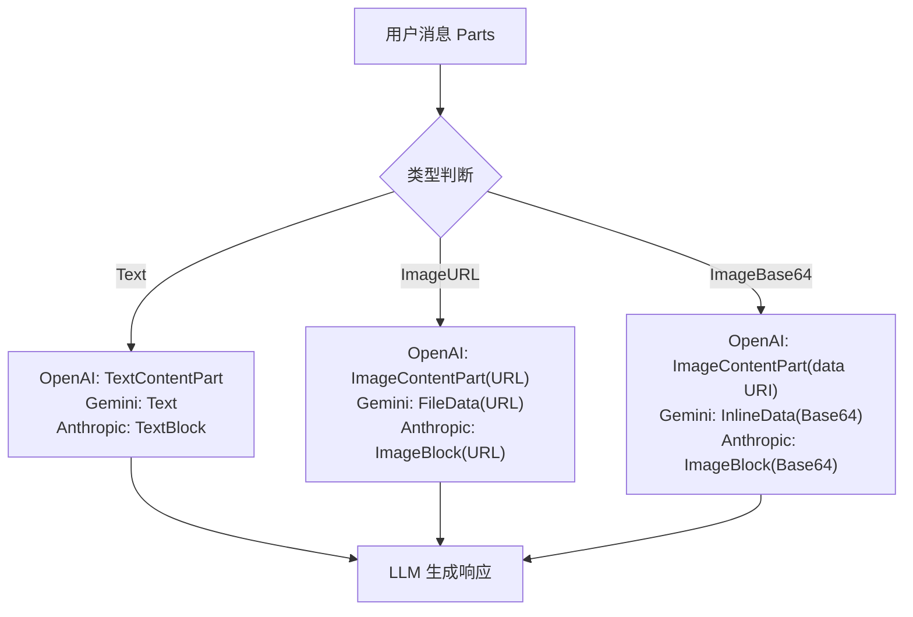
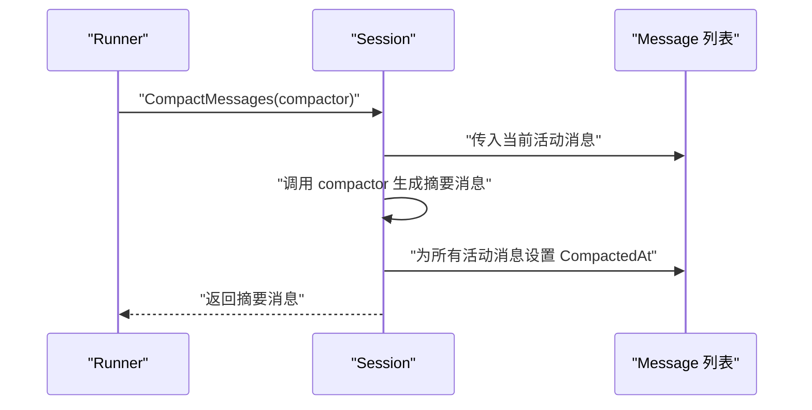
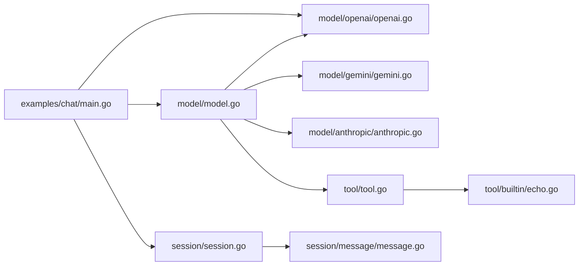

# 数据模型

<cite>
**本文引用的文件列表**
- [model.go](file://model/model.go)
- [message.go](file://session/message/message.go)
- [session.go](file://session/session.go)
- [openai.go](file://model/openai/openai.go)
- [gemini.go](file://model/gemini/gemini.go)
- [anthropic.go](file://model/anthropic/anthropic.go)
- [echo.go](file://tool/builtin/echo.go)
- [main.go](file://examples/chat/main.go)
- [README.md](file://README.md)
</cite>

## 目录
1. [简介](#简介)
2. [项目结构与数据模型定位](#项目结构与数据模型定位)
3. [核心数据模型总览](#核心数据模型总览)
4. [架构概览](#架构概览)
5. [详细组件分析](#详细组件分析)
6. [依赖关系分析](#依赖关系分析)
7. [性能与可扩展性考量](#性能与可扩展性考量)
8. [故障排查指南](#故障排查指南)
9. [结论](#结论)
10. [附录：使用示例与最佳实践](#附录使用示例与最佳实践)

## 简介
本章节系统化梳理 ADK 框架中的核心数据模型与类型定义，重点围绕以下主题：
- Message 结构体的设计：角色定义、内容类型、工具调用与多模态支持
- Event 模型的作用：区分部分完成消息与完整消息，以及在流式处理中的应用
- 工具调用结构：函数调用参数的定义与执行机制
- 多模态内容支持：文本、图像等媒体类型的处理方式
- 数据验证与业务规则：确保消息格式一致性与完整性
- 使用示例与最佳实践：帮助开发者正确使用与扩展数据模型

## 项目结构与数据模型定位
ADK 将“模型无关”的数据结构集中在 model 包中，适配层（如 OpenAI、Gemini、Anthropic）负责将这些结构映射到具体提供商的 API；会话与持久化在 session 包中实现；工具接口在 tool 包中定义。

图表来源
- [model.go:152-227](file://model/model.go#L152-L227)
- [openai.go:19-164](file://model/openai/openai.go#L19-L164)
- [gemini.go:17-201](file://model/gemini/gemini.go#L17-L201)
- [anthropic.go:25-93](file://model/anthropic/anthropic.go#L25-L93)
- [session.go:9-23](file://session/session.go#L9-L23)
- [message.go:49-128](file://session/message/message.go#L49-L128)
- [tool.go:9-23](file://tool/tool.go#L9-L23)
- [echo.go:14-46](file://tool/builtin/echo.go#L14-L46)
- [main.go:52-177](file://examples/chat/main.go#L52-L177)

章节来源
- [README.md:67-89](file://README.md#L67-L89)

## 核心数据模型总览
本节从“角色/内容/工具调用/多模态/事件/会话”六个维度，给出数据模型的高层视图与职责边界。

- 角色与消息
  - 角色：system、user、assistant、tool
  - 消息字段：Content（纯文本）、Parts（多模态内容优先）、ReasoningContent（推理内容，仅信息性）、ToolCalls（工具调用）、ToolCallID（回链）、Usage（token 统计）
- 事件
  - Event 包裹 Message，并通过 Partial 标识是否为流式片段；TurnComplete 标识最终完整响应
- 工具
  - Definition：名称、描述、输入 JSON Schema
  - Tool 接口：Definition() 与 Run(ctx, toolCallID, arguments)
- 多模态
  - ContentPartType：text、image_url、image_base64
  - ContentPart：Text、ImageURL、ImageBase64、MIMEType、ImageDetail
- 会话与持久化
  - Session 接口：创建/读取/删除消息、分页/全量列出、压缩归档
  - Message（持久化）：包含 Token 统计、软归档标记等

章节来源
- [model.go:20-227](file://model/model.go#L20-L227)
- [message.go:49-128](file://session/message/message.go#L49-L128)
- [session.go:9-23](file://session/session.go#L9-L23)

## 架构概览
下图展示了“事件驱动”的流式生成过程：Agent.Run 产出 Event，Runner 负责会话持久化与流式转发。

图表来源
- [model.go:11-18](file://model/model.go#L11-L18)
- [model.go:214-227](file://model/model.go#L214-L227)
- [openai.go:48-164](file://model/openai/openai.go#L48-L164)
- [gemini.go:70-201](file://model/gemini/gemini.go#L70-L201)
- [session.go:9-23](file://session/session.go#L9-L23)

## 详细组件分析

### Message 结构体与持久化映射
- 设计要点
  - Role、Name、Content、ReasoningContent、ToolCalls、ToolCallID
  - Token 统计：PromptTokens、CompletionTokens、TotalTokens
  - 时间戳：CreatedAt、UpdatedAt、CompactedAt（软归档）、DeletedAt
  - ToModel/FromModel 实现“持久化消息”与“模型消息”的双向转换
- 多模态优先级
  - 当 Parts 非空时，优先使用 Parts；否则使用 Content
- 工具调用
  - ToolCalls 以 JSON 字符串存储 Arguments，便于跨适配层传递

图表来源
- [message.go:49-128](file://session/message/message.go#L49-L128)
- [message.go:11-17](file://session/message/message.go#L11-L17)

章节来源
- [message.go:49-128](file://session/message/message.go#L49-L128)

### Event 模型与流式处理
- Event 的作用
  - 包裹 Message 并标注 Partial 与 TurnComplete
  - Partial=true 表示增量片段（仅 Content/ReasoningContent 有效），需实时显示但不持久化
  - Partial=false 表示完整消息，可持久化或进一步处理
- 在 Runner 中的使用
  - 对 Partial=true 的事件进行实时输出
  - 对 Partial=false 的事件进行持久化与后续处理

图表来源
- [model.go:214-227](file://model/model.go#L214-L227)

章节来源
- [model.go:214-227](file://model/model.go#L214-L227)

### 工具调用结构与执行机制
- ToolCall
  - 字段：ID、Name、Arguments（JSON 字符串）、ThoughtSignature（用于特定模型的推理上下文）
- Tool 接口
  - Definition() 返回 Definition{Name, Description, InputSchema}
  - Run(ctx, toolCallID, arguments) 执行工具并返回字符串结果
- JSON Schema 输入校验
  - 通过 Definition.InputSchema 对工具参数进行约束，保证调用一致性

图表来源
- [tool.go:9-23](file://tool/tool.go#L9-L23)
- [model.go:130-143](file://model/model.go#L130-L143)

章节来源
- [tool.go:9-23](file://tool/tool.go#L9-L23)
- [echo.go:14-46](file://tool/builtin/echo.go#L14-L46)

### 多模态内容支持
- ContentPart 类型
  - 文本：ContentPartTypeText + Text
  - 图像 URL：ContentPartTypeImageURL + ImageURL + ImageDetail
  - Base64 图像：ContentPartTypeImageBase64 + ImageBase64 + MIMEType + ImageDetail
- 适配层映射
  - OpenAI：将 ContentPart 映射为 TextContentPart 或 ImageContentPart（含 data URI）
  - Gemini：将 ContentPart 映射为 Text、FileData（URL）或 InlineData（Base64）
  - Anthropic：将 ContentPart 映射为 Text Block 或 Image Block（URL/Base64）

图表来源
- [model.go:86-128](file://model/model.go#L86-L128)
- [openai.go:185-210](file://model/openai/openai.go#L185-L210)
- [gemini.go:270-299](file://model/gemini/gemini.go#L270-L299)
- [anthropic.go:149-184](file://model/anthropic/anthropic.go#L149-L184)

章节来源
- [model.go:86-128](file://model/model.go#L86-L128)
- [openai.go:185-210](file://model/openai/openai.go#L185-L210)
- [gemini.go:270-299](file://model/gemini/gemini.go#L270-L299)
- [anthropic.go:149-184](file://model/anthropic/anthropic.go#L149-L184)

### 会话与消息压缩
- Session 接口
  - 创建消息、分页/全量列出活动消息、列出已归档消息、删除消息、压缩消息
- 消息压缩
  - 通过 CompactMessages 将历史消息归档（设置 CompactedAt），保留摘要消息作为新的活动历史
- 内存后端示例
  - 内存会话维护两份列表：活动消息与归档消息，并在压缩时转移时间戳

图表来源
- [session.go:22-23](file://session/session.go#L22-L23)
- [memory.go:70-85](file://session/memory/session.go#L70-L85)

章节来源
- [session.go:9-23](file://session/session.go#L9-L23)
- [memory.go:70-85](file://session/memory/session.go#L70-L85)

## 依赖关系分析
- 模型抽象层（model）为上层 Agent、Runner 提供统一的消息与事件类型
- 适配层（openai/gemini/anthropic）将模型抽象映射到各提供商 API，并负责流式片段的拼接与最终组装
- 工具层（tool）提供工具定义与执行接口，配合模型中的 ToolCall 与 Definition
- 会话层（session/message）负责消息的持久化与历史管理

图表来源
- [model.go:1-227](file://model/model.go#L1-L227)
- [openai.go:1-362](file://model/openai/openai.go#L1-L362)
- [gemini.go:1-478](file://model/gemini/gemini.go#L1-L478)
- [anthropic.go:1-326](file://model/anthropic/anthropic.go#L1-L326)
- [tool.go:1-24](file://tool/tool.go#L1-L24)
- [echo.go:1-47](file://tool/builtin/echo.go#L1-L47)
- [session.go:1-24](file://session/session.go#L1-L24)
- [message.go:1-129](file://session/message/message.go#L1-L129)
- [main.go:1-181](file://examples/chat/main.go#L1-L181)

## 性能与可扩展性考量
- 流式处理
  - 通过 Partial 与 TurnComplete 控制增量输出与最终组装，避免一次性缓冲大文本
- 多模态传输
  - Base64 图像在 OpenAI 中会被封装为 data URI，可能增加体积；建议根据提供商能力选择 URL 或 Base64
- 工具调用
  - ToolCalls 的 Arguments 以 JSON 字符串传递，便于跨适配层兼容；建议在工具层严格校验 JSON Schema
- 会话压缩
  - 压缩旧历史可显著降低查询与序列化成本，适合长对话场景

[本节为通用指导，无需列出章节来源]

## 故障排查指南
- 流式片段未显示
  - 检查 Event.Partial 是否为 true，且只消费增量文本与推理内容
- 工具调用失败
  - 核对 ToolCall.Arguments 的 JSON 结构与 Definition.InputSchema 是否一致
- 多模态图像不生效
  - OpenAI：确认 ImageDetail 设置与提供商支持；Gemini：尽量使用 Base64 以提升兼容性
- 会话历史异常
  - 确认 CompactedAt 的设置逻辑与查询过滤条件（非归档、非删除）

章节来源
- [model.go:214-227](file://model/model.go#L214-L227)
- [tool.go:9-23](file://tool/tool.go#L9-L23)
- [openai.go:185-210](file://model/openai/openai.go#L185-L210)
- [gemini.go:270-299](file://model/gemini/gemini.go#L270-L299)
- [session.go:12-22](file://session/session.go#L12-L22)

## 结论
ADK 的数据模型以“模型无关”的抽象为核心，结合流式事件与工具调用，提供了清晰、可扩展的消息格式与处理流程。通过明确的角色、内容与工具语义，以及多模态与推理内容的支持，开发者可以在不同 LLM 与工具之间无缝切换，同时保持会话历史的可维护性与一致性。

[本节为总结，无需列出章节来源]

## 附录：使用示例与最佳实践

### 使用示例
- 快速启动一个聊天 Agent 并启用流式输出
  - 参考示例程序中的初始化、工具加载与事件循环处理
  - 示例路径：[main.go:52-177](file://examples/chat/main.go#L52-L177)

章节来源
- [main.go:52-177](file://examples/chat/main.go#L52-L177)

### 最佳实践
- 消息建模
  - 优先使用 Parts 进行多模态输入；当仅含文本时使用 Content
  - ReasoningContent 仅用于展示，不参与后续请求
- 工具定义
  - 使用 JSON Schema 精确描述工具输入参数，确保 Run 时参数校验通过
  - ToolCallID 用于回链工具结果与调用方，务必保持唯一性
- 流式处理
  - 对 Partial=true 的事件仅显示增量文本与推理内容
  - 对 Partial=false 的事件再持久化或继续处理
- 多模态传输
  - 优先使用 Base64 图像以提升兼容性；必要时设置 ImageDetail 控制分辨率
- 会话管理
  - 定期调用压缩功能，将历史消息归档，减少活跃历史长度

[本节为通用指导，无需列出章节来源]