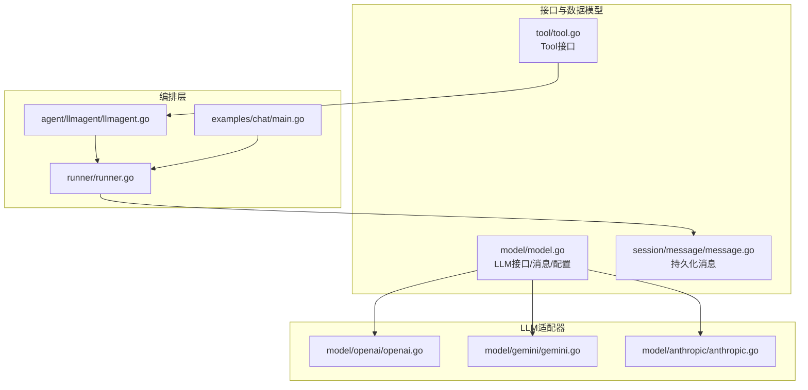
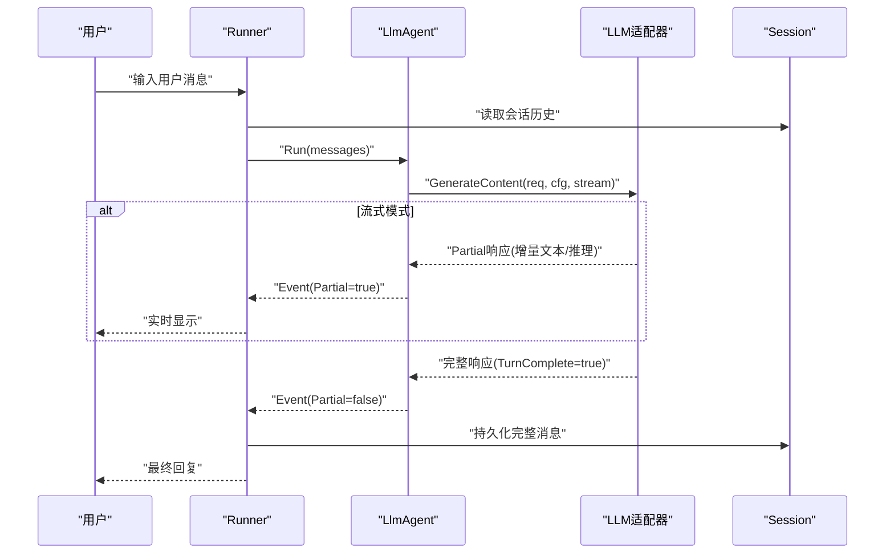
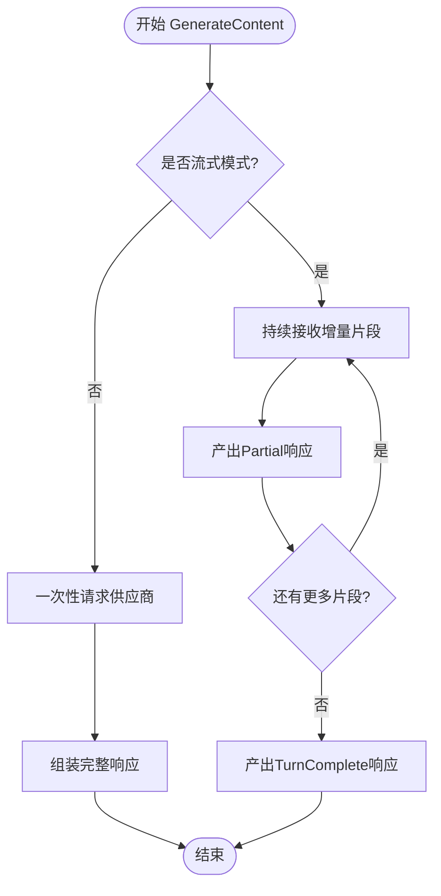
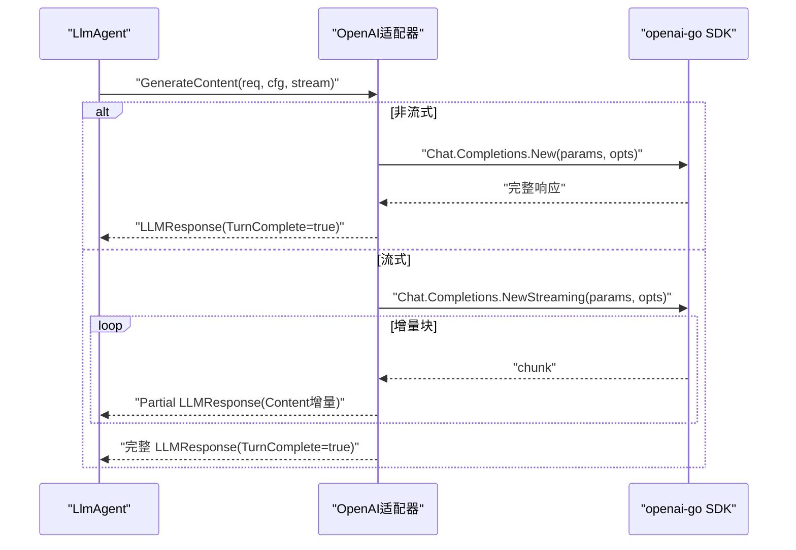
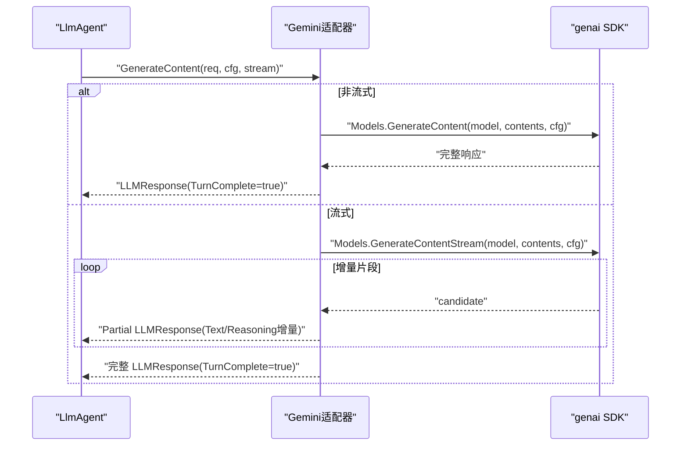
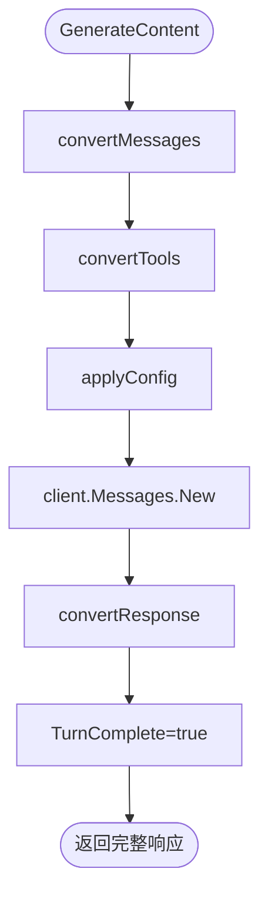
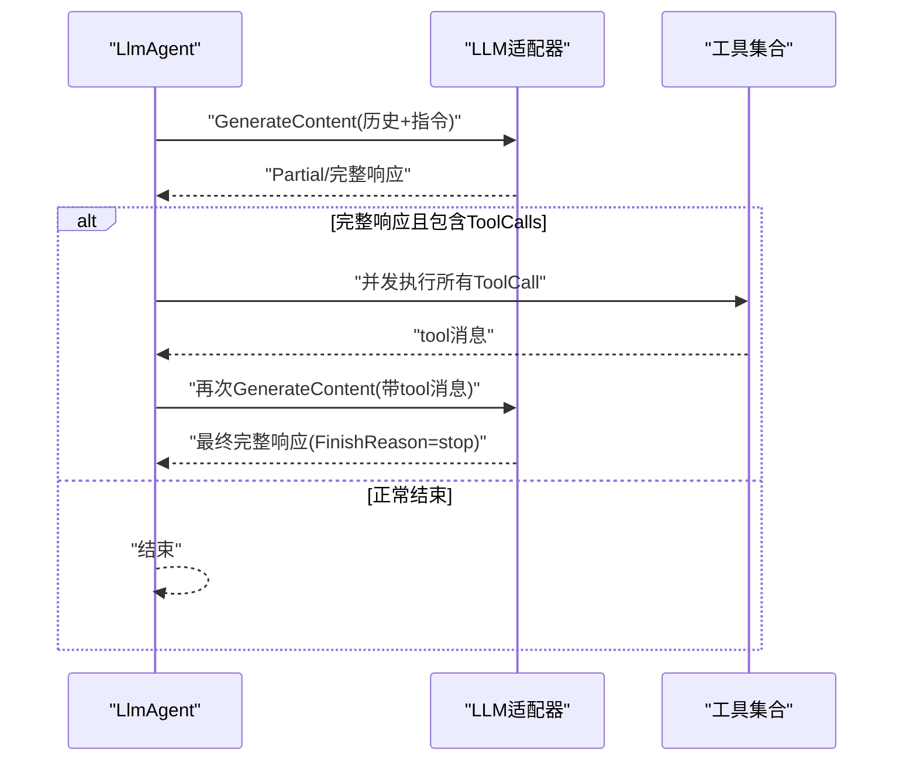
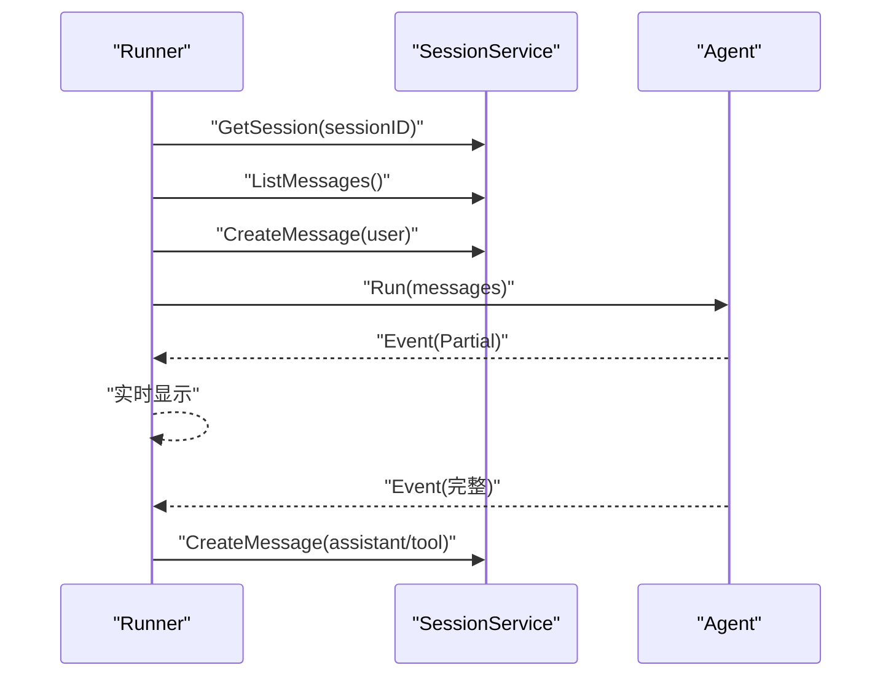
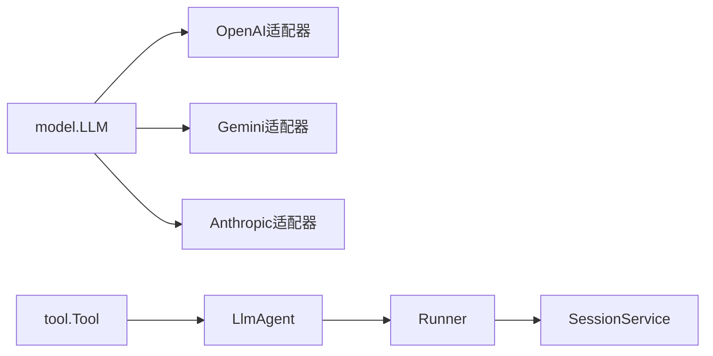
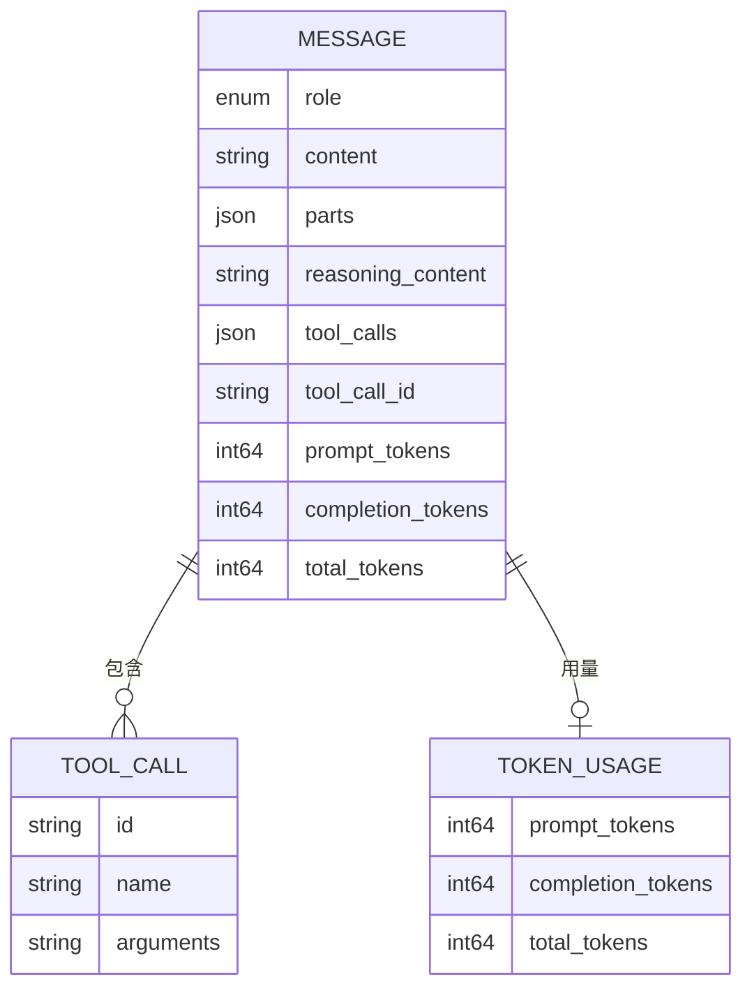

# LLM抽象接口

<cite>
**本文档引用的文件**
- [model/model.go](file://model/model.go)
- [model/openai/openai.go](file://model/openai/openai.go)
- [model/gemini/gemini.go](file://model/gemini/gemini.go)
- [model/anthropic/anthropic.go](file://model/anthropic/anthropic.go)
- [agent/llmagent/llmagent.go](file://agent/llmagent/llmagent.go)
- [runner/runner.go](file://runner/runner.go)
- [session/message/message.go](file://session/message/message.go)
- [examples/chat/main.go](file://examples/chat/main.go)
- [tool/tool.go](file://tool/tool.go)
- [tool/builtin/echo.go](file://tool/builtin/echo.go)
- [tool/mcp/mcp.go](file://tool/mcp/mcp.go)
- [README.md](file://README.md)
</cite>

## 目录
1. [简介](#简介)
2. [项目结构](#项目结构)
3. [核心组件](#核心组件)
4. [架构总览](#架构总览)
5. [详细组件分析](#详细组件分析)
6. [依赖分析](#依赖分析)
7. [性能考虑](#性能考虑)
8. [故障排除指南](#故障排除指南)
9. [结论](#结论)
10. [附录](#附录)

## 简介
本文件系统性解析ADK框架中的LLM抽象接口设计与实现，重点覆盖以下方面：
- model.LLM接口的定义与职责边界，以及如何通过Go迭代器实现统一的流式/非流式响应协议
- 消息类型体系：Message、Event、ContentPart等核心数据结构及其语义
- 生成配置选项（GenerateConfig）的设计与跨供应商映射策略
- 工具调用机制：如何在LLM响应中嵌入工具调用指令，并在Agent层自动执行
- 多模态内容支持：文本、图像等混合内容的处理流程
- 各LLM适配器（OpenAI、Gemini、Anthropic）的实现要点与差异
- 流式处理机制：Go迭代器在实时输出中的应用与事件分发

## 项目结构
ADK采用“接口抽象 + 适配器实现 + 组合编排”的分层设计：
- model包：定义LLM抽象接口与通用消息/工具/配置数据结构
- model/<provider>：各供应商适配器，实现model.LLM接口
- agent/llmagent：基于LLM接口的状态机Agent，负责工具调用循环
- runner：会话驱动器，负责加载历史、持久化消息、协调Agent
- session/message：持久化消息模型与序列化
- tool：工具接口与内置工具、MCP桥接
- examples：示例程序展示端到端使用

图表来源
- [model/model.go:1-227](file://model/model.go#L1-L227)
- [model/openai/openai.go:1-362](file://model/openai/openai.go#L1-L362)
- [model/gemini/gemini.go:1-478](file://model/gemini/gemini.go#L1-L478)
- [model/anthropic/anthropic.go:1-326](file://model/anthropic/anthropic.go#L1-L326)
- [agent/llmagent/llmagent.go:1-159](file://agent/llmagent/llmagent.go#L1-L159)
- [runner/runner.go:1-108](file://runner/runner.go#L1-L108)
- [session/message/message.go:1-129](file://session/message/message.go#L1-L129)
- [examples/chat/main.go:1-181](file://examples/chat/main.go#L1-L181)

章节来源
- [README.md:37-90](file://README.md#L37-L90)

## 核心组件
本节聚焦LLM抽象接口与核心数据结构，阐明其职责与协作关系。

- LLM接口
  - 名称：Name() string
  - 核心方法：GenerateContent(ctx, req, cfg, stream) -> iter.Seq2[*LLMResponse, error]
  - 设计要点：
    - 使用Go 1.26原生iter.Seq2作为流式协议载体，返回值包含Partial/TurnComplete标记
    - 支持两种模式：stream=false时仅返回一个完整响应；stream=true时可产生多个部分响应，最后再返回完整响应
    - 通过LLMRequest/LLMResponse屏蔽供应商差异，统一消息格式与工具调用表达

- 消息与事件
  - Message：单轮对话消息，支持文本Content或多模态Parts；可携带ReasoningContent（推理链）、ToolCalls（工具调用）、Usage（用量）
  - Event：Runner向调用方发出的事件包装，区分Partial片段与完整消息
  - Choice：候选结果封装（当前实现未直接使用）

- 内容与多模态
  - ContentPart：内容块，支持文本、图片URL、Base64图片三类
  - ImageDetail：图片细节级别控制
  - 角色枚举：system/user/assistant/tool

- 工具与调用
  - Tool接口：Definition() + Run()
  - ToolCall：一次工具调用的标识、名称与参数
  - Agent自动执行工具调用，按顺序产出tool消息回填历史

- 生成配置
  - Temperature、MaxTokens、ReasoningEffort、ServiceTier、ThinkingBudget、EnableThinking
  - 配置在不同供应商间进行语义映射（如EnableThinking→ThinkingConfig、ReasoningEffort→ThinkingLevel）

章节来源
- [model/model.go:10-227](file://model/model.go#L10-L227)

## 架构总览
ADK的运行时由Runner驱动，Agent为状态机，LLM适配器负责具体供应商交互，Session负责消息持久化。

图表来源
- [runner/runner.go:45-95](file://runner/runner.go#L45-L95)
- [agent/llmagent/llmagent.go:60-136](file://agent/llmagent/llmagent.go#L60-L136)
- [model/model.go:17-212](file://model/model.go#L17-L212)

## 详细组件分析

### LLM接口与流式协议
- 接口契约
  - Name()用于标识模型名，便于日志与追踪
  - GenerateContent返回iter.Seq2[*LLMResponse, error]，调用方可通过range遍历
- 响应语义
  - Partial=true：表示这是增量片段，仅Content/ReasoningContent有效
  - TurnComplete=true：表示该轮完整响应结束，Usage可用
  - FinishReason指示停止原因（stop/tool_calls/length/content_filter等）

图表来源
- [model/model.go:17-212](file://model/model.go#L17-L212)

章节来源
- [model/model.go:10-227](file://model/model.go#L10-L227)

### OpenAI适配器（model/openai）
- 关键点
  - 使用openai-go v3 SDK，支持流式与非流式两种模式
  - convertMessages将model.Message映射为OpenAI消息参数，支持多模态ContentPart
  - convertTools将tool.Tool映射为function工具定义（含JSON Schema）
  - applyConfig将GenerateConfig映射为OpenAI参数，包括reasoning_effort与enable_thinking注入
  - convertResponse提取reasoning_content（来自RawJSON）与tool_calls
- 流式处理
  - 使用NewStreaming迭代器逐块消费delta，拼接Content并产出Partial事件
  - 最终组装完整响应，设置TurnComplete=true

图表来源
- [model/openai/openai.go:48-164](file://model/openai/openai.go#L48-L164)
- [model/openai/openai.go:166-345](file://model/openai/openai.go#L166-L345)

章节来源
- [model/openai/openai.go:1-362](file://model/openai/openai.go#L1-L362)

### Gemini适配器（model/gemini）
- 关键点
  - 支持Gemini API与Vertex AI两种后端
  - convertMessages将model.Message映射为genai.Content，批量合并连续tool结果
  - convertTools将tool.Tool映射为genai.Tool(FunctionDeclarations)，参数Schema以JSON Schema形式传递
  - applyConfig将ReasoningEffort/EnableThinking映射为ThinkingConfig（包含ThinkingLevel与预算）
  - convertResponse提取FunctionCall与Thought（ReasoningContent），并映射FinishReason
- 流式处理
  - 使用Models.GenerateContentStream迭代器，逐段产出Partial响应
  - 聚合文本与推理内容，最终产出完整响应

图表来源
- [model/gemini/gemini.go:70-201](file://model/gemini/gemini.go#L70-L201)
- [model/gemini/gemini.go:203-462](file://model/gemini/gemini.go#L203-L462)

章节来源
- [model/gemini/gemini.go:1-478](file://model/gemini/gemini.go#L1-L478)

### Anthropic适配器（model/anthropic）
- 关键点
  - 使用anthropic-sdk-go，convertMessages将model.Message映射为MessageParam，批量合并连续tool结果
  - convertTools将tool.Tool映射为ToolUnionParam，Schema经JSON往返转换
  - applyConfig将EnableThinking映射为ThinkingConfig（budget或禁用）
  - convertResponse提取text/thinking/tool_use，映射FinishReason为tool_calls/length/stop
- 当前实现
  - GenerateContent(stream=false)返回单个完整响应（注释提示未来可能支持流式）

图表来源
- [model/anthropic/anthropic.go:50-93](file://model/anthropic/anthropic.go#L50-L93)
- [model/anthropic/anthropic.go:95-325](file://model/anthropic/anthropic.go#L95-L325)

章节来源
- [model/anthropic/anthropic.go:1-326](file://model/anthropic/anthropic.go#L1-L326)

### Agent与工具调用循环
- LlmAgent.Run
  - 将系统指令与历史消息组合为LLMRequest
  - 循环调用LLM.GenerateContent，先产出Partial事件供流式显示
  - 完整响应后检查FinishReason，若为tool_calls则并发执行工具调用，产出tool消息回填历史
  - 直到模型返回stop，Agent结束本轮
- 并发执行
  - 工具调用并发执行，保证顺序一致性的同时提升吞吐

图表来源
- [agent/llmagent/llmagent.go:60-136](file://agent/llmagent/llmagent.go#L60-L136)

章节来源
- [agent/llmagent/llmagent.go:1-159](file://agent/llmagent/llmagent.go#L1-L159)

### Runner与会话持久化
- Runner.Run
  - 加载会话历史，追加用户消息并持久化
  - 调用Agent.Run，转发Partial事件用于实时显示，仅在TurnComplete时持久化完整消息
  - 使用Snowflake生成分布式ID，记录创建/更新时间戳

图表来源
- [runner/runner.go:45-95](file://runner/runner.go#L45-L95)
- [session/message/message.go:75-128](file://session/message/message.go#L75-L128)

章节来源
- [runner/runner.go:1-108](file://runner/runner.go#L1-L108)
- [session/message/message.go:1-129](file://session/message/message.go#L1-L129)

### 示例：聊天Agent与MCP工具
- 示例程序展示了：
  - 使用OpenAI适配器创建LLM
  - 连接Exa MCP服务器，动态发现工具并注入Agent
  - Runner驱动Agent进行多轮对话，支持流式输出
  - 工具调用自动执行并回填历史

章节来源
- [examples/chat/main.go:52-177](file://examples/chat/main.go#L52-L177)

## 依赖分析
- LLM适配器依赖各自供应商SDK，但对外暴露统一的model.LLM接口
- Agent依赖LLM接口与Tool接口，不关心具体供应商实现
- Runner依赖Agent与SessionService，负责消息生命周期管理
- 工具层支持内置工具与MCP桥接，统一以Tool接口抽象

图表来源
- [model/model.go:10-227](file://model/model.go#L10-L227)
- [agent/llmagent/llmagent.go:18-46](file://agent/llmagent/llmagent.go#L18-L46)
- [runner/runner.go:20-37](file://runner/runner.go#L20-L37)

章节来源
- [model/model.go:10-227](file://model/model.go#L10-L227)
- [agent/llmagent/llmagent.go:1-159](file://agent/llmagent/llmagent.go#L1-L159)
- [runner/runner.go:1-108](file://runner/runner.go#L1-L108)

## 性能考虑
- 流式输出
  - 利用Go迭代器实现低延迟增量传输，减少首字节时间
  - Partial事件仅包含必要字段，避免重复序列化大对象
- 工具调用并发
  - 对同一轮的多个ToolCall并发执行，缩短总等待时间
  - 保持原始顺序，确保后续处理一致性
- 用量统计
  - 在完整响应中填充TokenUsage，便于成本控制与限流
- 多模态优化
  - 图片建议优先使用Base64以提升兼容性
  - 控制ImageDetail避免过度计算

## 故障排除指南
- 无法连接供应商API
  - 检查API密钥、基础URL、模型名是否正确
  - 查看适配器内部错误包装（fmt.Errorf包裹），定位具体步骤
- 流式输出无片段
  - 确认stream=true且供应商支持流式
  - 检查Partial标志位与事件分发逻辑
- 工具调用失败
  - 核对ToolCallID与Arguments格式
  - 检查工具定义的JSON Schema是否与调用参数匹配
- ReasoningContent为空
  - 确认已启用EnableThinking或设置ReasoningEffort
  - 不同供应商对reasoning的支持与命名存在差异，需按适配器映射逻辑配置

章节来源
- [model/openai/openai.go:279-304](file://model/openai/openai.go#L279-L304)
- [model/gemini/gemini.go:353-384](file://model/gemini/gemini.go#L353-L384)
- [model/anthropic/anthropic.go:242-260](file://model/anthropic/anthropic.go#L242-L260)

## 结论
ADK通过model.LLM抽象接口实现了LLM供应商无关的统一能力，结合Go迭代器的流式协议、完善的工具调用循环与会话持久化机制，提供了可扩展、可观测、可维护的Agent开发框架。各适配器在保持一致行为的前提下，针对供应商特性进行参数映射与多模态处理，既保证了易用性，也为二次扩展留足空间。

## 附录

### 数据模型关系图

图表来源
- [model/model.go:152-212](file://model/model.go#L152-L212)
- [session/message/message.go:49-128](file://session/message/message.go#L49-L128)

### 扩展新LLM适配器指南
- 实现步骤
  - 实现model.LLM接口：Name()与GenerateContent(ctx, req, cfg, stream)
  - 编写消息转换函数：convertMessages/convertTools（参考现有适配器）
  - 编写配置映射：applyConfig（将GenerateConfig映射到供应商参数）
  - 编写响应转换：convertResponse（提取Content/ToolCalls/ReasoningContent/FinishReason/Usage）
  - 单元测试：覆盖消息转换、配置映射、响应转换与错误路径
- 注意事项
  - 明确Partial/TurnComplete语义，保证与Agent/Runner期望一致
  - 处理多模态ContentPart，优先使用Base64提升兼容性
  - 对工具调用参数进行严格校验，避免因Schema不匹配导致调用失败

章节来源
- [model/model.go:10-227](file://model/model.go#L10-L227)
- [model/openai/openai.go:166-345](file://model/openai/openai.go#L166-L345)
- [model/gemini/gemini.go:203-462](file://model/gemini/gemini.go#L203-L462)
- [model/anthropic/anthropic.go:95-325](file://model/anthropic/anthropic.go#L95-L325)