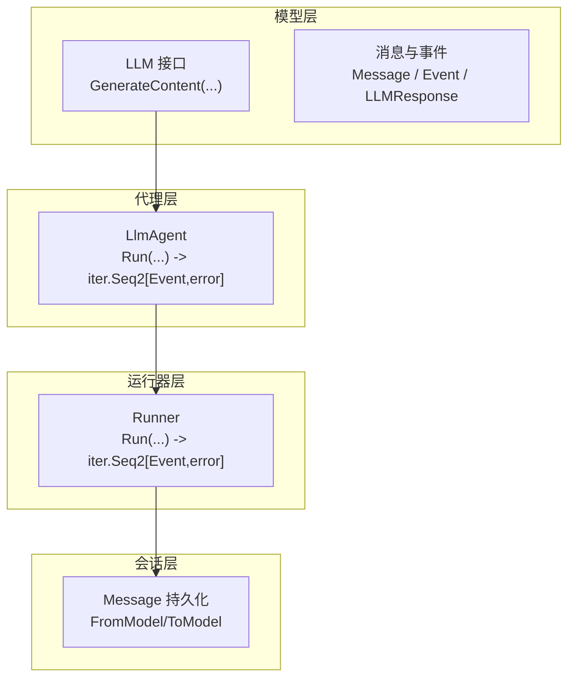
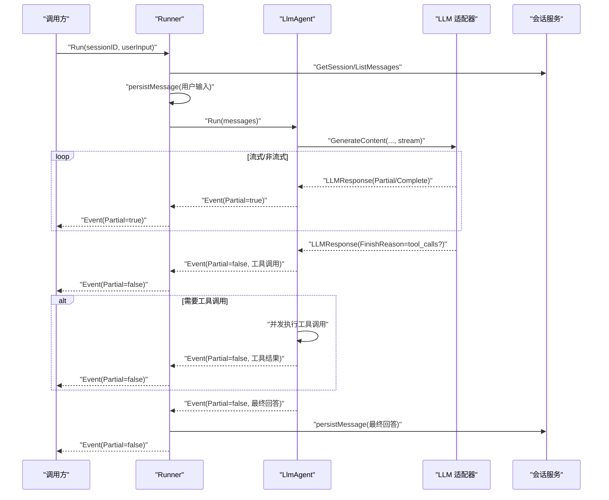
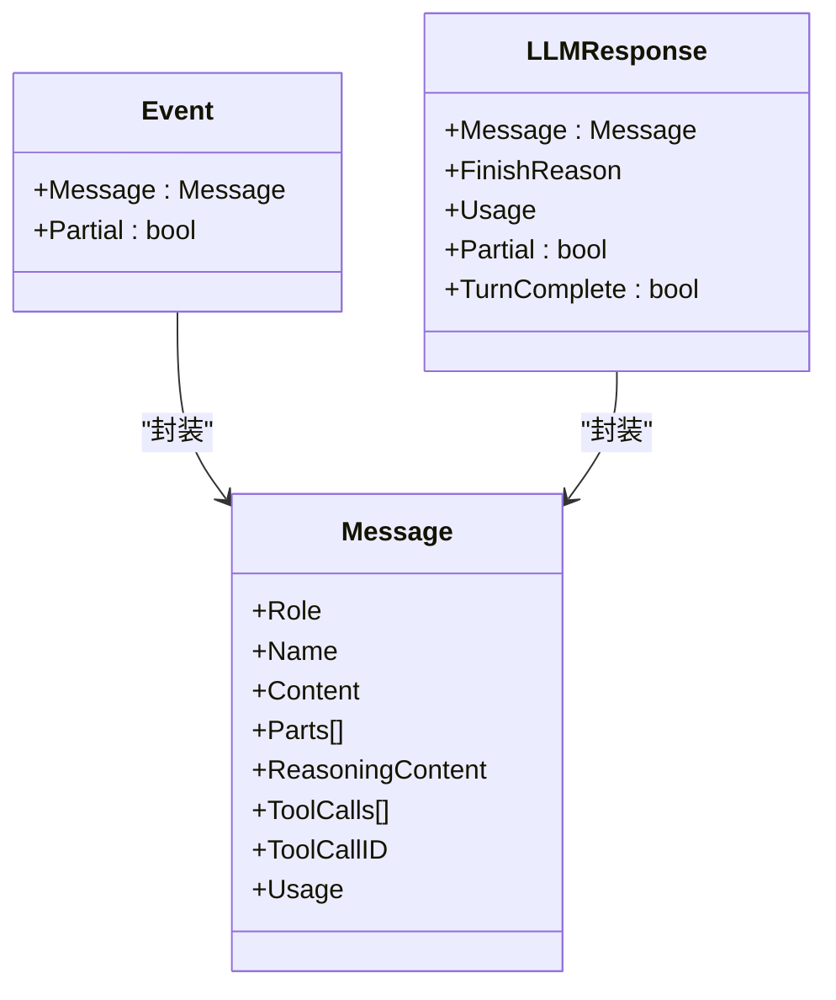
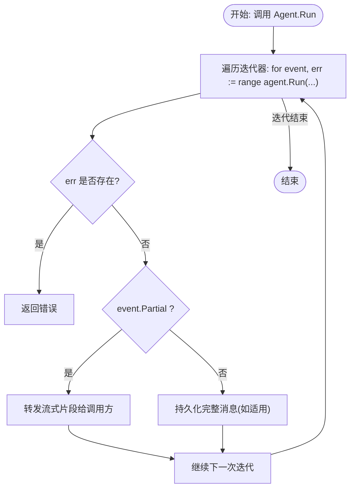
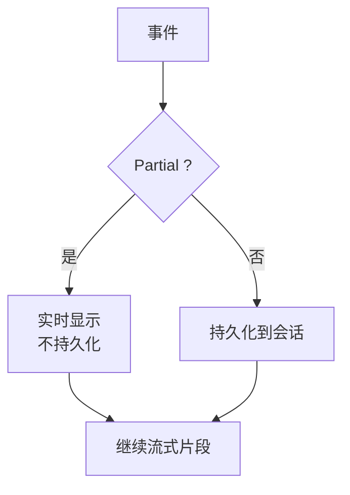
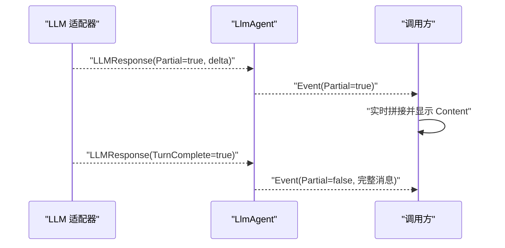
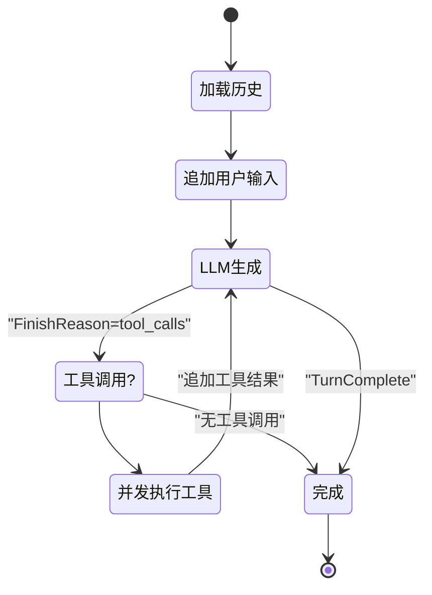
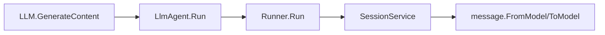

# 事件流处理

<cite>
**本文引用的文件**
- [README.md](file://README.md)
- [model.go](file://model/model.go)
- [agent.go](file://agent/agent.go)
- [llmagent.go](file://agent/llmagent/llmagent.go)
- [runner.go](file://runner/runner.go)
- [openai.go](file://model/openai/openai.go)
- [gemini.go](file://model/gemini/gemini.go)
- [message.go](file://session/message/message.go)
- [main.go](file://examples/chat/main.go)
- [runner_test.go](file://runner/runner_test.go)
- [llmagent_test.go](file://agent/llmagent/llmagent_test.go)
</cite>

## 目录
1. [简介](#简介)
2. [项目结构](#项目结构)
3. [核心组件](#核心组件)
4. [架构总览](#架构总览)
5. [详细组件分析](#详细组件分析)
6. [依赖关系分析](#依赖关系分析)
7. [性能考量](#性能考量)
8. [故障排查指南](#故障排查指南)
9. [结论](#结论)
10. [附录](#附录)

## 简介
本文件系统性解析 ADK 框架中的事件流处理机制与流式输出实现，围绕以下目标展开：
- 深入阐述 Event 结构设计：消息内容、部分标志与错误处理
- 解释 Go 迭代器（iter.Seq2）在事件流中的应用，如何实现真正的流式处理
- 区分 Partial 事件与完整事件，展示实时文本片段显示的实现原理
- 描述事件流生命周期：从事件产生到消费的完整过程
- 介绍流式处理在聊天应用中的实际应用，包括用户体验优化与性能考虑
- 提供事件流处理最佳实践：错误处理、超时控制与资源管理
- 展示在不同代理与工具中实现一致的流式体验

## 项目结构
ADK 的事件流处理围绕“模型抽象—代理—运行器—会话”四层协作展开：
- 模型层：统一 LLM 接口与消息类型，定义事件与响应结构
- 代理层：状态无关的智能体，负责驱动 LLM 生成与工具调用循环
- 运行器层：协调会话加载、消息持久化与事件转发
- 会话层：消息持久化与压缩，支持增量存储与软归档

图表来源
- [model.go:10-226](file://model/model.go#L10-L226)
- [agent.go:10-19](file://agent/agent.go#L10-L19)
- [llmagent.go:60-136](file://agent/llmagent/llmagent.go#L60-L136)
- [runner.go:45-96](file://runner/runner.go#L45-L96)
- [message.go:49-128](file://session/message/message.go#L49-L128)

章节来源
- [README.md: 第37-90行:37-90](file://README.md#L37-L90)
- [model.go: 第10-L226:10-226](file://model/model.go#L10-L226)
- [agent.go: 第10-L19:10-19](file://agent/agent.go#L10-L19)
- [runner.go: 第17-L96:17-96](file://runner/runner.go#L17-L96)
- [message.go: 第49-L128:49-128](file://session/message/message.go#L49-L128)

## 核心组件
- Event：事件载体，封装 Message 并通过 Partial 标志区分流式片段与完整消息
- Message：对话消息，包含角色、内容、多模态部件、推理内容、工具调用等
- LLMResponse：LLM 响应，支持 Partial 流式片段与 TurnComplete 完整收尾
- Agent.Run：返回 iter.Seq2[Event, error]，逐个产出事件
- Runner.Run：加载历史、追加用户输入、转发事件并仅持久化完整事件
- LlmAgent：驱动 LLM 生成，处理工具调用循环，按需流式输出

章节来源
- [model.go: 第214-L226:214-226](file://model/model.go#L214-L226)
- [model.go: 第152-L212:152-212](file://model/model.go#L152-L212)
- [agent.go: 第10-L19:10-19](file://agent/agent.go#L10-L19)
- [runner.go: 第45-L96:45-96](file://runner/runner.go#L45-L96)
- [llmagent.go: 第60-L136:60-136](file://agent/llmagent/llmagent.go#L60-L136)

## 架构总览
事件流自下而上的关键路径如下：
- LLM 适配器（如 OpenAI、Gemini）在 GenerateContent 中按流式或非流式模式产出 LLMResponse
- LlmAgent 将 LLMResponse 转换为 Event，并在需要时并发执行工具调用
- Runner 加载会话历史、追加用户输入、转发事件；仅对完整事件进行持久化
- 会话层通过 FromModel/ToModel 在内存或数据库中保存消息

图表来源
- [runner.go: 第45-L96:45-96](file://runner/runner.go#L45-L96)
- [llmagent.go: 第78-L136:78-136](file://agent/llmagent/llmagent.go#L78-L136)
- [openai.go: 第48-L164:48-164](file://model/openai/openai.go#L48-L164)
- [gemini.go: 第128-L167:128-167](file://model/gemini/gemini.go#L128-L167)

## 详细组件分析

### Event 结构与消息设计
- Event.Message：封装一次事件的消息内容
- Event.Partial：true 表示流式片段（仅 Content/ReasoningContent 有效），false 表示完整消息
- Message：包含角色、纯文本内容、多模态部件、推理内容、工具调用、用量统计等
- LLMResponse：与 Event 对应，支持 Partial 与 TurnComplete，用于标识完整收尾

图表来源
- [model.go: 第214-L226:214-226](file://model/model.go#L214-L226)
- [model.go: 第152-L212:152-212](file://model/model.go#L152-L212)

章节来源
- [model.go: 第214-L226:214-226](file://model/model.go#L214-L226)
- [model.go: 第152-L212:152-212](file://model/model.go#L152-L212)

### Go 迭代器（iter.Seq2）在事件流中的应用
- Agent.Run 返回 iter.Seq2[*Event, error]，允许调用方以 for-range 方式增量消费事件
- Runner.Run 同样返回 iter.Seq2[*Event, error]，在内部逐个转发事件并按需持久化
- LLM 适配器在流式模式下，逐片产出 LLMResponse，再由 LlmAgent 转换为 Event

图表来源
- [agent.go: 第10-L19:10-19](file://agent/agent.go#L10-L19)
- [runner.go: 第45-L96:45-96](file://runner/runner.go#L45-L96)
- [llmagent.go: 第78-L94:78-94](file://agent/llmagent/llmagent.go#L78-L94)

章节来源
- [agent.go: 第10-L19:10-19](file://agent/agent.go#L10-L19)
- [runner.go: 第45-L96:45-96](file://runner/runner.go#L45-L96)
- [llmagent.go: 第78-L94:78-94](file://agent/llmagent/llmagent.go#L78-L94)

### Partial 事件与完整事件的区别
- Partial 事件（Partial=true）
  - 仅携带增量文本（Content/ReasoningContent），其他字段可为空
  - 用于实时显示，不持久化
- 完整事件（Partial=false）
  - Message 完整组装，可能包含工具调用、用量统计等
  - 仅持久化完整事件，确保会话历史的完整性

图表来源
- [runner.go: 第76-L94:76-94](file://runner/runner.go#L76-L94)
- [model.go: 第214-L226:214-226](file://model/model.go#L214-L226)

章节来源
- [runner.go: 第76-L94:76-94](file://runner/runner.go#L76-L94)
- [runner_test.go: 第311-L356:311-356](file://runner/runner_test.go#L311-L356)

### 实时文本片段显示的实现原理
- LLM 适配器在流式模式下，逐片产出增量文本（delta），封装为 LLMResponse（Partial=true）
- LlmAgent 将其转换为 Event（Partial=true）并立即转发
- 调用方在收到 Partial 事件后，可直接拼接并显示，实现“打字机”效果

图表来源
- [openai.go: 第96-L164:96-164](file://model/openai/openai.go#L96-L164)
- [llmagent.go: 第78-L106:78-106](file://agent/llmagent/llmagent.go#L78-L106)

章节来源
- [openai.go: 第96-L164:96-164](file://model/openai/openai.go#L96-L164)
- [llmagent.go: 第78-L106:78-106](file://agent/llmagent/llmagent.go#L78-L106)
- [main.go: 第144-L169:144-169](file://examples/chat/main.go#L144-L169)

### 事件流生命周期：从产生到消费
- 会话加载：Runner 获取历史消息并转换为模型消息
- 用户输入：Runner 追加并持久化用户消息
- LLM 生成：LlmAgent 调用 LLM.GenerateContent，产出 Partial/Complete
- 工具调用：若 FinishReason 为工具调用，则并发执行工具并产出工具结果事件
- 消费与持久化：Runner 仅对 Complete 事件进行持久化，Partial 事件实时转发

图表来源
- [runner.go: 第45-L96:45-96](file://runner/runner.go#L45-L96)
- [llmagent.go: 第78-L136:78-136](file://agent/llmagent/llmagent.go#L78-L136)

章节来源
- [runner.go: 第45-L96:45-96](file://runner/runner.go#L45-L96)
- [llmagent.go: 第78-L136:78-136](file://agent/llmagent/llmagent.go#L78-L136)

### 流式处理在聊天应用中的实际应用
- 用户体验：Partial 事件实现实时打字机效果，降低感知延迟
- 工具调用可视化：当出现工具调用时，可在 UI 中提示“正在调用工具”，提升透明度
- 示例程序展示了在命令行中逐字打印 Partial 内容，并在工具调用前后插入提示

章节来源
- [main.go: 第144-L169:144-169](file://examples/chat/main.go#L144-L169)
- [llmagent_test.go: 第550-L579:550-579](file://agent/llmagent/llmagent_test.go#L550-L579)

### 不同代理与工具中的流式一致性
- LlmAgent 统一将 LLMResponse 转换为 Event，保证 Partial/Complete 语义一致
- 并发工具执行：LlmAgent 使用 goroutine 并发执行工具调用，保持顺序一致性并通过消息队列追加回对话历史
- 适配器一致性：OpenAI 与 Gemini 适配器均遵循 Partial/TurnComplete 语义，向上层暴露统一接口

章节来源
- [llmagent.go: 第116-L133:116-133](file://agent/llmagent/llmagent.go#L116-L133)
- [openai.go: 第48-L164:48-164](file://model/openai/openai.go#L48-L164)
- [gemini.go: 第128-L167:128-167](file://model/gemini/gemini.go#L128-L167)

## 依赖关系分析
- Agent.Run 依赖 LLM.GenerateContent，后者根据 stream 参数决定是否产出 Partial
- Runner.Run 依赖 Agent.Run，并在内部转发事件，仅对 Complete 事件持久化
- 会话层通过 message.FromModel/ToModel 在模型消息与持久化消息之间转换

图表来源
- [model.go: 第10-L18:10-18](file://model/model.go#L10-L18)
- [llmagent.go: 第78-L106:78-106](file://agent/llmagent/llmagent.go#L78-L106)
- [runner.go: L76-L94:76-94](file://runner/runner.go#L76-L94)
- [message.go: L103-L128:103-128](file://session/message/message.go#L103-L128)

章节来源
- [model.go: 第10-L18:10-18](file://model/model.go#L10-L18)
- [llmagent.go: 第78-L106:78-106](file://agent/llmagent/llmagent.go#L78-L106)
- [runner.go: 第76-L94:76-94](file://runner/runner.go#L76-L94)
- [message.go: 第103-L128:103-128](file://session/message/message.go#L103-L128)

## 性能考量
- 流式传输减少首字节延迟，提升交互流畅度
- 并发工具执行缩短端到端时间，但需注意上下文取消与错误传播
- 仅持久化完整事件，避免频繁写入，提高吞吐
- 多模态消息（图片）在用户侧使用，避免在流式片段中传输大体积数据

## 故障排查指南
- 错误处理
  - Agent.Run/LlmAgent.Run/Runner.Run 在遇到错误时，通过迭代器返回 error，调用方可据此中断或重试
  - LLM 适配器在流式读取过程中若发生底层错误，会包装为 error 上抛
- 超时控制
  - 使用 context 控制 LLM 请求与工具执行的生命周期，避免长时间阻塞
- 资源管理
  - 并发工具执行完成后及时释放 goroutine 资源
  - 会话持久化使用雪花 ID 与时间戳，确保唯一性与有序性

章节来源
- [runner.go: 第78-L82:78-82](file://runner/runner.go#L78-L82)
- [llmagent.go: 第82-L84:82-84](file://agent/llmagent/llmagent.go#L82-L84)
- [openai.go: 第139-L142:139-142](file://model/openai/openai.go#L139-L142)
- [runner.go: L100-L107:100-107](file://runner/runner.go#L100-L107)

## 结论
ADK 通过统一的 Event/Message 抽象与 Go 迭代器（iter.Seq2），实现了跨模型、跨工具的一致流式体验。Partial 事件与完整事件的清晰划分，使前端能够实时渲染文本片段，同时后端仅持久化完整消息，兼顾了用户体验与数据完整性。配合 Runner 的会话管理与 LlmAgent 的工具调用循环，ADK 为构建高性能、可扩展的智能体应用提供了坚实基础。

## 附录
- 示例程序展示了如何在命令行中启用流式输出、处理工具调用以及实时显示 Partial 事件
- 单元测试验证了 Partial 事件的转发与不持久化、工具调用场景下的事件序列正确性

章节来源
- [main.go: 第126-L177:126-177](file://examples/chat/main.go#L126-L177)
- [runner_test.go: 第311-L356:311-356](file://runner/runner_test.go#L311-L356)
- [llmagent_test.go: 第550-L579:550-579](file://agent/llmagent/llmagent_test.go#L550-L579)