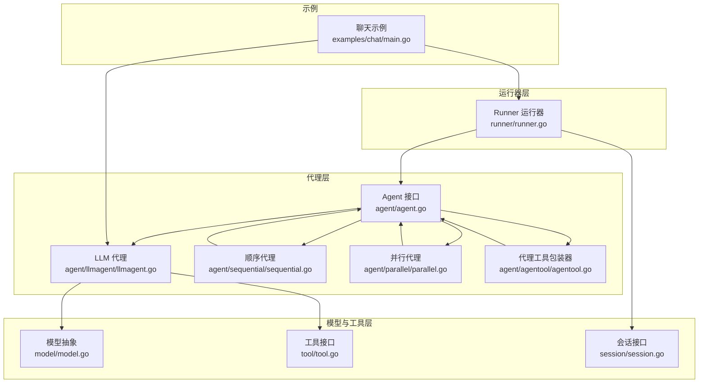
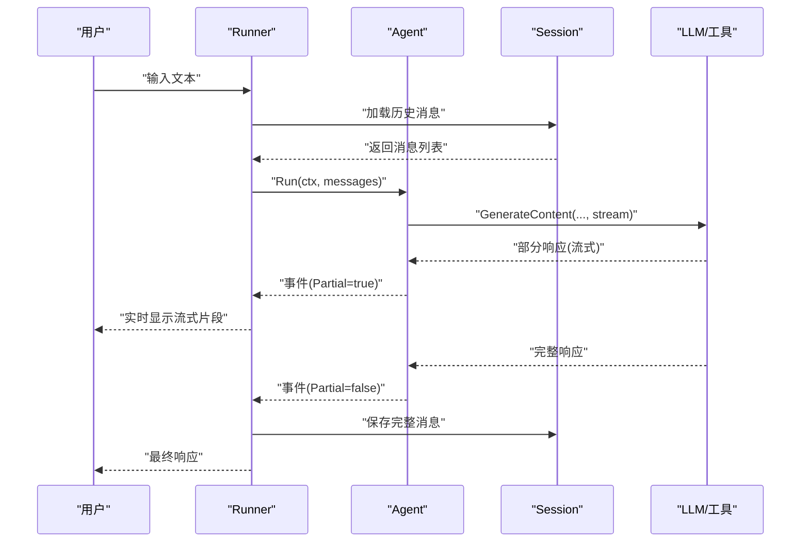
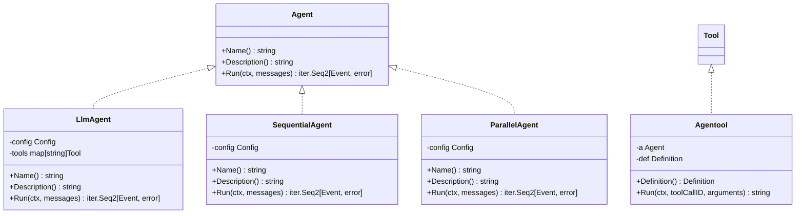
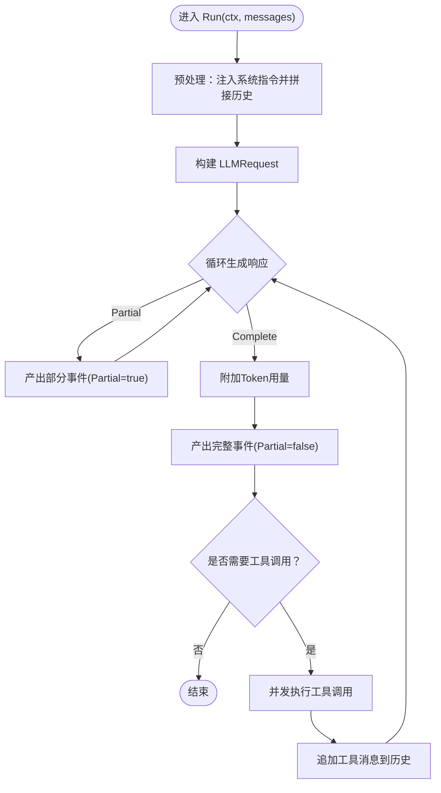
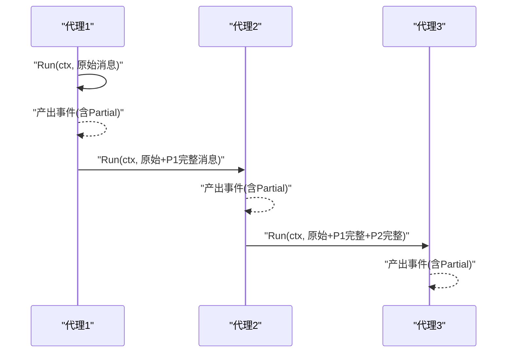
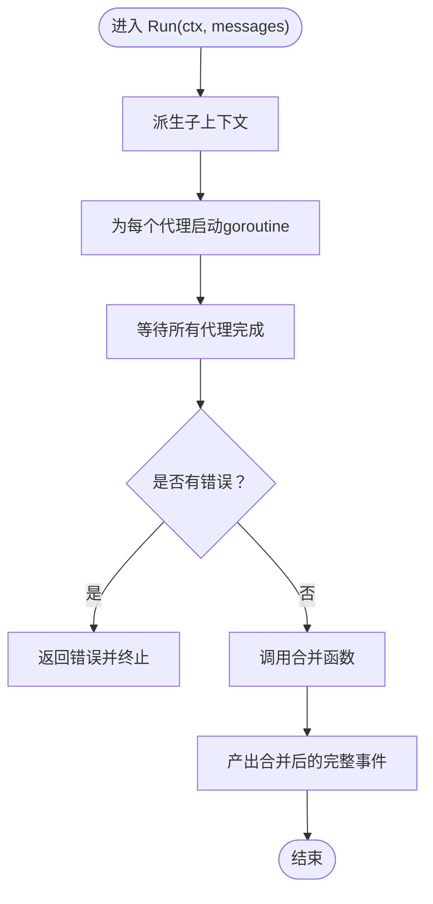
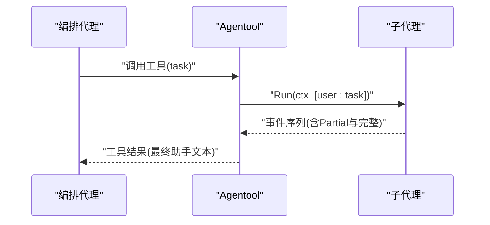
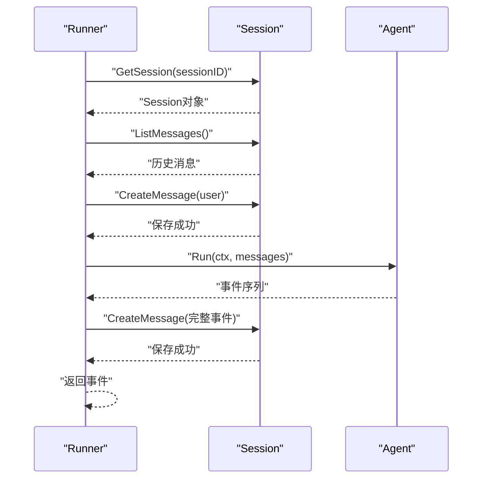
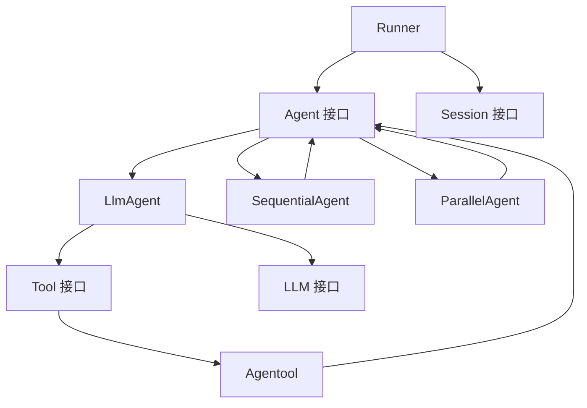

# 代理架构设计

<cite>
**本文档引用的文件**
- [agent.go](file://agent/agent.go)
- [llmagent.go](file://agent/llmagent/llmagent.go)
- [sequential.go](file://agent/sequential/sequential.go)
- [parallel.go](file://agent/parallel/parallel.go)
- [agentool.go](file://agent/agentool/agentool.go)
- [runner.go](file://runner/runner.go)
- [model.go](file://model/model.go)
- [tool.go](file://tool/tool.go)
- [session.go](file://session/session.go)
- [main.go](file://examples/chat/main.go)
- [llmagent_test.go](file://agent/llmagent/llmagent_test.go)
- [sequential_test.go](file://agent/sequential/sequential_test.go)
- [parallel_test.go](file://agent/parallel/parallel_test.go)
- [agentool_test.go](file://agent/agentool/agentool_test.go)
</cite>

## 目录
1. [简介](#简介)
2. [项目结构](#项目结构)
3. [核心组件](#核心组件)
4. [架构总览](#架构总览)
5. [详细组件分析](#详细组件分析)
6. [依赖关系分析](#依赖关系分析)
7. [性能考虑](#性能考虑)
8. [故障排除指南](#故障排除指南)
9. [结论](#结论)

## 简介
本文件深入解析ADK框架中的代理架构设计，重点阐述无状态代理与有状态运行器的分离架构，解释关注点分离与代码复用的实现方式。文档详细分析Agent接口的设计思路（Name()、Description()、Run()），深入讲解LLM代理的实现机制（流式事件处理）、代理组合器（SequentialAgent、ParallelAgent）的工作原理，以及代理工具包装器（Agentool）的功能。同时提供具体使用场景与最佳实践，帮助开发者理解代理架构的优势与应用。

## 项目结构
ADK框架采用分层与模块化设计：
- agent：代理核心接口与实现（LLM代理、顺序代理、并行代理、代理工具包装）
- runner：有状态运行器，负责会话管理与消息持久化
- model：模型抽象与消息数据结构
- tool：工具接口与工具集
- session：会话服务接口
- examples：示例程序

**图表来源**
- [agent.go:10-19](file://agent/agent.go#L10-L19)
- [llmagent.go:30-46](file://agent/llmagent/llmagent.go#L30-L46)
- [sequential.go:30-41](file://agent/sequential/sequential.go#L30-L41)
- [parallel.go:86-101](file://agent/parallel/parallel.go#L86-L101)
- [agentool.go:18-48](file://agent/agentool/agentool.go#L18-L48)
- [runner.go:20-37](file://runner/runner.go#L20-L37)
- [model.go:10-18](file://model/model.go#L10-L18)
- [tool.go:17-23](file://tool/tool.go#L17-L23)
- [session.go:9-23](file://session/session.go#L9-L23)
- [main.go:52-125](file://examples/chat/main.go#L52-L125)

**章节来源**
- [agent.go:1-20](file://agent/agent.go#L1-L20)
- [runner.go:1-108](file://runner/runner.go#L1-L108)
- [model.go:1-227](file://model/model.go#L1-L227)
- [tool.go:1-24](file://tool/tool.go#L1-L24)
- [session.go:1-24](file://session/session.go#L1-L24)
- [main.go:1-181](file://examples/chat/main.go#L1-L181)

## 核心组件
本节聚焦代理架构的核心组件及其职责边界。

- Agent接口：定义代理的统一抽象，包含名称、描述与可迭代的事件流式输出。
- LlmAgent：无状态LLM驱动代理，支持工具调用循环与流式响应。
- SequentialAgent：顺序组合器，按序串联多个代理，共享上下文。
- ParallelAgent：并行组合器，同时运行多个代理并将结果合并为单条消息。
- Agentool：将任意Agent包装为Tool，使其可被其他代理以函数调用方式调用。
- Runner：有状态运行器，协调代理与会话服务，负责消息加载、持久化与事件转发。

这些组件共同实现了“无状态代理 + 有状态运行器”的分离，既保证了代理的可复用性与可组合性，又确保了会话状态与消息历史的正确管理。

**章节来源**
- [agent.go:10-19](file://agent/agent.go#L10-L19)
- [llmagent.go:30-46](file://agent/llmagent/llmagent.go#L30-L46)
- [sequential.go:30-41](file://agent/sequential/sequential.go#L30-L41)
- [parallel.go:86-101](file://agent/parallel/parallel.go#L86-L101)
- [agentool.go:18-48](file://agent/agentool/agentool.go#L18-L48)
- [runner.go:20-37](file://runner/runner.go#L20-L37)

## 架构总览
下图展示了从用户输入到最终响应的完整流程，以及各组件之间的交互关系。

**图表来源**
- [runner.go:45-95](file://runner/runner.go#L45-L95)
- [llmagent.go:60-136](file://agent/llmagent/llmagent.go#L60-L136)
- [model.go:13-17](file://model/model.go#L13-L17)

**章节来源**
- [runner.go:45-95](file://runner/runner.go#L45-L95)
- [llmagent.go:60-136](file://agent/llmagent/llmagent.go#L60-L136)
- [model.go:13-17](file://model/model.go#L13-L17)

## 详细组件分析

### Agent接口设计
Agent接口是整个代理体系的基石，定义了代理的最小必要能力：
- Name()：返回代理名称，用于标识与溯源。
- Description()：返回代理描述，便于人类理解与文档生成。
- Run(ctx, messages)：核心执行入口，返回一个可迭代的事件序列，支持流式事件（Partial=true）与完整事件（Partial=false）。

设计理念：
- 无状态：Agent不持有会话状态，确保可复用与可组合。
- 流式输出：通过事件序列支持实时渲染与用户体验优化。
- 关注点分离：Runner负责会话与持久化，Agent专注推理与工具调用。

**图表来源**
- [agent.go:10-19](file://agent/agent.go#L10-L19)
- [llmagent.go:30-46](file://agent/llmagent/llmagent.go#L30-L46)
- [sequential.go:30-41](file://agent/sequential/sequential.go#L30-L41)
- [parallel.go:86-101](file://agent/parallel/parallel.go#L86-L101)
- [agentool.go:18-48](file://agent/agentool/agentool.go#L18-L48)
- [tool.go:17-23](file://tool/tool.go#L17-L23)

**章节来源**
- [agent.go:10-19](file://agent/agent.go#L10-L19)

### LLM代理实现机制
LlmAgent是无状态代理的典型代表，其Run方法实现如下关键流程：
- 预处理：根据配置注入系统指令，拼接历史消息。
- 请求生成：构建LLM请求，包含模型名、消息历史与可用工具。
- 流式生成：调用LLM的GenerateContent，逐个产出部分响应（Partial=true）与完整响应（Partial=false）。
- 工具调用：当FinishReason为工具调用时，按顺序执行所有工具调用，并将结果作为工具消息追加至历史。
- 上下文更新：每次完整响应后，将助手消息加入历史，供后续轮次使用。

**图表来源**
- [llmagent.go:60-136](file://agent/llmagent/llmagent.go#L60-L136)

**章节来源**
- [llmagent.go:56-136](file://agent/llmagent/llmagent.go#L56-L136)
- [model.go:188-227](file://model/model.go#L188-L227)

### 顺序代理（SequentialAgent）
SequentialAgent将多个代理按序串联，形成固定流水线：
- 输入构建：每个代理接收原始消息与之前所有代理产生的完整消息。
- 手递消息：在非首个代理前注入手递用户消息，确保对话格式符合预期。
- 事件转发：逐个代理运行，将每个事件原样转发；仅完整消息参与累积上下文。
- 错误传播：任一代理错误即终止并向上游传播。

**图表来源**
- [sequential.go:56-91](file://agent/sequential/sequential.go#L56-L91)

**章节来源**
- [sequential.go:46-91](file://agent/sequential/sequential.go#L46-L91)

### 并行代理（ParallelAgent）
ParallelAgent同时运行多个代理，然后将结果合并为单一完整消息：
- 并发执行：为每个子代理启动独立goroutine，共享派生上下文。
- 结果收集：仅收集完整消息（忽略流式片段），按定义顺序组织。
- 错误处理：任一代理出错立即取消其他代理，向上游返回错误。
- 合并策略：默认合并器将每个代理的最后一条非空助手文本按代理名进行归因合并。

**图表来源**
- [parallel.go:125-174](file://agent/parallel/parallel.go#L125-L174)

**章节来源**
- [parallel.go:112-174](file://agent/parallel/parallel.go#L112-L174)

### 代理工具包装器（Agentool）
Agentool将任意Agent包装为Tool，使其可被其他代理通过函数调用机制调用：
- 定义生成：基于Agent的Name与Description生成工具定义，输入Schema为包含任务字符串的JSON模式。
- 调用执行：当被调用时，创建单用户消息（任务内容），运行被包装的Agent，仅收集最终助手文本作为工具结果返回。
- 用途：实现“代理作为工具”的编排，支持多级代理协作与任务委派。

**图表来源**
- [agentool.go:54-78](file://agent/agentool/agentool.go#L54-L78)

**章节来源**
- [agentool.go:29-78](file://agent/agentool/agentool.go#L29-L78)

### Runner运行器与会话集成
Runner负责将无状态代理与有状态会话服务连接起来：
- 会话加载：获取指定会话的历史消息，转换为模型消息列表。
- 用户消息持久化：将用户输入作为完整消息保存，避免流式片段写入。
- 事件转发：将代理产生的事件逐个转发给调用方；仅完整事件写回会话。
- Snowflake ID：为每条消息分配唯一ID并记录时间戳。

**图表来源**
- [runner.go:45-95](file://runner/runner.go#L45-L95)

**章节来源**
- [runner.go:45-95](file://runner/runner.go#L45-L95)

## 依赖关系分析
代理架构的耦合与内聚特征：
- 低耦合：Agent接口与Runner解耦，Agent不依赖会话服务；组合器仅依赖Agent接口。
- 高内聚：LLM代理封装了模型调用、工具调用与流式处理；组合器专注于控制流与上下文传递。
- 外部依赖：Runner依赖会话服务；示例程序依赖OpenAI模型与MCP工具集。

**图表来源**
- [agent.go:10-19](file://agent/agent.go#L10-L19)
- [llmagent.go:30-46](file://agent/llmagent/llmagent.go#L30-L46)
- [sequential.go:30-41](file://agent/sequential/sequential.go#L30-L41)
- [parallel.go:86-101](file://agent/parallel/parallel.go#L86-L101)
- [agentool.go:18-48](file://agent/agentool/agentool.go#L18-L48)
- [runner.go:20-37](file://runner/runner.go#L20-L37)
- [model.go:10-18](file://model/model.go#L10-L18)
- [tool.go:17-23](file://tool/tool.go#L17-L23)
- [session.go:9-23](file://session/session.go#L9-L23)

**章节来源**
- [agent.go:10-19](file://agent/agent.go#L10-L19)
- [runner.go:20-37](file://runner/runner.go#L20-L37)
- [model.go:10-18](file://model/model.go#L10-L18)
- [tool.go:17-23](file://tool/tool.go#L17-L23)
- [session.go:9-23](file://session/session.go#L9-L23)

## 性能考虑
- 流式渲染：通过Partial事件实现边生成边显示，降低感知延迟。
- 并发工具执行：LLM代理在检测到多个工具调用时并发执行，缩短端到端时延。
- 并行组合：ParallelAgent并发运行多个代理，适合对比或并行计算场景。
- 会话持久化：Runner仅保存完整消息，避免重复写入流式片段，减少IO开销。
- 上下文截断：建议在实际部署中结合会话压缩策略，控制历史长度以维持性能。

## 故障排除指南
- 代理未产生完整消息：检查LLM的FinishReason与工具调用链是否正确收尾。
- 流式事件缺失：确认LlmAgent的Stream配置与上游调用方是否正确消费Partial事件。
- 并发工具执行异常：检查工具定义与参数解析，确保工具名称匹配且参数JSON有效。
- 组合器错误传播：SequentialAgent与ParallelAgent会在任一子代理出错时终止，需定位首个错误源。
- 会话持久化失败：确认Session服务可用性与消息ID生成逻辑（Snowflake节点）。

**章节来源**
- [llmagent_test.go:582-672](file://agent/llmagent/llmagent_test.go#L582-L672)
- [sequential_test.go:296-328](file://agent/sequential/sequential_test.go#L296-L328)
- [parallel_test.go:315-349](file://agent/parallel/parallel_test.go#L315-L349)
- [agentool_test.go:59-136](file://agent/agentool/agentool_test.go#L59-L136)

## 结论
ADK框架通过“无状态代理 + 有状态运行器”的分离设计，实现了高度的可复用性与可组合性。Agent接口统一了代理行为，LLM代理提供了强大的工具调用与流式能力，组合器支持顺序与并行编排，Agentool则打通了代理到工具的桥梁。Runner将代理与会话服务无缝衔接，保障了消息历史的正确管理与持久化。该架构既满足了复杂业务场景的需求，又保持了清晰的职责边界与良好的扩展性。