# 会话管理机制

<cite>
**本文档引用的文件**
- [session/session.go](file://session/session.go)
- [session/session_service.go](file://session/session_service.go)
- [session/message/message.go](file://session/message/message.go)
- [session/memory/session_service.go](file://session/memory/session_service.go)
- [session/database/session_service.go](file://session/database/session_service.go)
- [session/memory/session.go](file://session/memory/session.go)
- [session/database/session.go](file://session/database/session.go)
- [session/memory/session_test.go](file://session/memory/session_test.go)
- [session/database/session_test.go](file://session/database/session_test.go)
- [session/memory/session_service_test.go](file://session/memory/session_service_test.go)
- [session/database/session_service_test.go](file://session/database/session_service_test.go)
- [README.md](file://README.md)
</cite>

## 目录
1. [简介](#简介)
2. [项目结构](#项目结构)
3. [核心组件](#核心组件)
4. [架构概览](#架构概览)
5. [详细组件分析](#详细组件分析)
6. [依赖关系分析](#依赖关系分析)
7. [性能考虑](#性能考虑)
8. [故障排除指南](#故障排除指南)
9. [结论](#结论)

## 简介

ADK（Agent Development Kit）框架的会话管理系统是一个高度模块化的设计，旨在为AI代理应用提供灵活的消息历史管理和持久化解决方案。该系统的核心设计理念是通过接口抽象实现可插拔的存储后端，支持内存和数据库两种不同的存储方式，同时提供消息历史软归档机制以维护长期对话的上下文完整性。

会话管理机制的关键特性包括：
- **可插拔存储后端**：支持内存和数据库两种存储方式
- **消息历史软归档**：通过时间戳标记而非物理删除实现历史压缩
- **分页查询支持**：高效处理大量历史消息的检索
- **事务安全保障**：数据库操作的原子性和一致性保证
- **工具调用支持**：完整的工具调用链路追踪

## 项目结构

ADK框架的会话管理模块采用清晰的分层架构设计，主要包含以下核心目录和文件：

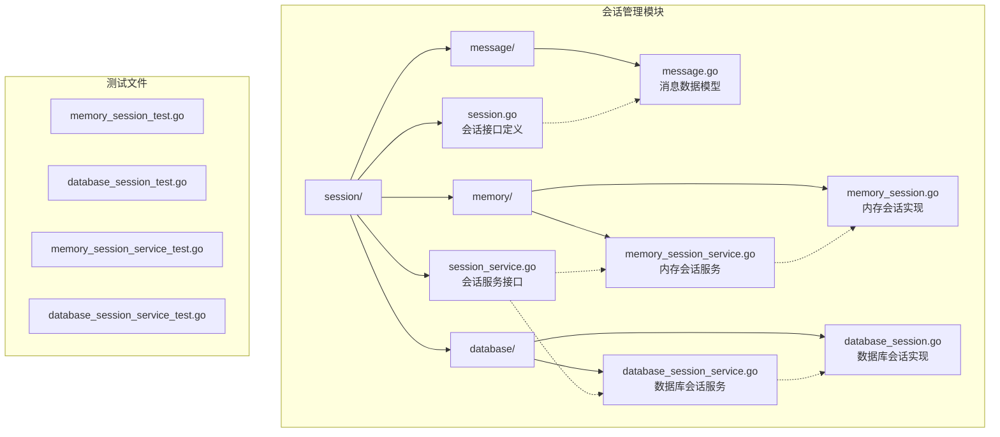

**图表来源**
- [session/session.go:1-24](file://session/session.go#L1-L24)
- [session/session_service.go:1-10](file://session/session_service.go#L1-L10)
- [session/message/message.go:1-129](file://session/message/message.go#L1-L129)

**章节来源**
- [README.md:67-89](file://README.md#L67-L89)

## 核心组件

会话管理系统的四个核心组件构成了完整的消息历史管理解决方案：

### Session 接口
Session接口定义了会话的基本操作能力，包括消息的创建、查询、删除和历史归档功能。该接口确保了不同存储后端的一致性行为。

### SessionService 接口  
SessionService接口负责会话的生命周期管理，包括会话的创建、获取和删除操作。它为上层应用提供了统一的会话访问入口。

### Message 数据模型
Message结构体定义了持久化消息的完整数据结构，支持角色、内容、工具调用等丰富字段，并提供了与模型消息类型的双向转换功能。

### ToolCalls 类型系统
ToolCalls类型实现了数据库驱动的值接口，支持JSON序列化和反序列化，确保工具调用信息能够在数据库中正确存储和检索。

**章节来源**
- [session/session.go:9-23](file://session/session.go#L9-L23)
- [session/session_service.go:5-9](file://session/session_service.go#L5-L9)
- [session/message/message.go:49-128](file://session/message/message.go#L49-L128)

## 架构概览

ADK框架的会话管理架构采用了清晰的分层设计，实现了关注点分离和高内聚低耦合的设计原则：

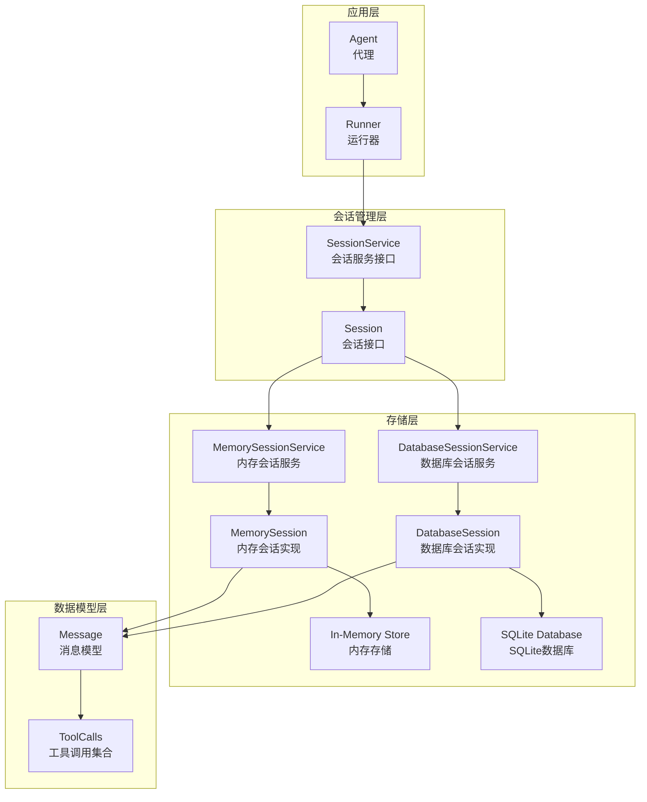

**图表来源**
- [session/session.go:9-23](file://session/session.go#L9-L23)
- [session/session_service.go:5-9](file://session/session_service.go#L5-L9)
- [session/memory/session_service.go:10-16](file://session/memory/session_service.go#L10-L16)
- [session/database/session_service.go:19-25](file://session/database/session_service.go#L19-L25)

该架构设计的关键优势：
- **接口抽象**：通过接口定义消除了具体实现的耦合
- **可插拔设计**：支持动态切换不同的存储后端
- **职责分离**：每层都有明确的职责边界
- **扩展性**：易于添加新的存储后端实现

## 详细组件分析

### SessionService 接口设计

SessionService接口的设计体现了简洁而强大的原则，仅包含三个核心方法：

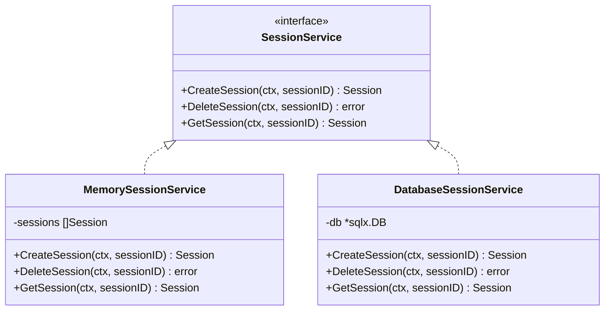

**图表来源**
- [session/session_service.go:5-9](file://session/session_service.go#L5-L9)
- [session/memory/session_service.go:10-16](file://session/memory/session_service.go#L10-L16)
- [session/database/session_service.go:19-25](file://session/database/session_service.go#L19-L25)

#### 设计思路分析

1. **最小接口原则**：只暴露必要的方法，避免过度设计
2. **上下文传递**：所有方法都接受context参数，支持取消和超时控制
3. **错误处理**：明确区分不存在的情况（返回nil）和真正的错误
4. **ID管理**：SessionID由上层应用生成，支持雪花算法等分布式ID方案

**章节来源**
- [session/session_service.go:5-9](file://session/session_service.go#L5-L9)

### Session 接口实现

Session接口定义了完整的会话操作能力，支持消息的历史管理和软归档功能：

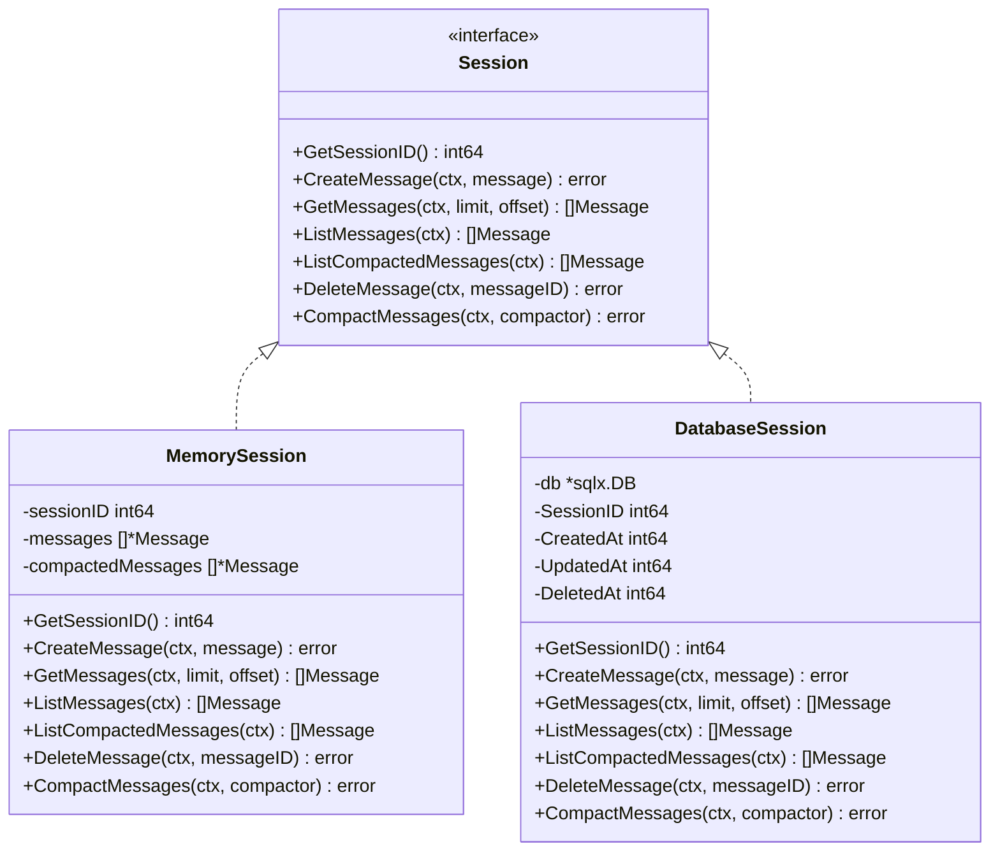

**图表来源**
- [session/session.go:9-23](file://session/session.go#L9-L23)
- [session/memory/session.go:12-24](file://session/memory/session.go#L12-L24)
- [session/database/session.go:26-32](file://session/database/session.go#L26-L32)

#### 消息历史软归档机制

软归档机制是会话管理的核心创新，通过时间戳标记而非物理删除实现历史压缩：

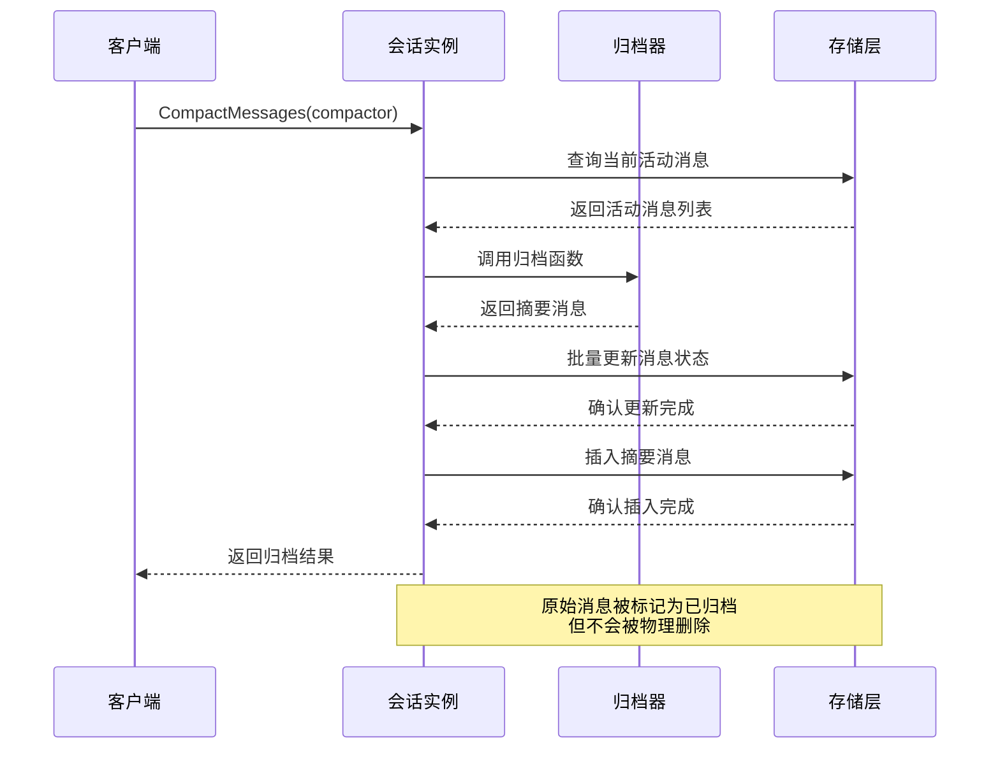

**图表来源**
- [session/memory/session.go:70-85](file://session/memory/session.go#L70-L85)
- [session/database/session.go:97-145](file://session/database/session.go#L97-L145)

**章节来源**
- [session/session.go:12-22](file://session/session.go#L12-L22)

### 内存后端实现

内存后端提供了零配置的快速开发体验，适用于测试环境和单进程应用：

#### 内存会话服务

内存会话服务使用切片存储所有会话实例，提供O(n)的查找复杂度：

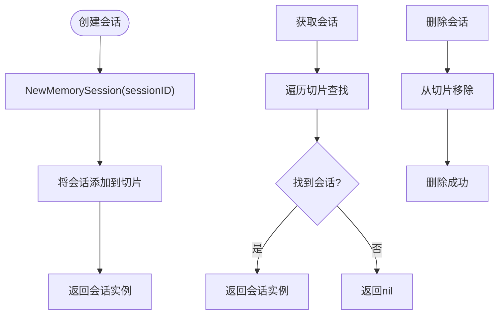

**图表来源**
- [session/memory/session_service.go:18-40](file://session/memory/session_service.go#L18-L40)

#### 内存会话实现

内存会话使用两个切片分别存储活动消息和已归档消息：

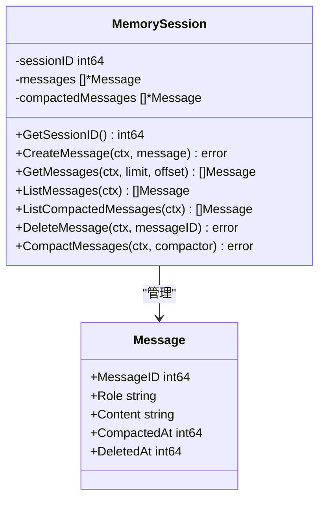

**图表来源**
- [session/memory/session.go:12-24](file://session/memory/session.go#L12-L24)

**章节来源**
- [session/memory/session.go:18-85](file://session/memory/session.go#L18-L85)

### 数据库后端实现

数据库后端提供了持久化的存储解决方案，支持跨进程和跨重启的数据保持：

#### 数据库会话服务

数据库会话服务通过SQLX库提供类型安全的数据库操作：

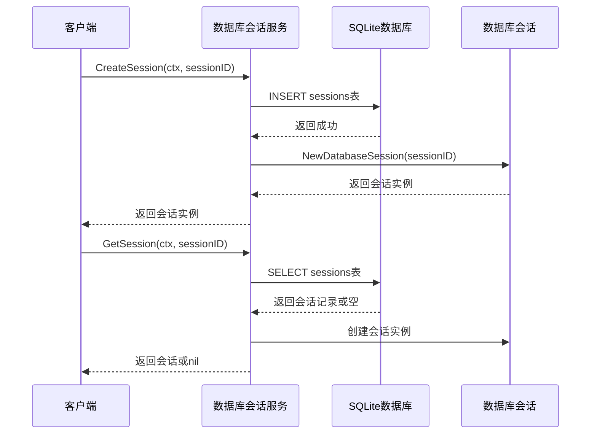

**图表来源**
- [session/database/session_service.go:27-48](file://session/database/session_service.go#L27-L48)

#### 数据库会话实现

数据库会话实现了完整的CRUD操作和事务管理：

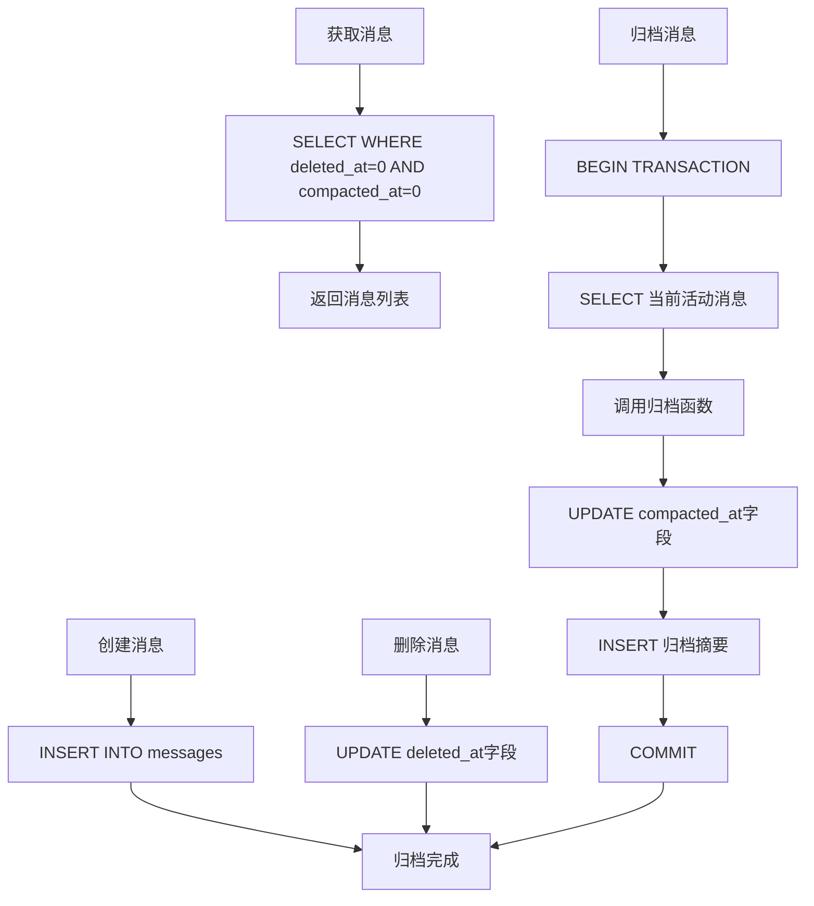

**图表来源**
- [session/database/session.go:46-145](file://session/database/session.go#L46-L145)

**章节来源**
- [session/database/session.go:34-145](file://session/database/session.go#L34-L145)

### 消息类型定义和管理

消息系统的设计充分考虑了多模态内容和工具调用的支持：

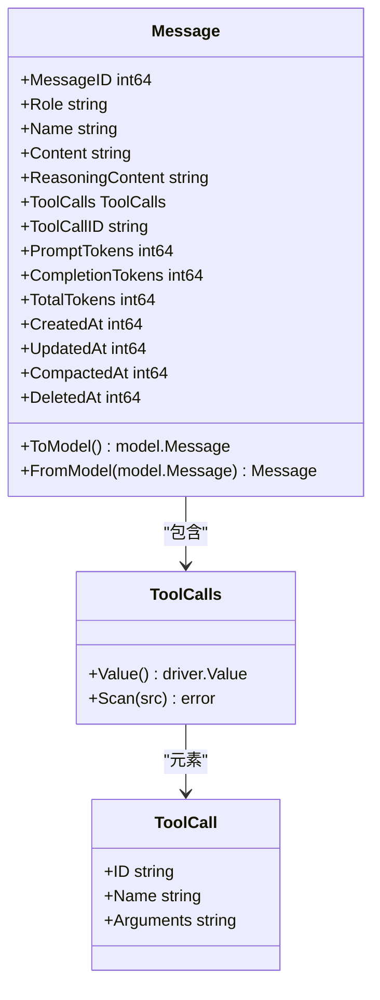

**图表来源**
- [session/message/message.go:49-128](file://session/message/message.go#L49-L128)

#### 工具调用序列化机制

ToolCalls类型实现了数据库驱动的值接口，确保工具调用信息能够正确序列化和反序列化：

**章节来源**
- [session/message/message.go:11-47](file://session/message/message.go#L11-L47)

## 依赖关系分析

会话管理系统的依赖关系体现了清晰的分层架构和最小依赖原则：

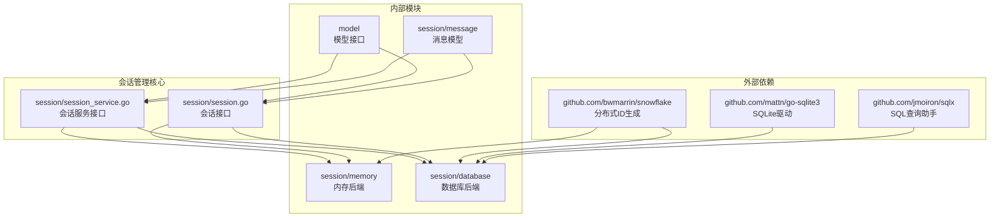

**图表来源**
- [session/database/session_service.go:3-12](file://session/database/session_service.go#L3-L12)
- [session/memory/session_service.go:3-8](file://session/memory/session_service.go#L3-L8)

### 外部依赖分析

1. **SQLX库**：提供类型安全的SQL操作和数据库连接管理
2. **SQLite驱动**：支持轻量级的本地数据库存储
3. **Snowflake库**：提供分布式、时间有序的ID生成

### 内部模块依赖

- **消息模块**：为所有会话实现提供统一的数据模型
- **模型接口**：确保与上游Agent和LLM组件的兼容性
- **工具模块**：支持工具调用的完整生命周期管理

**章节来源**
- [README.md:380-393](file://README.md#L380-L393)

## 性能考虑

会话管理系统的性能设计针对不同的使用场景进行了优化：

### 内存后端性能特征

| 操作类型 | 时间复杂度 | 空间复杂度 | 特点 |
|---------|-----------|-----------|------|
| 创建会话 | O(1) | O(1) | 直接实例化，无I/O开销 |
| 获取会话 | O(n) | O(1) | 需要遍历会话列表 |
| 删除会话 | O(n) | O(1) | 需要重新分配切片 |
| 创建消息 | O(1) | O(1) | 直接追加到切片末尾 |
| 查询消息 | O(k) | O(k) | k为返回消息数量 |

### 数据库后端性能特征

| 操作类型 | 时间复杂度 | 空间复杂度 | 特点 |
|---------|-----------|-----------|------|
| 创建会话 | O(1) | O(1) | 单条INSERT语句 |
| 获取会话 | O(1) | O(1) | 单条SELECT语句 |
| 删除会话 | O(1) | O(1) | UPDATE软删除 |
| 创建消息 | O(1) | O(1) | 单条INSERT语句 |
| 查询消息 | O(k) | O(k) | k为返回消息数量 |

### 适用场景建议

**内存后端适用于：**
- 测试环境和单元测试
- 单进程应用和短期会话
- 开发调试和原型验证
- 对延迟要求极高的场景

**数据库后端适用于：**
- 生产环境部署
- 需要持久化的应用
- 多进程或多实例部署
- 需要跨重启恢复的场景

## 故障排除指南

### 常见问题诊断

#### 会话获取失败
**症状**：GetSession返回nil且无错误
**可能原因**：
- 会话ID不存在
- 会话已被删除
- 数据库连接异常

**解决方法**：
1. 验证会话ID的有效性
2. 检查会话是否已被软删除
3. 确认数据库连接状态

#### 消息归档失败
**症状**：CompactMessages操作抛出异常
**可能原因**：
- 归档函数返回错误
- 数据库事务冲突
- 并发访问冲突

**解决方法**：
1. 检查归档函数的实现逻辑
2. 确保数据库连接池配置正确
3. 实现适当的重试机制

#### 性能问题
**症状**：查询响应时间过长
**可能原因**：
- 活动消息过多
- 缺少适当的索引
- 查询参数不当

**解决方法**：
1. 定期执行消息归档
2. 为常用查询字段建立索引
3. 使用分页查询减少单次返回量

**章节来源**
- [session/memory/session_test.go:196-220](file://session/memory/session_test.go#L196-L220)
- [session/database/session_test.go:238-266](file://session/database/session_test.go#L238-L266)

## 结论

ADK框架的会话管理系统展现了优秀的软件工程实践，通过清晰的接口抽象、可插拔的存储设计和完善的软归档机制，为AI代理应用提供了强大而灵活的消息历史管理能力。

### 主要优势

1. **设计优雅**：接口设计简洁明了，符合单一职责原则
2. **扩展性强**：支持轻松添加新的存储后端实现
3. **功能完备**：涵盖消息管理的所有核心需求
4. **性能优化**：针对不同场景提供最优的实现方案
5. **测试友好**：完整的单元测试覆盖关键功能

### 技术亮点

- **软归档机制**：通过时间戳标记实现历史压缩，既保持数据完整性又控制存储成本
- **事务安全保障**：数据库操作采用事务封装，确保数据一致性
- **分页查询优化**：支持大数据量场景下的高效消息检索
- **工具调用追踪**：完整的工具调用链路记录和恢复

### 发展建议

1. **监控指标**：建议添加会话大小、查询延迟等关键指标监控
2. **缓存策略**：可以考虑在内存后端实现LRU缓存提升性能
3. **批量操作**：支持批量消息创建和查询以提高吞吐量
4. **异步处理**：为长时间运行的操作提供异步执行选项

该会话管理系统为构建生产级AI代理应用奠定了坚实的基础，其模块化设计和清晰的架构为未来的功能扩展和技术演进提供了良好的支撑。