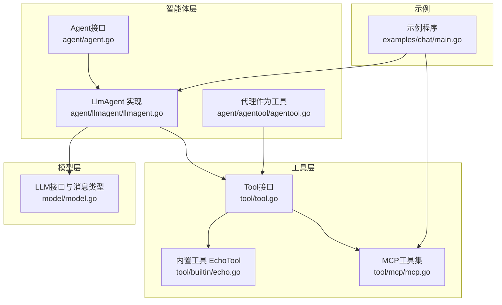
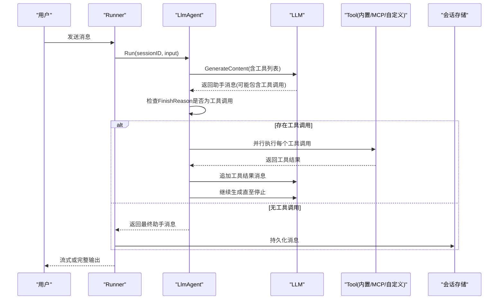
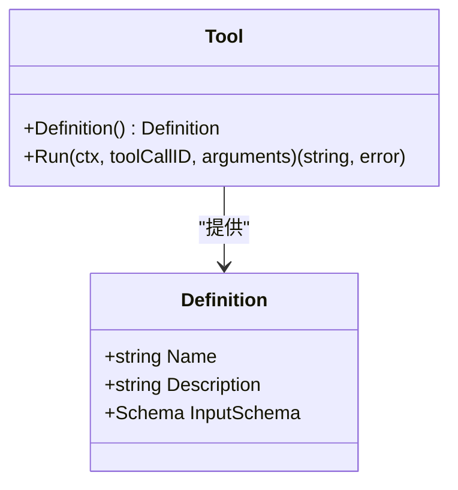
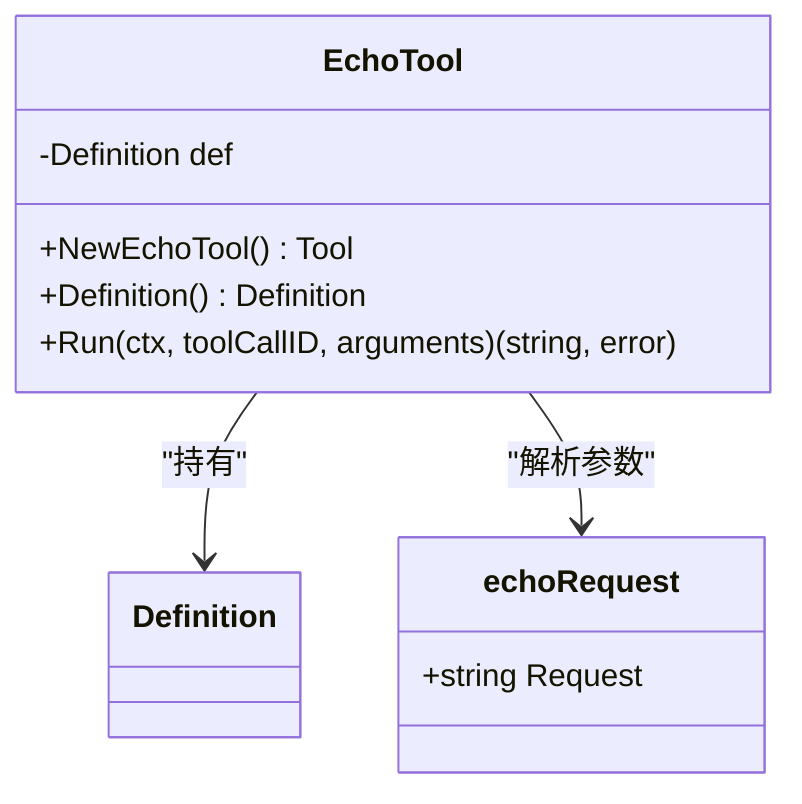
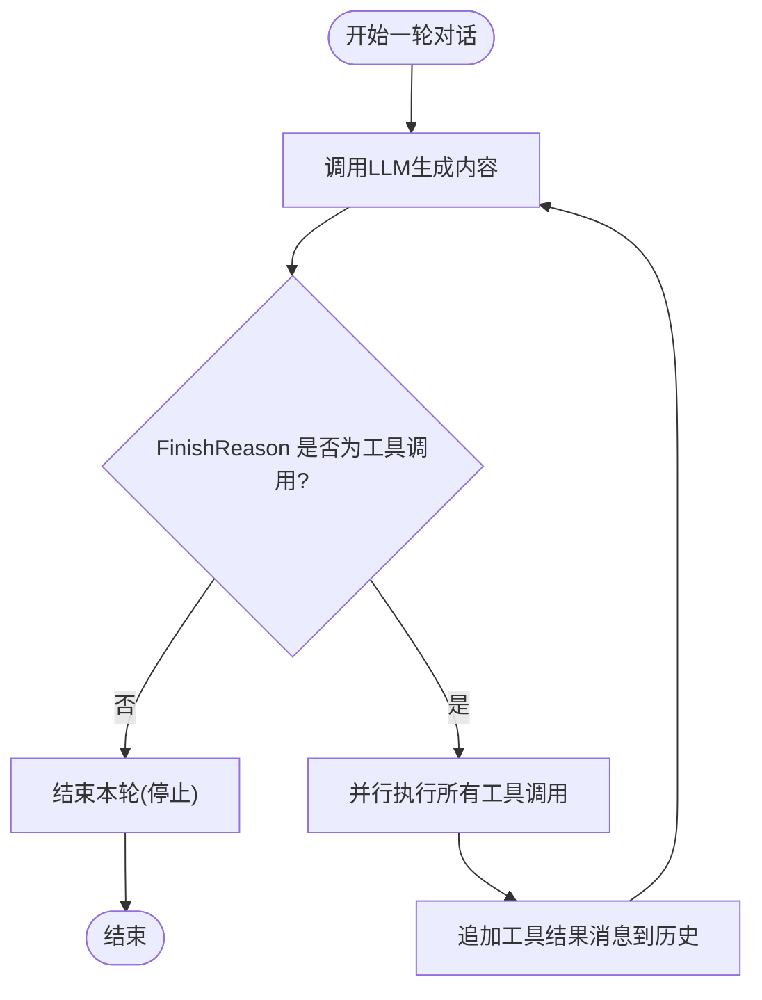
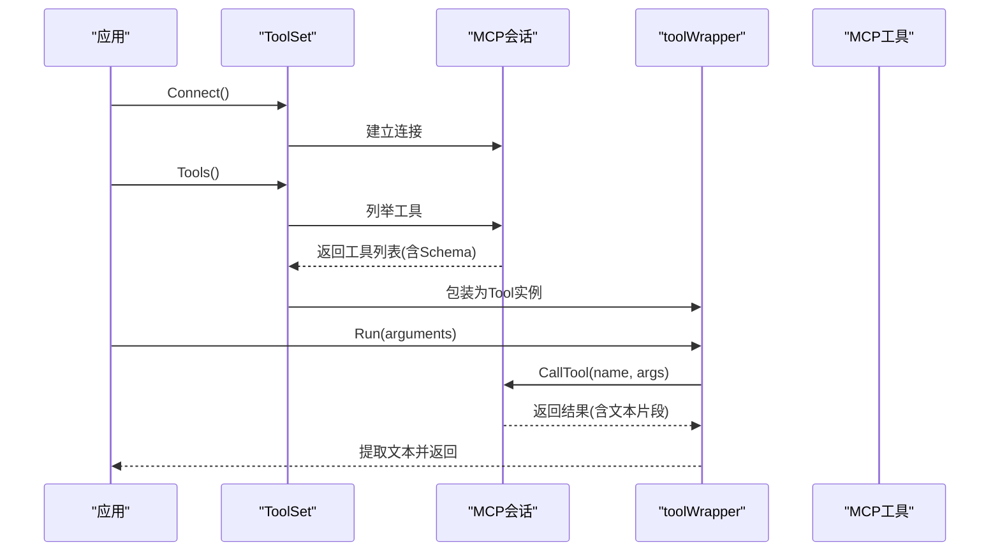
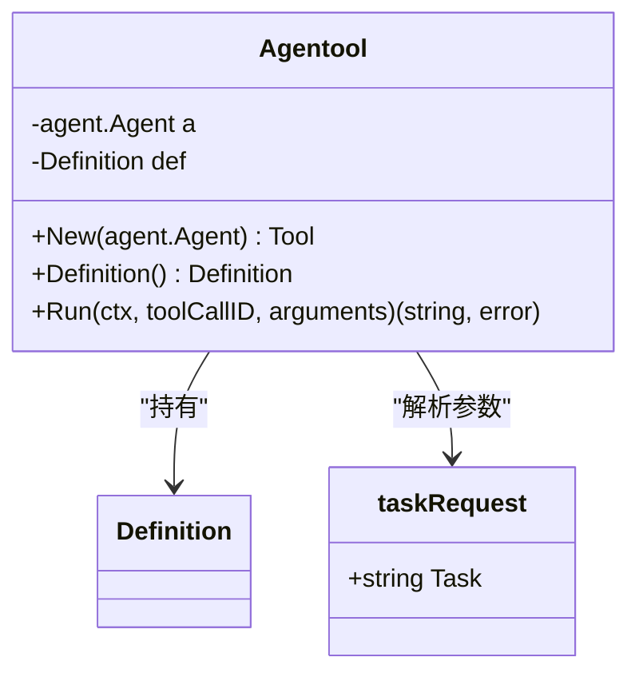
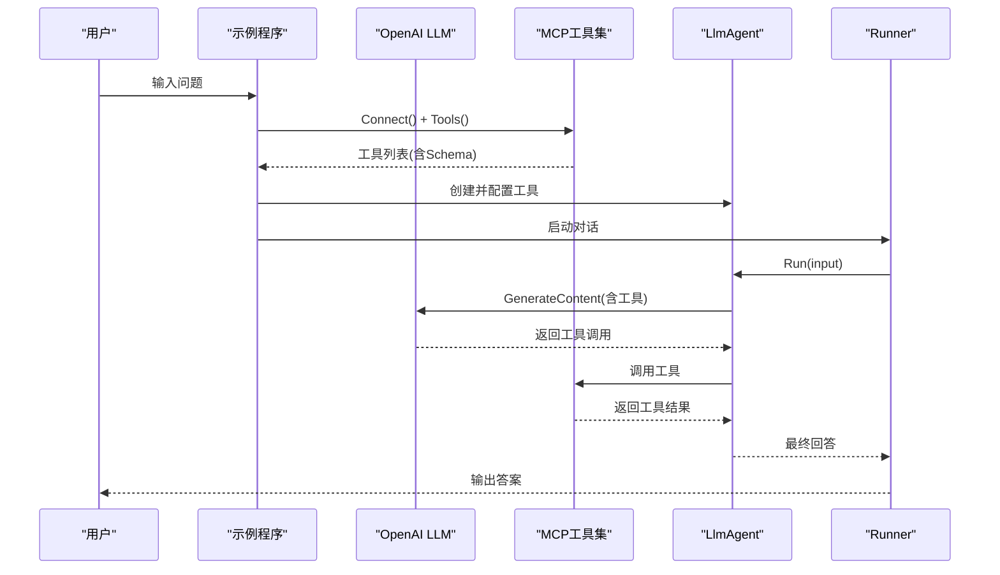
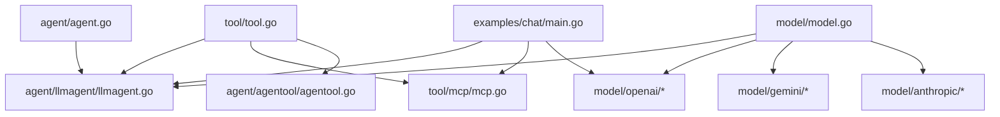

# 工具系统原理

<cite>
**本文档引用的文件**
- [tool/tool.go](file://tool/tool.go)
- [tool/builtin/echo.go](file://tool/builtin/echo.go)
- [tool/mcp/mcp.go](file://tool/mcp/mcp.go)
- [agent/agent.go](file://agent/agent.go)
- [agent/llmagent/llmagent.go](file://agent/llmagent/llmagent.go)
- [agent/agentool/agentool.go](file://agent/agentool/agentool.go)
- [model/model.go](file://model/model.go)
- [examples/chat/main.go](file://examples/chat/main.go)
- [README.md](file://README.md)
</cite>

## 目录
1. [简介](#简介)
2. [项目结构](#项目结构)
3. [核心组件](#核心组件)
4. [架构总览](#架构总览)
5. [详细组件分析](#详细组件分析)
6. [依赖关系分析](#依赖关系分析)
7. [性能考量](#性能考量)
8. [故障排查指南](#故障排查指南)
9. [结论](#结论)
10. [附录](#附录)

## 简介
本文件全面解析ADK框架的工具系统设计原理与实现机制，重点涵盖：
- Tool接口的定义与实现要求：名称、描述与执行方法
- 工具调用循环的工作原理：LLM如何自动触发工具调用直至停止响应
- 内置工具EchoTool的实现：展示简单工具的开发模式
- MCP工具集成机制：如何连接与使用Model Context Protocol服务器
- 工具参数验证与JSON Schema支持：确保工具调用的安全性与正确性
- 自定义工具开发的完整示例：工具注册、参数定义与错误处理
- 工具作为代理的高级用法：实现复杂的任务委托机制

## 项目结构
ADK采用分层模块化组织，工具系统位于独立的tool包，并通过适配器与LLM、Agent解耦：
- tool：抽象工具接口与内置工具、MCP桥接
- agent：Agent接口与具体实现（如LlmAgent）
- model：跨提供商的LLM接口与消息类型
- examples：示例程序，演示MCP工具接入与聊天流程

图表来源
- [tool/tool.go:1-24](file://tool/tool.go#L1-L24)
- [tool/builtin/echo.go:1-47](file://tool/builtin/echo.go#L1-L47)
- [tool/mcp/mcp.go:1-121](file://tool/mcp/mcp.go#L1-L121)
- [agent/agent.go:1-20](file://agent/agent.go#L1-L20)
- [agent/llmagent/llmagent.go:1-159](file://agent/llmagent/llmagent.go#L1-L159)
- [agent/agentool/agentool.go:1-79](file://agent/agentool/agentool.go#L1-L79)
- [model/model.go:1-227](file://model/model.go#L1-L227)
- [examples/chat/main.go:1-181](file://examples/chat/main.go#L1-L181)

章节来源
- [README.md:67-89](file://README.md#L67-L89)
- [tool/tool.go:1-24](file://tool/tool.go#L1-L24)
- [agent/agent.go:1-20](file://agent/agent.go#L1-L20)
- [model/model.go:1-227](file://model/model.go#L1-L227)

## 核心组件
- Tool接口与Definition元数据：统一抽象工具能力，包含名称、描述与输入参数的JSON Schema
- LlmAgent工具调用循环：在每次生成后检查FinishReason是否为工具调用，自动执行并追加结果
- 内置工具EchoTool：最小化示例，展示Schema生成与参数解析
- MCP工具集：动态发现并封装MCP服务器提供的工具，支持参数Schema转换与调用
- 代理作为工具：将Agent包装为Tool，实现复杂任务委托

章节来源
- [tool/tool.go:9-23](file://tool/tool.go#L9-L23)
- [agent/llmagent/llmagent.go:56-136](file://agent/llmagent/llmagent.go#L56-L136)
- [tool/builtin/echo.go:14-46](file://tool/builtin/echo.go#L14-L46)
- [tool/mcp/mcp.go:15-121](file://tool/mcp/mcp.go#L15-L121)
- [agent/agentool/agentool.go:16-78](file://agent/agentool/agentool.go#L16-L78)

## 架构总览
ADK的工具系统围绕“Provider-agnostic”的Tool接口展开，LLM通过函数调用能力请求工具执行，Agent负责驱动循环，工具负责实际业务逻辑。

图表来源
- [agent/llmagent/llmagent.go:60-136](file://agent/llmagent/llmagent.go#L60-L136)
- [model/model.go:188-212](file://model/model.go#L188-L212)
- [tool/tool.go:17-23](file://tool/tool.go#L17-L23)

## 详细组件分析

### Tool接口与Definition
- Definition包含工具名称、描述与输入参数的JSON Schema，用于LLM理解工具签名
- Tool接口定义两个方法：Definition返回元数据；Run执行工具并返回字符串结果

图表来源
- [tool/tool.go:9-23](file://tool/tool.go#L9-L23)

章节来源
- [tool/tool.go:9-23](file://tool/tool.go#L9-L23)

### EchoTool内置工具
- 使用反射生成JSON Schema，确保参数校验与文档一致性
- Run方法解析参数并直接回显，便于验证工具链路

图表来源
- [tool/builtin/echo.go:14-46](file://tool/builtin/echo.go#L14-L46)

章节来源
- [tool/builtin/echo.go:14-46](file://tool/builtin/echo.go#L14-L46)

### LlmAgent工具调用循环
- 在每次生成后检查FinishReason，若为工具调用则并行执行所有工具调用
- 将工具结果以tool角色消息追加到历史，继续生成直至停止
- 支持流式输出：Partial事件先于完整事件产生

图表来源
- [agent/llmagent/llmagent.go:78-136](file://agent/llmagent/llmagent.go#L78-L136)
- [model/model.go:30-42](file://model/model.go#L30-L42)

章节来源
- [agent/llmagent/llmagent.go:56-136](file://agent/llmagent/llmagent.go#L56-L136)
- [model/model.go:188-212](file://model/model.go#L188-L212)

### MCP工具集成机制
- ToolSet负责连接MCP服务器并动态发现工具
- 将MCP工具的输入Schema从任意类型转换为标准JSON Schema
- toolWrapper将MCP工具包装为Tool接口，Run时调用会话的CallTool并提取文本内容

图表来源
- [tool/mcp/mcp.go:35-121](file://tool/mcp/mcp.go#L35-L121)

章节来源
- [tool/mcp/mcp.go:15-121](file://tool/mcp/mcp.go#L15-L121)

### 代理作为工具（Agentool）
- 将Agent包装为Tool，名称与描述来自Agent的Name()与Description()
- Run时以单条用户消息触发被包装的Agent，仅返回最后一条完整的助手文本

图表来源
- [agent/agentool/agentool.go:16-78](file://agent/agentool/agentool.go#L16-L78)

章节来源
- [agent/agentool/agentool.go:16-78](file://agent/agentool/agentool.go#L16-L78)

### 示例：基于MCP的聊天代理
- 示例程序展示了如何连接Exa MCP服务器，加载工具并注入到LlmAgent
- 支持可选的API密钥传输头，演示了工具列表与调用流程

图表来源
- [examples/chat/main.go:52-177](file://examples/chat/main.go#L52-L177)
- [tool/mcp/mcp.go:35-72](file://tool/mcp/mcp.go#L35-L72)
- [agent/llmagent/llmagent.go:36-46](file://agent/llmagent/llmagent.go#L36-L46)

章节来源
- [examples/chat/main.go:52-177](file://examples/chat/main.go#L52-L177)

## 依赖关系分析
- Tool接口与Definition为跨模块共享的核心抽象
- LlmAgent依赖Tool接口与LLM接口，实现工具调用循环
- MCP工具集依赖MCP SDK与JSON Schema库，完成Schema转换与调用
- Agentool依赖Agent接口，实现代理委托
- 示例程序依赖OpenAI适配器与MCP工具集

图表来源
- [tool/tool.go:1-24](file://tool/tool.go#L1-L24)
- [agent/llmagent/llmagent.go:1-159](file://agent/llmagent/llmagent.go#L1-L159)
- [tool/mcp/mcp.go:1-121](file://tool/mcp/mcp.go#L1-L121)
- [agent/agentool/agentool.go:1-79](file://agent/agentool/agentool.go#L1-L79)
- [model/model.go:1-227](file://model/model.go#L1-L227)
- [examples/chat/main.go:1-181](file://examples/chat/main.go#L1-L181)

章节来源
- [README.md:38-89](file://README.md#L38-L89)
- [model/model.go:10-18](file://model/model.go#L10-L18)

## 性能考量
- 并行工具执行：LlmAgent对同一轮次内所有工具调用采用并发执行，提升整体吞吐
- 流式输出：支持Partial事件，实现实时增量显示，改善用户体验
- Schema预编译：内置工具与Agentool通过反射生成Schema，避免运行时重复构建
- MCP工具延迟：网络调用存在不确定性，建议在上层进行超时控制与重试策略

章节来源
- [agent/llmagent/llmagent.go:116-126](file://agent/llmagent/llmagent.go#L116-L126)
- [agent/llmagent/llmagent.go:24-27](file://agent/llmagent/llmagent.go#L24-L27)
- [tool/builtin/echo.go:22-34](file://tool/builtin/echo.go#L22-L34)
- [agent/agentool/agentool.go:35-47](file://agent/agentool/agentool.go#L35-L47)

## 故障排查指南
- 工具未找到：当LLM请求的工具名不在注册表中，Agent会返回错误消息
- 参数解析失败：工具Run阶段的JSON解析错误会被捕获并返回错误字符串
- MCP连接失败：ToolSet.Connect返回错误，需检查端点与认证配置
- MCP工具调用错误：toolWrapper在CallTool返回IsError时，会将错误文本返回给Agent
- 流式中断：若LLM生成过程中断，Agent会提前结束当前轮次

章节来源
- [agent/llmagent/llmagent.go:139-158](file://agent/llmagent/llmagent.go#L139-L158)
- [tool/mcp/mcp.go:92-109](file://tool/mcp/mcp.go#L92-L109)

## 结论
ADK的工具系统通过抽象的Tool接口与Provider-agnostic的消息模型，实现了跨LLM与跨工具源的统一调度。LlmAgent的工具调用循环保证了LLM能够自动触发工具直至停止响应；内置EchoTool与Agentool展示了最小可行的开发模式；MCP工具集提供了与外部生态的无缝集成。配合JSON Schema的参数验证与流式输出机制，ADK在安全性、可扩展性与易用性之间取得了良好平衡。

## 附录

### 自定义工具开发步骤
- 定义参数结构体并添加jsonschema标签，用于生成输入Schema
- 实现Tool接口：Definition返回名称、描述与InputSchema；Run解析arguments并执行业务逻辑
- 注册工具：将工具实例加入LlmAgent的Tools配置
- 错误处理：Run返回的错误会被封装为tool消息内容，便于LLM感知与重试

章节来源
- [tool/tool.go:9-23](file://tool/tool.go#L9-L23)
- [tool/builtin/echo.go:18-34](file://tool/builtin/echo.go#L18-L34)
- [agent/llmagent/llmagent.go:36-46](file://agent/llmagent/llmagent.go#L36-L46)

### JSON Schema与参数验证
- Tool.Definition.InputSchema由工具自身Schema生成，确保参数合法性
- LLM适配器将Schema转换为各提供商的函数声明格式
- MCP工具的Schema通过JSON往返转换，确保跨实现的一致性

章节来源
- [tool/tool.go:13-14](file://tool/tool.go#L13-L14)
- [tool/builtin/echo.go:22-34](file://tool/builtin/echo.go#L22-L34)
- [tool/mcp/mcp.go:52-62](file://tool/mcp/mcp.go#L52-L62)