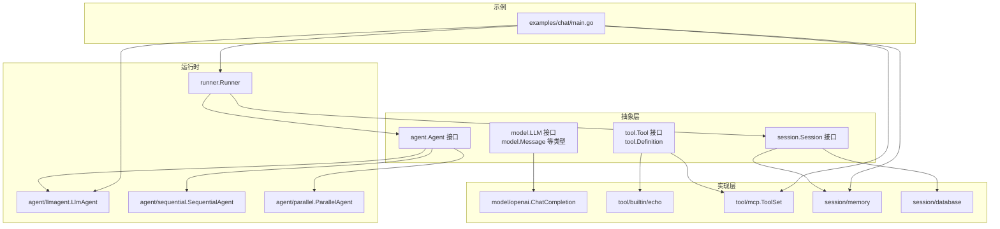
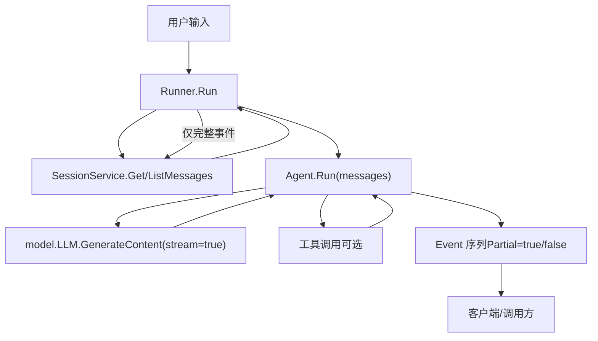
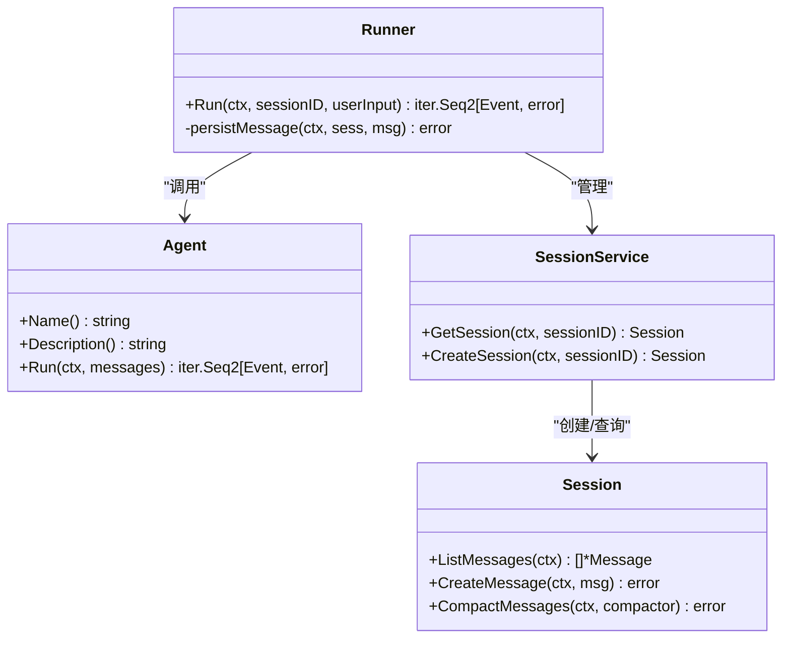
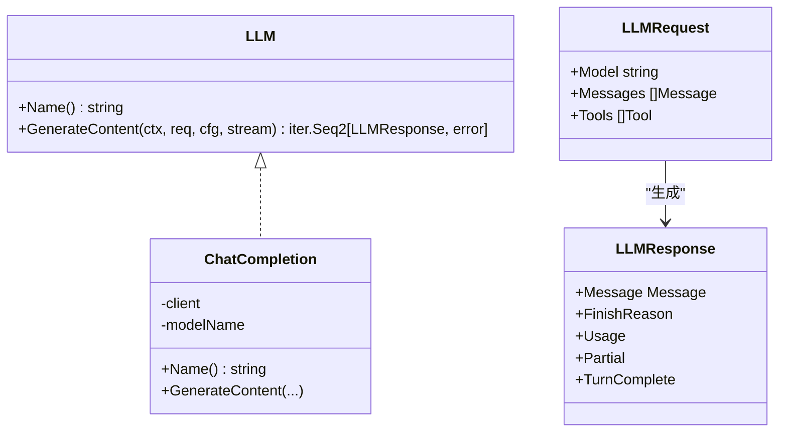
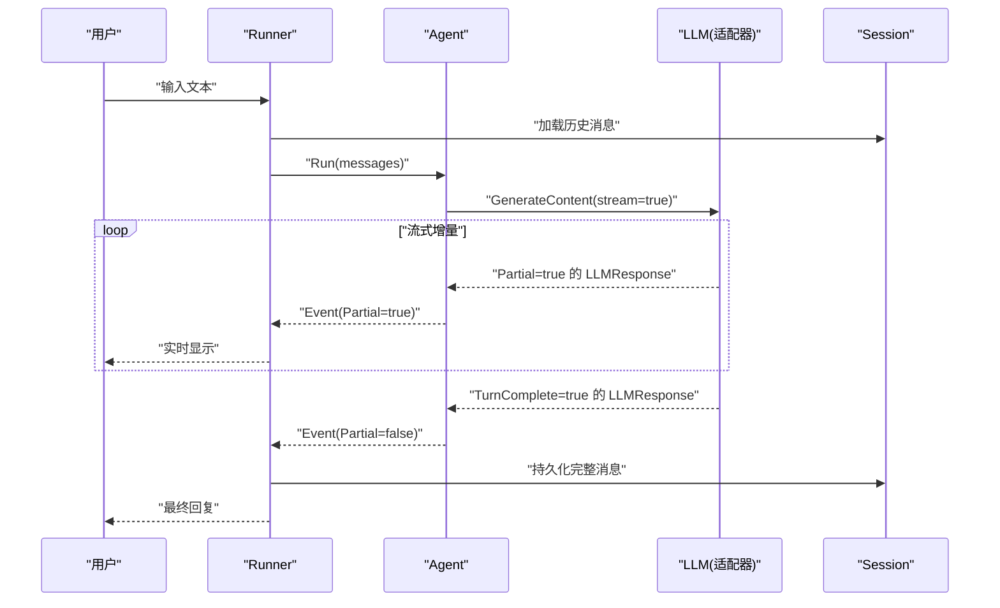
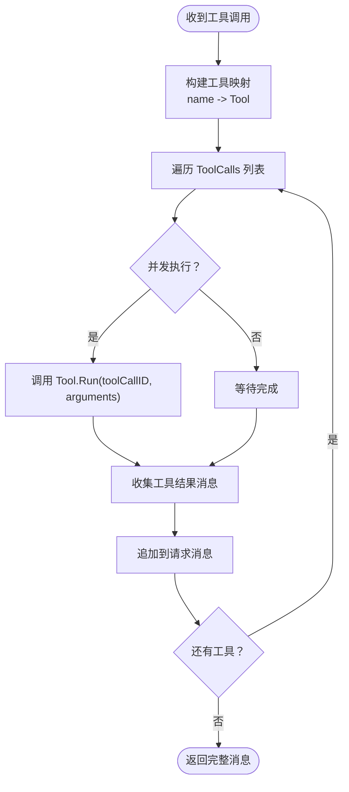
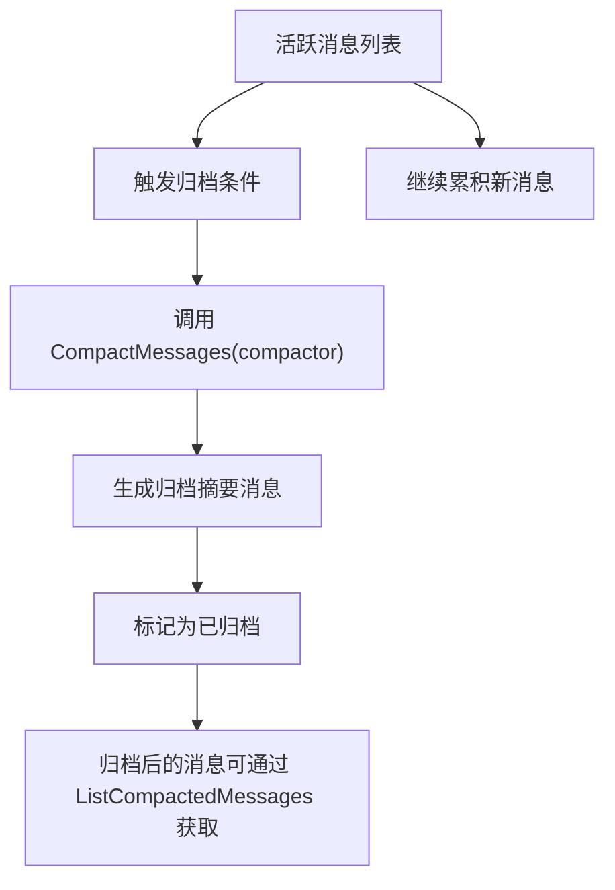
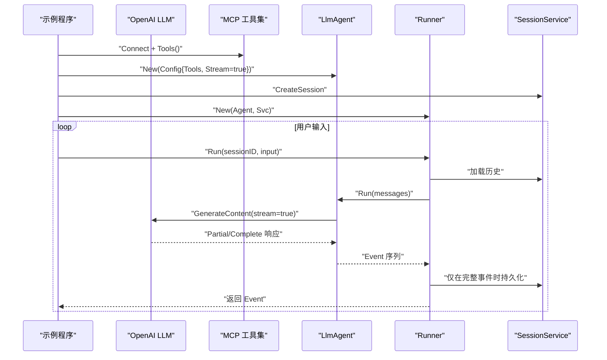
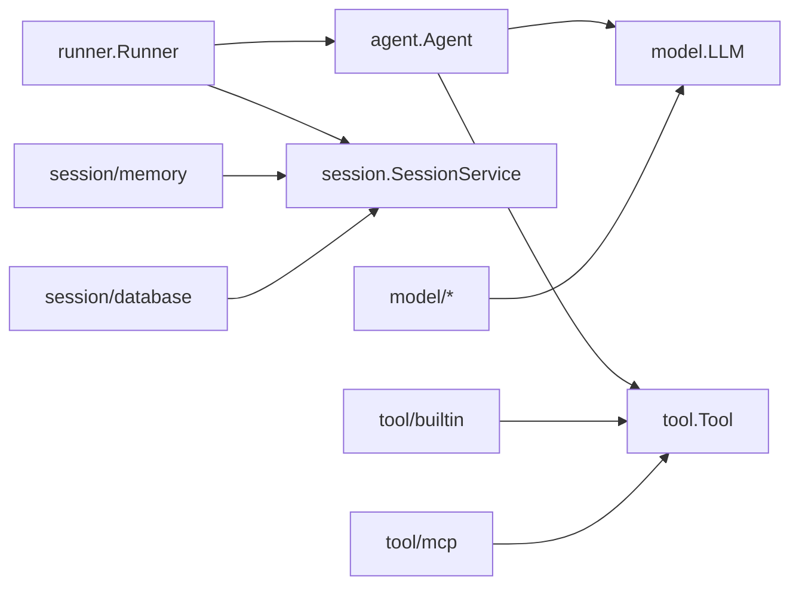

# 核心概念

<cite>
**本文引用的文件**
- [README.md](file://README.md)
- [agent/agent.go](file://agent/agent.go)
- [runner/runner.go](file://runner/runner.go)
- [model/model.go](file://model/model.go)
- [session/session.go](file://session/session.go)
- [tool/tool.go](file://tool/tool.go)
- [agent/llmagent/llmagent.go](file://agent/llmagent/llmagent.go)
- [session/memory/session_service.go](file://session/memory/session_service.go)
- [model/openai/openai.go](file://model/openai/openai.go)
- [tool/builtin/echo.go](file://tool/builtin/echo.go)
- [examples/chat/main.go](file://examples/chat/main.go)
- [agent/sequential/sequential.go](file://agent/sequential/sequential.go)
- [agent/parallel/parallel.go](file://agent/parallel/parallel.go)
- [tool/mcp/mcp.go](file://tool/mcp/mcp.go)
- [session/database/session_service.go](file://session/database/session_service.go)
- [internal/snowflake/snowflake.go](file://internal/snowflake/snowflake.go)
</cite>

## 目录
1. [引言](#引言)
2. [项目结构](#项目结构)
3. [核心组件](#核心组件)
4. [架构总览](#架构总览)
5. [详细组件分析](#详细组件分析)
6. [依赖分析](#依赖分析)
7. [性能考虑](#性能考虑)
8. [故障排查指南](#故障排查指南)
9. [结论](#结论)
10. [附录](#附录)

## 引言
本文件系统性解析 ADK 框架的核心概念与设计哲学，重点阐释以下主题：
- 无状态代理与有状态运行器的分离架构，如何实现关注点分离与代码复用
- LLM 抽象接口的设计思路，如何实现供应商无关的统一接口
- 事件流处理机制，Go 迭代器在流式输出中的应用
- 工具系统原理，包括工具定义、参数校验与执行机制
- 会话管理设计理念，特别是消息历史“软归档”机制
- 提供清晰的概念图与代码示例路径，帮助开发者快速掌握 ADK 的设计思想与架构原则

## 项目结构
ADK 采用按职责分层的包布局：抽象接口层（agent、model、tool）、具体实现层（各适配器与工具）、运行时编排层（runner）与会话存储层（session），并通过示例工程展示端到端使用方式。

**图表来源**
- [agent/agent.go:10-19](file://agent/agent.go#L10-L19)
- [model/model.go:10-18](file://model/model.go#L10-L18)
- [tool/tool.go:9-23](file://tool/tool.go#L9-L23)
- [session/session.go:9-23](file://session/session.go#L9-L23)
- [model/openai/openai.go:19-42](file://model/openai/openai.go#L19-L42)
- [tool/builtin/echo.go:14-34](file://tool/builtin/echo.go#L14-L34)
- [tool/mcp/mcp.go:15-80](file://tool/mcp/mcp.go#L15-L80)
- [session/memory/session_service.go:14-40](file://session/memory/session_service.go#L14-L40)
- [session/database/session_service.go:23-48](file://session/database/session_service.go#L23-L48)
- [runner/runner.go:17-37](file://runner/runner.go#L17-L37)
- [agent/llmagent/llmagent.go:30-46](file://agent/llmagent/llmagent.go#L30-L46)
- [agent/sequential/sequential.go:18-41](file://agent/sequential/sequential.go#L18-L41)
- [agent/parallel/parallel.go:70-101](file://agent/parallel/parallel.go#L70-L101)
- [examples/chat/main.go:52-124](file://examples/chat/main.go#L52-L124)

**章节来源**
- [README.md:67-89](file://README.md#L67-L89)
- [examples/chat/main.go:52-124](file://examples/chat/main.go#L52-L124)

## 核心组件
- 无状态代理（Agent）
  - 定义：仅接收当前轮次的消息上下文，产生事件序列（Event），不持有历史状态
  - 关键点：Run 返回 Go 迭代器，支持增量事件（Partial=true）与完整事件（Partial=false）
  - 参考：[agent/agent.go:10-19](file://agent/agent.go#L10-L19)，[model/model.go:214-226](file://model/model.go#L214-L226)

- 有状态运行器（Runner）
  - 定义：负责加载/保存会话、注入用户输入、转发事件、持久化完整消息
  - 关键点：只在完整事件（Partial=false）时写入会话；流式片段用于实时显示
  - 参考：[runner/runner.go:17-96](file://runner/runner.go#L17-L96)

- LLM 抽象接口（model.LLM）
  - 定义：统一的 GenerateContent 接口，支持流式与非流式两种模式
  - 关键点：GenerateConfig 统一温度、推理强度、服务等级等配置；FinishReason 表征停止原因
  - 参考：[model/model.go:10-18](file://model/model.go#L10-L18)，[model/model.go:67-84](file://model/model.go#L67-L84)，[model/model.go:30-42](file://model/model.go#L30-L42)

- 工具系统（tool.Tool）
  - 定义：通过 Definition（名称、描述、JSON Schema 输入）与 Run 执行
  - 关键点：参数校验由 JSON Schema 驱动；Run 返回字符串结果
  - 参考：[tool/tool.go:9-23](file://tool/tool.go#L9-L23)

- 会话与消息（session.Session）
  - 定义：提供消息列表、归档（软归档）、删除等能力
  - 关键点：ListMessages 获取活跃消息；ListCompactedMessages 获取已归档消息
  - 参考：[session/session.go:9-23](file://session/session.go#L9-L23)

**章节来源**
- [agent/agent.go:10-19](file://agent/agent.go#L10-L19)
- [runner/runner.go:17-96](file://runner/runner.go#L17-L96)
- [model/model.go:10-18](file://model/model.go#L10-L18)
- [tool/tool.go:9-23](file://tool/tool.go#L9-L23)
- [session/session.go:9-23](file://session/session.go#L9-L23)

## 架构总览
ADK 的核心是“无状态代理 + 有状态运行器”的分离：
- 运行器（Runner）持有会话服务，负责加载/保存消息与驱动代理
- 代理（Agent）仅处理当前轮次的对话逻辑，不关心持久化
- LLM 抽象屏蔽供应商差异，工具系统统一函数调用协议
- 事件流通过 Go 迭代器逐段产出，支持实时渲染

**图表来源**
- [runner/runner.go:39-96](file://runner/runner.go#L39-L96)
- [agent/llmagent/llmagent.go:56-136](file://agent/llmagent/llmagent.go#L56-L136)
- [model/model.go:10-18](file://model/model.go#L10-L18)

**章节来源**
- [README.md:37-65](file://README.md#L37-L65)
- [runner/runner.go:17-96](file://runner/runner.go#L17-L96)
- [agent/agent.go:10-19](file://agent/agent.go#L10-L19)

## 详细组件分析

### 无状态代理与有状态运行器的分离
- 设计动机
  - 将“对话逻辑”与“状态持久化”解耦，提升可测试性与复用性
  - 代理可被替换为不同实现（如顺序/并行组合），而运行器保持一致
- 实现要点
  - Runner 负责消息加载、注入用户输入、持久化完整消息、转发事件
  - Agent 仅基于传入 messages 生成事件，不感知历史
- 复杂度与性能
  - Runner 的消息拼接与持久化为 O(n)；Agent 的工具调用可并发执行以降低尾延迟
- 可扩展性
  - 新增代理只需实现 Agent 接口；新增会话后端只需实现 SessionService 接口

**图表来源**
- [runner/runner.go:17-108](file://runner/runner.go#L17-L108)
- [agent/agent.go:10-19](file://agent/agent.go#L10-L19)
- [session/session.go:9-23](file://session/session.go#L9-L23)

**章节来源**
- [runner/runner.go:17-96](file://runner/runner.go#L17-L96)
- [agent/agent.go:10-19](file://agent/agent.go#L10-L19)
- [session/session.go:9-23](file://session/session.go#L9-L23)

### LLM 抽象接口与供应商无关设计
- 统一接口
  - model.LLM.GenerateContent(ctx, req, cfg, stream) 返回迭代器
  - 通过 model.GenerateConfig 统一温度、推理强度、服务等级等
- 适配器实现
  - model/openai.ChatCompletion 将内部消息/工具转换为 OpenAI 参数，并处理流式与非流式响应
- 事件语义
  - Partial=true 表示增量文本片段；TurnComplete=true 表示一轮完整结束
- 多模态与推理
  - model.Message 支持多模态内容与推理模型的 ReasoningContent 字段

**图表来源**
- [model/model.go:10-18](file://model/model.go#L10-L18)
- [model/openai/openai.go:19-42](file://model/openai/openai.go#L19-L42)
- [model/model.go:188-212](file://model/model.go#L188-L212)

**章节来源**
- [model/model.go:10-18](file://model/model.go#L10-L18)
- [model/openai/openai.go:44-164](file://model/openai/openai.go#L44-L164)
- [model/model.go:67-84](file://model/model.go#L67-L84)

### 事件流处理与 Go 迭代器的应用
- 流式生成
  - LLM 适配器在流式模式下，逐段产出 Partial=true 的 LLMResponse
  - Agent 将 Partial=true 的响应包装为 Event 并立即 yield，实现实时渲染
- 完整消息
  - 当收到 TurnComplete=true 的 LLMResponse 后，Agent 产出一个完整的 Event（Partial=false）
- Runner 的职责
  - 仅在完整事件时持久化消息；流式片段用于实时显示

**图表来源**
- [runner/runner.go:39-96](file://runner/runner.go#L39-L96)
- [agent/llmagent/llmagent.go:78-106](file://agent/llmagent/llmagent.go#L78-L106)
- [model/openai/openai.go:88-163](file://model/openai/openai.go#L88-L163)

**章节来源**
- [runner/runner.go:39-96](file://runner/runner.go#L39-L96)
- [agent/llmagent/llmagent.go:56-136](file://agent/llmagent/llmagent.go#L56-L136)
- [model/openai/openai.go:44-164](file://model/openai/openai.go#L44-L164)

### 工具系统：定义、参数校验与执行
- 工具定义
  - tool.Definition 包含名称、描述与 JSON Schema 输入
  - JSON Schema 由 jsonschema-go 生成或从 MCP 服务器动态导入
- 参数校验
  - LLM 在函数调用时根据 Schema 校验参数；工具实现侧也可进行二次校验
- 执行机制
  - Agent 在收到 FinishReasonToolCalls 后，按顺序并行执行工具调用
  - 工具返回字符串结果，封装为 RoleTool 的消息并追加到上下文

**图表来源**
- [agent/llmagent/llmagent.go:116-134](file://agent/llmagent/llmagent.go#L116-L134)
- [tool/tool.go:9-23](file://tool/tool.go#L9-L23)
- [tool/builtin/echo.go:18-46](file://tool/builtin/echo.go#L18-L46)
- [tool/mcp/mcp.go:46-109](file://tool/mcp/mcp.go#L46-L109)

**章节来源**
- [tool/tool.go:9-23](file://tool/tool.go#L9-L23)
- [agent/llmagent/llmagent.go:116-134](file://agent/llmagent/llmagent.go#L116-L134)
- [tool/builtin/echo.go:18-46](file://tool/builtin/echo.go#L18-L46)
- [tool/mcp/mcp.go:46-109](file://tool/mcp/mcp.go#L46-L109)

### 会话管理与消息历史“软归档”
- 活跃消息与归档消息
  - ListMessages 返回活跃消息；ListCompactedMessages 返回已归档消息
- 软归档机制
  - 通过 CompactMessages 对旧消息进行归档（标记时间戳），而非物理删除
  - 典型做法：用摘要替换旧消息，保留上下文同时控制历史长度
- 存储后端
  - 内存后端：适合测试与单进程场景
  - 数据库后端：支持持久化跨重启会话

**图表来源**
- [session/session.go:12-22](file://session/session.go#L12-L22)
- [README.md:248-266](file://README.md#L248-L266)

**章节来源**
- [session/session.go:9-23](file://session/session.go#L9-L23)
- [README.md:248-266](file://README.md#L248-L266)
- [session/memory/session_service.go:18-40](file://session/memory/session_service.go#L18-L40)
- [session/database/session_service.go:27-48](file://session/database/session_service.go#L27-L48)

### 示例：聊天主流程与工具集成
- 示例概览
  - 使用 OpenAI 作为 LLM，Exa MCP 作为工具源
  - 通过 Runner 驱动 LlmAgent，实现流式对话与工具调用
- 关键步骤
  - 创建 LLM、MCP 工具集、Agent、Runner 与会话服务
  - 主循环中调用 Runner.Run，区分 Partial/Complete 事件
  - 完整事件写入会话，流式片段实时显示

**图表来源**
- [examples/chat/main.go:52-177](file://examples/chat/main.go#L52-L177)
- [model/openai/openai.go:25-37](file://model/openai/openai.go#L25-L37)
- [tool/mcp/mcp.go:35-72](file://tool/mcp/mcp.go#L35-L72)
- [agent/llmagent/llmagent.go:36-46](file://agent/llmagent/llmagent.go#L36-L46)
- [runner/runner.go:27-37](file://runner/runner.go#L27-L37)

**章节来源**
- [examples/chat/main.go:52-177](file://examples/chat/main.go#L52-L177)

## 依赖分析
- 组件耦合
  - Runner 依赖 Agent 与 SessionService；Agent 依赖 model.LLM 与 tool.Tool
  - LLM 适配器依赖外部 SDK；工具适配器依赖 jsonschema 或 MCP 客户端
- 外部依赖
  - OpenAI/Gemini/Anthropic SDK、MCP 客户端、jsonschema、sqlite/sqlx、snowflake 等
- 循环依赖
  - 未发现直接循环依赖；接口分层清晰

**图表来源**
- [runner/runner.go:17-37](file://runner/runner.go#L17-L37)
- [agent/agent.go:10-19](file://agent/agent.go#L10-L19)
- [model/model.go:10-18](file://model/model.go#L10-L18)
- [tool/tool.go:17-23](file://tool/tool.go#L17-L23)
- [session/session.go:9-23](file://session/session.go#L9-L23)

**章节来源**
- [runner/runner.go:17-37](file://runner/runner.go#L17-L37)
- [agent/agent.go:10-19](file://agent/agent.go#L10-L19)
- [model/model.go:10-18](file://model/model.go#L10-L18)
- [tool/tool.go:17-23](file://tool/tool.go#L17-L23)
- [session/session.go:9-23](file://session/session.go#L9-L23)

## 性能考虑
- 流式输出
  - 使用 Partial 事件尽早渲染，降低感知延迟
- 工具调用并发
  - LlmAgent 中对多个 ToolCall 并发执行，缩短工具链路总耗时
- 会话归档
  - 软归档减少数据库压力，避免全量扫描历史
- ID 分布式唯一
  - 使用 Snowflake 生成时间有序、分布式唯一的消息 ID，便于排序与去重

**章节来源**
- [agent/llmagent/llmagent.go:116-126](file://agent/llmagent/llmagent.go#L116-L126)
- [README.md:248-266](file://README.md#L248-L266)
- [internal/snowflake/snowflake.go:17-57](file://internal/snowflake/snowflake.go#L17-L57)

## 故障排查指南
- 事件流中断
  - 检查 Agent 是否正确处理 Partial/Complete 事件；确认 Runner 仅在完整事件时持久化
  - 参考：[runner/runner.go:78-94](file://runner/runner.go#L78-L94)，[agent/llmagent/llmagent.go:86-106](file://agent/llmagent/llmagent.go#L86-L106)
- 工具调用失败
  - 核对工具 Definition 的 InputSchema 与实际参数是否匹配
  - 检查工具 Run 的错误返回与 Agent 的错误处理
  - 参考：[tool/tool.go:9-23](file://tool/tool.go#L9-L23)，[tool/builtin/echo.go:40-46](file://tool/builtin/echo.go#L40-L46)
- 会话加载/保存异常
  - 确认 SessionService 的实现与数据库连接状态
  - 参考：[session/memory/session_service.go:18-40](file://session/memory/session_service.go#L18-L40)，[session/database/session_service.go:27-48](file://session/database/session_service.go#L27-L48)
- LLM 适配器问题
  - 检查 GenerateContent 的 stream 参数与响应解析
  - 参考：[model/openai/openai.go:44-164](file://model/openai/openai.go#L44-L164)

**章节来源**
- [runner/runner.go:78-94](file://runner/runner.go#L78-L94)
- [agent/llmagent/llmagent.go:86-106](file://agent/llmagent/llmagent.go#L86-L106)
- [tool/tool.go:9-23](file://tool/tool.go#L9-L23)
- [tool/builtin/echo.go:40-46](file://tool/builtin/echo.go#L40-L46)
- [session/memory/session_service.go:18-40](file://session/memory/session_service.go#L18-L40)
- [session/database/session_service.go:27-48](file://session/database/session_service.go#L27-L48)
- [model/openai/openai.go:44-164](file://model/openai/openai.go#L44-L164)

## 结论
ADK 通过“无状态代理 + 有状态运行器”的分离，实现了对话逻辑与状态持久化的清晰解耦；通过统一的 LLM 抽象与工具接口，屏蔽了供应商差异与工具实现复杂度；借助 Go 迭代器的事件流模型，既保证了实时性，又简化了上层集成。配合软归档与分布式 ID 等基础设施，ADK 为生产级智能体开发提供了高内聚、低耦合、可扩展的架构基石。

## 附录
- Agent 组合
  - 顺序组合（SequentialAgent）：前序输出作为后续输入，适合研究-写作-审阅等流水线
  - 并行组合（ParallelAgent）：多 Agent 并发执行，合并结果，适合多模型对比与独立任务
  - 参考：[agent/sequential/sequential.go:46-92](file://agent/sequential/sequential.go#L46-L92)，[agent/parallel/parallel.go:112-174](file://agent/parallel/parallel.go#L112-L174)

**章节来源**
- [agent/sequential/sequential.go:46-92](file://agent/sequential/sequential.go#L46-L92)
- [agent/parallel/parallel.go:112-174](file://agent/parallel/parallel.go#L112-L174)