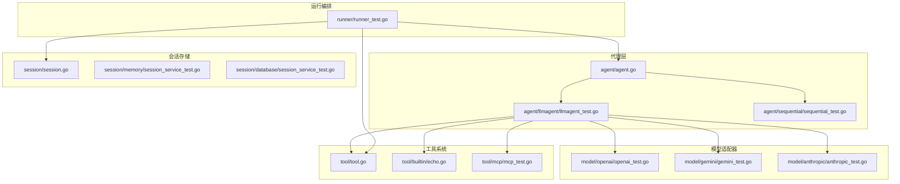
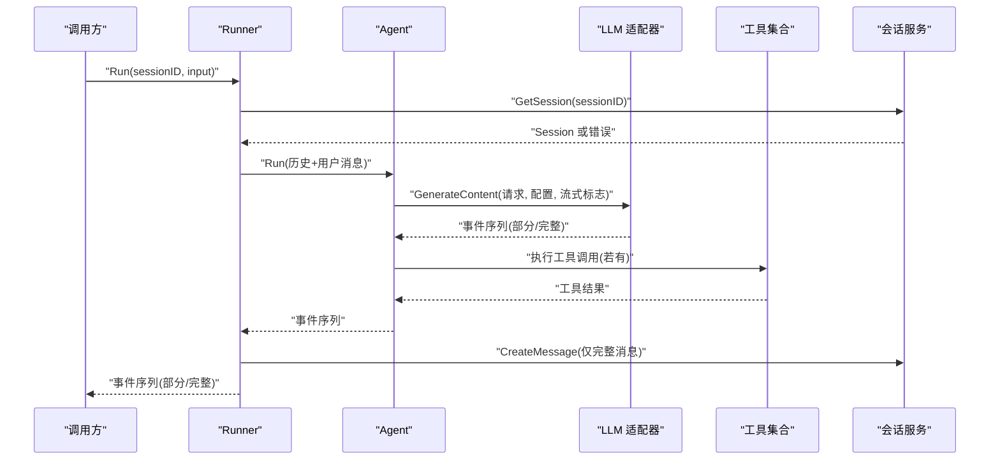

# 测试指南

<cite>
**本文引用的文件**
- [README.md](file://README.md)
- [go.mod](file://go.mod)
- [agent/agent.go](file://agent/agent.go)
- [session/session.go](file://session/session.go)
- [tool/tool.go](file://tool/tool.go)
- [agent/llmagent/llmagent_test.go](file://agent/llmagent/llmagent_test.go)
- [runner/runner_test.go](file://runner/runner_test.go)
- [session/memory/session_service_test.go](file://session/memory/session_service_test.go)
- [session/database/session_service_test.go](file://session/database/session_service_test.go)
- [tool/mcp/mcp_test.go](file://tool/mcp/mcp_test.go)
- [model/openai/openai_test.go](file://model/openai/openai_test.go)
- [model/gemini/gemini_test.go](file://model/gemini/gemini_test.go)
- [model/anthropic/anthropic_test.go](file://model/anthropic/anthropic_test.go)
- [agent/sequential/sequential_test.go](file://agent/sequential/sequential_test.go)
- [tool/builtin/echo.go](file://tool/builtin/echo.go)
</cite>

## 目录
1. [简介](#简介)
2. [项目结构](#项目结构)
3. [核心组件](#核心组件)
4. [架构总览](#架构总览)
5. [详细组件分析](#详细组件分析)
6. [依赖分析](#依赖分析)
7. [性能考量](#性能考量)
8. [故障排查指南](#故障排查指南)
9. [结论](#结论)
10. [附录](#附录)

## 简介
本测试指南面向使用 ADK 框架构建 AI 代理应用的开发者，系统阐述测试策略与方法，覆盖单元测试、集成测试、流式处理测试、测试数据准备与清理、以及覆盖率与质量标准建议。文档以仓库现有测试为依据，结合接口契约与实现细节，给出可操作的最佳实践与调试技巧。

## 项目结构
ADK 采用按职责分层的包布局：agent（代理）、model（LLM 适配器）、session（会话存储）、tool（工具）、runner（编排器）等模块。测试文件遵循“按模块/功能划分”的组织方式，既有纯内存后端的单元测试，也有对接真实 LLM 的集成测试。

图表来源
- [agent/agent.go:10-19](file://agent/agent.go#L10-L19)
- [agent/llmagent/llmagent_test.go:158-176](file://agent/llmagent/llmagent_test.go#L158-L176)
- [agent/sequential/sequential_test.go:84-94](file://agent/sequential/sequential_test.go#L84-L94)
- [model/openai/openai_test.go:223-238](file://model/openai/openai_test.go#L223-L238)
- [model/gemini/gemini_test.go:330-347](file://model/gemini/gemini_test.go#L330-L347)
- [model/anthropic/anthropic_test.go:265-282](file://model/anthropic/anthropic_test.go#L265-L282)
- [session/session.go:9-23](file://session/session.go#L9-L23)
- [session/memory/session_service_test.go:10-18](file://session/memory/session_service_test.go#L10-L18)
- [session/database/session_service_test.go:13-24](file://session/database/session_service_test.go#L13-L24)
- [tool/tool.go:9-23](file://tool/tool.go#L9-L23)
- [tool/builtin/echo.go:14-34](file://tool/builtin/echo.go#L14-L34)
- [tool/mcp/mcp_test.go:44-100](file://tool/mcp/mcp_test.go#L44-L100)
- [runner/runner_test.go:106-120](file://runner/runner_test.go#L106-L120)

章节来源
- [README.md:67-89](file://README.md#L67-L89)
- [go.mod:1-47](file://go.mod#L1-L47)

## 核心组件
- 代理接口：定义 Run 返回迭代器，支持部分事件（Partial=true）用于流式输出。
- LLM 接口：统一 GenerateContent 行为，支持配置化推理参数与工具调用。
- 工具接口：定义 Definition 与 Run，输入参数通过 JSON Schema 描述。
- 会话接口：提供创建、读取、删除、消息列表与归档能力。
- 运行器：负责加载历史、拼接用户消息、驱动代理并持久化结果。

章节来源
- [agent/agent.go:10-19](file://agent/agent.go#L10-L19)
- [session/session.go:9-23](file://session/session.go#L9-L23)
- [tool/tool.go:9-23](file://tool/tool.go#L9-L23)
- [README.md:190-247](file://README.md#L190-L247)

## 架构总览
下图展示了 Runner、Agent、LLM 适配器、工具与会话之间的交互关系，以及事件流在各组件间的传递路径。

图表来源
- [runner/runner_test.go:106-120](file://runner/runner_test.go#L106-L120)
- [runner/runner_test.go:183-212](file://runner/runner_test.go#L183-L212)
- [agent/llmagent/llmagent_test.go:158-176](file://agent/llmagent/llmagent_test.go#L158-L176)
- [model/openai/openai_test.go:223-238](file://model/openai/openai_test.go#L223-L238)

## 详细组件分析

### 单元测试设计原则与最佳实践
- 模拟 LLM 实现
  - 使用确定性的 mockLLM/ streamingMockLLM 重放响应序列，避免外部依赖。
  - 关键点：Name、GenerateContent 返回值顺序、Partial 标志、TurnComplete 标记。
- 代理测试
  - 基础行为：单轮对话、多轮上下文、指令注入、工具调用循环、推理内容透传。
  - 并行工具执行：通过慢速工具计数器验证并发执行而非串行。
- 工具测试
  - 定义校验：Definition 包含名称、描述与 JSON Schema。
  - 执行校验：Run 输入参数解析、返回字符串结果。
- 会话测试
  - 内存后端：创建、获取、删除、多会话隔离、完整流程。
  - 数据库后端：同上，额外验证雪花 ID 兼容性。
- LLM 适配器测试
  - OpenAI/Gemini/Anthropic：消息转换、FinishReason 映射、推理配置映射、工具函数声明、Token 统计。
- 运行器测试
  - 历史拼接、消息持久化、部分事件转发但不持久化、错误传播、早停与空代理场景。

章节来源
- [agent/llmagent/llmagent_test.go:60-107](file://agent/llmagent/llmagent_test.go#L60-L107)
- [agent/llmagent/llmagent_test.go:449-500](file://agent/llmagent/llmagent_test.go#L449-L500)
- [agent/llmagent/llmagent_test.go:502-579](file://agent/llmagent/llmagent_test.go#L502-L579)
- [agent/llmagent/llmagent_test.go:608-672](file://agent/llmagent/llmagent_test.go#L608-L672)
- [tool/builtin/echo.go:14-47](file://tool/builtin/echo.go#L14-L47)
- [session/memory/session_service_test.go:10-110](file://session/memory/session_service_test.go#L10-L110)
- [session/database/session_service_test.go:13-163](file://session/database/session_service_test.go#L13-L163)
- [model/openai/openai_test.go:77-200](file://model/openai/openai_test.go#L77-L200)
- [model/gemini/gemini_test.go:98-325](file://model/gemini/gemini_test.go#L98-L325)
- [model/anthropic/anthropic_test.go:70-260](file://model/anthropic/anthropic_test.go#L70-L260)
- [runner/runner_test.go:106-212](file://runner/runner_test.go#L106-L212)

### 集成测试方法
- 环境变量驱动
  - OpenAI：OPENAI_API_KEY、OPENAI_BASE_URL、OPENAI_MODEL、OPENAI_REASONING_MODEL。
  - Gemini：GEMINI_API_KEY、GEMINI_MODEL、GEMINI_THINKING_MODEL、VERTEX_AI_PROJECT、VERTEX_AI_LOCATION、VERTEX_AI_MODEL。
  - Anthropic：ANTHROPIC_API_KEY、ANTHROPIC_MODEL、ANTHROPIC_THINKING_MODEL。
  - MCP：EXA_API_KEY（可选）。
- 测试覆盖
  - 文本生成、系统提示、工具调用循环、推理模式启用/禁用、Token 统计。
  - 多步流水线（Sequential Agent）与真实 LLM 的协作。
- 错误处理
  - 未设置密钥时跳过测试；对真实服务错误进行断言与传播验证。

章节来源
- [agent/llmagent/llmagent_test.go:21-54](file://agent/llmagent/llmagent_test.go#L21-L54)
- [model/openai/openai_test.go:38-71](file://model/openai/openai_test.go#L38-L71)
- [model/gemini/gemini_test.go:36-92](file://model/gemini/gemini_test.go#L36-L92)
- [model/anthropic/anthropic_test.go:35-64](file://model/anthropic/anthropic_test.go#L35-L64)
- [agent/sequential/sequential_test.go:347-400](file://agent/sequential/sequential_test.go#L347-L400)
- [tool/mcp/mcp_test.go:44-100](file://tool/mcp/mcp_test.go#L44-L100)

### 流式处理测试
- 部分事件与完整事件
  - 流式 Mock：每次调用产生多个部分片段，最后产出完整消息。
  - 顺序校验：部分片段先于完整事件到达；工具结果始终为完整事件。
- 运行器行为
  - 部分事件转发给调用方但不写入会话；完整事件才持久化。
- 调试技巧
  - 使用日志辅助定位事件顺序与角色一致性；对超时场景使用带超时上下文。

章节来源
- [agent/llmagent/llmagent_test.go:449-500](file://agent/llmagent/llmagent_test.go#L449-L500)
- [agent/llmagent/llmagent_test.go:502-579](file://agent/llmagent/llmagent_test.go#L502-L579)
- [runner/runner_test.go:311-356](file://runner/runner_test.go#L311-L356)

### 并行工具执行测试
- 设计思路
  - 使用带延迟的慢速工具，统计调用次数与总耗时，验证并发执行。
- 断言要点
  - 工具被调用且结果正确；总耗时显著小于串行预期。
- 注意事项
  - 并发测试需考虑测试环境的调度与资源限制。

章节来源
- [agent/llmagent/llmagent_test.go:585-672](file://agent/llmagent/llmagent_test.go#L585-L672)

### 代理组合（Sequential）测试
- 名称与描述透传、空代理列表断言、单代理等价性、两代理流水线、上下文传播、早停与错误传播。
- 集成测试：两步流水线（摘要→翻译），验证每步一个助手消息与最终中文翻译。

章节来源
- [agent/sequential/sequential_test.go:84-182](file://agent/sequential/sequential_test.go#L84-L182)
- [agent/sequential/sequential_test.go:253-328](file://agent/sequential/sequential_test.go#L253-L328)
- [agent/sequential/sequential_test.go:334-400](file://agent/sequential/sequential_test.go#L334-L400)

### 会话服务测试
- 内存后端：创建、获取、删除、不存在场景、完整工作流。
- 数据库后端：同上，并验证雪花 ID 作为会话 ID 的兼容性。

章节来源
- [session/memory/session_service_test.go:10-110](file://session/memory/session_service_test.go#L10-L110)
- [session/database/session_service_test.go:13-163](file://session/database/session_service_test.go#L13-L163)

### 工具系统测试
- 内置 Echo 工具：Definition 含名称、描述与 JSON Schema；Run 解析参数并回显。
- MCP 工具集：连接 MCP 服务器，列举工具并执行搜索类工具（如 web_search_exa/search）。

章节来源
- [tool/builtin/echo.go:14-47](file://tool/builtin/echo.go#L14-L47)
- [tool/mcp/mcp_test.go:44-100](file://tool/mcp/mcp_test.go#L44-L100)

### LLM 适配器测试
- OpenAI：消息角色转换、FinishReason 映射、推理配置映射（EnableThinking/ReasoningEffort）、工具函数声明、Token 统计。
- Gemini：FinishReason 映射、思维级别映射、消息批处理（连续工具结果合并）、推理配置、Token 统计。
- Anthropic：停止原因映射、消息转换、工具调用批处理、推理配置、Token 统计。

章节来源
- [model/openai/openai_test.go:77-370](file://model/openai/openai_test.go#L77-L370)
- [model/gemini/gemini_test.go:98-522](file://model/gemini/gemini_test.go#L98-L522)
- [model/anthropic/anthropic_test.go:70-391](file://model/anthropic/anthropic_test.go#L70-L391)

### 运行器测试
- 基础运行：用户消息与代理回复的往返；历史拼接；消息持久化。
- 边界与异常：GetSession 错误传播、代理错误传播、早停不崩溃、无代理消息场景。
- 流式行为：部分事件转发但不持久化。

章节来源
- [runner/runner_test.go:106-356](file://runner/runner_test.go#L106-L356)

## 依赖分析
- 第三方依赖：OpenAI、Gemini、Anthropic SDK、MCP SDK、JSON Schema、SQLite、Snowflake、Testify。
- 测试依赖：Testify 提供断言与 require 功能，便于编写清晰的测试用例。

章节来源
- [go.mod:5-15](file://go.mod#L5-L15)
- [README.md:392-392](file://README.md#L392-L392)

## 性能考量
- 并发工具执行：通过时间阈值断言并发优于串行，适用于评估工具执行开销。
- 流式输出：部分事件不持久化，减少数据库写入压力；注意客户端消费节奏。
- 超时控制：集成测试中使用带超时上下文，避免网络波动导致测试阻塞。

章节来源
- [agent/llmagent/llmagent_test.go:608-672](file://agent/llmagent/llmagent_test.go#L608-L672)
- [runner/runner_test.go:381-382](file://runner/runner_test.go#L381-L382)

## 故障排查指南
- 环境变量缺失
  - 现象：测试跳过（Skip）。
  - 处理：设置对应环境变量或在本地提供凭据。
- 服务错误传播
  - 现象：GetSession/代理错误直接返回。
  - 处理：检查会话服务可用性与代理实现；使用错误断言验证传播。
- 流式事件顺序
  - 现象：部分事件与完整事件顺序不一致。
  - 处理：核对 LLM 适配器与代理的事件生成逻辑；使用日志辅助定位。
- 并发工具未生效
  - 现象：总耗时接近串行。
  - 处理：确认工具并发执行路径、测试环境调度；检查工具延迟与计数器。

章节来源
- [agent/llmagent/llmagent_test.go:21-54](file://agent/llmagent/llmagent_test.go#L21-L54)
- [runner/runner_test.go:213-243](file://runner/runner_test.go#L213-L243)
- [runner/runner_test.go:311-356](file://runner/runner_test.go#L311-L356)

## 结论
ADK 的测试体系以“接口契约 + 可插拔实现”为核心，通过 mock 与真实 LLM 的双轨测试，覆盖了代理、工具、会话与运行器的关键行为。建议团队在持续集成中保留环境变量驱动的集成测试，同时以单元测试保证核心逻辑的稳定性与可维护性。

## 附录
- 测试数据准备与清理
  - 内存后端：测试前创建会话，测试后无需清理（进程内状态）。
  - 数据库后端：每个测试独立数据库实例，测试结束后关闭连接。
  - 工具输入：使用内置 Echo 工具与 JSON Schema 参数，确保输入合法性。
- 测试隔离与可重复性
  - 使用独立会话 ID 与随机雪花 ID；避免跨测试共享状态。
  - 对外部服务调用设置超时与重试上限，提升可重复性。
- 覆盖率与质量标准建议
  - 建议：核心包（agent、model、tool、session、runner）达到中等以上覆盖率；对关键分支（工具调用、流式事件、错误路径）重点保障。
  - 质量门禁：失败用例必须包含明确断言与日志；长耗时测试加入超时控制。