# MCP工具集成示例

<cite>
**本文档引用的文件**
- [tool/mcp/mcp.go](file://tool/mcp/mcp.go)
- [tool/mcp/mcp_test.go](file://tool/mcp/mcp_test.go)
- [tool/tool.go](file://tool/tool.go)
- [examples/chat/main.go](file://examples/chat/main.go)
- [README.md](file://README.md)
- [go.mod](file://go.mod)
</cite>

## 目录
1. [简介](#简介)
2. [项目结构](#项目结构)
3. [核心组件](#核心组件)
4. [架构概览](#架构概览)
5. [详细组件分析](#详细组件分析)
6. [依赖关系分析](#依赖关系分析)
7. [性能考虑](#性能考虑)
8. [故障排除指南](#故障排除指南)
9. [结论](#结论)
10. [附录](#附录)

## 简介

本文件是关于MCP（Model Context Protocol）工具集成的专门文档，重点介绍如何连接和使用Model Context Protocol服务器。文档详细解释了apiKeyTransport中间件的实现原理和API密钥注入机制，展示了Exa MCP工具集的连接过程，包括认证处理、工具列表获取和动态工具注册。同时提供了不同MCP服务器的连接示例，包括认证方式、错误处理和连接重试策略，并解释了工具定义的结构和参数验证，演示了工具调用的完整生命周期。

## 项目结构

该项目采用模块化设计，MCP工具集成位于`tool/mcp`包中，与主项目结构保持一致：

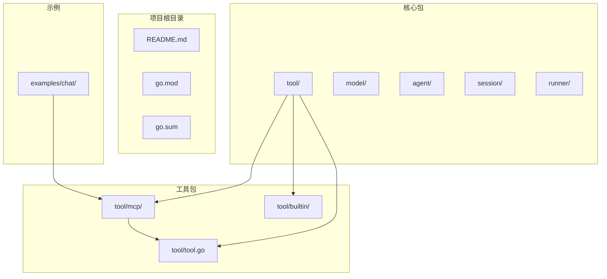

**图表来源**
- [README.md:67-89](file://README.md#L67-L89)
- [go.mod:1-47](file://go.mod#L1-L47)

**章节来源**
- [README.md:67-89](file://README.md#L67-L89)
- [go.mod:1-47](file://go.mod#L1-L47)

## 核心组件

### MCP工具集接口

MCP工具集通过`ToolSet`结构体实现，提供连接MCP服务器、发现工具和管理会话的能力：

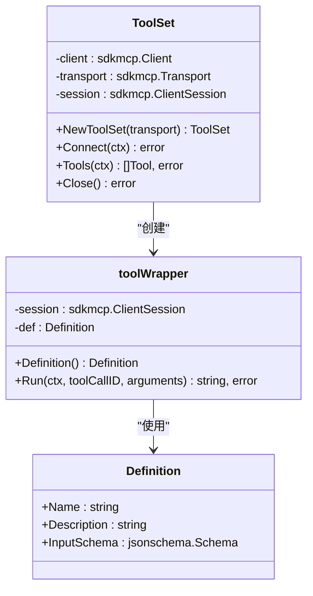

**图表来源**
- [tool/mcp/mcp.go:15-90](file://tool/mcp/mcp.go#L15-L90)
- [tool/tool.go:9-23](file://tool/tool.go#L9-L23)

### API密钥传输中间件

`apiKeyTransport`实现了HTTP传输层的中间件模式，用于在每个请求中注入API密钥：

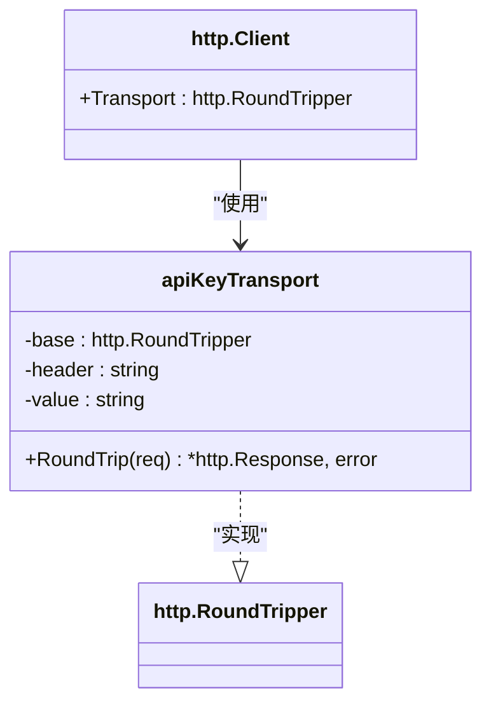

**图表来源**
- [tool/mcp/mcp_test.go:21-42](file://tool/mcp/mcp_test.go#L21-L42)
- [examples/chat/main.go:39-50](file://examples/chat/main.go#L39-L50)

**章节来源**
- [tool/mcp/mcp.go:15-90](file://tool/mcp/mcp.go#L15-L90)
- [tool/mcp/mcp_test.go:21-42](file://tool/mcp/mcp_test.go#L21-L42)
- [examples/chat/main.go:39-50](file://examples/chat/main.go#L39-L50)

## 架构概览

MCP工具集成的整体架构遵循ADK的设计原则，实现了松耦合的工具抽象：

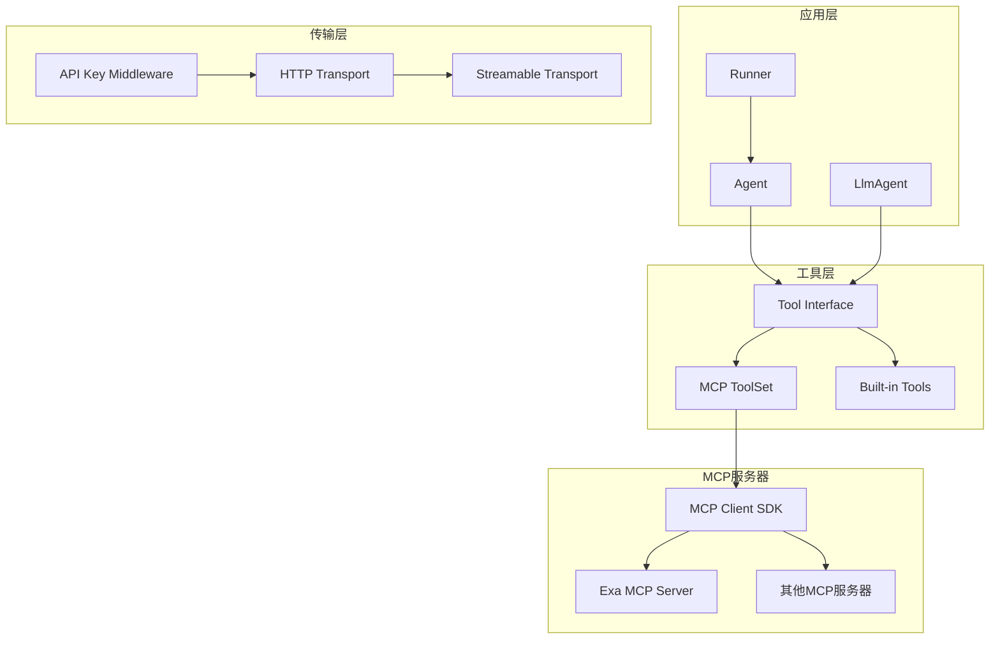

**图表来源**
- [README.md:37-60](file://README.md#L37-L60)
- [tool/mcp/mcp.go:22-43](file://tool/mcp/mcp.go#L22-L43)

## 详细组件分析

### MCP工具集实现

#### 连接建立流程

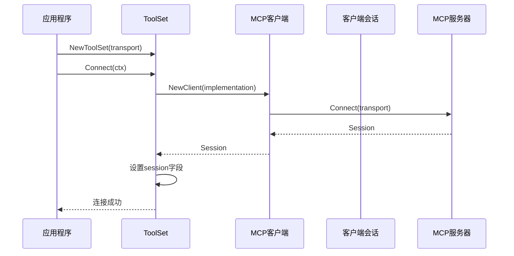

**图表来源**
- [tool/mcp/mcp.go:22-43](file://tool/mcp/mcp.go#L22-L43)

#### 工具发现和包装

工具发现过程涉及从MCP服务器获取工具定义，并将其转换为统一的工具接口：

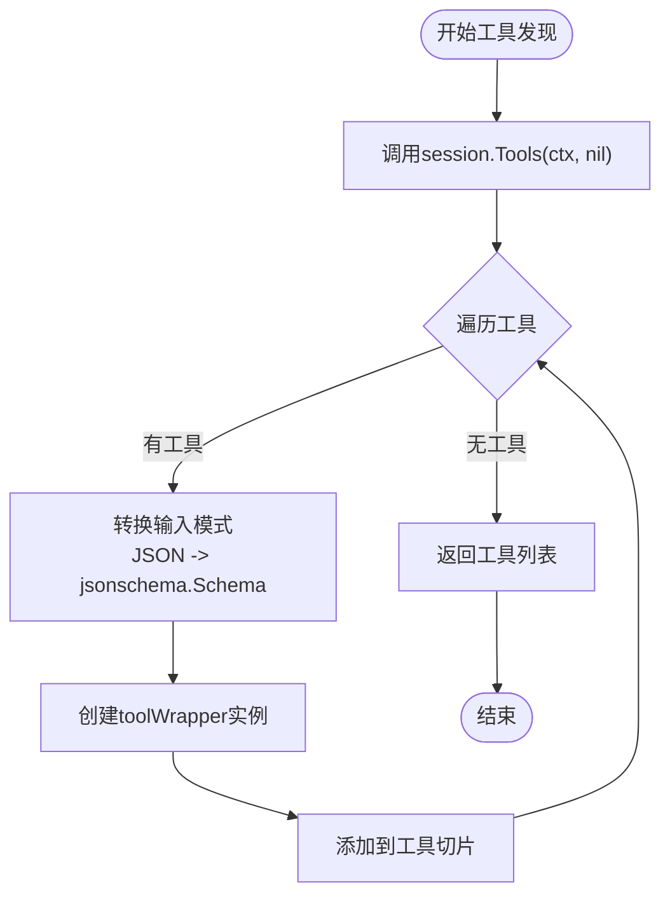

**图表来源**
- [tool/mcp/mcp.go:45-72](file://tool/mcp/mcp.go#L45-L72)

#### 工具执行生命周期

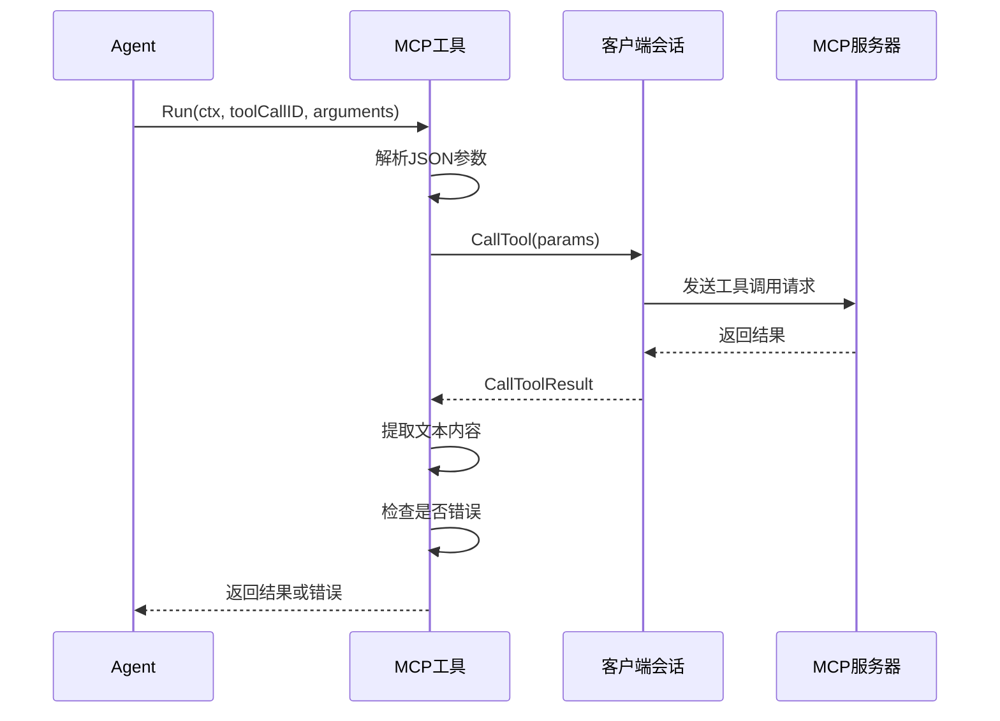

**图表来源**
- [tool/mcp/mcp.go:92-109](file://tool/mcp/mcp.go#L92-L109)

**章节来源**
- [tool/mcp/mcp.go:35-120](file://tool/mcp/mcp.go#L35-L120)

### API密钥传输中间件详解

#### 实现原理

`apiKeyTransport`实现了`http.RoundTripper`接口，通过装饰器模式在HTTP请求上注入API密钥：

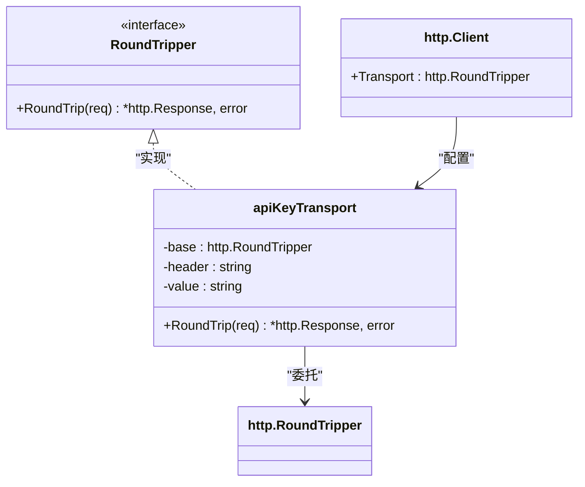

**图表来源**
- [tool/mcp/mcp_test.go:21-32](file://tool/mcp/mcp_test.go#L21-L32)

#### 认证处理流程

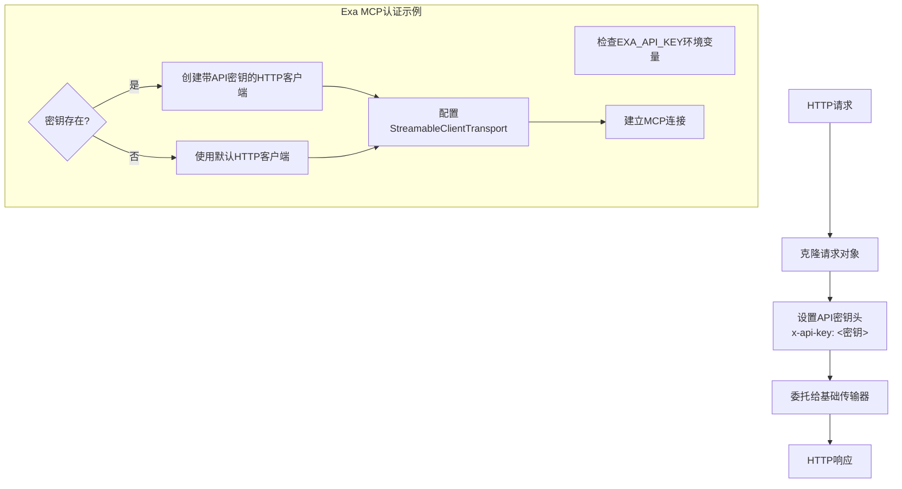

**图表来源**
- [tool/mcp/mcp_test.go:34-42](file://tool/mcp/mcp_test.go#L34-L42)
- [examples/chat/main.go:68-80](file://examples/chat/main.go#L68-L80)

**章节来源**
- [tool/mcp/mcp_test.go:21-42](file://tool/mcp/mcp_test.go#L21-L42)
- [examples/chat/main.go:39-80](file://examples/chat/main.go#L39-L80)

### Exa MCP工具集集成

#### 连接过程

Exa MCP工具集的连接过程展示了完整的MCP集成模式：

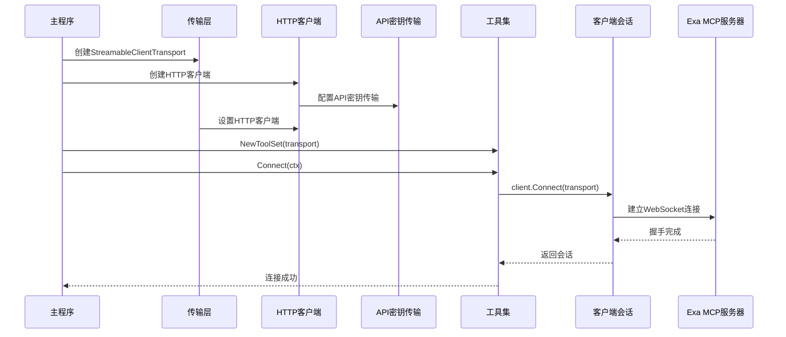

**图表来源**
- [examples/chat/main.go:68-87](file://examples/chat/main.go#L68-L87)

#### 工具列表获取

工具列表获取过程体现了MCP协议的动态特性：

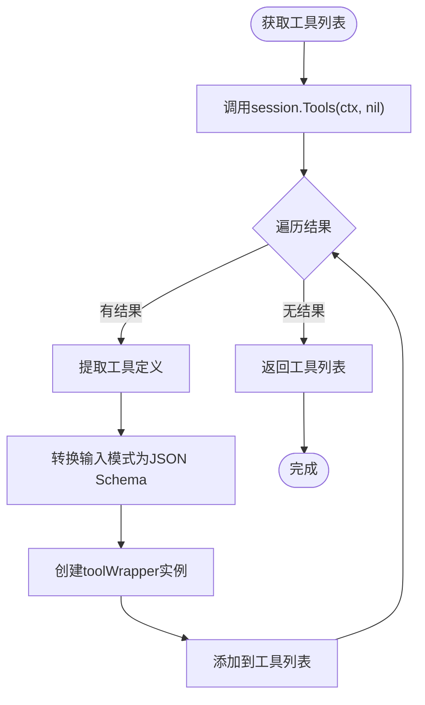

**图表来源**
- [tool/mcp/mcp.go:45-72](file://tool/mcp/mcp.go#L45-L72)

**章节来源**
- [examples/chat/main.go:68-99](file://examples/chat/main.go#L68-L99)
- [tool/mcp/mcp.go:45-72](file://tool/mcp/mcp.go#L45-L72)

### 工具定义和参数验证

#### 工具定义结构

工具定义通过`Definition`结构体提供标准化的元数据描述：

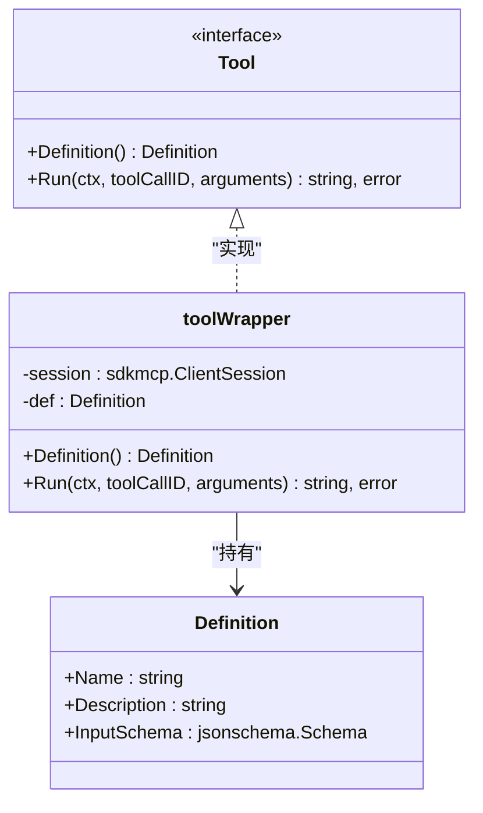

**图表来源**
- [tool/tool.go:9-23](file://tool/tool.go#L9-L23)
- [tool/mcp/mcp.go:82-90](file://tool/mcp/mcp.go#L82-L90)

#### 参数验证机制

MCP工具通过JSON Schema进行参数验证，确保调用参数的正确性：

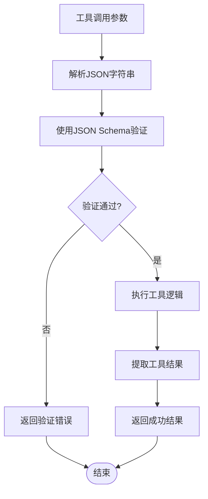

**图表来源**
- [tool/mcp/mcp.go:92-109](file://tool/mcp/mcp.go#L92-L109)

**章节来源**
- [tool/tool.go:9-23](file://tool/tool.go#L9-L23)
- [tool/mcp/mcp.go:82-120](file://tool/mcp/mcp.go#L82-L120)

## 依赖关系分析

### 外部依赖

项目依赖于多个关键库来实现MCP功能：

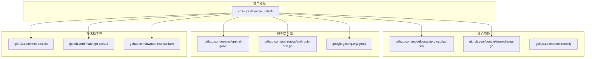

**图表来源**
- [go.mod:5-15](file://go.mod#L5-L15)

### 内部依赖关系

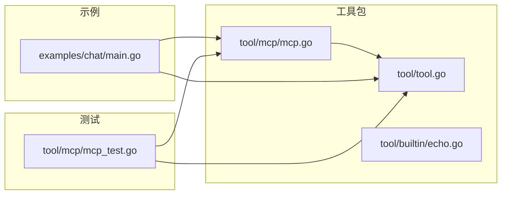

**图表来源**
- [tool/tool.go:1-24](file://tool/tool.go#L1-L24)
- [tool/mcp/mcp.go:1-13](file://tool/mcp/mcp.go#L1-L13)
- [examples/chat/main.go:14-31](file://examples/chat/main.go#L14-L31)

**章节来源**
- [go.mod:1-47](file://go.mod#L1-L47)

## 性能考虑

### 连接优化

- **延迟最小化**：MCP连接使用流式传输，减少握手延迟
- **会话复用**：单个会话可承载多个工具调用，避免重复连接
- **缓存策略**：工具定义转换后的JSON Schema进行缓存，避免重复解析

### 错误处理策略

- **连接失败重试**：建议实现指数退避重试机制
- **超时控制**：为工具调用设置合理的超时时间
- **资源清理**：确保连接关闭时释放所有资源

## 故障排除指南

### 常见连接问题

#### API密钥认证失败

**症状**：连接MCP服务器时返回认证错误

**解决方案**：
1. 验证API密钥环境变量是否正确设置
2. 检查HTTP传输层配置是否正确
3. 确认MCP服务器支持的认证方式

#### 工具发现失败

**症状**：无法获取工具列表或工具列表为空

**解决方案**：
1. 检查MCP服务器状态和可达性
2. 验证工具定义的JSON Schema格式
3. 确认网络连接和防火墙设置

#### 工具调用错误

**症状**：工具执行过程中出现参数验证错误

**解决方案**：
1. 检查传入参数的JSON格式
2. 验证JSON Schema定义的约束条件
3. 查看服务器返回的具体错误信息

### 调试技巧

#### 日志记录

启用详细的日志记录来跟踪MCP通信：

```go
// 在连接前启用调试日志
transport.Debug = true
```

#### 网络诊断

使用网络诊断工具检查MCP服务器的连通性：

```bash
# 检查MCP服务器端点
curl -I https://mcp.exa.ai/mcp

# 检查API密钥认证
curl -H "x-api-key: YOUR_API_KEY" https://mcp.exa.ai/mcp
```

#### 错误追踪

实现错误追踪机制来捕获和分析MCP调用中的异常：

```go
// 包装错误以保留上下文
return fmt.Errorf("mcp tool %q: %w", t.def.Name, err)
```

**章节来源**
- [tool/mcp/mcp.go:35-43](file://tool/mcp/mcp.go#L35-L43)
- [tool/mcp/mcp.go:45-51](file://tool/mcp/mcp.go#L45-L51)
- [tool/mcp/mcp.go:92-109](file://tool/mcp/mcp.go#L92-L109)

## 结论

本MCP工具集成示例展示了如何在ADK框架中无缝集成外部MCP服务器。通过`apiKeyTransport`中间件实现API密钥注入，通过`ToolSet`结构体提供统一的工具抽象接口，以及通过`toolWrapper`实现MCP工具到通用工具接口的转换。

该实现具有以下特点：
- **模块化设计**：清晰的职责分离和接口抽象
- **认证灵活**：支持多种认证方式和自定义传输层
- **类型安全**：通过JSON Schema实现参数验证
- **易于扩展**：支持新的MCP服务器和工具类型

开发者可以基于此示例快速集成各种MCP服务器，构建功能丰富的AI代理应用。

## 附录

### 支持的MCP服务器类型

| 服务器类型 | 传输方式 | 认证方式 | 示例用途 |
|------------|----------|----------|----------|
| Exa MCP | StreamableClientTransport | API密钥头 | 搜索工具 |
| 标准MCP | StreamableClientTransport | WebSocket | 通用工具 |
| 本地MCP | StdioTransport | 无 | 开发测试 |

### 最佳实践

1. **错误处理**：始终实现适当的错误处理和重试机制
2. **资源管理**：确保正确关闭MCP连接和会话
3. **参数验证**：利用JSON Schema进行严格的参数验证
4. **监控**：实现连接状态监控和性能指标收集
5. **安全**：妥善管理API密钥和敏感信息