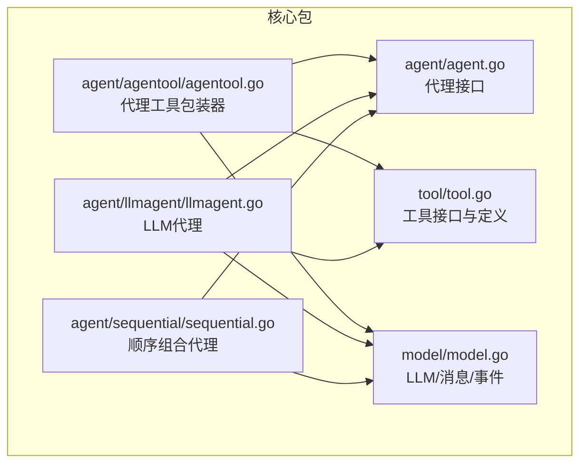
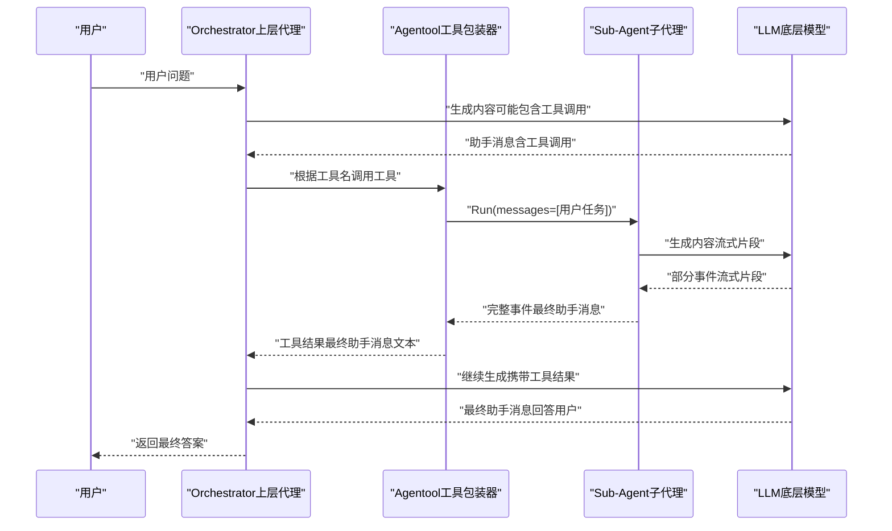
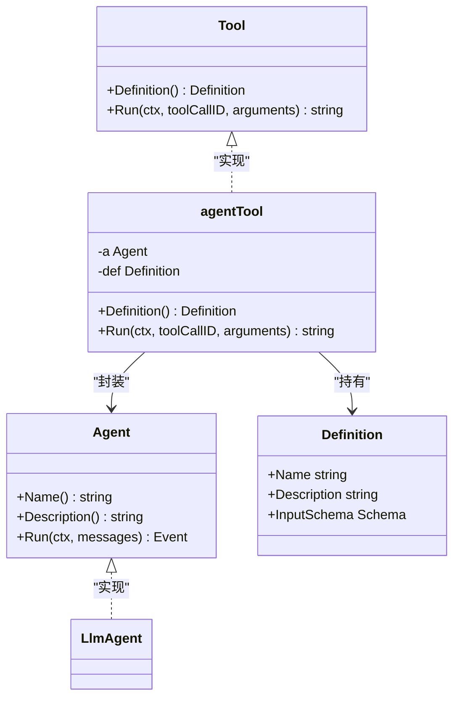
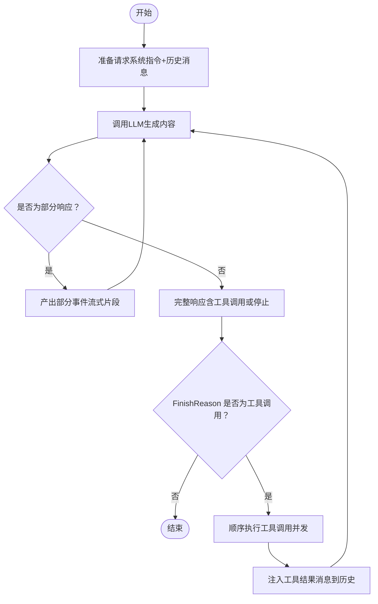
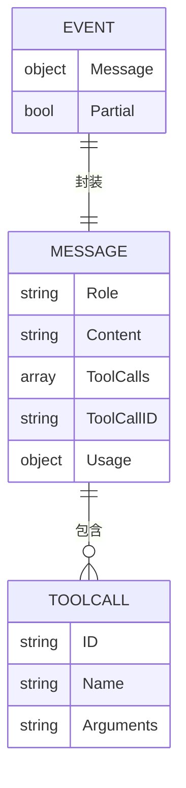
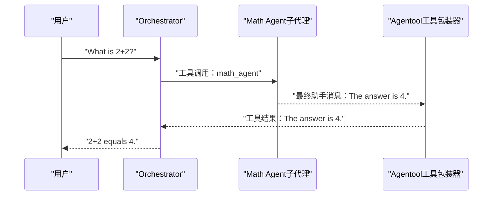
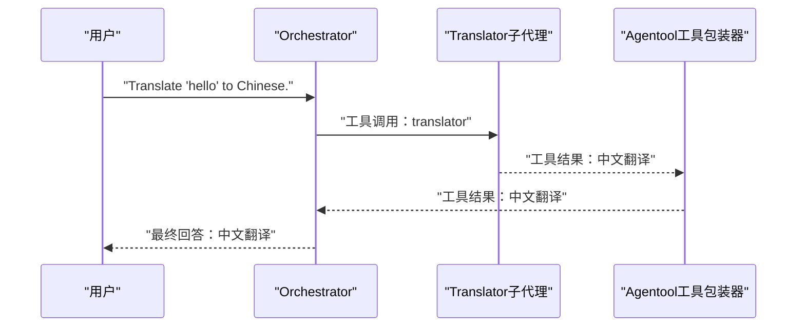
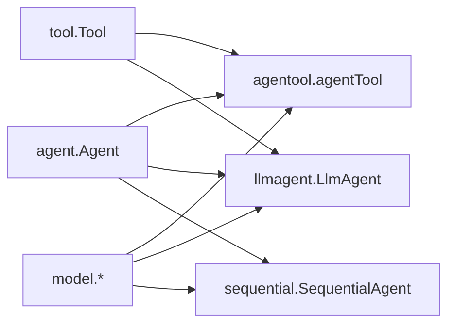

# 代理工具包装示例

<cite>
**本文引用的文件**
- [agentool.go](file://agent/agentool/agentool.go)
- [agentool_test.go](file://agent/agentool/agentool_test.go)
- [agent.go](file://agent/agent.go)
- [tool.go](file://tool/tool.go)
- [llmagent.go](file://agent/llmagent/llmagent.go)
- [model.go](file://model/model.go)
- [sequential.go](file://agent/sequential/sequential.go)
- [README.md](file://README.md)
- [main.go](file://examples/chat/main.go)
</cite>

## 目录
1. [简介](#简介)
2. [项目结构](#项目结构)
3. [核心组件](#核心组件)
4. [架构总览](#架构总览)
5. [详细组件分析](#详细组件分析)
6. [依赖关系分析](#依赖关系分析)
7. [性能考虑](#性能考虑)
8. [故障排查指南](#故障排查指南)
9. [结论](#结论)
10. [附录](#附录)

## 简介
本文件围绕代理工具包装（Agentool）功能，系统性地阐述如何将任意代理（Agent）封装为工具（Tool），从而让该代理能够在其他代理的工具调用循环中被调用。文档重点覆盖：
- 设计思想与工作原理：通过将代理封装为工具，实现“代理作为工具”的能力，支持多层代理协作与复杂AI工作流编排。
- 配置参数详解：代理实例、工具名称与描述的作用，输入参数Schema的自动生成与校验。
- 工作流程：从工具调用到代理执行再到结果返回的完整过程，包括事件流、流式输出与最终消息的处理。
- 实际应用案例：将专门的分析代理封装为工具供通用代理调用、构建代理层次结构、实现复杂AI工作流编排。
- 工具注册机制、参数传递、错误处理与性能优化策略。
- 与其他代理组合方式的协同使用，以及在复杂AI系统中的架构设计模式。

## 项目结构
该项目采用模块化设计，核心包包括：
- agent：代理接口与具体实现（如LLM代理、顺序/并行组合代理）
- agentool：代理工具包装器，将任意Agent封装为Tool
- tool：工具接口与定义
- model：LLM抽象、消息类型、事件等
- examples：示例程序（如基于MCP的聊天代理）

图表来源
- [agentool.go:1-79](file://agent/agentool/agentool.go#L1-L79)
- [agent.go:10-19](file://agent/agent.go#L10-L19)
- [tool.go:9-23](file://tool/tool.go#L9-L23)
- [model.go:10-227](file://model/model.go#L10-L227)
- [llmagent.go:30-159](file://agent/llmagent/llmagent.go#L30-L159)
- [sequential.go:18-93](file://agent/sequential/sequential.go#L18-L93)

章节来源
- [README.md:67-89](file://README.md#L67-L89)
- [README.md:338-357](file://README.md#L338-L357)

## 核心组件
- 代理接口（agent.Agent）：定义Name、Description与Run方法，Run返回事件迭代器，支持流式输出与完整消息。
- 工具接口（tool.Tool）：定义Definition（含名称、描述、输入Schema）与Run方法（接收工具调用ID与JSON参数字符串）。
- 代理工具包装器（agentool.agentTool）：将Agent封装为Tool，自动提取Agent的Name与Description作为工具元数据，并生成输入Schema；Run时将任务字符串作为用户消息传入Agent，仅返回最后一条助手消息作为工具结果。
- LLM代理（llmagent.LlmAgent）：驱动LLM进行对话，自动处理工具调用循环，按顺序执行工具并注入工具结果消息，直至模型停止或完成所有工具调用。
- 模型抽象（model）：统一LLM接口、消息类型、工具调用结构、事件结构与生成配置。

章节来源
- [agent.go:10-19](file://agent/agent.go#L10-L19)
- [tool.go:9-23](file://tool/tool.go#L9-L23)
- [agentool.go:16-79](file://agent/agentool/agentool.go#L16-L79)
- [llmagent.go:30-159](file://agent/llmagent/llmagent.go#L30-L159)
- [model.go:10-227](file://model/model.go#L10-L227)

## 架构总览
下图展示了“代理作为工具”在系统中的位置与交互关系：上层代理（Orchestrator）通过工具调用委托给子代理（Sub-Agent），子代理以事件流形式产生中间消息与最终答案，工具包装器负责将子代理的最终助手消息作为工具结果返回给上层代理。

图表来源
- [llmagent.go:56-136](file://agent/llmagent/llmagent.go#L56-L136)
- [agentool.go:54-78](file://agent/agentool/agentool.go#L54-L78)
- [model.go:152-178](file://model/model.go#L152-L178)

## 详细组件分析

### 代理工具包装器（Agentool）
- 设计目标：将任意实现了Agent接口的代理封装为Tool，使其可被其他代理通过函数调用机制调用。
- 关键点：
  - 元数据：工具名称与描述直接取自Agent的Name与Description。
  - 输入Schema：通过反射生成taskRequest的JSON Schema，确保LLM能正确构造参数。
  - 执行逻辑：将arguments解析为taskRequest，构造单条用户消息（任务），运行Agent并仅保留最后一条非流式的助手消息作为工具结果返回。
  - 错误处理：对参数解析失败与Agent执行错误进行包装并返回。

图表来源
- [agentool.go:16-79](file://agent/agentool/agentool.go#L16-L79)
- [agent.go:10-19](file://agent/agent.go#L10-L19)
- [tool.go:9-23](file://tool/tool.go#L9-L23)

章节来源
- [agentool.go:16-79](file://agent/agentool/agentool.go#L16-L79)

### LLM代理（工具调用循环）
- 职责：驱动LLM生成内容，自动处理工具调用循环，按顺序执行工具并注入工具结果消息。
- 关键点：
  - 将系统指令与历史消息拼接为请求，持续调用LLM直到FinishReason非工具调用。
  - 对于工具调用，按顺序执行每个工具调用，生成工具消息并注入历史，再继续下一轮生成。
  - 支持并发执行多个工具调用（保持原始顺序），并合并结果。
  - 流式输出：在生成过程中先产出部分事件，再产出完整事件。

图表来源
- [llmagent.go:56-136](file://agent/llmagent/llmagent.go#L56-L136)

章节来源
- [llmagent.go:30-159](file://agent/llmagent/llmagent.go#L30-L159)

### 事件与消息模型
- 事件（model.Event）：封装消息与Partial标志，区分流式片段与完整消息。
- 消息（model.Message）：包含角色、内容、工具调用、工具调用ID、用量统计等字段。
- 工具调用（model.ToolCall）：包含工具名、参数（JSON字符串）、调用ID等。
- 完整的消息流转：用户消息 -> 助手消息（含工具调用） -> 工具结果消息 -> 助手消息（最终回答）。

图表来源
- [model.go:152-178](file://model/model.go#L152-L178)
- [model.go:130-143](file://model/model.go#L130-L143)
- [model.go:214-226](file://model/model.go#L214-L226)

章节来源
- [model.go:10-227](file://model/model.go#L10-L227)

### 使用示例与工作流程

#### 示例一：数学计算代理作为工具
- 子代理：专门解决简单数学问题，返回单条助手消息。
- 上层代理：通过Agentool将子代理封装为工具，当用户提问时，上层代理决定调用该工具，收到工具结果后生成最终答案。
- 测试验证：使用模拟LLM确保测试确定性，验证工具调用、工具结果与最终回答的序列。

图表来源
- [agentool_test.go:59-136](file://agent/agentool/agentool_test.go#L59-L136)
- [agentool.go:54-78](file://agent/agentool/agentool.go#L54-L78)

章节来源
- [agentool_test.go:59-136](file://agent/agentool/agentool_test.go#L59-L136)

#### 示例二：翻译代理作为工具（集成测试）
- 子代理：翻译器，指令明确只返回翻译后的文本。
- 上层代理：通过Agentool注册翻译工具，当用户请求翻译时，上层代理调用翻译工具，收到工具结果后生成最终回答。
- 集成测试：使用真实LLM（需设置OPENAI_API_KEY等环境变量）验证端到端流程。

图表来源
- [agentool_test.go:158-235](file://agent/agentool/agentool_test.go#L158-L235)
- [agentool.go:54-78](file://agent/agentool/agentool.go#L54-L78)

章节来源
- [agentool_test.go:158-235](file://agent/agentool/agentool_test.go#L158-L235)

### 参数传递与Schema生成
- 参数结构：taskRequest包含单一字段task（任务描述），用于封装子代理的输入。
- Schema生成：通过反射生成JSON Schema，确保LLM能正确构造工具调用参数。
- 参数解析：工具Run时将arguments解析为taskRequest，构造用户消息并传入Agent。

章节来源
- [agentool.go:23-48](file://agent/agentool/agentool.go#L23-L48)

### 错误处理策略
- 参数解析错误：对arguments解析失败进行包装并返回错误。
- Agent执行错误：捕获Agent运行期间的错误并返回。
- 工具未找到：当上层代理无法匹配工具名时，返回工具不存在的错误信息。
- 流式与完整消息：仅在非流式且角色为助手且内容非空时才记录为工具结果。

章节来源
- [agentool.go:54-78](file://agent/agentool/agentool.go#L54-L78)
- [llmagent.go:138-159](file://agent/llmagent/llmagent.go#L138-L159)

### 性能优化建议
- 并发工具调用：上层代理在工具调用阶段并发执行多个工具，提升整体吞吐。
- 流式输出：利用Partial事件实现实时显示，改善用户体验。
- 最终消息聚合：仅在非流式完整消息时进行持久化或后续处理，减少无效写入。
- 顺序组合代理：在需要上下文累积的场景，使用顺序组合代理串联多个子代理，避免重复计算。

章节来源
- [llmagent.go:116-133](file://agent/llmagent/llmagent.go#L116-L133)
- [sequential.go:46-92](file://agent/sequential/sequential.go#L46-L92)

## 依赖关系分析
- Agentool依赖Agent接口、Tool接口与模型抽象，用于事件流与消息结构。
- LlmAgent依赖Agent接口、Tool接口与模型抽象，负责工具调用循环与消息注入。
- Sequential Agent依赖Agent接口与模型抽象，实现多代理顺序组合。

图表来源
- [agentool.go:16-79](file://agent/agentool/agentool.go#L16-L79)
- [llmagent.go:30-159](file://agent/llmagent/llmagent.go#L30-L159)
- [sequential.go:18-93](file://agent/sequential/sequential.go#L18-L93)

章节来源
- [agentool.go:16-79](file://agent/agentool/agentool.go#L16-L79)
- [llmagent.go:30-159](file://agent/llmagent/llmagent.go#L30-L159)
- [sequential.go:18-93](file://agent/sequential/sequential.go#L18-L93)

## 性能考虑
- 工具调用并发：上层代理在工具调用阶段并发执行多个工具，缩短端到端延迟。
- 流式输出：Partial事件用于实时显示，减少等待时间，提升交互体验。
- 事件过滤：仅在非流式完整消息时进行持久化或后续处理，降低I/O压力。
- 顺序组合：在需要上下文累积的场景，顺序组合代理可避免重复计算，提高整体效率。

## 故障排查指南
- 工具未找到：检查上层代理的工具注册列表，确认工具名与调用名一致。
- 参数解析失败：检查arguments格式是否符合taskRequest的Schema，确保JSON有效。
- Agent执行错误：查看Agent内部日志与错误信息，定位具体步骤。
- 流式输出异常：确认Partial事件处理逻辑，确保只在完整消息时进行持久化。
- 集成测试失败：检查OPENAI_API_KEY等环境变量，确保网络连通与权限正确。

章节来源
- [agentool.go:54-78](file://agent/agentool/agentool.go#L54-L78)
- [llmagent.go:138-159](file://agent/llmagent/llmagent.go#L138-L159)
- [agentool_test.go:168-235](file://agent/agentool/agentool_test.go#L168-L235)

## 结论
Agentool通过将任意代理封装为工具，实现了“代理作为工具”的能力，使得上层代理能够以函数调用的方式委托子代理执行特定任务。结合LLM代理的工具调用循环、顺序/并行组合代理与流式事件模型，可以构建复杂的AI工作流编排，支持从简单任务委托到多层代理协作的广泛场景。通过合理的参数Schema生成、并发工具调用与流式输出策略，可以在保证功能正确性的同时获得良好的性能与用户体验。

## 附录
- 快速开始与示例：参考示例程序与README中的快速开始章节，了解如何创建LLM、构建Agent、选择会话后端与运行示例。
- MCP工具集成：示例展示了如何连接MCP服务器并将工具暴露给Agent，扩展工具生态。

章节来源
- [README.md:92-186](file://README.md#L92-L186)
- [main.go:52-177](file://examples/chat/main.go#L52-L177)