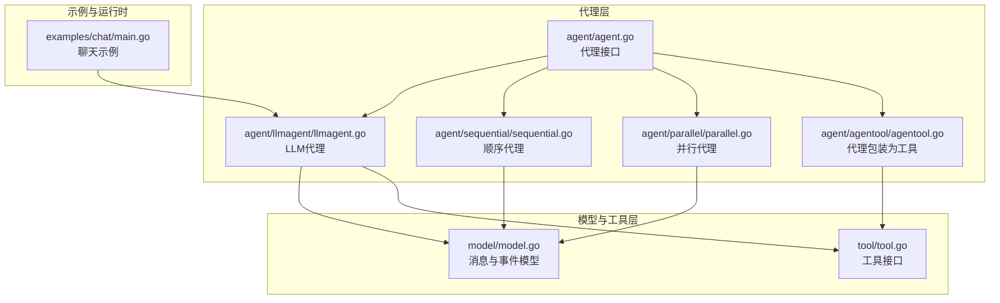
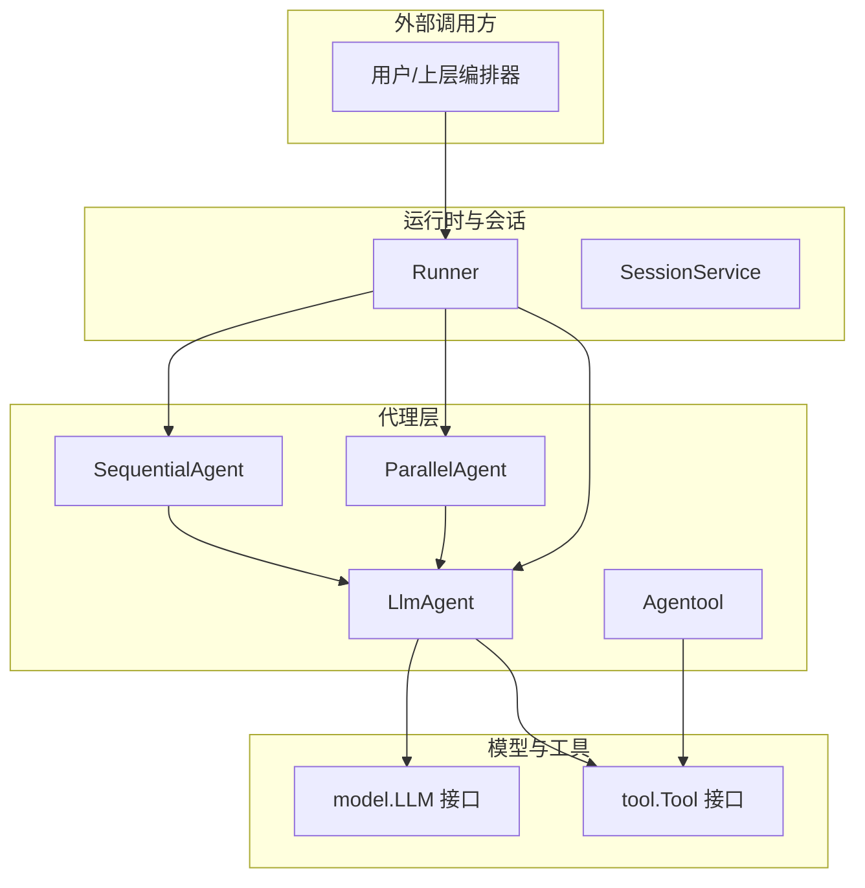
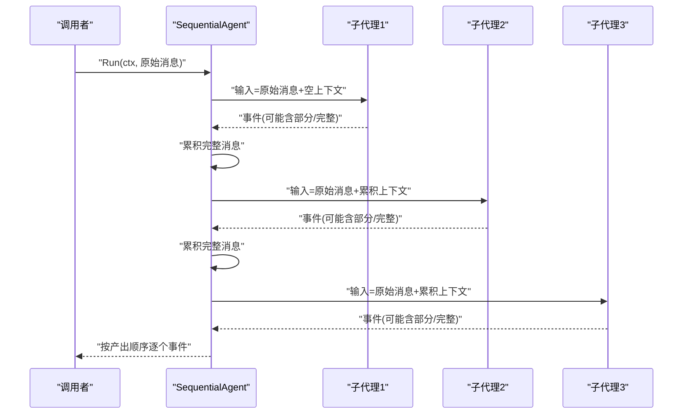
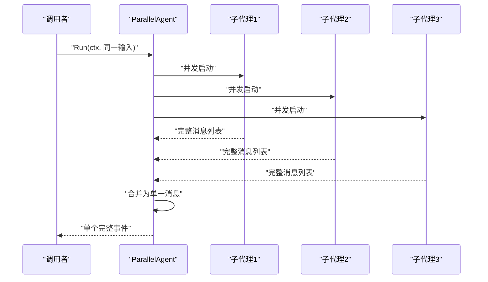
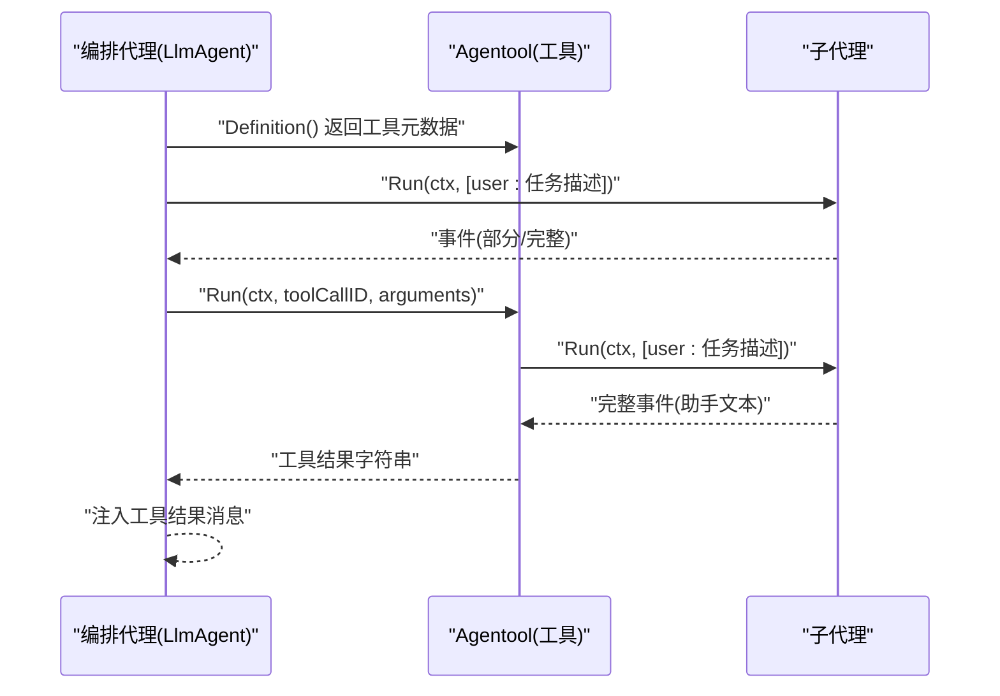
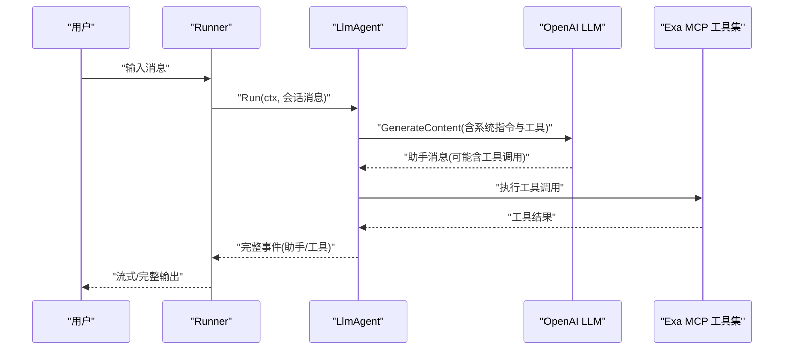
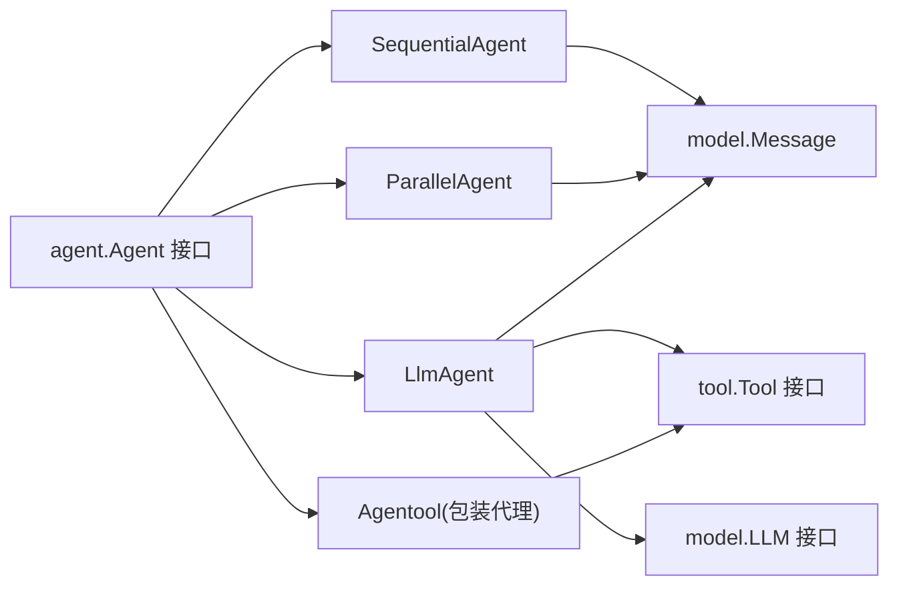

# 代理组合示例

<cite>
**本文档引用的文件**
- [agent/sequential/sequential.go](file://agent/sequential/sequential.go)
- [agent/parallel/parallel.go](file://agent/parallel/parallel.go)
- [agent/agentool/agentool.go](file://agent/agentool/agentool.go)
- [agent/agent.go](file://agent/agent.go)
- [agent/llmagent/llmagent.go](file://agent/llmagent/llmagent.go)
- [model/model.go](file://model/model.go)
- [tool/tool.go](file://tool/tool.go)
- [examples/chat/main.go](file://examples/chat/main.go)
- [agent/sequential/sequential_test.go](file://agent/sequential/sequential_test.go)
- [agent/parallel/parallel_test.go](file://agent/parallel/parallel_test.go)
- [agent/agentool/agentool_test.go](file://agent/agentool/agentool_test.go)
- [README.md](file://README.md)
</cite>

## 目录
1. [简介](#简介)
2. [项目结构](#项目结构)
3. [核心组件](#核心组件)
4. [架构总览](#架构总览)
5. [详细组件分析](#详细组件分析)
6. [依赖关系分析](#依赖关系分析)
7. [性能考量](#性能考量)
8. [故障排除指南](#故障排除指南)
9. [结论](#结论)
10. [附录](#附录)

## 简介
本文件面向希望构建复杂AI工作流的开发者，系统讲解代理组合（Agent Composition）的两大核心模式：顺序代理（SequentialAgent）与并行代理（ParallelAgent），并深入解析代理包装为工具（Agentool）的机制。通过实际示例，展示如何使用顺序代理构建线性处理管道，如何用并行代理实现多代理竞争式决策或并行计算，并说明如何将代理作为工具在其他代理中调用，从而实现更高层的编排与决策树。

本指南兼顾工程实践与可读性，既提供代码级架构图，也给出性能、错误处理与调试建议，帮助你设计高效且可维护的代理组合架构。

## 项目结构
该仓库采用分层与按功能模块划分的组织方式：
- agent：代理接口与具体实现（顺序、并行、LLM代理、代理包装为工具）
- model：跨供应商的LLM抽象与消息类型
- tool：工具接口与定义
- examples：示例应用（聊天代理）
- runner、session：运行时与会话管理（用于演示与集成）

图表来源
- [agent/agent.go:10-19](file://agent/agent.go#L10-L19)
- [agent/llmagent/llmagent.go:30-46](file://agent/llmagent/llmagent.go#L30-L46)
- [agent/sequential/sequential.go:18-41](file://agent/sequential/sequential.go#L18-L41)
- [agent/parallel/parallel.go:70-101](file://agent/parallel/parallel.go#L70-L101)
- [agent/agentool/agentool.go:16-48](file://agent/agentool/agentool.go#L16-L48)
- [model/model.go:10-227](file://model/model.go#L10-L227)
- [tool/tool.go:9-24](file://tool/tool.go#L9-L24)
- [examples/chat/main.go:101-111](file://examples/chat/main.go#L101-L111)

章节来源
- [README.md:67-89](file://README.md#L67-L89)
- [examples/chat/main.go:12-31](file://examples/chat/main.go#L12-L31)

## 核心组件
- 代理接口（Agent）：统一的Run方法，返回事件迭代器，支持部分事件（流式片段）与完整事件（可持久化消息）。
- LLM代理（LlmAgent）：基于LLM的有状态循环（工具调用循环），自动处理工具调用与结果注入。
- 顺序代理（SequentialAgent）：按序执行多个子代理，每个子代理接收原始输入与之前所有完整消息组成的上下文。
- 并行代理（ParallelAgent）：并发启动多个子代理，收集完整消息后合并为单一输出。
- 代理包装为工具（Agentool）：将任意代理包装为工具，供其他代理通过函数调用机制调用。

章节来源
- [agent/agent.go:10-19](file://agent/agent.go#L10-L19)
- [agent/llmagent/llmagent.go:30-136](file://agent/llmagent/llmagent.go#L30-L136)
- [agent/sequential/sequential.go:18-92](file://agent/sequential/sequential.go#L18-L92)
- [agent/parallel/parallel.go:70-174](file://agent/parallel/parallel.go#L70-L174)
- [agent/agentool/agentool.go:16-78](file://agent/agentool/agentool.go#L16-L78)

## 架构总览
下图展示了顺序与并行代理在整体架构中的位置以及与LLM代理、工具系统的交互关系。

图表来源
- [agent/sequential/sequential.go:18-92](file://agent/sequential/sequential.go#L18-L92)
- [agent/parallel/parallel.go:70-174](file://agent/parallel/parallel.go#L70-L174)
- [agent/llmagent/llmagent.go:30-136](file://agent/llmagent/llmagent.go#L30-L136)
- [agent/agentool/agentool.go:16-78](file://agent/agentool/agentool.go#L16-L78)
- [model/model.go:10-227](file://model/model.go#L10-L227)
- [tool/tool.go:9-24](file://tool/tool.go#L9-L24)

## 详细组件分析

### 顺序代理（SequentialAgent）
顺序代理将多个代理按固定顺序串联，前一个代理的完整消息（非部分事件）会被累积并注入到下一个代理的输入上下文中，确保下游代理具备充分的历史信息。此外，为保证后续代理看到以用户消息结尾的对话格式，会在相邻代理之间注入“请继续”手牌消息。

图表来源
- [agent/sequential/sequential.go:56-92](file://agent/sequential/sequential.go#L56-L92)

实现要点
- 输入构建：每次调用时，将原始消息与已累积的完整消息拼接；从第二个代理开始注入手牌消息。
- 上下文累积：仅累积非部分事件（完整消息），保证下游代理看到的是稳定的历史。
- 错误传播：任一子代理返回错误即终止并向上抛出。
- 提前退出：调用者可中断迭代，提前停止后续代理执行。

适用场景
- 多阶段问答：检索→摘要→翻译→润色
- 数据处理流水线：清洗→分类→标注→汇总
- 决策链：规则过滤→专家判断→最终裁决

章节来源
- [agent/sequential/sequential.go:18-92](file://agent/sequential/sequential.go#L18-L92)
- [agent/sequential/sequential_test.go:133-182](file://agent/sequential/sequential_test.go#L133-L182)
- [agent/sequential/sequential_test.go:184-240](file://agent/sequential/sequential_test.go#L184-L240)
- [agent/sequential/sequential_test.go:253-294](file://agent/sequential/sequential_test.go#L253-L294)
- [agent/sequential/sequential_test.go:296-328](file://agent/sequential/sequential_test.go#L296-L328)

### 并行代理（ParallelAgent）
并行代理并发启动多个子代理，各自独立运行，互不共享状态。所有子代理完成后，通过合并函数将各代理的完整消息整合为单一输出消息，保持对话历史的简洁性与一致性。

图表来源
- [agent/parallel/parallel.go:112-174](file://agent/parallel/parallel.go#L112-L174)

实现要点
- 并发执行：为每个子代理启动独立goroutine，使用WaitGroup等待全部完成。
- 上下文取消：任一子代理报错时，立即取消共享上下文，促使其他子代理尽快退出。
- 结果收集：仅收集非部分事件（完整消息）用于合并。
- 默认合并策略：按子代理定义顺序提取最后一个非空助手文本，添加归属标题，拼接为单一助手消息。
- 自定义合并：可通过MergeFunc完全控制合并逻辑。

适用场景
- 多模型对比：不同LLM对同一问题的竞品回答
- 并行搜索：同时调用多个搜索引擎或工具
- 竞争式决策：多个专家代理独立评估，择优输出

章节来源
- [agent/parallel/parallel.go:70-174](file://agent/parallel/parallel.go#L70-L174)
- [agent/parallel/parallel_test.go:200-268](file://agent/parallel/parallel_test.go#L200-L268)
- [agent/parallel/parallel_test.go:315-349](file://agent/parallel/parallel_test.go#L315-L349)
- [agent/parallel/parallel_test.go:351-416](file://agent/parallel/parallel_test.go#L351-L416)
- [agent/parallel/parallel_test.go:418-465](file://agent/parallel/parallel_test.go#L418-L465)
- [agent/parallel/parallel_test.go:469-530](file://agent/parallel/parallel_test.go#L469-L530)

### 代理包装为工具（Agentool）
Agentool将任意代理封装为工具，暴露给其他代理通过函数调用机制进行任务委托。调用时，传入任务描述字符串，底层会将该字符串作为用户消息发送给被包装的代理，最终只返回其最后一个非空助手文本作为工具结果。

图表来源
- [agent/agentool/agentool.go:29-78](file://agent/agentool/agentool.go#L29-L78)
- [agent/llmagent/llmagent.go:116-133](file://agent/llmagent/llmagent.go#L116-L133)

实现要点
- 工具定义：名称与描述来自被包装代理的Name()与Description()，参数Schema由任务请求结构生成。
- 调用流程：解析JSON参数，构造用户消息，运行子代理，仅保留最后一个非空助手文本作为结果。
- 隐式消费：中间的部分事件与工具调用/结果消息被静默消费，避免污染上游对话历史。

适用场景
- 专家代理委派：编排代理根据需求动态调用特定子代理
- 决策树：在不同分支上委派给专门的子代理进行评估
- 模块化扩展：将复杂任务拆分为可复用的子代理

章节来源
- [agent/agentool/agentool.go:16-78](file://agent/agentool/agentool.go#L16-L78)
- [agent/agentool/agentool_test.go:59-136](file://agent/agentool/agentool_test.go#L59-L136)
- [agent/agentool/agentool_test.go:158-235](file://agent/agentool/agentool_test.go#L158-L235)

### 示例：聊天代理（基于OpenAI与MCP工具）
示例程序展示了如何将LLM代理与MCP工具结合，构建一个具备网络搜索能力的聊天代理，并通过Runner驱动会话。

图表来源
- [examples/chat/main.go:101-176](file://examples/chat/main.go#L101-L176)
- [agent/llmagent/llmagent.go:56-136](file://agent/llmagent/llmagent.go#L56-L136)

章节来源
- [examples/chat/main.go:12-177](file://examples/chat/main.go#L12-L177)

## 依赖关系分析
- 顺序代理依赖：依赖Agent接口与模型消息类型；内部通过迭代器逐个运行子代理，累积上下文。
- 并行代理依赖：同样依赖Agent接口与模型消息类型；并发运行子代理并通过WaitGroup同步，使用上下文取消实现快速失败。
- 代理包装为工具：依赖工具接口与JSON Schema生成；将代理作为工具注册到LLM代理的工具集中。
- LLM代理：依赖LLM接口与工具接口；负责工具调用循环与消息注入。

图表来源
- [agent/agent.go:10-19](file://agent/agent.go#L10-L19)
- [agent/llmagent/llmagent.go:30-136](file://agent/llmagent/llmagent.go#L30-L136)
- [agent/sequential/sequential.go:18-92](file://agent/sequential/sequential.go#L18-L92)
- [agent/parallel/parallel.go:70-174](file://agent/parallel/parallel.go#L70-L174)
- [agent/agentool/agentool.go:16-78](file://agent/agentool/agentool.go#L16-L78)
- [model/model.go:10-227](file://model/model.go#L10-L227)
- [tool/tool.go:9-24](file://tool/tool.go#L9-L24)

章节来源
- [agent/agent.go:10-19](file://agent/agent.go#L10-L19)
- [model/model.go:10-227](file://model/model.go#L10-L227)
- [tool/tool.go:9-24](file://tool/tool.go#L9-L24)

## 性能考量
- 顺序代理
  - 上下文累积：随着代理数量增加，累积的消息长度增长，可能影响LLM上下文窗口与延迟。建议在必要处进行消息压缩或历史归档。
  - 手牌注入：为保证对话格式，每次注入一条用户消息，轻微增加上下文长度。
- 并行代理
  - 并发成本：goroutine数量与资源消耗成正比，需注意CPU与内存占用。合理设置超时与并发上限。
  - 快速失败：通过上下文取消减少无效计算，提升整体吞吐。
  - 合并开销：自定义合并函数应避免昂贵操作，尽量在必要时才进行复杂处理。
- 代理包装为工具
  - 工具调用循环：频繁的工具调用会增加往返延迟，建议在编排层合并相似任务，减少不必要的工具调用次数。
  - 参数Schema：动态生成Schema有一定开销，可在初始化时缓存。

[本节为通用性能指导，无需特定文件引用]

## 故障排除指南
- 顺序代理
  - 提前退出：若调用者在收到首个事件后中断迭代，后续代理不会被执行。检查调用侧是否正确处理迭代器。
  - 错误传播：任一代理报错会终止整个序列。建议在编排层捕获错误并进行降级处理。
  - 上下文验证：通过测试用例可验证第二代理是否收到第一代理的输出作为上下文。
- 并行代理
  - 并发验证：使用阻塞型Mock验证并发执行，确保两个代理同时启动而非串行。
  - 错误传播：任一代理错误会触发上下文取消，其他代理尽快退出。确认取消逻辑是否按预期工作。
  - 合并策略：默认合并会忽略无助手文本的代理。如需包含空代理结果，请实现自定义合并函数。
- 代理包装为工具
  - 参数解析：确保传入的arguments为合法JSON，且包含任务描述字段。
  - 结果截取：仅返回最后一个非空助手文本，避免中间片段污染工具结果。

章节来源
- [agent/sequential/sequential_test.go:253-294](file://agent/sequential/sequential_test.go#L253-L294)
- [agent/sequential/sequential_test.go:296-328](file://agent/sequential/sequential_test.go#L296-L328)
- [agent/sequential/sequential_test.go:184-240](file://agent/sequential/sequential_test.go#L184-L240)
- [agent/parallel/parallel_test.go:200-268](file://agent/parallel/parallel_test.go#L200-L268)
- [agent/parallel/parallel_test.go:315-349](file://agent/parallel/parallel_test.go#L315-L349)
- [agent/agentool/agentool_test.go:59-136](file://agent/agentool/agentool_test.go#L59-L136)

## 结论
通过顺序代理与并行代理，你可以灵活地构建从简单到复杂的AI工作流：顺序代理适合需要逐步增强上下文的多阶段任务，而并行代理则擅长在同一输入上并行探索多种可能性。配合代理包装为工具的能力，可以实现更高层次的编排与决策树，使系统具备更强的模块化与可扩展性。在实践中，建议结合性能与可靠性要求，合理选择组合模式，并在编排层做好错误处理与监控。

[本节为总结性内容，无需特定文件引用]

## 附录

### 实际组合场景示例
- 多阶段问答
  - 步骤：检索→摘要→翻译→润色
  - 组合：顺序代理串联四个专用代理
  - 参考：顺序代理测试用例中的两步流水线
- 并行搜索
  - 场景：同时查询多个搜索引擎或工具，比较结果
  - 组合：并行代理启动多个搜索代理，使用默认合并策略输出统一结果
  - 参考：并行代理测试用例中的多语言翻译并行场景
- 决策树实现
  - 场景：根据输入特征选择不同专家代理进行评估
  - 组合：编排代理通过Agentool将任务委派给对应专家代理，再汇总结果

章节来源
- [agent/sequential/sequential_test.go:334-400](file://agent/sequential/sequential_test.go#L334-L400)
- [agent/parallel/parallel_test.go:469-530](file://agent/parallel/parallel_test.go#L469-L530)
- [agent/agentool/agentool_test.go:59-136](file://agent/agentool/agentool_test.go#L59-L136)