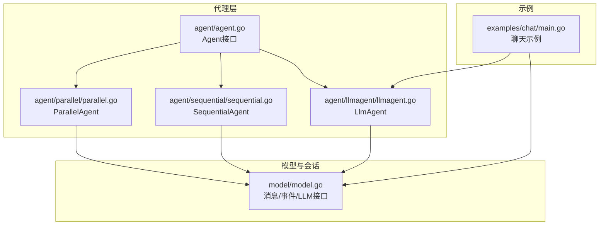
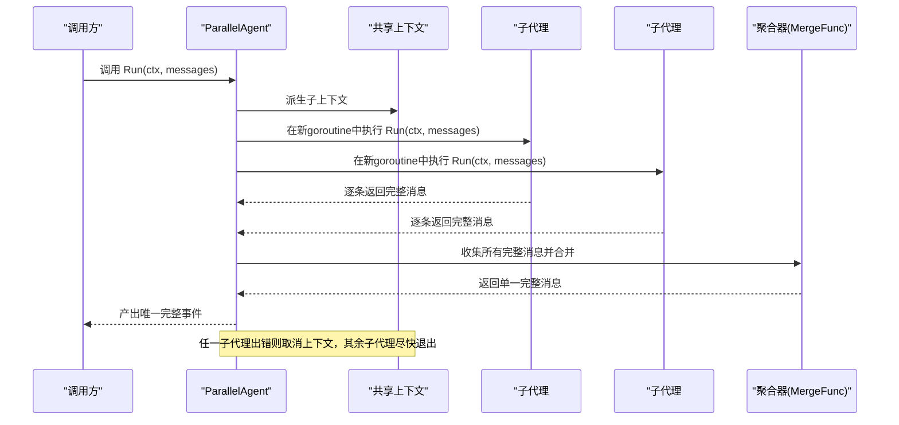
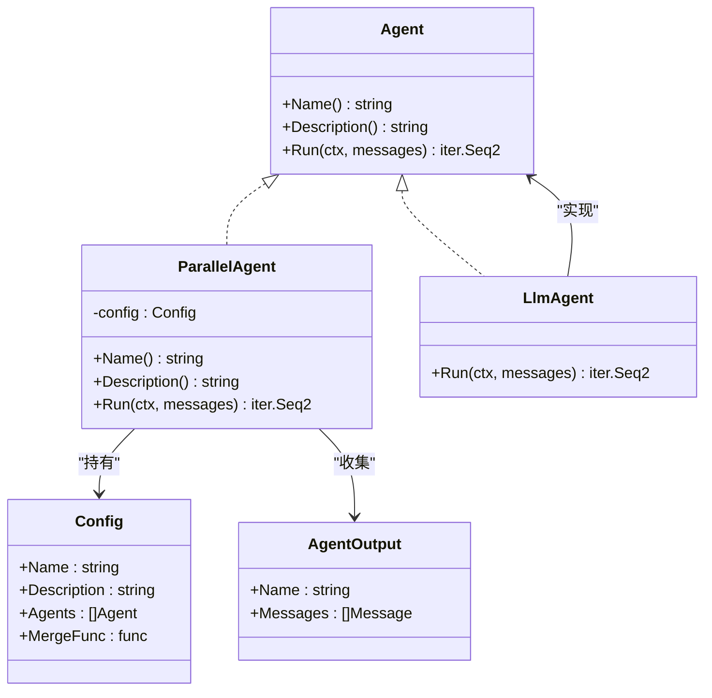
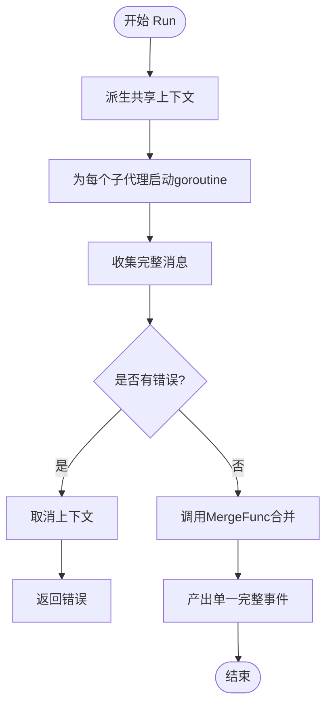
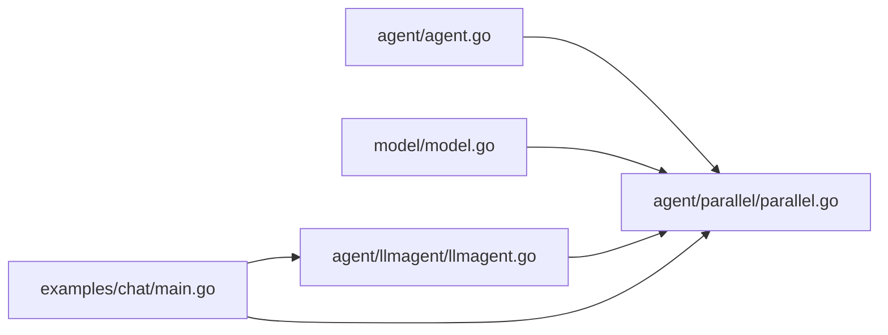

# 并行代理示例

<cite>
**本文引用的文件列表**
- [parallel.go](file://agent/parallel/parallel.go)
- [parallel_test.go](file://agent/parallel/parallel_test.go)
- [agent.go](file://agent/agent.go)
- [model.go](file://model/model.go)
- [llmagent.go](file://agent/llmagent/llmagent.go)
- [sequential.go](file://agent/sequential/sequential.go)
- [README.md](file://README.md)
- [main.go](file://examples/chat/main.go)
</cite>

## 目录
1. [简介](#简介)
2. [项目结构](#项目结构)
3. [核心组件](#核心组件)
4. [架构总览](#架构总览)
5. [详细组件分析](#详细组件分析)
6. [依赖关系分析](#依赖关系分析)
7. [性能考量](#性能考量)
8. [故障排查指南](#故障排查指南)
9. [结论](#结论)
10. [附录](#附录)

## 简介
本示例文档围绕并行代理（ParallelAgent）展开，系统讲解其设计理念与实现细节，重点包括：
- 并行执行机制：如何同时启动多个代理实例进行竞争性处理或并行计算
- 配置方式：在Config中通过Agents数组组织子代理
- 启动与协调策略：上下文传播、错误传播与优雅取消
- 事件聚合：如何合并来自多个代理的事件流并保持正确时序
- 实际应用场景：多搜索引擎并行查询、多个专家代理的竞争性分析、并行数据处理
- 最佳实践：并发控制、资源管理、错误隔离与结果整合
- 性能考量：并发度限制、内存使用与响应时间优化

## 项目结构
并行代理位于agent/parallel包中，配合通用Agent接口、消息模型与LLM代理实现，形成可组合的代理体系。

图表来源
- [agent.go:10-19](file://agent/agent.go#L10-L19)
- [parallel.go:86-101](file://agent/parallel/parallel.go#L86-L101)
- [sequential.go:30-41](file://agent/sequential/sequential.go#L30-L41)
- [llmagent.go:30-46](file://agent/llmagent/llmagent.go#L30-L46)
- [model.go:10-227](file://model/model.go#L10-L227)
- [main.go:102-111](file://examples/chat/main.go#L102-L111)

章节来源
- [README.md:67-89](file://README.md#L67-L89)
- [agent.go:10-19](file://agent/agent.go#L10-L19)
- [parallel.go:29-41](file://agent/parallel/parallel.go#L29-L41)
- [model.go:152-227](file://model/model.go#L152-L227)

## 核心组件
- Agent接口：定义统一的Run方法，返回事件迭代器，支持部分事件（流式片段）与完整事件（可持久化消息）
- ParallelAgent：并行执行多个子代理，收集完整消息后按配置合并为单一完整事件
- DefaultMergeFunc：默认合并策略，按子代理顺序提取最后一个非空助手文本，并以“[代理名]”标题格式化
- AgentOutput：承载单个子代理的名称与其完整消息序列
- Config：包含Name、Description、Agents数组与MergeFunc

章节来源
- [agent.go:10-19](file://agent/agent.go#L10-L19)
- [parallel.go:14-27](file://agent/parallel/parallel.go#L14-L27)
- [parallel.go:29-41](file://agent/parallel/parallel.go#L29-L41)
- [parallel.go:43-68](file://agent/parallel/parallel.go#L43-L68)

## 架构总览
并行代理的运行流程如下：
- 派生共享上下文，派生多个goroutine分别执行每个子代理
- 子代理仅产出完整消息（非流式片段）被收集
- 所有子代理完成后，调用MergeFunc生成单一完整事件
- 若任一子代理报错，立即取消共享上下文，其余子代理尽快退出

图表来源
- [parallel.go:112-173](file://agent/parallel/parallel.go#L112-L173)

## 详细组件分析

### 并行代理类图

图表来源
- [agent.go:10-19](file://agent/agent.go#L10-L19)
- [parallel.go:86-101](file://agent/parallel/parallel.go#L86-L101)
- [parallel.go:29-41](file://agent/parallel/parallel.go#L29-L41)
- [parallel.go:21-27](file://agent/parallel/parallel.go#L21-L27)
- [llmagent.go:30-46](file://agent/llmagent/llmagent.go#L30-L46)

章节来源
- [parallel.go:86-101](file://agent/parallel/parallel.go#L86-L101)
- [parallel.go:29-41](file://agent/parallel/parallel.go#L29-L41)
- [agent.go:10-19](file://agent/agent.go#L10-L19)

### 并行执行与事件聚合流程
- 输入：同一组messages作为每个子代理的输入
- 执行：每个子代理独立运行，仅收集完整消息；流式片段被忽略
- 聚合：按定义顺序遍历子代理输出，调用MergeFunc生成最终完整事件
- 错误：任一子代理出错即取消共享上下文，其余子代理尽快退出

图表来源
- [parallel.go:112-173](file://agent/parallel/parallel.go#L112-L173)

章节来源
- [parallel.go:112-173](file://agent/parallel/parallel.go#L112-L173)

### 默认合并策略与自定义合并
- 默认策略：提取每个子代理最后一个非空助手文本，按“[代理名]”标题拼接
- 自定义策略：通过Config.MergeFunc完全控制合并逻辑，例如拼接为“|”分隔的字符串

章节来源
- [parallel.go:43-68](file://agent/parallel/parallel.go#L43-L68)
- [parallel_test.go:351-416](file://agent/parallel/parallel_test.go#L351-L416)

### 并发度与资源管理
- 并发度：由Agents数组长度决定，每个子代理占用一个goroutine
- 上下文传播：共享父上下文，便于取消与超时控制
- 资源管理：WaitGroup确保全部子代理完成；仅收集完整消息避免内存冗余

章节来源
- [parallel.go:125-173](file://agent/parallel/parallel.go#L125-L173)

### 错误隔离与快速失败
- 任一子代理错误即触发上下文取消，使其他子代理尽早退出
- 错误直接向上游抛出，保证调用方及时感知

章节来源
- [parallel.go:119-121](file://agent/parallel/parallel.go#L119-L121)
- [parallel_test.go:315-349](file://agent/parallel/parallel_test.go#L315-L349)

### 与其他代理的对比
- 串行代理（SequentialAgent）：按顺序串联，前序输出影响后续输入，适合多步管线
- 并行代理（ParallelAgent）：同时启动，彼此独立，适合竞争性比较或并行计算

章节来源
- [sequential.go:18-92](file://agent/sequential/sequential.go#L18-L92)
- [README.md:295-336](file://README.md#L295-L336)

## 依赖关系分析
- 并行代理依赖Agent接口与消息模型，确保与任意具体代理实现解耦
- LlmAgent作为典型子代理，可直接参与并行组合
- 示例程序展示了如何将并行代理与Runner、会话服务结合

图表来源
- [agent.go:10-19](file://agent/agent.go#L10-L19)
- [parallel.go:10-12](file://agent/parallel/parallel.go#L10-L12)
- [model.go:10-227](file://model/model.go#L10-L227)
- [llmagent.go:30-46](file://agent/llmagent/llmagent.go#L30-L46)
- [main.go:102-111](file://examples/chat/main.go#L102-L111)

章节来源
- [agent.go:10-19](file://agent/agent.go#L10-L19)
- [parallel.go:10-12](file://agent/parallel/parallel.go#L10-L12)
- [model.go:10-227](file://model/model.go#L10-L227)
- [llmagent.go:30-46](file://agent/llmagent/llmagent.go#L30-L46)
- [main.go:102-111](file://examples/chat/main.go#L102-L111)

## 性能考量
- 并发度限制
  - 当Agents数量较大时，建议外部引入限流或批量拆分，避免goroutine爆炸
  - 可结合外部调度器或信号量控制最大并发数
- 内存使用
  - 仅收集完整消息，避免保存流式片段，降低内存峰值
  - 合并阶段按需构造最终消息，避免冗余复制
- 响应时间优化
  - 使用共享上下文的取消机制，快速终止失败分支
  - 合理设置超时，防止长时间阻塞
- 结果整合
  - 自定义MergeFunc可减少字符串拼接成本，或采用更高效的数据结构

## 故障排查指南
- 并发验证
  - 单元测试通过两个阻塞代理的“就绪信号”同时到达证明并行执行
- 错误传播
  - 任一子代理报错应导致整体失败并取消其他子代理
- 输出形态
  - 并行代理始终产出单一完整事件，便于下游一致性处理
- 自定义合并
  - 如合并结果不符合预期，检查MergeFunc是否正确提取最后一条非空助手消息

章节来源
- [parallel_test.go:200-268](file://agent/parallel/parallel_test.go#L200-L268)
- [parallel_test.go:315-349](file://agent/parallel/parallel_test.go#L315-L349)
- [parallel_test.go:418-465](file://agent/parallel/parallel_test.go#L418-L465)

## 结论
并行代理通过简洁的接口与明确的执行模型，实现了对多个子代理的并行调度与结果聚合。其设计强调：
- 独立性：子代理彼此隔离，互不感知
- 一致性：输出始终为单一完整事件
- 可扩展：支持自定义合并策略
- 可靠性：错误快速传播与取消

这些特性使其非常适合多模型对比、多专家竞争分析、并行数据处理等场景。

## 附录

### 实战应用建议
- 多搜索引擎并行查询
  - 将不同搜索引擎封装为子代理，使用默认合并策略汇总结果
- 多专家代理的竞争性分析
  - 为不同专家代理配置不同指令，使用自定义合并策略进行对比
- 并行数据处理
  - 将数据分片交给多个子代理并行处理，再由合并函数整合

### 与Runner/会话集成
- 示例程序展示了如何将LlmAgent与Runner、内存会话服务结合
- 并行代理可同样接入Runner，保持一致的消息历史与流式输出体验

章节来源
- [README.md:159-186](file://README.md#L159-L186)
- [main.go:113-124](file://examples/chat/main.go#L113-L124)