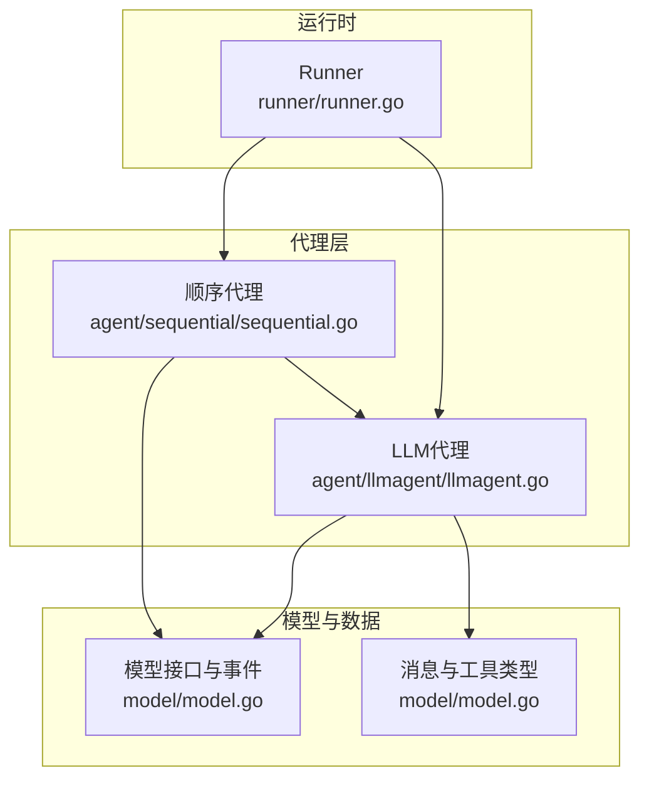
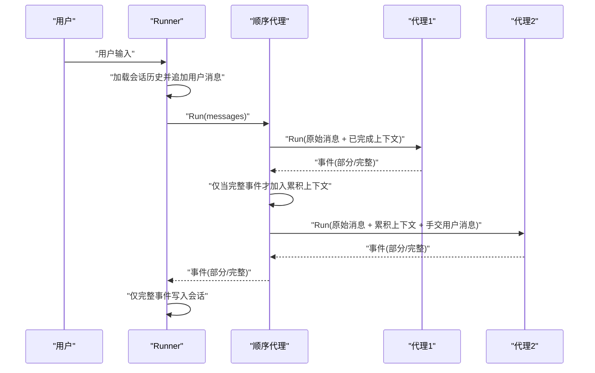
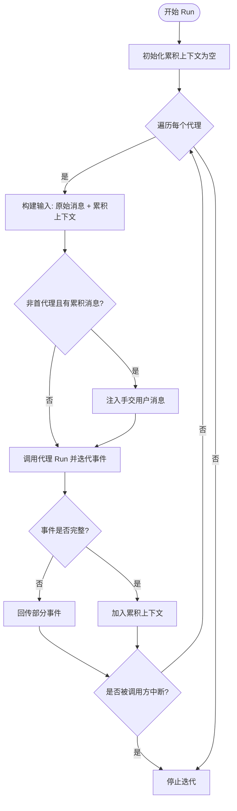
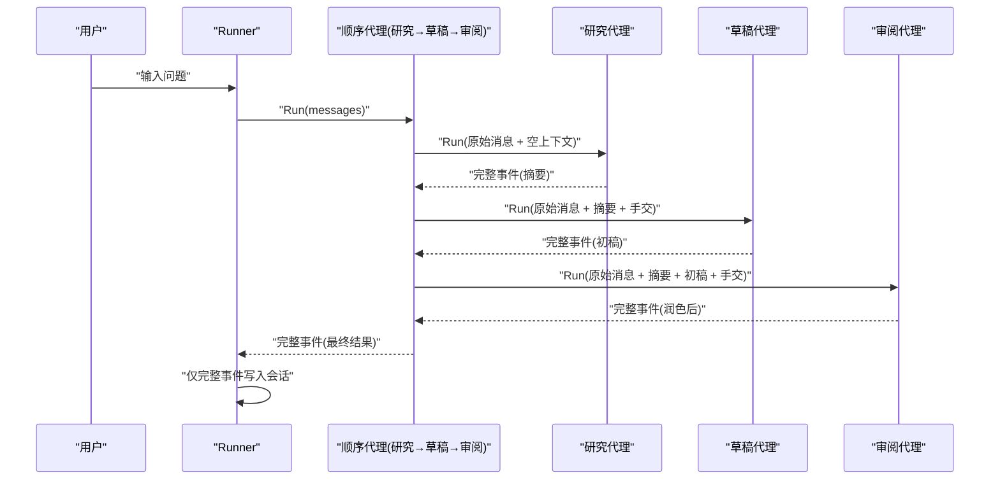
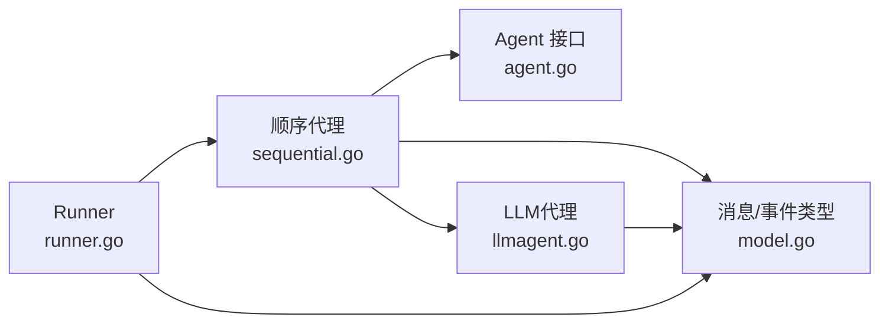

# 顺序代理示例

<cite>
**本文引用的文件**
- [sequential.go](file://agent/sequential/sequential.go)
- [sequential_test.go](file://agent/sequential/sequential_test.go)
- [agent.go](file://agent/agent.go)
- [model.go](file://model/model.go)
- [llmagent.go](file://agent/llmagent/llmagent.go)
- [runner.go](file://runner/runner.go)
- [README.md](file://README.md)
- [main.go](file://examples/chat/main.go)
</cite>

## 目录
1. [简介](#简介)
2. [项目结构](#项目结构)
3. [核心组件](#核心组件)
4. [架构总览](#架构总览)
5. [详细组件分析](#详细组件分析)
6. [依赖关系分析](#依赖关系分析)
7. [性能考量](#性能考量)
8. [故障排查指南](#故障排查指南)
9. [结论](#结论)
10. [附录](#附录)

## 简介
本文件围绕顺序代理（SequentialAgent）展开，系统讲解其设计原理与使用方法，重点覆盖以下主题：
- 如何通过线性处理管道将多个代理按顺序连接，形成复杂工作流
- Config 配置结构：Name、Description、Agents 字段的作用
- 消息传递机制：如何将前一个代理的完整消息作为上下文传递给下一个代理
- 手交消息（handoff）注入机制：确保每个代理都能看到以用户对话结尾的会话格式
- 实际应用场景示例：研究-草稿-审阅的多阶段流程
- 性能优化建议、错误处理策略与调试技巧

## 项目结构
本仓库采用分层与功能模块化组织方式，顺序代理位于 agent/sequential 子包中，配合通用模型类型、Runner 协调器以及 LLMAgent 等组件共同构成完整的代理开发套件。

图表来源
- [sequential.go:1-93](file://agent/sequential/sequential.go#L1-L93)
- [llmagent.go:1-159](file://agent/llmagent/llmagent.go#L1-L159)
- [runner.go:1-108](file://runner/runner.go#L1-L108)
- [model.go:1-227](file://model/model.go#L1-L227)

章节来源
- [README.md:67-89](file://README.md#L67-L89)

## 核心组件
- 顺序代理（SequentialAgent）
  - 负责按顺序依次执行一组代理，并在每个代理之间注入“手交”用户消息，保证后续代理接收的对话以用户回合结尾
  - 将前序所有已完成的消息累积为上下文，传递给下一个代理
- 代理接口（Agent）
  - 统一的 Run 接口，返回事件迭代器，支持部分事件（流式片段）与完整事件（可持久化）
- 模型与事件（model）
  - 定义消息、事件、LLM 请求/响应等核心数据结构，支撑顺序代理的消息传递与事件产出

章节来源
- [sequential.go:11-44](file://agent/sequential/sequential.go#L11-L44)
- [agent.go:10-19](file://agent/agent.go#L10-L19)
- [model.go:152-227](file://model/model.go#L152-L227)

## 架构总览
顺序代理的运行时交互如下：Runner 加载会话历史并追加用户输入，随后将完整消息列表交给顺序代理；顺序代理逐个执行内部代理，将累积的完整消息作为上下文传入，并在必要时注入“手交”用户消息；每个代理产生的事件逐个回传给 Runner，Runner 只对完整事件进行持久化。

图表来源
- [runner.go:45-95](file://runner/runner.go#L45-L95)
- [sequential.go:56-91](file://agent/sequential/sequential.go#L56-L91)

## 详细组件分析

### 顺序代理实现原理
- 配置结构（Config）
  - Name：顺序代理的名称，用于标识工作流
  - Description：顺序代理的描述，便于日志与监控
  - Agents：代理数组，至少包含一个代理
- 运行逻辑（Run）
  - 输入构建：将原始消息与已累积的完整消息拼接，形成当前代理的输入
  - 手交注入：除首个代理外，若已有累积消息，则注入一条用户角色的“请继续”消息，使后续代理看到以用户结尾的对话
  - 事件回传：逐个回传上游代理产生的事件（包括部分事件），并在循环中根据事件是否完整决定是否加入累积上下文
  - 提前退出：调用方可在任意时刻中断迭代；任一代理返回错误时立即终止并回传错误
- 错误处理
  - 任一代理产生错误时，顺序代理直接回传该错误并停止后续执行
  - 若调用方提前 break，顺序代理不会继续执行剩余代理

图表来源
- [sequential.go:56-91](file://agent/sequential/sequential.go#L56-L91)

章节来源
- [sequential.go:11-44](file://agent/sequential/sequential.go#L11-L44)
- [sequential.go:46-91](file://agent/sequential/sequential.go#L46-L91)

### Config 配置结构详解
- Name
  - 作用：标识顺序代理工作流的名称，便于日志、监控与追踪
  - 使用：顺序代理直接转发给上层调用者（如 Runner）
- Description
  - 作用：对顺序代理工作流进行描述，便于文档化与团队协作
  - 使用：顺序代理直接转发给上层调用者
- Agents
  - 作用：定义顺序执行的代理序列
  - 约束：至少包含一个代理；否则在 New 时触发 panic
  - 影响：每个代理都会收到“原始消息 + 已完成累积上下文”的输入

章节来源
- [sequential.go:11-16](file://agent/sequential/sequential.go#L11-L16)
- [sequential.go:34-41](file://agent/sequential/sequential.go#L34-L41)

### 消息传递机制
- 上下文累积
  - 顺序代理维护一个“已完成消息”的累积列表，仅在事件为完整（非部分）时加入
  - 下一个代理的输入由“原始消息 + 累积上下文”组成
- 事件回传
  - 顺序代理会原样回传上游代理产生的事件，包括部分事件（用于实时显示）与完整事件（用于持久化）
- 会话持久化
  - Runner 仅对完整事件进行持久化，部分事件仅用于实时展示

章节来源
- [sequential.go:56-91](file://agent/sequential/sequential.go#L56-L91)
- [runner.go:76-95](file://runner/runner.go#L76-L95)

### 手交消息（Handoff）注入机制
- 触发条件
  - 当前代理不是第一个代理，且累积上下文中已有至少一条已完成消息
- 注入内容
  - 用户角色消息，内容为“请继续”，确保后续代理看到以用户结尾的对话
- 目的
  - 适配 LLM 对话期望：每次调用都以用户回合结尾，提升推理稳定性与一致性

章节来源
- [sequential.go:67-75](file://agent/sequential/sequential.go#L67-L75)

### 实际应用场景示例：研究-草稿-审阅
- 场景描述
  - 第一步：研究代理负责检索信息并生成摘要
  - 第二步：草稿代理基于摘要撰写初稿
  - 第三步：审阅代理对初稿进行润色与校对
- 数据流
  - 研究代理输出的完整消息进入累积上下文，作为草稿代理的输入
  - 草稿代理输出的完整消息进入累积上下文，作为审阅代理的输入
  - 每个代理均以“原始消息 + 累积上下文 + 手交用户消息（除首代理外）”为输入
- 测试验证
  - 单元测试验证两个代理串联时，第二个代理的输入包含第一个代理的输出
  - 集成测试使用真实 LLM，验证两步流水线的正确性与输出质量

图表来源
- [sequential_test.go:133-182](file://agent/sequential/sequential_test.go#L133-L182)
- [sequential_test.go:334-400](file://agent/sequential/sequential_test.go#L334-L400)

章节来源
- [sequential_test.go:133-182](file://agent/sequential/sequential_test.go#L133-L182)
- [sequential_test.go:334-400](file://agent/sequential/sequential_test.go#L334-L400)

### 与其他组件的关系
- 与 Runner 的关系
  - Runner 负责加载会话历史、追加用户输入、调用代理并仅持久化完整事件
  - 顺序代理在 Runner 的驱动下运行，遵循相同的事件语义
- 与 LLMAgent 的关系
  - LLMAgent 内部维护系统提示、工具调用循环与流式输出
  - 顺序代理将累积上下文作为输入传递给 LLMAgent，使其具备更强的上下文能力

章节来源
- [runner.go:45-95](file://runner/runner.go#L45-L95)
- [llmagent.go:56-136](file://agent/llmagent/llmagent.go#L56-L136)

## 依赖关系分析
顺序代理的核心依赖关系如下：
- 顺序代理依赖 Agent 接口与 model.Message/Event 类型
- 顺序代理内部组合多个 Agent，形成线性流水线
- Runner 依赖顺序代理与会话服务，协调消息的加载、持久化与事件回传

图表来源
- [sequential.go:1-93](file://agent/sequential/sequential.go#L1-L93)
- [agent.go:10-19](file://agent/agent.go#L10-L19)
- [model.go:152-227](file://model/model.go#L152-L227)
- [runner.go:1-108](file://runner/runner.go#L1-L108)
- [llmagent.go:1-159](file://agent/llmagent/llmagent.go#L1-L159)

章节来源
- [sequential.go:1-93](file://agent/sequential/sequential.go#L1-L93)
- [agent.go:10-19](file://agent/agent.go#L10-L19)
- [model.go:152-227](file://model/model.go#L152-L227)
- [runner.go:1-108](file://runner/runner.go#L1-L108)
- [llmagent.go:1-159](file://agent/llmagent/llmagent.go#L1-L159)

## 性能考量
- 事件粒度控制
  - 顺序代理会回传上游代理产生的部分事件，适合需要实时显示的场景；但需注意频繁的迭代回调可能带来开销
- 上下文累积大小
  - 累积上下文越大，后续代理的输入越长，可能增加 token 消耗与延迟；建议在必要时进行会话压缩或限制历史长度
- 并行与串行权衡
  - 顺序代理为串行执行，天然避免并发竞争；若需要更高吞吐，可考虑并行代理（parallel）或分阶段缓存中间结果
- 资源管理
  - 在集成测试中使用超时上下文避免长时间阻塞；生产环境也应设置合理的超时与重试策略

## 故障排查指南
- 新建顺序代理时报错
  - 症状：New 时 panic
  - 原因：未提供任何代理
  - 处理：确保 Config.Agents 至少包含一个代理
- 早期退出导致后续代理未执行
  - 症状：调用方在收到第一条完整事件后 break，后续代理未被调用
  - 原因：顺序代理在迭代中检测到调用方中断即停止
  - 处理：确认业务逻辑是否需要等待全部步骤完成
- 错误传播
  - 症状：任一代理返回错误，顺序代理立即终止并回传错误
  - 处理：检查该代理的输入上下文与工具调用；必要时在上游进行预处理
- 手交消息未生效
  - 症状：后续代理未看到以用户结尾的对话
  - 原因：当前代理为首个代理或累积上下文为空
  - 处理：确认累积上下文是否正确更新（仅完整事件才会加入）

章节来源
- [sequential.go:34-41](file://agent/sequential/sequential.go#L34-L41)
- [sequential.go:54-56](file://agent/sequential/sequential.go#L54-L56)
- [sequential_test.go:253-294](file://agent/sequential/sequential_test.go#L253-L294)
- [sequential_test.go:296-328](file://agent/sequential/sequential_test.go#L296-L328)

## 结论
顺序代理通过清晰的上下文累积与手交注入机制，实现了稳定可靠的线性工作流编排。它与 Runner、LLMAgent 等组件协同，既满足多阶段任务（如研究-草稿-审阅）的复杂需求，又保持了良好的可扩展性与可维护性。结合本文提供的性能优化建议与故障排查技巧，开发者可以高效构建高质量的顺序代理管道。

## 附录
- 示例程序入口
  - 示例聊天应用展示了如何将顺序代理与 Runner、会话服务结合，实现端到端的对话体验
- 相关文档
  - 项目 README 提供了安装、架构、核心概念与代理组合的总体介绍

章节来源
- [main.go:1-181](file://examples/chat/main.go#L1-L181)
- [README.md:295-336](file://README.md#L295-L336)