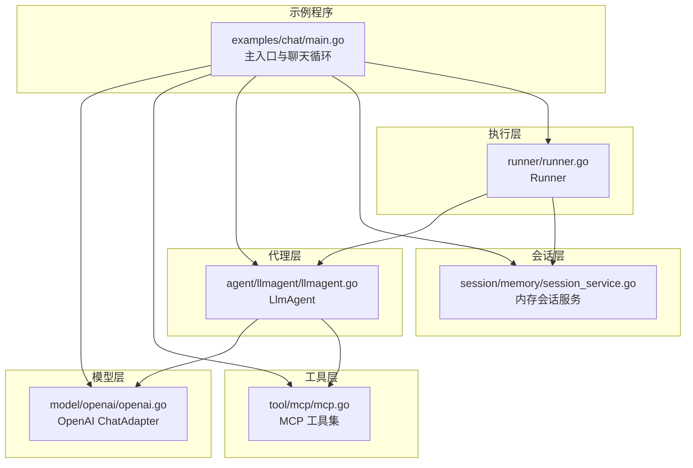
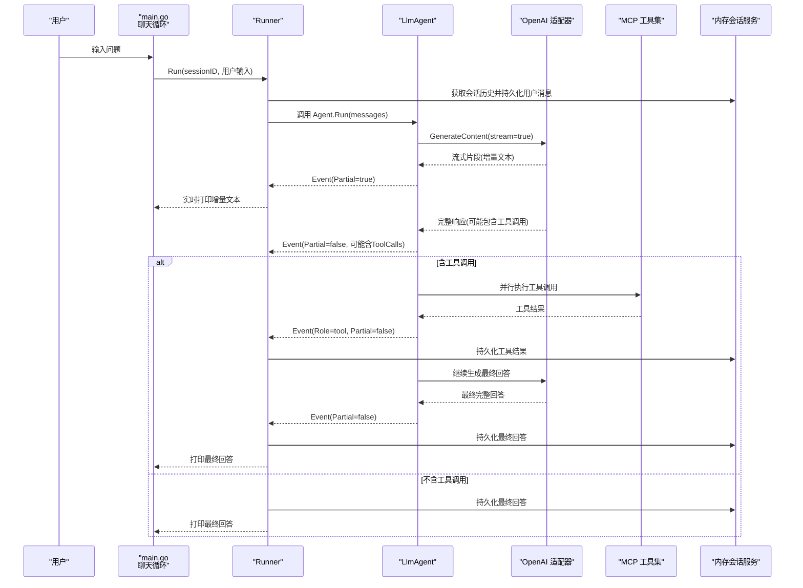
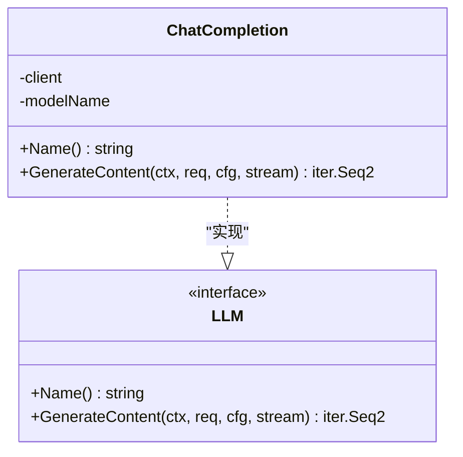
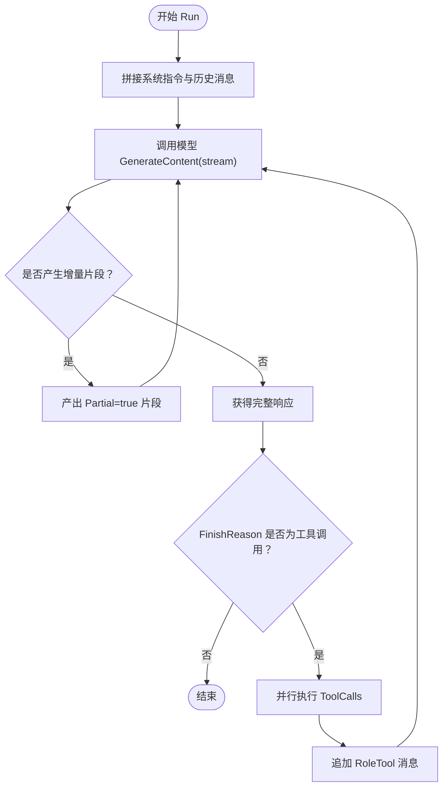
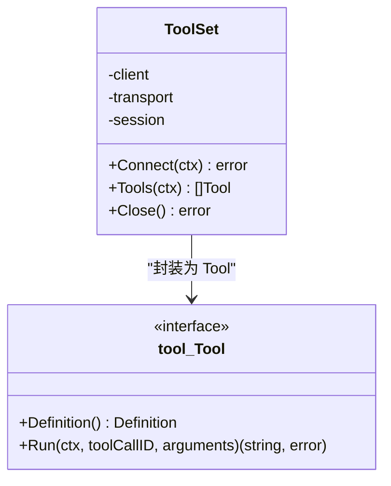
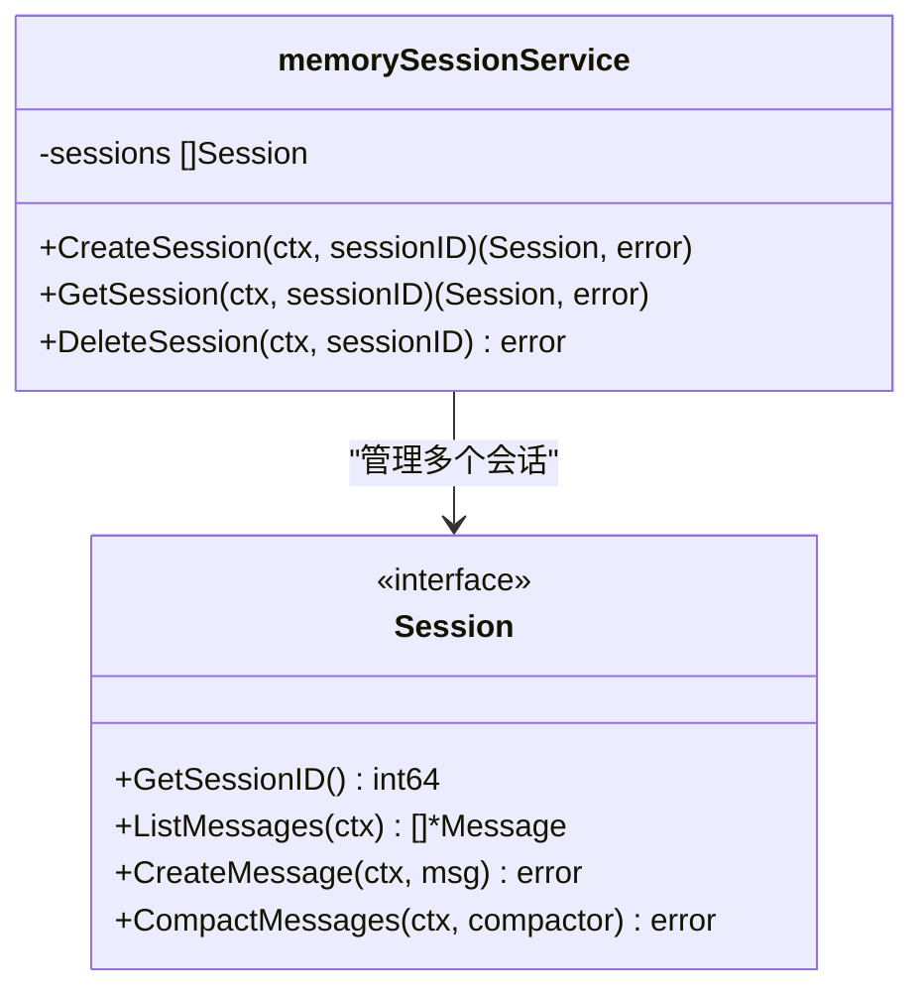
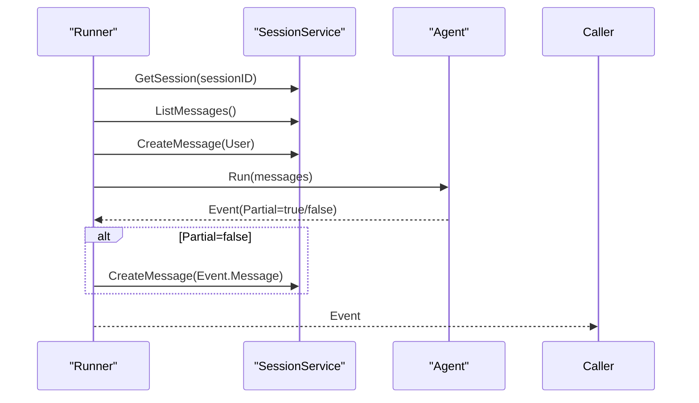
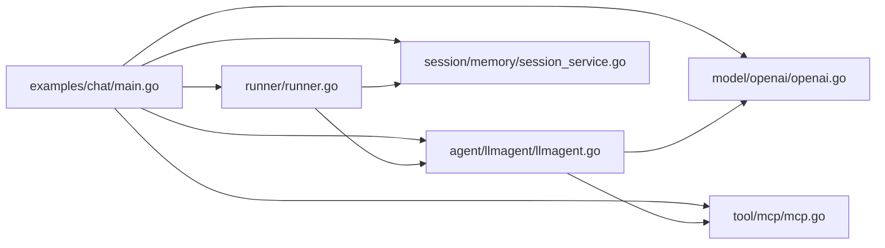
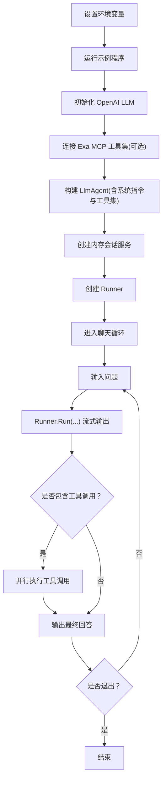

# 基础聊天示例

<cite>
**本文引用的文件列表**
- [examples/chat/main.go](file://examples/chat/main.go)
- [README.md](file://README.md)
- [go.mod](file://go.mod)
- [agent/llmagent/llmagent.go](file://agent/llmagent/llmagent.go)
- [model/openai/openai.go](file://model/openai/openai.go)
- [tool/mcp/mcp.go](file://tool/mcp/mcp.go)
- [session/memory/session_service.go](file://session/memory/session_service.go)
- [runner/runner.go](file://runner/runner.go)
- [model/model.go](file://model/model.go)
- [tool/tool.go](file://tool/tool.go)
- [session/session.go](file://session/session.go)
</cite>

## 目录
1. [简介](#简介)
2. [项目结构](#项目结构)
3. [核心组件](#核心组件)
4. [架构总览](#架构总览)
5. [详细组件分析](#详细组件分析)
6. [依赖关系分析](#依赖关系分析)
7. [性能与流式特性](#性能与流式特性)
8. [环境变量与配置](#环境变量与配置)
9. [运行示例与交互流程](#运行示例与交互流程)
10. [故障排查指南](#故障排查指南)
11. [结论](#结论)

## 简介
本文件面向希望快速搭建“基础聊天示例”的开发者，围绕 examples/chat/main.go 的完整实现进行深入解析。内容涵盖：
- 如何配置 OpenAI LLM（含兼容端点）
- 初始化 Exa MCP 工具集（可选认证）
- 构建 LlmAgent 代理（系统指令、工具集、流式输出）
- 设置内存会话服务
- 实现流式聊天循环
- 环境变量 OPENAI_API_KEY、OPENAI_BASE_URL、OPENAI_MODEL、EXA_API_KEY 的作用与设置
- LLM 配置选项、工具集连接过程、代理指令设置与流式输出处理的完整流程
- 提供实际运行示例与常见问题解决方案

## 项目结构
该示例位于 examples/chat/main.go，围绕以下核心模块协作：
- 模型层：OpenAI 适配器（model/openai）
- 代理层：LLM 驱动的智能体（agent/llmagent）
- 工具层：MCP 工具集桥接（tool/mcp）
- 会话层：内存会话服务（session/memory）
- 执行层：Runner 协调代理与会话（runner）

图表来源
- [examples/chat/main.go:52-177](file://examples/chat/main.go#L52-L177)
- [model/openai/openai.go:25-37](file://model/openai/openai.go#L25-L37)
- [agent/llmagent/llmagent.go:36-46](file://agent/llmagent/llmagent.go#L36-L46)
- [tool/mcp/mcp.go:22-33](file://tool/mcp/mcp.go#L22-L33)
- [session/memory/session_service.go:14-22](file://session/memory/session_service.go#L14-L22)
- [runner/runner.go:26-37](file://runner/runner.go#L26-L37)

章节来源
- [examples/chat/main.go:14-31](file://examples/chat/main.go#L14-L31)
- [README.md:67-89](file://README.md#L67-L89)

## 核心组件
- OpenAI LLM 适配器：负责将统一的 LLM 请求转换为 OpenAI Chat 接口请求，并支持非流式与流式两种模式。
- LlmAgent：状态无关的智能体，每次 Run 仅基于传入消息历史与系统指令生成回复；当 FinishReason 为工具调用时自动进入工具调用循环。
- MCP 工具集：通过 MCP 客户端连接外部服务器，动态发现并包装工具，暴露给 LlmAgent 使用。
- 内存会话服务：零配置的内存后端，保存对话历史并支持软归档。
- Runner：有状态协调器，加载会话历史、追加用户输入、驱动代理、持久化完成消息并实时转发流式片段。

章节来源
- [model/openai/openai.go:19-42](file://model/openai/openai.go#L19-L42)
- [agent/llmagent/llmagent.go:30-54](file://agent/llmagent/llmagent.go#L30-L54)
- [tool/mcp/mcp.go:15-43](file://tool/mcp/mcp.go#L15-L43)
- [session/memory/session_service.go:10-22](file://session/memory/session_service.go#L10-L22)
- [runner/runner.go:17-37](file://runner/runner.go#L17-L37)

## 架构总览
下面以序列图展示一次完整的“用户提问 → 流式响应 → 工具调用 → 结果汇总”的交互流程。

图表来源
- [examples/chat/main.go:126-171](file://examples/chat/main.go#L126-L171)
- [runner/runner.go:39-95](file://runner/runner.go#L39-L95)
- [agent/llmagent/llmagent.go:56-136](file://agent/llmagent/llmagent.go#L56-L136)
- [model/openai/openai.go:44-164](file://model/openai/openai.go#L44-L164)
- [tool/mcp/mcp.go:45-72](file://tool/mcp/mcp.go#L45-L72)

## 详细组件分析

### OpenAI LLM 适配器（model/openai）
- 负责创建客户端、转换消息与工具定义、执行非流式或流式生成、聚合使用量统计。
- 支持通过 baseURL 覆盖默认 OpenAI 端点，从而接入兼容 OpenAI 的第三方服务。
- 流式模式下按增量片段产出 Partial=true 的响应，最终产出 TurnComplete=true 的完整响应。

图表来源
- [model/openai/openai.go:19-42](file://model/openai/openai.go#L19-L42)
- [model/model.go:10-18](file://model/model.go#L10-L18)

章节来源
- [model/openai/openai.go:25-37](file://model/openai/openai.go#L25-L37)
- [model/openai/openai.go:44-164](file://model/openai/openai.go#L44-L164)

### LlmAgent（agent/llmagent）
- 将系统指令作为第一条消息注入到历史中，随后调用模型生成内容。
- 当 FinishReason 为工具调用时，自动并行执行所有 ToolCalls，并将工具结果作为 RoleTool 的消息追加回请求历史，继续生成最终回答。
- 支持流式输出：在生成过程中先产出 Partial=true 的增量片段，再产出 Partial=false 的完整消息。

图表来源
- [agent/llmagent/llmagent.go:56-136](file://agent/llmagent/llmagent.go#L56-L136)

章节来源
- [agent/llmagent/llmagent.go:14-28](file://agent/llmagent/llmagent.go#L14-L28)
- [agent/llmagent/llmagent.go:56-136](file://agent/llmagent/llmagent.go#L56-L136)

### MCP 工具集（tool/mcp）
- 通过 Transport 连接到 MCP 服务器，建立会话后枚举工具，将其包装为 tool.Tool 接口实例。
- 工具定义包含名称、描述与 JSON Schema 输入参数，便于 LLM 正确调用。
- 支持可选的 EXA API Key 注入，通过自定义 RoundTripper 在 HTTP 层添加 x-api-key 头。

图表来源
- [tool/mcp/mcp.go:15-80](file://tool/mcp/mcp.go#L15-L80)
- [tool/tool.go:17-23](file://tool/tool.go#L17-L23)

章节来源
- [tool/mcp/mcp.go:22-80](file://tool/mcp/mcp.go#L22-L80)

### 内存会话服务（session/memory）
- 提供内存中的会话存储，支持创建、查询、删除会话，以及列出活动消息与已归档消息。
- 适合单进程测试或演示场景，无需额外数据库配置。

图表来源
- [session/memory/session_service.go:10-40](file://session/memory/session_service.go#L10-L40)
- [session/session.go:9-23](file://session/session.go#L9-L23)

章节来源
- [session/memory/session_service.go:14-22](file://session/memory/session_service.go#L14-L22)

### Runner（runner）
- 负责加载会话历史、追加用户输入、调用 Agent.Run 并将事件流式返回给上层。
- 仅对完整事件（Partial=false）进行持久化，流式片段用于实时显示但不落盘。
- 使用雪花 ID 为每条消息分配唯一标识并记录时间戳。

图表来源
- [runner/runner.go:39-95](file://runner/runner.go#L39-L95)

章节来源
- [runner/runner.go:26-37](file://runner/runner.go#L26-L37)
- [runner/runner.go:98-107](file://runner/runner.go#L98-L107)

## 依赖关系分析
- 示例程序依赖 OpenAI 适配器、MCP 工具集、内存会话服务、Runner 与 LlmAgent。
- go.mod 明确了对外部库的依赖，包括 OpenAI SDK、MCP SDK、JSON Schema、SQLite 等。

图表来源
- [examples/chat/main.go:14-31](file://examples/chat/main.go#L14-L31)
- [go.mod:5-15](file://go.mod#L5-L15)

章节来源
- [go.mod:1-47](file://go.mod#L1-L47)

## 性能与流式特性
- 流式输出：OpenAI 适配器在流式模式下逐块产出增量文本片段，LlmAgent 与 Runner 逐片转发，实现接近实时的显示体验。
- 工具调用并发：LlmAgent 对工具调用采用并行执行，提升整体吞吐，同时保持原始顺序一致性。
- 会话持久化：Runner 仅在完整事件时写入会话，避免频繁落盘，兼顾性能与可观测性。
- Token 使用：OpenAI 适配器在最终响应中附带使用量统计，便于成本控制与优化。

章节来源
- [model/openai/openai.go:88-164](file://model/openai/openai.go#L88-L164)
- [agent/llmagent/llmagent.go:116-134](file://agent/llmagent/llmagent.go#L116-L134)
- [runner/runner.go:78-94](file://runner/runner.go#L78-L94)

## 环境变量与配置
- OPENAI_API_KEY（必需）：用于访问 OpenAI 或兼容服务的密钥。
- OPENAI_BASE_URL（可选）：覆盖默认 OpenAI 端点，支持兼容 OpenAI 的第三方服务。
- OPENAI_MODEL（可选）：模型名称，默认值为 gpt-4o-mini。
- EXA_API_KEY（可选）：连接 Exa MCP 服务器时用于鉴权的 API Key；未提供则以匿名方式连接。

章节来源
- [examples/chat/main.go:3-11](file://examples/chat/main.go#L3-L11)
- [examples/chat/main.go:56-66](file://examples/chat/main.go#L56-L66)
- [examples/chat/main.go:72-80](file://examples/chat/main.go#L72-L80)

## 运行示例与交互流程
- 启动步骤
  - 设置环境变量：OPENAI_API_KEY 必填；如需使用兼容端点可设置 OPENAI_BASE_URL；如需指定模型可设置 OPENAI_MODEL；如需 Exa MCP 认证可设置 EXA_API_KEY。
  - 运行示例程序。
- 交互流程
  - 程序启动后提示当前使用的模型名称。
  - 输入问题后，程序立即开始流式输出增量文本。
  - 若模型请求工具调用，程序会打印正在调用的工具名称，并在完成后输出最终回答。
  - 输入 exit 或 quit 退出。

图表来源
- [examples/chat/main.go:52-177](file://examples/chat/main.go#L52-L177)

章节来源
- [examples/chat/main.go:126-171](file://examples/chat/main.go#L126-L171)

## 故障排查指南
- 缺少 OPENAI_API_KEY
  - 现象：程序直接退出并报告错误。
  - 处理：确保设置 OPENAI_API_KEY。
- 连接 Exa MCP 失败
  - 现象：connect to Exa MCP 报错。
  - 处理：检查网络连通性与 EXA_API_KEY；若不需要认证可省略 EXA_API_KEY。
- 列举工具失败
  - 现象：list Exa MCP tools 报错。
  - 处理：确认 MCP 服务器可用且返回有效工具定义。
- 读取输入错误
  - 现象：read input 报错。
  - 处理：检查标准输入是否被阻塞或异常关闭。

章节来源
- [examples/chat/main.go:57-60](file://examples/chat/main.go#L57-L60)
- [examples/chat/main.go:83-86](file://examples/chat/main.go#L83-L86)
- [examples/chat/main.go:90-93](file://examples/chat/main.go#L90-L93)
- [examples/chat/main.go:173-176](file://examples/chat/main.go#L173-L176)

## 结论
本示例以最小化依赖展示了如何将 OpenAI LLM、MCP 工具集、内存会话与 Runner 有机结合，构建一个具备流式输出与工具调用能力的基础聊天应用。通过合理配置环境变量与系统指令，开发者可以快速扩展为更复杂的多轮对话与任务编排系统。