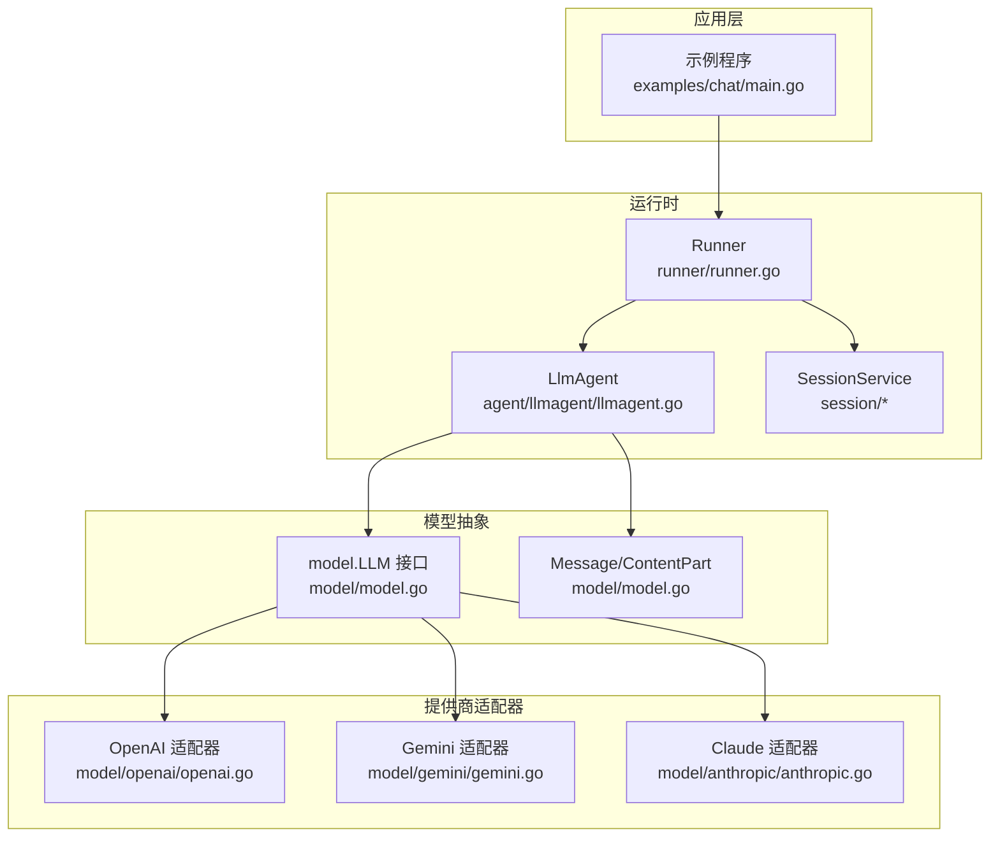
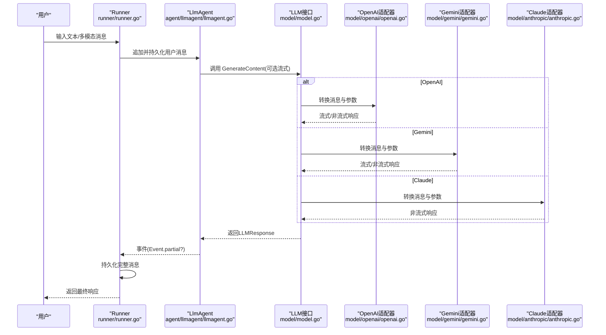
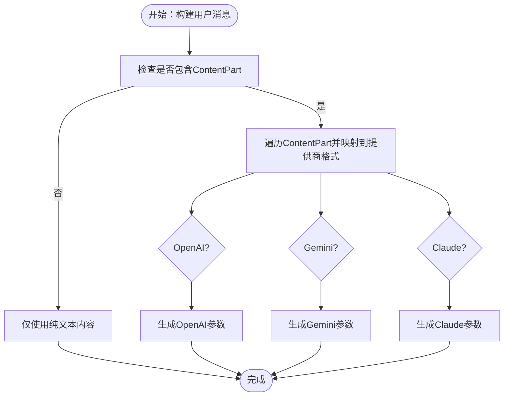
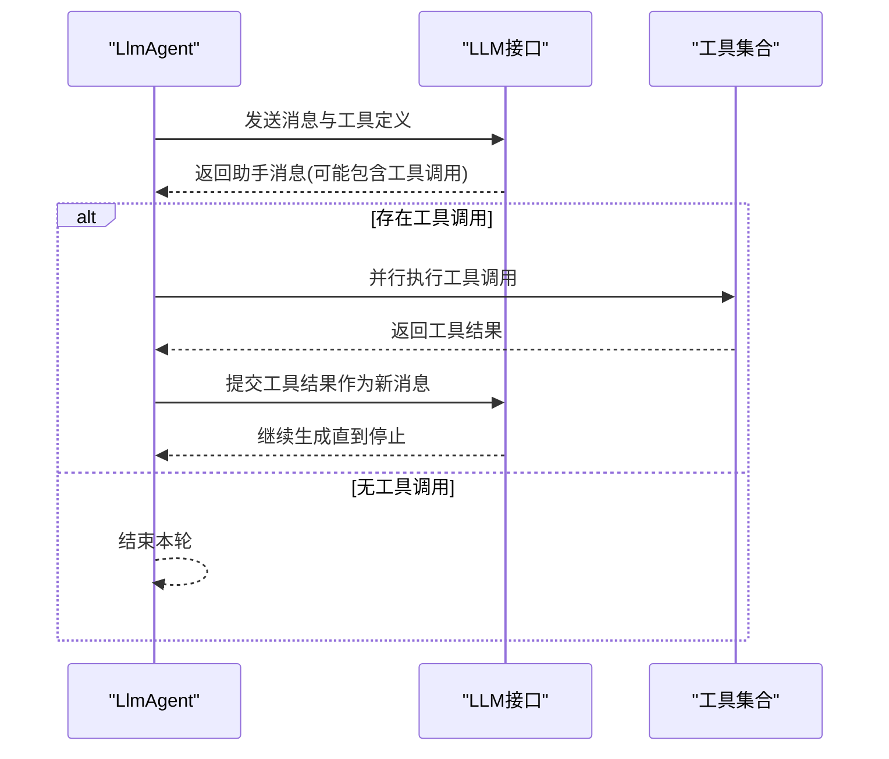
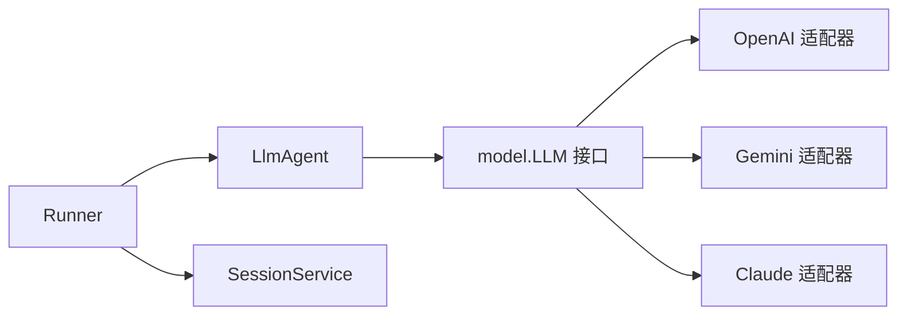

# 多模态应用示例

<cite>
**本文档引用的文件**
- [model.go](file://model/model.go)
- [openai.go](file://model/openai/openai.go)
- [gemini.go](file://model/gemini/gemini.go)
- [anthropic.go](file://model/anthropic/anthropic.go)
- [llmagent.go](file://agent/llmagent/llmagent.go)
- [runner.go](file://runner/runner.go)
- [message.go](file://session/message/message.go)
- [README.md](file://README.md)
- [main.go](file://examples/chat/main.go)
</cite>

## 目录
1. [简介](#简介)
2. [项目结构](#项目结构)
3. [核心组件](#核心组件)
4. [架构总览](#架构总览)
5. [详细组件分析](#详细组件分析)
6. [依赖关系分析](#依赖关系分析)
7. [性能考量](#性能考量)
8. [故障排查指南](#故障排查指南)
9. [结论](#结论)
10. [附录](#附录)

## 简介
本指南面向希望构建多模态AI应用的开发者，围绕仓库中的模型抽象与适配器实现，系统讲解如何在统一的provider-agnostic接口下处理文本、图像等混合输入，并通过LLM进行推理与工具调用。重点覆盖以下主题：
- model.ContentPart数据结构与使用方法：文本、图像URL、Base64图像的字段语义与适用场景
- 多模态消息构建流程：如何将ContentPart组合为用户消息，以及不同提供商对多模态输入的映射差异
- 实际应用示例：图像描述生成、文档分析、视觉问答的实现思路
- 配置与性能：生成参数、思维能力开关、服务等级、输入尺寸与成本控制
- 安全与隐私：多模态数据的传输与存储注意事项

## 项目结构
该仓库采用“接口抽象 + 适配器”的分层设计：
- model层：定义跨提供商的统一接口与消息类型（含ContentPart）
- model/{openai,gemini,anthropic}：各提供商的适配器，负责将统一模型转换为各SDK期望的请求格式
- agent/llmagent：基于LLM接口的智能体，自动驱动工具调用循环
- runner：协调会话与智能体，负责消息持久化与Snowflake ID分配
- session/message：会话消息的持久化结构与序列化/反序列化
- examples：示例程序，展示如何集成与运行

图表来源
- [runner.go:17-95](file://runner/runner.go#L17-L95)
- [llmagent.go:56-135](file://agent/llmagent/llmagent.go#L56-L135)
- [model.go:10-18](file://model/model.go#L10-L18)
- [openai.go:19-42](file://model/openai/openai.go#L19-L42)
- [gemini.go:17-64](file://model/gemini/gemini.go#L17-L64)
- [anthropic.go:25-45](file://model/anthropic/anthropic.go#L25-L45)

章节来源
- [README.md:37-90](file://README.md#L37-L90)
- [runner.go:17-95](file://runner/runner.go#L17-L95)
- [llmagent.go:56-135](file://agent/llmagent/llmagent.go#L56-L135)
- [model.go:10-18](file://model/model.go#L10-L18)

## 核心组件
- model.LLM接口：统一的LLM调用入口，支持流式与非流式响应
- Message/ContentPart：多模态消息的核心数据结构，支持文本与图像混合
- 各提供商适配器：将统一的消息结构映射到OpenAI/Gemini/Claude的SDK参数
- LlmAgent：自动执行工具调用循环，直至停止或完成
- Runner：管理会话历史、持久化消息、Snowflake ID分配

章节来源
- [model.go:10-18](file://model/model.go#L10-L18)
- [model.go:109-128](file://model/model.go#L109-L128)
- [llmagent.go:56-135](file://agent/llmagent/llmagent.go#L56-L135)
- [runner.go:17-95](file://runner/runner.go#L17-L95)

## 架构总览
下面的序列图展示了从用户输入到最终响应的完整链路，包括多模态消息的构建与流式输出。

图表来源
- [runner.go:39-95](file://runner/runner.go#L39-L95)
- [llmagent.go:78-135](file://agent/llmagent/llmagent.go#L78-L135)
- [model.go:10-18](file://model/model.go#L10-L18)
- [openai.go:44-164](file://model/openai/openai.go#L44-L164)
- [gemini.go:66-201](file://model/gemini/gemini.go#L66-L201)
- [anthropic.go:47-93](file://model/anthropic/anthropic.go#L47-L93)

## 详细组件分析

### model.ContentPart 数据结构与使用
- 字段语义
  - Type：内容类型，支持文本与图像（URL/Base64）
  - Text：当Type为文本时有效
  - ImageURL：当Type为图像URL时有效，HTTPS URL
  - ImageBase64 + MIMEType：当Type为Base64图像时有效，需提供MIME类型
  - ImageDetail：图像细节级别（高/低/自动），影响模型处理精度与成本
- 使用建议
  - 图像URL：简洁、无需本地存储；部分提供商对HTTP URL支持有限
  - Base64：兼容性更好，适合私有或受限网络环境
  - ImageDetail：高细节提升识别质量但增加token与成本，低细节降低成本但可能损失精度

章节来源
- [model.go:86-128](file://model/model.go#L86-L128)

### 多模态消息构建与LLM输入格式
- 用户消息（RoleUser）可包含多个ContentPart，按顺序拼接
- 不同提供商的映射策略
  - OpenAI：将ContentPart映射为Text/Image内容块，支持ImageDetail
  - Gemini：将ContentPart映射为Text/InlineData/FileData，对Base64与URL分别处理
  - Claude：将ContentPart映射为Text/Image块，支持URL与Base64
- 工具调用与多模态：工具结果消息（RoleTool）由适配器批量归并，确保模型能正确关联上下文

图表来源
- [openai.go:179-243](file://model/openai/openai.go#L179-L243)
- [gemini.go:207-299](file://model/gemini/gemini.go#L207-L299)
- [anthropic.go:98-184](file://model/anthropic/anthropic.go#L98-L184)

章节来源
- [openai.go:179-243](file://model/openai/openai.go#L179-L243)
- [gemini.go:207-299](file://model/gemini/gemini.go#L207-L299)
- [anthropic.go:98-184](file://model/anthropic/anthropic.go#L98-L184)

### 多模态应用示例

#### 示例一：图像描述生成
- 思路
  - 构建用户消息，包含问题文本与图像URL/Base64
  - 通过适配器将消息转换为对应提供商的请求格式
  - 获取模型返回的描述文本
- 关键点
  - 选择合适的ImageDetail以平衡质量与成本
  - 对于私有图片，优先使用Base64避免网络访问限制

章节来源
- [README.md:360-377](file://README.md#L360-L377)
- [openai.go:186-212](file://model/openai/openai.go#L186-L212)
- [gemini.go:270-299](file://model/gemini/gemini.go#L270-L299)
- [anthropic.go:149-184](file://model/anthropic/anthropic.go#L149-L184)

#### 示例二：文档分析（扫描件/截图）
- 思路
  - 将文档图像作为ContentPart加入消息
  - 结合工具调用（如OCR/解析）进行结构化解析
- 注意事项
  - 大图可能导致token用量激增，建议先裁剪关键区域
  - 使用较低ImageDetail以控制成本

章节来源
- [llmagent.go:116-134](file://agent/llmagent/llmagent.go#L116-L134)
- [gemini.go:270-299](file://model/gemini/gemini.go#L270-L299)

#### 示例三：视觉问答（VQA）
- 思路
  - 用户提出问题 + 图像输入
  - 模型结合图像与文本生成答案
  - 可开启思维能力（EnableThinking）以提升复杂推理
- 参数建议
  - ReasoningEffort或EnableThinking用于启用内部思考
  - MaxTokens限制输出长度，避免过度消耗

章节来源
- [README.md:360-377](file://README.md#L360-L377)
- [openai.go:279-304](file://model/openai/openai.go#L279-L304)
- [gemini.go:353-384](file://model/gemini/gemini.go#L353-L384)
- [anthropic.go:242-260](file://model/anthropic/anthropic.go#L242-L260)

### LlmAgent 的工具调用循环
- 自动处理工具调用：当模型返回工具调用请求时，Agent并行执行并在后续轮次中提交工具结果
- 流式输出：在流式模式下，先返回增量文本，再返回完整消息

图表来源
- [llmagent.go:78-135](file://agent/llmagent/llmagent.go#L78-L135)

章节来源
- [llmagent.go:78-135](file://agent/llmagent/llmagent.go#L78-L135)

### Runner 与会话持久化
- Runner负责加载历史消息、追加当前用户输入、转发事件、仅持久化完整消息
- 使用Snowflake节点生成全局唯一ID，便于分布式追踪

章节来源
- [runner.go:39-95](file://runner/runner.go#L39-L95)
- [message.go:75-128](file://session/message/message.go#L75-L128)

## 依赖关系分析
- 组件耦合
  - LlmAgent依赖model.LLM接口，解耦具体提供商
  - 适配器各自实现消息转换逻辑，保持统一的输入/输出契约
  - Runner与Agent解耦，通过接口协作
- 外部依赖
  - OpenAI/Gemini/Claude SDK
  - MCP工具桥接
  - SQLite与Snowflake

图表来源
- [llmagent.go:14-46](file://agent/llmagent/llmagent.go#L14-L46)
- [model.go:10-18](file://model/model.go#L10-L18)
- [openai.go:19-42](file://model/openai/openai.go#L19-L42)
- [gemini.go:17-64](file://model/gemini/gemini.go#L17-L64)
- [anthropic.go:25-45](file://model/anthropic/anthropic.go#L25-L45)
- [runner.go:20-37](file://runner/runner.go#L20-L37)

章节来源
- [README.md:380-393](file://README.md#L380-L393)

## 性能考量
- 输入尺寸与成本控制
  - 图像分辨率与数量直接影响token用量与费用
  - 建议对大图进行预处理（裁剪、压缩、降采样）
  - 合理设置MaxTokens，避免冗长输出
- 思维能力与推理预算
  - ReasoningEffort/EnableThinking影响token消耗与延迟
  - 对于不需要深度推理的任务，关闭思维能力可显著降低成本
- 流式输出
  - 流式响应可降低首字节延迟，改善用户体验
  - 仅持久化完整消息，避免存储中间片段

章节来源
- [model.go:67-84](file://model/model.go#L67-L84)
- [openai.go:279-304](file://model/openai/openai.go#L279-L304)
- [gemini.go:353-384](file://model/gemini/gemini.go#L353-L384)
- [anthropic.go:242-260](file://model/anthropic/anthropic.go#L242-L260)

## 故障排查指南
- 常见错误与定位
  - 角色/内容类型不匹配：检查Message.Role与ContentPart.Type组合是否被适配器支持
  - 图像URL不可访问：尝试改用Base64；确认MIME类型正确
  - 工具调用失败：确认工具名称一致且参数JSON合法
- 日志与追踪
  - 利用Runner持久化的消息ID（Snowflake）进行回溯
  - 分别查看各适配器的转换函数，定位消息映射问题

章节来源
- [openai.go:179-243](file://model/openai/openai.go#L179-L243)
- [gemini.go:207-299](file://model/gemini/gemini.go#L207-L299)
- [anthropic.go:98-184](file://model/anthropic/anthropic.go#L98-L184)
- [runner.go:98-107](file://runner/runner.go#L98-L107)

## 结论
通过统一的model.LLM接口与多提供商适配器，本项目提供了稳定、可扩展的多模态AI应用开发框架。开发者只需关注业务逻辑与消息构建，即可在OpenAI、Gemini、Claude之间无缝切换。配合合理的参数配置与安全实践，可在保证质量的同时控制成本与风险。

## 附录

### 多模态消息构建清单
- 明确输入模态：文本 + 图像URL/Base64
- 设置ImageDetail：根据任务精度需求选择
- 控制输入规模：裁剪、压缩、降采样
- 工具调用：必要时启用工具以增强能力
- 流式输出：提升交互体验

章节来源
- [README.md:360-377](file://README.md#L360-L377)
- [openai.go:186-212](file://model/openai/openai.go#L186-L212)
- [gemini.go:270-299](file://model/gemini/gemini.go#L270-L299)
- [anthropic.go:149-184](file://model/anthropic/anthropic.go#L149-L184)

### 示例程序参考
- 快速启动与多模态提示：参见示例程序与README中的多模态说明

章节来源
- [README.md:92-187](file://README.md#L92-L187)
- [main.go:52-177](file://examples/chat/main.go#L52-L177)