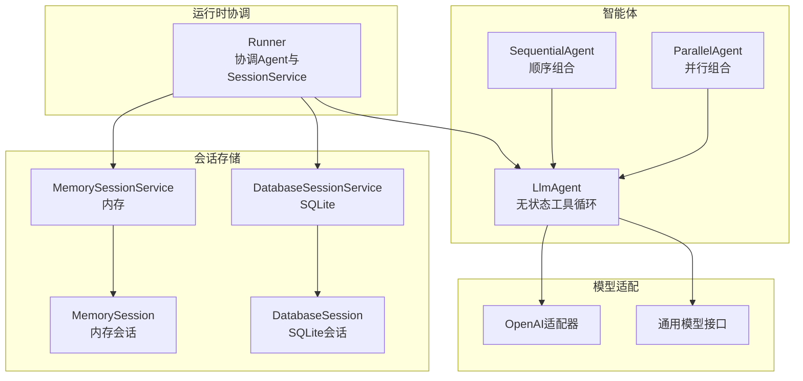
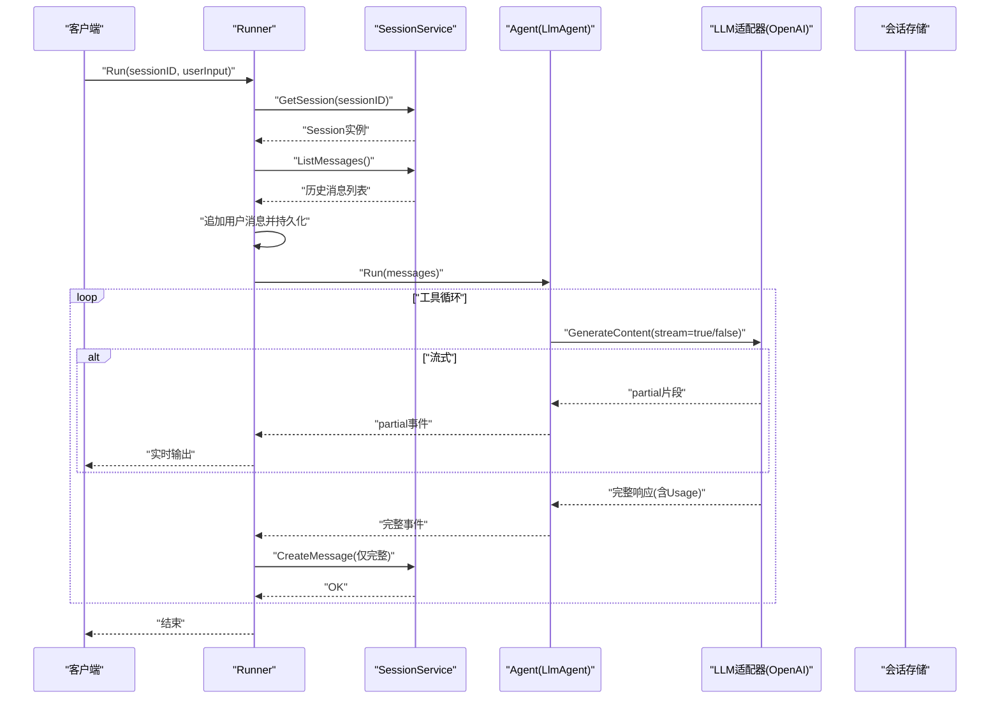
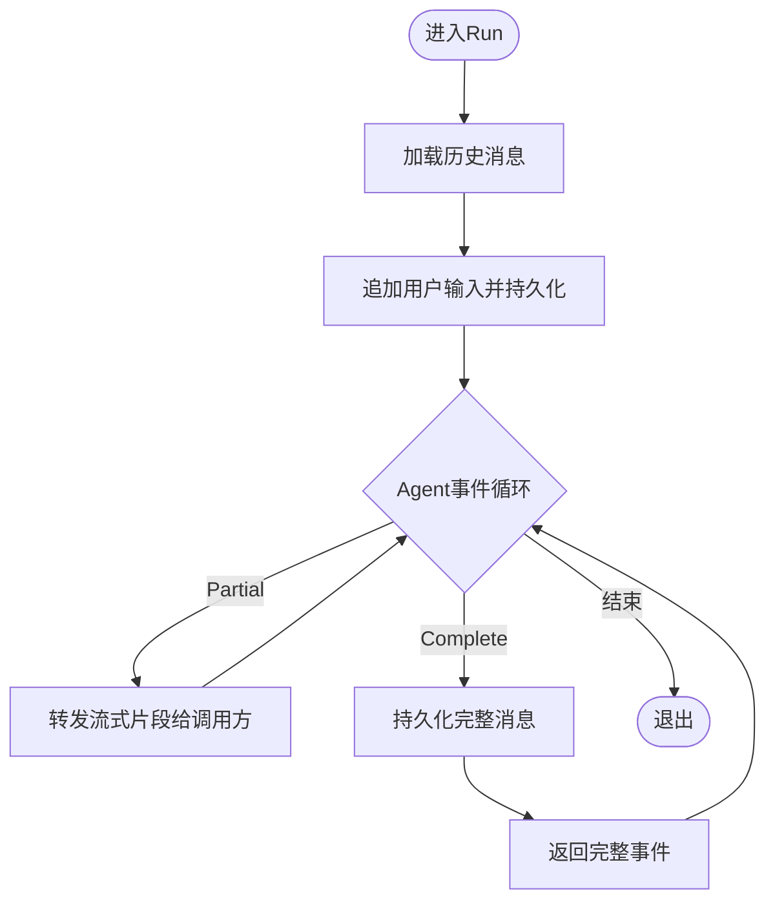
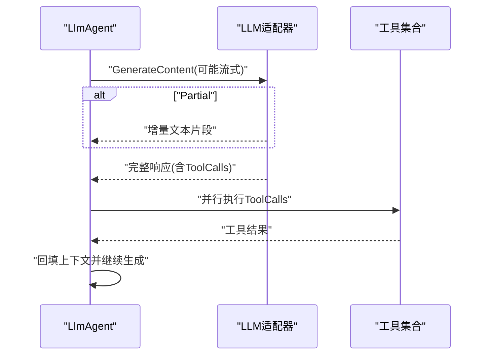
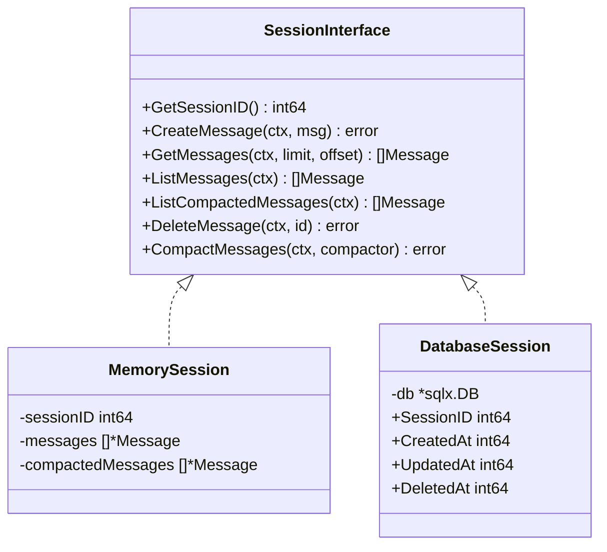
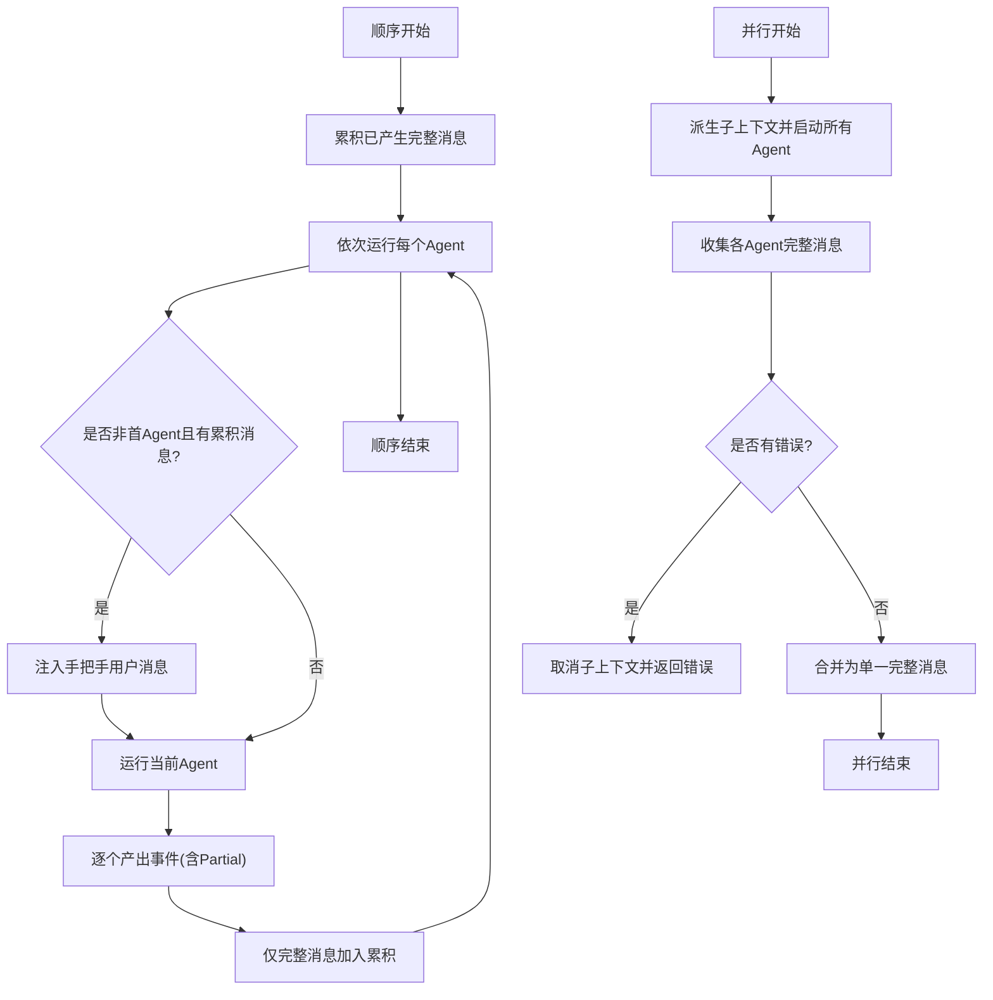
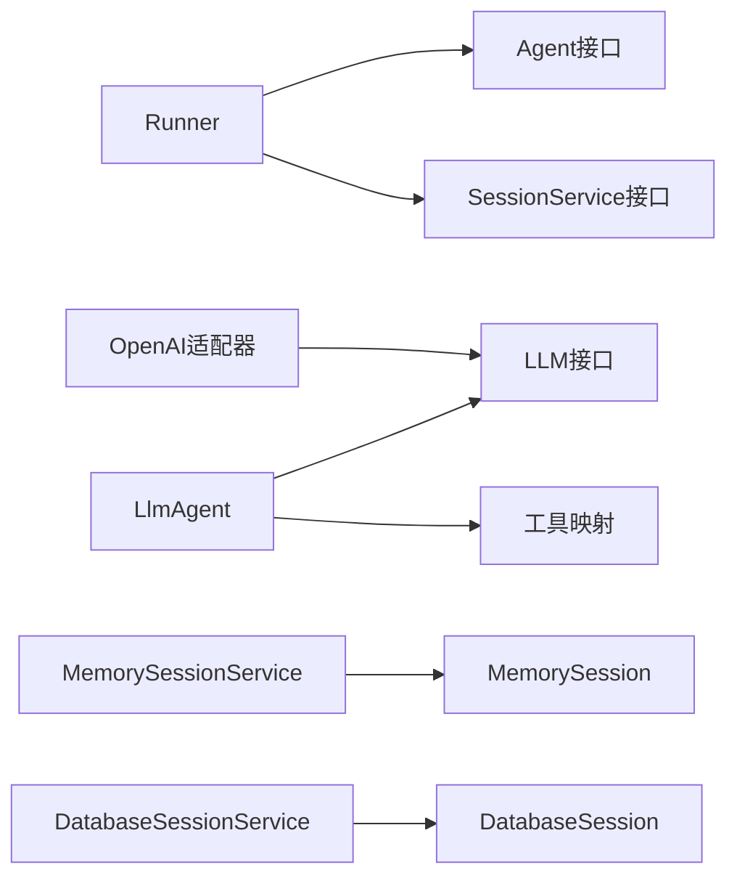

# 性能优化与调试

<cite>
**本文引用的文件**
- [README.md](file://README.md)
- [runner.go](file://runner/runner.go)
- [llmagent.go](file://agent/llmagent/llmagent.go)
- [openai.go](file://model/openai/openai.go)
- [model.go](file://model/model.go)
- [session.go](file://session/session.go)
- [session.go（内存）](file://session/memory/session.go)
- [session_service.go（内存）](file://session/memory/session_service.go)
- [session.go（数据库）](file://session/database/session.go)
- [session_service.go（数据库）](file://session/database/session_service.go)
- [snowflake.go](file://internal/snowflake/snowflake.go)
- [sequential.go](file://agent/sequential/sequential.go)
- [parallel.go](file://agent/parallel/parallel.go)
- [main.go（示例）](file://examples/chat/main.go)
- [runner_test.go](file://runner/runner_test.go)
</cite>

## 目录
1. [简介](#简介)
2. [项目结构](#项目结构)
3. [核心组件](#核心组件)
4. [架构总览](#架构总览)
5. [详细组件分析](#详细组件分析)
6. [依赖关系分析](#依赖关系分析)
7. [性能考量](#性能考量)
8. [故障排查指南](#故障排查指南)
9. [结论](#结论)
10. [附录](#附录)

## 简介
本指南面向在生产环境中构建AI代理应用的开发者，围绕ADK框架的性能优化与调试实践展开，重点覆盖以下方面：
- 流式处理的性能优势与实现技巧：内存使用优化、延迟控制、实时性保障
- 会话管理的性能权衡：内存会话与数据库会话的选择策略与适用场景
- 错误处理与异常恢复：重试机制、降级策略、上下文取消与传播
- 调试工具与监控指标：日志记录、性能分析、资源监控
- 生产环境部署调优：并发处理、缓存策略、资源限制
- 常见性能问题诊断与解决方案：瓶颈定位与修复路径

## 项目结构
ADK采用分层清晰的包布局，围绕“无状态Agent + 有状态Runner”的职责分离设计，结合可插拔的会话后端与多模型适配器，形成高内聚、低耦合的模块化体系。

图表来源
- [runner.go:17-96](file://runner/runner.go#L17-L96)
- [llmagent.go:30-136](file://agent/llmagent/llmagent.go#L30-L136)
- [session_service.go（内存）:14-40](file://session/memory/session_service.go#L14-L40)
- [session_service.go（数据库）:23-48](file://session/database/session_service.go#L23-L48)
- [session.go（内存）:18-85](file://session/memory/session.go#L18-L85)
- [session.go（数据库）:34-145](file://session/database/session.go#L34-L145)
- [openai.go:19-164](file://model/openai/openai.go#L19-L164)
- [model.go:10-227](file://model/model.go#L10-L227)

章节来源
- [README.md:67-89](file://README.md#L67-L89)
- [runner.go:17-96](file://runner/runner.go#L17-L96)
- [llmagent.go:30-136](file://agent/llmagent/llmagent.go#L30-L136)
- [session_service.go（内存）:14-40](file://session/memory/session_service.go#L14-L40)
- [session_service.go（数据库）:23-48](file://session/database/session_service.go#L23-L48)
- [session.go（内存）:18-85](file://session/memory/session.go#L18-L85)
- [session.go（数据库）:34-145](file://session/database/session.go#L34-L145)
- [openai.go:19-164](file://model/openai/openai.go#L19-L164)
- [model.go:10-227](file://model/model.go#L10-L227)

## 核心组件
- Runner：负责加载历史消息、追加用户输入、驱动Agent生成事件、仅持久化完整消息，支持流式片段实时转发
- LlmAgent：无状态Agent，按需前置系统提示，循环调用LLM生成内容，自动执行工具调用，支持并行工具执行
- 模型适配器（以OpenAI为例）：提供统一的GenerateContent接口，支持非流式与流式两种模式；流式模式下增量产出片段
- 会话服务：抽象Session接口，提供内存与数据库两种实现，均支持软归档压缩历史消息
- 并发组合器：SequentialAgent顺序串联、ParallelAgent并行聚合，均基于迭代器与上下文取消进行错误传播与早停

章节来源
- [runner.go:17-96](file://runner/runner.go#L17-L96)
- [llmagent.go:30-136](file://agent/llmagent/llmagent.go#L30-L136)
- [openai.go:44-164](file://model/openai/openai.go#L44-L164)
- [session.go:9-23](file://session/session.go#L9-L23)
- [session.go（内存）:12-85](file://session/memory/session.go#L12-L85)
- [session.go（数据库）:26-145](file://session/database/session.go#L26-L145)
- [sequential.go:46-92](file://agent/sequential/sequential.go#L46-L92)
- [parallel.go:112-174](file://agent/parallel/parallel.go#L112-L174)

## 架构总览
ADK通过Runner将“无状态Agent”与“有状态会话”解耦，使Agent专注于推理与工具调用，Runner专注消息编排与持久化。模型适配器屏蔽供应商差异，会话后端支持零配置内存或持久化SQLite。

图表来源
- [runner.go:39-96](file://runner/runner.go#L39-L96)
- [llmagent.go:56-136](file://agent/llmagent/llmagent.go#L56-L136)
- [openai.go:44-164](file://model/openai/openai.go#L44-L164)

章节来源
- [runner.go:39-96](file://runner/runner.go#L39-L96)
- [llmagent.go:56-136](file://agent/llmagent/llmagent.go#L56-L136)
- [openai.go:44-164](file://model/openai/openai.go#L44-L164)

## 详细组件分析

### 组件A：Runner（消息编排与持久化）
- 责任边界清晰：只在完整事件时写入会话，流式片段仅用于实时显示
- 雪花ID与时间戳：为每条消息分配全局唯一ID与创建/更新时间
- 错误传播：任一环节出错即终止并返回错误

图表来源
- [runner.go:45-96](file://runner/runner.go#L45-L96)
- [snowflake.go:17-56](file://internal/snowflake/snowflake.go#L17-L56)

章节来源
- [runner.go:39-107](file://runner/runner.go#L39-L107)
- [snowflake.go:17-56](file://internal/snowflake/snowflake.go#L17-L56)

### 组件B：LlmAgent（工具循环与并行工具执行）
- 前置系统指令：在每次Run时注入
- 工具循环：当FinishReason为工具调用时，收集所有ToolCalls并并行执行，再将结果回填到请求上下文中继续推理
- 流式支持：在GenerateContent开启流式时，先产出partial片段，再产出完整事件

图表来源
- [llmagent.go:56-136](file://agent/llmagent/llmagent.go#L56-L136)
- [openai.go:44-164](file://model/openai/openai.go#L44-L164)

章节来源
- [llmagent.go:56-136](file://agent/llmagent/llmagent.go#L56-L136)
- [openai.go:44-164](file://model/openai/openai.go#L44-L164)

### 组件C：会话后端（内存 vs 数据库）
- 内存后端：适合单进程、测试或低延迟场景；删除操作为线性扫描与切片删除
- 数据库后端：支持跨进程/容器持久化；提供软归档（设置compacted_at），事务保证一致性

图表来源
- [session.go:9-23](file://session/session.go#L9-L23)
- [session.go（内存）:12-85](file://session/memory/session.go#L12-L85)
- [session.go（数据库）:26-145](file://session/database/session.go#L26-L145)

章节来源
- [session.go:9-23](file://session/session.go#L9-L23)
- [session.go（内存）:12-85](file://session/memory/session.go#L12-L85)
- [session.go（数据库）:26-145](file://session/database/session.go#L26-L145)

### 组件D：并发组合器（顺序与并行）
- SequentialAgent：顺序执行，每个Agent接收累积上下文，注入手把手消息，支持早停
- ParallelAgent：并行执行，共享父上下文，任一Agent报错立即取消其他Agent，合并完整消息

图表来源
- [sequential.go:46-92](file://agent/sequential/sequential.go#L46-L92)
- [parallel.go:112-174](file://agent/parallel/parallel.go#L112-L174)

章节来源
- [sequential.go:46-92](file://agent/sequential/sequential.go#L46-L92)
- [parallel.go:112-174](file://agent/parallel/parallel.go#L112-L174)

## 依赖关系分析
- Runner依赖Agent接口与SessionService接口，通过迭代器模式解耦事件流
- LlmAgent依赖LLM接口与工具集合，内部维护工具映射表
- 会话后端实现Session接口，分别对接内存切片与SQL查询
- 模型适配器实现LLM接口，OpenAI适配器封装第三方SDK并暴露统一的GenerateContent

图表来源
- [runner.go:20-37](file://runner/runner.go#L20-L37)
- [llmagent.go:30-46](file://agent/llmagent/llmagent.go#L30-L46)
- [session_service.go（内存）:14-40](file://session/memory/session_service.go#L14-L40)
- [session_service.go（数据库）:23-48](file://session/database/session_service.go#L23-L48)
- [openai.go:19-42](file://model/openai/openai.go#L19-L42)

章节来源
- [runner.go:20-37](file://runner/runner.go#L20-L37)
- [llmagent.go:30-46](file://agent/llmagent/llmagent.go#L30-L46)
- [session_service.go（内存）:14-40](file://session/memory/session_service.go#L14-L40)
- [session_service.go（数据库）:23-48](file://session/database/session_service.go#L23-L48)
- [openai.go:19-42](file://model/openai/openai.go#L19-L42)

## 性能考量

### 流式处理的性能优势与实现技巧
- 实时性与用户体验：Runner仅在完整事件时持久化，流式片段直接转发，降低端到端延迟
- 内存占用控制：流式模式下，LLM适配器使用增量缓冲区拼接文本，避免一次性持有大块字符串
- 上下文与早停：调用方可提前break迭代，避免多余生成与持久化开销
- 参考路径
  - Runner流式转发与条件持久化：[runner.go:76-94](file://runner/runner.go#L76-L94)
  - LlmAgent流式片段与完整事件：[llmagent.go:78-106](file://agent/llmagent/llmagent.go#L78-L106)
  - OpenAI适配器流式增量产出：[openai.go:88-163](file://model/openai/openai.go#L88-L163)

章节来源
- [runner.go:76-94](file://runner/runner.go#L76-L94)
- [llmagent.go:78-106](file://agent/llmagent/llmagent.go#L78-L106)
- [openai.go:88-163](file://model/openai/openai.go#L88-L163)

### 会话管理的性能考虑与选择策略
- 内存会话（memory）
  - 优点：零配置、低延迟、适合单进程/测试
  - 缺点：进程重启丢失、删除操作为线性扫描与切片删除
  - 参考路径：[session.go（内存）:30-43](file://session/memory/session.go#L30-L43)
- 数据库会话（database）
  - 优点：持久化、跨进程可用、软归档减少活跃消息数量
  - 缺点：SQL开销、需要连接池与索引规划
  - 参考路径：[session.go（数据库）:46-95](file://session/database/session.go#L46-L95)
- 选择建议
  - 开发/测试：优先内存会话
  - 生产：优先数据库会话，并启用软归档压缩历史
  - 参考路径：[README.md:248-266](file://README.md#L248-L266)

章节来源
- [session.go（内存）:30-43](file://session/memory/session.go#L30-L43)
- [session.go（数据库）:46-95](file://session/database/session.go#L46-L95)
- [README.md:248-266](file://README.md#L248-L266)

### 错误处理与异常恢复（重试与降级）
- 错误传播：Runner与组合器在任一环节出错即终止并返回错误
- 并发早停：ParallelAgent在首个错误发生时通过上下文取消通知其他子任务
- 建议实践
  - 在调用方层面对可重试错误进行指数退避重试
  - 对不可重试错误进行降级（如切换到备用模型/工具）
  - 记录事件与Usage以便后续审计与成本分析
- 参考路径
  - Runner错误传播：[runner.go:78-82](file://runner/runner.go#L78-L82)
  - ParallelAgent错误传播与取消：[parallel.go:138-143](file://agent/parallel/parallel.go#L138-L143)
  - 示例中对错误的处理方式：[runner_test.go:233-243](file://runner/runner_test.go#L233-L243)

章节来源
- [runner.go:78-82](file://runner/runner.go#L78-L82)
- [parallel.go:138-143](file://agent/parallel/parallel.go#L138-L143)
- [runner_test.go:233-243](file://runner/runner_test.go#L233-L243)

### 调试工具与监控指标
- 日志记录
  - 在Runner与Agent事件循环中打印Partial/Complete事件，便于观察流式进度
  - 记录Usage与FinishReason，辅助成本与质量分析
- 性能分析
  - 使用pprof定位CPU/内存热点；在关键路径（GenerateContent、工具执行）打点
- 资源监控
  - 监控会话后端SQL延迟、队列长度、并发数
  - 监控LLM调用耗时与错误率
- 参考路径
  - 流式输出示例（实时打印片段）：[main.go（示例）:144-169](file://examples/chat/main.go#L144-L169)
  - Usage与FinishReason承载位置：[openai.go:307-344](file://model/openai/openai.go#L307-L344)，[llmagent.go:100-101](file://agent/llmagent/llmagent.go#L100-L101)

章节来源
- [main.go（示例）:144-169](file://examples/chat/main.go#L144-L169)
- [openai.go:307-344](file://model/openai/openai.go#L307-L344)
- [llmagent.go:100-101](file://agent/llmagent/llmagent.go#L100-L101)

### 生产环境部署调优
- 并发处理
  - 合理设置并行Agent数量，避免LLM与工具侧资源争用
  - 使用上下文超时与取消控制长尾任务
- 缓存策略
  - 对频繁访问的历史摘要（软归档后）进行缓存
  - 对工具结果进行短期缓存，减少重复调用
- 资源限制
  - 控制会话消息上限与生成参数（MaxTokens、Temperature等）
  - 限制工具调用次数与参数大小
- 参考路径
  - GenerateConfig参数定义：[model.go:67-84](file://model/model.go#L67-L84)
  - 软归档与摘要：[README.md:248-266](file://README.md#L248-L266)

章节来源
- [model.go:67-84](file://model/model.go#L67-L84)
- [README.md:248-266](file://README.md#L248-L266)

## 故障排查指南
- 症状：长时间无响应
  - 排查点：检查是否阻塞在等待工具执行或LLM调用；确认Partial事件是否被正确消费
  - 参考路径：[llmagent.go:116-126](file://agent/llmagent/llmagent.go#L116-L126)
- 症状：内存持续增长
  - 排查点：确认未启用内存会话或未定期触发软归档；检查是否在调用方累积了过多完整消息
  - 参考路径：[session.go（内存）:70-85](file://session/memory/session.go#L70-L85)，[README.md:248-266](file://README.md#L248-L266)
- 症状：并发Agent中个别失败导致整体卡住
  - 排查点：确认ParallelAgent的上下文取消逻辑是否生效
  - 参考路径：[parallel.go:127-143](file://agent/parallel/parallel.go#L127-L143)
- 症状：数据库写入慢
  - 排查点：检查事务提交路径、索引缺失、批量插入策略
  - 参考路径：[session.go（数据库）:112-144](file://session/database/session.go#L112-L144)

章节来源
- [llmagent.go:116-126](file://agent/llmagent/llmagent.go#L116-L126)
- [session.go（内存）:70-85](file://session/memory/session.go#L70-L85)
- [README.md:248-266](file://README.md#L248-L266)
- [parallel.go:127-143](file://agent/parallel/parallel.go#L127-L143)
- [session.go（数据库）:112-144](file://session/database/session.go#L112-L144)

## 结论
ADK通过“无状态Agent + 有状态Runner”的架构实现了推理与会话的清晰分离，配合流式迭代器与可插拔的会话后端，为生产级AI代理应用提供了良好的性能与可维护性基础。结合本文提供的流式优化、会话策略、错误处理与监控建议，可在不同规模与场景下取得更稳定、更低延迟、更易运维的系统表现。

## 附录
- 快速参考
  - 流式输出示例：[main.go（示例）:144-169](file://examples/chat/main.go#L144-L169)
  - 事件结构与Partial语义：[model.go:214-226](file://model/model.go#L214-L226)
  - 会话接口与软归档：[session.go:9-23](file://session/session.go#L9-L23)，[README.md:248-266](file://README.md#L248-L266)