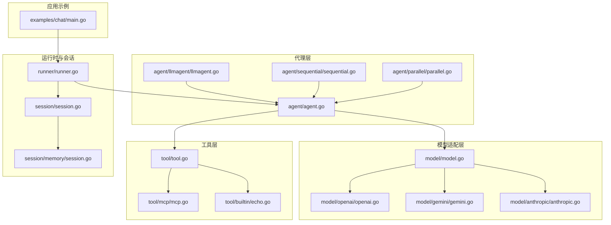
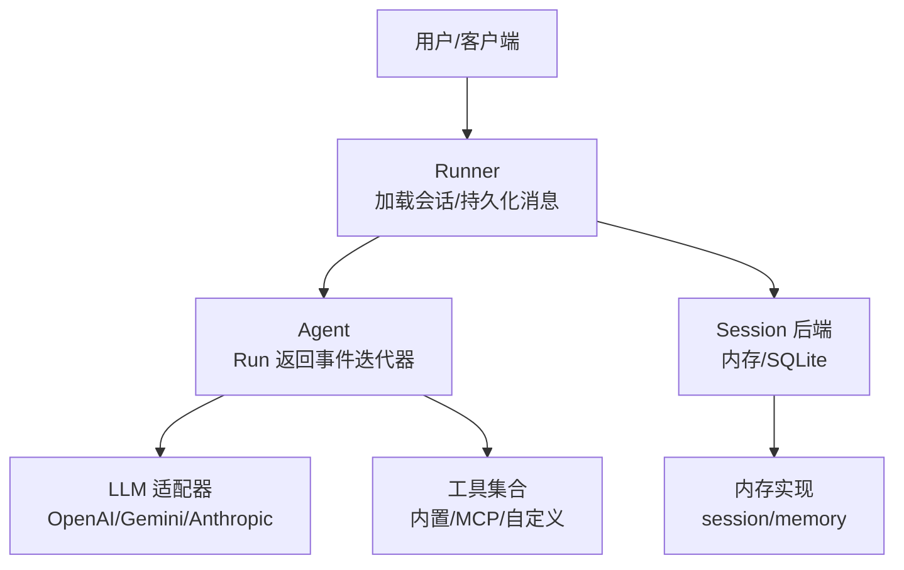
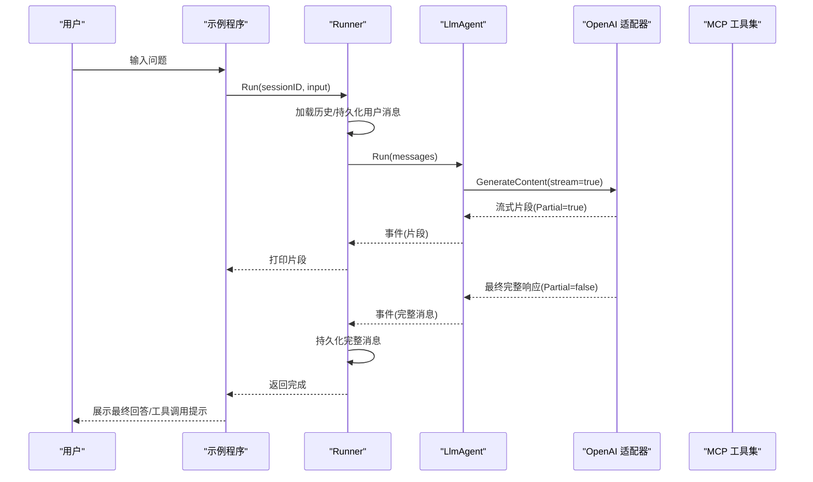
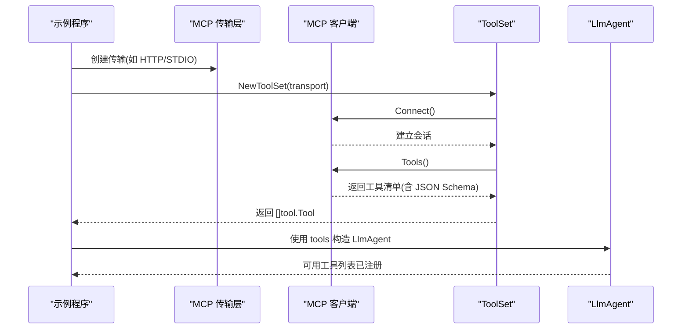
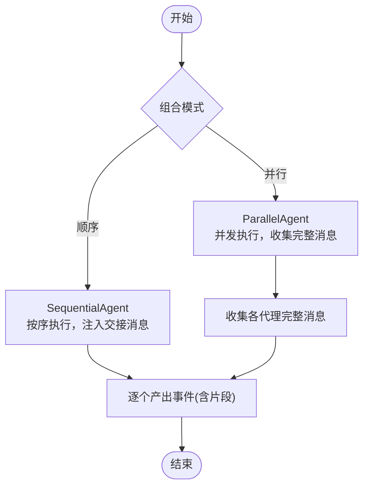
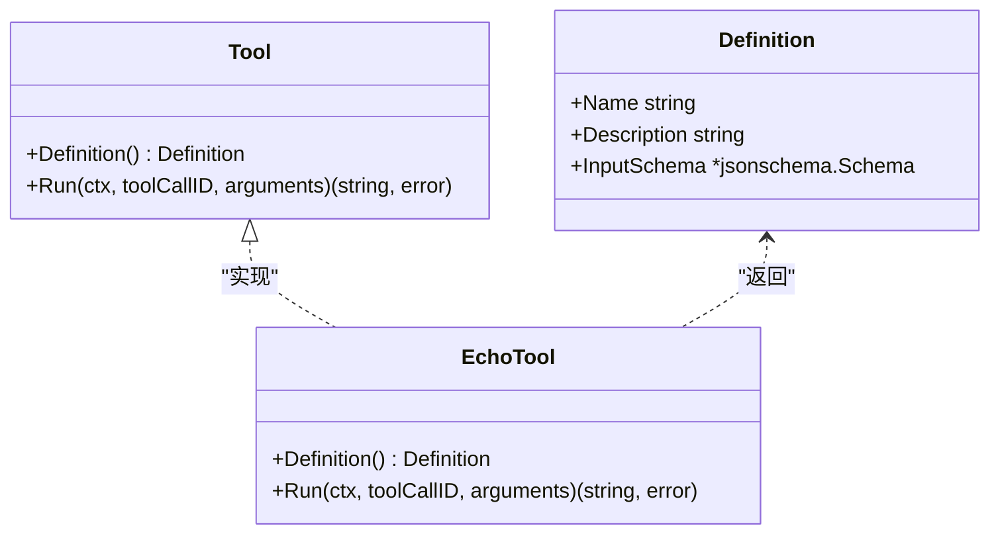
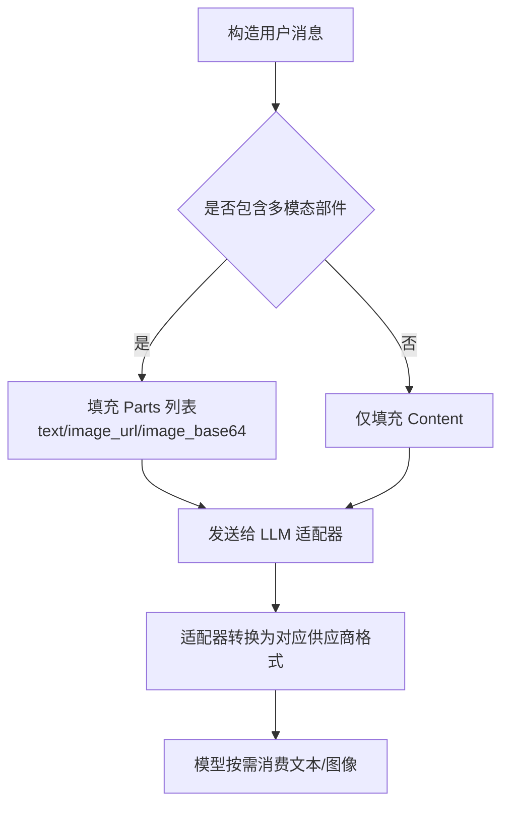
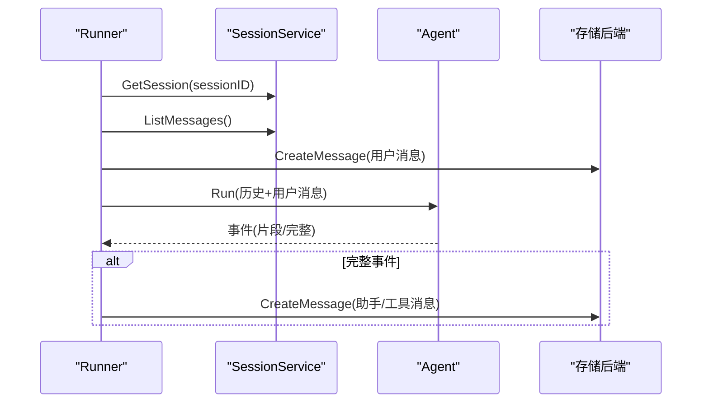
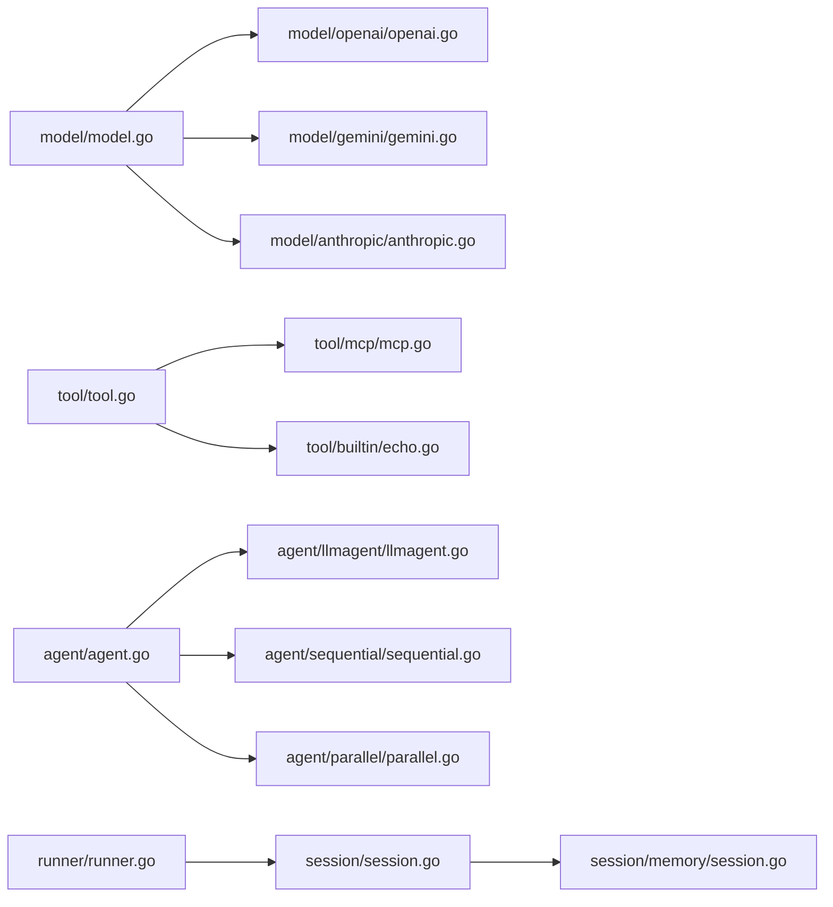

# 示例与教程

<cite>
**本文引用的文件**
- [README.md](file://README.md)
- [examples/chat/main.go](file://examples/chat/main.go)
- [agent/agent.go](file://agent/agent.go)
- [agent/llmagent/llmagent.go](file://agent/llmagent/llmagent.go)
- [agent/sequential/sequential.go](file://agent/sequential/sequential.go)
- [agent/parallel/parallel.go](file://agent/parallel/parallel.go)
- [tool/tool.go](file://tool/tool.go)
- [tool/mcp/mcp.go](file://tool/mcp/mcp.go)
- [tool/builtin/echo.go](file://tool/builtin/echo.go)
- [model/model.go](file://model/model.go)
- [model/openai/openai.go](file://model/openai/openai.go)
- [model/gemini/gemini.go](file://model/gemini/gemini.go)
- [model/anthropic/anthropic.go](file://model/anthropic/anthropic.go)
- [runner/runner.go](file://runner/runner.go)
- [session/session.go](file://session/session.go)
- [session/memory/session.go](file://session/memory/session.go)
</cite>

## 目录
1. [简介](#简介)
2. [项目结构](#项目结构)
3. [核心组件](#核心组件)
4. [架构总览](#架构总览)
5. [详细组件解析与实战教程](#详细组件解析与实战教程)
6. [依赖关系分析](#依赖关系分析)
7. [性能与可扩展性建议](#性能与可扩展性建议)
8. [故障排查指南](#故障排查指南)
9. [结论](#结论)
10. [附录：常用配置与环境变量速查](#附录常用配置与环境变量速查)

## 简介
本教程面向希望快速上手 ADK 框架并构建生产级 AI 代理应用的开发者。内容覆盖：
- 聊天应用示例（LLM 配置、代理构建、会话管理、流式输出）
- MCP 工具集成（连接外部工具服务器并注入代理）
- 代理组合（顺序流水线与并行模型集成）
- 自定义工具开发（接口实现、参数校验、Schema 定义）
- 多模态输入（文本+图像）
- 性能优化与调试技巧

## 项目结构
ADK 采用分层清晰的包布局：抽象接口在顶层，具体适配器与运行时在子包中，便于替换与组合。

图示来源
- [examples/chat/main.go:1-181](file://examples/chat/main.go#L1-L181)
- [agent/llmagent/llmagent.go:1-159](file://agent/llmagent/llmagent.go#L1-L159)
- [agent/sequential/sequential.go:1-93](file://agent/sequential/sequential.go#L1-L93)
- [agent/parallel/parallel.go:1-175](file://agent/parallel/parallel.go#L1-L175)
- [tool/mcp/mcp.go:1-121](file://tool/mcp/mcp.go#L1-L121)
- [tool/builtin/echo.go:1-47](file://tool/builtin/echo.go#L1-L47)
- [model/model.go:1-227](file://model/model.go#L1-L227)
- [model/openai/openai.go:1-362](file://model/openai/openai.go#L1-L362)
- [model/gemini/gemini.go:1-478](file://model/gemini/gemini.go#L1-L478)
- [model/anthropic/anthropic.go:1-326](file://model/anthropic/anthropic.go#L1-L326)
- [runner/runner.go:1-108](file://runner/runner.go#L1-L108)
- [session/session.go:1-24](file://session/session.go#L1-L24)
- [session/memory/session.go:1-86](file://session/memory/session.go#L1-L86)

章节来源
- [README.md:67-90](file://README.md#L67-L90)

## 核心组件
- Agent 接口：统一的执行入口，返回事件迭代器，支持流式增量输出。
- LLM 接口：屏蔽供应商差异，统一请求/响应与流式协议。
- Tool 接口：工具元数据（名称、描述、JSON Schema）与执行方法。
- Runner：协调会话加载、消息持久化与代理执行。
- Session：会话与消息存取、软归档（压缩历史）。
- 组合代理：顺序流水线与并行集成，满足复杂工作流与多模型对比。

章节来源
- [agent/agent.go:10-19](file://agent/agent.go#L10-L19)
- [model/model.go:10-227](file://model/model.go#L10-L227)
- [tool/tool.go:9-24](file://tool/tool.go#L9-L24)
- [runner/runner.go:17-96](file://runner/runner.go#L17-L96)
- [session/session.go:9-23](file://session/session.go#L9-L23)

## 架构总览
ADK 的核心是“无状态代理 + 有状态运行器”的分离设计。Runner 负责会话与持久化，Agent 只关注对话上下文与工具调用循环。

图示来源
- [runner/runner.go:17-96](file://runner/runner.go#L17-L96)
- [agent/llmagent/llmagent.go:56-136](file://agent/llmagent/llmagent.go#L56-L136)
- [model/model.go:10-227](file://model/model.go#L10-L227)
- [tool/tool.go:17-24](file://tool/tool.go#L17-L24)
- [session/session.go:9-23](file://session/session.go#L9-L23)
- [session/memory/session.go:18-85](file://session/memory/session.go#L18-L85)

## 详细组件解析与实战教程

### 聊天应用示例：从零到一
目标：基于 OpenAI 构建一个带 MCP 搜索工具的聊天代理，支持流式输出与会话持久化。

步骤概览
- 初始化 LLM（OpenAI）
- 连接 MCP 工具集合并注入代理
- 创建内存会话服务与 Runner
- 启动交互循环，实时打印流式片段，完成后持久化完整消息

图示来源
- [examples/chat/main.go:52-177](file://examples/chat/main.go#L52-L177)
- [runner/runner.go:39-96](file://runner/runner.go#L39-L96)
- [agent/llmagent/llmagent.go:56-136](file://agent/llmagent/llmagent.go#L56-L136)
- [model/openai/openai.go:44-164](file://model/openai/openai.go#L44-L164)
- [tool/mcp/mcp.go:46-80](file://tool/mcp/mcp.go#L46-L80)

实战要点
- LLM 配置：通过环境变量设置密钥、基础地址与模型名；适配器支持兼容 OpenAI 的第三方服务。
- 代理构建：注入 Instruction、Tools、Stream 开关；Stream 为 true 时可实时显示增量文本。
- 会话管理：示例使用内存后端；生产建议使用 SQLite 后端以跨进程持久化。
- 流式输出：Runner 仅对完整事件进行持久化，片段用于实时展示。

章节来源
- [examples/chat/main.go:52-177](file://examples/chat/main.go#L52-L177)
- [runner/runner.go:39-96](file://runner/runner.go#L39-L96)
- [agent/llmagent/llmagent.go:14-28](file://agent/llmagent/llmagent.go#L14-L28)

### MCP 工具集成实战
目标：连接任意 MCP 服务器，动态发现其工具，并作为工具注入到 LLM 代理中。

图示来源
- [examples/chat/main.go:68-111](file://examples/chat/main.go#L68-L111)
- [tool/mcp/mcp.go:22-80](file://tool/mcp/mcp.go#L22-L80)

最佳实践
- 认证：示例展示了通过 HTTP Header 注入 API Key 的方式；根据 MCP 服务器要求选择合适认证。
- 动态 Schema：SDK 返回的输入 Schema 为通用类型，内部转换为标准 JSON Schema，确保 LLM 正确理解参数。
- 错误处理：工具调用失败时返回错误字符串，由代理继续推理或提示用户重试。

章节来源
- [tool/mcp/mcp.go:46-121](file://tool/mcp/mcp.go#L46-L121)
- [examples/chat/main.go:68-111](file://examples/chat/main.go#L68-L111)

### 代理组合：顺序流水线与并行集成
场景
- 顺序流水线：研究 → 草稿 → 审阅，每步代理看到全部前置结果。
- 并行集成：多模型或多任务并发执行，最后合并输出。

图示来源
- [agent/sequential/sequential.go:46-92](file://agent/sequential/sequential.go#L46-L92)
- [agent/parallel/parallel.go:112-174](file://agent/parallel/parallel.go#L112-L174)

顺序代理要点
- 每个代理接收"原始输入 + 已完成消息"；必要时注入交接用户消息，保持对话格式一致。
- 产出事件原样透传，片段与完整消息均被保留。

并行代理要点
- 默认合并策略：将每个代理的最后一个非空助手文本加上署名块拼接为单一消息。
- 错误传播：任一代理出错即取消上下文，其余代理尽快退出，避免资源浪费。

章节来源
- [agent/sequential/sequential.go:18-92](file://agent/sequential/sequential.go#L18-L92)
- [agent/parallel/parallel.go:70-174](file://agent/parallel/parallel.go#L70-L174)

### 自定义工具开发全流程
目标：从接口实现到参数校验，完整走通一个工具的生命周期。

步骤
- 定义输入结构体与 JSON Schema（推荐使用反射生成）
- 实现 tool.Tool 接口：Definition 返回元数据；Run 解析参数并执行业务逻辑
- 将工具注册到 LlmAgent 的 Tools 列表中

图示来源
- [tool/tool.go:17-24](file://tool/tool.go#L17-L24)
- [tool/builtin/echo.go:14-47](file://tool/builtin/echo.go#L14-L47)

参数校验与错误处理
- 使用 JSON Schema 对输入进行约束；SDK 会在调用前校验参数类型与必填项。
- Run 中对解析失败或业务异常进行包装，返回可读的字符串，便于代理继续推理。

章节来源
- [tool/tool.go:9-24](file://tool/tool.go#L9-L24)
- [tool/builtin/echo.go:18-47](file://tool/builtin/echo.go#L18-L47)

### 多模态输入：文本+图像
目标：向 LLM 发送混合模态消息（文本 + 图像），支持 URL 与 Base64 两种形式。

图示来源
- [model/model.go:109-128](file://model/model.go#L109-L128)
- [model/openai/openai.go:185-200](file://model/openai/openai.go#L185-L200)
- [model/gemini/gemini.go:149-153](file://model/gemini/gemini.go#L149-L153)
- [model/anthropic/anthropic.go:164-183](file://model/anthropic/anthropic.go#L164-L183)

注意事项
- 不同供应商对图像细节（detail）与编码方式支持不同，需参考各自文档。
- 图像参数（MIME 类型、URL、Base64 数据）必须与适配器约定一致。

章节来源
- [model/model.go:86-128](file://model/model.go#L86-L128)
- [model/openai/openai.go:185-200](file://model/openai/openai.go#L185-L200)
- [model/gemini/gemini.go:149-153](file://model/gemini/gemini.go#L149-L153)
- [model/anthropic/anthropic.go:164-183](file://model/anthropic/anthropic.go#L164-L183)

### 会话管理与消息持久化
- Runner 在每次用户输入后加载历史，追加用户消息并持久化；随后驱动代理执行，只对完整事件进行持久化。
- Session 支持软归档（压缩历史），可自定义摘要器将旧消息汇总为系统消息，降低上下文长度。

图示来源
- [runner/runner.go:39-96](file://runner/runner.go#L39-L96)
- [session/session.go:9-23](file://session/session.go#L9-L23)
- [session/memory/session.go:58-85](file://session/memory/session.go#L58-L85)

章节来源
- [runner/runner.go:39-108](file://runner/runner.go#L39-L108)
- [session/session.go:9-23](file://session/session.go#L9-L23)
- [session/memory/session.go:18-85](file://session/memory/session.go#L18-L85)

## 依赖关系分析
- 适配器层：OpenAI/Gemini/Anthropic 均实现 model.LLM 接口，保证调用一致性。
- 工具层：tool.Tool 与 JSON Schema 解耦工具定义与 LLM 参数校验。
- 组合代理：Sequential/Parallel 依赖 agent.Agent 抽象，可自由组合任意代理。
- 运行时：Runner 依赖 SessionService 与 Snowflake ID 生成器，负责消息 ID、时间戳与持久化。

图示来源
- [model/model.go:10-227](file://model/model.go#L10-L227)
- [tool/tool.go:17-24](file://tool/tool.go#L17-L24)
- [agent/agent.go:10-19](file://agent/agent.go#L10-L19)
- [runner/runner.go:17-37](file://runner/runner.go#L17-L37)

章节来源
- [model/model.go:10-227](file://model/model.go#L10-L227)
- [tool/tool.go:17-24](file://tool/tool.go#L17-L24)
- [agent/agent.go:10-19](file://agent/agent.go#L10-L19)
- [runner/runner.go:17-37](file://runner/runner.go#L17-L37)

## 性能与可扩展性建议
- 流式优先：开启 Stream 可显著改善用户体验；注意仅持久化完整事件，减少 IO 压力。
- 会话压缩：定期对历史消息进行软归档，使用摘要工具将长历史压缩为系统消息，控制上下文长度。
- 并行优化：并行代理在高延迟工具场景收益明显；合理设置超时与并发上限，避免资源争用。
- 工具幂等：为工具增加幂等键与去重机制，避免重复调用造成副作用。
- 缓存中间结果：对昂贵的工具调用或模型推理结果进行缓存，结合 TTL 策略提升吞吐。
- 日志与指标：为 Runner/Agent/LLM 适配器埋点，记录耗时、Token 使用、工具调用次数与失败率。

## 故障排查指南
常见问题与定位思路
- 无法连接 MCP 服务器
  - 检查传输配置与认证头；确认网络可达与证书有效。
  - 查看连接阶段返回的错误码与日志。
- 工具调用失败
  - 核对工具名称与参数 Schema 是否匹配；检查参数 JSON 是否合法。
  - 关注工具返回的错误文本，必要时在上游代理中提示重试或改写问题。
- 流式输出中断
  - 检查上游适配器的流式实现与网络稳定性；在 Runner 层捕获并上报错误。
- 会话持久化异常
  - 确认 SessionService 的初始化与数据库权限；查看消息 ID 生成与时间戳写入是否成功。
- 多模态图像不生效
  - 核对图像编码（URL/Base64）、MIME 类型与细节级别；参考对应适配器的转换逻辑。

章节来源
- [tool/mcp/mcp.go:92-109](file://tool/mcp/mcp.go#L92-L109)
- [model/openai/openai.go:96-142](file://model/openai/openai.go#L96-L142)
- [runner/runner.go:98-107](file://runner/runner.go#L98-L107)

## 结论
通过本教程，您已经掌握了：
- 如何在 ADK 中配置与切换不同 LLM 供应商
- 如何将 MCP 工具无缝注入到代理中
- 如何使用顺序与并行代理构建复杂工作流
- 如何开发自定义工具并进行参数校验
- 如何处理多模态输入与流式输出
- 如何进行会话管理与性能优化

建议在生产环境中结合缓存、限流、监控与可观测性体系，持续迭代与优化代理行为。

## 附录：常用配置与环境变量速查
- OpenAI
  - OPENAI_API_KEY：必需
  - OPENAI_BASE_URL：可选（兼容第三方服务）
  - OPENAI_MODEL：可选（默认模型）
- MCP（示例：Exa）
  - EXA_API_KEY：可选（若需要鉴权）

章节来源
- [examples/chat/main.go:3-12](file://examples/chat/main.go#L3-L12)