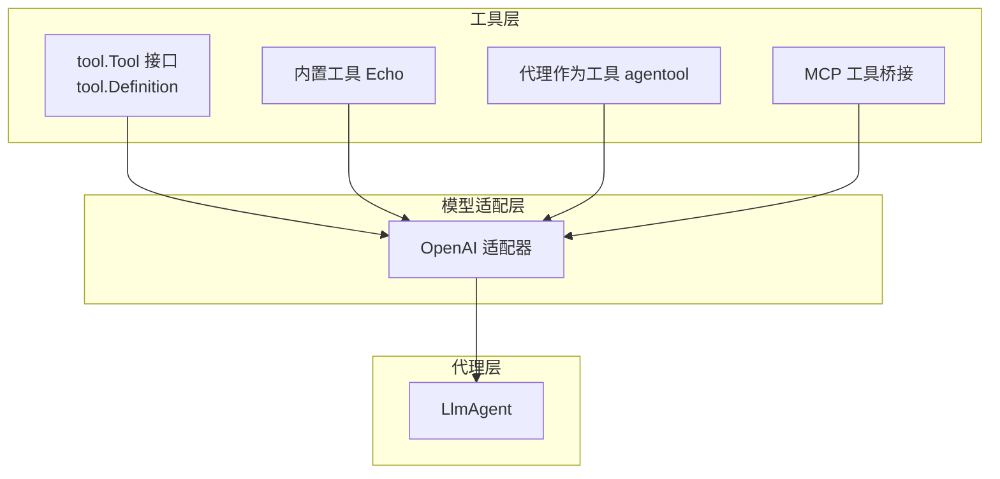
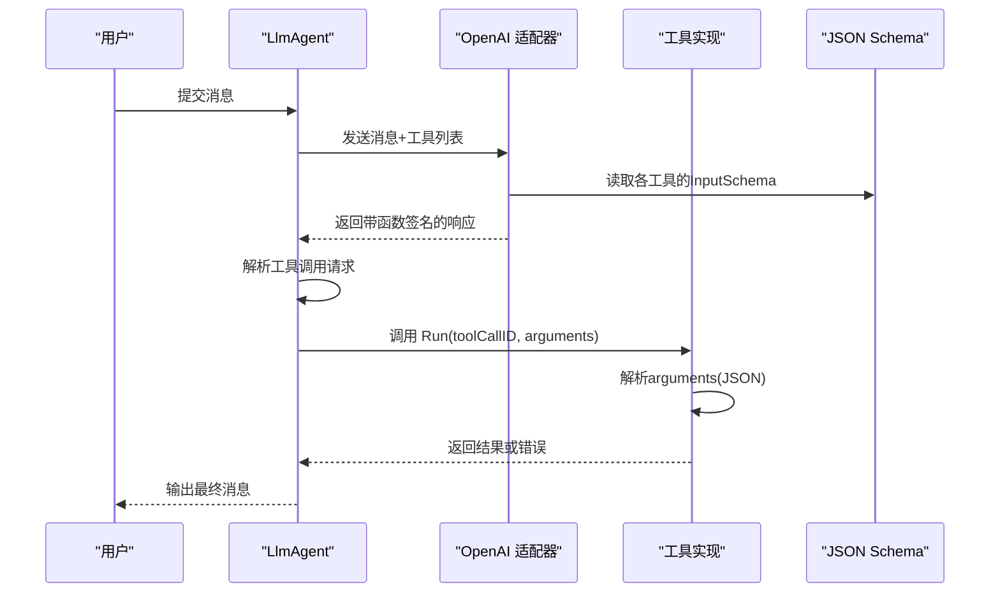
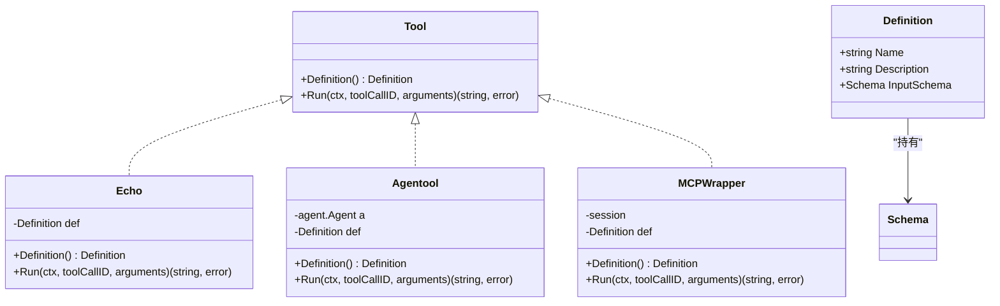
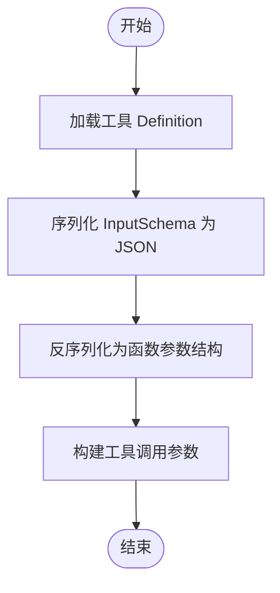
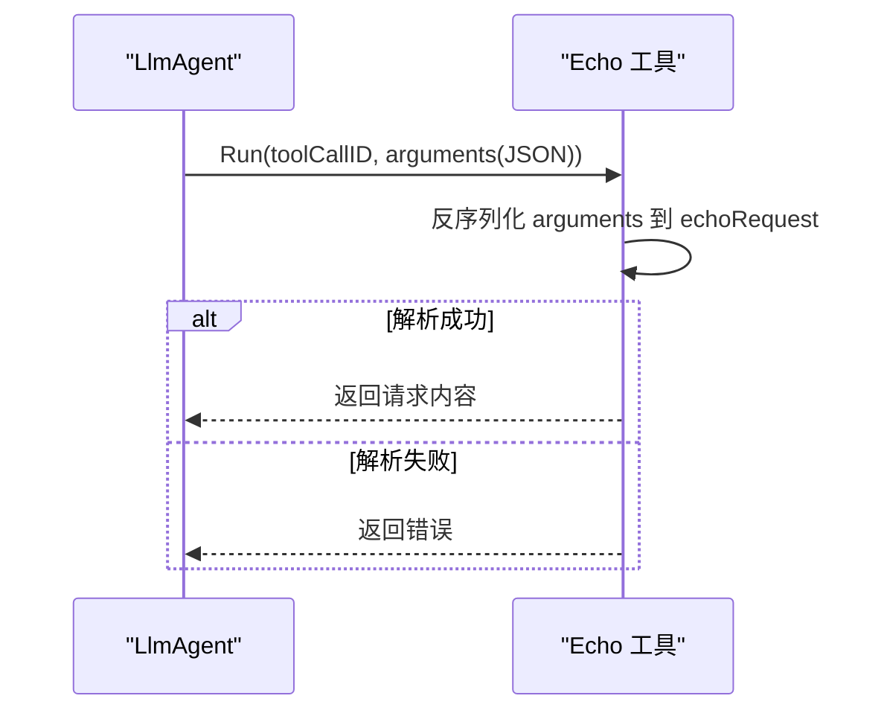
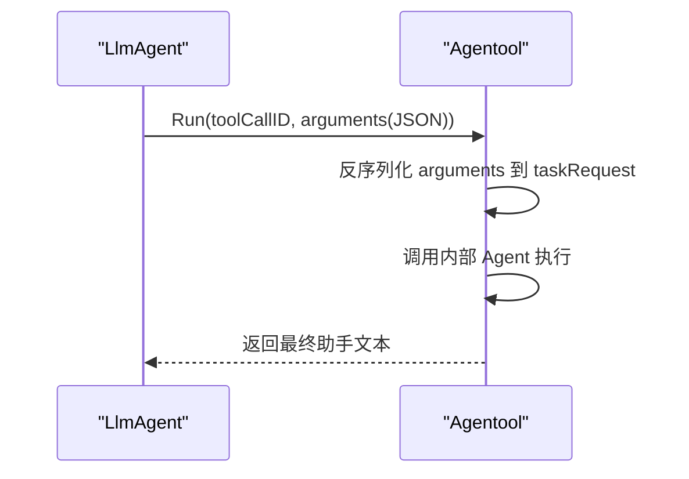
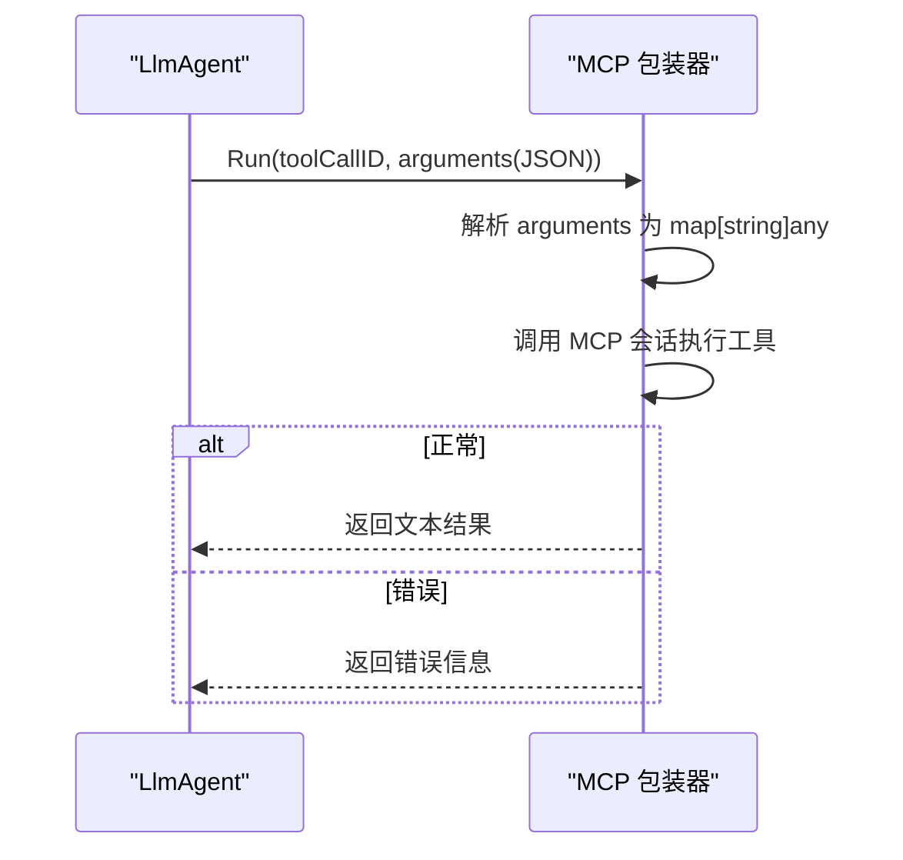
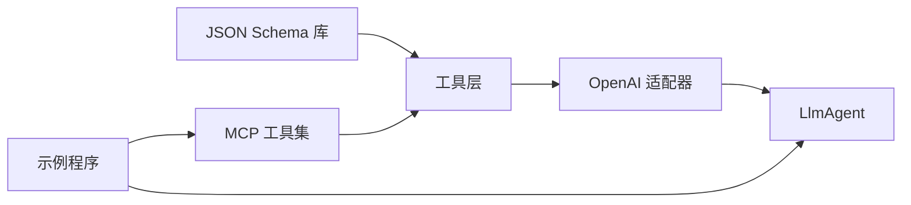

# 参数验证与JSON Schema

<cite>
**本文引用的文件**
- [README.md](file://README.md)
- [tool/tool.go](file://tool/tool.go)
- [model/openai/openai.go](file://model/openai/openai.go)
- [agent/llmagent/llmagent.go](file://agent/llmagent/llmagent.go)
- [tool/builtin/echo.go](file://tool/builtin/echo.go)
- [agent/agentool/agentool.go](file://agent/agentool/agentool.go)
- [tool/mcp/mcp.go](file://tool/mcp/mcp.go)
- [examples/chat/main.go](file://examples/chat/main.go)
</cite>

## 目录
1. [简介](#简介)
2. [项目结构](#项目结构)
3. [核心组件](#核心组件)
4. [架构总览](#架构总览)
5. [详细组件分析](#详细组件分析)
6. [依赖分析](#依赖分析)
7. [性能考虑](#性能考虑)
8. [故障排查指南](#故障排查指南)
9. [结论](#结论)
10. [附录：JSON Schema 编写指南](#附录json-schema-编写指南)

## 简介
本篇文档围绕“参数验证与JSON Schema”的主题，系统讲解ADK（Agent Development Kit）中工具参数验证机制与JSON Schema的应用方式。重点说明InputSchema字段的作用与配置方法，如何通过结构化输入Schema定义参数结构、数据类型与约束；梳理从LLM生成参数到工具执行前的验证流程；给出常见验证场景（字符串长度、数值范围、枚举值等）的实践思路；并提供调试验证问题的方法与工具，帮助开发者快速定位参数格式错误。

## 项目结构
ADK采用分层清晰的包结构：模型抽象层（model）、代理层（agent）、会话层（session）、工具层（tool），以及运行器（runner）。其中工具层负责定义工具元数据（含InputSchema），模型适配层负责将工具Schema转换为具体LLM的函数调用描述，代理层在生成循环中驱动工具调用并在工具执行前后进行消息流转。

图表来源
- [tool/tool.go:1-24](file://tool/tool.go#L1-L24)
- [model/openai/openai.go:245-277](file://model/openai/openai.go#L245-L277)
- [agent/llmagent/llmagent.go:30-46](file://agent/llmagent/llmagent.go#L30-L46)
- [tool/builtin/echo.go:14-34](file://tool/builtin/echo.go#L14-L34)
- [agent/agentool/agentool.go:16-48](file://agent/agentool/agentool.go#L16-L48)
- [tool/mcp/mcp.go:15-72](file://tool/mcp/mcp.go#L15-L72)

章节来源
- [README.md:67-89](file://README.md#L67-L89)
- [tool/tool.go:9-15](file://tool/tool.go#L9-L15)
- [model/openai/openai.go:245-277](file://model/openai/openai.go#L245-L277)

## 核心组件
- 工具接口与定义
  - 工具接口提供Definition()返回Definition，其中包含名称、描述与InputSchema。
  - InputSchema是JSON Schema对象，用于描述工具期望的参数结构、类型与约束。
- 模型适配器
  - OpenAI适配器将工具的Definition转换为函数调用工具参数，供LLM使用。
- 代理与工具调用
  - LlmAgent在生成循环中收集工具调用请求，并按顺序或并发执行工具。
  - 工具执行前，参数以JSON字符串形式传入，工具内部进行解析与验证。

章节来源
- [tool/tool.go:9-23](file://tool/tool.go#L9-L23)
- [model/openai/openai.go:245-277](file://model/openai/openai.go#L245-L277)
- [agent/llmagent/llmagent.go:138-159](file://agent/llmagent/llmagent.go#L138-L159)

## 架构总览
下图展示了从LLM生成工具调用参数到工具执行前的验证与执行链路，强调InputSchema在参数结构定义与约束中的作用。

图表来源
- [model/openai/openai.go:245-277](file://model/openai/openai.go#L245-L277)
- [agent/llmagent/llmagent.go:138-159](file://agent/llmagent/llmagent.go#L138-L159)
- [tool/tool.go:13-14](file://tool/tool.go#L13-L14)

## 详细组件分析

### 组件A：工具接口与InputSchema
- 定义
  - Definition结构体包含Name、Description与InputSchema。
  - InputSchema类型为JSON Schema对象，承载参数结构、类型与约束。
- 配置方式
  - 内置工具Echo通过反射类型生成Schema，直接将结构体标签映射为Schema。
  - 代理作为工具（agentool）同样通过结构体标签生成Schema。
  - MCP工具桥接从远端Schema经JSON往返转换为本地Schema对象。
- 执行流程
  - LlmAgent在收到工具调用后，调用工具的Run方法，传入toolCallID与arguments（JSON字符串）。
  - 工具内部先解析arguments为结构体，再进行业务逻辑处理。

图表来源
- [tool/tool.go:9-23](file://tool/tool.go#L9-L23)
- [tool/builtin/echo.go:14-46](file://tool/builtin/echo.go#L14-L46)
- [agent/agentool/agentool.go:16-79](file://agent/agentool/agentool.go#L16-L79)
- [tool/mcp/mcp.go:82-120](file://tool/mcp/mcp.go#L82-L120)

章节来源
- [tool/tool.go:9-23](file://tool/tool.go#L9-L23)
- [tool/builtin/echo.go:22-34](file://tool/builtin/echo.go#L22-L34)
- [agent/agentool/agentool.go:35-48](file://agent/agentool/agentool.go#L35-L48)
- [tool/mcp/mcp.go:45-72](file://tool/mcp/mcp.go#L45-L72)

### 组件B：OpenAI适配器中的Schema转换
- 作用
  - 将工具的InputSchema序列化为JSON，再反序列化为函数参数结构，注入到工具调用描述中。
- 影响
  - 这一步决定了LLM在函数调用时看到的参数结构与约束，从而影响参数生成质量与后续验证效果。

图表来源
- [model/openai/openai.go:254-277](file://model/openai/openai.go#L254-L277)

章节来源
- [model/openai/openai.go:245-277](file://model/openai/openai.go#L245-L277)

### 组件C：内置工具Echo的参数验证
- 结构体与Schema
  - echoRequest结构体定义了单个参数字段，通过结构体标签声明JSON键与描述。
  - 使用反射生成Schema，确保参数结构与约束与结构体一致。
- 验证流程
  - Run接收arguments（JSON字符串），先反序列化为echoRequest。
  - 若解析失败，返回错误；成功则返回请求内容。

图表来源
- [tool/builtin/echo.go:40-46](file://tool/builtin/echo.go#L40-L46)

章节来源
- [tool/builtin/echo.go:18-20](file://tool/builtin/echo.go#L18-L20)
- [tool/builtin/echo.go:22-34](file://tool/builtin/echo.go#L22-L34)
- [tool/builtin/echo.go:40-46](file://tool/builtin/echo.go#L40-L46)

### 组件D：代理作为工具（Agentool）的参数验证
- 结构体与Schema
  - taskRequest定义单一参数task，通过结构体标签声明JSON键与描述。
  - 使用反射生成Schema，保证LLM生成的参数与结构体一致。
- 验证流程
  - Run接收arguments（JSON字符串），反序列化为taskRequest。
  - 调用被包装的Agent执行任务，仅返回最后一条完整助手消息。

图表来源
- [agent/agentool/agentool.go:57-79](file://agent/agentool/agentool.go#L57-L79)

章节来源
- [agent/agentool/agentool.go:23-27](file://agent/agentool/agentool.go#L23-L27)
- [agent/agentool/agentool.go:35-48](file://agent/agentool/agentool.go#L35-L48)
- [agent/agentool/agentool.go:57-79](file://agent/agentool/agentool.go#L57-L79)

### 组件E：MCP工具桥接的Schema转换
- 动态Schema
  - 从MCP服务器获取的工具Schema为任意JSON映射，需经JSON往返转换为本地Schema对象。
- 验证流程
  - Run接收arguments（JSON字符串），先解析为通用映射，再调用MCP会话执行工具。
  - 若MCP返回错误内容，工具返回错误信息。

图表来源
- [tool/mcp/mcp.go:92-120](file://tool/mcp/mcp.go#L92-L120)

章节来源
- [tool/mcp/mcp.go:45-72](file://tool/mcp/mcp.go#L45-L72)
- [tool/mcp/mcp.go:92-120](file://tool/mcp/mcp.go#L92-L120)

## 依赖分析
- 工具层依赖JSON Schema库生成与持有Schema。
- 模型适配层依赖工具层的Definition，将Schema转换为LLM可用的函数签名。
- 代理层依赖模型适配层的生成结果，驱动工具调用循环。
- 示例程序展示了如何连接MCP工具集合并注入到LlmAgent。

图表来源
- [tool/tool.go:6](file://tool/tool.go#L6)
- [model/openai/openai.go:245-277](file://model/openai/openai.go#L245-L277)
- [examples/chat/main.go:82-93](file://examples/chat/main.go#L82-L93)

章节来源
- [README.md:388](file://README.md#L388)
- [examples/chat/main.go:82-93](file://examples/chat/main.go#L82-L93)

## 性能考虑
- Schema生成成本
  - 反射生成Schema通常在初始化阶段完成，避免在热路径重复计算。
- JSON往返转换
  - MCP工具Schema的JSON往返转换发生在工具集初始化阶段，不参与每次调用的热路径。
- 并发工具调用
  - LlmAgent在工具调用阶段支持并发执行，但参数解析与工具内部验证仍为串行，避免共享状态竞争。
- 流式输出
  - OpenAI适配器支持流式响应，有助于提升交互体验，但不影响参数验证的时机与策略。

## 故障排查指南
- 常见问题与定位
  - 参数解析失败：检查arguments是否符合工具定义的结构体字段，确认JSON键名与类型匹配。
  - Schema不一致：若工具Schema与实际参数不一致，LLM可能生成无效参数；可通过重新生成Schema或调整结构体标签解决。
  - MCP工具错误：若MCP返回错误内容，工具会返回错误信息；检查MCP服务端日志与网络连通性。
- 调试建议
  - 在工具Run方法中打印arguments与解析后的结构体，便于比对。
  - 使用示例程序连接真实MCP服务，观察工具列表与调用结果。
  - 对于复杂Schema，优先在初始化阶段验证Schema生成是否成功。

章节来源
- [tool/builtin/echo.go:40-46](file://tool/builtin/echo.go#L40-L46)
- [agent/agentool/agentool.go:57-79](file://agent/agentool/agentool.go#L57-L79)
- [tool/mcp/mcp.go:92-120](file://tool/mcp/mcp.go#L92-L120)
- [examples/chat/main.go:144-171](file://examples/chat/main.go#L144-L171)

## 结论
ADK通过工具的Definition与InputSchema，将参数结构与约束以JSON Schema的形式传递给LLM，使LLM在生成工具调用参数时具备明确的结构指引。OpenAI适配器将Schema转换为函数签名，LlmAgent在工具调用前以JSON字符串形式传递参数，工具内部再进行结构化解析与业务处理。该机制既保证了参数的结构一致性，也为后续扩展更复杂的验证规则提供了基础。

## 附录：JSON Schema 编写指南
- 必填字段
  - 在结构体标签中仅声明必需字段，确保Schema自动要求这些字段存在。
- 可选字段
  - 对可选字段保持空结构体字段，或在Schema生成时显式标注为可选。
- 数组与对象
  - 使用结构体切片表示数组，嵌套结构体表示对象，Schema会自动反映其层级与类型。
- 常见约束
  - 字符串长度：通过结构体标签或自定义Schema选项添加长度限制。
  - 数值范围：通过结构体标签或Schema选项添加最小/最大值约束。
  - 枚举值：通过结构体标签或Schema选项限定允许的取值集合。
- 最佳实践
  - 保持结构体与Schema的一致性，避免在运行时动态修改Schema。
  - 在工具初始化阶段完成Schema生成与校验，确保后续调用稳定可靠。
  - 对复杂参数结构，优先使用结构体标签声明Schema，减少手写Schema的维护成本。