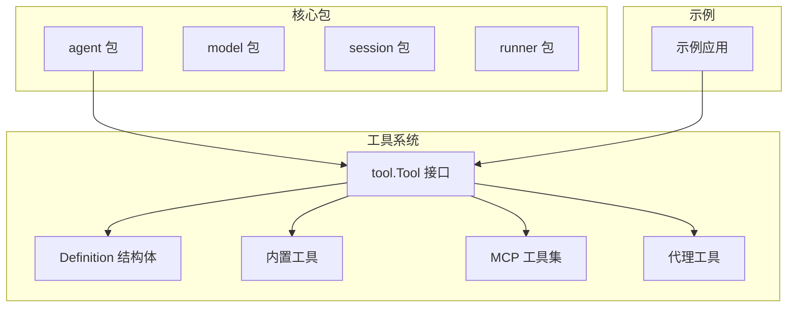
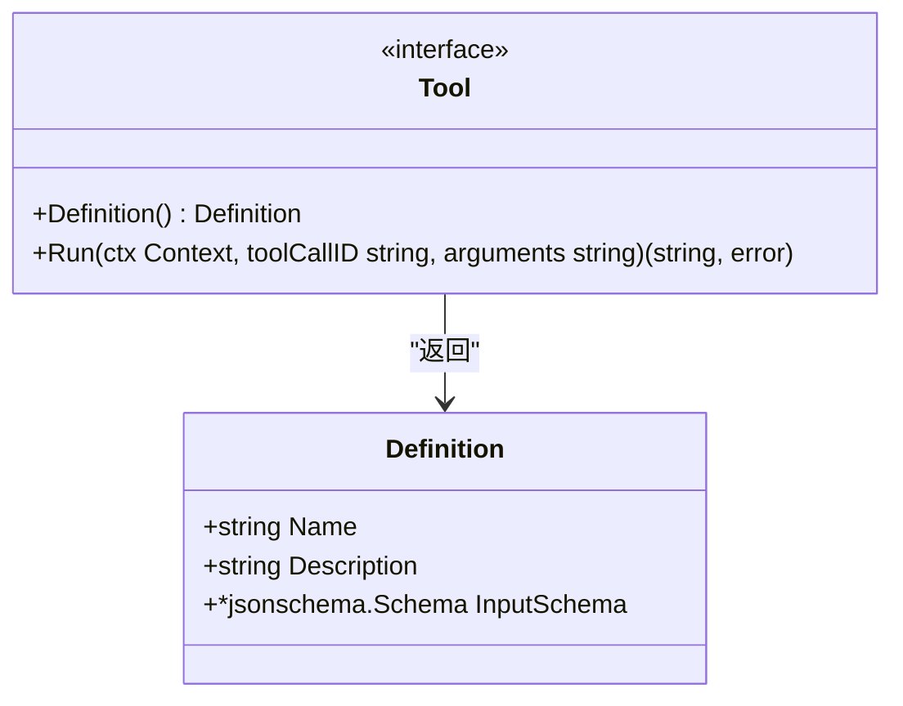
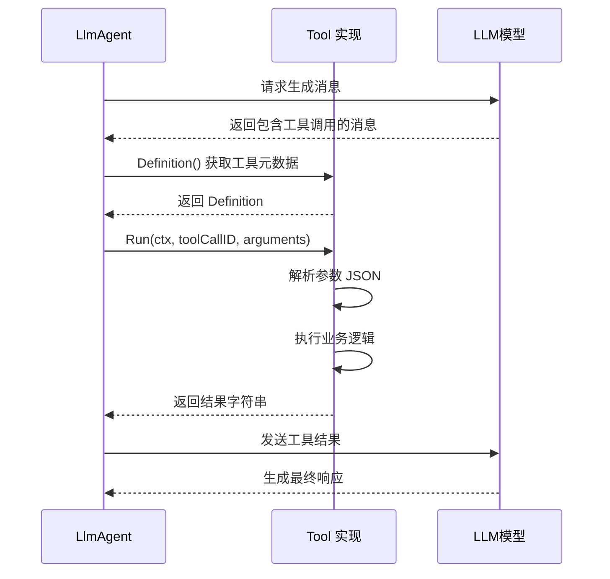
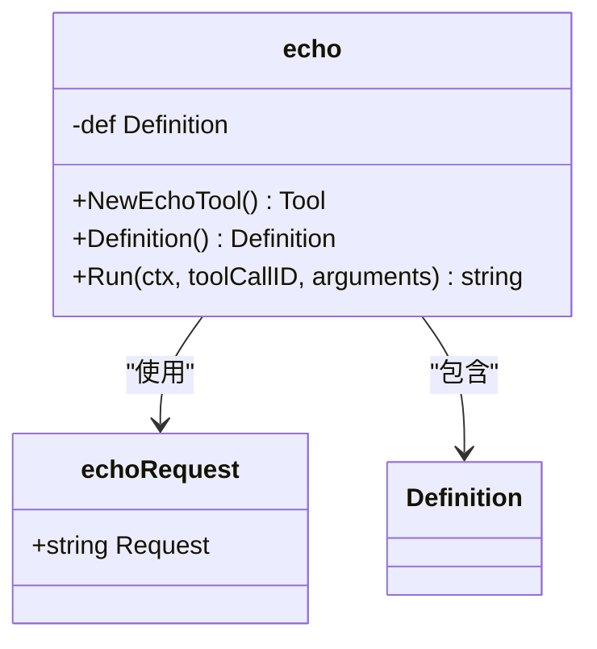
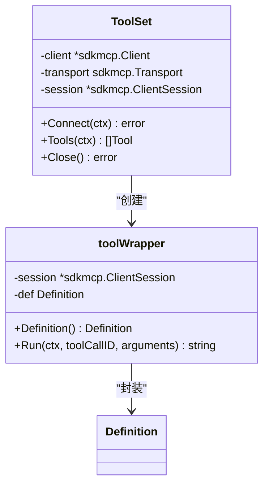
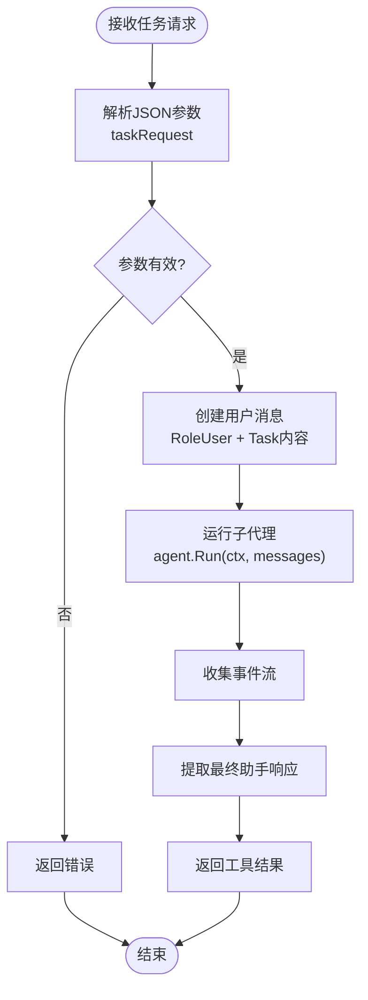
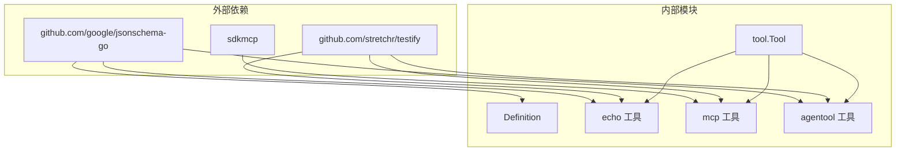
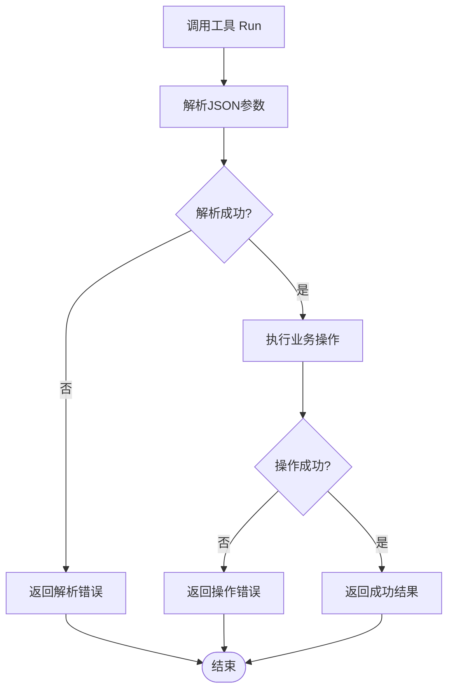

# 工具接口实现

<cite>
**本文档引用的文件**
- [tool.go](file://tool/tool.go)
- [echo.go](file://tool/builtin/echo.go)
- [mcp.go](file://tool/mcp/mcp.go)
- [agentool.go](file://agent/agentool/agentool.go)
- [README.md](file://README.md)
- [main.go](file://examples/chat/main.go)
- [mcp_test.go](file://tool/mcp/mcp_test.go)
- [agentool_test.go](file://agent/agentool/agentool_test.go)
</cite>

## 目录
1. [简介](#简介)
2. [项目结构](#项目结构)
3. [核心组件](#核心组件)
4. [架构概览](#架构概览)
5. [详细组件分析](#详细组件分析)
6. [依赖分析](#依赖分析)
7. [性能考虑](#性能考虑)
8. [故障排除指南](#故障排除指南)
9. [结论](#结论)

## 简介

本文档深入介绍了ADK（Agent Development Kit）中`tool.Tool`接口的实现要求和最佳实践。该接口是构建AI代理工具系统的核心抽象，允许开发者创建可被LLM调用的工具，实现从简单内置工具到复杂外部服务集成的统一接口。

ADK的设计理念是提供一个轻量级、惯用的Go语言库，用于构建生产就绪的AI代理。它通过解耦代理逻辑与LLM提供商、会话存储和工具集成，使开发者能够组合所需的精确组件。

## 项目结构

ADK项目采用清晰的包组织结构，重点关注工具系统的实现：

**图表来源**
- [tool.go:1-24](file://tool/tool.go#L1-L24)
- [echo.go:1-47](file://tool/builtin/echo.go#L1-L47)
- [mcp.go:1-121](file://tool/mcp/mcp.go#L1-L121)
- [agentool.go:1-79](file://agent/agentool/agentool.go#L1-L79)

**章节来源**
- [README.md:67-89](file://README.md#L67-L89)
- [tool.go:1-24](file://tool/tool.go#L1-L24)

## 核心组件

### Tool接口定义

`tool.Tool`接口是工具系统的核心抽象，定义了两个关键方法：

**图表来源**
- [tool.go:17-23](file://tool/tool.go#L17-L23)
- [tool.go:9-15](file://tool/tool.go#L9-L15)

### Definition结构体详解

Definition结构体提供了LLM所需的所有工具元数据：

| 字段名 | 类型 | 必填 | 描述 | 示例值 |
|--------|------|------|------|--------|
| Name | string | 是 | 工具的唯一标识符，用于LLM识别和调用 | "Echo" |
| Description | string | 是 | 工具功能的简要描述，帮助LLM理解用途 | "A tool to echo request message." |
| InputSchema | *jsonschema.Schema | 否 | 描述输入参数的JSON Schema | 自动生成的Schema |

**章节来源**
- [tool.go:9-15](file://tool/tool.go#L9-L15)
- [echo.go:28-33](file://tool/builtin/echo.go#L28-L33)

## 架构概览

ADK中的工具系统遵循以下架构模式：

**图表来源**
- [tool.go:17-23](file://tool/tool.go#L17-L23)
- [echo.go:40-46](file://tool/builtin/echo.go#L40-L46)

## 详细组件分析

### 内置工具实现

内置工具展示了最简单的Tool接口实现模式：

#### Echo工具实现

**图表来源**
- [echo.go:14-16](file://tool/builtin/echo.go#L14-L16)
- [echo.go:18-20](file://tool/builtin/echo.go#L18-L20)

**实现要点：**
1. 使用反射自动生成JSON Schema
2. 定义明确的输入结构体
3. 简洁的Run方法实现
4. 错误处理和参数验证

**章节来源**
- [echo.go:22-46](file://tool/builtin/echo.go#L22-L46)

### MCP工具实现

MCP（Model Context Protocol）工具展示了外部服务集成的最佳实践：

#### 工具包装器设计

**图表来源**
- [mcp.go:16-20](file://tool/mcp/mcp.go#L16-L20)
- [mcp.go:83-86](file://tool/mcp/mcp.go#L83-L86)

**实现特点：**
1. 动态发现和加载工具
2. Schema转换和验证
3. 错误处理和状态管理
4. 资源清理机制

**章节来源**
- [mcp.go:46-72](file://tool/mcp/mcp.go#L46-L72)
- [mcp.go:92-109](file://tool/mcp/mcp.go#L92-L109)

### 代理工具实现

代理工具展示了如何将Agent包装为Tool：

#### 代理到工具的转换

**图表来源**
- [agentool.go:57-78](file://agent/agentool/agentool.go#L57-L78)

**实现策略：**
1. 参数结构化定义
2. 事件流处理
3. 结果提取和过滤
4. 上下文传播

**章节来源**
- [agentool.go:54-78](file://agent/agentool/agentool.go#L54-L78)

## 依赖分析

工具系统的关键依赖关系：

**图表来源**
- [tool.go:6](file://tool/tool.go#L6)
- [echo.go:9](file://tool/builtin/echo.go#L9)
- [agentool.go:9](file://agent/agentool/agentool.go#L9)
- [mcp.go:9](file://tool/mcp/mcp.go#L9)

**章节来源**
- [README.md:380-393](file://README.md#L380-L393)

## 性能考虑

### 上下文管理和超时控制

在工具实现中，正确的上下文管理至关重要：

1. **超时控制**：为外部API调用设置合理的超时
2. **取消传播**：确保长操作可以及时响应取消
3. **资源清理**：实现Close方法进行资源释放

### 错误处理策略

## 故障排除指南

### 常见问题和解决方案

1. **JSON Schema生成失败**
   - 检查结构体标签是否正确
   - 确保所有字段都有适当的jsonschema标签

2. **工具调用超时**
   - 检查外部服务的响应时间
   - 实现适当的重试机制

3. **参数解析错误**
   - 验证传入的JSON格式
   - 添加详细的错误信息

**章节来源**
- [mcp_test.go:92-99](file://tool/mcp/mcp_test.go#L92-L99)
- [agentool_test.go:170-235](file://agent/agentool/agentool_test.go#L170-L235)

## 结论

ADK的`tool.Tool`接口提供了一个强大而灵活的工具抽象层，支持从简单内置工具到复杂外部服务集成的各种场景。通过标准化的接口设计和最佳实践指导，开发者可以轻松创建高质量的AI代理工具。

关键成功因素包括：
- 清晰的工具元数据定义
- 严格的参数验证和错误处理
- 优雅的上下文管理和资源清理
- 可扩展的架构设计

这些原则确保了工具系统的可靠性、可维护性和可扩展性，为构建生产就绪的AI代理奠定了坚实基础。