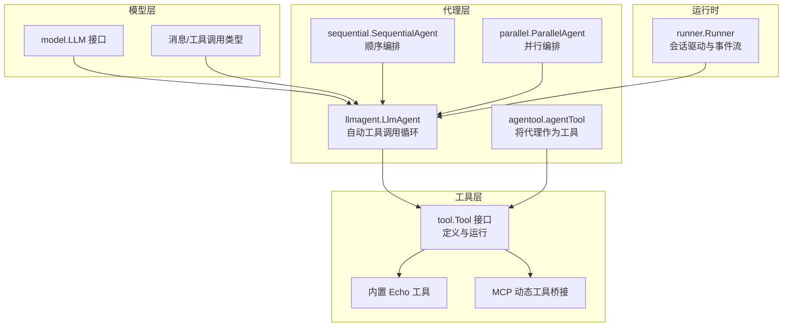
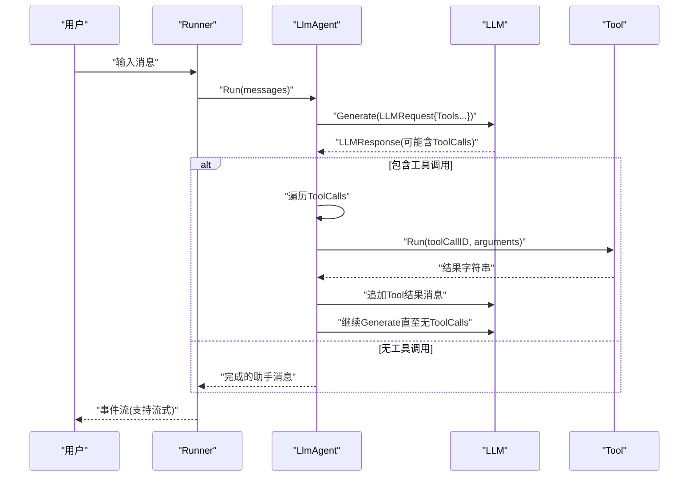
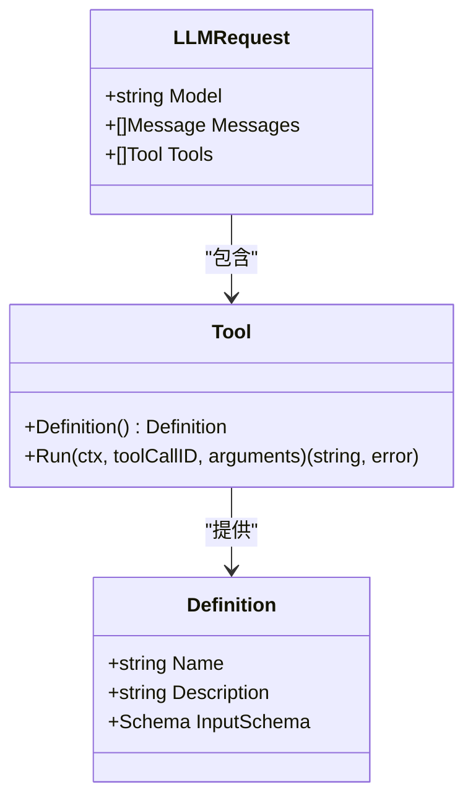
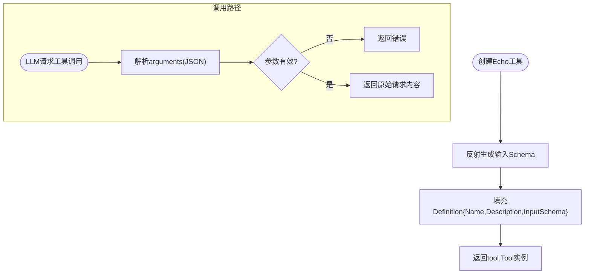
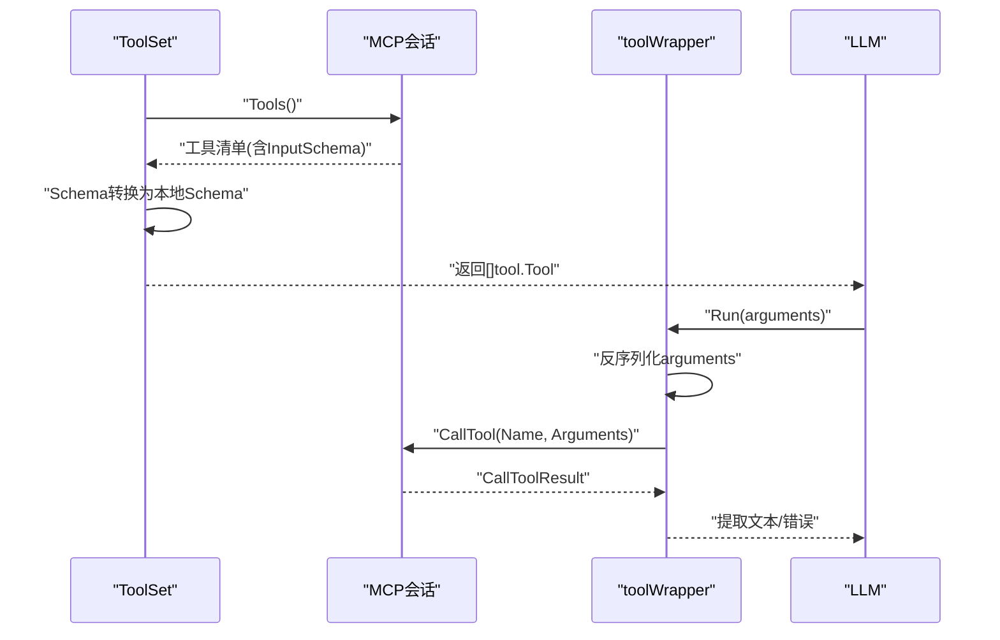
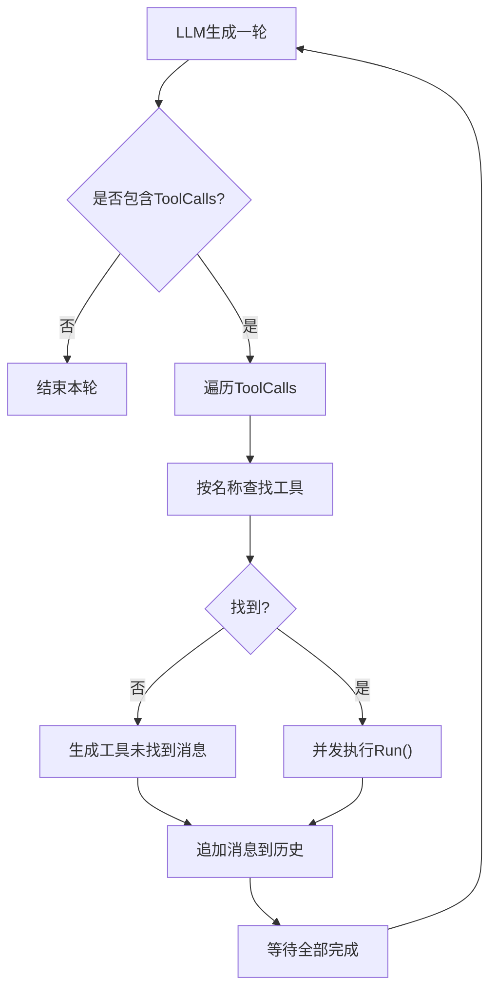
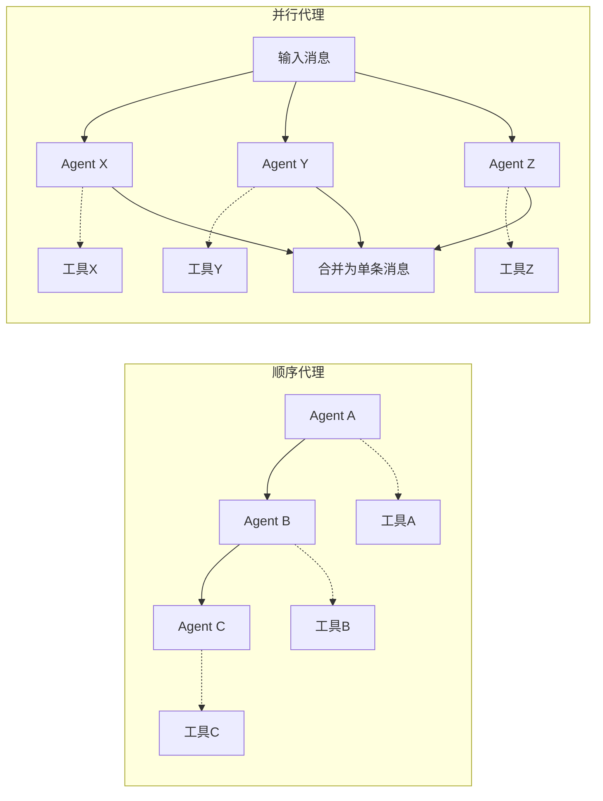
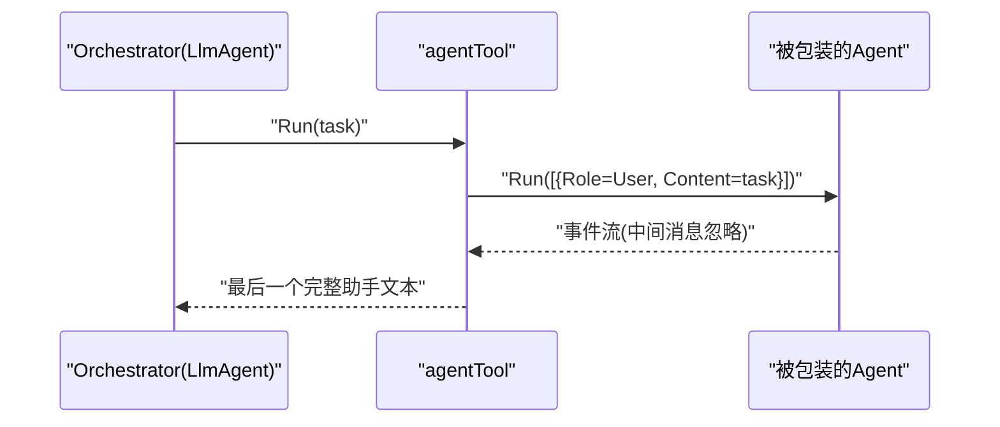
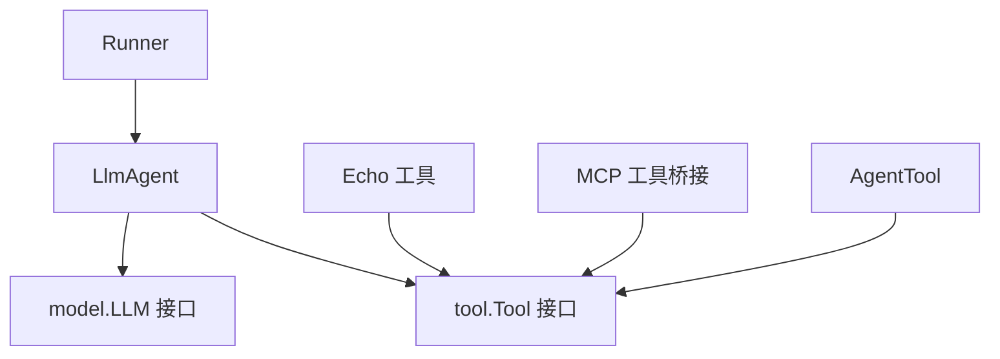

# 工具注册与发现

<cite>
**本文引用的文件**
- [tool/tool.go](file://tool/tool.go)
- [tool/builtin/echo.go](file://tool/builtin/echo.go)
- [tool/mcp/mcp.go](file://tool/mcp/mcp.go)
- [agent/llmagent/llmagent.go](file://agent/llmagent/llmagent.go)
- [agent/sequential/sequential.go](file://agent/sequential/sequential.go)
- [agent/parallel/parallel.go](file://agent/parallel/parallel.go)
- [agent/agentool/agentool.go](file://agent/agentool/agentool.go)
- [model/model.go](file://model/model.go)
- [runner/runner.go](file://runner/runner.go)
- [examples/chat/main.go](file://examples/chat/main.go)
- [README.md](file://README.md)
</cite>

## 目录
1. [简介](#简介)
2. [项目结构](#项目结构)
3. [核心组件](#核心组件)
4. [架构总览](#架构总览)
5. [详细组件分析](#详细组件分析)
6. [依赖分析](#依赖分析)
7. [性能考虑](#性能考虑)
8. [故障排查指南](#故障排查指南)
9. [结论](#结论)
10. [附录](#附录)

## 简介
本文件聚焦于ADK（Agent Development Kit）中的“工具注册机制”与“代理中的工具发现流程”。我们将系统阐述：
- 工具如何被代理系统识别与加载（含工具元数据传播）
- 工具在LLM调用中的触发机制（从参数校验到执行）
- 以Echo工具为参考案例，解析其注册与调用模式
- 工具池管理与动态加载的实现思路（生命周期、版本控制、兼容性与热更新）
- 在不同代理类型中（顺序代理与并行代理）的工具调用差异

## 项目结构
ADK采用分层与按功能域划分的组织方式：核心接口位于顶层包，具体实现分布在各自子包中；示例展示了MCP动态工具集的发现与使用。

图表来源
- [tool/tool.go:17-24](file://tool/tool.go#L17-L24)
- [tool/builtin/echo.go:22-34](file://tool/builtin/echo.go#L22-L34)
- [tool/mcp/mcp.go:46-72](file://tool/mcp/mcp.go#L46-L72)
- [agent/llmagent/llmagent.go:36-46](file://agent/llmagent/llmagent.go#L36-L46)
- [agent/sequential/sequential.go:34-41](file://agent/sequential/sequential.go#L34-L41)
- [agent/parallel/parallel.go:90-101](file://agent/parallel/parallel.go#L90-L101)
- [agent/agentool/agentool.go:35-48](file://agent/agentool/agentool.go#L35-L48)
- [model/model.go:10-18](file://model/model.go#L10-L18)
- [runner/runner.go:26-37](file://runner/runner.go#L26-L37)

章节来源
- [README.md:67-89](file://README.md#L67-L89)

## 核心组件
- 工具接口与元数据
  - 定义：工具通过统一接口暴露元数据与执行能力，元数据包含名称、描述与输入JSON Schema，用于LLM函数调用的参数校验与提示。
  - 关键点：Definition返回值直接参与LLM请求的Tools列表，Run接收工具调用ID与参数字符串，返回结果字符串。
- LLM请求与消息模型
  - LLMRequest携带Tools切片，使LLM在生成响应时可选择调用这些工具。
  - Message包含ToolCalls字段，承载LLM请求的工具调用清单。
- LlmAgent工具调用循环
  - 将LLM生成的工具调用映射到已注册工具集合，按顺序或并发执行，并将结果回填至对话历史。

章节来源
- [tool/tool.go:9-24](file://tool/tool.go#L9-L24)
- [model/model.go:188-196](file://model/model.go#L188-L196)
- [model/model.go:130-143](file://model/model.go#L130-L143)
- [agent/llmagent/llmagent.go:36-46](file://agent/llmagent/llmagent.go#L36-L46)

## 架构总览
下图展示了Runner驱动Agent，Agent调用LLM，LLM返回工具调用，Agent再执行工具并将结果回写的历史闭环。

图表来源
- [runner/runner.go:39-95](file://runner/runner.go#L39-L95)
- [agent/llmagent/llmagent.go:56-136](file://agent/llmagent/llmagent.go#L56-L136)
- [model/model.go:188-212](file://model/model.go#L188-L212)

## 详细组件分析

### 工具接口与元数据传播
- Definition结构体承载工具的名称、描述与输入Schema，作为LLM函数签名的权威来源。
- Tool接口要求Definition与Run方法，确保工具具备被LLM识别与执行的能力。
- LLMRequest.Tools切片由Agent在构造时注入，使得LLM在生成阶段能基于这些元数据进行函数调用。

图表来源
- [tool/tool.go:9-24](file://tool/tool.go#L9-L24)
- [model/model.go:188-196](file://model/model.go#L188-L196)

章节来源
- [tool/tool.go:9-24](file://tool/tool.go#L9-L24)
- [model/model.go:188-196](file://model/model.go#L188-L196)

### Echo工具：注册与调用模式
- 注册
  - 通过工厂函数创建工具实例，内部构建输入Schema并填充Definition，随后以tool.Tool形式返回。
  - Echo工具的名称与描述直接写入Definition，输入Schema基于结构体反射生成。
- 调用
  - Run方法负责参数反序列化与错误处理，最终返回原始请求内容。
  - 参数校验由LLM在函数调用前依据Definition.InputSchema完成。

图表来源
- [tool/builtin/echo.go:22-34](file://tool/builtin/echo.go#L22-L34)
- [tool/builtin/echo.go:40-46](file://tool/builtin/echo.go#L40-L46)

章节来源
- [tool/builtin/echo.go:14-46](file://tool/builtin/echo.go#L14-L46)

### MCP动态工具：发现与包装
- 连接与发现
  - 通过Transport建立与MCP服务器的会话，枚举远端工具集合并转换为本地工具定义。
  - 输入Schema从SDK返回的任意类型经JSON往返转换为本地Schema对象。
- 执行
  - toolWrapper.Run将传入的参数字符串反序列化为映射，调用会话的CallTool方法，提取文本内容作为结果返回。
  - 若远端工具返回错误标记，则将错误信息透传给调用方。

图表来源
- [tool/mcp/mcp.go:46-72](file://tool/mcp/mcp.go#L46-L72)
- [tool/mcp/mcp.go:92-109](file://tool/mcp/mcp.go#L92-L109)

章节来源
- [tool/mcp/mcp.go:15-121](file://tool/mcp/mcp.go#L15-L121)

### LlmAgent工具调用循环：从识别到执行
- 注册与索引
  - 构造Agent时将工具切片转换为以名称为键的映射，便于后续O(1)查找。
- 识别与执行
  - 每轮生成后，若FinishReason为工具调用，则遍历ToolCalls，按名称在工具表中查找对应实例。
  - 并发执行所有工具调用，保持原始顺序，收集结果消息并追加到历史。
- 错误处理
  - 当工具未找到或执行出错时，生成对应的工具消息并继续流程。

图表来源
- [agent/llmagent/llmagent.go:36-46](file://agent/llmagent/llmagent.go#L36-L46)
- [agent/llmagent/llmagent.go:116-134](file://agent/llmagent/llmagent.go#L116-L134)
- [agent/llmagent/llmagent.go:139-158](file://agent/llmagent/llmagent.go#L139-L158)

章节来源
- [agent/llmagent/llmagent.go:30-159](file://agent/llmagent/llmagent.go#L30-L159)

### 顺序代理与并行代理中的工具调用差异
- 顺序代理（SequentialAgent）
  - 串行运行多个Agent，每个Agent接收完整的上下文（包括之前Agent产生的完整消息），适合多步骤流水线。
  - 工具调用发生在其内部的LlmAgent中，工具集合由该Agent配置决定。
- 并行代理（ParallelAgent）
  - 同时启动多个Agent，共享同一输入消息，彼此独立且不互相感知输出。
  - 结果在完成后通过合并函数汇总为单一助手消息，适合多模型对比或并行任务。
  - 工具调用同样发生在各自Agent内部的LlmAgent中，工具集合由各Agent配置决定。

图表来源
- [agent/sequential/sequential.go:46-92](file://agent/sequential/sequential.go#L46-L92)
- [agent/parallel/parallel.go:112-174](file://agent/parallel/parallel.go#L112-L174)

章节来源
- [agent/sequential/sequential.go:18-93](file://agent/sequential/sequential.go#L18-L93)
- [agent/parallel/parallel.go:70-175](file://agent/parallel/parallel.go#L70-L175)

### Agent作为工具：委托模式
- agentool将任意Agent包装为tool.Tool，输入Schema仅包含一个task字段。
- 调用时以单条用户消息触发被包装Agent的Run，仅收集最后一个完整助手文本作为工具结果返回。
- 该模式允许在更高层Agent中以函数调用的方式委派任务给子Agent。

图表来源
- [agent/agentool/agentool.go:35-78](file://agent/agentool/agentool.go#L35-L78)

章节来源
- [agent/agentool/agentool.go:16-79](file://agent/agentool/agentool.go#L16-L79)

### 示例：MCP工具发现与使用
- 示例程序展示了如何连接MCP服务器、列举工具、将其注入LlmAgent，并通过Runner驱动对话。
- 输出中会打印从MCP发现的工具清单及其元数据，体现Definition的传播与展示。

章节来源
- [examples/chat/main.go:52-100](file://examples/chat/main.go#L52-L100)
- [examples/chat/main.go:101-111](file://examples/chat/main.go#L101-L111)

## 依赖分析
- 组件耦合
  - LlmAgent依赖tool.Tool接口与model.LLM接口，通过Definition与LLM交互。
  - Runner仅负责会话与事件流，不直接依赖具体工具实现，保持高内聚低耦合。
  - MCP桥接器封装外部协议细节，向上暴露标准tool.Tool接口。
- 外部依赖
  - JSON Schema生成库用于工具输入Schema的构建与转换。
  - MCP SDK用于动态工具发现与调用。
  - Snowflake用于消息ID生成。

图表来源
- [agent/llmagent/llmagent.go:36-46](file://agent/llmagent/llmagent.go#L36-L46)
- [tool/tool.go:17-24](file://tool/tool.go#L17-L24)
- [runner/runner.go:26-37](file://runner/runner.go#L26-L37)

章节来源
- [tool/tool.go:3-7](file://tool/tool.go#L3-L7)
- [tool/mcp/mcp.go:3-13](file://tool/mcp/mcp.go#L3-L13)

## 性能考虑
- 并发执行工具调用
  - LlmAgent对工具调用采用并发执行（保持顺序），可显著缩短端到端延迟，但需注意工具自身的并发安全与资源占用。
- 流式输出
  - Runner与LlmAgent均支持部分事件的流式传输，有利于实时显示与降低感知延迟。
- 会话持久化
  - Runner仅在完整事件时持久化，避免频繁写入带来的开销。

章节来源
- [agent/llmagent/llmagent.go:116-134](file://agent/llmagent/llmagent.go#L116-L134)
- [runner/runner.go:76-95](file://runner/runner.go#L76-L95)

## 故障排查指南
- 工具未找到
  - 现象：工具消息内容提示“未找到”。
  - 原因：工具名称与LLM请求中的名称不一致，或工具未正确注册到Agent。
  - 处理：检查Agent配置中的Tools切片与工具Definition.Name是否匹配。
- 参数解析失败
  - 现象：Run返回参数解析错误。
  - 原因：arguments不是合法JSON或字段缺失。
  - 处理：核对Definition.InputSchema与调用方提供的参数一致性。
- MCP调用错误
  - 现象：MCP工具返回错误标记。
  - 原因：远端工具执行异常或鉴权失败。
  - 处理：检查MCP服务器状态、认证头设置与网络连通性。
- 并行代理错误传播
  - 现象：任一子Agent报错导致整个并行流程中断。
  - 原因：并行代理在首个错误发生时取消上下文，促使其他子任务尽快退出。
  - 处理：在子Agent内部做好容错与降级策略，或在上层进行重试与补偿。

章节来源
- [agent/llmagent/llmagent.go:139-158](file://agent/llmagent/llmagent.go#L139-L158)
- [tool/mcp/mcp.go:92-109](file://tool/mcp/mcp.go#L92-L109)
- [agent/parallel/parallel.go:112-174](file://agent/parallel/parallel.go#L112-L174)

## 结论
ADK通过统一的tool.Tool接口与Definition元数据，实现了工具的标准化注册与发现；结合LlmAgent的自动工具调用循环，形成了从“LLM函数签名—工具识别—并发执行—结果回写”的完整链路。内置Echo工具与MCP桥接器分别代表静态注册与动态发现两种典型场景；顺序与并行代理则展示了在不同编排策略下工具调用的差异。通过事件流与会话持久化的分离设计，系统在可扩展性与可维护性方面具备良好基础。

## 附录

### 工具池管理与动态加载实现思路
- 工具池
  - 使用映射结构（名称到工具实例）集中管理工具，便于快速查找与替换。
  - 支持在Agent初始化时注入，或在运行时通过外部服务动态刷新。
- 生命周期
  - 创建：构建Schema与Definition，注册到池。
  - 运行：根据名称查找并执行，记录Usage与错误。
  - 销毁：释放资源（如MCP会话），关闭连接。
- 版本控制与兼容性
  - 通过Definition.Name区分不同版本；在Agent配置中选择目标版本工具。
  - 对输入Schema进行向后兼容校验，拒绝不兼容参数。
- 热更新
  - 提供“原子切换”能力：先加载新版本工具，校验无误后再替换映射中的旧实例，确保调用期间不中断。
  - 对于MCP工具，断开旧会话、重建连接并重新枚举工具，再替换池中包装器。

章节来源
- [agent/llmagent/llmagent.go:36-46](file://agent/llmagent/llmagent.go#L36-L46)
- [tool/mcp/mcp.go:35-43](file://tool/mcp/mcp.go#L35-L43)
- [tool/mcp/mcp.go:74-80](file://tool/mcp/mcp.go#L74-L80)