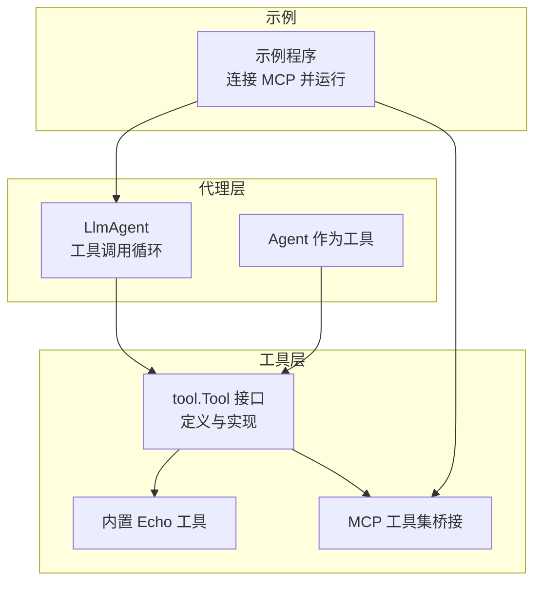
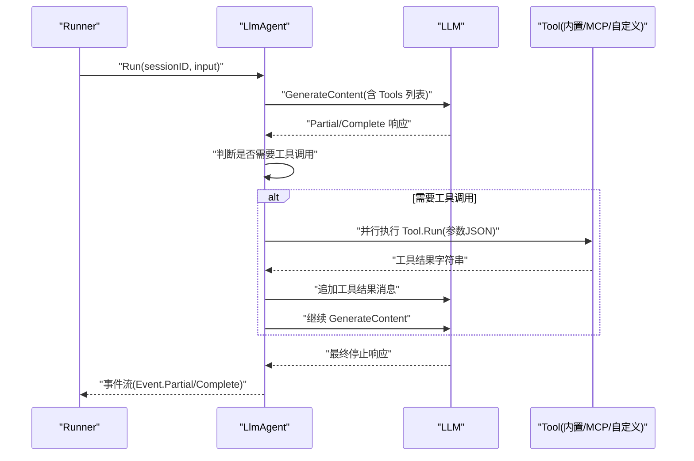
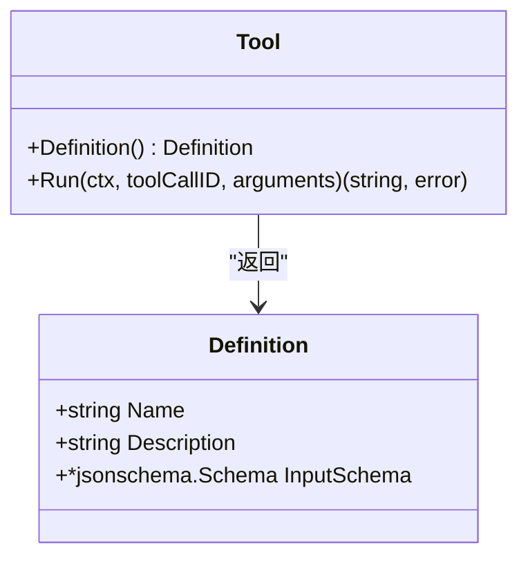
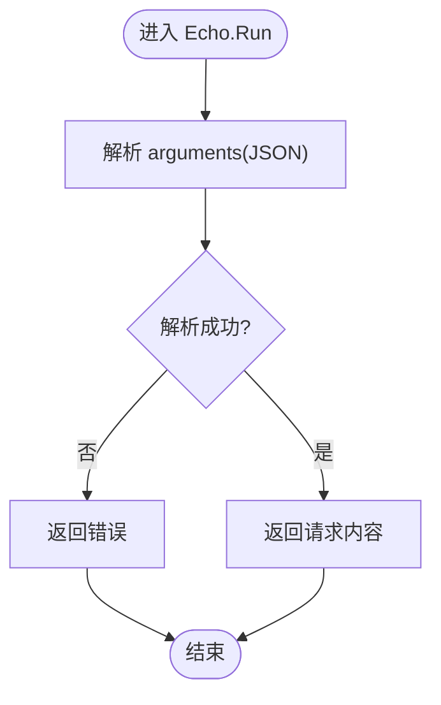
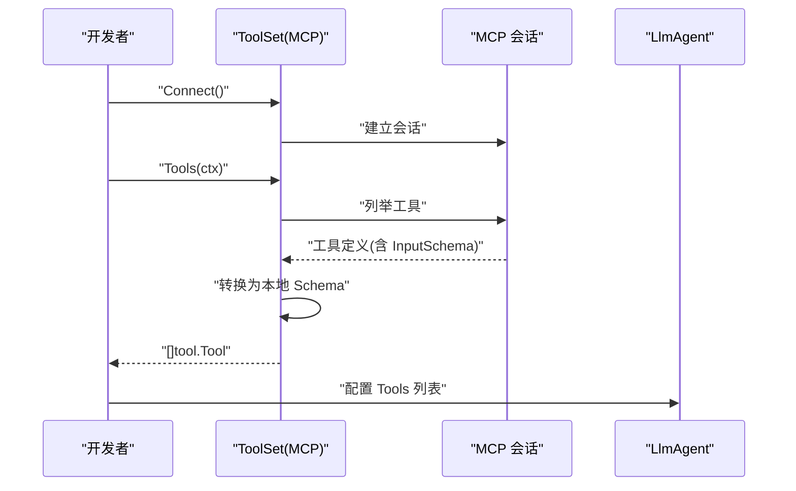
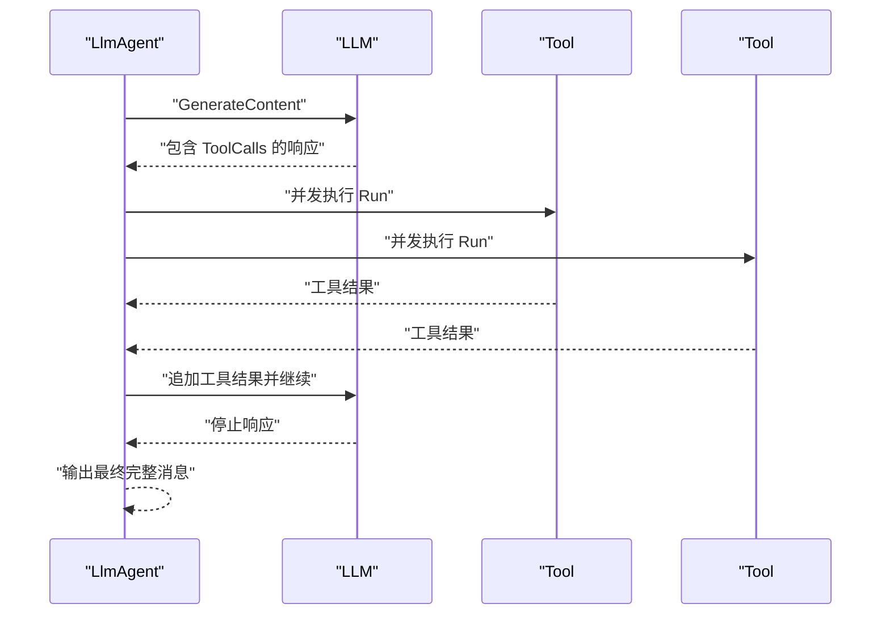
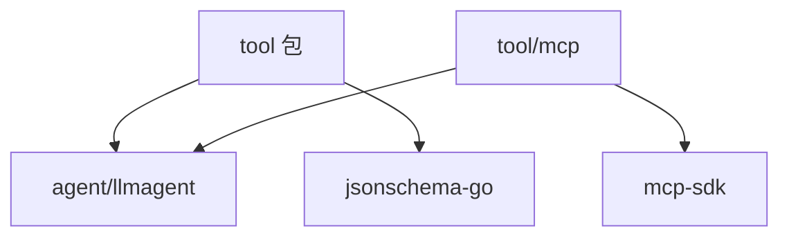

# 自定义工具开发

<cite>
**本文引用的文件**
- [tool/tool.go](file://tool/tool.go)
- [tool/builtin/echo.go](file://tool/builtin/echo.go)
- [tool/mcp/mcp.go](file://tool/mcp/mcp.go)
- [agent/llmagent/llmagent.go](file://agent/llmagent/llmagent.go)
- [agent/agentool/agentool.go](file://agent/agentool/agentool.go)
- [examples/chat/main.go](file://examples/chat/main.go)
- [README.md](file://README.md)
- [go.mod](file://go.mod)
- [agent/llmagent/llmagent_test.go](file://agent/llmagent/llmagent_test.go)
- [tool/mcp/mcp_test.go](file://tool/mcp/mcp_test.go)
</cite>

## 目录
1. [简介](#简介)
2. [项目结构](#项目结构)
3. [核心组件](#核心组件)
4. [架构总览](#架构总览)
5. [详细组件分析](#详细组件分析)
6. [依赖分析](#依赖分析)
7. [性能考量](#性能考量)
8. [故障排查指南](#故障排查指南)
9. [结论](#结论)
10. [附录](#附录)

## 简介
本指南面向希望在 ADK（Agent Development Kit）中开发自定义工具的工程师，覆盖从接口设计、参数校验、实现模式、注册与发现，到代理调用流程、安全与性能优化以及测试策略的全流程。文档以仓库现有实现为依据，结合 Echo 工具的入门示例，逐步讲解如何基于统一的 tool.Tool 接口扩展能力，并通过 LlmAgent 的自动工具调用循环完成端到端集成。

## 项目结构
ADK 将“代理”“模型适配”“会话存储”“工具”等模块解耦，便于按需组合。与工具开发直接相关的目录与文件如下：
- tool：工具接口与内置工具
  - tool.go：定义 Definition 和 Tool 接口
  - builtin/echo.go：Echo 工具示例
  - mcp/mcp.go：MCP 工具集桥接
- agent：代理层
  - llmagent/llmagent.go：LLM 驱动的代理，负责工具调用循环
  - agentool/agentool.go：将代理包装为工具
- examples/chat/main.go：示例程序，演示 MCP 工具接入与运行
- README.md：总体架构说明与工具相关要点
- go.mod：依赖声明（含 JSON Schema、MCP SDK 等）

图表来源
- [tool/tool.go:17-24](file://tool/tool.go#L17-L24)
- [tool/builtin/echo.go:22-34](file://tool/builtin/echo.go#L22-L34)
- [tool/mcp/mcp.go:46-72](file://tool/mcp/mcp.go#L46-L72)
- [agent/llmagent/llmagent.go:36-46](file://agent/llmagent/llmagent.go#L36-L46)
- [agent/agentool/agentool.go:35-48](file://agent/agentool/agentool.go#L35-L48)
- [examples/chat/main.go:82-111](file://examples/chat/main.go#L82-L111)

章节来源
- [README.md:37-246](file://README.md#L37-L246)
- [go.mod:1-47](file://go.mod#L1-L47)

## 核心组件
- Tool 接口与 Definition
  - Definition 包含名称、描述与输入参数的 JSON Schema，用于向 LLM 描述工具的能力与参数约束。
  - Tool 接口定义两个方法：Definition 返回元数据；Run 执行工具，接收上下文、工具调用 ID 与参数字符串，返回结果字符串与错误。
- Echo 内置工具
  - 使用 JSON Schema 为输入参数生成强类型定义，Run 中解析参数并回显请求内容。
- LlmAgent 工具调用循环
  - 在每次 LLM 响应后，若 FinishReason 指示需要工具调用，则并行执行所有 ToolCalls，将工具结果消息追加到历史，继续下一轮生成直至停止。
- Agent 作为工具
  - 将任意 Agent 包装为 tool.Tool，使其可被其他代理通过函数调用机制委托任务。

章节来源
- [tool/tool.go:9-24](file://tool/tool.go#L9-L24)
- [tool/builtin/echo.go:14-46](file://tool/builtin/echo.go#L14-L46)
- [agent/llmagent/llmagent.go:30-159](file://agent/llmagent/llmagent.go#L30-L159)
- [agent/agentool/agentool.go:16-79](file://agent/agentool/agentool.go#L16-L79)

## 架构总览
下图展示了 Runner、LlmAgent 与工具之间的交互关系，以及工具的三种来源：内置工具、MCP 工具集与自定义工具。

图表来源
- [agent/llmagent/llmagent.go:78-136](file://agent/llmagent/llmagent.go#L78-L136)
- [tool/tool.go:17-24](file://tool/tool.go#L17-L24)

## 详细组件分析

### Tool 接口与 Definition 设计
- 设计原则
  - Provider-agnostic：工具不依赖具体 LLM 实现，仅暴露统一接口。
  - 元数据驱动：Definition 中的 JSON Schema 由上游 LLM 使用，确保参数校验与提示一致。
  - 参数字符串化：Run 的参数以 JSON 字符串传入，便于跨边界传递与序列化。
- 方法职责
  - Definition：返回工具名称、描述与输入 Schema，供 LLM 识别与参数校验。
  - Run：执行业务逻辑，返回字符串结果或错误；错误会被封装为工具结果消息返回给 LLM。

图表来源
- [tool/tool.go:17-24](file://tool/tool.go#L17-L24)
- [tool/tool.go:9-15](file://tool/tool.go#L9-L15)

章节来源
- [tool/tool.go:9-24](file://tool/tool.go#L9-L24)

### Echo 工具：入门示例
- 实现要点
  - 输入参数结构体定义了必填字段与注释，通过反射生成 JSON Schema。
  - Run 解析参数 JSON，返回请求内容；参数解析失败时直接返回错误。
- 参数验证机制
  - JSON Schema 由 jsonschema-go 基于结构体标签生成，保证 LLM 调用时的参数合法性。
- 错误处理
  - 参数解析错误直接返回；工具内部错误也会作为字符串结果返回给 LLM。

图表来源
- [tool/builtin/echo.go:40-46](file://tool/builtin/echo.go#L40-L46)

章节来源
- [tool/builtin/echo.go:14-46](file://tool/builtin/echo.go#L14-L46)

### 自定义工具开发模式
- 基本步骤
  - 定义输入参数结构体，使用 jsonschema 标签描述字段含义与示例。
  - 通过反射生成 Definition.InputSchema。
  - 实现 Tool 接口：Definition 返回元数据；Run 解析参数并执行业务逻辑。
- 参数校验
  - JSON Schema 由结构体标签与反射生成，支持必填字段、类型约束与示例说明。
  - LLM 在函数调用前会根据 Schema 校验参数，减少无效调用。
- 错误处理
  - Run 应区分参数解析错误与业务执行错误，并返回可读的结果字符串或错误。
  - LlmAgent 会将错误结果转换为工具消息返回给 LLM。

章节来源
- [tool/tool.go:9-24](file://tool/tool.go#L9-L24)
- [tool/builtin/echo.go:22-34](file://tool/builtin/echo.go#L22-L34)

### 工具注册与发现
- 注册方式
  - LlmAgent 在构造时将工具列表映射为名称到工具实例的字典，便于快速查找。
- 发现机制
  - MCP 工具集通过连接 MCP 服务器动态发现工具，将每个工具的输入 Schema 转换为本地使用的 *jsonschema.Schema，再包装为 tool.Tool 实例。
- 示例程序
  - 示例程序创建 MCP Transport，连接 Exa MCP 服务，列出可用工具并注入 LlmAgent 的 Tools 列表。

图表来源
- [tool/mcp/mcp.go:35-72](file://tool/mcp/mcp.go#L35-L72)
- [examples/chat/main.go:82-111](file://examples/chat/main.go#L82-L111)

章节来源
- [agent/llmagent/llmagent.go:36-46](file://agent/llmagent/llmagent.go#L36-L46)
- [tool/mcp/mcp.go:46-72](file://tool/mcp/mcp.go#L46-L72)
- [examples/chat/main.go:82-111](file://examples/chat/main.go#L82-L111)

### 代理作为工具（Agent as Tool）
- 设计动机
  - 将子代理委托为工具，使上层代理可通过函数调用机制委派任务，形成多级代理协作。
- 实现要点
  - 输入参数结构体定义单一任务字段，Run 时以用户消息形式触发子代理，收集其最终助手回复作为工具结果。
- 适用场景
  - 复杂任务拆分、多代理流水线、知识检索与总结等。

章节来源
- [agent/agentool/agentool.go:16-79](file://agent/agentool/agentool.go#L16-L79)

### 工具在代理中的调用流程
- 流程概览
  - LlmAgent 每次收到 LLM 的完整响应后，检查 FinishReason 是否为工具调用。
  - 若是，遍历 ToolCalls，按原始顺序并发执行工具，将结果消息追加到历史，继续下一轮生成。
  - 直到 LLM 返回停止原因，输出最终完整消息。
- 并发执行
  - 工具调用采用 goroutine 并发执行，WaitGroup 等待全部完成，保证顺序一致性与性能。

图表来源
- [agent/llmagent/llmagent.go:116-136](file://agent/llmagent/llmagent.go#L116-L136)

章节来源
- [agent/llmagent/llmagent.go:116-136](file://agent/llmagent/llmagent.go#L116-L136)

## 依赖分析
- 关键外部依赖
  - github.com/google/jsonschema-go：用于从 Go 类型生成 JSON Schema，支撑参数校验与 LLM 提示。
  - github.com/modelcontextprotocol/go-sdk：MCP 客户端，用于连接 MCP 服务器并动态发现工具。
- 内部模块耦合
  - tool 包与 agent/llmagent 包通过统一接口耦合，保持低耦合高内聚。
  - tool/mcp 与 agent/llmagent 通过工具列表进行松耦合集成。

图表来源
- [go.mod:8-11](file://go.mod#L8-L11)
- [tool/tool.go:6](file://tool/tool.go#L6)
- [tool/mcp/mcp.go:9-12](file://tool/mcp/mcp.go#L9-L12)

章节来源
- [go.mod:1-47](file://go.mod#L1-L47)

## 性能考量
- 并发工具执行
  - LlmAgent 对同一轮内的多个 ToolCalls 采用并发执行，显著降低端到端延迟。
- 流式输出
  - 当开启流式生成时，代理会逐段转发 LLM 的 Partial 事件，提升用户体验。
- 测试验证
  - 单元测试通过慢工具模拟验证并发执行时间小于串行总和，确保性能预期。

章节来源
- [agent/llmagent/llmagent.go:116-136](file://agent/llmagent/llmagent.go#L116-L136)
- [agent/llmagent/llmagent_test.go:604-672](file://agent/llmagent/llmagent_test.go#L604-L672)

## 故障排查指南
- 参数解析错误
  - 当 arguments JSON 无法解析为工具期望的结构体时，Run 应返回错误；LlmAgent 会将其转换为工具结果消息。
- 工具未找到
  - 若 LlmAgent 无法在工具映射中找到对应名称，会返回“工具未找到”的工具消息。
- MCP 连接与工具发现
  - 连接失败或工具列表为空时，应检查传输配置与认证头设置；示例程序展示了如何为 MCP 服务注入 API Key。
- 测试策略
  - 使用 mock LLM 与 streamingMockLLM 验证流式与工具调用循环；通过慢工具测试并发执行性能。

章节来源
- [agent/llmagent/llmagent.go:138-159](file://agent/llmagent/llmagent.go#L138-L159)
- [tool/mcp/mcp.go:35-43](file://tool/mcp/mcp.go#L35-L43)
- [tool/mcp/mcp_test.go:44-100](file://tool/mcp/mcp_test.go#L44-L100)
- [agent/llmagent/llmagent_test.go:502-579](file://agent/llmagent/llmagent_test.go#L502-L579)

## 结论
通过统一的 tool.Tool 接口与 Definition 元数据，ADK 为工具开发提供了清晰的抽象与强大的参数校验能力。Echo 工具展示了从结构体到 JSON Schema 的自动化生成路径，MCP 工具集演示了动态发现与桥接机制，LlmAgent 的工具调用循环则实现了端到端的自动执行闭环。配合并发执行、流式输出与完善的测试策略，开发者可以高效构建高质量的自定义工具。

## 附录
- 快速开始
  - 创建自定义工具：定义输入结构体并生成 Definition；实现 Tool 接口；在 LlmAgent 的 Tools 列表中注册。
  - 引入 MCP 工具：创建 Transport 并连接，调用 Tools 获取工具列表，注入 LlmAgent。
- 参考示例
  - 示例程序展示了如何连接 MCP 服务器并运行工具，适合对照实现自己的工具接入流程。

章节来源
- [examples/chat/main.go:82-111](file://examples/chat/main.go#L82-L111)
- [README.md:270-291](file://README.md#L270-L291)