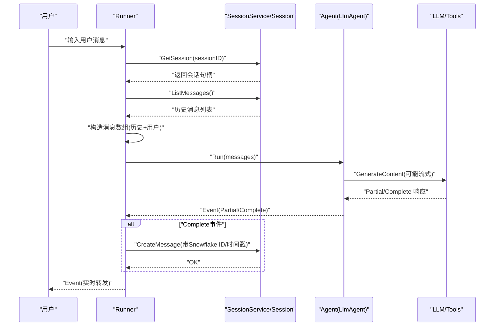
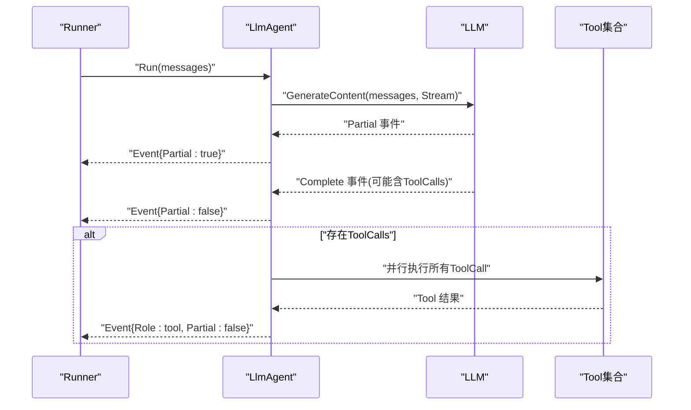
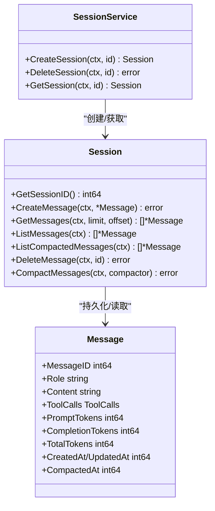
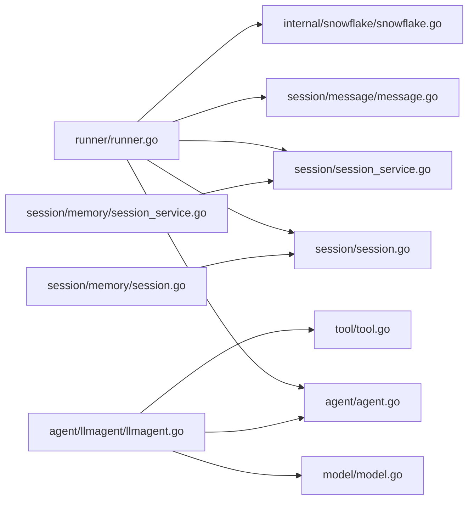

# 运行器协调

<cite>
**本文引用的文件列表**
- [runner.go](file://runner/runner.go)
- [runner_test.go](file://runner/runner_test.go)
- [session_service.go](file://session/session_service.go)
- [session.go](file://session/session.go)
- [message.go](file://session/message/message.go)
- [agent.go](file://agent/agent.go)
- [llmagent.go](file://agent/llmagent/llmagent.go)
- [tool.go](file://tool/tool.go)
- [model.go](file://model/model.go)
- [snowflake.go](file://internal/snowflake/snowflake.go)
- [main.go](file://examples/chat/main.go)
- [session_service.go（内存）](file://session/memory/session_service.go)
- [session.go（内存）](file://session/memory/session.go)
- [README.md](file://README.md)
</cite>

## 更新摘要
**变更内容**
- 新增Runner接口的详细API说明和方法签名
- 补充Runner构造函数New()的参数和返回值说明
- 完善Runner.Run()方法的参数描述、返回值类型和使用示例
- 增加Runner内部持久化机制的详细说明
- 补充流式处理的实现原理和最佳实践
- 更新错误处理策略和异常恢复机制的详细说明
- 添加完整的使用示例和集成模式

## 目录
1. [简介](#简介)
2. [Runner接口规范](#runner接口规范)
3. [项目结构](#项目结构)
4. [核心组件](#核心组件)
5. [架构总览](#架构总览)
6. [详细组件分析](#详细组件分析)
7. [依赖关系分析](#依赖关系分析)
8. [性能与并发](#性能与并发)
9. [错误处理与异常恢复](#错误处理与异常恢复)
10. [使用示例与集成模式](#使用示例与集成模式)
11. [结论](#结论)

## 简介
本文件系统性阐述ADK框架中的"运行器协调器"（Runner），说明其如何将"代理"（Agent）、"会话服务"（SessionService）与"工具系统"（Tool）整合为一个可扩展、可流式的AI代理应用。Runner作为ADK的核心协调器，负责协调代理和会话服务，实现消息加载、持久化和代理驱动机制。

重点覆盖：
- Runner的完整API接口规范和方法签名
- Runner的核心职责：消息加载、持久化与代理驱动
- 消息持久化流程：每轮对话如何正确保存与更新会话历史
- 流式处理实现：Go迭代器如何支持实时输出与增量响应
- 错误处理策略与异常恢复机制
- 配置与优化建议：并发、资源管理与性能监控
- 完整使用示例与集成模式

## Runner接口规范

### 构造函数
```go
func New(a agent.Agent, s session.SessionService) (*Runner, error)
```
**功能**：创建一个新的Runner实例
**参数**：
- `a agent.Agent`：要协调的代理实例
- `s session.SessionService`：会话服务实例
**返回值**：
- `*Runner`：Runner实例指针
- `error`：创建过程中可能出现的错误

**章节来源**
- [runner.go:26-37](file://runner/runner.go#L26-L37)

### Run方法
```go
func (r *Runner) Run(ctx context.Context, sessionID int64, userInput string) iter.Seq2[*model.Event, error]
```
**功能**：处理单个用户回合，从会话加载历史，追加用户输入，调用代理并逐个事件转发
**参数**：
- `ctx context.Context`：上下文，用于取消和超时控制
- `sessionID int64`：会话标识符
- `userInput string`：用户输入内容
**返回值**：`iter.Seq2[*model.Event, error]`，事件序列迭代器

**事件处理规则**：
- 完整事件（Event.Partial=false）：持久化到会话
- 部分事件（Event.Partial=true）：仅转发给调用方，不持久化

**章节来源**
- [runner.go:39-96](file://runner/runner.go#L39-L96)

## 项目结构
ADK采用分层与接口解耦的设计，Runner位于顶层协调层，向上对接Agent，向下对接SessionService与Message持久化，同时通过模型与工具接口与LLM与外部工具桥接。

```mermaid
graph TB
subgraph "应用层"
APP["示例程序<br/>examples/chat/main.go"]
end
subgraph "协调层"
RUNNER["Runner<br/>runner/runner.go"]
END
subgraph "代理层"
AGENT_IF["Agent 接口<br/>agent/agent.go"]
LLMAGENT["LlmAgent<br/>agent/llmagent/llmagent.go"]
END
subgraph "模型层"
MODEL["模型与事件定义<br/>model/model.go"]
LLM_IF["LLM 接口<br/>model/model.go"]
END
subgraph "工具层"
TOOL_IF["Tool 接口<br/>tool/tool.go"]
END
subgraph "会话层"
SSVC_IF["SessionService 接口<br/>session/session_service.go"]
SESSION_IF["Session 接口<br/>session/session.go"]
MSG["Message 持久化类型<br/>session/message/message.go"]
MEM_SVC["内存会话服务<br/>session/memory/session_service.go"]
MEM_SESS["内存会话实现<br/>session/memory/session.go"]
END
subgraph "基础设施"
SF["Snowflake 节点工厂<br/>internal/snowflake/snowflake.go"]
END
APP --> RUNNER
RUNNER --> AGENT_IF
RUNNER --> SSVC_IF
RUNNER --> MSG
AGENT_IF --> LLMAGENT
LLMAGENT --> LLM_IF
LLMAGENT --> TOOL_IF
SSVC_IF --> MEM_SVC
MEM_SVC --> MEM_SESS
MEM_SESS --> SESSION_IF
MSG --> SESSION_IF
RUNNER --> SF
```

**图表来源**
- [runner.go:17-37](file://runner/runner.go#L17-L37)
- [agent.go:10-19](file://agent/agent.go#L10-L19)
- [llmagent.go:30-46](file://agent/llmagent/llmagent.go#L30-L46)
- [model.go:10-18](file://model/model.go#L10-L18)
- [tool.go:17-24](file://tool/tool.go#L17-L24)
- [session_service.go:5-9](file://session/session_service.go#L5-L9)
- [session.go:9-23](file://session/session.go#L9-L23)
- [message.go:49-73](file://session/message/message.go#L49-L73)
- [session_service.go（内存）:14-22](file://session/memory/session_service.go#L14-L22)
- [session.go（内存）:18-24](file://session/memory/session.go#L18-L24)
- [snowflake.go:17-57](file://internal/snowflake/snowflake.go#L17-L57)

**章节来源**
- [README.md:37-64](file://README.md#L37-L64)

## 核心组件
- **Runner**：状态化协调器，负责加载会话历史、追加用户输入、调用Agent并按需持久化事件；仅在完整事件（Partial=false）时写入会话。
- **Agent**：无状态接口，面向消息序列产生事件（Event），支持流式片段与完整消息。
- **LlmAgent**：基于LLM的无状态代理，自动驱动工具调用循环，支持流式输出。
- **SessionService/Session**：会话服务与会话接口，抽象消息的增删查与归档。
- **Message**：持久化消息结构，含工具调用、令牌用量、时间戳等字段。
- **Tool**：工具接口，定义工具元数据与执行方法。
- **Snowflake**：分布式自增ID生成，用于消息唯一标识。

**章节来源**
- [runner.go:17-37](file://runner/runner.go#L17-L37)
- [agent.go:10-19](file://agent/agent.go#L10-L19)
- [llmagent.go:30-46](file://agent/llmagent/llmagent.go#L30-L46)
- [session_service.go:5-9](file://session/session_service.go#L5-L9)
- [session.go:9-23](file://session/session.go#L9-L23)
- [message.go:49-73](file://session/message/message.go#L49-L73)
- [tool.go:17-24](file://tool/tool.go#L17-L24)
- [snowflake.go:17-57](file://internal/snowflake/snowflake.go#L17-L57)

## 架构总览
Runner作为"有状态"的协调者，贯穿一次用户回合的完整生命周期：加载历史→追加用户输入→调用Agent→转发事件→按需持久化。Agent保持无状态，仅消费传入的消息并产出事件；SessionService屏蔽具体存储实现。



**图表来源**
- [runner.go:45-96](file://runner/runner.go#L45-L96)
- [session.go:12-17](file://session/session.go#L12-L17)
- [llmagent.go:78-135](file://agent/llmagent/llmagent.go#L78-L135)
- [model.go:214-226](file://model/model.go#L214-L226)

## 详细组件分析

### Runner：消息加载、持久化与代理驱动
Runner作为ADK的核心协调器，实现了以下关键职责：

#### 核心职责
- **加载会话历史**：通过SessionService获取指定sessionID的会话，并加载所有历史消息
- **追加用户输入**：将当前用户输入作为新的用户消息追加到历史消息列表
- **调用Agent**：将完整的消息序列传递给Agent.Run()方法
- **事件转发**：逐个事件转发给调用方，支持流式输出
- **条件持久化**：仅对完整事件（Partial=false）进行持久化，流式片段不持久化

#### 关键流程


**图表来源**
- [runner.go:45-96](file://runner/runner.go#L45-L96)
- [runner.go:98-107](file://runner/runner.go#L98-L107)

#### 持久化机制
Runner使用Snowflake算法生成分布式唯一ID，并设置时间戳：
- **MessageID**：通过Snowflake节点生成的64位整数
- **CreatedAt/UpdatedAt**：Unix毫秒时间戳
- **持久化时机**：用户消息和完整事件在产生时立即持久化

**章节来源**
- [runner.go:17-37](file://runner/runner.go#L17-L37)
- [runner.go:45-96](file://runner/runner.go#L45-L96)
- [runner.go:98-107](file://runner/runner.go#L98-L107)

### Agent与LlmAgent：事件产生与工具调用循环
Runner与Agent的交互遵循严格的协议：

#### Agent接口规范
```go
type Agent interface {
    Name() string
    Description() string
    Run(ctx context.Context, messages []model.Message) iter.Seq2[*model.Event, error]
}
```

#### LlmAgent特性
- **自动工具调用**：在每次生成后检查FinishReason，若为工具调用则自动执行
- **流式输出支持**：支持Stream=true时的Partial事件和Complete事件
- **工具调用循环**：并行执行多个ToolCall，然后将结果作为Tool消息追加



**图表来源**
- [agent.go:10-19](file://agent/agent.go#L10-L19)
- [llmagent.go:56-135](file://agent/llmagent/llmagent.go#L56-L135)
- [model.go:214-226](file://model/model.go#L214-L226)

**章节来源**
- [agent.go:10-19](file://agent/agent.go#L10-L19)
- [llmagent.go:56-135](file://agent/llmagent/llmagent.go#L56-L135)

### 会话与消息持久化：流程与约束
Runner通过SessionService实现消息的可靠持久化：

#### Session接口
```go
type Session interface {
    GetSessionID() int64
    CreateMessage(ctx context.Context, message *message.Message) error
    GetMessages(ctx context.Context, limit, offset int64) ([]*message.Message, error)
    ListMessages(ctx context.Context) ([]*message.Message, error)
    ListCompactedMessages(ctx context.Context) ([]*message.Message, error)
    DeleteMessage(ctx context.Context, messageID int64) error
    CompactMessages(ctx context.Context, compactor func(context.Context, []*message.Message) (*message.Message, error)) error
}
```

#### Message持久化结构


**图表来源**
- [session_service.go:5-9](file://session/session_service.go#L5-L9)
- [session.go:9-23](file://session/session.go#L9-L23)
- [message.go:49-73](file://session/message/message.go#L49-L73)

**章节来源**
- [session.go:9-23](file://session/session.go#L9-L23)
- [message.go:49-129](file://session/message/message.go#L49-L129)
- [runner.go:98-107](file://runner/runner.go#L98-L107)

### 工具系统：定义与执行
Runner与工具系统的交互遵循最小干预原则：

#### Tool接口
```go
type Tool interface {
    Definition() Definition
    Run(ctx context.Context, toolCallID string, arguments string) (string, error)
}
```

#### Runner职责边界
- **Runner不直接调用Tool**：由Agent在工具调用循环中执行
- **Runner只负责持久化**：将Tool消息持久化并转发给调用方
- **Runner不关心Tool实现细节**：仅通过Tool接口进行交互

**章节来源**
- [tool.go:17-24](file://tool/tool.go#L17-L24)
- [llmagent.go:138-159](file://agent/llmagent/llmagent.go#L138-L159)

### 示例程序：端到端聊天应用
完整的Runner使用示例展示了从初始化到运行的全过程：

#### 初始化步骤
1. **创建LLM适配器**：OpenAI/Gemini/Anthropic
2. **构建Agent**：LlmAgent配置
3. **选择会话后端**：内存/数据库
4. **创建Runner**：runner.New()
5. **创建会话**：sessionSvc.CreateSession()

#### 运行循环
```go
for {
    input := getUserInput()
    for event, err := range r.Run(ctx, sessionID, input) {
        if err != nil {
            handleError(err)
            break
        }
        if event.Partial {
            // 实时流式输出
            processPartialEvent(event)
        } else {
            // 完整消息处理
            processCompleteEvent(event)
        }
    }
}
```

**章节来源**
- [main.go:52-177](file://examples/chat/main.go#L52-L177)

## 依赖关系分析
Runner的依赖关系清晰且职责明确：



**图表来源**
- [runner.go:10-15](file://runner/runner.go#L10-L15)
- [llmagent.go:9-12](file://agent/llmagent/llmagent.go#L9-L12)
- [session_service.go（内存）:14-22](file://session/memory/session_service.go#L14-L22)
- [session.go（内存）:18-24](file://session/memory/session.go#L18-L24)

**章节来源**
- [runner.go:10-15](file://runner/runner.go#L10-L15)
- [llmagent.go:9-12](file://agent/llmagent/llmagent.go#L9-L12)

## 性能与并发
Runner在设计上充分考虑了性能和并发需求：

### 流式输出优化
- **Go迭代器**：通过iter.Seq2实现事件流式传输
- **零拷贝缓冲**：避免一次性缓冲完整响应，降低内存占用
- **实时延迟**：Partial事件可立即转发，减少用户等待时间

### 工具调用并发
- **并行执行**：多个ToolCall使用WaitGroup并行执行
- **顺序保证**：通过工具调用循环确保消息顺序完整性
- **吞吐量提升**：工具执行时间重叠，提高整体处理效率

### 会话存储优化
- **内存实现**：适合单进程与测试场景
- **数据库后端**：生产环境推荐，支持持久化与跨进程共享
- **ID生成优化**：Snowflake基于网络地址生成，具备分布式唯一性

**章节来源**
- [runner.go:45-96](file://runner/runner.go#L45-L96)
- [llmagent.go:116-126](file://agent/llmagent/llmagent.go#L116-L126)
- [snowflake.go:17-57](file://internal/snowflake/snowflake.go#L17-L57)

## 错误处理与异常恢复
Runner实现了完善的错误处理和异常恢复机制：

### 错误传播策略
- **会话获取失败**：GetSession错误直接返回给调用方
- **历史读取失败**：ListMessages错误中断当前回合
- **持久化失败**：用户消息或完整事件持久化失败时停止
- **Agent错误**：Agent.Run返回的错误通过迭代器传播

### 异常恢复机制
- **Runner不重试**：不对Agent抛出的错误进行自动重试
- **调用方决策**：上层可根据业务需求决定是否重试
- **空指针保护**：会话服务返回nil时避免空指针访问

### 测试覆盖
Runner的错误处理经过全面测试验证：
- GetSession错误传播测试
- Agent错误处理测试  
- 早停和无Agent消息场景测试
- 流式片段不持久化测试

**章节来源**
- [runner.go:47-58](file://runner/runner.go#L47-L58)
- [runner.go:70-73](file://runner/runner.go#L70-L73)
- [runner.go:78-82](file://runner/runner.go#L78-L82)
- [runner_test.go:213-231](file://runner/runner_test.go#L213-L231)
- [runner_test.go:233-243](file://runner/runner_test.go#L233-L243)
- [runner_test.go:245-268](file://runner/runner_test.go#L245-L268)
- [runner_test.go:334-356](file://runner/runner_test.go#L334-L356)

## 使用示例与集成模式

### 快速开始
基于README的集成示例：

```go
// 1. 创建LLM适配器
llm := openai.New(apiKey, baseURL, modelName)

// 2. 构建Agent
agent := llmagent.New(llmagent.Config{
    Name: "chat-agent",
    Model: llm,
    Stream: true,
})

// 3. 创建会话服务
sessionSvc := memory.NewMemorySessionService()
sessionSvc.CreateSession(ctx, sessionID)

// 4. 创建Runner
r, err := runner.New(agent, sessionSvc)
if err != nil {
    log.Fatal(err)
}

// 5. 运行对话
for event, err := range r.Run(ctx, sessionID, userInput) {
    if err != nil {
        log.Fatal(err)
    }
    if event.Partial {
        fmt.Print(event.Message.Content)
    }
}
```

### 高级集成模式
- **代理组合**：Sequential/Parallel代理组合
- **Agent作为Tool**：将子Agent暴露为工具供其他Agent调用
- **多模态输入**：通过Message.Parts传递文本与图片
- **自定义会话后端**：实现自定义SessionService接口

### 最佳实践
- **流式处理**：始终检查Event.Partial字段
- **错误处理**：在循环中及时处理错误
- **资源管理**：合理使用Context进行超时控制
- **性能优化**：根据场景选择合适的会话后端

**章节来源**
- [README.md:92-186](file://README.md#L92-L186)
- [main.go:52-177](file://examples/chat/main.go#L52-L177)

## 结论
Runner作为ADK的协调中枢，实现了"有状态会话"与"无状态代理"的清晰分离：前者负责历史与持久化，后者专注推理与工具调用。通过Go迭代器实现的流式输出，Runner在保证实时性的前提下，将完整消息可靠地写入会话，形成可追溯、可扩展的AI代理应用骨架。

Runner的完整API接口、严谨的错误处理机制、灵活的集成模式，使其成为构建复杂AI代理应用的理想选择。配合工具系统与多模态能力，开发者可以快速搭建从简单问答到复杂任务编排的智能体，满足各种应用场景的需求。

通过本文档的详细说明，开发者可以准确理解Runner的工作原理、正确使用其API接口，并在此基础上构建稳定可靠的AI代理应用。