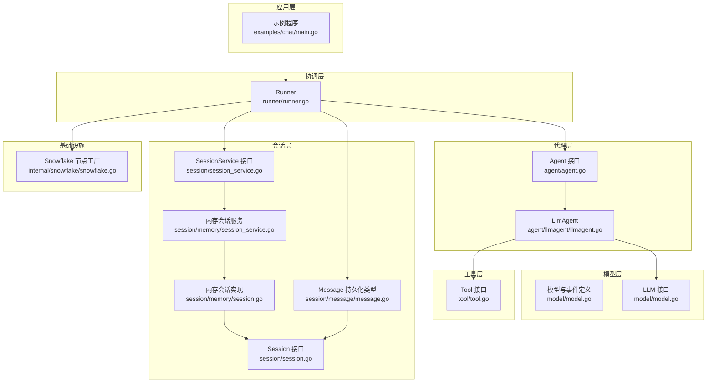
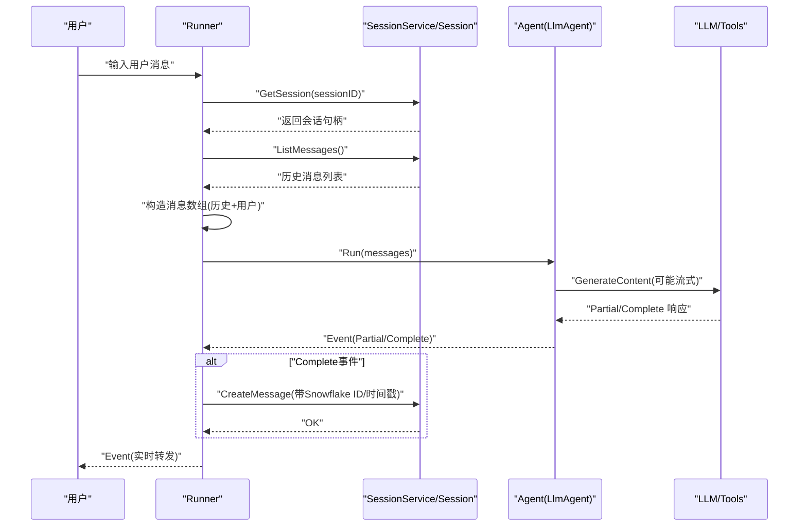
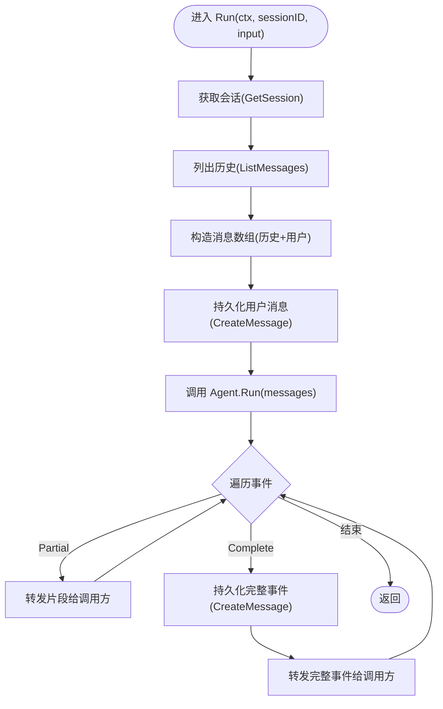
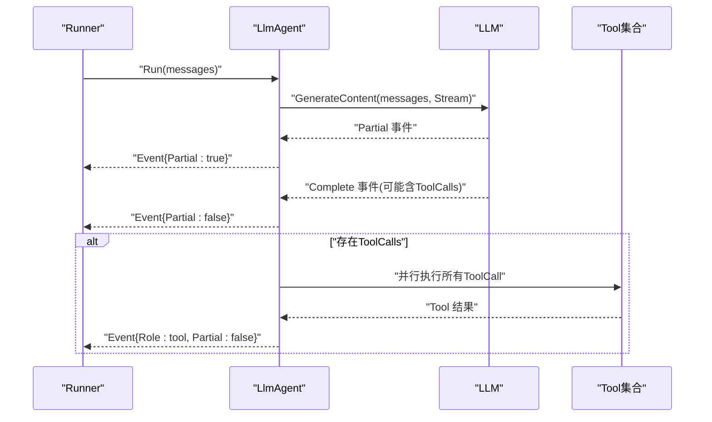
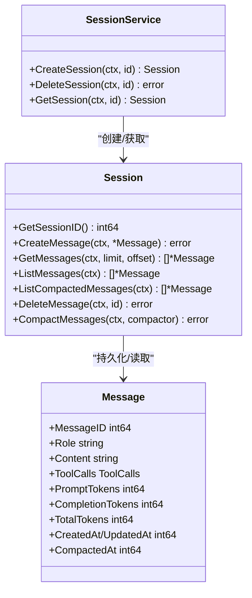
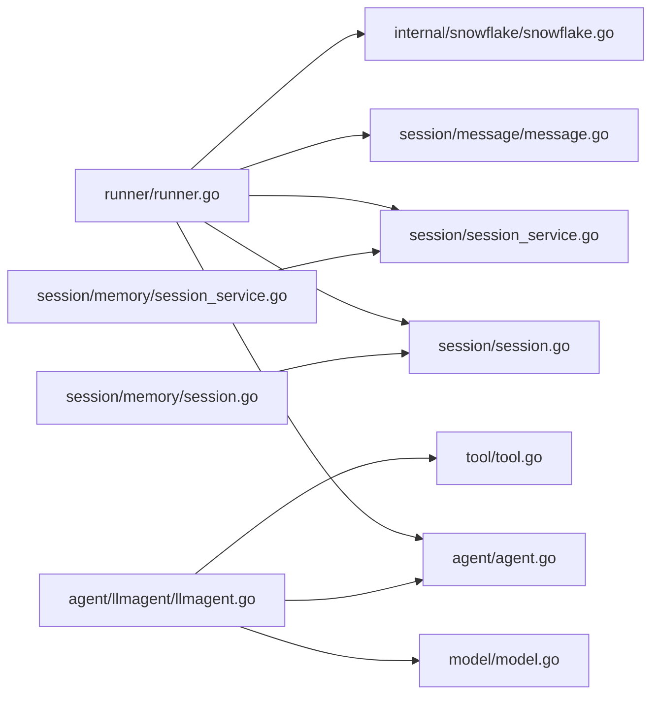

# 运行器协调

<cite>
**本文引用的文件列表**
- [runner.go](file://runner/runner.go)
- [session_service.go](file://session/session_service.go)
- [session.go](file://session/session.go)
- [message.go](file://session/message/message.go)
- [agent.go](file://agent/agent.go)
- [llmagent.go](file://agent/llmagent/llmagent.go)
- [tool.go](file://tool/tool.go)
- [model.go](file://model/model.go)
- [snowflake.go](file://internal/snowflake/snowflake.go)
- [main.go](file://examples/chat/main.go)
- [session_service.go（内存）](file://session/memory/session_service.go)
- [session.go（内存）](file://session/memory/session.go)
- [runner_test.go](file://runner/runner_test.go)
- [README.md](file://README.md)
</cite>

## 目录
1. [简介](#简介)
2. [项目结构](#项目结构)
3. [核心组件](#核心组件)
4. [架构总览](#架构总览)
5. [详细组件分析](#详细组件分析)
6. [依赖关系分析](#依赖关系分析)
7. [性能与并发](#性能与并发)
8. [错误处理与异常恢复](#错误处理与异常恢复)
9. [使用示例与集成模式](#使用示例与集成模式)
10. [结论](#结论)

## 简介
本文件系统性阐述ADK框架中的“运行器协调器”（Runner），说明其如何将“代理”（Agent）、“会话服务”（SessionService）与“工具系统”（Tool）整合为一个可扩展、可流式的AI代理应用。重点覆盖：
- Runner的核心职责：消息加载、持久化与代理驱动
- 消息持久化流程：每轮对话如何正确保存与更新会话历史
- 流式处理实现：Go迭代器如何支持实时输出与增量响应
- 错误处理策略与异常恢复机制
- 配置与优化建议：并发、资源管理与性能监控
- 完整使用示例与集成模式

## 项目结构
ADK采用分层与接口解耦的设计，Runner位于顶层协调层，向上对接Agent，向下对接SessionService与Message持久化，同时通过模型与工具接口与LLM与外部工具桥接。

图表来源
- [runner.go:17-37](file://runner/runner.go#L17-L37)
- [agent.go:10-19](file://agent/agent.go#L10-L19)
- [llmagent.go:30-46](file://agent/llmagent/llmagent.go#L30-L46)
- [model.go:10-18](file://model/model.go#L10-L18)
- [tool.go:17-24](file://tool/tool.go#L17-L24)
- [session_service.go:5-9](file://session/session_service.go#L5-L9)
- [session.go:9-23](file://session/session.go#L9-L23)
- [message.go:49-73](file://session/message/message.go#L49-L73)
- [session_service.go（内存）:14-22](file://session/memory/session_service.go#L14-L22)
- [session.go（内存）:18-24](file://session/memory/session.go#L18-L24)
- [snowflake.go:17-57](file://internal/snowflake/snowflake.go#L17-L57)

章节来源
- [README.md:37-64](file://README.md#L37-L64)

## 核心组件
- Runner：状态化协调器，负责加载会话历史、追加用户输入、调用Agent并按需持久化事件；仅在完整事件（Partial=false）时写入会话。
- Agent：无状态接口，面向消息序列产生事件（Event），支持流式片段与完整消息。
- LlmAgent：基于LLM的无状态代理，自动驱动工具调用循环，支持流式输出。
- SessionService/Session：会话服务与会话接口，抽象消息的增删查与归档。
- Message：持久化消息结构，含工具调用、令牌用量、时间戳等字段。
- Tool：工具接口，定义工具元数据与执行方法。
- Snowflake：分布式自增ID生成，用于消息唯一标识。

章节来源
- [runner.go:17-37](file://runner/runner.go#L17-L37)
- [agent.go:10-19](file://agent/agent.go#L10-L19)
- [llmagent.go:30-46](file://agent/llmagent/llmagent.go#L30-L46)
- [session_service.go:5-9](file://session/session_service.go#L5-L9)
- [session.go:9-23](file://session/session.go#L9-L23)
- [message.go:49-73](file://session/message/message.go#L49-L73)
- [tool.go:17-24](file://tool/tool.go#L17-L24)
- [snowflake.go:17-57](file://internal/snowflake/snowflake.go#L17-L57)

## 架构总览
Runner作为“有状态”的协调者，贯穿一次用户回合的完整生命周期：加载历史→追加用户输入→调用Agent→转发事件→按需持久化。Agent保持无状态，仅消费传入的消息并产出事件；SessionService屏蔽具体存储实现。

图表来源
- [runner.go:45-96](file://runner/runner.go#L45-L96)
- [session.go:12-17](file://session/session.go#L12-L17)
- [llmagent.go:78-135](file://agent/llmagent/llmagent.go#L78-L135)
- [model.go:214-226](file://model/model.go#L214-L226)

## 详细组件分析

### Runner：消息加载、持久化与代理驱动
- 职责
  - 加载会话历史并拼接当前用户输入
  - 将完整事件（Partial=false）持久化到会话
  - 将流式片段（Partial=true）直接向前转发，不持久化
  - 使用Snowflake生成消息ID与时间戳
- 关键流程
  - 获取会话与历史消息
  - 追加用户消息并立即持久化
  - 调用Agent.Run并逐个事件处理
  - 对Complete事件进行持久化
- 并发与流式
  - 通过Go迭代器逐个事件返回，支持消费者提前退出
  - 不在Runner内并发，由Agent内部自行控制（如LlmAgent的工具并行）

图表来源
- [runner.go:45-96](file://runner/runner.go#L45-L96)
- [runner.go:98-107](file://runner/runner.go#L98-L107)

章节来源
- [runner.go:17-37](file://runner/runner.go#L17-L37)
- [runner.go:45-96](file://runner/runner.go#L45-L96)
- [runner.go:98-107](file://runner/runner.go#L98-L107)

### Agent与LlmAgent：事件产生与工具调用循环
- Agent接口
  - Run返回iter.Seq2[*model.Event, error]，支持流式与完整消息
- LlmAgent
  - 自动在每次生成后检查FinishReason
  - 若为工具调用，收集ToolCalls并并行执行，再将结果作为Tool消息追加回请求
  - 支持Stream=true时，先产出Partial事件，再产出Complete事件
- 并发策略
  - 工具调用使用WaitGroup并行执行，保证顺序与完整性

图表来源
- [agent.go:10-19](file://agent/agent.go#L10-L19)
- [llmagent.go:56-135](file://agent/llmagent/llmagent.go#L56-L135)
- [model.go:214-226](file://model/model.go#L214-L226)

章节来源
- [agent.go:10-19](file://agent/agent.go#L10-L19)
- [llmagent.go:56-135](file://agent/llmagent/llmagent.go#L56-L135)

### 会话与消息持久化：流程与约束
- Session接口
  - CreateMessage/DeleteMessage/ListMessages/ListCompactedMessages/GetMessages/CompactMessages
- Message持久化
  - FromModel/ToModel完成模型消息与持久化消息的双向转换
  - 包含工具调用、令牌用量、时间戳、软归档标记等
- Runner持久化策略
  - 用户消息与完整事件均持久化
  - 流式片段不持久化，仅转发
  - 使用Snowflake分配MessageID，设置CreatedAt/UpdatedAt

图表来源
- [session_service.go:5-9](file://session/session_service.go#L5-L9)
- [session.go:9-23](file://session/session.go#L9-L23)
- [message.go:49-73](file://session/message/message.go#L49-L73)

章节来源
- [session.go:9-23](file://session/session.go#L9-L23)
- [message.go:49-129](file://session/message/message.go#L49-L129)
- [runner.go:98-107](file://runner/runner.go#L98-L107)

### 工具系统：定义与执行
- Tool接口
  - Definition()返回名称、描述与JSON Schema
  - Run(ctx, toolCallID, arguments)返回字符串结果
- Runner与Agent的关系
  - Runner不直接调用Tool，而是由Agent在工具调用循环中执行
  - Runner只负责持久化Tool消息与转发事件

章节来源
- [tool.go:17-24](file://tool/tool.go#L17-L24)
- [llmagent.go:138-159](file://agent/llmagent/llmagent.go#L138-L159)

### 示例程序：端到端聊天应用
- 组成
  - OpenAI LLM适配器
  - Exa MCP工具集（通过SDK连接）
  - LlmAgent（开启流式）
  - 内存会话服务与Runner
  - 控制台交互循环
- 行为
  - 用户输入经Runner追加并持久化
  - Agent流式输出片段实时打印
  - 完整事件到达后，Runner将其持久化

章节来源
- [main.go:52-177](file://examples/chat/main.go#L52-L177)

## 依赖关系分析
- Runner依赖
  - agent.Agent：抽象代理接口
  - session.SessionService/session.Session：抽象会话接口
  - session/message.Message：持久化消息类型
  - internal/snowflake：分布式ID生成
- Agent依赖
  - model.LLM：LLM接口
  - tool.Tool：工具接口
- Session实现
  - 内存实现：NewMemorySessionService/NewMemorySession
  - 数据库实现：数据库包（未在本节展开）

图表来源
- [runner.go:10-15](file://runner/runner.go#L10-L15)
- [llmagent.go:9-12](file://agent/llmagent/llmagent.go#L9-L12)
- [session_service.go（内存）:14-22](file://session/memory/session_service.go#L14-L22)
- [session.go（内存）:18-24](file://session/memory/session.go#L18-L24)

章节来源
- [runner.go:10-15](file://runner/runner.go#L10-L15)
- [llmagent.go:9-12](file://agent/llmagent/llmagent.go#L9-L12)

## 性能与并发
- 流式输出
  - Runner通过Go迭代器逐事件返回，避免一次性缓冲完整响应，降低延迟与内存占用
- 工具调用并发
  - LlmAgent对多个ToolCall使用WaitGroup并行执行，提升吞吐
- 会话存储
  - 内存实现适合单进程与测试；生产环境建议使用数据库后端以支持持久化与跨进程共享
- ID生成
  - Snowflake节点基于网络地址生成，具备分布式唯一性与时序性

章节来源
- [runner.go:45-96](file://runner/runner.go#L45-L96)
- [llmagent.go:116-126](file://agent/llmagent/llmagent.go#L116-L126)
- [snowflake.go:17-57](file://internal/snowflake/snowflake.go#L17-L57)

## 错误处理与异常恢复
- 错误传播
  - Runner在获取会话、读取历史、持久化用户消息或完整事件时，任何一步失败都会将错误返回给调用方
  - Agent内部错误也会通过迭代器返回，Runner不再继续持久化
- 异常恢复
  - Runner不对Agent抛出的错误进行重试；调用方可在上层捕获错误并决定是否重试
  - 会话服务返回nil时（如内存实现），Runner会将错误透传，避免空指针访问
- 测试覆盖
  - 单测验证了GetSession错误、Agent错误、早停、无Agent消息、流式片段不持久化等场景

章节来源
- [runner.go:47-58](file://runner/runner.go#L47-L58)
- [runner.go:70-73](file://runner/runner.go#L70-L73)
- [runner.go:78-82](file://runner/runner.go#L78-L82)
- [runner_test.go:213-231](file://runner/runner_test.go#L213-L231)
- [runner_test.go:233-243](file://runner/runner_test.go#L233-L243)
- [runner_test.go:245-268](file://runner/runner_test.go#L245-L268)
- [runner_test.go:334-356](file://runner/runner_test.go#L334-L356)

## 使用示例与集成模式
- 快速开始（来自README）
  - 创建LLM适配器（OpenAI/Gemini/Anthropic）
  - 构建Agent（LlmAgent）
  - 选择会话后端（内存/数据库）
  - 创建Runner并循环调用Run
- 示例程序（examples/chat/main.go）
  - 使用OpenAI与Exa MCP工具
  - 开启流式输出
  - 控制台交互循环，实时打印Partial事件
- 集成模式
  - 代理组合：Sequential/Parallel
  - Agent作为Tool：将子Agent暴露为工具供其他Agent调用
  - 多模态输入：通过Message.Parts传递文本与图片

章节来源
- [README.md:92-186](file://README.md#L92-L186)
- [main.go:52-177](file://examples/chat/main.go#L52-L177)

## 结论
Runner作为ADK的协调中枢，实现了“有状态会话”与“无状态代理”的清晰分离：前者负责历史与持久化，后者专注推理与工具调用。通过Go迭代器实现的流式输出，Runner在保证实时性的前提下，将完整消息可靠地写入会话，形成可追溯、可扩展的AI代理应用骨架。配合工具系统与多模态能力，开发者可以快速搭建从简单问答到复杂任务编排的智能体。