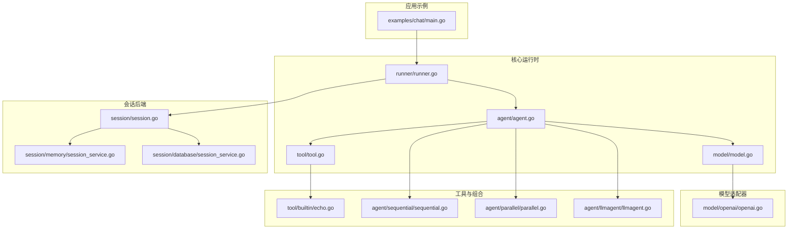
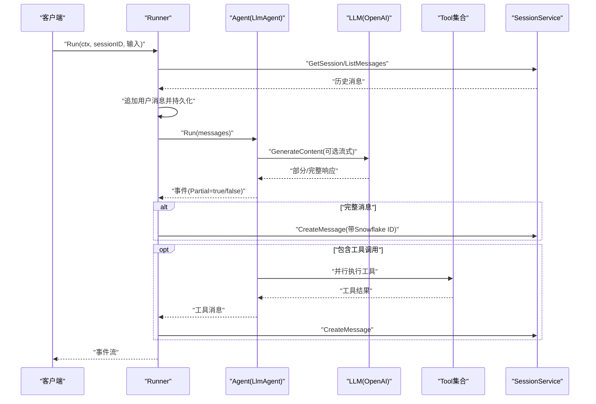
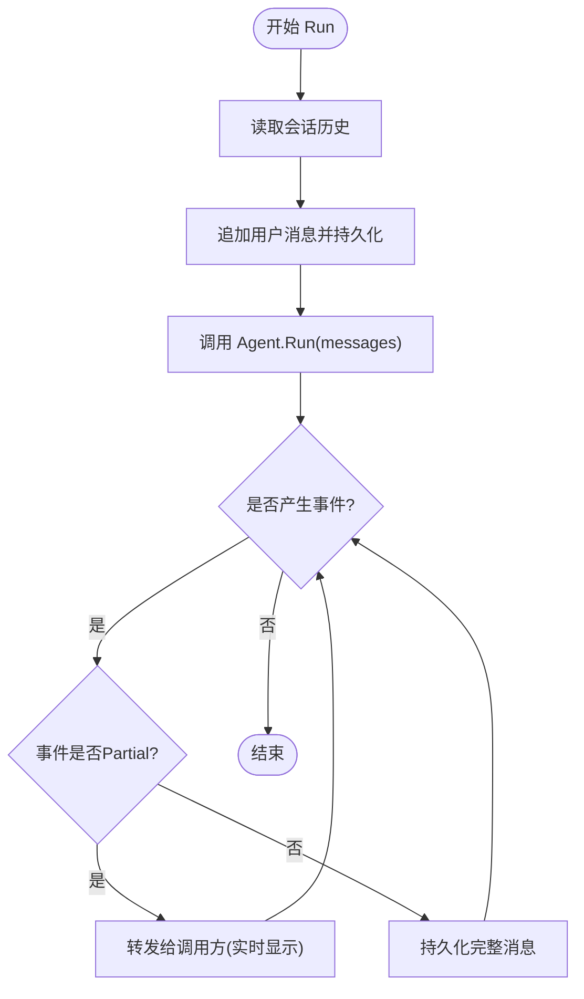
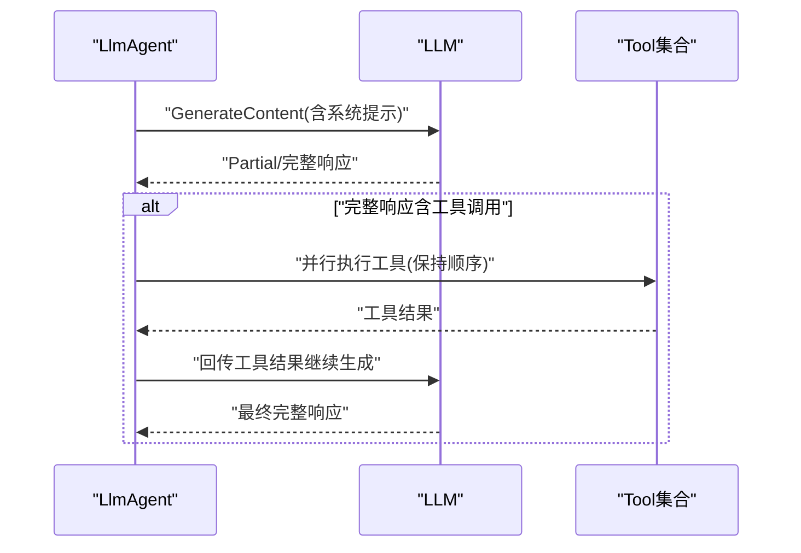
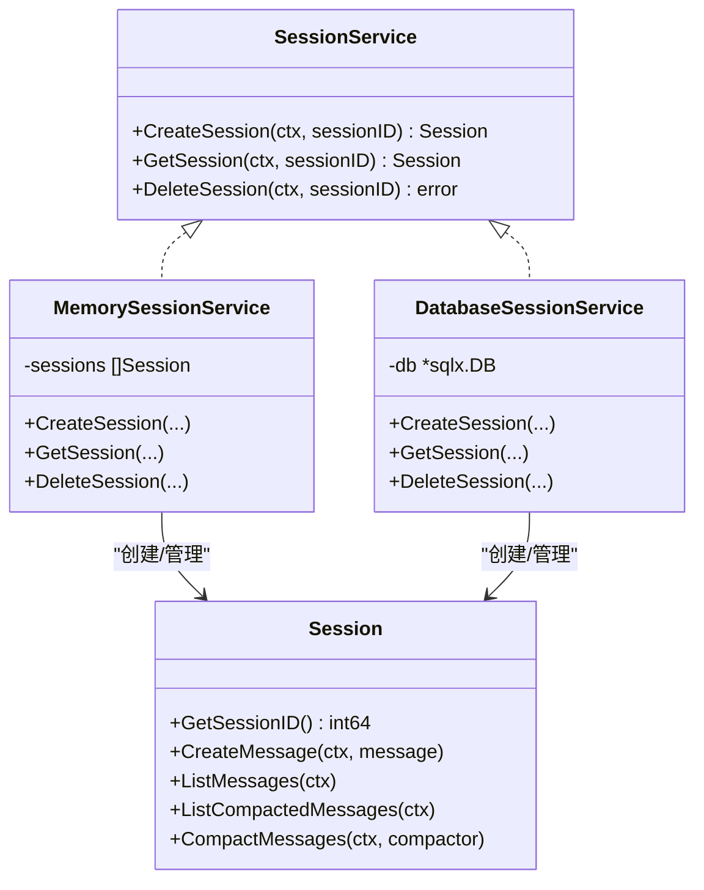
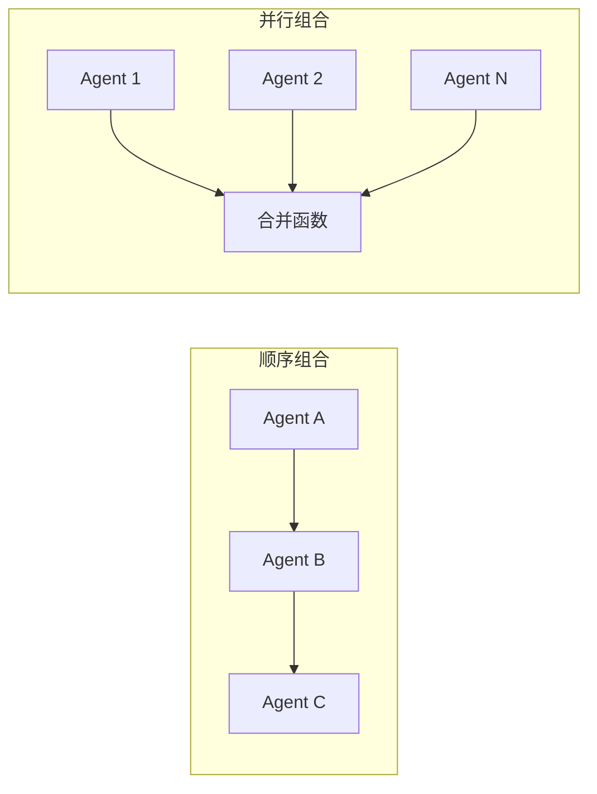
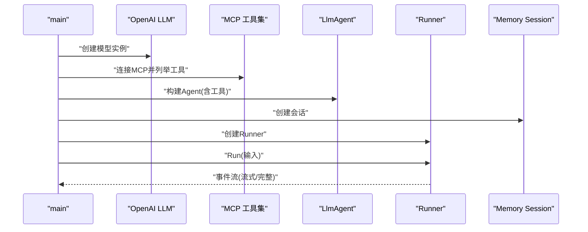
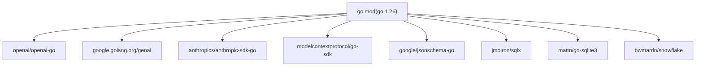

# 部署与集成

<cite>
**本文引用的文件**
- [README.md](file://README.md)
- [go.mod](file://go.mod)
- [examples/chat/main.go](file://examples/chat/main.go)
- [agent/agent.go](file://agent/agent.go)
- [model/model.go](file://model/model.go)
- [runner/runner.go](file://runner/runner.go)
- [session/session.go](file://session/session.go)
- [session/memory/session_service.go](file://session/memory/session_service.go)
- [session/database/session_service.go](file://session/database/session_service.go)
- [tool/tool.go](file://tool/tool.go)
- [tool/builtin/echo.go](file://tool/builtin/echo.go)
- [agent/llmagent/llmagent.go](file://agent/llmagent/llmagent.go)
- [agent/sequential/sequential.go](file://agent/sequential/sequential.go)
- [agent/parallel/parallel.go](file://agent/parallel/parallel.go)
- [internal/snowflake/snowflake.go](file://internal/snowflake/snowflake.go)
- [model/openai/openai.go](file://model/openai/openai.go)
</cite>

## 目录
1. [简介](#简介)
2. [项目结构](#项目结构)
3. [核心组件](#核心组件)
4. [架构总览](#架构总览)
5. [详细组件分析](#详细组件分析)
6. [依赖关系分析](#依赖关系分析)
7. [性能考量](#性能考量)
8. [故障排查指南](#故障排查指南)
9. [结论](#结论)
10. [附录](#附录)

## 简介
本指南面向希望将ADK（Agent Development Kit）框架集成到生产环境的开发者与运维团队。内容覆盖：
- 生产部署的Go版本兼容性与依赖管理
- API集成策略与现有应用对接方式
- 性能优化建议（并发、缓存、资源管理）
- 监控与日志记录最佳实践
- 安全考虑与防护措施
- 容器化与云平台集成方案

## 项目结构
ADK采用按职责分层的模块化组织方式：抽象接口位于顶层包，具体实现分布在适配器与后端模块中；示例程序演示了从LLM接入、工具集成到会话持久化的完整链路。

图表来源
- [examples/chat/main.go:1-181](file://examples/chat/main.go#L1-L181)
- [runner/runner.go:1-108](file://runner/runner.go#L1-L108)
- [agent/agent.go:1-20](file://agent/agent.go#L1-L20)
- [model/model.go:1-227](file://model/model.go#L1-L227)
- [tool/tool.go:1-24](file://tool/tool.go#L1-L24)
- [session/session.go:1-24](file://session/session.go#L1-L24)
- [session/memory/session_service.go:1-41](file://session/memory/session_service.go#L1-L41)
- [session/database/session_service.go:1-49](file://session/database/session_service.go#L1-L49)
- [tool/builtin/echo.go:1-47](file://tool/builtin/echo.go#L1-L47)
- [agent/sequential/sequential.go:1-93](file://agent/sequential/sequential.go#L1-L93)
- [agent/parallel/parallel.go:1-175](file://agent/parallel/parallel.go#L1-L175)
- [agent/llmagent/llmagent.go:1-159](file://agent/llmagent/llmagent.go#L1-L159)
- [model/openai/openai.go:1-362](file://model/openai/openai.go#L1-L362)

章节来源
- [README.md:67-90](file://README.md#L67-L90)
- [go.mod:1-47](file://go.mod#L1-L47)

## 核心组件
- Agent接口：定义统一的执行契约，返回事件迭代器，支持流式增量输出与完整消息持久化。
- LLM接口：屏蔽供应商差异，统一请求/响应与流式协议。
- Session接口：会话生命周期管理与消息持久化，支持软归档与分页查询。
- Tool接口：工具元数据与调用协议，配合JSON Schema描述输入参数。
- Runner：协调Agent与SessionService，负责消息注入、事件转发与持久化。
- 组合Agent：顺序与并行组合器，支持多Agent流水线与并行聚合。

章节来源
- [agent/agent.go:10-19](file://agent/agent.go#L10-L19)
- [model/model.go:10-227](file://model/model.go#L10-L227)
- [session/session.go:9-23](file://session/session.go#L9-L23)
- [tool/tool.go:9-23](file://tool/tool.go#L9-L23)
- [runner/runner.go:17-108](file://runner/runner.go#L17-L108)
- [agent/sequential/sequential.go:11-93](file://agent/sequential/sequential.go#L11-L93)
- [agent/parallel/parallel.go:29-175](file://agent/parallel/parallel.go#L29-L175)

## 架构总览
ADK采用“无状态Agent + 有状态Runner”的分层设计：Runner加载历史、注入用户输入、驱动Agent生成回复，并仅在完整消息时持久化；Agent通过LLM接口与工具集合完成一次对话轮次，必要时自动进入工具调用循环。

图表来源
- [runner/runner.go:39-96](file://runner/runner.go#L39-L96)
- [agent/llmagent/llmagent.go:56-136](file://agent/llmagent/llmagent.go#L56-L136)
- [model/openai/openai.go:44-164](file://model/openai/openai.go#L44-L164)
- [tool/builtin/echo.go:36-46](file://tool/builtin/echo.go#L36-L46)
- [session/memory/session_service.go:18-40](file://session/memory/session_service.go#L18-L40)

## 详细组件分析

### Runner与消息持久化
- 责任边界清晰：Runner只负责消息编排与持久化，不持有业务状态。
- 消息注入：每次用户输入被转换为消息并写入会话。
- 完整消息才持久化：Partial事件用于实时显示，非Partial才落盘。
- 分布式ID：使用Snowflake节点生成全局唯一ID，时间有序且跨节点无冲突。

图表来源
- [runner/runner.go:45-96](file://runner/runner.go#L45-L96)
- [internal/snowflake/snowflake.go:17-57](file://internal/snowflake/snowflake.go#L17-L57)

章节来源
- [runner/runner.go:17-108](file://runner/runner.go#L17-L108)
- [internal/snowflake/snowflake.go:1-66](file://internal/snowflake/snowflake.go#L1-L66)

### LlmAgent与工具调用循环
- 系统提示前置：每次Run前将Instruction作为system消息注入。
- 流式生成：当启用流式时，先产出Partial事件，再产出完整事件。
- 工具调用：若FinishReason为工具调用，则并行执行所有工具，顺序保持与原始响应一致，随后将工具结果回填至消息历史继续推理直至停止。

图表来源
- [agent/llmagent/llmagent.go:56-136](file://agent/llmagent/llmagent.go#L56-L136)
- [tool/tool.go:17-23](file://tool/tool.go#L17-L23)

章节来源
- [agent/llmagent/llmagent.go:14-159](file://agent/llmagent/llmagent.go#L14-L159)

### 会话后端（内存与数据库）
- 内存后端：适合单进程或测试场景，无需外部存储。
- 数据库后端：基于SQLite，支持会话删除、消息列表与软归档（压缩历史）。

图表来源
- [session/session.go:9-23](file://session/session.go#L9-L23)
- [session/memory/session_service.go:14-40](file://session/memory/session_service.go#L14-L40)
- [session/database/session_service.go:23-48](file://session/database/session_service.go#L23-L48)

章节来源
- [session/session.go:1-24](file://session/session.go#L1-L24)
- [session/memory/session_service.go:1-41](file://session/memory/session_service.go#L1-L41)
- [session/database/session_service.go:1-49](file://session/database/session_service.go#L1-L49)

### 组合Agent（顺序与并行）
- 顺序组合：上游Agent的完整消息作为下游Agent的输入，注入手过户消息以维持对话格式。
- 并行组合：子Agent共享相同输入并独立运行，完成后按合并函数汇总为单一完整消息；任一子Agent出错即取消其余任务。

图表来源
- [agent/sequential/sequential.go:46-92](file://agent/sequential/sequential.go#L46-L92)
- [agent/parallel/parallel.go:112-174](file://agent/parallel/parallel.go#L112-L174)

章节来源
- [agent/sequential/sequential.go:1-93](file://agent/sequential/sequential.go#L1-L93)
- [agent/parallel/parallel.go:1-175](file://agent/parallel/parallel.go#L1-L175)

### 示例：聊天应用集成
示例展示了如何：
- 初始化OpenAI LLM
- 连接MCP工具集合并注入到Agent
- 使用内存会话服务进行交互
- 处理流式输出与工具调用

图表来源
- [examples/chat/main.go:52-177](file://examples/chat/main.go#L52-L177)
- [model/openai/openai.go:25-42](file://model/openai/openai.go#L25-L42)
- [tool/builtin/echo.go:22-34](file://tool/builtin/echo.go#L22-L34)

章节来源
- [examples/chat/main.go:1-181](file://examples/chat/main.go#L1-L181)

## 依赖关系分析
- Go版本：模块声明使用Go 1.26。
- 第三方依赖：OpenAI、Gemini、Anthropic SDK，MCP客户端，JSON Schema，SQLite与SQLx，Snowflake等。
- 间接依赖：大量云与网络相关库，需关注合规与供应链安全。

图表来源
- [go.mod:3-15](file://go.mod#L3-L15)

章节来源
- [go.mod:1-47](file://go.mod#L1-L47)
- [README.md:380-393](file://README.md#L380-L393)

## 性能考量
- 并发与调度
  - 并行组合器对子Agent采用goroutine并发执行，错误时通过上下文取消快速终止其他任务，避免资源浪费。
  - 工具调用采用并行执行，保持原始顺序，减少整体等待时间。
- 流式输出
  - LLM适配器支持流式响应，Runner仅在完整消息时持久化，降低I/O压力。
- 缓存策略
  - 建议在应用层对频繁访问的工具结果与会话片段进行缓存（如LRU），注意缓存键应包含会话ID与工具参数哈希。
- 资源管理
  - 控制并发度上限（如限制并行组合器的子Agent数量），避免过度占用CPU与内存。
  - 合理设置生成配置（温度、最大令牌数、推理努力级别）以平衡质量与成本。
- 会话压缩
  - 利用软归档机制定期压缩历史消息，降低查询与序列化开销。

章节来源
- [agent/parallel/parallel.go:112-174](file://agent/parallel/parallel.go#L112-L174)
- [agent/llmagent/llmagent.go:116-134](file://agent/llmagent/llmagent.go#L116-L134)
- [model/openai/openai.go:88-164](file://model/openai/openai.go#L88-L164)
- [session/session.go:18-23](file://session/session.go#L18-L23)

## 故障排查指南
- 环境变量与密钥
  - 示例程序要求OpenAI API Key；如使用兼容端点，需设置基础URL与模型名称。
- 连接问题
  - MCP工具集连接失败时检查端点与鉴权头；示例中通过自定义RoundTripper注入API Key。
- 错误传播
  - Runner在加载会话、持久化消息或Agent执行期间遇到错误会直接返回；调用方应在事件循环中及时处理。
- 日志与可观测性
  - 在Runner与Agent之间插入结构化日志（请求ID、会话ID、消息ID、阶段、耗时、错误码），便于定位问题。
- 超时与重试
  - 对LLM调用设置合理超时；对瞬时错误可采用指数退避重试，但需避免无限重试导致级联故障。

章节来源
- [examples/chat/main.go:55-98](file://examples/chat/main.go#L55-L98)
- [runner/runner.go:47-96](file://runner/runner.go#L47-L96)
- [agent/llmagent/llmagent.go:78-94](file://agent/llmagent/llmagent.go#L78-L94)

## 结论
ADK通过清晰的接口分层与可插拔的适配器，提供了生产就绪的AI代理开发能力。结合合理的并发控制、缓存与会话压缩策略，可在保证性能的同时提升稳定性。建议在生产环境中完善监控与日志体系，并严格遵循安全与合规要求。

## 附录

### 生产部署要求
- Go版本：使用Go 1.26及以上版本。
- 依赖管理：使用模块化依赖，确保第三方SDK版本与供应商API兼容。
- 会话存储：生产推荐SQLite后端，具备持久化与软归档能力；测试/单进程可用内存后端。
- 并发与资源：根据实例规格与SLA设定并发上限，避免过载。

章节来源
- [README.md:10](file://README.md#L10)
- [go.mod:3](file://go.mod#L3)
- [session/database/session_service.go:23-48](file://session/database/session_service.go#L23-L48)
- [session/memory/session_service.go:14-40](file://session/memory/session_service.go#L14-L40)

### API集成策略
- 适配器选择：根据供应商切换LLM适配器（OpenAI/Gemini/Anthropic），保持Agent与Runner不变。
- 工具集成：通过MCP或内置工具扩展Agent能力；使用JSON Schema定义工具输入，确保LLM正确调用。
- 事件流：利用Partial事件实现实时输出，完整事件用于持久化与后续处理。

章节来源
- [model/openai/openai.go:25-42](file://model/openai/openai.go#L25-L42)
- [tool/builtin/echo.go:22-34](file://tool/builtin/echo.go#L22-L34)
- [agent/llmagent/llmagent.go:24-27](file://agent/llmagent/llmagent.go#L24-L27)

### 监控与日志最佳实践
- 关键指标：请求QPS、P95/P99延迟、错误率、令牌用量、会话活跃度、工具调用成功率。
- 日志结构：包含traceID、spanID、会话ID、消息ID、阶段（加载/生成/持久化）、耗时、错误详情。
- 告警阈值：针对延迟突增、错误率上升、令牌用量异常设置分级告警。

[本节为通用指导，无需特定文件引用]

### 安全考虑与防护
- 凭据管理：通过环境变量或密钥管理服务注入API Key，避免硬编码。
- 网络安全：限制MCP端点访问范围，启用TLS与最小权限网络策略。
- 输入校验：对用户输入与工具参数进行长度与格式校验，防止注入与滥用。
- 审计日志：记录关键操作（会话创建/删除、工具调用、消息归档）以便审计。

[本节为通用指导，无需特定文件引用]

### 容器化与云平台集成
- 容器镜像：基于精简基础镜像构建，开启只读根文件系统与最小权限。
- 配置注入：通过环境变量与配置卷注入API Key与模型参数。
- 可观测性：在容器内采集结构化日志与指标，对接云厂商日志与监控服务。
- 弹性伸缩：根据流量与延迟动态扩缩容，结合会话后端的高可用部署。

[本节为通用指导，无需特定文件引用]