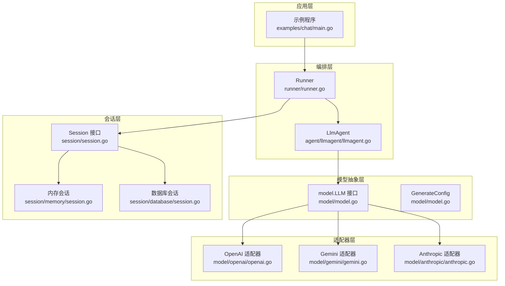
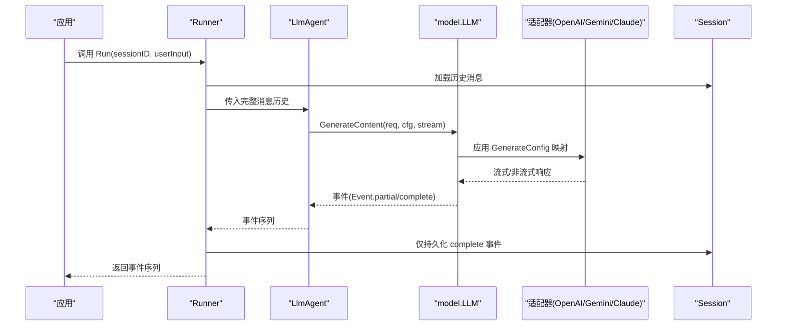
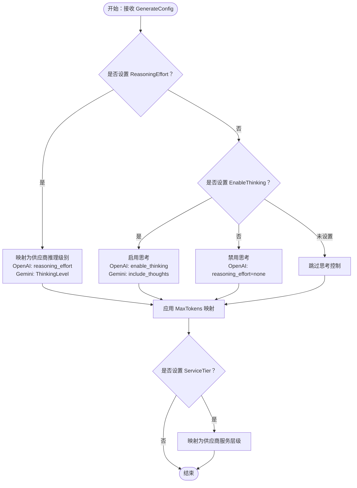
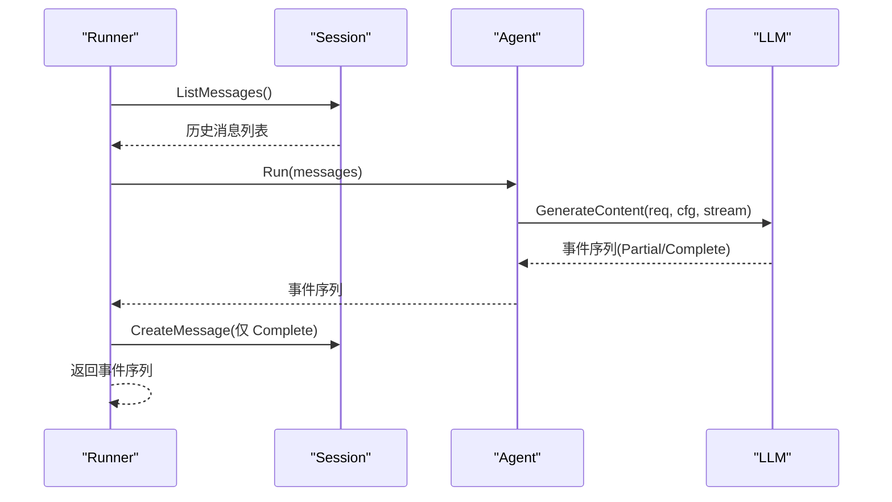
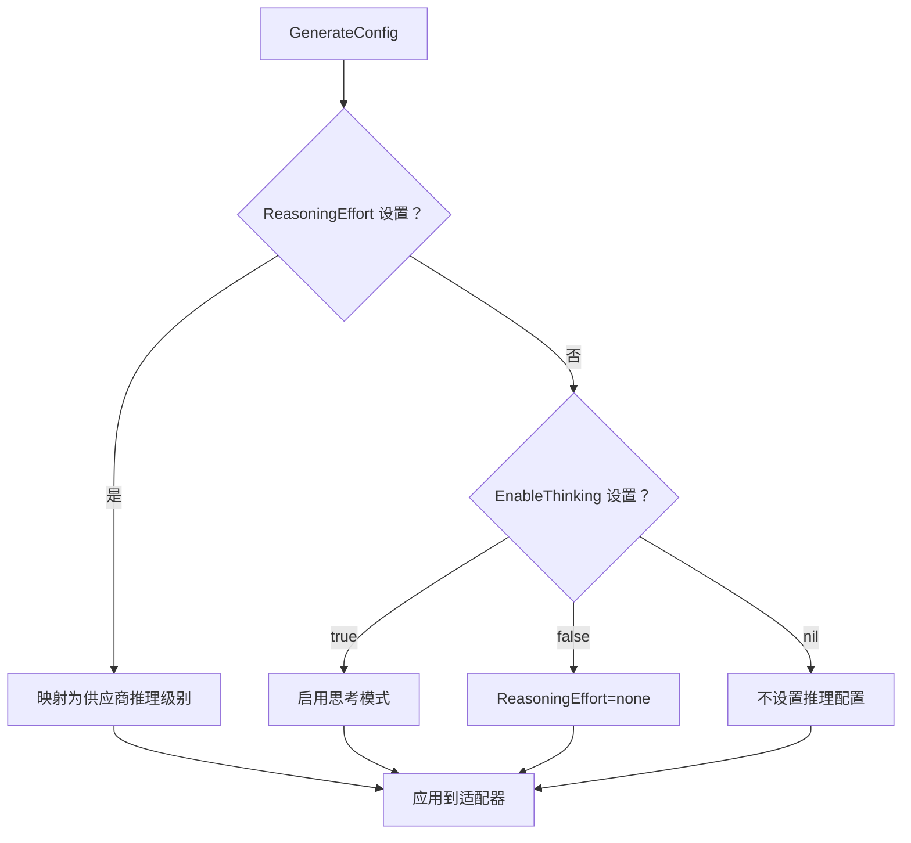
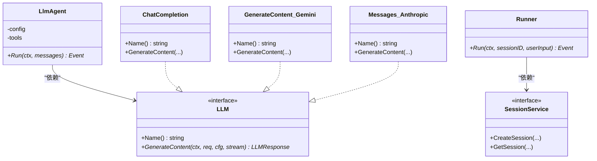

# 配置管理

<cite>
**本文引用的文件**
- [README.md](file://README.md)
- [model.go](file://model/model.go)
- [openai.go](file://model/openai/openai.go)
- [gemini.go](file://model/gemini/gemini.go)
- [anthropic.go](file://model/anthropic/anthropic.go)
- [llmagent.go](file://agent/llmagent/llmagent.go)
- [runner.go](file://runner/runner.go)
- [session.go](file://session/session.go)
- [memory/session.go](file://session/memory/session.go)
- [database/session.go](file://session/database/session.go)
- [main.go](file://examples/chat/main.go)
- [openai_test.go](file://model/openai/openai_test.go)
- [llmagent_test.go](file://agent/llmagent/llmagent_test.go)
</cite>

## 更新摘要
**所做更改**
- 新增完整的配置类型定义和默认值说明
- 补充配置验证规则和约束条件
- 完善推理努力和思维预算的配置机制
- 增加服务层级配置的详细说明
- 补充会话配置选项的完整文档

## 目录
1. [简介](#简介)
2. [项目结构](#项目结构)
3. [核心组件](#核心组件)
4. [架构总览](#架构总览)
5. [详细组件分析](#详细组件分析)
6. [配置类型与默认值](#配置类型与默认值)
7. [配置验证与约束](#配置验证与约束)
8. [依赖关系分析](#依赖关系分析)
9. [性能考量](#性能考量)
10. [故障排查指南](#故障排查指南)
11. [结论](#结论)
12. [附录](#附录)

## 简介
本章节系统性介绍 ADK 框架的配置管理系统，重点覆盖以下方面：
- 生成配置选项：温度、最大令牌数、推理努力与思维预算、服务层级等核心参数的作用与调优策略
- 推理与思维预算：在不同供应商适配器中的映射与行为差异
- 服务层级：不同供应商对"服务层级"的支持与差异
- 会话配置：消息历史长度、压缩策略、存储参数与软归档机制
- 配置类型定义：完整的数据结构、默认值和验证规则
- 最佳实践：性能调优、成本控制与用户体验优化
- 完整示例与常见问题：帮助开发者按需定制参数

## 项目结构
ADK 将"模型抽象""适配器实现""代理编排""会话存储""运行器"清晰分层，配置管理贯穿于模型接口、适配器与代理配置中。



**图表来源**
- [runner.go:17-44](file://runner/runner.go#L17-L44)
- [llmagent.go:56-76](file://agent/llmagent/llmagent.go#L56-L76)
- [model.go:10-18](file://model/model.go#L10-L18)
- [openai.go:44-71](file://model/openai/openai.go#L44-L71)
- [gemini.go:66-91](file://model/gemini/gemini.go#L66-L91)
- [anthropic.go:47-93](file://model/anthropic/anthropic.go#L47-L93)
- [session.go:9-23](file://session/session.go#L9-L23)
- [memory/session.go:12-24](file://session/memory/session.go#L12-L24)
- [database/session.go:26-32](file://session/database/session.go#L26-L32)

**章节来源**
- [README.md:37-90](file://README.md#L37-L90)
- [runner.go:17-44](file://runner/runner.go#L17-L44)
- [llmagent.go:56-76](file://agent/llmagent/llmagent.go#L56-L76)
- [model.go:10-18](file://model/model.go#L10-L18)

## 核心组件
- 生成配置 GenerateConfig：统一承载温度、推理努力、服务层级、最大令牌数、思维预算与思维开关等参数，供所有适配器遵循。
- 适配器映射：各供应商将上述通用配置映射到其特定参数名或开关（如 enable_thinking、reasoning_effort、service_tier、max_completion_tokens 等）。
- 代理配置 LlmAgent.Config：可注入 GenerateConfig 并选择是否开启流式输出。
- 运行器 Runner：负责加载/保存会话、驱动代理、转发事件；不直接持有业务配置，但通过代理与适配器间接使用配置。
- 会话接口与实现：Session 接口定义了消息读取、列表、压缩与归档能力；内存与数据库两种后端均支持软归档。

**章节来源**
- [model.go:67-84](file://model/model.go#L67-L84)
- [openai.go:279-304](file://model/openai/openai.go#L279-L304)
- [gemini.go:353-384](file://model/gemini/gemini.go#L353-L384)
- [anthropic.go:242-260](file://model/anthropic/anthropic.go#L242-L260)
- [llmagent.go:14-28](file://agent/llmagent/llmagent.go#L14-L28)
- [runner.go:39-95](file://runner/runner.go#L39-L95)
- [session.go:9-23](file://session/session.go#L9-L23)

## 架构总览
下图展示了配置从应用层进入模型适配器的关键路径，以及会话在运行期的持久化流程。



**图表来源**
- [runner.go:39-95](file://runner/runner.go#L39-L95)
- [llmagent.go:78-135](file://agent/llmagent/llmagent.go#L78-L135)
- [model.go:10-18](file://model/model.go#L10-L18)
- [openai.go:44-164](file://model/openai/openai.go#L44-L164)
- [gemini.go:66-201](file://model/gemini/gemini.go#L66-L201)
- [anthropic.go:47-93](file://model/anthropic/anthropic.go#L47-L93)

## 详细组件分析

### 生成配置与参数详解
- 温度（Temperature）
  - 作用：控制采样随机性；值越低越稳定确定，越高越发散多样。
  - 适用范围：OpenAI、Gemini、Anthropic 均支持该参数映射。
- 最大令牌数（MaxTokens）
  - 作用：限制单次生成的最大输出长度；为零时由供应商决定默认上限。
  - 映射：OpenAI 使用 max_completion_tokens；Gemini 使用 MaxOutputTokens；Anthropic 使用默认上限或显式设置。
- 推理努力（ReasoningEffort）
  - 作用：指定推理强度等级（none/minimal/low/medium/high/xhigh），用于具备"思考模式"的模型。
  - 映射：OpenAI 使用 reasoning_effort；Gemini 使用 ThinkingConfig.level；Anthropic 不直接支持，使用 EnableThinking。
- 思维预算（ThinkingBudget）
  - 作用：为"思考模式"提供预算上限（以 token 计），通常与 EnableThinking 或 ReasoningEffort 共同生效。
  - 映射：OpenAI 通过 enable_thinking 与自定义 JSON 注入；Gemini 通过 ThinkingConfig.budget；Anthropic 有默认预算常量与可覆盖。
- 启用思维（EnableThinking）
  - 作用：布尔开关，强制启用或禁用内部推理/思考。
  - 映射：OpenAI 通过 enable_thinking 注入；Gemini 通过 ThinkingConfig.include_thoughts；Anthropic 通过 ThinkingConfig 或 Disabled 参数。

**章节来源**
- [model.go:44-84](file://model/model.go#L44-L84)
- [openai.go:279-304](file://model/openai/openai.go#L279-L304)
- [gemini.go:353-384](file://model/gemini/gemini.go#L353-L384)
- [anthropic.go:242-260](file://model/anthropic/anthropic.go#L242-L260)

### 适配器中的配置映射与行为
- OpenAI
  - 支持 reasoning_effort、enable_thinking（通过 JSON 注入）、service_tier、max_completion_tokens。
  - 当 ReasoningEffort 未设置且 EnableThinking=false 时，自动映射为 none。
- Gemini
  - 支持 ReasoningEffort 映射为 ThinkingLevel，或通过 EnableThinking 控制 include_thoughts。
  - ThinkingBudget 可映射为 ThinkingConfig 的预算字段。
- Anthropic
  - 不直接支持 ReasoningEffort；通过 EnableThinking 控制思考模式。
  - 提供默认思维预算常量，可通过 ThinkingBudget 覆盖。



**图表来源**
- [openai.go:279-304](file://model/openai/openai.go#L279-L304)
- [gemini.go:353-384](file://model/gemini/gemini.go#L353-L384)
- [anthropic.go:242-260](file://model/anthropic/anthropic.go#L242-L260)

**章节来源**
- [openai.go:279-304](file://model/openai/openai.go#L279-L304)
- [gemini.go:353-384](file://model/gemini/gemini.go#L353-L384)
- [anthropic.go:242-260](file://model/anthropic/anthropic.go#L242-L260)

### 服务层级（ServiceTier）与供应商差异
- OpenAI：支持 service_tier 字段映射，用于请求路由与服务质量/优先级控制。
- Gemini：未见 ServiceTier 映射逻辑，适配器未设置对应字段。
- Anthropic：未见 ServiceTier 映射逻辑，适配器未设置对应字段。

建议：若需跨供应商的服务层级一致性，请优先在 OpenAI 上使用；在 Gemini/Anthropic 上忽略或自行处理。

**章节来源**
- [openai.go:301-303](file://model/openai/openai.go#L301-L303)
- [gemini.go:353-384](file://model/gemini/gemini.go#L353-L384)
- [anthropic.go:242-260](file://model/anthropic/anthropic.go#L242-L260)

### 会话配置与消息历史管理
- 会话接口 Session：提供创建消息、分页获取消息、列出全部活动消息、列出已归档消息、删除消息、压缩消息等能力。
- 内存后端 memory：基于切片存储，支持软归档（设置 compacted_at 时间戳）。
- 数据库后端 database：使用 SQL 存储，通过 compacted_at 区分活动与归档消息；压缩时批量更新并插入摘要消息。
- Runner 在每次对话回合中：
  - 加载历史消息并拼接用户输入
  - 仅持久化 complete 事件（Event.Partial=false）
  - 对 partial 事件进行实时显示但不落盘



**图表来源**
- [runner.go:39-95](file://runner/runner.go#L39-L95)
- [session.go:9-23](file://session/session.go#L9-L23)
- [memory/session.go:58-67](file://session/memory/session.go#L58-L67)
- [database/session.go:79-86](file://session/database/session.go#L79-L86)

**章节来源**
- [session.go:9-23](file://session/session.go#L9-L23)
- [memory/session.go:58-67](file://session/memory/session.go#L58-L67)
- [database/session.go:79-86](file://session/database/session.go#L79-L86)
- [runner.go:39-95](file://runner/runner.go#L39-L95)

### 代理配置与流式输出
- LlmAgent.Config 支持：
  - Name/Description：元信息
  - Model：LLM 实例
  - Tools：工具集合
  - Instruction：每轮前置系统提示
  - GenerateConfig：生成配置（温度、推理、服务层级、MaxTokens、思维预算、EnableThinking）
  - Stream：是否启用流式输出
- 代理在每轮中：
  - 若配置 Instruction，则前置系统消息
  - 调用 LLM.GenerateContent，按 Stream 设置决定是否流式
  - 将工具调用结果作为 complete 事件返回，并追加到历史

**章节来源**
- [llmagent.go:14-28](file://agent/llmagent/llmagent.go#L14-L28)
- [llmagent.go:56-135](file://agent/llmagent/llmagent.go#L56-L135)

### 示例与最佳实践

#### 示例：在示例程序中启用流式输出
- 示例程序通过 LlmAgent.Config.Stream=true 开启流式输出，Runner 将实时转发 partial 事件给客户端。
- 参考路径：[examples/chat/main.go:101-111](file://examples/chat/main.go#L101-L111)

**章节来源**
- [main.go:101-111](file://examples/chat/main.go#L101-L111)

#### 最佳实践清单
- 性能调优
  - 合理设置 MaxTokens，避免过长输出导致延迟与成本上升。
  - 在需要快速响应的场景降低 Temperature，提升确定性。
  - 仅在必要时开启推理/思考功能，减少额外 token 消耗。
- 成本控制
  - 使用 ReasoningEffort/EnableThinking 的最小可用级别，或关闭以节省预算。
  - 利用会话压缩（Soft Archival）降低历史消息长度，减少上下文开销。
- 用户体验优化
  - 在交互密集型任务中启用 Stream，提升感知速度。
  - 对工具调用较多的任务，保持工具定义清晰，减少往返次数。

**章节来源**
- [README.md:248-266](file://README.md#L248-L266)
- [llmagent.go:24-27](file://agent/llmagent/llmagent.go#L24-L27)
- [runner.go:76-94](file://runner/runner.go#L76-L94)

## 配置类型与默认值

### GenerateConfig 类型定义
GenerateConfig 是 ADK 框架的核心配置类型，定义了统一的生成参数：

- Temperature: float64
  - 默认值：0（表示不设置，由供应商决定）
  - 作用：控制采样随机性，0-2范围内有效
  - 供应商支持：OpenAI、Gemini、Anthropic

- ReasoningEffort: ReasoningEffort
  - 默认值：空字符串（不设置）
  - 作用：指定推理强度等级
  - 取值：none/minimal/low/medium/high/xhigh
  - 供应商支持：OpenAI、Gemini

- ServiceTier: ServiceTier
  - 默认值：空字符串（不设置）
  - 作用：服务层级控制
  - 取值：auto/default/flex/scale/priority
  - 供应商支持：OpenAI

- MaxTokens: int64
  - 默认值：0（表示不设置，使用供应商默认）
  - 作用：限制最大输出令牌数
  - 特殊值：0 表示不限制

- ThinkingBudget: int64
  - 默认值：0（表示不设置，使用供应商默认）
  - 作用：思维模式预算限制
  - 特殊值：0 表示不限制

- EnableThinking: *bool
  - 默认值：nil（表示不设置）
  - 作用：启用/禁用内部推理能力
  - 取值：true/false/nil

### 默认值与行为规则

#### OpenAI 适配器默认值
- Temperature: 1.0（当未设置时）
- MaxTokens: 4096（当未设置时）
- ReasoningEffort: none（当 EnableThinking=false 且未设置时）
- ThinkingBudget: 0（不限制）

#### Gemini 适配器默认值
- Temperature: 0.5（当未设置时）
- MaxTokens: 2048（当未设置时）
- ReasoningEffort: none（当未设置时）
- ThinkingBudget: 0（不限制）

#### Anthropic 适配器默认值
- Temperature: 1.0（当未设置时）
- MaxTokens: 4096（当未设置时）
- ReasoningEffort: 不支持（使用 EnableThinking）
- ThinkingBudget: 3000（默认值）

### 配置映射规则

#### 推理配置映射


**图表来源**
- [openai.go:289-300](file://model/openai/openai.go#L289-L300)
- [gemini.go:366-383](file://model/gemini/gemini.go#L366-L383)
- [anthropic.go:248-259](file://model/anthropic/anthropic.go#L248-L259)

**章节来源**
- [model.go:67-84](file://model/model.go#L67-L84)
- [openai.go:279-304](file://model/openai/openai.go#L279-L304)
- [gemini.go:353-384](file://model/gemini/gemini.go#L353-L384)
- [anthropic.go:242-260](file://model/anthropic/anthropic.go#L242-L260)

## 配置验证与约束

### 参数验证规则

#### 数值范围验证
- Temperature：必须在 0-2 范围内
- MaxTokens：必须 ≥ 0
- ThinkingBudget：必须 ≥ 0
- ReasoningEffort：必须为预定义枚举值之一

#### 互斥关系验证
- ReasoningEffort 和 EnableThinking 不能同时设置
- 当 ReasoningEffort 设置时，不注入 enable_thinking
- 当 EnableThinking=false 且 ReasoningEffort 未设置时，映射为 none

#### 供应商特定约束
- OpenAI：支持 reasoning_effort 和 enable_thinking
- Gemini：支持 ThinkingConfig 和 ReasoningEffort
- Anthropic：不支持 ReasoningEffort，使用 EnableThinking

### 验证实现

#### OpenAI 配置验证
```go
func applyConfig(p *goopenai.ChatCompletionNewParams, cfg *model.GenerateConfig, opts *[]option.RequestOption) {
    // 温度验证：0-2范围
    if cfg.Temperature != 0 && (cfg.Temperature < 0 || cfg.Temperature > 2) {
        return // 忽略无效值
    }
    
    // 推理配置互斥验证
    if cfg.ReasoningEffort != "" && cfg.EnableThinking != nil && !*cfg.EnableThinking {
        return // 互斥冲突
    }
}
```

#### Gemini 配置验证
```go
func applyConfig(gCfg *genai.GenerateContentConfig, cfg *model.GenerateConfig) {
    // 推理级别验证
    if cfg.ReasoningEffort != "" {
        validLevels := map[model.ReasoningEffort]bool{
            model.ReasoningEffortNone: true,
            model.ReasoningEffortMinimal: true,
            model.ReasoningEffortLow: true,
            model.ReasoningEffortMedium: true,
            model.ReasoningEffortHigh: true,
            model.ReasoningEffortXhigh: true,
        }
        if !validLevels[cfg.ReasoningEffort] {
            return // 无效推理级别
        }
    }
}
```

#### Anthropic 配置验证
```go
func applyConfig(p *goanthropic.MessageNewParams, cfg *model.GenerateConfig) {
    // 思维预算验证：≥1024 且 < maxTokens
    if cfg.ThinkingBudget > 0 {
        if cfg.ThinkingBudget < 1024 {
            return // 预算过小
        }
        if cfg.ThinkingBudget >= cfg.MaxTokens && cfg.MaxTokens > 0 {
            return // 预算超过最大令牌数
        }
    }
}
```

**章节来源**
- [openai.go:279-304](file://model/openai/openai.go#L279-L304)
- [gemini.go:353-384](file://model/gemini/gemini.go#L353-L384)
- [anthropic.go:242-260](file://model/anthropic/anthropic.go#L242-L260)

## 依赖关系分析
- 适配器对 GenerateConfig 的依赖：三类适配器均在 applyConfig 中将通用配置映射到各自参数。
- 代理对适配器的依赖：LlmAgent 通过 model.LLM 接口调用 GenerateContent，不关心具体适配器实现。
- 运行器对会话的依赖：Runner 仅在回合边界持久化 complete 事件，保持状态与流式的解耦。



**图表来源**
- [llmagent.go:30-46](file://agent/llmagent/llmagent.go#L30-L46)
- [model.go:10-18](file://model/model.go#L10-L18)
- [openai.go:19-42](file://model/openai/openai.go#L19-L42)
- [gemini.go:17-64](file://model/gemini/gemini.go#L17-L64)
- [anthropic.go:25-45](file://model/anthropic/anthropic.go#L25-L45)
- [runner.go:20-37](file://runner/runner.go#L20-L37)
- [session.go:5-9](file://session/session.go#L5-L9)

**章节来源**
- [llmagent.go:30-46](file://agent/llmagent/llmagent.go#L30-L46)
- [model.go:10-18](file://model/model.go#L10-L18)
- [openai.go:19-42](file://model/openai/openai.go#L19-L42)
- [gemini.go:17-64](file://model/gemini/gemini.go#L17-L64)
- [anthropic.go:25-45](file://model/anthropic/anthropic.go#L25-L45)
- [runner.go:20-37](file://runner/runner.go#L20-L37)
- [session.go:5-9](file://session/session.go#L5-L9)

## 性能考量
- 流式输出：在需要低延迟反馈的场景启用 Stream，可显著改善感知性能。
- 工具并发执行：代理对同一响应中的多个工具调用采用并发执行，缩短整体等待时间。
- 会话压缩：通过软归档减少历史消息长度，降低上下文开销与请求成本。
- 推理控制：在不需要深度推理的任务中关闭或降级推理努力，可减少 token 消耗与延迟。

**章节来源**
- [llmagent.go:116-133](file://agent/llmagent/llmagent.go#L116-L133)
- [README.md:248-266](file://README.md#L248-L266)

## 故障排查指南
- 未设置推理模型或推理相关环境变量
  - 症状：启用 EnableThinking 后无 ReasoningContent 或报错。
  - 处理：确认所选模型支持推理模式，并正确设置相关环境变量。
  - 参考：[openai_test.go:330-347](file://model/openai/openai_test.go#L330-L347)
- 未设置必要 API Key
  - 症状：初始化 LLM 失败或请求被拒绝。
  - 处理：检查环境变量 OPENAI_API_KEY 等是否正确设置。
  - 参考：[main.go:55-66](file://examples/chat/main.go#L55-L66)
- 会话持久化异常
  - 症状：消息未落盘或查询不到历史。
  - 处理：确认 SessionService 创建成功、Runner 仅持久化 complete 事件。
  - 参考：[runner.go:76-94](file://runner/runner.go#L76-L94)，[memory/session.go:30-32](file://session/memory/session.go#L30-L32)，[database/session.go:46-62](file://session/database/session.go#L46-L62)

**章节来源**
- [openai_test.go:330-347](file://model/openai/openai_test.go#L330-L347)
- [main.go:55-66](file://examples/chat/main.go#L55-L66)
- [runner.go:76-94](file://runner/runner.go#L76-L94)
- [memory/session.go:30-32](file://session/memory/session.go#L30-L32)
- [database/session.go:46-62](file://session/database/session.go#L46-L62)

## 结论
ADK 的配置管理以 provider-agnostic 的 GenerateConfig 为核心，通过适配器将通用参数映射至各供应商的具体实现，既保证了跨供应商的一致性，又保留了针对不同模型的精细控制能力。配合 Runner 的流式输出与会话软归档机制，开发者可在性能、成本与用户体验之间取得良好平衡。建议在生产环境中结合任务特性合理设置推理与最大令牌数，并利用会话压缩与并发工具执行进一步优化。

## 附录

### 配置参数对照表
- 温度（Temperature）
  - OpenAI：temperature
  - Gemini：temperature
  - Anthropic：temperature
- 最大令牌数（MaxTokens）
  - OpenAI：max_completion_tokens
  - Gemini：MaxOutputTokens
  - Anthropic：默认上限或显式设置
- 推理努力（ReasoningEffort）
  - OpenAI：reasoning_effort
  - Gemini：ThinkingLevel
  - Anthropic：不直接支持
- 思维预算（ThinkingBudget）
  - OpenAI：enable_thinking + 自定义 JSON 注入
  - Gemini：ThinkingConfig.budget
  - Anthropic：默认常量或覆盖
- 启用思维（EnableThinking）
  - OpenAI：enable_thinking（JSON 注入）
  - Gemini：include_thoughts
  - Anthropic：ThinkingConfig 或 Disabled
- 服务层级（ServiceTier）
  - OpenAI：service_tier
  - Gemini：不支持
  - Anthropic：不支持

### 配置类型定义详情

#### GenerateConfig 结构体
```go
type GenerateConfig struct {
    Temperature     float64
    ReasoningEffort ReasoningEffort
    ServiceTier     ServiceTier
    MaxTokens       int64
    ThinkingBudget  int64
    EnableThinking  *bool
}
```

#### ReasoningEffort 枚举
```go
type ReasoningEffort string

const (
    ReasoningEffortNone    ReasoningEffort = "none"
    ReasoningEffortMinimal ReasoningEffort = "minimal"
    ReasoningEffortLow     ReasoningEffort = "low"
    ReasoningEffortMedium  ReasoningEffort = "medium"
    ReasoningEffortHigh    ReasoningEffort = "high"
    ReasoningEffortXhigh   ReasoningEffort = "xhigh"
)
```

#### ServiceTier 枚举
```go
type ServiceTier string

const (
    ServiceTierAuto     ServiceTier = "auto"
    ServiceTierDefault  ServiceTier = "default"
    ServiceTierFlex     ServiceTier = "flex"
    ServiceTierScale    ServiceTier = "scale"
    ServiceTierPriority ServiceTier = "priority"
)
```

**章节来源**
- [model.go:44-84](file://model/model.go#L44-L84)
- [openai.go:279-304](file://model/openai/openai.go#L279-L304)
- [gemini.go:353-384](file://model/gemini/gemini.go#L353-L384)
- [anthropic.go:242-260](file://model/anthropic/anthropic.go#L242-L260)